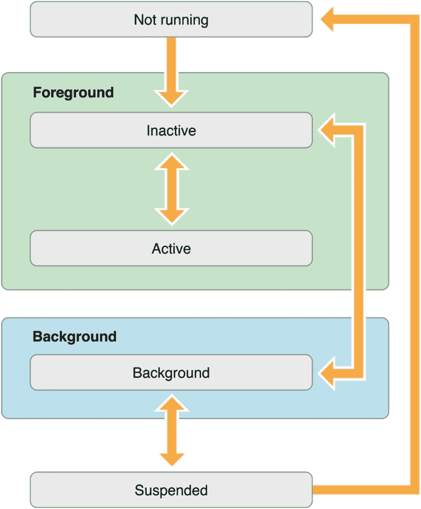

# 针对已有一定 iOS 工作经验的候选人的问题

以下章节包含的问题针对的是经验非常丰富的开发者，通常具有一、两或三年的经验。他们对 SDK 和大多数用于 iOS 开发的库感到舒适和熟悉。他们可能一直在为自己的 iOS 开发框架或架构工作，并且能够识别复杂问题并为其提供解决方案。

## 问题 34：iOS 上是如何处理内存管理的？

每个在 iOS 开发领域工作过一段时间的开发者都应该能从容地谈论这个话题。对内存管理了解不足可能导致内存泄漏、性能低下以及经理、投资者、开发者和用户感到失望。

回答可以从指出 Swift 使用自动引用计数（`ARC`）开始，这本质上与 Objective-C 中的相同。默认情况下，所有引用都是强引用。因此可能出现强引用循环，这使得 `ARC` 无法释放内存。这可以通过使用弱引用来解决。

这个话题可以扩展到讨论无主引用。无主引用用于那些期望永远不为 `nil` 的值，因此必须定义为非可选类型。

此外，讨论的另一个可能方面是关于闭包。

## 问题 35：你对单例了解多少？你会在哪里使用单例，在哪里不会？

单例就是一个只允许一个实例的类。你不能重新创建单例类的实例。

互联网上反复出现的一个原因是“日志记录”类。在这种情况下，可以使用单例来代替类的单个实例，因为日志记录类通常必须被项目中的每个类一遍又一遍地使用。

## 问题 36：你通常如何进行网络请求？

这个话题会非常有趣，并能揭示开发者方法论的许多见解。开发者应该提到他/她使用过的架构和依赖的模式。这些可能包括服务层、MVVM、UI 数据绑定、依赖注入或函数式响应式编程。

开发者使用哪些库？开发者有不同的背景，可能使用 `AFNetworking`、`ReactiveCocoa`……他/她如何确保可以从网络保存数据？从用户点击 UI 组件到数据存储在设备本地，这个过程是怎样的？所选架构中涉及哪些类？开发者如何为离线使用准备应用程序，他/她如何处理缓存？他/她如何定义移动设备的理想 API？他/她是否了解所有的 HTTP 方法（`PUT`、`POST`、`GET`、`DELETE`），以及何时及如何使用它们？

对于上述问题，没有正确/错误的答案。相反，它们提供了一个与经验丰富的潜在同事讨论方法的绝佳机会，通过比较你自己的流程与潜在雇主的流程，这些方法也可能对你有益。

## 问题 37：你如何从 Web 服务器下载 JSON，将其序列化并保存在本地存储中？

这个问题部分源于前一个问题。在这里，开发者可以谈论可以使用的框架。`NSJSONSerialization` 是 Apple 提供的框架，但它有一些 bug 和限制。特别是在数据验证和转换方面存在一些问题。

一个更好的答案是提到第三方库（比如想到 `ObjectMapper` 或 `Mantle`）。此外，讨论如何在逻辑上将 JSON 到逻辑实体以及逻辑实体到存储的过程分离也是相关的。

## 问题 38：你在 iOS 中了解并使用哪些设计模式？

每位接受面试的开发者都应该了解 MVC。这是 iOS 构建的基础范式。开发者资历越深，他/她能讨论的框架就越多。这里，你可以包括 MVVM，它有助于开发者防止出现臃肿的视图控制器。此外，开发者可以解释不同框架的差异和优缺点。

## 问题 39：你如何处理异步任务？

为了处理异步任务，iOS 提供了一种称为 Grand Central Dispatch 的机制。要使用它，你必须创建一个队列（在此上下文中，这类似于一个线程）并传递一个代码块给 `dispatch_async()`，以便在后台执行。

然而，在 iOS 中还可以使用其他几种机制。

*   回调
*   全局队列
*   内存
*   多个任务/代码块

开发者可能想讨论每种替代方案何时使用及其优缺点。

## 问题 40：什么是托管对象上下文，它提供什么样的功能？

托管对象上下文由 `NSManagedObjectContext` 类的一个实例表示。可以将托管对象上下文理解为一组相关对象的临时便笺本。这组对象代表了一个或多个持久化存储的一致视图。一个托管对象实例只存在于一个且仅一个上下文中，但一个对象的多个副本可以存在于不同的上下文中。

托管对象上下文提供的关键功能包括：

*   生命周期管理
*   通知
*   并发


## 问题 41: 你能比较并对比在 OS X 和 iOS 中实现并发的不同方法吗？

在 iOS 中，基本上有三种实现并发的方式。

*   使用线程
*   调度队列
*   操作队列

如果你能识别出所有这些方法，可能还需要讨论它们的各个方面和区别。线程的一个问题是，设计一个可扩展系统的责任在于开发者。她/他必须决定创建多少个线程，并负责在变化条件下手动调整这个数量。

使用 `GCD` 时，这个管理责任被委托给了系统层面。开发者的责任仅仅是定义必须执行的任务并将其添加到调度队列中。这通常能让事情变得更容易。

操作队列是 Cocoa 中并发调度队列的等价物，由 `NSOperationQueue` 类实现。与调度队列不同，操作队列不限于以 `FIFO`（先进先出）顺序执行任务，并且支持为你的任务创建复杂的执行顺序图。

## 问题 42: iOS 中有哪些不同的后台模式？

以下是 iOS 中可用的后台模式：

*   `播放音频`：应用能够在后台播放音频。
*   `位置更新`：设备位置每次发生变化时触发回调。
*   `执行有限长度的任务`：这是 iOS 中“后台运行”的一般情况，应用在后台运行并执行一个操作。
*   `IP 语音 (VoIP)`：应用在后台运行并执行 `VoIP`。

## 问题 43: 你能列举并解释 iOS 应用程序的不同状态类型吗？



图 2-1
iOS 应用生命周期

*   `未运行`：应用尚未启动，或正在运行但被系统终止。
*   `未激活`：应用在前台运行，但当前未接收事件。（不过，它可能正在执行其他代码。）应用通常只在此状态停留很短暂的时间，然后会过渡到其他状态。
*   `激活`：应用在前台运行并正在接收事件。这是前台应用通常所处的模式。
*   `后台`：应用在后台并正在执行代码。大多数应用在进入挂起状态之前会短暂进入此状态。然而，一个请求额外执行时间的应用可能会在此状态停留一段时间。此外，直接启动进入后台的应用会进入此状态，而不是未激活状态。关于如何在后台执行代码的信息，请参见后台执行 [`developer.apple.com/library/archive/documentation/iPhone/Conceptual/iPhoneOSProgrammingGuide/TheAppLifeCycle/TheAppLifeCycle.html`](https://developer.apple.com/library/archive/documentation/iPhone/Conceptual/iPhoneOSProgrammingGuide/TheAppLifeCycle/TheAppLifeCycle.html) 。
*   `挂起`：应用在后台但未执行任何代码。系统会自动将应用移到此状态，并且在此操作之前不会通知它们。在挂起期间，应用保留在内存中但不执行任何代码。当出现内存不足的情况时，系统可能会在不通知的情况下清除挂起的应用，以便为前台应用腾出更多空间。

## 问题 44: copy 和 retain 之间有什么区别？

在一般情况下，保留一个对象会使其保留计数增加一。这有助于将对象保留在内存中，防止它被释放。这意味着，如果你只持有一个对象的保留版本，那么你是与传递该对象给你的人共享那个副本。然而，复制一个对象（无论你如何操作）应该会创建一个具有相同值的另一个对象。可以将其视为一个克隆。你不会与传递对象给你的人共享这个克隆。特别是在处理 `NSString` 时，你可能无法假设给你 `NSString` 的人真正给你的是 `NSString`。某人可能递给你一个子类（在这种情况下是 `NSMutableString`），这意味着他们可能在你不知情的情况下修改其值。如果你的应用程序依赖于传入的值，并且有人更改了它，你可能会遇到麻烦。

## 问题 45: 在 ARC 下，什么能强制一个对象被销毁？

只需将引用这些对象的变量设置为 `nil`。编译器就会在那一刻释放这些对象，如果没有其他强引用指向它们，它们就会被销毁。

## 问题 46: 在 nil 指针上调用方法会发生什么？

在 Objective-C 中，向 `nil` 对象发送消息是完全可接受的。它被视为一个空操作。无法将其标记为错误，因为它本身不是错误。实际上，这可能是该语言的一个非常有用的特性。

## 问题 47: 什么时候必须合成属性？

当它们在协议中声明时。

## 问题 48: 什么是 NSAssert？

`NSAssert` 函数用于确保某个值符合预期。如果断言失败，这意味着出现了错误，因此应用程序会退出。使用 `NSAssert` 的一个原因是，如果你有一个函数，当传递给它的某个参数不是某个特定值（或一个范围内的值）时，该函数的行为会异常或会产生非常糟糕的副作用。在这种情况下，你可以放置一个 `NSAssert`，以确保该值符合你的预期。如果不符合，说明确实出了问题，因此应用程序退出。`NSAssert` 对于调试/单元测试非常有用，也可以在你提供框架时，用于阻止用户进行“有害”操作。

## 问题 49: iOS 中的 Category 是什么？

Objective-C 的类别允许你用你认为合适的任何方法来扩展现有类。这对于向其他类添加辅助方法非常有用，这些方法帮助以该类原本未预期的方式解析数据。你也可以用它来拆分你自己的类，这样，如果你有一个完成多项任务的庞大全能类，你可以只引入那些类别，从而仅选择你需要的部分。

## 问题 50: 你可以用什么来向 NSString 添加一个新方法？

与前一个问题相关，答案将是类别。要向 `NSString` 添加一个新方法，答案将是使用类别。例如：

```
@interface NSString (CategoryName)
-(NSString *) aNewMethod;
@end
```


