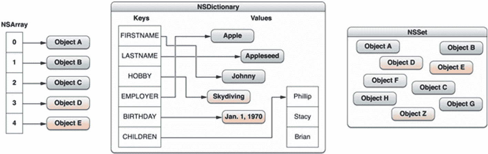

# 3. 我们需要那个人来共同成就伟业！

本章专门针对高级 iOS 工程师——通常是那些拥有多年经验，并且在大量需求各异的项目中工作过的工程师。请记住，经验必须与实际的分析和问题解决能力相结合。例如，雇主不会希望雇佣一个仅仅读过这本书并将其背下来的候选人。

特别是对于本章的问题，你应该鼓励讨论和意见交流。有时，对于实时问题只有一个解决方案，而大多数方案都涉及权衡取舍。你可能需要在代码可用性方面获得优势，而在性能方面做出妥协，等等。

高级开发人员还需要具备领导团队所需的领导力和激励技巧。本书不涉及识别这些技能的可能问题或方法，但我相信读者对于如何识别这些已有一定的想法。高级开发人员在讨论任何话题时都应该从容自信，并且能够接受变化。他们身上应有一种创业精神。他们是促进者而非老板，应该鼓励独立思考和自由思想。

## 问题 67：委托（delegation）和 KVO 有什么区别？

两者都是在对象间建立关系的方式。委托是一种一对一关系，其中一个对象实现一个委托协议，另一个对象使用该协议并发送消息，假设那些方法已被实现，因为接收者承诺遵守该协议。KVO 是一种多对多关系，其中一个对象可以广播消息，一个或多个其他对象可以监听并对其作出反应。

## 问题 68：什么是方法交换（method swizzling）？你会在什么时候使用它？

方法交换是改变现有选择器实现的过程。这种技术之所以可行，是因为在 Objective-C 中，可以通过改变类调度表中选择器与底层函数的映射关系，在运行时改变方法调用。

例如，假设我们想跟踪 iOS 应用中每个视图控制器向用户展示的次数。每个视图控制器都可以在自己的 `viewDidAppear:` 实现中添加跟踪代码，但这会产生大量重复的样板代码。子类化是另一种可能，但这需要子类化 `UIViewController`、`UITableViewController`、`UINavigationController` 以及其他每个视图控制器类——这种方法同样会面临代码重复的问题。

## 问题 69：假设有三个对象：祖对象、父对象和子对象。祖对象持有父对象，父对象持有子对象，子对象又持有父对象。如果祖对象释放了父对象，会发生什么？

会发生循环引用。因为它们相互持有，所以无法将它们从内存中释放。可以通过将其中一个引用设为弱引用来解决这个问题。


## 问题 70：为什么在产品代码中永远不应使用`retainCount`？请给出两个独立且相互不依赖的原因。

你永远不应使用`-retainCount`，因为它从未提供任何有用信息。Foundation 和 AppKit/UIKit 框架的实现是不透明的。你不知道什么正在被保留、为什么被保留、谁在保留它、它何时被保留等等。以下是何时会用到`-retainCount`的例子：
* `[NSNumber numberWithInt:1]` 现在的 `retainCount` 是 9223372036854775807。如果你的代码期望它是 2，那么你的代码现在已经出错了。
* 你可能认为 `@"Foo"` 的 `retainCount` 是 1。但事实并非如此，它是 1152921504606846975。
* 你可能认为 `[NSString stringWithString:@"Foo"]` 的 retainCount 是 1。但事实并非如此，同样是 1152921504606846975。

基本上，因为任何东西都可以保留一个对象（从而改变其`retainCount`），并且因为你无法获得运行应用程序的大多数代码的源代码，所以一个对象的`retainCount`是毫无意义的。如果你试图追踪为什么一个对象没有被释放，请使用 Instruments 中的 leaks 工具。如果你试图追踪为什么一个对象过早被释放，请使用 Instruments 中的 zombies 工具。但不要使用`-retainCount`。它是一个真正毫无价值的方法。

## 问题 71：自动释放池在运行时层面是如何工作的？

每次向一个对象发送`-autorelease`消息时，该对象会被添加到最内层的自动释放池中。当池被排空（drained）时，它只是向池中的所有对象发送`-release`消息。
自动释放池只是一种便捷机制，允许你将发送`-release`的操作推迟到“稍后”。这个“稍后”可能发生在几个地方，但在 Cocoa GUI 应用程序中最常见的是在当前运行循环（run loop）周期结束时。

## 问题 72：遍历 NSArray 和 NSDictionary，哪个更快？

当集合中项目的顺序不重要时，集合（set）在查找集合中的项目时提供了更好的性能。原因是集合使用哈希值来查找项目（就像字典一样），而数组必须遍历其全部内容才能找到特定对象。
图 3-1 展示了 Apple 文档中一个非常具有代表性的说明此点的图片。

图 3-1
*iOS 中的对象集合框架*

## 问题 73：遍历 NSArray 和 NSSet，哪个更快？

对于简单的持有和遍历操作，`NSArray` 比 `NSSet` 更快。在低端情况下，构造数组的速度快达 50%，而在高端情况下，遍历数组的速度快达 500%。如果只需要遍历内容，不要使用 `NSSet`。

## 问题 74：你是否必须实现所采纳协议中的所有声明？

不。如果一个方法被声明为 `@optional`，则不必实现它。

```
@protocol MyProtocol
- (void)requiredMethod;
@optional
- (void)anOptionalMethod;
- (void)anotherOptionalMethod;
@required
- (void)anotherRequiredMethod;
@end
```

如果被要求指出这种方法的风险，开发者应该能够提出这样的观点：如果协议中的一个方法被标记为可选，在尝试调用它之前，必须检查对象是否实现了该方法。

## 问题 75：调用 alloc 和 init 的快捷方式是什么？

`alloc` 和 `init` 通常可以这样调用：
```
[[Class alloc] init]
```
在其他一些代码和文献中，我们也可以看到如下方式：
```
[Class new]
```
最初在 Objective-C 中，对象是用 `new` 创建的。随着 OpenStep/Cocoa 框架的发展，设计者们形成了这样的观点：为对象分配内存和初始化其属性是分开的关注点，因此应该是独立的方法（例如，一个对象可能被分配在特定的内存区域）。所以，`alloc`-`init` 风格的对象创建方式开始流行。基本上，`new` 是旧的，并且几乎——但并非完全——被弃用。因此，你会发现 Cocoa 类有很多 `init` 方法，但几乎没有任何自定义的 `new` 方法。

## 问题 76：哪种指针可以帮助安全地避免内存泄漏？

智能指针在自动管理对象生命周期方面非常有帮助。智能指针是一个包装“原始”（或“裸”）C++ 指针的类，用于管理所指向对象的生命周期。没有单一的智能指针类型，但它们都试图以一种实用的方式抽象原始指针。
应优先使用智能指针而非原始指针。如果你觉得必须使用指针（首先考虑是否真的需要），通常你会希望使用智能指针，因为这可以缓解原始指针的许多问题，主要是忘记删除对象而导致内存泄漏。

## 问题 77：如果你有一个长时间运行的执行循环，什么可以帮助防止内存不足崩溃？

这里的一个关键点是内存泄漏。确保内存正在被清理，并且你没有持有任何阻止对象被回收的引用。同时，在你的应用程序委托中查看 `applicationWillTerminate` 消息。如果你的应用程序被系统终止（例如，由于内存不足）会调用此方法，但如果用户通过按 home 键以通常方式离开应用程序，则不会调用。

## 问题 78：在编写一个显示从远程服务器下载的图片的 UITableViewController 时，有哪些必要的考虑因素？

就其本身而言，编程实现此功能可能是候选人的一个编码任务。然而，如果口头提问，候选人应通过引用如何处理该问题衍生的存储和异步性方面的一些通用准则来回答。需要涵盖的要点包括：
* 仅当单元格滚动到视图中时（即调用 `cellForRowAtIndexPath` 时）才下载图片。
* 在后台线程上异步下载图片，以免阻塞 UI，使用户可以持续滚动。
* 当单元格的图片下载完成后，我们必须检查该单元格是否仍在视图中，或者是否已被另一段数据重用。如果已被重用，我们应丢弃该图片。否则，我们必须切换回主线程，以更改单元格上的图片。

根据对话的精确度，你可能希望将讨论引向如何缓存图片以供用户后续离线使用、占位符的使用等方面。

## 问题 79：什么是 KVC 和 KVO？请举一个使用 KVC 设置值的例子。

KVC 代表“键值编码”。它是一种机制，允许在运行时使用字符串访问对象的属性，而不必在开发时静态地知道属性名称。KVO 代表“键值观察”，允许控制器或类观察属性值的变化。
例如，如果一个类上有一个属性名
```
@property (nonatomic, copy) NSString *name;
```
我们可以使用 KVC 访问它，如下所示：
```
NSString *n = [object valueForKey:@"name"]
```
并且我们可以通过发送以下消息来修改其值：
```
[object setValue:@"Mary" forKey:@"name"]
```


