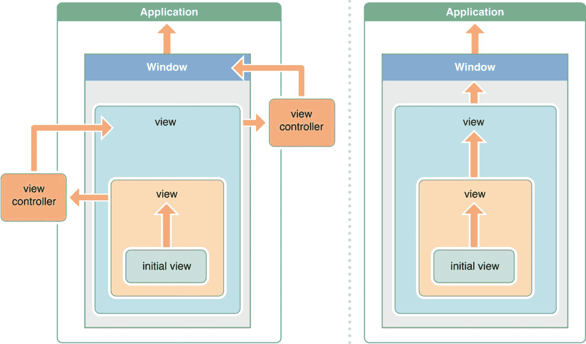

# 问题 81：什么是响应链？

当一个事件发生在视图中时，例如触摸事件，该视图会将事件传递给与 `UIView` 类关联的一系列 `UIResponder` 对象链。第一个 `UIResponder` 是 `UIView` 本身。如果它不处理该事件，则继续向上传递，直到某个 `UIResponder` 处理它为止。该链将包括 `UIViewController`、父 `UIView` 及其关联的 `UIViewController`。如果它们都不处理该事件，则会询问 `UIWindow` 是否能处理，最后，如果 `UIWindow` 也不处理，则会询问 `UIApplicationDelegate`。

由于这是一个相当层次化的结构，可能会要求候选人在白板上画出这个链。绘制类似图 3-2 的图表将能解决问题。

图 3-2

*iOS 中的响应链流程*

