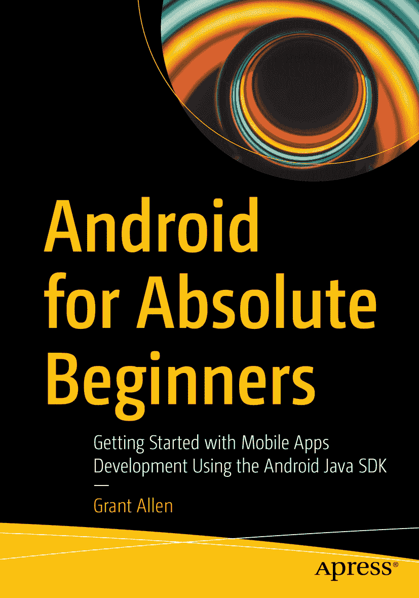

ISBN 978-1-4842-6645-8 e-ISBN 978-1-4842-6646-5 [`doi.org/10.1007/978-1-4842-6646-5`](https://doi.org/10.1007/978-1-4842-6646-5) © Grant Allen 2021

本作品受版权保护。出版商保留所有权利，涉及全部或部分材料，具体包括翻译、重印、重用插图、朗诵、广播、微缩胶片或其他任何物理形式的复制、传输或信息存储与检索、电子改编、计算机软件，或目前已知或未来开发的其他类似或不同方法。本出版物中使用的通用描述性名称、注册商标名称、商标、服务标志等，即使未作特别声明，也不意味着这些名称不受相关保护性法律和法规的约束，因此可供大众自由使用。出版商、作者和编辑假定，本书中的建议和信息在出版之日是真实准确的。出版商、作者或编辑均不对本材料中的内容或可能存在的任何错误或疏漏提供明示或暗示的保证。对于已出版地图中的管辖权主张以及机构归属，出版商保持中立。

本 Apress 印记由注册公司 APress Media, LLC（Springer Nature 的一部分）出版。注册公司地址为：美国纽约州纽约市新广场 1 号，邮编 10004。

*致全世界所有有志于成为新 Android 开发者的人们，愿你们在学习构建新奇而精彩的应用程序时，充满乐趣！*

## 引言

一本面向 Android 开发初学者的书，应提供足够的主题内容来激发想象力，并为未来的学习和实践奠定基础。关键在于，确保内容不会让读者——也就是你——感到负担过重，或不知从何入手。

在本书中，我力求在为你打下启动所需核心概念与技术的坚实基础与不堆砌所有可能最终对你有用的主题之间取得平衡。后者将导致数千页乃至更多的内容，最终适得其反。

你将基于本书 20 章涵盖的主题，看到并创建多种多样的应用程序。我还提供了一系列指引，指向 Apress、Google 及其他网站上更多超越初学者范畴的在线内容。本书只是一个起点，你接下来走向何方完全取决于你自己！

## 致谢

在全球疫情期间撰写一本书是一种奇特的经历，这只有在 Apress 全体同仁和技术审校者的帮助下才得以实现。我要感谢 Steve Anglin、Val Okafor、Mark Powers、Matthew Moodie 以及 Apress 所有其他让本书成为现实的人。

我还要感谢 Google，让 Android 持续成为一个有趣且充满活力的平台，供人们学习开发应用程序。

## 关于作者

## 关于技术审校者

