# 第一部分：获取 Android，开始起步

## 第一章：Android 介绍

欢迎踏上你的 Android 开发者之旅。或许你已经拥有并使用 Android 手机、平板电脑或其他设备。你将加入一个庞大的群体——全球每天有超过十亿台基于 Android 操作系统的设备被使用。即使你认为自己并未使用 Android，你可能会惊讶地发现，它已渗透到种类繁多的设备和产品中，其中许多你或许用过，却未意识到 Android 的强大功能在为你提供帮助。

如今，Android 驱动的设备种类惊人，远超手机和平板电脑，包括智能手表、健身设备、车载娱乐与导航系统、游戏主机、玩具、厨房电器、花园浇水系统、管道与供暖控制系统，甚至烧烤架！没错，烧烤架！Android 在设备上的这种扩展势头丝毫未见放缓，但最普遍、最可能发现 Android 的地方仍然是手机和平板电脑。作为一名初出茅庐的 Android 开发者，这意味着你将学习许多适用于此处提及的所有（或至少是大部分）设备类型的知识，但你初期的最佳焦点很可能应放在学习为 Android 手机和平板电脑构建应用程序上。

### 使用 Android：最佳之处

移动和智能手机开发是过去十几年乃至更长时间里最激动人心的技术故事之一。你个人或许并未经历过每一次曲折，但你很可能接触过智能手机近几个时代中一个或多个时代的设备，并且你很可能听到过诺基亚、苹果、微软、Google 和 Android 这些名字以各种组合被提及。

如今，Android 为你呈现了过去 10 年间这些公司与平台之间伟大技术战役的累累硕果，让你得以乘风破浪，提供出色的工具、能力与帮助，助你踏上 Android 应用开发之路。在本书撰写之际，这或许正是 Android 最引人入胜的魅力所在。它在所有智能手机与移动技术领域（与苹果的 iOS 齐头并进）并驾齐驱，位居前沿。选择 Android，你便能立即获得它带来的诸多优势，包括：

1.  开发者工具与平台：本书将涵盖其中许多内容，仅举几例，如`Android Studio`、`Android SDK`、`Google Play 服务`以及`Google Play`在线商店。

2.  庞大的现有市场：我说有超过十亿用户正等待你的应用程序，并非玩笑，而且未来还有更多潜在用户。如图 1-1 所示，Android 在全球市场的渗透率令人惊叹。

3.  志同道合的全球开发者社区：你在追求 Android 应用开发梦想的道路上并不孤单。有数万、数十万乃至数百万其他开发者拥有可以分享的经验。

4.  坚如磐石的技术基础：Android 最初采用 Java 编程语言作为构建应用程序的主要技术。如今，它也支持`Kotlin`和`C++`。本书中的示例与技术探讨将坚持使用 Java，因为它是现存使用最广泛、最受尊敬且最为成熟的开发技术之一——绝大多数 Android 应用程序都是用 Java 构建的。

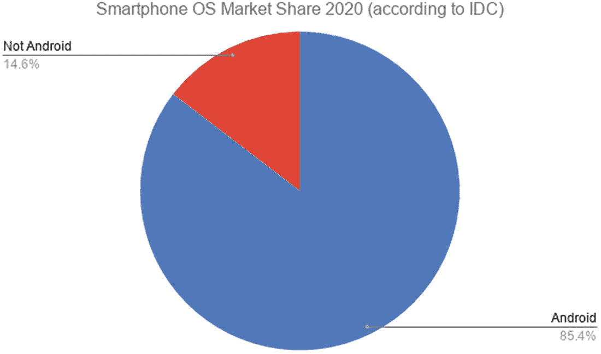

**图 1-1** Android 在智能手机用户中的全球市场份额

我还可以继续列举更多例子，来说明 Android 开发世界的广度与深度及其优势，但不如让本书的其余部分来展示更多内容。


### 使用 Android 开发：挑战与难点

如果不坦诚指出 Android 虽然优点众多，但也存在挑战，那便是不够诚实。好消息是，其中许多挑战不仅广为人知，而且易于应对。以下是一些新开发者很快会遇到的方面：

1.  你是在为小型设备进行开发。无论是 Android 手机、Android 平板、车载仪表盘，还是其他各种外形规格的设备，你都需要应对的一个常见限制就是屏幕尺寸。我们将在讨论如何用虚拟设备模拟 Android 设备时深入探讨这个话题，但请始终牢记，你坐在台式机或笔记本电脑前为 Android 构建应用的体验，与你的用户在手机和平板上的实际体验是不同的。

2.  目光要超越屏幕本身。别让狭小的屏幕成为你在应用中提供强大功能和酷炫特性的唯一途径！正如你将看到的，后续章节会探讨诸如声音和音频、板载传感器、振动等更多内容。不要受困于屏幕——你手中可用的工具远比想象的要多。

3.  替代方案只需轻轻一划。每个拥有 Android 设备（或任何智能手机）的人，都对众多应用有着切身体验。用户拥有选择权，同时也会在手机上运行其他各类应用。这意味着你的应用可能需要与其他应用共享资源和用户的注意力，而且用户可能会做出你意想不到的各种操作！

4.  Android 并非始终如一。本书将涵盖最新版本的 Android，包括 Android 11（在撰写本书时已发布近一年），并预览 Android 12（作为谷歌年度 Android 更新周期的一部分，将于今年晚些时候发布）。然而，在市场上，本章前面提到的超过十亿用户正在使用更早的 Android 版本。不仅仅是 Android 10 或 Android 9，而是从 Android 4 甚至更早的版本开始！Android 在鼓励（甚至允许）用户升级方面有着复杂的历史，在决定要瞄准这十亿用户市场中的多大比例时，这一点需要谨记。

无论如何，不要因为这些挑战而气馁。不妨将它们视为你踏上 Android 应用开发之旅时需要学习的第一课。

### 理解 Android 的传承及其对你的影响

Android 的历史可以追溯到 2003 年。那年 10 月，一群帕洛阿尔托的开发人员聚在一起，以 Linux 内核为基础，怀揣着开创一个拥有更强大界面的设备新时代的梦想。在经历了初创期的挣扎后，谷歌于 2005 年收购了 Android 业务，其联合创始人安迪·鲁宾加入谷歌，继续致力于为智能手机及其他设备开发操作系统。

2008 年，经过几次波折，谷歌与其合作伙伴 HTC 及 T-Mobile 发布了第一款手机，根据所在国家不同，它被称为 "Dream" 或 "G1"。我本人的 G1 至今仍能运行，但已不再是日常主力机。图 1-2 展示了我的 G1 在原始锁屏界面下的样子。


图 1-2

作者于 2008 年拥有的原始 G1 Android 手机

首次发布后，Android 的发展势头逐渐增强，操作系统更新开始以甜点名称作为代号出现——Cupcake、Donut、Éclair 等，分别对应版本 1.5、2.0 和 2.1。

大约在首次公开发布的同时，谷歌还与电信运营商、芯片公司及手机制造商合作，创建了开放手机联盟，旨在建立一个广泛的联盟来支持 Android 的未来发展。谷歌还着手建立了 "Android 开源项目"，作为 Android 基本开源代码的托管方。

Android 的故事远不止于此，众多新软件版本和新制造商不断加入这场盛宴。然而，上述几点是 Android 开发者构建应用时必须面对的若干问题的低调开端。

由于众多公司都投身于制造 Android 手机，谷歌并未直接控制 Android 在每个制造商设备上的维护方式，也未控制主要市场的电信运营商如何通过合约、销售等方式管理手机的用户生命周期。自 Android 最初发布以来，随后的几年里呈现出的市场格局是：存在大量不同设备，运行着众多不同版本的 Android，且升级保障非常不完善。这在 Android 领域被称为碎片化问题。

对于开发者而言，这意味着为 Android 构建应用需要额外花心思考虑市场上现有设备的构成及其运行的 Android 版本。在撰写本书时，谷歌已做出多方努力来减轻这一问题的影响，并鼓励制造商升级设备，这已初见成效。谷歌还增加了一系列开发者功能，以减轻你（也就是开发者）应对这个多样化市场所需付出的努力，我们将在后续章节中讨论其中几个功能。

作为本主题的结尾，图 1-3 展示了 2020 年中期全球正在使用的 Android 版本分布情况。

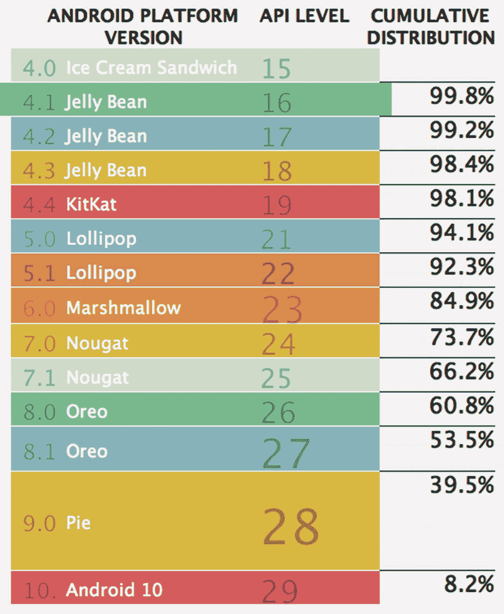

图 1-3

2020 年正在使用的 Android 版本及 API 级别

请注意这些数字呈现方式上略带的自卖自夸倾向。这里并未报告每个 Android 版本的实际设备占比，而是展示了运行特定版本或更高版本的设备的"累积分布"。通过简单计算就能得出真实的绝对百分比。例如，11.2% 的设备运行 Android 6.0 "Marshmallow"，这是其 84.9% 的累积分布与 Android 7.0 的 73.7% 累积分布之间的差值。在撰写本书时，Android 11 已发布数月，但尚未出现在统计数据中。Android 12 计划于今年晚些时候发布，仅对 Android 11 进行小幅调整。可以肯定的是，Android 11 以及随后的 Android 12 将会在统计数据中迅速攀升，成为学习 Android 开发的良好基础。

这番讨论的要点是：为了覆盖足够比例的 Android 设备，你需要支持过去几个版本的 Android 功能，而非仅仅迎合最新的尖端技术。

### 理解 Android 的未来

像 Android 这样已拥有数十亿用户的系统，无疑可被视为巨大的成功。但 Android 在大量新领域仍有充足的增长空间和机遇。例如，当前的焦点很大一部分集中在 Android 将如何成为未来"混合计算"的一部分。在这种混合模式下，一些设备的部分操作使用 Android，像今天的智能手机一样提供应用，但在执行其他任务时切换至第二个操作系统（如 Chrome OS）。

Android 自身也将沿着常规的更新路径发展，许多优秀的在线服务（如 Google Play 和其他云服务）亦是如此，这将进一步拓展 Android 设备和 Android 应用的可能性边界。


## 本书后续内容预览

《Android 入门经典》旨在带领读者开启首次软件编写之旅，学习那些能为未来应用开发目标奠定基础的方法、技巧与思路，同时掌握计算机程序构建的诸多基本原理。我们自然会将 Android 作为学习的目标环境，也会以其为灵感源泉探索各种可能性，并以此为基础涵盖许多你在其他软件开发领域也会遇到的主题。

本书共分为四大板块，每个板块都针对你在阅读内容和示例的过程中，逐步加深对 Android 应用开发及 Android 系统本身的理解而设计。各板块章节涵盖以下主题。

### 剩余章节详解

**第 1 章 Android 简介：** 你正在阅读的就是它！你已经了解了 Android 的大部分介绍内容，再过几页就将开始你的第一个 Android 应用开发。

**第 2 章 Android Studio 简介：** 我们将介绍构建 Android 应用最流行的工具集——Android Studio，以及如何获取这款免费软件。我们还会简要了解一些 Android Studio 的替代方案，以及如何关注新版本、新功能和其他 Android 应用构建方式的变化。最后，我们将介绍"模拟"Android 手机的概念——Android 虚拟设备（AVD），它能让你的电脑模拟 Android 手机，为你提供一个无需操作真机即可测试应用的"游乐场"。

**第 3 章 你的第一个 Android 应用，现在就开始！：** 没错，就是这样。你将直接着手创建自己的第一个 Android 应用，无需等到读完本书！第一个示例会非常简单，但它将为我们后续所有章节的扩展奠定基础。

**第 4 章 探索你的第一个项目：** 在本章中，我们将用虚拟放大镜仔细审视你在第 3 章中创建的示例，逐一分析第一个应用的各个组成部分，了解它们从何而来、有何作用以及为何处于相应位置。

**第 5 章 深入 Android Studio：** 如果你打算在未来的开发中使用这套集成工具，那么深入掌握其功能将是必修课。本章将探讨 Android Studio 的所有关键方面，包括代码编辑功能、调试器、性能分析工具等。

**第 6 章 掌握你的完整开发者生态系统：** 这将完善你对开发过程中可以且将会使用的所有工具的理解。本章将探讨 Android Studio 集成环境之外但对其至关重要的工具，包括 Java 开发工具包（JDK）、Gradle、代码与应用版本控制系统、Android 虚拟设备管理，以及环境中的其他关键部分。我们还将讨论可能影响你 Android 开发之路的开发者硬件因素。

**第 7 章 Java for Android 开发入门：** 准备好用 Java"升级"了吗？无论你当前的知识水平如何，本章都将重点介绍 Android 开发所需的 Java 编码关键领域，并提供扩展 Java 专业知识的更多资源。

**第 8 章 XML for Android 开发入门：** Android 应用行为的许多方面都由 XML（可扩展标记语言）数据控制。本章将带你了解 XML 的基础知识，以及如何将 XML 应用于 Android 应用的各个方面，包括应用的清单文件、用户界面等。

**第 9 章 探索 Android 概念：核心 UI 组件：** 在第 8 章的基础上，我们将探讨如何使用标准组件布局 Android 用户界面，例如菜单、字段、列表、图像等屏幕控件。本章还将介绍活动的关键概念——Android 用户界面的基本构建块。最后，我们将概述 Android Jetpack，这是一个现代化的库，在提供当代布局方法的同时保持向后兼容性。


## 1. 探索 Android 概念：布局与更多

本章将扩展您对 Android 所有用户界面组件的掌握范围和理解深度，并基于第 8 章和第 9 章的内容进一步展开。

## 2. 理解 Activity

掌握了前几章的用户界面概念后，您将探索作为所有 Android 应用程序基本构建块的 Activity 的全部功能。

## 3. 介绍 Fragment

您将学习 Fragment 的广义概念，该概念为支持多种屏幕尺寸和布局选项的开发提供了强大动力。

## 4. 在 Android 中使用声音、音频和音乐

在本章中，我们将探讨应用程序中音频的所有方面，包括音频播放、应用程序中的声音使用、音频录制，甚至在 Android 设备上创建音频。

## 5. 在 Android 中使用视频和电影

如果您是一位初露头角的史蒂文·斯皮尔伯格、索菲亚·科波拉，甚至只是 YouTube 明星，本章正适合您。我们将介绍 Android 的视频捕获和播放功能，以及如何将这些功能整合到您的应用程序中。

## 6. 介绍通知

通过使用 Android 提供的事件框架和通知系统，突破应用程序的边界。

## 7. 通过调用探索设备功能

Android 世界的可能性远不止屏幕上显示的内容。我们将研究呼叫能力、访问传感器以及其他信息。

## 8. 理解 Intent、事件和接收器

在每个 Android 应用程序的背后，都有大量的后台功能在维持其运行。本章涵盖了 Android 平台的核心概念，并展示了它们如何塑造和影响您的应用程序。

## 9. 介绍 Android 服务

在本章中，我们将探讨如何与其他代码和应用程序协作，以丰富您自己的应用程序及其为用户提供的功能。

## 10. 在 Android 中使用文件

Android 使您能够处理多种数据、配置文件和其他文件。本章将带您了解 Android 应用程序在何处以及如何利用传统文件来增强用户体验。

## 11. 在 Android 中使用数据库

数据驱动着每一个应用程序，了解如何存储、管理和使用应用程序数据是打造优秀应用的关键。本章将介绍 Android 提供的多种数据处理方式。

以上对未来内容的预览到此结束。事不宜迟，让我们马上开始。第 2 章就在下一页等着您！

## 2. 介绍 Android Studio

在本章中，我们将介绍 Android Studio，这是您编写 Android 应用程序软件时使用的主要工具。虽然您还会依赖一系列其他软件，但 Android Studio 集成开发环境（IDE）将是让您想法成真的核心。您可以将它视为用于编写软件的软件。

如果您过去有过任何软件开发的经历，可能会觉得其中一些概念很熟悉。如果是这样，请直接跳到本章后面的部分，那里会直接深入探讨如何在您选择的平台上安装 Android Studio。当然，您也可以继续阅读，看看这个主题有没有什么新的或有趣的内容。

现在，让我们深入探讨您作为 Android 应用程序开发者将使用的最重要工具集——Android Studio！

### 理解什么是集成开发环境（IDE）

在深入之前，让我们为那些从未接触过此术语或完全编程新手定义一下 IDE 的含义。“集成开发环境”这个术语几乎是不言自明的，但也不完全是。我们来拆解一下：“开发环境”部分简单地指代开发者进行开发的环境（从软件意义上讲）。这类似于说 Microsoft Word 或 Google Docs 是作者的“写作环境”——他们进行写作的地方。

“集成”这个词也很直接，但知道集成了什么，是理解 IDE 整体的关键。为了进一步延伸我们的写作类比，作为一名软件开发者，您也将进行“写作”，但您的写作内容将是 Java 以及可能的其他几种语言编写的、人类可读的编程代码。为此，每个 IDE 都包含（集成）了一个代码编辑器，您可以在其中编写实际的原始代码。目前看来，一切都很简单。

正如 Microsoft Word 为作者提供了一些额外的捆绑工具，如拼写检查和在线词典释义查询，IDE 同样会将其他工具整合进来，并以集成的方式提供给软件开发者。除了代码编辑器之外，通常还有语言参考工具，以便您查阅软件库的工作原理；构建工具，将您编写的代码编译成可工作的软件；调试工具，帮助您识别和理解问题与错误；以及众多其他工具，如性能分析器、代码格式化器、语法高亮器、实时检查工具、网络监视器等。

IDE 的核心在于所有这些工具都是集成的，并且或多或少能良好地协同工作，无需开发者手动在工具之间传递信息。在 IDE 出现之前，这就是开发者不那么光鲜的日常工作。有了像 Android Studio 这样的 IDE 来处理繁琐、复杂和重复的操作，您就可以解放出来，专注于编写应用程序时创造性的问题解决方面，而无需过多担心底层的基础设施。

### Android Studio 的历史与渊源

当 Google 首次为 Android 发布开发者工具时，它瞄准了当时最流行的开源开发环境之一——Eclipse。它发布了一套插入 Eclipse 的工具，称为 Android 开发者工具（ADT）。这种 Eclipse 与 ADT 的组合满足了许多 Android 开发者多年的需求。时光飞逝，十多年过去了，尽管 Eclipse 仍然是一个非常流行的 IDE，但许多其他 IDE 已崛起或衰落，而 Google 向来热衷于处于此类变革的前沿。

2013 年，Google 宣布与 JetBrains 公司合作。JetBrains 开发了一款名为 IntelliJ IDEA 的现代 IDE，主要专注于为构建基于 Java 的应用程序的开发者提供一流的体验。这款新的合作产品将基于 IntelliJ IDEA，并命名为 Android Studio，作为完全免费的 Android 开发 IDE 发布。Android Studio 1.0 版本于 2014 年底发布。在随后的几年里，Google 宣布 Android Studio 将是开发 Android 应用程序的首要 IDE，并且将停止对其他工具的投入。但这并没有阻止 Eclipse 的粉丝们继续使用 Eclipse、ADT 以及其他一系列工具——我们将在本章末尾讨论这类替代方案。


#### 为你的平台下载 Android Studio 安装程序

现在你已经掌握了足够的背景信息，能够理解 Android Studio 的重要性以及它在你未来的 Android 应用开发中将扮演的角色。是时候获取 Android Studio 并开始编码了！

下载 Android Studio 安装包的首选位置就是 Android 官方网站本身。你可以从[`www.android.com/`](http://www.android.com/)首页开始，或者直接进入 [`https://developer.android.com/studio`](https://developer.android.com/studio) 的开发者下载页面。

需要指出的是，在印刷版（或电子版）书籍中引用网址时，通常的提醒依然适用。网址随时都可能发生变化。如果你在本书出版后的某个时间阅读这段内容，[`https://developer.android.com/studio`](https://developer.android.com/studio) 这个直链可能已经改变——但 [`www.android.com/`](http://www.android.com/) 首页将始终存在，并帮助你导航到谷歌未来可能将下载页面移至的任何位置。

对于 Linux 操作系统用户，至少还有另一种选择，即使用 Snap 打包方式，我们稍后将讨论这一点。

### 了解 Android Studio 版本

进入下载网站后，你会立即看到“Download Android Studio”（下载 Android Studio）选项，如图 2-1 所示。请仔细查看按钮下方的文字。在我的示例中，显示的是“适用于 Linux 64 位的 4.0 版本（865 MB）”。

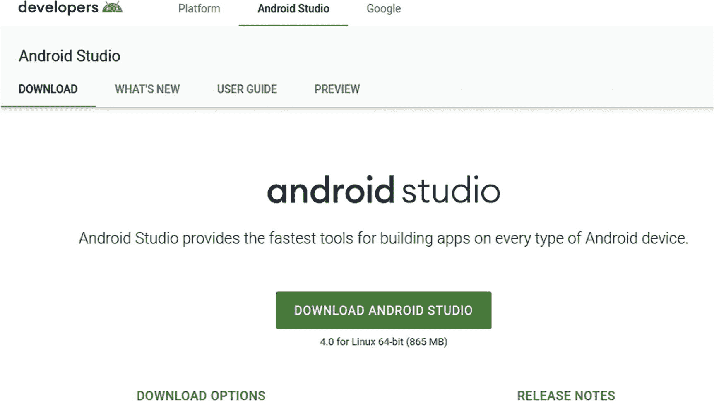

图 2-1

`developer.android.com/studio` 下载页面，显示 Android Studio 4.0

这里的“4.0”指的是 Android Studio 的版本，这引出了版本、Android、Android Studio 以及 Android 软件开发工具包（SDK）的话题。作为开发者，你需要了解的总体概念是：Android 的版本——即运行在用户设备上的软件——与 Android Studio 的版本没有直接关联。这意味着，当你使用 Android Studio 开发应用时，你可以通过各种方式来控制你的应用将支持哪些 Android 版本（从而支持哪些设备）。

### 理解 Android Studio 与 Android SDK 的协同工作原理

Android 操作系统的各个版本会提供一系列功能，开发者可以通过在代码中集成 Android SDK 来访问这些功能。谷歌会定期发布 Android SDK 版本，有时甚至在一年内发布多次。你安装的 Android Studio 可以安装和使用许多不同版本的 Android SDK——而且事实上，你几乎肯定会用到多个版本。随后，在创建应用时，你将能够指定如何选择 SDK 版本以及支持该 SDK 功能的 Android 版本。我们将在第 3 章中详细讲解这一过程，所以现在不必被这种版本“切换”弄得不知所措。

#### 为使用 Android Studio 做准备

由于本章前面概述的诸多原因，Android Studio 是 Android 开发领域领先的集成开发环境（IDE）。它几乎拥有新老 Android 开发者制作各种应用所需的一切。几乎是！作为新的 Android 应用开发者，你还需要考虑其他一些方面，以完善你的开发者工作环境。

总的来说，值得庆幸的是，这些需要考虑的方面数量不多且易于理解。本质上，它们如下所示：

1.  我将使用什么台式机或笔记本电脑硬件进行 Android 开发？
2.  我的台式机/笔记本电脑将运行什么操作系统？
3.  我的系统在使用 Android Studio 之前需要满足哪些前提条件？
4.  在开发过程中，我将使用哪些 Android 手机（如果有的话）？

接下来，让我们从入门推荐最低配置的角度，逐一查看这些方面，这样你就能快速行动，在本章稍后部分安装 Android Studio 本身。

### 为 Android 开发选择台式机或笔记本电脑硬件

首先，有个好消息。你现有的几乎任何计算机都能成为你 Android 开发之旅的绝佳起点。过去十年间生产的几乎任何计算机都具备支持 Android Studio 的基本计算能力，能让你在学习核心概念的同时构建你的第一个应用。事实上，有些开发者从不费心去更换他们的“日常用机”，因为他们的需求并没有那么苛刻。

然而，可能有一天，你会想要思考自己从事 Android 应用开发的认真程度，以及更好的设备能为你带来哪些好处。或者，你现在正好在考虑购买一台新电脑，并想提前规划好能让应用开发更快、更高效的计算资源。我们将在第 6 章中探讨更强大的开发硬件、配件以及完整开发者环境的所有方面。如果你正在考虑如何提升现有电脑性能或为 Android 开发购买新设备，可以随时跳到第 6 章阅读。但对于那些只想确保现有设备能够胜任的读者，以下是你需要根据谷歌推荐的 Android Studio 最低配置来确认的一些关键考量：

1.  **CPU：** 好消息是，过去几年生产的几乎任何 CPU 都足以胜任 Android 开发的入门需求。
2.  **内存：** 谷歌建议至少 4 GB 的 RAM，并推荐 8 GB 作为首选基准。这些内存中的大部分将用于虚拟设备模拟，其余部分则供 Android Studio 本身使用。低于最低配置也能勉强运行，但在试用你的应用时，性能将会受到影响。
3.  **存储：** 虽然最低推荐配置是 2 GB，谷歌也倾向于 4 GB，但实际情况是，存储空间越大越好。2 GB 能让你完成基本的 Android Studio 安装、创建一个虚拟设备，并需要经常进行清理工作，删除不需要的项目以释放空间。4 GB 会好一些。如果可能的话，清理出 5–10 GB 的空间，能让你轻松不少。
4.  **屏幕：** 谷歌建议屏幕分辨率至少为 1280 `×` 800。然而，没有说明的是，这只是针对 Android Studio 本身的建议，即你编写代码和测试应用的环境。当你考虑到开发环境与用户手机屏幕存在巨大差异时，关于屏幕分辨率还有一整套复杂的考量。目前，先遵循谷歌的指导方针，但我们将在第 6 章和其他章节中重新讨论屏幕这一话题。

### 为你的计算机选择操作系统

谷歌使 Android Studio 可供所有主流操作系统使用，包括 Linux、macOS、Windows 以及它自己的 Chrome OS（本质上是一个换肤版的 Linux）。除非你打算购买新电脑，否则你当前电脑运行的操作系统就是不错的选择。我们将在第 6 章中进一步深入探讨理想的开发者环境设置细节，包括操作系统的选择。


#### 继续下载安装程序

现在你已经熟悉了 Android Studio 版本的细微差别以及硬件和操作系统的选择，可以继续下载并安装 Android Studio 了。正如本章前面提到的，在页面 [`https://developer.android.com/studio`](https://developer.android.com/studio) 上，你的操作系统应能被自动检测到，并且该平台的下载按钮会十分醒目。你在之前的示例中，从一台 Linux 机器访问该网站时已经看到了这一点。在我的 MacBook 上，页面正中央醒目地显示着“下载 Android Studio”选项，下方还附有“适用于 Mac 的 4.0 版本”字样。

如果你是在另一台机器上下载，而非你计划用于 Android 开发的那台，请确保为你打算使用的机器选择合适的 Android Studio 版本。如果目标机器运行的是不同的操作系统，请向下滚动页面至“Android Studio 下载”标题处，在那里你会看到 Android Studio 所支持的每个操作系统的选项。

**Windows 备选方案**

Android 开发者网站上的安装选项列表包含两个 Windows 版本。第一个是可执行安装程序，文件名格式为 `android-studio-ide-193.6514223-windows.exe`（其中 `android-studio-ide` 后面的数字是构建版本号，会随时间变化）。第二个是 zip 文件，文件名格式为 `android-studio-ide-193.6514223-windows.zip`。我建议你使用第一个选项，即常规的可执行安装程序。这可以为你处理各种问题，包括目录位置、你在 Windows 下正常使用的账户权限，以及共享机器上其他账户的权限。

点击相关选项，为你的操作系统下载合适的 Android Studio 版本，并记下浏览器将下载文件保存的位置。在 macOS、Linux 和 Windows 上，这通常是你的用户 `Downloads` 目录，但如果你选择将其放在其他位置，则可能有所不同。

随着 Android Studio 4.0 版本的发布，总下载大小接近 1 GB，因此可能需要几分钟才能完成下载。

#### 在 Windows 上安装 Android Studio

假设你遵循推荐路径，使用 Windows 的可执行安装程序，你可以通过双击可执行文件从下载位置启动安装程序。在撰写本文时，该文件名为 `android-studio-ide-193.6514223-windows.exe`。所有最新版本的 Windows 都会通过用户帐户控制（`UAC`）机制提示你允许继续安装，以确保你明确同意完成安装所需的提升权限。

安装完成后，你应该会在“开始”菜单中看到 Android Studio 的新菜单项。

#### 在 macOS 上安装 Android Studio

与 macOS 上的大多数应用程序安装一样，安装 Android Studio 非常简单。在你的 Mac 上打开 Finder，浏览到你下载 Android Studio 安装程序的目录。你应该会看到一个 DMG 文件，其名称类似于 `android-studio-ide-193.6514223-mac.dmg`——这是 Android Studio 4.0 安装程序的 DMG 文件。双击此磁盘映像文件，你的 Mac 会首先验证下载内容，这实际上意味着它会检查 Google 用于准备磁盘映像的代码签名证书和/或公证。验证完成后，你应该会看到典型的 DMG 安装窗口，如图 2-2 所示。

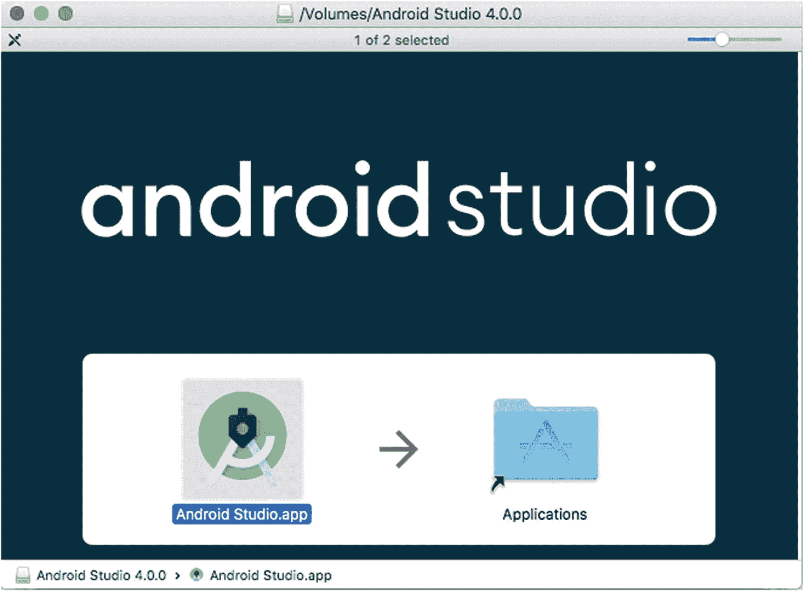

图 2-2

macOS 上的 Android Studio DMG 安装窗口

将 Android Studio 应用程序图标拖到“应用程序”文件夹中，这将触发你的 Mac 像正常复制任何 Mac 应用程序一样复制安装包。完成后，即可从“应用程序”菜单和文件夹中使用 Android Studio。

#### 在 Linux 上安装 Android Studio

你在 Linux 上下载的 Android Studio 安装程序是一个 gzip 压缩的 tarball 文件，文件名如 `android-studio-ide-193.6514223.tar.gz`。就 Android Studio 而言，将此文件解压缩到你选择的目录即为安装。决定你要将 Android Studio 安装在何处：例如，你可能希望将其放在用户帐户的主目录下，或者 `/opt` 等其他目录中。当你解压这个压缩的 tarball 时，会发现它在你指定的位置创建了一个名为 `android-studio` 的目录，所有文件和子目录都将位于该目录下。这意味着你无需再创建一个名称类似的父目录。例如，我无需创建 `/home/grant/android-studio` 目录，因为解压 tarball 也会创建这一级目录——而且我也不希望出现 `/home/grant/android-studio/android-studio` 这样的路径，这完全没有必要。你为 Android Studio 选择的目录将在 Android Studio 内部文档中被称为“安装主目录”。

打开你喜欢的 shell，例如 `bash` 或 `zsh`，并将目录切换到你希望放置 Android Studio 的父目录下。确保你对该目录拥有写入权限。记下你下载压缩 tarball 文件的位置——在本例中，是 `/home/grant/Downloads` 目录，我也可以将其称为 `~/Downloads`。运行以下 `tar` 命令，该命令将指示它解压缩、解压并验证最终展开的文件集：

```
tar -xvzf ~/Downloads/android-studio-ide-193.6514223.tar.gz
```

屏幕上会滚动显示若干屏的状态信息，最终你会返回到 shell 提示符。运行 `ls` 或打开你喜欢的文件管理器，你会看到 `android-studio` 目录已经创建。在该目录中，你会找到一个名为 `Install-Linux-tar.txt` 的文件，阅读该文件可以了解关于进一步调整安装以及如何实际运行 Android Studio 二进制文件的一些基本说明。我先为你揭晓答案！你将在 `android-studio` 目录下看到一个 `bin` 目录，其中包含一个名为 `studio.sh` 的 shell 脚本。执行此 shell 脚本即可启动 Android Studio。我们将在本书后面再讨论 `Install-Linux-tar.txt` 文件中提到的其他一些配置选项。

**立即安装 Snap！**

除了 Linux 的典型安装选项外，还有其他选择，其中之一遵循了近年来 Linux 上应用程序打包版本的趋势，这些版本完全自包含，将所有依赖项和库捆绑到一个包中。这种方法的典型代表是 Canonical（以 Ubuntu 闻名）推广的 Snap 打包，以及源自 XDG 的 `freedesktop.org` 工作的 Flatpak。

对于支持 Snap 包的 Linux 发行版（理论上所有发行版都支持），你可以让包管理器为 Android Studio 安装 Snap。例如，在 Ubuntu 20.04 下，你可以直接运行

```
sudo snap install android-studio
```

关于 Snap 方法有一点需要注意：从 [`https://developer.android.com`](https://developer.android.com) 的官方网站下载会提供 Android Studio 最新的修补版本，而依赖 Snap 方法则意味着依赖 Snap 包的维护者和打包者来保持其更新。理论上，这种维护是完全可能的，有些人声称它和依赖正常安装的软件的维护与修复一样简单，甚至更简单。然而，你从在线软件包仓库中获取的 Snap 包可能不是最新的。


### 安装后继续配置 Android Studio

在计算机上安装 Android Studio 后，还需要执行一些一次性的设置步骤才能开始使用。幸运的是，Android Studio 本身会引导你完成这些设置步骤。如果安装后尚未启动 Android Studio，现在请启动它。你应该会看到如图 2-3 所示的启动画面。

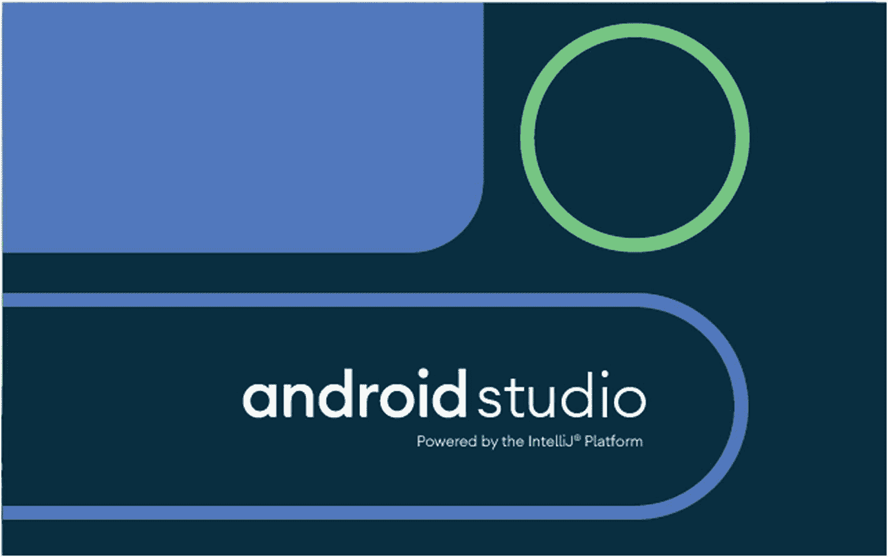

**图 2-3** – 启动 Android Studio 时显示的启动画面

首次加载 Android Studio 后，启动画面将消失，你应该会看到设置向导的起始界面（可能一闪而过），然后系统会提示你从计算机上任何先前版本的 Android Studio 导入设置，如图 2-4 所示。

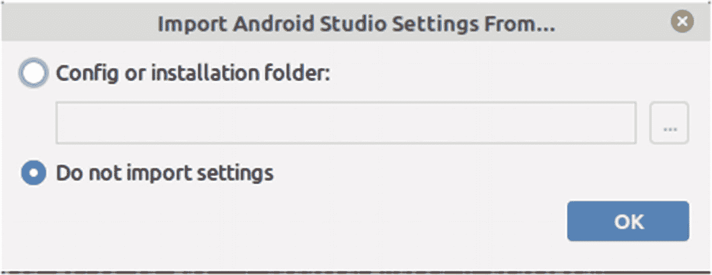

**图 2-4** – 首次运行 Android Studio 时显示的导入设置选项

就本章而言，我们假设没有旧设置需要导入。你可以选择“不导入设置”选项，然后点击 `OK` 按钮。接下来，设置过程会弹出一个提示，询问你是否要共享使用数据（例如使用的功能和访问的库），如图 2-5 所示。

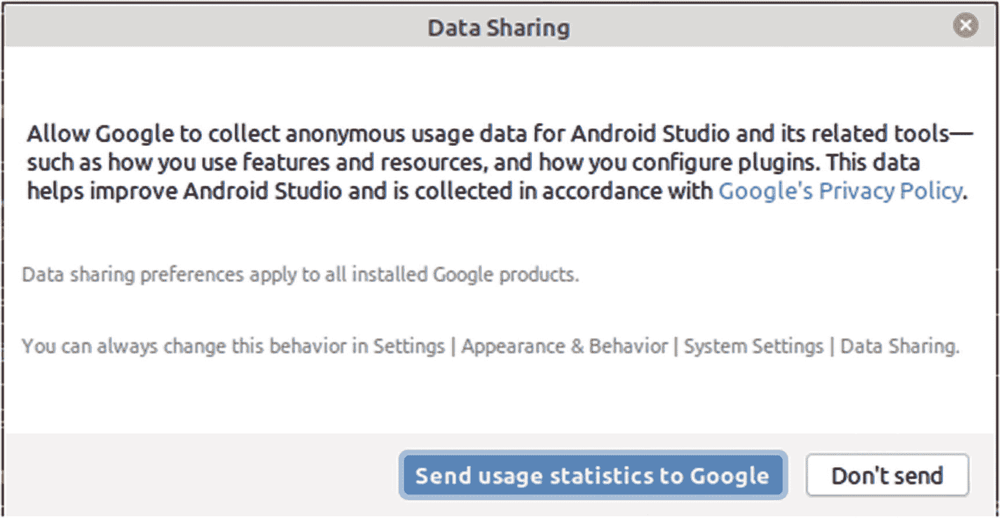

**图 2-5** – Android Studio 设置期间的数据共享提示

是否要与 Google 共享你的使用统计信息完全取决于你。这不会影响你使用的 Android Studio 的功能或行为——尽管它有助于在未来的版本中进行错误修复和改进。

做出使用统计信息的选择后，你将看到 Android Studio 设置向导的登录页面，如图 2-6 所示。

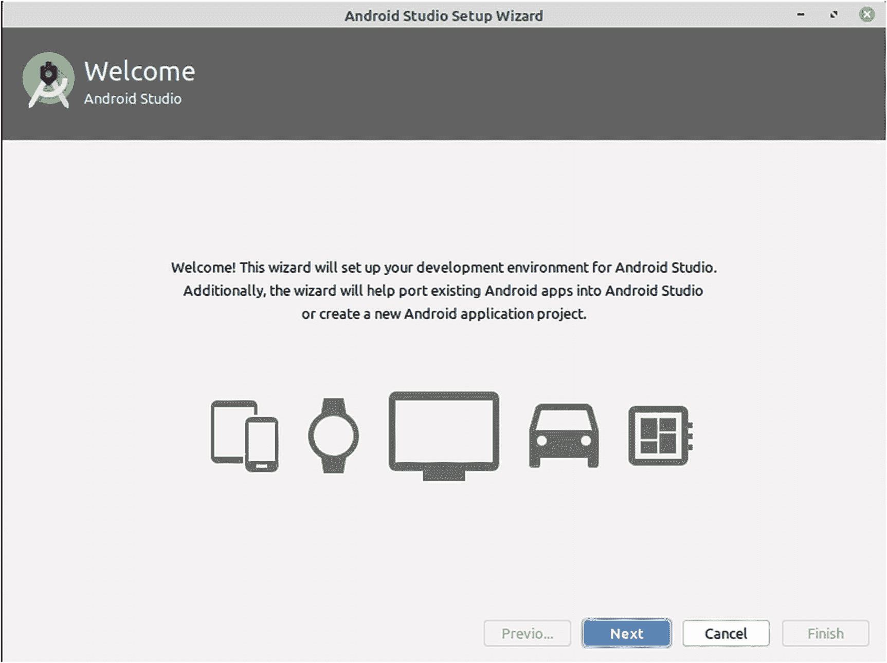

**图 2-6** – Android Studio 设置向导主页

此时，你实际上并没有太多选项。你可以点击 `Next` 按钮继续执行设置向导，或者点击 `Cancel` 按钮稍后再回来处理。

假设你感觉大胆进取——我觉得这个猜测很安全，因为你已经买了这本书——请点击 `Next` 开始完成设置向导的最后部分。你将看到选择标准或自定义安装类型的选项，如图 2-7 所示。

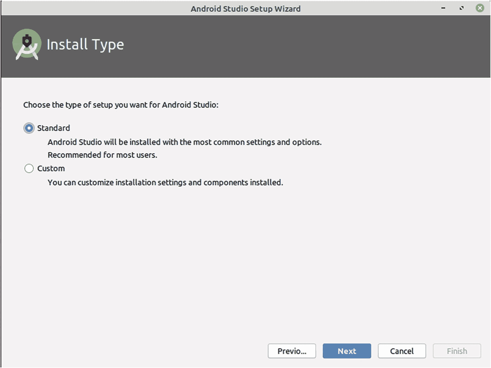

**图 2-7** – Android Studio 设置向导中的安装类型选择页面

`Custom` 设置选项允许你执行诸如更改安装位置、选择要下载的 Android SDK 版本等操作。我们将在第 5 章中更详细地讨论这些项目。现在，你可以选择 `Standard` 安装类型，然后点击 `Next` 按钮。

接下来你的选择在很大程度上是外观性的，你将可以选择用户界面使用“浅色”或“深色”主题，如图 2-8 所示。

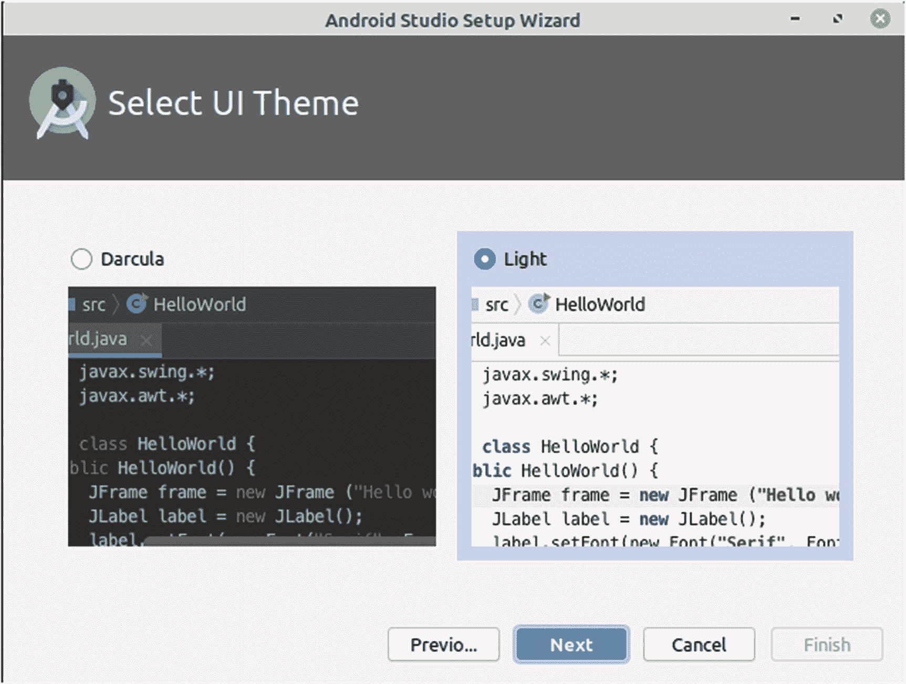

**图 2-8** – 在 Android Studio 中选择 UI 主题的选项

对于使用 OLED 显示屏的用户来说，浅色和深色主题之间的功耗差异微乎其微。对于其他人来说，这只是外观偏好。就本书而言，我将使用 `Light` 主题，因为这样可以为本书的任何印刷版本节省墨水。确定自己的偏好后，点击 `Next` 按钮继续。

接下来将出现设置向导的倒数第二个屏幕，即图 2-9 所示的 `Verify Settings` 视图。

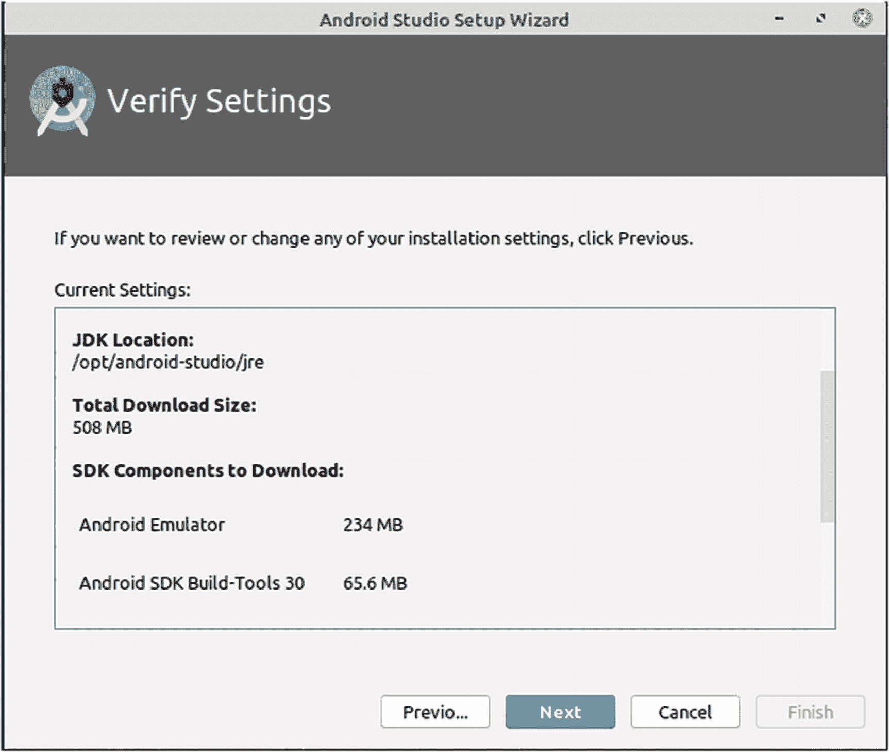

**图 2-9** – Android Studio 设置向导中的验证设置屏幕

你可能习惯直接跳过这类确认屏幕，但我建议你滚动浏览显示的摘要。这并不是因为其中有任何隐藏的“陷阱”，主要是为了确保你意识到设置过程中将下载多少内容。如果你按照前面的描述选择 `Standard` 安装类型，Android Studio 将继续下载最新的 Android SDK 版本和适用于你平台的最新虚拟设备模拟器。这些很容易总计达到 500 MB 到 1 GB 的下载量，你至少应该知道这一点。如果你已经尝试过 `Custom` 安装类型选项，那么在此阶段你可能会下载相当多的 SDK 版本和模拟器引擎，这可能会迅速增长到数 GB 的额外下载量。一旦你对所做的选择感到满意，请点击 `Next` 按钮，Android Studio 将自动开始所有剩余的自动化和下载步骤。在某些情况下，如果你的硬件具有直接仿真支持，你将看到一个额外的屏幕，如图 2-10 所示。

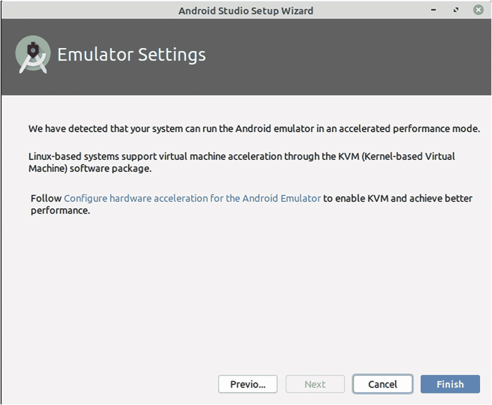

**图 2-10** – Android Studio 的通知屏幕，告知你加速仿真性能

使用硬件仿真加速功能没有任何坏处，因此请接受此选项，你最终将看到 `Downloading Components` 进度屏幕，如图 2-11 所示。

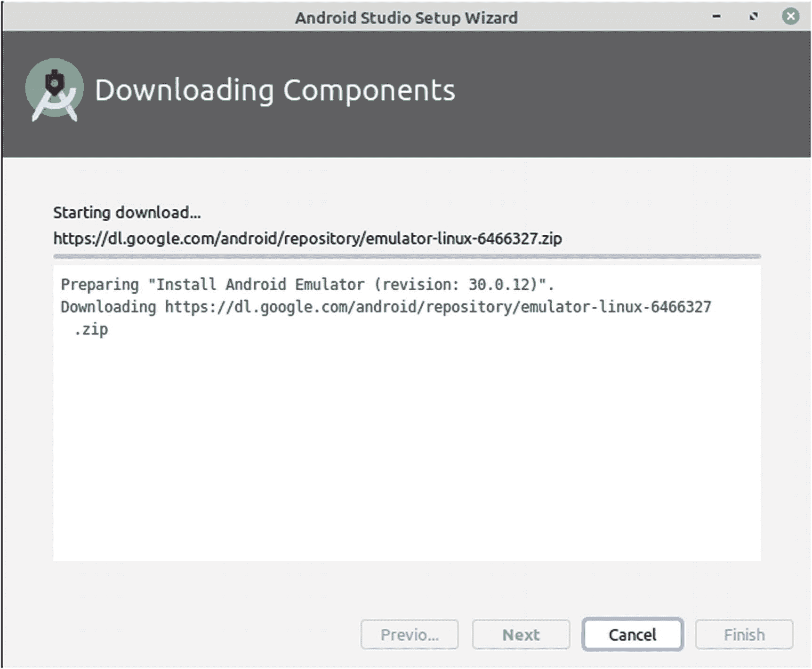

**图 2-11** – 下载组件进度屏幕的初始视图

根据你的计算机和互联网连接速度，组件下载和配置过程至少需要几分钟。如果看到详细信息在某处停滞，请不要惊慌，这通常表示 Android Studio 设置向导正在下载大型组件，例如 Android SDK 包。最终，你应该会看到详细信息停止滚动，窗口底部显示一行神奇的文字，如图 2-12 所示。

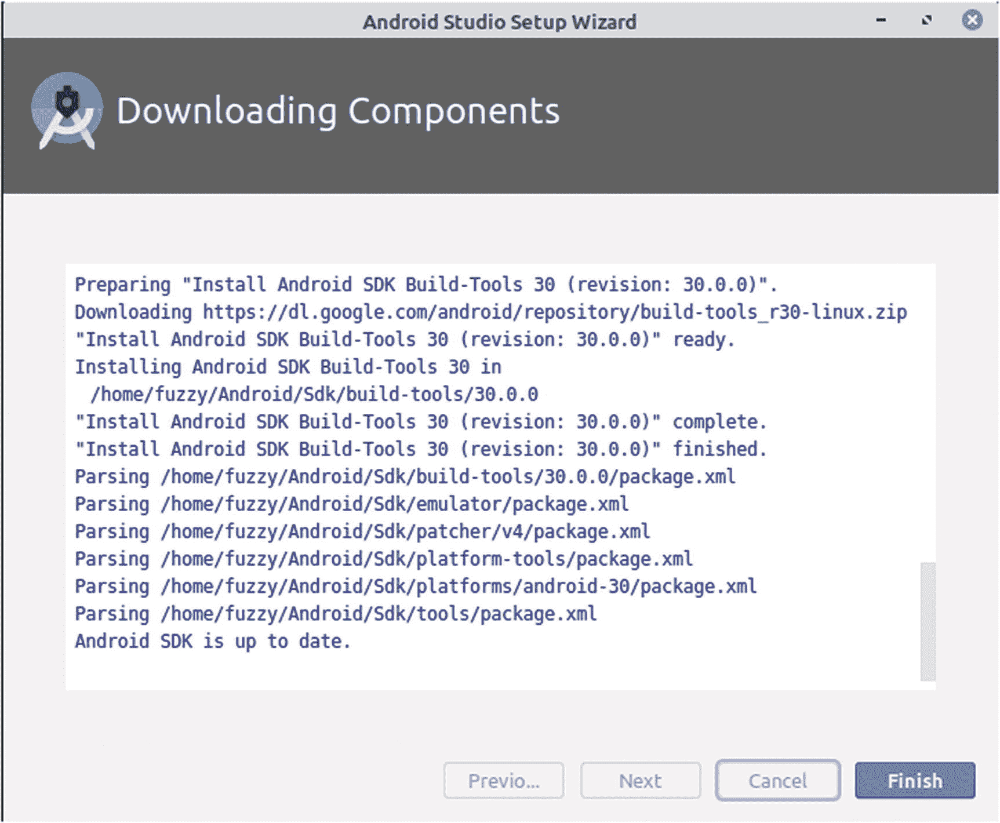

**图 2-12** – Android Studio 设置向导中完成的组件下载视图

你希望在过程结束时看到的神奇文字行是“Android SDK is up to date.”。这意味着下载和配置步骤已完成，Android Studio 已准备就绪。你可以点击 `Finish` 按钮，然后你将看到 Android Studio 本身的启动屏幕，如图 2-13 所示。

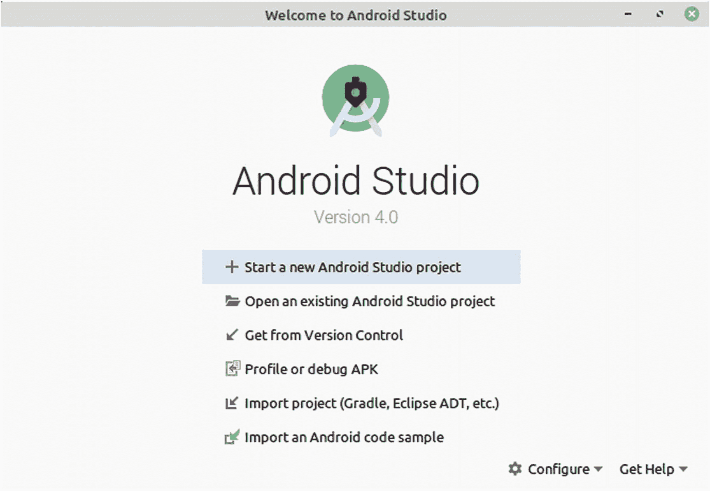

**图 2-13** – “欢迎使用 Android Studio”屏幕

我们将在接下来的章节中回到这里展示的选项。现在，你可以放心了，因为你已经成功安装了 Android Studio 以及我们将在后续章节中使用的 SDK 和模拟器组件。


### 使用 Android Studio 的替代方案

如果说软件世界——尤其是软件开发——能提供什么，那就是选择！无论是浏览器、邮件软件，还是你喜欢的游戏，选择无处不在。为 Android 开发应用也不例外，尽管 Android Studio 是一个强大的默认选择。然而，其他选择也依然存在，即使你不打算使用其中任何一个，了解其他 IDE 和工具的存在也是有用的，因为你会在网上、会议以及其他讨论 Android 开发的论坛中看到它们的身影。

以下是一个简短但并非详尽无遗的列表，列出了你在初涉 Android 应用开发职业生涯中可能遇到的替代方案。

#### Eclipse

正如本章前面提到的，Eclipse 是谷歌支持 Android 开发的第一个 IDE。在 2007 年左右 Android 诞生之初，谷歌需要提供一个有吸引力的开发者工具，以便其新收购的智能手机操作系统能够吸引开发者。当时，它选择了开源的 Eclipse IDE 作为官方认可的开发环境。这一选择被普遍接受，并被认为是巨大的推动力，让数百万 Android 开发者能够免费使用工具，从而开发出一波又一波的 Android 应用。

Eclipse 在聚光灯下闪耀了十年，直到 2014 年 Android Studio 1.0 发布。即使在发布之后，Eclipse 仍然得到谷歌的全力支持，直到 2016 年 Android Studio 2.2 发布。谷歌当时宣布，将不再将 Eclipse 作为一级开发环境提供支持，也不会认证 Android 开发者工具未来能无故障运行。

这听起来似乎 Eclipse 不再是构建 Android 应用的可行环境。但事实远非如此。现实情况是，谷歌不再为想要使用 Eclipse 的开发者提供打磨、便利或直接支持。然而，有两个主要因素确保 Eclipse 仍然是寻求使用它的开发者的一个选择。

首先，Eclipse 在应对 Android 应用的基础方面积累了十多年的微调、集成和专业技能。归根结底，构建 Android 应用的工作归结为处理文本形式的 Java 代码、XML 数据以及相关工件。正如我们将在本书第二部分看到的，这些方面并不会因为你选择不同的 IDE 来协助开发而改变。

其次，Eclipse 是有史以来最流行的 IDE 之一，它在 Android 之外也有优势，这意味着在需要构建超越单一目标平台应用的开发环境中，它常常是 IDE 的首选。

这并非暗示选择 Eclipse 作为你的 IDE 会像 Android Studio 一样流畅或高效。一旦你超出本书的范围，你会发现许多当代的在线信息来源会假设你使用的是 Android Studio，而不是 Eclipse。但你们中的一些人——特别是经验丰富的开发者——会超越这一点，看到 Eclipse 已经吸引人的地方。如果你正在踏上开发者之旅，并且对 Eclipse 还没有大量经验，那么我强烈建议你选择 Android Studio 作为你的 IDE。

#### IntelliJ IDEA

在本章开头，我解释了 Android Studio 的起源，并概述了它基于 IntelliJ IDEA 的基础。所以你可能会想，既然 Android Studio 是基于它的，为什么我还要选择 IntelliJ IDEA 呢，它们有什么区别，我又为什么要在意呢？

很好的问题！本质上，作为一名新开发者，没有压倒性的理由让你考虑选择 IntelliJ IDEA 作为你的 IDE。然而，经验丰富的开发者，或者那些为除 Android 之外更多平台开发基于 Java 应用的开发者，通常会发现将 IDE 标准化是提高效率的重要驱动力。此外，IntelliJ 背后的公司 JetBrains 只在完整商业包中提供某些功能，例如与 Java 的 Spring 框架无缝协作的能力。如果你属于这些类别，我们非常欢迎你采用 IntelliJ IDEA 作为你偏好的 IDE。

要了解更多关于如何使用 IntelliJ IDEA 专门进行 Android 开发的信息，请查看拥有并构建 IntelliJ IDEA 的公司 JetBrains 专门为此主题设立的网页，网址为 [`www.jetbrains.com/help/idea/android.html`](http://www.jetbrains.com/help/idea/android.html) 和 [`www.jetbrains.com/help/idea/getting-started-with-android-development.html`](http://www.jetbrains.com/help/idea/getting-started-with-android-development.html)。

#### 针对多操作系统和移动平台的工具

在第 1 章中，你看到了智能手机市场份额的细分，其中 Android 占据了绝大多数。但不要因此忽视存在替代方案的事实，比如苹果的 iPhone，并且存在帮助开发者同时针对这两个平台以及其他一些你可能没听说过的平台的工具。一些关键的多平台 IDE 和开发环境包括 Xamarin、PhoneGap、Flutter 和 Apache Cordova 等产品。

跨平台工具本身就值得单独写一本书，事实上，上述提到的这些工具都有不止一本专门介绍它们的书籍，以及无数可在线获取的内容页面。如果你对这些工具的功能感兴趣，我强烈建议你从它们各自的产品主页入手，然后从那里扩展你的搜索。

#### 传统平台无关的开发工具

为了结束本章以及开发者工具的话题，我应该带你回到本章的开头。IDE 的出现是为了帮助开发者管理用于创建现代应用的所有工具。这包括代码编辑器、调试器、编译器等等。但 IDE 并非适合所有人。

有些读者可能是经验丰富的开发者，他们非常习惯于组装自己的一套工具来帮助创建 Android 应用。有很多开发者喜欢选择自己的编辑器，比如 Vim、Emacs 或 Sublime Text；编译和构建管道工具，比如 Ant、Jenkins 和 Hudson；以及其他用于性能管理、调试等的工具。

如果你想走这条路，谷歌提供了一套 Android 命令行开发工具，可以从本章开头提到的 Android Studio 下载页面获取。这些工具包括 `sdkmanager`，它负责下载和管理多个 Android SDK 包；`adb`，这是 Android 开发者桥接工具，用于将你的应用从开发机器移动到你的虚拟设备和真实设备；以及其他工具。

虽然本书并非针对想要走这条路的开发者，但至少你知道这是一个可行的选择。现在，我们假设你满意地使用 Android Studio，我们将在紧接着的下一章（从下一页开始）直接深入开发你的第一个 Android 应用！

