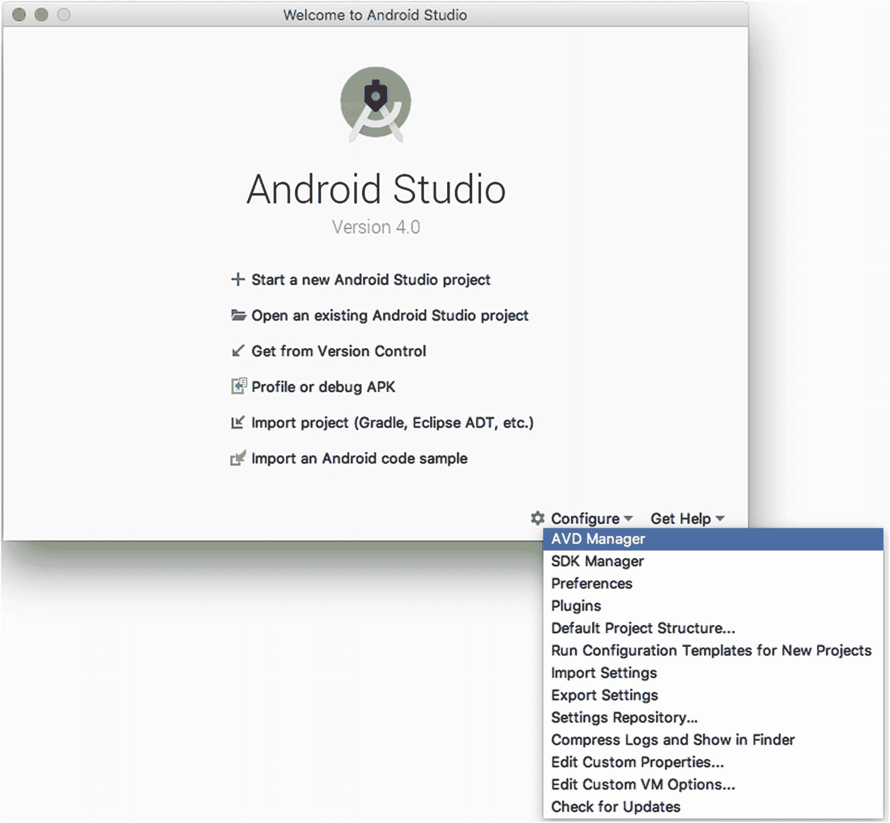
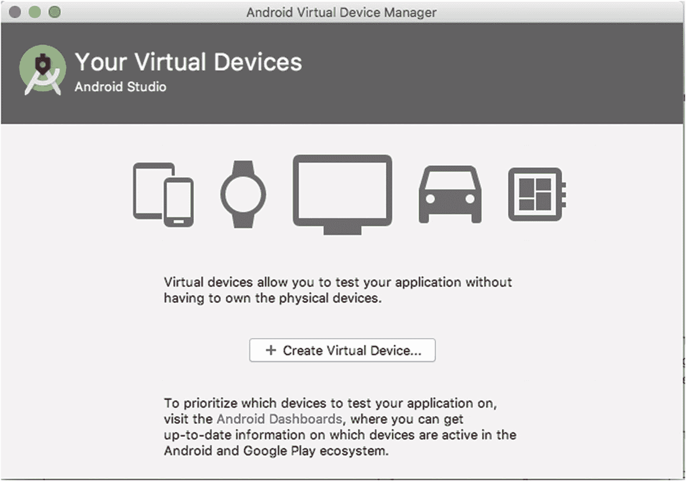
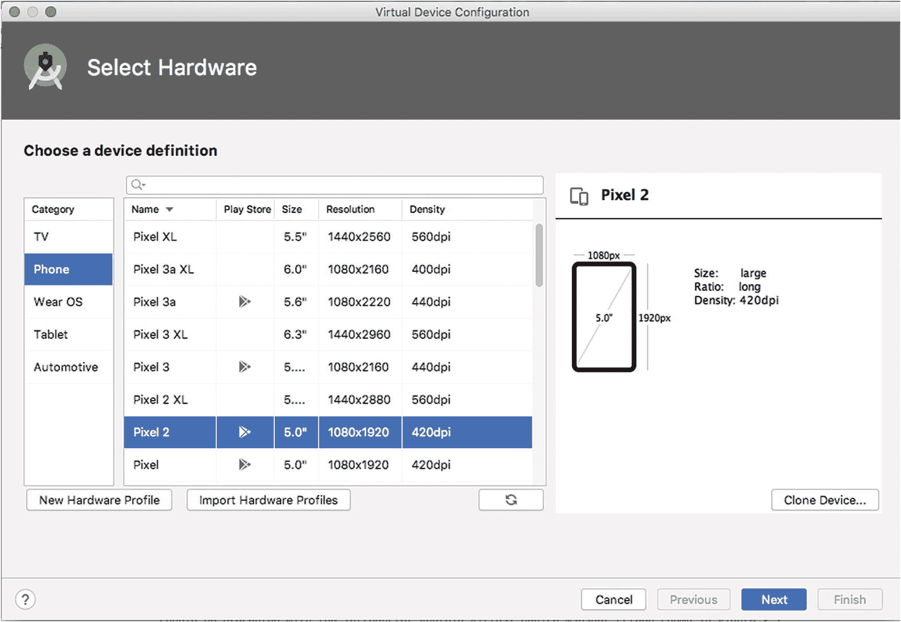
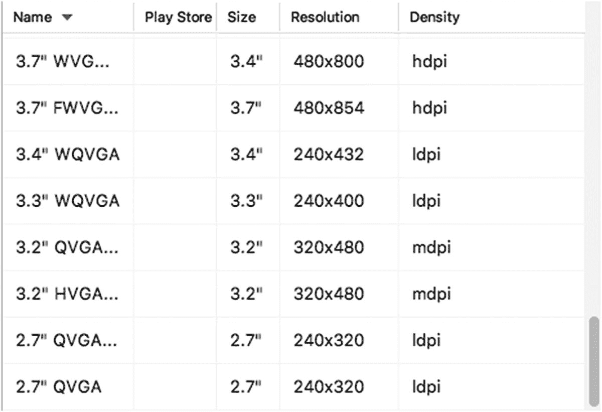
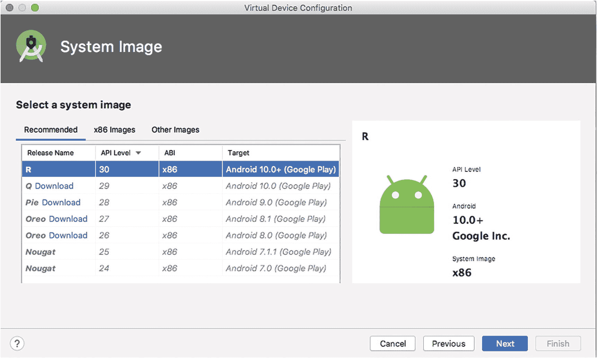

# 你的第一个 Android 应用，现在就动手！

既然你的电脑上已经安装好了 Android Studio，你就可以开始创建你的第一个 Android 应用了。是的，就是现在！对于那些不熟悉 Java 代码开发的读者，不要惊慌。我们将在本章的示例中假设你不具备任何 Java 知识或技能。对于那些确实懂 Java 的读者，无论如何也请继续阅读，因为我们将介绍本章以及后续章节中运行示例所需的重要第一步：创建一个 Android 虚拟设备（AVD）。

## 创建你的第一个安卓虚拟设备

在 Android Studio 集成环境中，最实用的功能之一就是能够创建安卓虚拟设备（AVD）。借助 AVD，你可以模拟真实的安卓设备，控制其多种功能和特性，而无需拥有实体物理设备。

AVD 方法并非要阻止你使用真实设备来测试和运行应用，但如果你回想一下在前两章中提到的种类繁多的安卓设备、版本和外形规格，你就会明白，作为开发者，要拥有市面上正在运行的安卓设备中的一小部分都是不切实际的。AVD 帮助你弥合了你所拥有（且能负担得起）的设备与你用户群实际将使用的设备之间的差距。

要开始创建你的第一个 AVD，请启动 Android Studio（如果尚未启动），你会看到启动画面，然后是“欢迎使用 Android Studio”界面，正如你可能在第 2 章中记得的那样。在欢迎界面的右下角，你应该会看到一个齿轮图标和菜单选项 `Configure`，点击它即可显示一系列配置选项，如图 3-1 所示。

图 3-1

来自“欢迎使用 Android Studio”界面的配置菜单

你会看到配置项列表中的第一个选项就是 `AVD Manager` 选项。点击此选项，`AVD Manager` 将在几秒后启动，并显示如图 3-2 所示的 Android Virtual Device Manager 介绍界面。

图 3-2

Android Virtual Device Manager 欢迎界面

在屏幕中央，你应该会看到一个按钮，如图 3-2 所示，上面写着 `+ Create Virtual Device...`。请继续点击该按钮，开始 AVD 创建过程。然后你会看到虚拟设备配置硬件选择界面，如图 3-3 所示。

图 3-3

用于创建新 AVD 的“选择硬件”选项

硬件选择界面上有很多内容，但不要感到不知所措。这里的众多选项反映了你在现实世界设备中会发现的变量，所以这并不奇怪。让我们逐一浏览这些区域，以便你开始熟悉 `AVD Manager` 以及创建和使用 AVD。

从硬件选择界面的左侧开始，“类别”列表提供了基于外形规格和使用模式的设备模拟器分组。你至少应该看到图 3-3 中显示的五个常规选项：电视、手机、Wear OS（原 Android Wear）、平板电脑和汽车。你可以随意点击每个选项，看看设备列表（屏幕中央）和尺寸详情窗口如何变化，但完成后，请选择“手机”作为类别。选中“手机”后，你应该会看到最初在图 3-3 中显示的预打包模拟设备列表。

此时，我们不会急于选择列表中第一个设备作为我们 AVD 的基础。相反，花点时间滚动浏览列表，并留意一些数据点，这些数据点将在本书后面再次出现，并且会逐渐变得更加有意义，对你的应用程序设计产生更大的影响。

从设备定义列表的顶部开始，你会看到智能手机的品牌和型号，其中一些可能非常熟悉。各种 Pixel 选项，如 Pixel 3、Pixel 2 等，以及 AVD 镜像都尽可能模拟了那些名称对应的真实物理设备。同样，Nexus 6、Nexus 5 等也是模拟其同名设备物理特性的虚拟设备，无论是板载存储、运行内存、屏幕分辨率还是其他功能。在滚动查看列表其余部分之前，先看一下 `Resolution` 和 `Density` 列中显示的值。你会看到两者的度量值：分辨率以像素布局表示（例如，Pixel 2 AVD 的 1080 `×` 1920），密度以每英寸点数或 dpi 表示（再次以 Pixel 2 为例，420 dpi）。你可能对笔记本电脑或台式电脑屏幕的分辨率和密度度量很熟悉，因此不会对你在这里看到的数值多加思考。但是，值得将这些值与列表中的其他 AVD 进行比较。

如果你继续向列表底部滚动，将开始看到一系列更晦涩的设备名称，如图 3-4 所示。

图 3-4

更多可用的 AVD 模板

这些设备没有关联任何品牌名称，但它们通过使用通常与各种屏幕尺寸和分辨率相关的缩写，提供了一些关于其功能特性的指示。我们将在本书中频繁遇到这些术语，所以现在你可以先记住诸如 QVGA、WQVGA、mdpi、hdpi 等名称，而不用费力去理解它们的含义。

好像所有这些当前和历史上的选项还不够，你会看到设备定义列表下方有两个按钮，允许你指定自己的自定义虚拟设备配置文件，以及从其他来源导入配置文件。就我们的目的而言，这些选项并不需要，但你可以体会到它们提供的价值——特别是对于那些最终可能想要针对非常特异的非典型设备设计应用程序的人来说。

我们将在第 9 章、第 10 章和第 11 章中深入探讨用户界面设计时，重新审视安卓设备分辨率和密度的概念和原理。现在，你可以滚动回到设备定义列表的顶部，选择预配置的 Pixel 2 设备定义。点击“下一步”按钮，你应该会看到如图 3-5 所示的系统镜像选择界面。

图 3-5

`AVD Manager` 中的 AVD 系统镜像选择界面

选择系统镜像可以被视为与你之前选择设备定义互补的步骤。你选择的设备决定了 AVD 的硬件方面，而系统镜像则决定了关键的软件方面：安卓 API/SDK 级别和 ABI，这基本上是在决定要在软件中模拟哪种芯片架构——Intel 的 x86 还是基于 Arm 的架构之一，以及这些组件最匹配哪个安卓版本。

## 安卓软件开发工具包：再看一眼

