# 排版后的文本

在第 2 章中，我介绍了`SDK`（软件开发工具包）这个术语。虽然很容易将其理解为“一个帮助我开发软件的套件”，但有必要回顾一下`Android SDK`真正提供的内容。首先，`Android SDK`是一组软件库，这些是访问任何 Android 智能手机及其操作系统功能和能力的基本工具。你可以将`SDK`视为一个杠杆，它让你能够将 Google 内置于 Android 中的所有功能和能力运用到自己的应用中，而无需从头开始构建一切。

`Android SDK`——每个 Android 版本都有对应的后续版本——提供了与`Android Studio`的连接，让你能够轻松调用 Android 行为；构建工具，让你能够将代码转换为可运行的 Android 程序；平台工具，让你能够管理仍处于开发阶段并以“草稿”形式运行的应用程序，包括用于从仍在开发中的代码控制模拟器或真实设备行为的`adb`（Android 调试桥）；等等。哦，`SDK`还提供了模拟器框架和设备模拟本身！

根据你之前是否在你选择的计算机上使用过某个版本的`Android Studio`，或者之前是否完成过此向导，你可能会看到列出的发布名称（如`R`或`Oreo`），名称旁边可能带有下载链接，也可能没有。简而言之，如果系统映像已存在于你的机器上，则不会显示下载链接。如果尚未在你的机器上使用过，则会显示下载链接，你可以直接从系统映像步骤点击它来获取相应的系统映像。

你需要至少有一个系统映像供你的`AVD`使用，因此如果你只看到带有下载链接的系统映像名称，则应选择下载最新的一个。在图 3-5 所示的示例中，这将是 Android `R`系统映像。选择下载将触发许可接受屏幕，如图 3-6 所示。

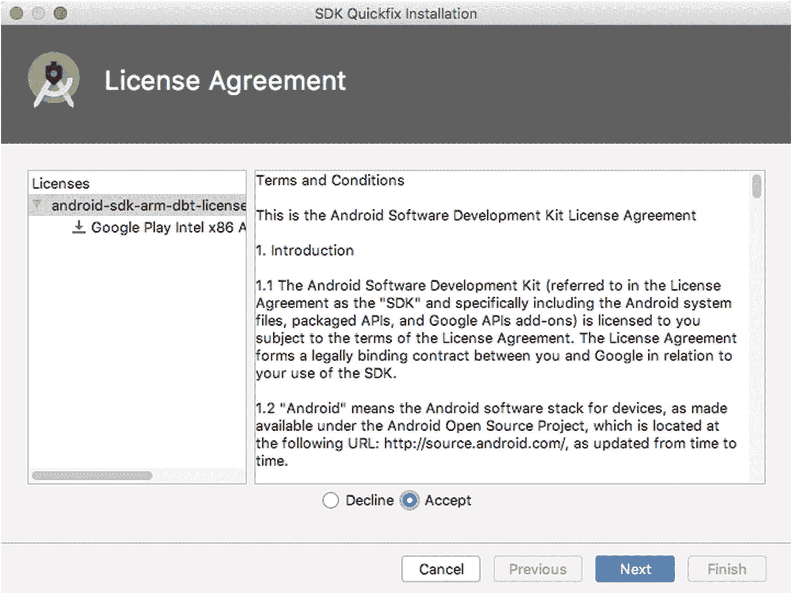

**图 3-6**  AVD 系统映像的许可接受屏幕示例

我不是律师，当然也不会在电视上扮演律师！更严肃地说，这意味着我无法就许可文本的含义或暗示向你提供建议。如果你有任何疑虑，请寻求法律咨询。但从一个外行的角度来看，用于 Android 系统映像的开源许可通常无需过分担心。我假设你接受显示的文本，并在单击`Next`按钮后，现在正盯着如图 3-7 所示的 Android 虚拟设备（AVD）配置验证屏幕。

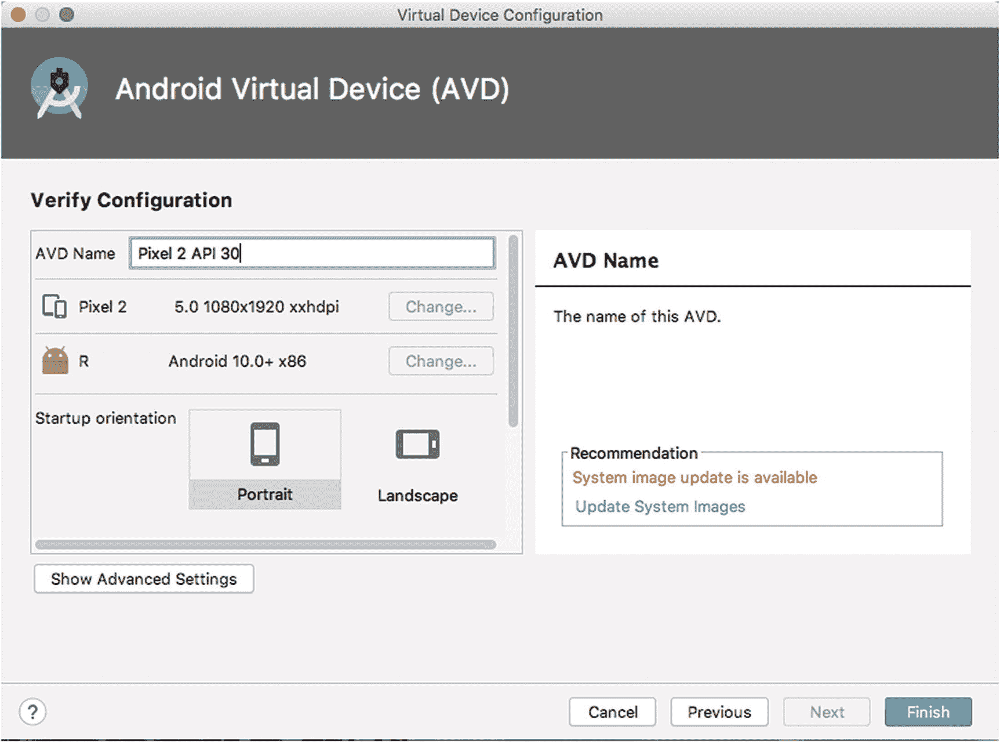

**图 3-7**  Android 虚拟设备（AVD）配置验证屏幕

使用此屏幕确认你对新`AVD`的配置感到满意，并且最重要的是，给它起一个容易记住的名字。你可以随意命名你的`AVD`——无需保留可能继承自某个预配置系统映像的型号或品牌名称，尽管将其作为名字的一部分保留有助于快速提醒你模拟设备的功能。选择一个名称，然后单击`Finish`按钮，进入`AVD Manager`主屏幕，如图 3-8 所示。

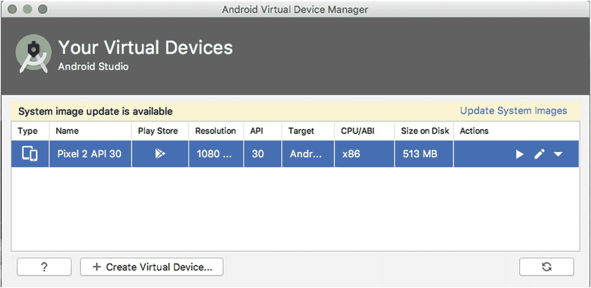

**图 3-8**  填充后的`AVD Manager`主屏幕

现在你应该能在可用模拟设备列表中看到你新创建的`AVD`。创建第一个 Android 虚拟设备就是这样——你现在已经准备好编写自己的应用程序并在其上运行了！


## 开始创建你的第一个安卓应用！

现在，你已经具备了开始创建第一个安卓应用所需的所有前提条件。虽然还有很多东西要学，但你已经掌握了关键工具，包括 Android Studio 和一个新创建的、随时可以测试你编写的任何程序的安卓虚拟设备。希望这个准备就绪的状态不会让你感到惊讶。我在第 2 章中概述了 IDE 的一些优点，而你现在即将在搭建新应用的框架和结构时直接体验到这一点。

不再卖关子了，我们开始吧。如果你已经按照本章前面的步骤完成了 AVD 的创建，那么你可能已经回到了本章前面图 3-1 所示的 Android Studio 主页画面。在该主页画面中，选择屏幕顶部的 `Start a new Android Studio project` 选项，稍后你就会看到“创建新项目”向导的第一个界面。

如果因为某种原因，你没有看到那个主页画面，或者重启了 Android Studio 但它没有显示主页向导，那么你可能会看到一个空白的 Android Studio 界面，或者一个加载了现有项目的界面，如图 3-9 所示。

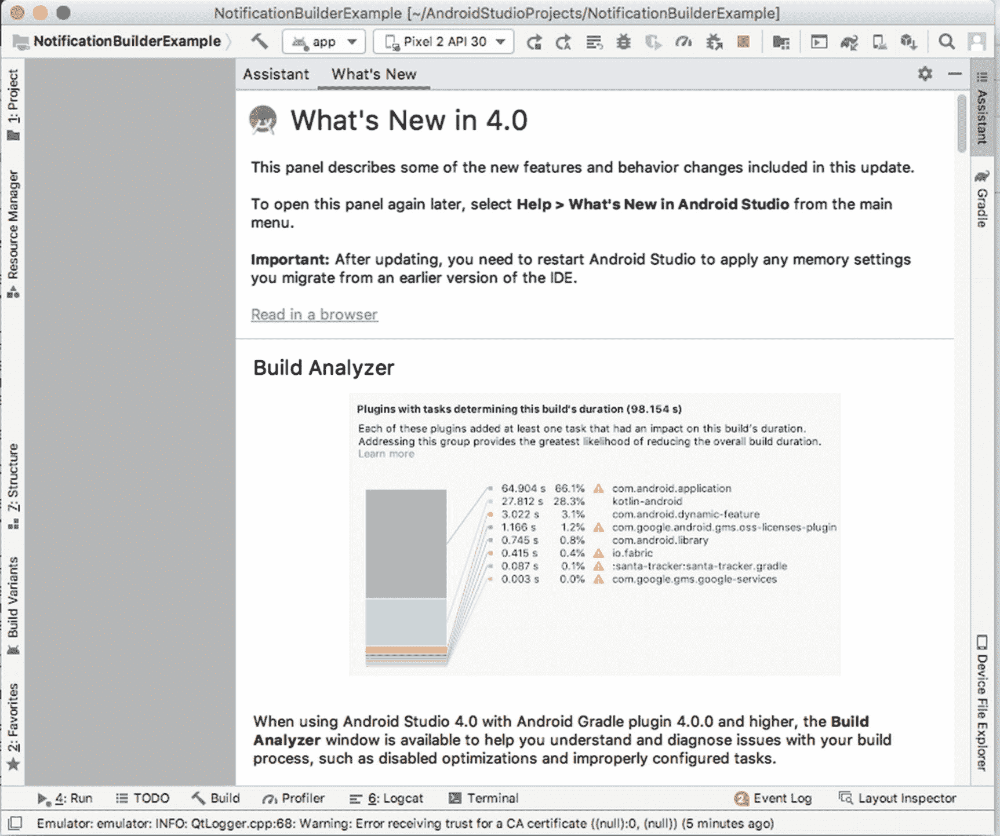

*图 3-9*  
主页画面消失后 Android Studio 的显示状态

别慌！你也可以从这里启动一个新项目，方法是打开 `File` 菜单，选择 `New` ➤ `New Project`。这同样会启动“创建新项目”向导。无论你走哪条路，很快就会看到如图 3-10 所示的向导界面。

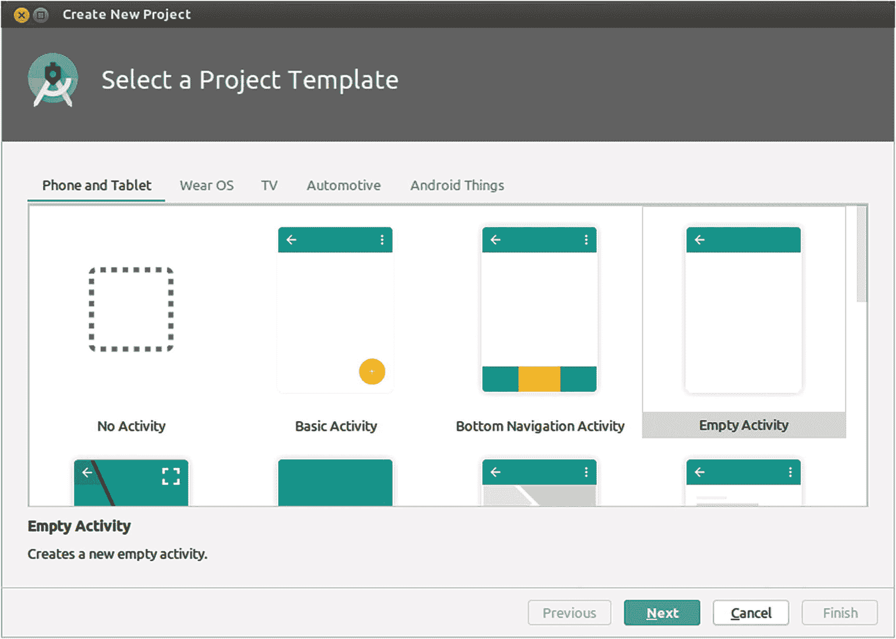

*图 3-10*  
Android Studio 中的“创建新项目”向导

向导的第一个界面已经提示你要为你想要构建的应用类型做出一些选择。在屏幕顶部，你会看到设备类别，例如“手机和平板”、“Wear OS”、“电视”等等。目前，我们将坚持使用“手机和平板”向导选项。看着“手机和平板”下方显示的图标，你可能正在挠头，对 `activity`、`fragment` 等术语的含义感到困惑。别担心。你很快就会掌握它们。在此阶段，你可以将这个界面理解为 Android Studio 在问你，对于你的新应用，你希望获得多少脚手架搭建工作，以及你希望它为你预先准备好哪些现成的部件。例如，如果你预计要开发一个依赖地图和导航功能的应用，“Google Maps Activity”模板会为开发者添加一系列现成的地图、GPS 和位置支持选项。该界面上的其他选项也会相应地引入其他好东西，例如用于 Google AdMob 广告 Activity 的 Ad 库支持。

我们将从一个非常朴素、标准的安卓应用开始，创建这个简单应用的各种变体，以展示我们在后续章节中讨论的每个功能。所以现在，你可以选择“Empty Activity”选项。不要让“Empty”这个词欺骗了你，因为“Empty Activity”选项仍然会部署你的应用所需的大部分样板代码和基本项目结构。选择“Empty Activity”后，点击“Next”按钮，你应该会看到“配置你的项目”界面，如图 3-11 所示。

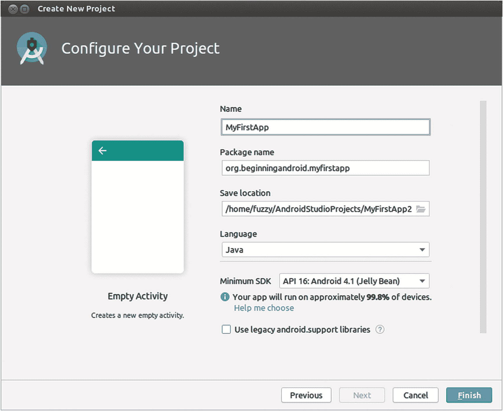

*图 3-11*  
Android Studio 中的“配置你的项目”界面

此界面显示的选项是你将自有代码和特色添加到应用之前的最后一步。对于你当前的 `MyFirstApp` 项目，你需要指定以下设置：

- **项目名**: 这应该是你的应用的一个有意义的名称。它将是运行应用时屏幕上显示的标题，是安卓启动器屏幕上应用图标下方显示的说明文字，如果你将来在 Google Play 商店或其他地方发布这个应用，它也将是那里显示的名称。为此，请输入 `MyFirstApp` 作为名称。

- **包名**: 在一个有成千上万名开发者、为安卓创建了成千上万个应用的世界里，如何确保没有两个应用在命名上产生冲突？安卓并没有强制要求使用唯一名称（尽管像 Google Play 这样的地方在这方面确实有一些限制），而是利用了源自 Java 标准的包名这一基本机制。我们将在第 7 章详细讨论 Java 包的命名，所以现在你可以使用一个来自我个人域名的包名 – `org.beginningandroid.myfirstapp`。

- **保存位置**: 保存位置是指磁盘上用于存储此应用整个代码层级结构的文件夹。这包括菜单子文件夹，其中包含源码、配置文件、图片、视频等内容，具体取决于我们将这个应用做得有多复杂。一开始，一个新项目占用的空间将低于 1 MB。但这可能会迅速增长，所以最好选择一个你知道有充足空闲空间的磁盘位置。如果你对默认位置满意，可以接受它——即你操作系统用户主目录下的一个名为 `AndroidStudioProject/MyFirstApp` 的目录。

- **语言**: 打开你看到的选取列表，会出现两个选项：Kotlin 或 Java。Kotlin 是安卓支持的用于编写应用的语言家族中较新的一员。而 Java 是第一个，并且到目前为止，仍是安卓开发中使用最广泛、最流行的语言。为 MyFirstApp 选择 Java 作为语言。

- **最低 SDK**: 这正是我们在第 2 章和本章中讨论的安卓版本、安卓 Studio 版本和安卓 SDK 版本相关内容开始发挥作用的地方。你在此处的选择将决定此应用使用哪个版本的 SDK，进而在很大程度上决定它在安卓设备发展历史上与哪些设备兼容。较新的安卓 SDK 版本提供对较新功能的支持，而较旧的版本则更有可能在较旧（因此数量也更多）的设备上得到支持。你会在你的选择旁边看到附加文本，该文本显示了全球范围内有多少比例的在用激活谷歌设备会支持你所选的 SDK 版本。在新功能和广泛支持之间，没有完美的平衡方案。目前，我们的初始应用不会使用安卓 SDK 最新版本中的任何前沿功能，因此你可以使用默认选项，选择 API 16，该版本最初是与几年前发布的 Android 4.1 Jelly Bean 一同推出的。如果你愿意，你也可以滚动列表选择其他 SDK 版本。如果你选择的 SDK 版本当前没有安装在你的计算机上，它将在完成此初始应用设置的步骤中被下载——请务必考虑到每个 SDK 版本会占用 100 多 MB 的磁盘空间。


### 使用旧版 Android 支持库

多年来，Google 尝试了多种方法来应对活跃 Android 设备中存在的版本碎片化问题。其中一种方法（至今仍在使用）是使用一个不绑定于特定 SDK 版本的额外支持库，并让应用程序利用这个支持库。其精妙之处在于，与任何特定设备的 Android 系统安装相比，Google 能够更频繁地推送支持库的更新。在接下来的章节中，当我们讨论 `androidx` 和 `Jetpack` 时，将会对此进行更多介绍。现在，你可以将此设置保留为默认的未选中状态，这意味着我们不会引入对这些库的支持。

现在，距离构建一个可运行的 Android 应用程序仅一步之遥。点击 **Finish** 按钮，Android Studio 将启动工作，为你的新 Android 应用程序及其项目文件夹生成结构和脚手架。稍等片刻，你最终应该会看到完整的项目以及 Android Studio 的完整开发者界面，如图 3-12 所示。

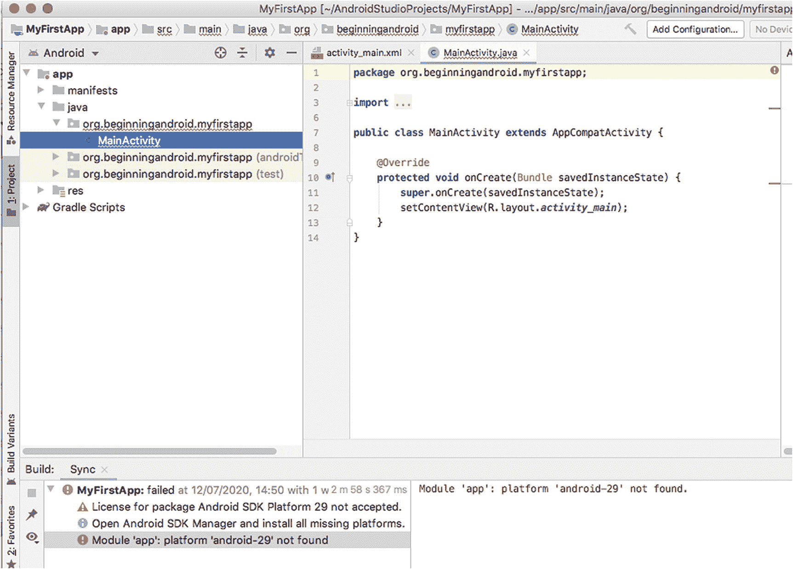

*图 3-12*  
Android Studio 显示打开 `MyFirstApp` 项目以供编辑

### 编写你的第一段代码

如果你查看图 3-12 所示的新项目布局，你会看到一个包含各种名称（如 `manifests`、`java`、`res` 等）的文件夹/目录层级结构。我们将在下一章中全面探讨项目布局、你所看到的目录、填充其中的起始文件以及你需要构建的各个部分。

现在，为了让你能够构建一个带有个人印记的可运行应用程序，我们将跳过对这些内容的解释，直接开始编辑你的第一个应用程序组件。使用你在 Android Studio 布局左侧看到的 **Project** 层级视图，点击展开 `res` 文件夹，然后是 `layout` 子文件夹。你应该会看到一个名为 `activity_main.xml` 的文件条目（实际上，这些**就是**文件！）。双击 `activity_main.xml` 文件，它将在 Android Studio 的编辑器视图中打开，如图 3-13 所示。

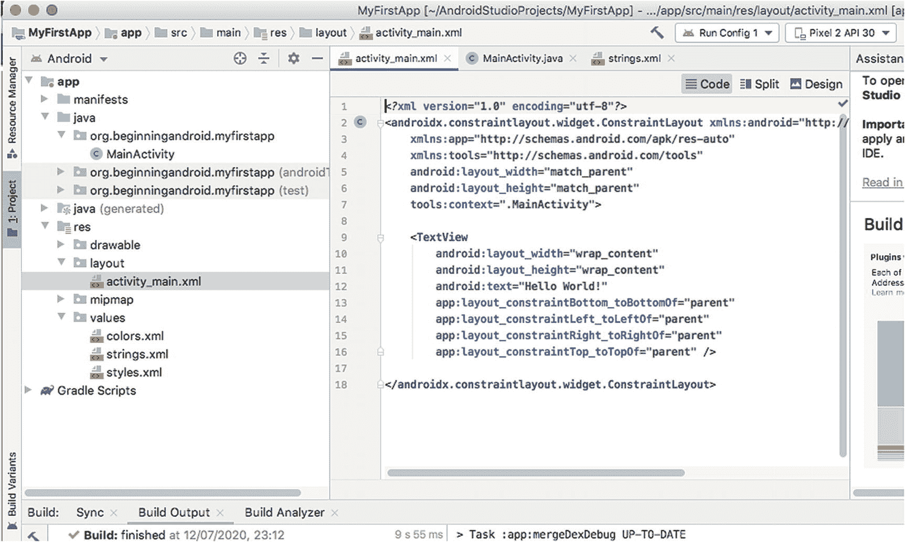

*图 3-13*  
在 Android Studio 中打开你的第一个源文件

查看代码截图很繁琐，所以我们直接来看 `activity_main.xml` 文件的内容。你的文件内容应该类似于代码清单 3-1。

```
代码清单 3-1
新 Android Studio 项目中 activity_main.xml 文件的内容
```

这个文件中有几个部分将来会引起我们的兴趣，但现在我们只关注代码中加粗显示的那一部分。你会注意到，在文件中间附近有一行：

```
android:text="Hello World!"
```

继续编辑双引号内的字符串，将 `"Hello World!"` 修改为你喜欢的文本，比如 `"Hello Android!"` 等。编辑完这个文件后，保存你的更改。你已经完成了对 Android 应用程序的第一次自定义编辑！

### 准备运行你的应用程序

现在，你可以让 Android Studio 在本章前面创建的 AVD 模拟器中运行你的新应用程序了。为了让 Android Studio 做到这一点，它需要知道当你要求它运行应用程序时的具体偏好。例如，你是只想让它正常运行以便与之交互，还是希望它以调试模式或其他方式运行，从而让你仔细检查代码中发生的事情、应用程序与 Android 宿主机、你可能调用的其他 API 或诸如云端 API 等外部服务之间的交互？

Android Studio 通过所谓的“运行配置”来控制这些不同的应用程序运行方式。这些配置是预设的指令，用于精确指定运行应用程序时“运行”的具体含义。

你可以立即尝试运行你的应用程序，从而触发 Android Studio 引导你设置第一个运行配置。打开 `Run` 菜单，选择 `Run...` 选项。由于尚未存在任何运行配置，Android Studio 将提示你编辑一个配置，如图 3-14 所示。


*图 3-14*  
提示你编辑第一个运行配置

**注意：**  
你总是可以通过从 `Run` 菜单中选择 **Edit Configurations…** 选项，直接编辑运行配置，而无需强制运行应用程序。

无论你通过哪种方式触发创建第一个运行配置，都会看到 **Run/Debug Configurations** 屏幕显示出来。该屏幕上的文字会提示你点击“`+`”按钮来添加新配置，请照做。你将看到如图 3-15 所示的选项列表。

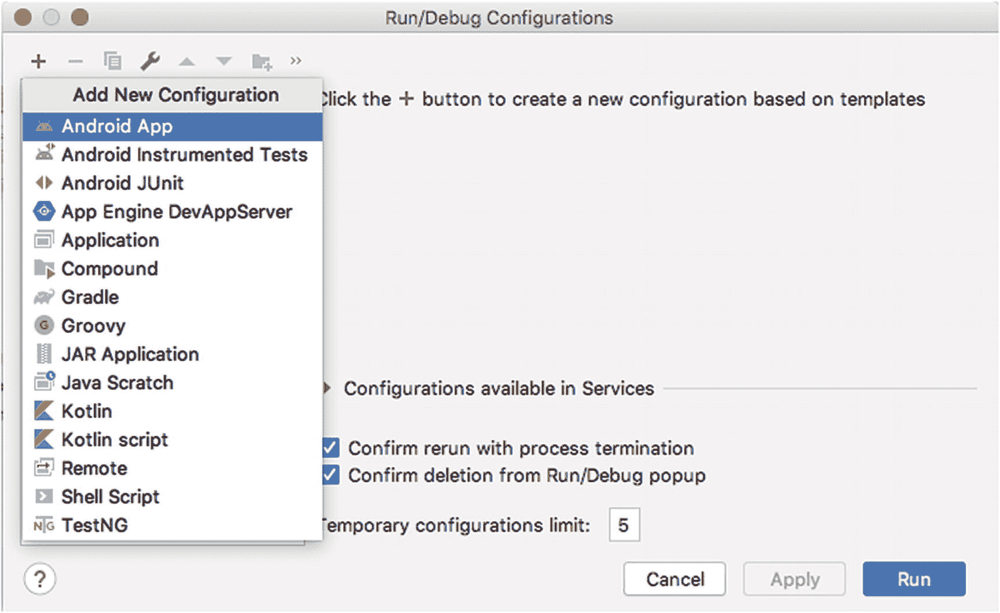

*图 3-15*  
选择一个新的基础运行配置

在显示的列表顶部选择 **Android App** 选项，然后你将看到如图 3-16 所示的详细配置屏幕。

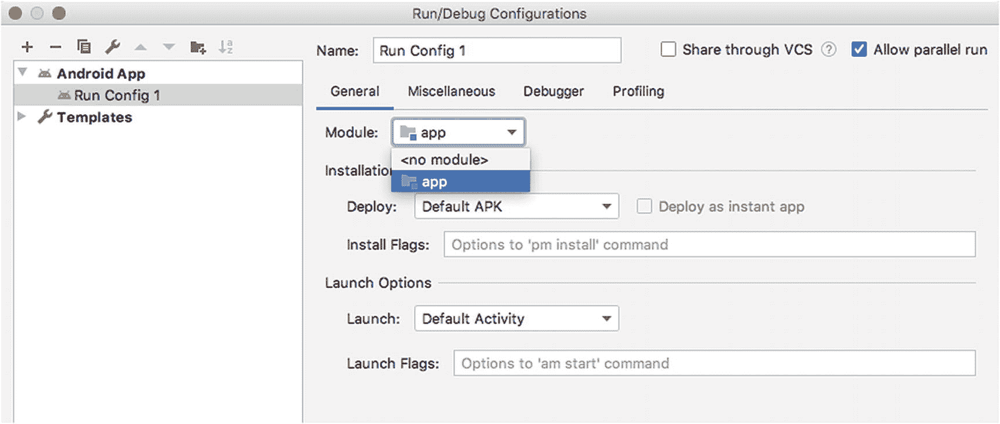

*图 3-16*  
新运行配置的详细设置

你需要进行两项设置。第一项是为你的运行配置提供一个易于记忆的名称。我建议你使用名称 **Run Config 1**。接下来，你需要指定运行配置在运行你的应用程序时应启动哪个代码模块。列表中唯一的选项是 `app`，幸运的是，这正是你想要的选项。你可以在图 3-16 中看到这两项设置。

点击 **Apply** 和 **OK** 按钮保存你的配置。


## 安装（附加）SDK 软件包

根据你在本章前面选择的应用最低 SDK 设置，以及首次安装 Android Studio 时选择的选项，你的计算机上可能未安装 Android Studio 构建应用所需的相应 SDK 包。你可以轻松发现这一点，因为 Android Studio 的默认视图会在屏幕左下角显示当前的构建状态。

如果你查看“构建：同步”区域并看到如下错误或警告，则可能需要下载与你项目所选版本匹配的 SDK 包：

```
License for package Android SDK Platform 29 not accepted
```

或

```
Module 'app': platform 'android-29' not found
```

警告或错误中提到的版本号可能与你的安装环境不同。无论版本如何，只需调用 SDK 管理器功能（IDE 提供的另一项集成功能）即可轻松解决。在 Android Studio 的“工具”菜单中，选择 **SDK 管理器** 选项，你应该会看到如图 3-17 所示的 SDK 管理器界面。

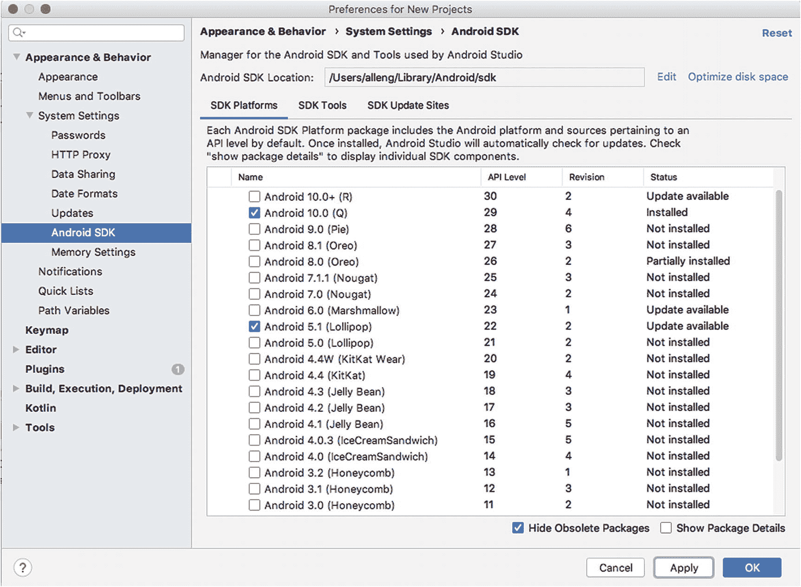

图 3-17

Android SDK 管理器

要添加项目所需的 SDK，只需勾选相应版本旁的复选框——在我的例子中是“Android 10.0 (Q)”，它对应于 API 级别 29，换句话说，就是 Android SDK 的 29 版本。点击“应用”按钮，SDK 管理器将触发下载此版本的 SDK。如果你稍作思考，就会意识到随着你构建越来越多的应用，并可能为它们选择不同的目标 SDK 版本，你的机器上最终可能会安装多个不同版本的 Android SDK，这些版本加起来会占用相当可观的磁盘空间。我们将在第 6 章深入探讨你的整体开发者系统设置时，重新讨论这个话题。

一旦所需 Android SDK 版本的下载完成，你应该会看到如图 3-18 所示的状态。

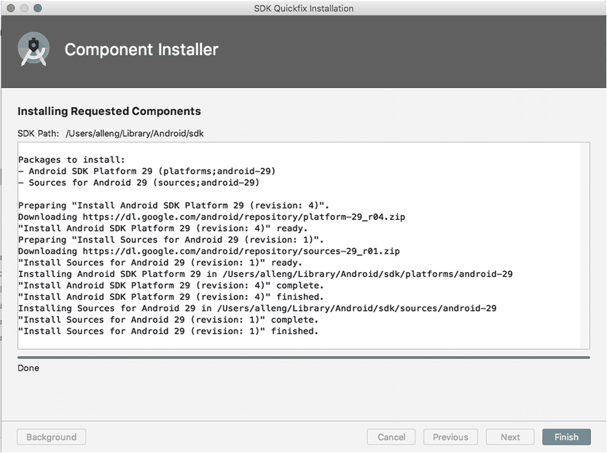

图 3-18

Android SDK 管理器提示新 SDK 版本下载并安装成功

此时，你需要让 Android Studio 刷新集成的 Gradle 构建工具的配置，以便它意识到新 SDK 已就位。Android Studio 可以自动完成所有必要的步骤——所以如果你对 Gradle 作为构建工具一无所知，此刻也不必惊慌。只需打开 `File` 菜单，选择 `Sync Project with Gradle Files` 选项。

当此同步活动完成时，在屏幕左下角的“构建”窗口中，你应该会看到之前的警告和错误已消失，唯一显示的消息应该是 `MyFirstApp successful at` *某个日期和时间*。

### 运行你的应用

在 Android Studio 完成符合你应用需求的设置，且 Gradle 同步完成并准备好构建你的应用后，你的运行配置现在应该能够实际运行你的新应用了。继续操作，从“运行”菜单中选择“运行”，或直接选择 `Run 'Run Config 1'` 以跳过运行配置选择步骤。

一系列操作现在会自动执行，但这可能需要一些时间——根据你计算机的性能，最多可能需要几分钟。首先，将调用 Gradle 来构建你的应用。我们将在后续章节中更详细地介绍此过程，但现在你需要知道的是，Gradle 会整合你编写的所有代码、应用引用的库、相关的 Android SDK 以及其他基础设施，并生成一个已准备好部署为你的应用的软件包。这被称为 Android 包，即 APK。

接下来，Android Studio 会调用你的 AVD，并在模拟器启动所需的时间后，将 Gradle 构建的 APK 复制过去。根据你的运行配置，Android Studio 知道你想要运行应用模块，从而有效触发你的新 MyFirstApp 应用在 AVD 中运行，就像你在 Android 启动器窗口中点击了它的图标一样。

你的应用将运行，并且你那些不朽的文字“Hello Android！”（或你选择的任何内容）应该会出现在标题为 MyFirstApp 的应用屏幕内，正如图 3-19 所示。

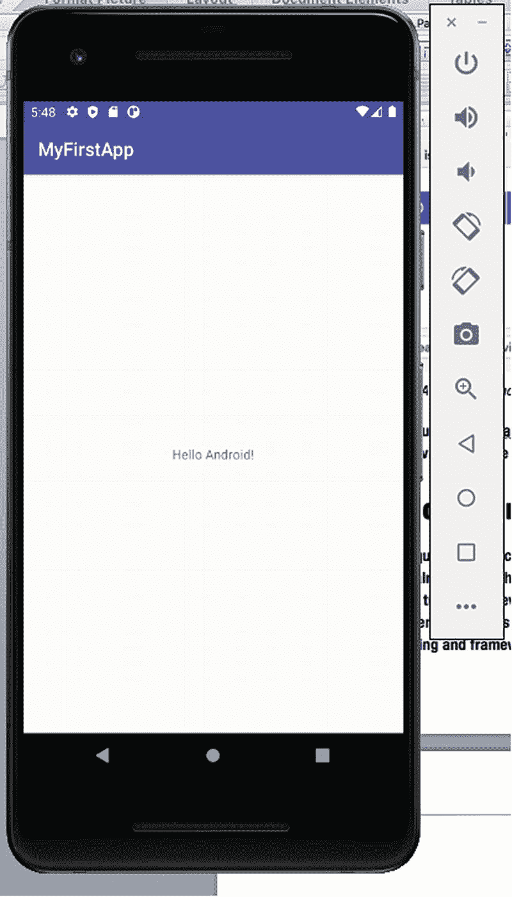

图 3-19

在你的 AVD 中运行着的 MyFirstApp Android 应用

就是这样！你已经编写并运行了你的第一个 Android 应用。做得好。深吸一口气，因为在第 4 章中，我们将深入幕后，详细检查 Android Studio 刚刚为你构建的一切。

## 探索你的第一个项目

在第 3 章中，我向你介绍了如何设置编写并运行你的第一个 Android 应用在 AVD 上所需的一切，目的是让你尽快沉浸于 Android Studio、模拟器以及你的第一段编码中。我们很快取得了成果！但当你快速浏览时，几乎肯定会涌现出一大堆未解答的问题。在本章中，我们将开始更深入地探讨许多主题，首先从你的新 Android 项目的结构和特性入手。这应该会开始回答这些问题并构建你的知识体系。

### 查看整个 Android 项目结构

要熟悉 Android 项目各个部分的结构和用途，从三万英尺（或一万米，对于公制思维的人来说）的高度来观察会有所帮助。回顾上一章中项目的整体布局，发现它出奇地庞大。虽然你只编辑了一个文件，但新建项目向导为你创建了许多其他文件，并且在你创建项目时，像 Java 库、Android SDK 等其他文件也被复制或添加了引用。

要查看这个完整视图，请使用 Android Studio 窗口左侧的窗格（称为项目浏览器视图）来展开 `app` 文件夹；然后展开其下的文件夹，如 `manifests`、`java` 等；以及从顶层向下的所有其他文件夹。最终你将得到一个类似于图 4-1 所示的整个项目视图（请注意，为了节省空间，我并排显示了长项目浏览器的连续视图）。

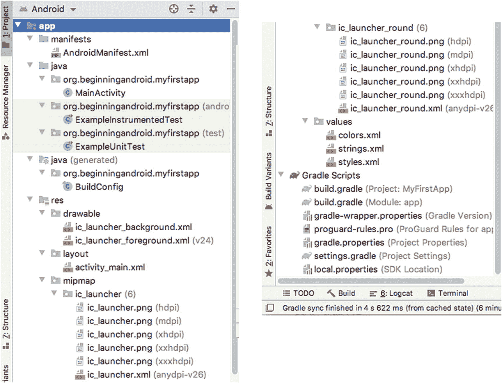

图 4-1

项目浏览器中项目的逻辑 Android 视图

你看到的默认视图称为 Android 视图，旨在简化项目所有组成部分的显示方式。这种简化的目标是让你能够专注于你（开发者）编写或编辑的部分，并将大部分其他支持性文件放在次要位置。

从这个全项目 Android 视图中，你可以看到项目被分解为五个主要文件组，它们代表了项目的不同部分。


#### 使用清单文件

在项目资源管理器的 Android 视图中，显示的第一组文件就是你的清单文件。对于像 `MyFirstApp` 这样的新项目，只会有一个你需要关注的清单文件，即名为 `AndroidManifest.xml` 的文件。

这就是你的 Android 清单文件，它几乎扮演着 Android 应用总控文件的角色。在 Android 清单文件中，你可以控制应用的许多主要参数和行为，包括声明应用运行所需权限、它可能交互的服务、构成应用的 Activity，以及应用需要和支持的 Android SDK 版本。

我们将在本章稍后部分更深入地探讨其中一些核心概念，包括定义 Activity 和服务在 Android 语境下的含义。现在，让我们先查看一下 `AndroidManifest.xml` 文件的内容，如代码清单 4-1 所示。

```
代码清单 4-1
你的新 AndroidManifest.xml 文件的内容
```

正如你可能从文件名中猜到的那样，其内容是 XML 格式的。对于初次接触 XML 的读者，第 8 章提供了关于 Android 开发中 XML 的完整介绍。你可以先跳到那一章了解相关内容，待你熟悉了 XML 的基础知识后再回到这里。

Android 使用根元素 `<manifest>` 作为 XML 文档的起始，然后引入了两个关键属性：命名空间声明和包声明。就命名空间而言，Android 的惯例是仅在属性层面使用它们，而不是在元素层面也使用。包名 `org.beginningandroid.myfirstapp` 应该看起来很熟悉，因为这是我们在第 3 章的项目设置向导中提供的包名。除了提供这个至关重要的映射以确保应用完全限定包名的唯一性外，这种技术还允许我们将来在引用应用自身的各个方面时使用简写形式。

你可以在清单文件的稍后部分看到这一点，当引入第一个 `<activity>` 元素时，其形式为 `<activity android:name=".MainActivity">`。在这里，开头的点是 `<manifest>` 包属性中引用的完整包名的简写。实际上，这意味着内部引用的名称会更短。因此在本例中，使用 `.MainActivity` 而不是 `org.beginningandroid.myfirstapp.MainActivity`。我相信你知道我更愿意输入哪个。

清单文件还包含其他关键特性。例如，`android:icon` 和 `android:roundIcon` 属性引用了两个资源文件，它们分别为你的应用提供了在 Android 设备启动器屏幕和小部件屏幕上的方形和圆形图标版本。`android:label` 属性保存着你应用的名称。

另一个重要的条目是前面提到的 `<activity android:name=".MainActivity">`。这个条目，包括其子元素 `<intent-filter>`，向 Android 指明了当应用启动并且触发了关键 Intent `android.intent.action.MAIN` 时，应该响应哪个 Activity。我们将在本章稍后部分详细介绍这些概念，但现在你可以将其视为 Android 标记应用启动时首先向用户显示内容的方式。

#### 与 Java 互动

Android 项目资源管理器视图中的第二个和第三个主要区域是你的 Java 源文件。这些是写入 Java 代码的文本文件，用于让你的应用活起来，并执行你为应用设定的操作、功能和特性。

你会看到两个顶层文件夹，一个名为 `Java`，另一个名为 `Java (generated)`。事实上，在这个阶段，这两个区域中的所有文件都是为你生成的，但通常在你开发应用时，你会更改 `Java` 树中的文件、添加新文件等，而让 Android Studio 及其集成工具自动处理 `Java (generated)` 文件。

现在特别注意其中一个文件，那就是 `Java` ➤ `org.beginningandroid.myfirstapp` 文件夹下的 `MainActivity` 文件。磁盘上的文件实际名为 `MainActivity.java`，而项目资源管理器中的 Android 视图隐藏了文件扩展名。根据前面 Android 清单文件中提到的配置，这个 `MainActivity` 文件是应用启动时将运行的代码。

我们将在本章稍后部分以及本书后续许多章节中深入探讨 Activity 的含义。

#### 善用资源

新项目中文件的第四个主要区域是资源文件，位于 `res` 文件夹及其子文件夹中。最初生成了相当多的项目供你使用，它们属于不同的资源类别。

##### 可绘制对象

可绘制对象是 Android 将作为应用的一部分在屏幕上绘制或渲染的内容。这既包括普通图像，如插画、图表和其他静态图像，也包括 Android 根据给出的指令在运行时需要生成的图像。

第一种可绘制对象以你熟悉的典型图像文件格式表示，例如 GIF、JPEG 和 PNG 文件。Android 具有缩放图像以适配各种密度屏幕/显示器的机制，也允许你存储同一图像的不同分辨率版本以避免缩放。我们将在第 14 章深入探讨 Android 应用的图像、照片和插画创作及技术世界。

Android 支持的第二种可绘制对象是它在运行时根据 XML 文件中提供的规范创建的矢量图像。在你的新项目中可以看到两个提供矢量图形指令的 XML 文件示例：`ic_launcher_background.xml` 和 `ic_launcher_foreground.xml`。

##### 布局

在第 9 章和第 10 章中，我们将详细探讨布局和设计应用的 UI，涵盖一系列选项和样式。你在第 3 章创建新项目时，应该记得为项目选择了“Empty Activity”选项。Android Studio 利用这个选择为你设置了一个默认布局，该布局出现在 `layout` 子文件夹下的 `activity_main.xml` 文件中。

同样，这是一个 XML 文件，Android 广泛使用 XML 来定义 Activity 的初始布局和行为特性。如果你将 Activity 视为 Android 应用中用户使用的屏幕或窗口，那么 XML 布局就提供了如何创建和渲染界面的描述。这个 `activity_main.xml` 布局被你的 `MainActivity` Java 代码用来在屏幕上绘制 Activity。这个过程在 Android 领域被称为“填充”，它适用于布局整个 Activity 界面的过程，也适用于其中的任何子集，例如创建菜单或在一个布局内动态添加另一个布局。随着你的应用不断增长，此文件夹中的 Activity 布局 XML 文件数量也会增加。


#### Mipmaps

你可以将 `mipmap` 文件夹视为 `drawable` 文件夹的一种特殊情况。`drawable` 用于存放任何用途的图片或图形，而 `mipmap` 条目专门用于你的应用程序以及 Android 设备启动器屏幕所使用的图标文件。`ic_launcher` 文件夹存放图标方形版本，`ic_launcher_round` 存放相同图标的圆角版本。每个文件的多个实例以不同分辨率（显示密度）存储，Android 会根据设备的显示特性以及应用程序或设备可能使用的任何显式配置覆盖，自动决定使用哪个密度版本。

我们将在后续章节中进一步讨论显示密度及其影响。

#### 从 Values 中寻找价值

在 `values` 文件夹中，你会找到专门存放字符串、尺寸、样式和其他参考信息数据的文件。这种方法体现了你在几乎所有编程语言和环境中都能找到的简单抽象技术。与其在应用程序代码和配置文件中到处散布可能被多次重复使用的硬编码值，不如使用抽象来引用远离代码的值的单一定义，这样可以使代码更简洁、更不易出错。这在许多方面都有帮助，例如为创建和使用适用于多种屏幕尺寸和分辨率的资源提供了一种良好管理的机制。

在你当前的项目中，可以看到应用程序名称存在于 `strings.xml` 文件中。我们可以引用 `strings.xml` 文件中的这个条目，而不是将 `"MyFirstApp"` 作为字面字符串嵌入到项目中所有需要它的地方。如果我们将来需要更改这个值，只需在一个地方进行修改，并且可以确保所有引用都会自动且正确地更新。虽然我们自己不会这样做，但这种方法在应用程序的国际化和本地化（翻译成其他语言）方面具有切实的好处。

#### 使用 Gradle 文件构建一切

到目前为止，即使是你的第一个 Android 应用程序，它所包含的各种类型的文件数量也已经增长到了两位数。将这些文件整合在一起，创建一个最终可用的 Android 应用程序，是构建系统的工作，而 Android Studio 默认依赖一个名为 Gradle 的构建工具集。

`Gradle Scripts` 文件夹展示了用于从各个组件构建完整应用程序所需的各种脚本。目前最值得注意的两个文件是同名的 `build.gradle` 文件。你会注意到第一个文件被标记为项目级别的——在本例中为 `Project: MyFirstApp`。第二个文件被标记为 `Module: app`。

你可能会问：“为什么会有两个 `build.gradle` 文件？”长话短说，实际上你可能有超过两个这样的文件。你现在看到的是所有 Android 项目都有的一个项目级别的 `build.gradle` 文件。然后，你的项目定义的每个模块都有一个额外的 `build.gradle` 文件，允许每个模块处理任何模块特定的构建活动和参数。由于你的项目只定义了一个 `"app"` 模块，所以你只看到了另一个 `build.gradle` 文件，总共两个。随着我们本书的深入，我们将会使用包含多个模块的项目示例，届时你会在相关项目中看到更多的 `build.gradle` 文件。

目前，项目级别的 `build.gradle` 文件最值得关注，你可以在清单 4-2 中查看其内容。

```
apply plugin: 'com.android.application'
android {
compileSdkVersion 29
buildToolsVersion "30.0.0"
defaultConfig {
applicationId "org.beginningandroid.myfirstapp"
minSdkVersion 16
targetSdkVersion 29
versionCode 1
versionName "1.0"
testInstrumentationRunner "androidx.test.runner.AndroidJUnitRunner"
}
buildTypes {
release {
minifyEnabled false
proguardFiles getDefaultProguardFile('proguard-android-optimize.txt'), 'proguard-rules.pro'
}
}
}
dependencies {
implementation fileTree(dir: "libs", include: ["*.jar"])
implementation 'androidx.appcompat:appcompat:1.1.0'
implementation 'androidx.constraintlayout:constraintlayout:1.1.3'
testImplementation 'junit:junit:4.12'
androidTestImplementation 'androidx.test.ext:junit:1.1.1'
androidTestImplementation 'androidx.test.espresso:espresso-core:3.2.0'
}
```
清单 4-2 项目级别的 `build.gradle` 文件

你拥有各种配置设置来控制应用程序的构建方式，这些设置主要分为几个关键领域。它们是 SDK 版本管理和应用程序版本管理、构建目标的应用类型，以及作为项目基础所需的依赖项、插件和库的包含。

##### 理解 SDK 版本参数

你会注意到有几个参数提到了 SDK 版本，包括 `compileSdkVersion`、`minSdkVersion` 和 `targetSdkVersion`。它们服务于不同但互补的目的：

1.  `compileSdkVersion`：指示 Android Studio 在你实际编译和构建应用程序时使用哪个版本的 SDK（从你安装的多个可能版本中选取）。通常你会选择你拥有的最新 Android SDK 版本。
2.  `minSdkVersion`：为应用程序中原生 API 功能的使用设置门槛，并由此决定哪些版本的 Android 和 Android SDK 能原生支持你的应用程序。这进而设定了可以使用你应用程序的最旧设备。较新 API 级别引入的功能将尽可能通过支持库或 Android Jetpack（稍后讨论）来处理。
3.  `targetSdkVersion`：控制你的应用程序将尝试使用的最新 API 功能，即使 `compileSdkVersion` 是比它更新的版本也是如此。这意味着你可以受益于更新 SDK 在编译时提供的效率，但不必被迫接受应用程序行为的重大改变，直到你显式地提升 `targetSdkVersion`。

##### 理解应用程序版本管理

在发布 Android 应用程序时，与几乎所有其他软件一样，版本管理的概念用于标识修复错误、添加新功能、改进现有行为等的后续版本。

Android 使用你在 `build.gradle` 文件中找到的两个参数。最重要的是 `versionCode` 参数，它传统上是跟踪应用程序的特定构建/发布版本号的参数。`versionCode` 参数是一个整数，当你发布新版本时，它只应递增。

**注意**

在内部，从 SDK 版本 28 开始，Android 还提供了更新的 `versionCodeMajor` 参数。这是一个 `long` 值，而不是 `integer`，因此可以保存更大的值。目前，只有通过在 Android 清单 XML 文件中加入 `versionCodeMajor="n"` 表示法才能成功设置此值。Gradle 构建文件目前不支持此参数。

Android 也提供了一种机制来向用户显示某种有意义的、人类可读的版本信息，这个信息源自 `versionName` 字符串值。如果你想尝试向用户传达关于主要版本和次要版本之类的信息（这是软件开发中的传统习惯，尽管并非必需），这对你作为开发者会有所帮助。


##### 包含向前与向后版本支持的库

目前需要关注的 Gradle 构建文件的最后一个方面是依赖项部分。现阶段我不会深入介绍每个被声明的依赖项，因为我们会在后续关于测试、设备/版本兼容性等章节中，在讨论具体细节时再逐一回顾它们。我要强调的一个共同点是许多依赖项的命名空间。你会注意到主要的组件名是 `androidx`。`androidx` 指的是 Android Jetpack，这是 Android 近期的一次更新和重构，它让你作为开发者能够面向众多不同版本的 SDK 进行开发，而无需预先了解它们——实际上，这使你的应用程序能够在一定程度上抵御后续 SDK 版本中引入的某些变化，同时还能让你利用当代 SDK 的功能构建应用，并让 Android 和 Jetpack 来处理在运行不直接支持你的 SDK 版本的旧版 Android 设备上，如何模拟这些新行为。Jetpack 还通过减少样板代码、帮助你遵循 Android 开发者社区长期积累的良好实践，来降低用 Java 编写软件时的冗余度。

Jetpack 正在取代旧的方法，即 Android 支持库（Support Libraries），但在许多参考资料和讨论中你仍会看到支持库的身影，并且这两者在未来一段时间内将并存。

## 解释 Android 应用的关键逻辑构建块

现在你对 Android Studio 中的项目结构和布局有了一定的了解。但在本章的多个地方，我都提到了 Android 应用程序的一些基本逻辑构建块，例如 Activity 和服务。现在是时候深入理解这些构建块是什么，以及它们如何协同工作，让你的应用程序变得生动起来。

### Activity（活动）

如果你使用过任何现有的 Android 应用程序，你会体验到它具备大多数带有用户界面的软件所共有的一些特点。与其他拥有 UI 的软件一样，Android 使用了“屏幕”或“视图”的概念，让用户与你的程序进行实际交互。Android 将这些称为 Activity。无论你是想让用户阅读文本、观看视频、输入数据、拨打电话、玩游戏还是做其他事情，你的用户都将通过与你设计的一个或多个 Activity 屏幕或布局进行交互来完成操作。

Activity 是 Android 开发中最简单、计算成本最低的部分之一，你应该在应用程序中慷慨地创建和使用它们。这不仅有助于用户从你的应用中获得极佳的体验，而且 Android 操作系统本身的设计就考虑到了 Activity 的广泛使用，并提供了大量帮助来管理它们。

### Intent（意图）

Intent 是 Android 的内部消息系统，允许在应用程序之间以及在 Android 环境之间传递信息片段。通过这种方式，你的应用程序可以触发操作、与 Android 及其他应用程序共享数据，同时也能监听发生的事件并在适当时采取行动。

Android 操作系统已经提供了非常广泛的 Intent，供你的应用程序与之交互。作为开发者，你还可以根据自己的用途定义和开发自己的 Intent。

### Service（服务）

服务在计算机领域是一个常见概念，虽然在 Android 中处理服务时有一些细微差别，但许多通用概念仍然适用。服务通常是没有用户界面、在后台运行的应用程序。服务提供了一系列通常被多个应用程序需要的特性、能力或行为。服务通常是长时间运行的，在后台默默运行，按需为你的应用程序和其他程序提供支持。

### Content Provider（内容提供器）

你的应用程序可能需要使用许多自己无法控制的数据类型和数据源。许多其他应用程序也有类似的数据需求，因此 Android 内置了内容提供器（Content Providers）的概念，这是一种抽象化数据集和数据源的方式。这种抽象化试图简化与各种不同数据源（包括文件、数据库、流协议和其他数据访问方式）的交互，为开发者带来逻辑上的一致性。你无需为每一组或每一种你想使用的数据学习不同的自定义数据操作方法，只需学习一次内容提供器的方法，就可以在众多不同的内容提供器数据源上重复使用它。

你还可以构建并共享自己的内容提供器，以方便与其他应用程序进行数据共享和交互。

## 总结

现在你已经了解了典型的 Android 开发项目是如何构建的，以及 Android 应用程序的一些主要构建块如何在逻辑上以及在构建应用过程中被整合在一起，以创建一个完整的应用程序。我们将继续基于本章描述的这些部件进行扩展，深入探索其中的许多部件，以便你理解越来越复杂的应用程序是如何构建的。

