# 5. 深入理解 Android Studio

长期使用像 Android Studio 这样的 IDE 的用户，通常会对他们所选择的 IDE 的重要性形成非常强烈且固执的看法——不仅关乎他们的生产力，也关乎他们编写应用程序的愉悦感。在本章中，我的目标是揭示并探索 Android Studio 的一些关键特性，这些特性将使你在构建 Android 应用程序时效率更高、心情更愉快。

Android Studio 本身就是一个庞大的话题。市面上有整本书专门介绍 Android Studio 本身以及如何作为 IDE 最大限度地发挥其作用。来自本书出版商 Apress 的一些优秀例子包括 *《Android Studio IDE 快速参考》*（作者 Ted Hagos，ISBN 978-1-4842-4953-6）和 *《学习 Android Studio》* 系列（同样由 Ted Hagos 编写）。我们在本书中没有余裕将所有剩余章节都奉献给 Android Studio，但如果本章能让你对强大 IDE 所提供的可能性感到兴奋，你就知道接下来该去哪里了。现在，让我们深入探讨一些你现在就应该了解的 Android Studio 的关键部分。

## 从项目资源管理器开始

回到第 4 章，我们简要介绍了项目资源管理器及其部分功能，展示了 Android 视角和项目文件视角。我们简单探讨了项目的这两种视图，但没有详述项目资源管理器的其他视图选项。这让我们不禁好奇，所有这些其他视图是做什么用的？

很高兴你问起。总的来说，项目资源管理器的其他视图选项旨在满足两个相互兼容的需求。首先，这些视图为你提供了不同的方式来查看你的项目，通常着重关注某一特定领域，以便你能将时间花在完成工作上，而不是与 Android Studio 的布局作斗争。其次，这些视图也支持你作为开发者的个人偏好和习惯，以及你更喜欢的工作方式。


### 轻松切换项目资源管理器视图

让我们看看其中一些视图的实际效果，你可以探索所有其他视图，找到自己喜欢的感觉。图 5-1 展示了我们将 `MyFirstApp` 项目切换为使用`项目源文件`视图后的样子（同样，为避免图片过长，我将两个屏幕截图并排放置）。

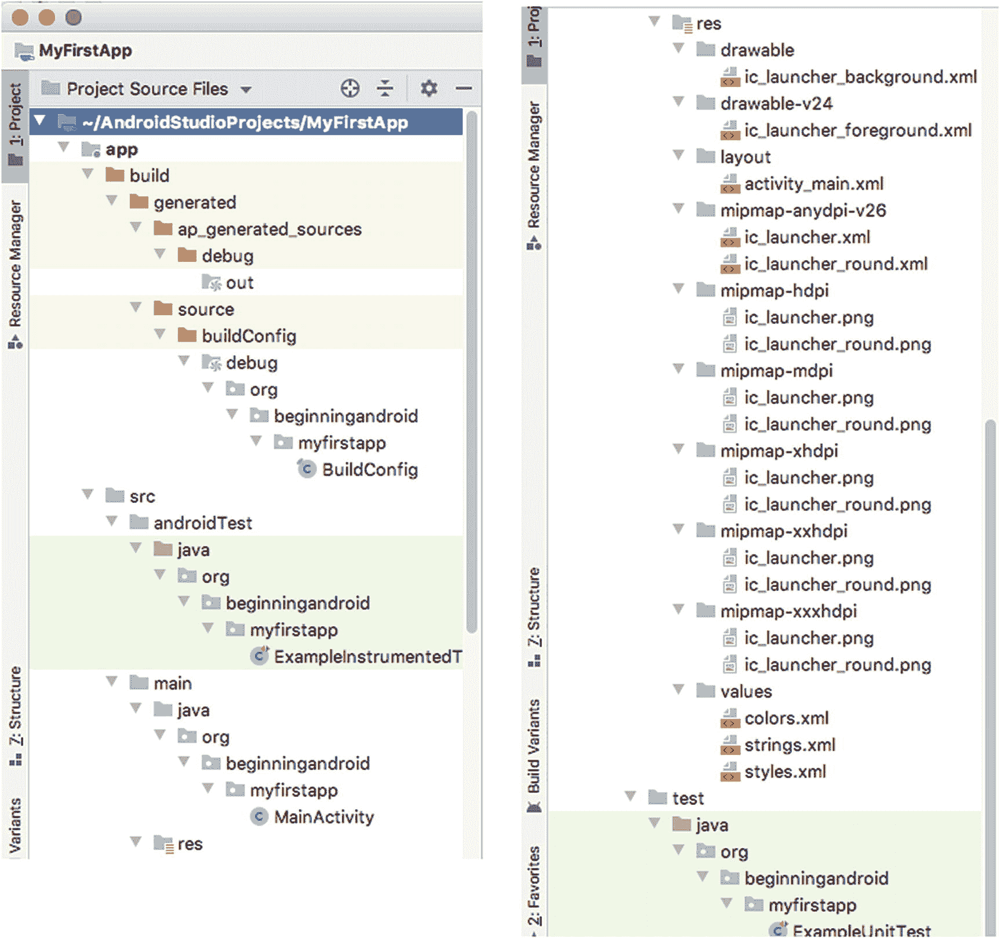

图 5-1

Android Studio 项目资源管理器中的`项目源文件`视图

你可以在 `src` 文件夹层级下看到一些熟悉的条目，例如你的 `myfirstapp` Java 源文件及其 `MainActivity` 代码。如果在此视图中稍作浏览，你还会看到其他源文件，比如用于测试代码的模板文件，以及一些可编辑的 `XML` 文件，它们用于控制视觉布局、可复用的字符串值等。

但最值得注意的是那些**没有**显示的内容。你再也看不到 Gradle 构建文件、IntelliJ IDEA 偏好设置与配置文件、构建产物以及其他非代码项了。所有这些都被隐藏起来了，这样你就能专注于代码！我听到你在问：“为什么要这样做？” 除了前面提到的个人偏好和专业需求外，`项目文件`视图尤其受到一些开发者的青睐，他们发现自己在“心流”状态下工作效率最高：这是一种深度沉浸于代码、不受干扰的心智状态。

另一个流行的视图是`项目`视图，它按照许多传统 Java IDE 的方式排列项目元素和组成部分。图 5-2 展示了这个视图，你会注意到一些明显差异，特别是在外部库和引用的呈现方式上。

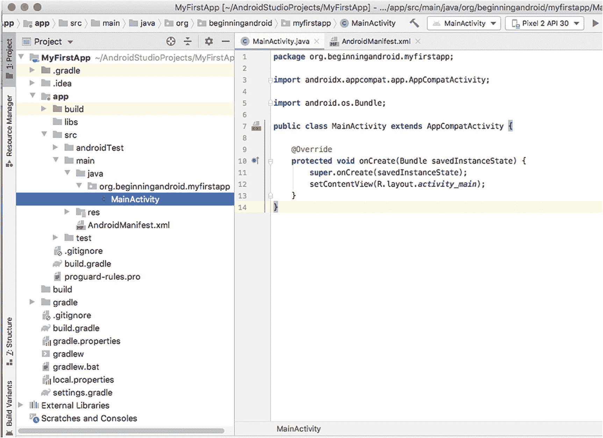

图 5-2

Android Studio 项目资源管理器中的`项目`视图

我强烈建议你探索项目资源管理器中的所有视图选项，找到最适合你工作方式的变体。

有一件非常有用的事情需要记住：无论你使用哪种视图，也不管你切换多少次视图，Android Studio 实际上并不会物理地改变你的项目或移动文件。它只是为你提供了一个不同的虚拟视图。

### 使用项目资源管理器的上下文菜单

与你可能使用过的许多其他应用程序一样，Android Studio 也提供了可以通过鼠标右键（或在 Mac 上使用 Command+单击）访问的上下文菜单。在探索项目资源管理器中的视图时，你应该对所有看到的内容调用上下文菜单，以了解它提供了哪些功能。无论是比较、查找等文件管理操作，快速编辑选项，还是启动更重要的代码管理操作，上下文菜单都是你应该熟悉使用的专业工具之一。

上下文菜单中的所有选项都可以在 Android Studio 的主菜单中找到，但它们通常深藏在三四级菜单之下。

## 使用 Android Studio 运行和调试

如你在第 3 章所见，让 Android Studio 以模拟器或设备方式运行程序的主要方法之一，是配置运行配置。我们稍后会重新讨论运行配置，但了解还有其他运行应用程序的方法也是件好事。

### 使用运行配置运行：回顾

我们在第 3 章的目标是尽快让你的第一个应用程序运行起来，因此我们跳过了运行配置的许多细节。有些关键方面值得重新审视，因为你很快会想开始创建更多具有不同特性的运行配置，以帮助你在应用程序开发的不同阶段工作。

通过 Android Studio 的 `运行` ➤ `编辑配置…` 菜单，调出“运行配置 1”（或你之前用于保存运行配置的任何名称）的详细信息。你应该会看到熟悉的屏幕，显示你的运行配置，如图 3-16 所示。对于任何运行配置，都有各种选项分布在四个子窗口中。有些你可以自行探索，但需要熟悉的主要配置项如下。

#### 运行配置：常规选项

- **模块** ：指定构建过程要针对的具体模块；如果未指定，则表示应针对整个项目。在实际应用中，这有助于处理较大的多模块项目，在某些情况下你可能只想重建/重制一个特定模块——通常是因为只有那个模块发生了更改。
- **安装选项 – 部署** ：指示 Android 应用程序构建完成后应该执行什么操作。是应该在设备或模拟器上运行（因此需要部署），还是你只关心确认应用程序能无错误地成功构建，而无需实际运行？
- **启动选项 – 启动** ：此设置控制在成功构建被部署并启动后发生什么。应用程序应该按照 Android Manifest XML 文件运行并启动默认 Activity，还是在此特定运行配置中应使用不同的启动点（例如应用程序中的替代 Activity，或不启动任何 Activity）？
- **安装标志** 和 **启动标志** 超出了我们目前对运行配置的讨论范围。

#### 运行配置：杂项

杂项选项控制在构建被部署和启动时，你的目标环境“清理”的程度。这里的“清理”指的是像日志、应用程序的先前版本等产物，是作为运行配置的一部分被保留还是被清理。

- **Logcat** ：我们将在本章后面详细讨论 `Logcat`，但这些设置决定了是否默认通过 `Logcat` 工具始终向你显示 `Logcat` 输出，以及是否应清理先前运行的输出。如果不加管理，这些日志会变得非常庞大，所以如果它们变得难以掌控，请记住使用清除日志设置。
- **安装选项** ：如果没有任何更改，你可能希望跳过再次部署应用程序，这可以在更广泛的工作流程中节省时间。了解你不会影响正在运行的应用程序实例可能很重要，例如，当涉及到保存状态或从一个已知的良好起始条件运行时。


#### 运行配置：调试器

那些熟稔各类软件编写的读者都会明白，软件开发并非一项尽善尽美的任务。问题频发、意外行为层出不穷、应用因不可预测的原因崩溃，诸如此类的情况比比皆是！

随着你花时间编写、调试和审查代码，调试器屏幕上的选项会随着时间的推移变得更有意义。无论你的经验水平如何，都需要关注以下几个关键选项：

- **调试类型**：本质上，这为 Android Studio 提供了关于项目中应包含何种代码的指引。可以明确设置为 `Java`、`Native`（通常指通过 Android NDK 扩展实现的 C++）、`Dual`（Java 和 Native 混合）或 `autodetect`。与依赖 `autodetect` 相比，明确指定语言类型的一个好处是，可以节省少量时间，避免 Android Studio 扫描你的项目以确定语言类型，并且不会为不存在的语言加载调试工具。

- **显示静态/全局变量**：当出现问题时，许多开发人员首先使用的工具之一是检查工具——即，在遇到问题时能显示部分代码当前状态的工具，例如特定变量分配的值。此选项将静态/全局变量与你代码中在方法内定义的变量一同显示在你的视图中。

- **调试优化代码时发出警告**：语言编译器一个非常有用的特性是，它们能够优化人工编写的代码，使其运行得更高效。当发生这种情况时，实际运行的代码并非严格意义上你编写的代码，尽管结果应该是一致的。此设置允许在你转而调试已被编译器优化过的代码时收到警告。

其他设置（如符号目录和 LLDB 选项）超出了本书的讨论范围。

#### 运行配置：性能分析

任何形式的 Android 性能分析工具，都花了很长时间才达到开发人员所需的那种成熟度和洞察力，以帮助他们了解其应用对环境资源的需求。即使在几年前，无论是在 Android Studio 还是 Eclipse 中，这些工具仍然达不到大多数人的期望。如今，这些工具在不断完善，我们将在后面的章节中深入探讨一些领域时，提及其中部分工具。其中一些改进后的选项可以直接在你的运行配置中进行配置，如下所示：

- **启用高级性能分析**：对于在目标 SDK 为 API 级别 26 或更低版本上工作的开发者来说，要确定应用即时环境中发生的事情可能会令人沮丧，例如，网络行为和流量、已处理或丢弃的事件等等。`Enable Advanced Profiling` 选项能够为较旧的目标 API 级别捕获更多指标。对于瞄准当代 API 级别（例如 30+）的开发者来说，这现在是 Android Studio 及相关工具中标准性能分析行为的默认部分。

- **启动时开始记录 CPU 活动**：此设置旨在分析应用使用过程中 CPU 周期消耗在何处。这至少有两个好处：第一是了解应用各个部分将如何执行，这在考虑用户满意度时非常重要——运行缓慢的应用可能导致用户对你的应用感到沮丧。第二个好处则更为抽象。由于 CPU 使用是智能手机电池最耗电的方面，因此 CPU 活动记录有助于你了解你的应用在使用时是否是导致电池耗电的主要因素。CPU 活动设置可能不适合你在 Android 学习初期就开始使用，但一旦你开始探索诸如视频使用、设备端计算等 CPU 密集型 Android 功能，它将成为你开发工作流程中的主要工具。

### 使用 AVD 和已连接的设备进行更深入的运行

在第 3 章中，我们逐步创建了一个初始运行配置，然后使用我们创建的第一个 AVD（名为 `Pixel 2 API 30`）来实际运行你的应用，并向你展示结果活动屏幕。使用 AVD 是 Android Studio 为你提供的最强大功能之一，它使你能够在各种虚拟设备上进行测试和实验。

从技术上讲，AVD 管理器是一个独立的工具，Android Studio 将其集成并提供出来，以简化你的开发工作——这就是我在第 2 章中介绍的“集成”理念。除了可以从 Android Studio 的“工具”菜单或显示为小手机图标的工具栏按钮启动 AVD 管理器外，你还可以直接从命令行或 shell 运行 AVD 管理器的命令行版本，作为 SDK 工具目录下的一个独立工具。

要找到 SDK 工具目录，请从你 Android 安装路径的根目录（例如，macOS 上的 `~/Library/Android`，或者你在第 2 章中为 Linux 或 Windows 安装所选择的 Android 目录）下找到 `sdk` 子目录。在 `sdk` 子目录内，继续进入子目录 `tools ➤ bin`。其中包含一个名为 `avdmanager` 的二进制可执行文件。从名称可以猜到，这就是独立的 AVD 管理器可执行文件。如果查找 SDK 工具目录有任何困难，请使用操作系统的搜索功能。

当从命令行运行时，你会得到命令行输出，如代码清单 5-1 所示，具体取决于你传递给 `avdmanager` 命令的选项。

```
$ avdmanager list avd
可用的 Android 虚拟设备：
名称: Pixel_C_Tablet_API_30
设备: pixel_c (Google)
路径: /Users/alleng/.android/avd/Pixel_C_Tablet_API_30.avd
目标: Google APIs (Google Inc.)
基于: Android API 30 标签/ABI: google_apis/x86
皮肤: pixel_c
SD 卡: 128 MB
代码清单 5-1
avdmanager 工具的命令行输出
```


## 重温 AVD 管理器

既然你已经掌握了多种启动 `AVD 管理器`的方法，现在就请通过 Android Studio 的 `工具` 菜单启动它，因为我们将为后续练习创建第二个 `AVD`。如果需要帮助，你可以重新查看第 2 章中的逐步操作指南，但以下是创建第二个 `AVD` 的目标：

- **类别 – 平板电脑**：我们想要创建一个平板电脑尺寸的 `AVD`，这将有助于使用书中的示例测试更大的设备。
- **名称和类型 – Pixel C 平板电脑 API 30**：这是最出色的通用平板电脑之一，也是最近发布的一款搭载谷歌直接提供的纯净版 Android 系统的设备，是测试平板设备的绝佳基准。
- **系统映像 – R (API 级别 30)**：这是最新的 SDK，带来了 Android 为平板电脑形态设备提供的最新功能。

**注意**：你可能会看到 `R` 系统映像旁边有一个蓝色的下载链接。这表明必要的 Intel x86 系统映像尚未安装到你的机器上。你需要点击下载链接并安装该系统映像，此 `AVD` 才能成功启动并工作。

- **AVD 名称 – Pixel C 平板电脑 API 30**：你可以使用任何喜欢的名称，但此示例名称在 `AVD 管理器`中看到该 `AVD`，或在活跃运行、测试和调试代码时看到这个正在运行的模拟器进程时，会提供一些有用的线索。

完成后，你应该会在 `你的虚拟设备` 窗口中看到（至少）两个 `AVD`，如图 5-3 所示。

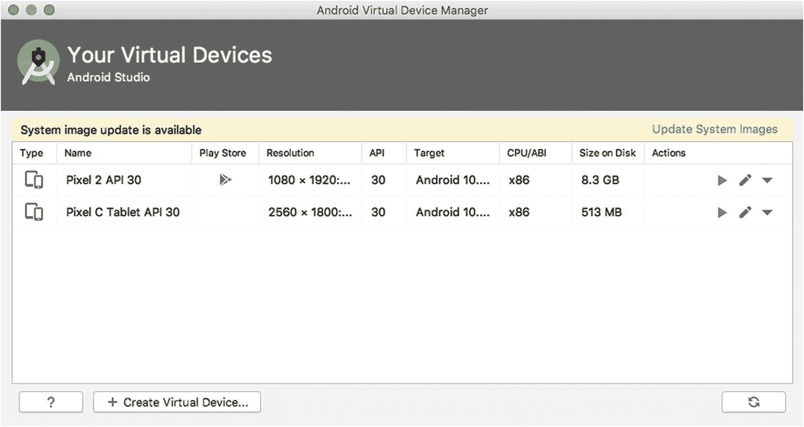

图 5-3 – 在 AVD 管理器中配置多个 AVD

创建第二个（或第三、第四个）`AVD` 的目的不仅仅是为了展示另一张 `AVD 管理器`的截图。拥有两个或更多 `AVD` 是使用 Android Studio 同时在多个设备或 `AVD` 上运行相同代码的必要条件。

在 Android 开发工作中，你会希望锻炼这种同时在多个不同的 `AVD` 和设备上进行测试的能力，原因有很多。在前面的章节中，我们提到了全球销售和使用的设备的多样性、支持的 Android 版本和 SDK 版本的分裂特性，以及其他一些因素，这些都意味着你的应用程序可能在一系列细微不同的设置中运行。首先，在多种设备上并排运行你的应用程序，有助于你发现用户可能在现实世界中看到的某些奇特现象和差异。这种能力的第二个主要好处是，可以观察你的应用程序在小屏幕（一次只显示一个 Activity）与大屏幕（例如平板电脑）上的表现。在大屏幕上，你的 Activity 可能会缩放成不同尺寸，或者作为使用 Fragment 的多 Activity 显示的一部分（我们将在第 11 章中介绍）。使用多设备或 `AVD` 测试的第三个原因是，查看 Android 如何在不同显示密度和分辨率的屏幕上缩放或插值特定分辨率的图像。

你现在就应该尝试在多个 `AVD` 上运行你的 `MyFirstApp` 应用程序。你可以从 `工具` ➤ `选择设备` 菜单选项触发此操作，或者使用同等的设备选择工具栏下拉菜单，如图 5-4 所示。

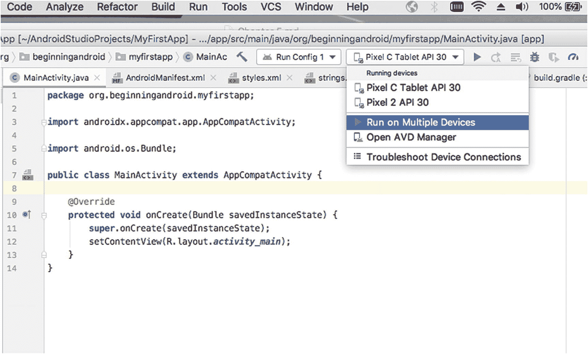

图 5-4 – 设备选择工具栏下拉菜单

选择 `在多个设备上运行` 选项，系统将提示你打开标题为 `选择部署目标` 的对话框。选择两个或多个设备或 `AVD`，例如，我们到目前为止在书中创建的 `Pixel C 平板电脑` 和 `Pixel 2` `AVD`，如图 5-5 所示。

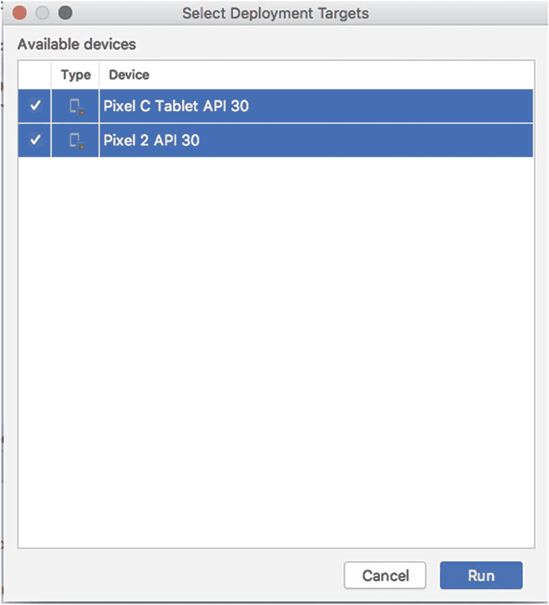

图 5-5 – 选择多个目标以在 Android Studio 中启动你的应用程序

同时启动多个 `AVD` 会花费一些时间，但稍等片刻后，你应该会看到你的 `AVD` 启动，并且 `MyFirstApp` 应用程序已部署并在所有 AVD 上运行，如图 5-6 所示。

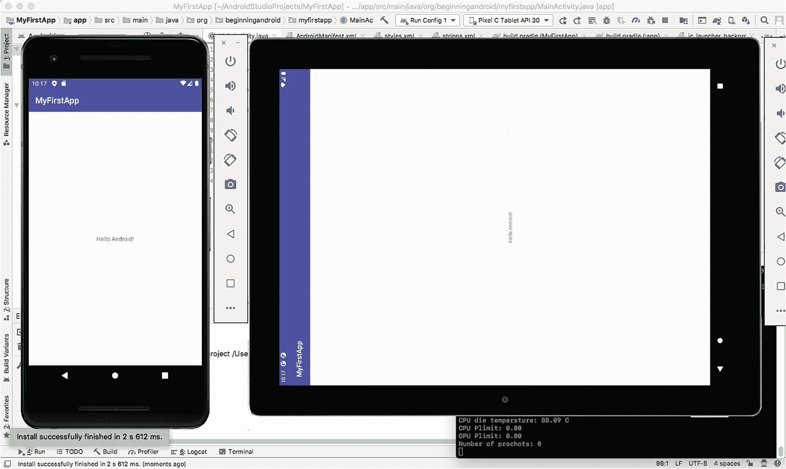

图 5-6 – 应用同时部署在多个 AVD 上

## 在真实设备上运行你的代码

虚拟设备对任何开发者来说都是一大福音，但有时，在真实设备上看到你的代码运行也是势在必行的。在最近的 Android Studio 版本中，Google 在测试和在真实设备上运行你的应用程序方面取得了巨大进展。从历史上看，将应用程序部署到真实手机上需要一长串命令行步骤，虽然你今天仍然可以走这条路，但 Android Studio 使得检测和使用通过 USB 电缆连接到开发机器的 Android 设备变得非常容易。

为了在开发应用时使用 Android 手机进行测试，你需要在手机上启用开发者选项。Google 一直以来都有一个启用此功能的技巧：打开手机上的 `设置`，滚动到 `关于手机` 选项。`关于手机` 屏幕上的最后一个选项是版本号。连续点击版本号显示的数字七次（没错，七次），你会看到一个倒计时提示，告诉你离启用开发者模式只剩几次点击了。

一旦你点击了足够的次数，你会看到一个屏幕通知，提示开发者选项现已启用，并且 `设置` 下会出现一个名为 `开发者选项` 的新菜单选项。默认情况下，该选项下会有一个名为 `USB 调试` 的子选项已启用。请再次确认你的手机上是否如此，如果尚未启用，请将其打开。

在手机上启用开发者模式后，通过 USB 电缆将其连接到你的开发电脑。你的手机应该会被自动检测到，然后 Android Studio 会将其识别为运行 Android 应用程序的潜在目标。

要测试这一点，请从菜单中选择 `运行` ➤ `选择设备`，或者打开工具栏上用于 `AVD`/设备的下拉菜单，如图 5-7 所示。

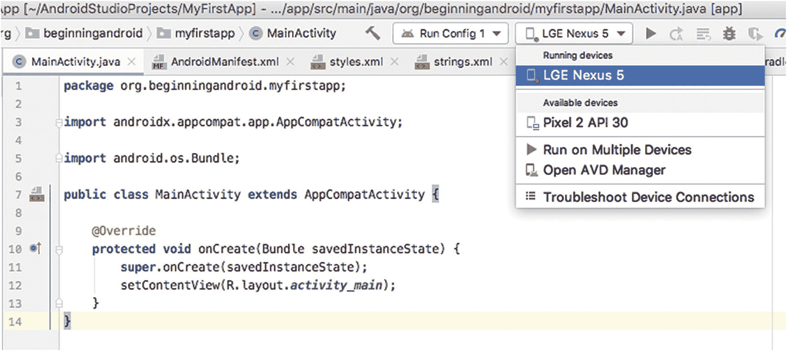

图 5-7 – 从 Android Studio 中选择一个已连接的、处于开发者模式的 Android 设备

选择你连接的设备，在我的例子中是 `Nexus 5` 手机。等待几秒钟，让 Android Studio 构建、打包并将应用程序部署到连接的设备上，然后你应该会看到你的应用程序在你的手机上加载并运行，如图 5-8 所示。

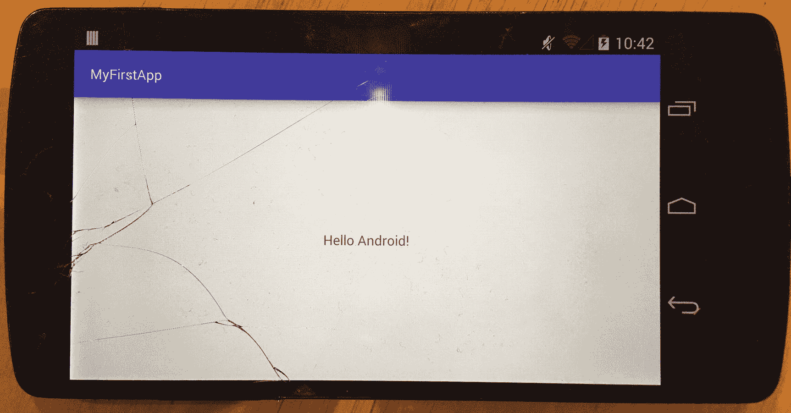

图 5-8 – 在已连接的 Android 手机上运行 MyFirstApp


## 调试而非运行代码

任何应用开发的新手最终都需要面对代码“出错”时的情况。无论是意外结果、异常行为、应用崩溃还是其他问题，调试都是找出应用中发生情况的主要方法。

调试是一个庞大的主题，因此与其试图在一章专门介绍 Android Studio 工具的章节中掌握它，不如先集中了解 Android Studio 中手头的主要调试工具，然后在本书后续介绍更复杂的 Android 应用时，再扩展讲解调试及相关主题。你还可以在本书网站 [`www.beginningandroid.org`](http://www.beginningandroid.org) 上阅读更多关于调试的内容。

在 Android Studio 中，有助于调试的四个关键概念如下。

### 设置和清除断点

断点是源代码中的一个标记，指示你想要中断或停止代码执行的位置，以便更详细地检查行为或问题。要在代码中设置断点，请双击项目资源管理器中的文件或对象，打开要处理的代码——在我的例子中，将是 `MainActivity.java` 文件。打开文件后，点击文件旁边行号右侧较暗的灰色页边距，如图 5-9 所示。

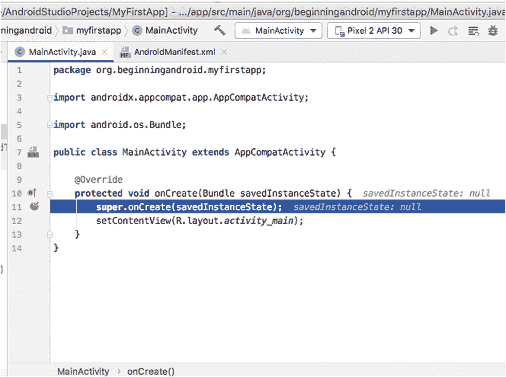

*图 5-9 在 Android Studio 中为调试设置断点*

你应该会看到点击处出现一个红色圆圈，表示已设置断点。如果出于某种原因，代表断点的红色圆圈没有出现，请打开“工具”菜单，选择“切换行断点”。再次点击或再次选择切换选项，将移除该断点。

### 启动应用进行调试

就像你可以通过单击“运行”选项或选择已设置的运行配置来运行应用一样，你也可以启动应用进行调试。这实质上执行相同的操作：调用 `Gradle` 构建应用，将应用部署到指定设备或 AVD 等。唯一不同的是，Android Studio 会预先准备好帮助你进行调试。

要以调试模式启动应用，只需从“运行”菜单中选择“调试 '运行配置 1'”（或类似选项）。除了构建和部署步骤外，你还会看到 Android Studio 的下方视图自动打开并显示调试窗口，其中包含调试器、控制台和其他调试工具的访问入口，如图 5-10 所示。

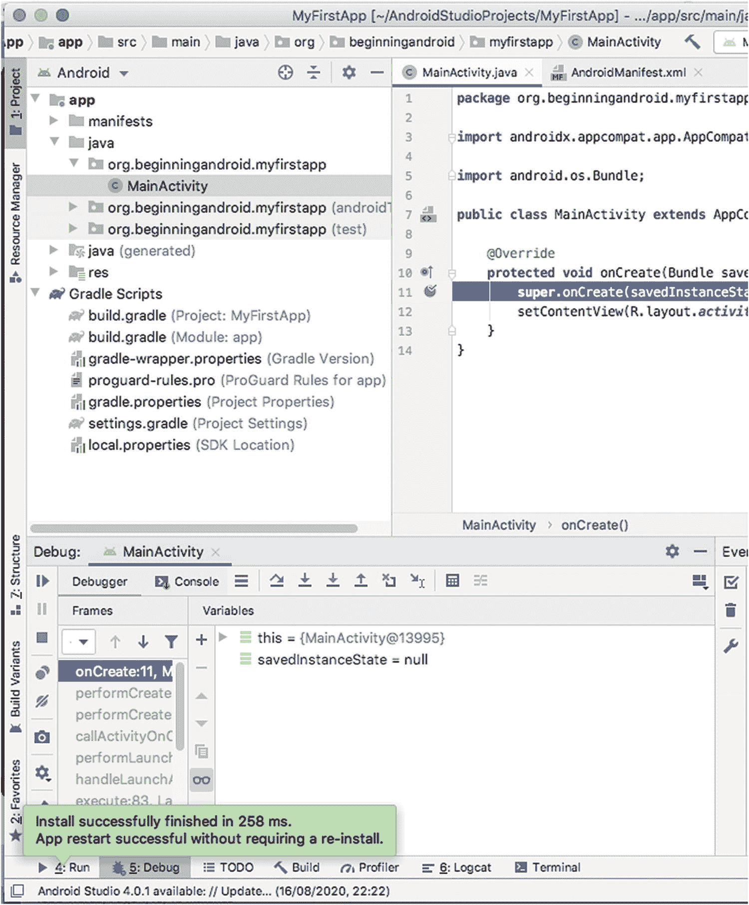

*图 5-10 Android Studio 中自动触发的调试视图*

根据你正在调试的内容以及是否设置了断点，你还会在“运行”菜单中看到额外的菜单项被激活，如图 5-11 所示。

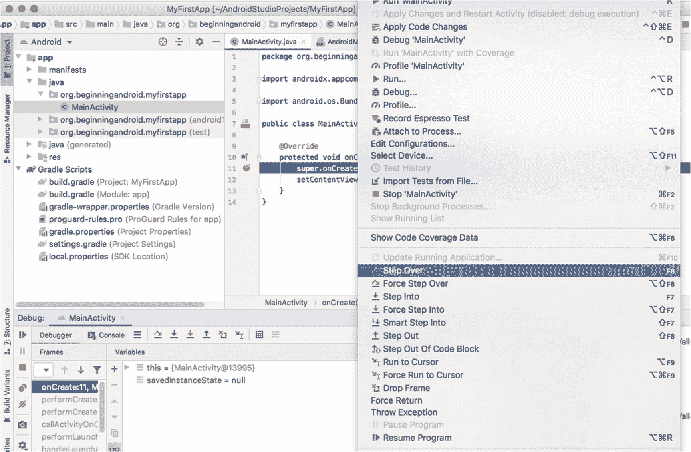

*图 5-11 用于单步进入、跳过和跳出代码部分的调试选项*

我将在下一个标题下解释这些“单步执行”选项。

### 调试时单步执行代码

你在图 5-11 中看到的“单步跳过”、“单步进入”、“单步跳出”等选项对于仔细检查代码正在执行的操作至关重要。通过一次一行地进入、跳过或跳出代码，而不是运行整个代码库，你可以一次一个动作地逐步执行应用逻辑，并结合变量检查以及查看 Activity UI 中的视觉或行为变化等其他工具，看到每一行逻辑的结果。

### 附加调试器

你并不总是能清楚地知道在哪里设置断点或单步进入/跳过代码。有时，你可能只是想更深入地了解应用中发生了什么，以理解某些难以解释的行为或问题。这正是调试器工具发挥作用的地方。我们无法在短短几页甚至一整章中详尽介绍调试器，所以我们不必为此纠结。你可以在本书网站 [`www.beginningandroid.org`](http://www.beginningandroid.org) 上了解更多关于调试器强大功能的信息。

要调用调试器并将其附加到正在运行的应用以帮助你了解情况，你可以使用“运行”菜单中的最后一个选项——“将调试器附加到 Android 进程”。你的应用必须已经在运行，此操作才能生效。

## 查看已运行的内容

你现在已经看到了足够多的第一个应用在 AVD 或真实设备上运行的示例，可能会想知道我说的“查看已运行的内容”是什么意思。为了解开这个谜团，“查看”你的应用运行不仅仅是指观察最终应用中呈现的 Activity。

Android Studio 提供了几个非常有用（有些人会说至关重要）的工具，让你可以查看应用在 Gradle 脚本（或其他工具）构建过程中发生了什么，以及应用运行时发生了什么诊断和日志信息。

在 Android Studio 窗口的底部，状态栏的上方，你会看到一组按钮，它们可以让你快速访问这些工具，名称如“TODO”、“构建”、“Logcat”等，你可以在图 5-12 中看到它们。

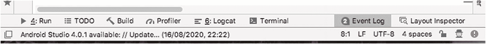

*图 5-12 在 Android Studio 中轻松访问事件日志、构建输出、Logcat 等*

让我们来看看这里的一些关键工具，这样你就能自如地将它们的使用融入到不断扩展的开发工具集中。

### 理解你的构建过程

“构建”工具会在“构建输出”窗口中显示构建过程的摘要，要么是“构建：已完成”消息（带有绿色勾号和一些时间信息，如图 5-13 所示），要么是阻止构建工作的一组错误或问题。

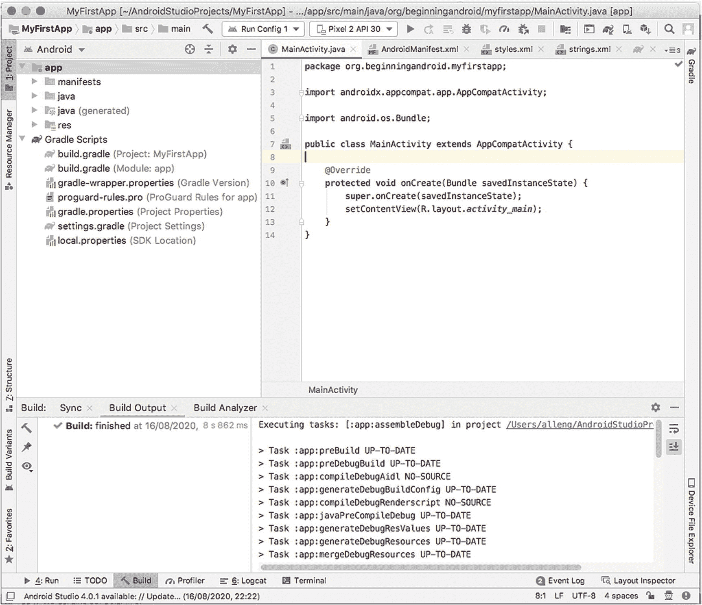

*图 5-13 Android Studio 中项目构建的构建输出视图*

你还会看到实际执行应用构建所执行的任务列表（在我的例子中是 20 个独立的构建步骤），以及一个指向“构建分析器”的链接，该分析器能更深入地了解每个任务花费的时间以及如何改进。


## 理解事件日志中的事件

另一个与 `Build` 工具相辅相成的工具是 `Event Log`。`Event Log` 以更高层次的视角展示所执行的操作，例如将新构建的应用加载到设备或 AVD 上所采取的步骤，以及从这些步骤中识别出的任何问题。清单 5-2 展示了构建 `MyFirstApp` 应用并在多个 AVD 实例上启动后的 `Event Log` 输出。

```
22:17 Executing tasks: [:app:assembleDebug] in project /Users/alleng/AndroidStudioProjects/MyFirstApp
22:17 Gradle build finished in 9 s 5 ms
22:17 Install successfully finished in 11 s 455 ms.
22:17 Install successfully finished in 2 s 612 ms.
22:18 Emulator: emulator: INFO: QtLogger.cpp:68: Warning: Error receiving trust for a CA certificate ((null):0, (null))
22:18 Emulator: Process finished with exit code 0
清单 5-2
在两个 AVD 上构建并启动 MyFirstApp 后的事件日志
```

你在 `Event Log` 中可能看到的典型错误，通常是那些阻止了构建或构建后活动的问题，例如为模拟设备指定了本机上不存在的 SDK 或基础镜像。后一类问题在 `Event Log` 中的显示示例如下：

```
Emulator: emulator: ERROR: This AVD's configuration is missing a kernel file! Please ensure the file "kernel-ranchu" is in the same location as your system image.
```

## 理解 Logcat

`Logcat` 是测试和调试工具集中最有用的工具之一。它的职责是在你的应用运行期间，以及应用意外停止运行、崩溃、出现问题、冻结等情况发生时，帮助从设备或 AVD 上收集诊断和运行时信息。

`Logcat` 会提供一个类似控制台的界面，用于检查和审查来自设备或模拟器的关键系统消息，包括应用在运行中遇到错误或异常时所发生的所有重要堆栈跟踪信息。当代码在一个环境（例如开发者工作站的 AVD）中运行完美，但在特定品牌或型号的手机上运行时却遇到意外问题时，这种能力极其有用。

要使用 `Logcat`，只需在应用运行期间，或设备/AVD 正在执行其他任务（例如启动）时，点击工具栏上的按钮即可。默认情况下，你会看到一长串从应用和设备当前状态中收集到的 `Logcat` 条目，如图 5-14 所示。

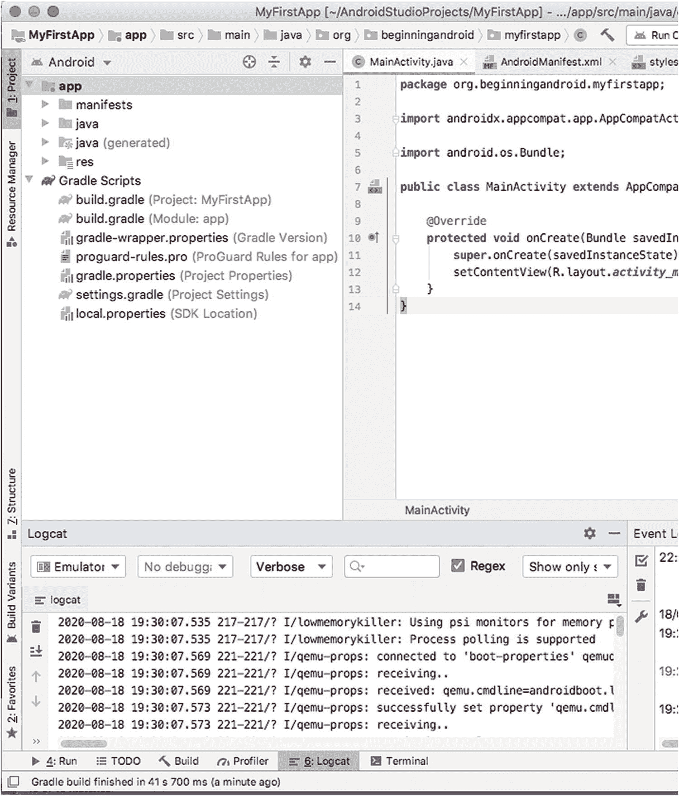

**图 5-14**  
Android Studio 中的 `Logcat` 输出

此示例中的 `Logcat` 输出相对无害，但当问题出现时，`Logcat` 中的堆栈跟踪和其他诊断信息将变得无比宝贵。

## 重新审视 SDK Manager

通过 Android Studio 可用的主要工具中，最后一个要重新审视的是你在第 3 章首次见到的 `SDK Manager`。你可以随时通过打开 `Tools` 菜单并选择 `SDK Manager` 条目来调用和使用它。通过此操作，你可以查看已安装的 SDK 版本，以及尚未安装或有可用更新的版本，如图 5-15 所示。

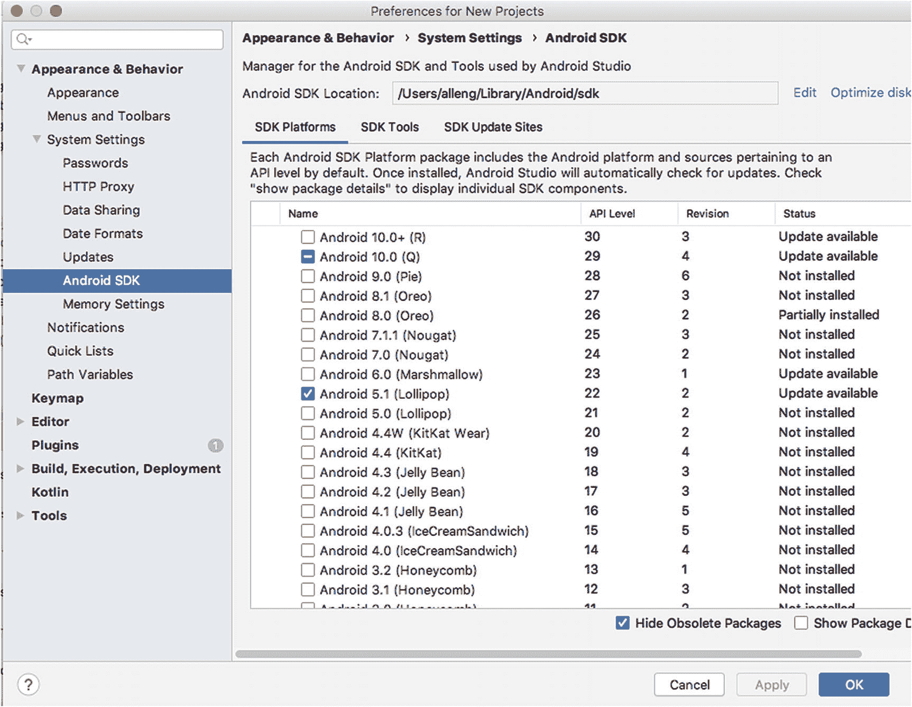

**图 5-15**  
重新审视 Android SDK Manager

正如你所料，你可以勾选任何尚未安装的 SDK 版本，然后点击 `Apply`，`SDK Manager` 将在后台开始下载并安装这些版本。在以下两种工作场景中，你很可能会需要这样做：第一，确保你拥有代表常见或流行的 Android 版本（例如 4.4 “KitKat”）的 SDK；第二，当 Google 随新版本 Android 发布新 SDK 时，你需要测试这些新功能。

但使用 `SDK Manager` 还有另一个原因，那就是它能够帮助你在 Android Studio 体验中添加额外的“好东西”。切换到 `SDK Manager` 的第二个标签页，名为 `SDK Tools`，你将看到一个宝藏库，其中包含的众多额外工具很快就会成为你最爱用的工具。我们将在本书后续的相关章节中重新审视其中一些工具，但我先标记两类开发者经常使用的工具。它们是 `Android SDK Command-Line Tools`，它提供了从命令行管理和控制 SDK 包的额外功能；以及各种额外的 Google Play 库和 SDK，它们能帮助你构建使用 Google 专有 Google Play 服务的依赖项和库的应用。

你可以现在勾选这些工具进行下载，也可以等到本书后续章节再操作。

## 突出 Android Studio 的其他主要功能

本章介绍了 Android Studio 的一些关键功能，这些功能可用于管理、执行、检查和诊断你在构建中的应用，以及管理和使用作为应用开发工作一部分的关联 SDK 及其他工具。

但 Android Studio 中最大的一组工具，毫无疑问是与编写代码、审查代码、详细检查代码、重写代码等直接相关的。我们将在本书的第二部分中，结合介绍 Android 应用编码的诸多方面，来介绍 Android Studio 的这些功能。

## 总结

本章向你介绍了任何软件开发者都会用到的主要工具——IDE。现在你应该有信心进一步探索 Android Studio 中的更多选项了，并知道总能找到项目所需的核心工具。

