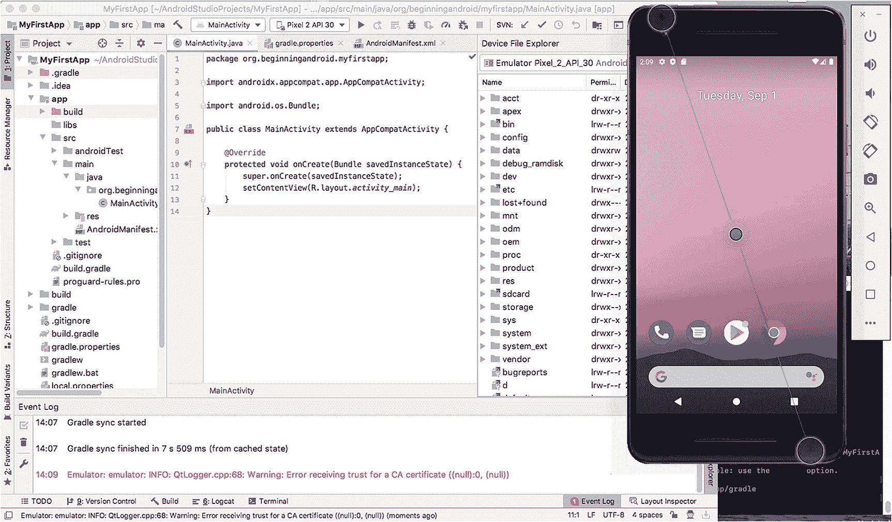
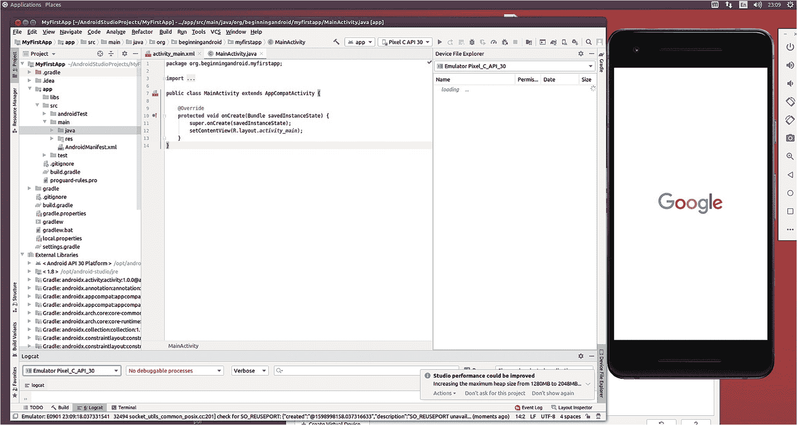
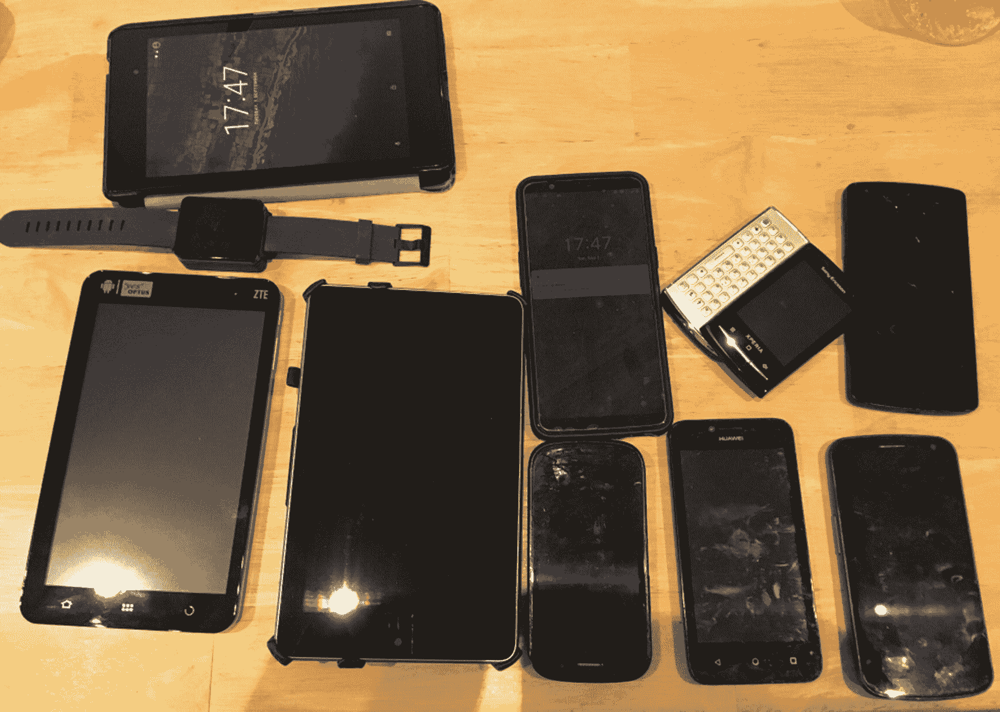
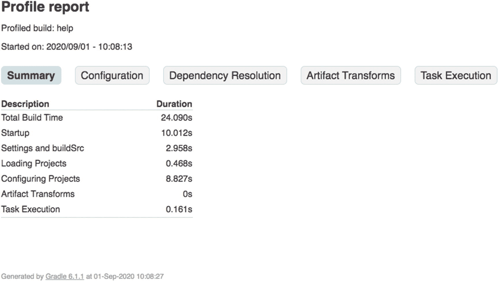
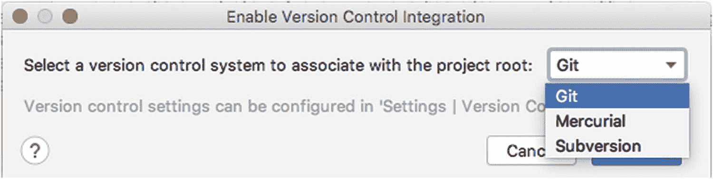
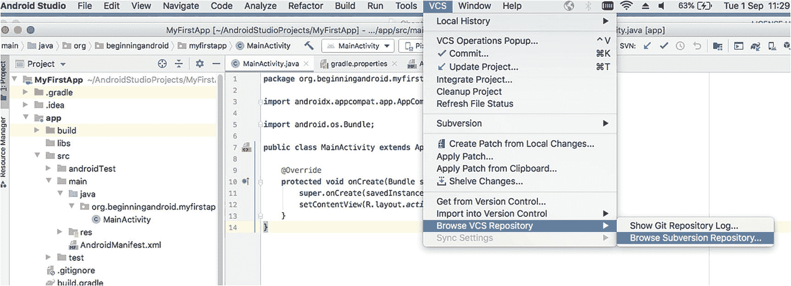

# 6. 掌握你的整个开发者生态系统

为 Android 开发进行设置，不仅仅只是安装 Android Studio。虽然你可以只做这一步——并且只做这一步——但你最终会发现，计算机的其他方面，以及它运行的软件，将对你作为 Android 开发者的生产力、抱负和能力产生重大影响。本章虽非详尽无遗，但确实提供了一些重要的基础性考量，以及进一步学习的链接。请继续阅读！

## 选择专用开发者硬件

在第 2 章中，我为认真的 Android 开发者介绍了一个关于计算机方面考量的简短清单。以下是再次总结：

1.  我将使用什么台式机或笔记本电脑硬件来进行 Android 开发？

2.  我将在台式机/笔记本电脑上运行什么操作系统？

3.  在使用 Android Studio 之前，我的系统需要哪些先决条件？

4.  在开发过程中，我将使用哪些 Android 手机（如果有的话）？

我当时提出的准则依然适用。近年来生产的几乎任何一台手头可用的电脑，都可以作为一台不错的开发者工作站。无论是台式电脑还是笔记本电脑，它都能胜任工作。

但本书的目的不仅仅是“胜任工作”。如果你真正渴望成为一名专业的 Android 开发者，那么就像其他专业人士依赖工具和设备来提高效率和杠杆作用一样，你也应该思考哪些工具能够提升你的开发工作以及你创建优秀应用的能力。

让我们首先来看看，如果你正在寻找能让你在构建 Android 应用时获得不公平优势的开发者硬件，你可能需要考虑哪些因素。


### 如何选择适合你的 CPU

2020 年，`x86_64` 架构的 CPU 选择众多：AMD 的锐龙（Ryzen）和线程撕裂者（Threadripper），以及英特尔（Intel）的酷睿（Core）系列。关于哪款最好，众说纷纭，而这些评判通常着眼于原始 CPU 速度（`时钟频率`）、封装内的核心数量、各级板上缓存以及其他几项特性。

就一台专用的 Android 开发者电脑而言，任何当代的英特尔或 AMD CPU 都绰绰有余。如果你想要针对 2020 年代 CPU 的具体推荐，可以关注英特尔酷睿 i5 和 i7 系列，以及 AMD 锐龙 7 和锐龙 9 系列。它们拥有足够的速度、可观的核心数量（通常为四核或以上）以及良好的 `L1`/`L2`/`L3` 缓存。

AMD 和英特尔都有性能更强的 CPU，但通常你会发现它们主要通过更多核心来区分，偶尔还会支持其他功能。在 Android 开发领域，核心多并不总是更好。对你而言，并行运行的关键活动包括：在 Android Studio 中工作并在一个或多个 AVD 中查看结果时的任何同步操作；对于足够大的多项目应用，如果 Gradle 配置支持，还包括并行构建活动。我的建议是，别让钱包为最昂贵的酷睿 i9 及类似 AMD 处理器买单，而是将这笔钱投入到开发者工作站的其它部分，比如更大的内存或更好的屏幕。

另一种日益流行的 CPU 架构是 Arm。Arm 是当今全球几乎所有移动设备的核心，这得益于“片上系统”（SoC）设计的广泛普及，这些设计都采用了 Arm 架构。基于 Arm 的台式机已经面市，甚至 Arm 服务器市场也在萌芽，但这里有一个有趣的难题。

尽管全球销售和使用的绝大多数 Android 设备都采用 Arm 处理器，但使用基于 Arm 的计算机进行计算密集型工作负载（例如构建/编译 Android 应用）仍然是一个挑战。可以肯定的是，这并非不可能。但速度和性能上的权衡仍然显著。而最大的障碍在于，你期望使用的工具是否能在基于 Arm 的计算机上使用。最值得注意的是，`Android Studio` 并不支持 Arm——它只能在 `x86` 架构的计算机上运行。同样，Google 也只将其多个版本的 Android SDK 打包成 `x86` 格式，而非 Arm 格式。这意味着如果你选择基于 Arm 的开发机，你将需要使用自己的构建工具来启动所有工作，规避缺少易于捆绑的 Android SDK 等问题，以及其他更多麻烦。我不建议你去挑战这个难题。

### 内存再多也不嫌多！

有时我真希望给自己增加内存能像给台式电脑加内存一样简单。就目前而言，为了获得更强的开发火力，你和我只能满足于购买 RAM 了。

回想一下第 2 章，你会记得 Google 建议 Android Studio 的最低内存为 4 GB，首选基础级别为 8 GB。实际上，现在很难买到只有 4 GB 内存的新电脑了。所以，引用一句经典电影台词：8 GB 就够了吧？

别急！你当然可以用 8 GB 内存的电脑高效地开发 Android 应用。事实上，我正是在一台 2015 年款、拥有 8 GB 内存的 MacBook Air 上撰写了本书的很大一部分，并构建了你们看到的某些示例，所以这远非只是理论上的可能。不过，我可以告诉你，它存在明显的局限和令人沮丧之处。一些明显的例子是，当我试图同时运行 Android Studio、一个 AVD，以及我在本章及全书后面讨论的图像和视频处理开源工具时，8 GB 内存很快就被耗尽，然后这台 MacBook 会尽职尽责地开始增加——并越来越多地使用——磁盘上的交换空间，以在真实内存和我提出的更高需求之间进行调度。

对比之下，我信赖的台式机则大不相同。它甚至更老，是一台将近十年前生产的“经典”Dell Precision 工作站——我都不确定戴尔现在是否还生产这种机型。但它拥有 32 GB 内存，在同时运行 Android Studio、多个 AVD，以及为了稳妥起见再开的几个其他工具时，也毫不费力。

**注意**

从我的配置可以看出，我推荐硬件并非为了收取推广费或回扣。如果你有时光机，请务必跳到 2010 年或 2015 年，去买我当年用的那款硬件吧！

如果你正在规划自己的 Android 开发者系统，我给你的简洁建议是：从来没有人抱怨过自己的内存太多！如果条件允许，至少配备 32 GB；追求奢华的话，64 GB 足以应对未来多年的 Android 开发需求。

对于那些打算购买笔记本作为主力开发机的人，要特别关注你中意型号的最大支持内存是多少，以及购买后能否更换内存。也就是说，内存是焊接还是固定死的，以至于如果不进行昂贵且可能使保修失效的操作就无法更换或升级？你可能会发现自己受限于 16 GB——如果你能选择一个支持 32 GB 的型号，未来你会感谢自己的决定（或许也会感谢我！）。


### 存储一切！

随着你开始构建越来越多的 Android 应用，对磁盘空间的需求也会增加，以容纳各种项目、资源等。有些地方显然会消耗磁盘空间，例如源代码文件（体积很小）以及图像和视频文件（体积可能非常非常大）所占用的空间。

还有一些 Android 开发特有的方面，仔细想想也很明显，比如不同版本的 Android SDK，每个版本可能需要高达 1 GB 的空间。

在考虑存储需求时，`AVD` 是一个隐藏因素。因为创建一个新的 `AVD` 镜像来测试某种屏幕尺寸或设备格式非常容易，所以在你意识到之前，很可能就已经有 20、30 甚至更多个 `AVD` 了。如果你要认真地在多种屏幕尺寸和分辨率上进行测试，那么拥有几十个 `AVD` 是最低要求。

当你在系统中配置了数十个 `AVD` 后，很容易就会消耗掉 50 GB 甚至更多的空间。`AVD` 最大的存储消耗因素之一，是你为其分配的板载存储或模拟 SD 卡存储的大小。这些选项是通过分配你的实际磁盘空间来模拟的，这意味着如果你想模拟一台拥有 128 GB 存储的最新 OnePlus 7 设备，那么你的 `AVD` 就会占用你真实磁盘空间的 128 GB 甚至更多！当然，你不必为模拟 SD 卡和设备存储分配如此大的空间，但通常你至少会分配一个可用的容量，所有这些加起来就很可观了。

在开始 Android 应用开发之旅时，一个比较实用的存储空间预估值大约是 50 GB。这足以让你安装几个版本的 Android SDK、一定数量的各种尺寸和配置的 `AVD`，以及 Android Studio 和其他工具。为了未来用起来更舒适，特别是为了测试目的而准备大量 `AVD` 时，你应该争取拥有 100 GB 或更多的空间。

与存储空间大小同等重要的是存储类型及其速度。传统的机械硬盘当然便宜，但代价是数据传输速度，也就是 IOPS（每秒输入/输出操作次数）。现代存储选项，例如固态硬盘 (SSD)，在数据传输性能方面有显著提升，因此从构建和运行 `AVD`、部署大型应用以及依赖大量图像和视频资源的应用，到任何数据密集型的计算或操作，其运行速度都会更快。

如果你有选择余地，请始终选择固态存储方案，尤其是当你计划进行数据密集或计算密集的开发时。对于那些正在考虑购买专用笔记本电脑用于开发的人来说，由于近年来市场已大幅转向 SSD，你会发现自己有非常多的选择。

### 查看一切！

如果你要成为一名专注的 Android 应用开发者，你将需要长时间盯着屏幕。鉴于此，你可能需要考虑如何充分利用你将要观看的屏幕，以及你是否需要不止一个屏幕。

在显示器或屏幕方面，开发者的满意度很大程度上取决于高度个人化的因素。你喜欢大屏幕吗？你更喜欢多屏吗？不同朝向的屏幕（横屏或竖屏）对你更有帮助吗？你会将笔记本电脑的屏幕与固定显示器混合使用吗？需要考虑的因素远不止这些，但我会重点指出两个对你产生长期有益影响的关键特性：尺寸和清晰度。

说到屏幕尺寸，一些实际考量会让你相信，至少买一个大屏幕是值得的。回顾第 5 章的图 5.6，你会看到两个并排运行的 `AVD`，一个代表普通手机屏幕，另一个代表平板电脑屏幕。你不会惊讶于图中视图几乎占满了我 MacBook Air 的 13 英寸屏幕。如果仔细看，你可以看到隐藏在 `AVD` 屏幕后面的 Android Studio 会话的微小片段。但你能看到的也就这些了。在这个尺寸的屏幕上，如果不做出一些非常别扭的妥协，你根本无法在 Android Studio 中进行有效的并排开发，同时又在 `AVD` 中观察效果。你可以在 Android Studio 中调整屏幕和窗口的大小，也可以平铺窗口，试图在运行单个 `AVD` 的情况下把所有内容都塞进去，如图 6-1 所示。



图 6-1

在 13 英寸笔记本电脑屏幕上并排运行 Android Studio 和一个 `AVD`

如果你认为这样有助于实时调试或同时比较不同布局，我得说这根本不行。这简直就是个大麻烦！相比之下，在 24 英寸屏幕上，Android Studio 和多个 `AVD` 可以愉快地生活在一个拥有充足空间的屏幕上，如图 6-2 所示。



图 6-2

在 24 英寸屏幕上运行 Android Studio 和多个 `AVD`

就让这些图片胜过千言万语吧。等你仔细看完之后，我对屏幕尺寸的总结性陈述将无需更多佐证。如果可以，买一个大屏幕吧！

说到屏幕质量，特别是像素密度，我们又进入了一个非常主观的领域。在撰写本书的 2020 年市场，你可以从多代“高密度”屏幕中选择，还包括 4k、5k，甚至 8k！你的个人品味和偏好是最重要的考虑因素，但我建议你牢记以下两点：

1.  **亲眼看看屏幕的实际效果**。如果可能的话，去一个能给你展示实际连接到任何类型电脑上的屏幕的零售商那里看看。这能让你直观感受显示器实际表现如何，并让你可以调节亮度、白平衡、对比度和刷新率等参数，以确保屏幕的表现令你满意。

2.  **选择分辨率密度与你要构建的应用相当或更高的屏幕**。在本书后续章节中，我们将更多地讨论 Android 屏幕分辨率的选项和机制。为了确保在开发和测试中能尽可能真实地展示你的作品、图片、视频和其他应用资源在真实设备上的显示效果，请确保你为开发系统选择的屏幕至少不差于（甚至优于）你的目标设备。否则，你会对事物在实际运行中的样子产生扭曲的认知。


### 整合所有配置！

在搭建开发环境时，还需考虑以下其他方面：

1.  **键盘和鼠标**：这看似平常，但你会大量使用这些外设。不要将就不喜欢的设备！

2.  **USB 端口与数据线**：如果你计划通过连接安卓设备进行大量应用测试，那么配备充足的 USB 端口、数据线以及合适的转接头是值得的。大多数较旧的安卓设备使用 micro-USB 接口，而较新型号已转向 USB-C 接口。

3.  **充电线、底座和设备**：同样，如果你计划使用大量实体安卓设备，保持它们的电量充足会变成一项琐事。虽然可以通过连接开发机的 USB 接口充电，但旧版 USB 协议能提供的电力有限。直到 USB-C 出现，“标准” USB 才能提供超过 500 mA 的电流。尽可能腾出空间，并考虑使用可直接插入墙插的充电器。

这些要点很容易被忽视，但它们能让你的开发体验更顺畅、更愉快；反之，如果忽略它们，你会发现这些细节会带来摩擦和挫败感，破坏你最好的努力。

## 测试手机和平板

在开始讨论测试手机话题之前，我想先说明一点：并没有硬性规定要求你必须拥有实体安卓手机来测试你的应用。许多应用完全是基于模拟环境（例如 AVD 等）进行构建和发布的。

然而，许多应用是基于在多种安卓设备上进行真实世界测试和反馈而构建的，这些设备的特殊之处和差异会在真实场景中被发现并处理。而且差异确实存在！虽然安卓 SDK 和安卓核心平台功能（几乎）是通用的，但手机厂商和电信公司调整及修改安卓默认行为的方式数不胜数。通常，这些“电信公司”这样做是为了试图使自己与其他手机公司区分开来，或者从更 cynic 的角度来看，他们试图将自己置于一个让用户觉得他们比实际更重要位置。

无论原因如何，在你安卓开发之旅的某个时刻，你都会问自己是否需要花钱购买不同的安卓手机来测试你的应用。我无法给你一个明确的答案，但我可以提供一些建议，帮助你决定在购买测试手机这件事上投入多少宝贵的时间和金钱。

### 选项 1：全虚拟测试

在你的开发之旅初期，坚持使用安卓虚拟设备是一个完全可行的策略。坦白说，这对许多成功的开发者来说，就是贯穿整个职业生涯的方法。随着每个版本的 Android Studio、安卓 SDK 以及来自 Intel 等其他厂商的支持工具的发布，选择这条路径，不在专用测试硬件上花费额外的时间或金钱，变得越来越可行。

其缺点在于，你有时难以复现真实世界的体验，例如准确评估应用的真实性能，并且可能成为我之前提到的电信公司引入的“特殊功能”的受害者。

### 选项 2：虚拟起步，辅以顶级设备

将广泛使用 AVD 与有选择地补充一些关键硬件设备相结合的混合方法恰好是我的偏好。这有几个原因：

1.  使用 AVD 越来越有效，如前文选项 1 所述。

2.  市场的一大部分份额仅由一个厂商占据：三星。购买一台（或几台）三星设备，就能让你接触到全球大部分正在使用的真实安卓设备。

3.  谷歌自己已经推出了几代原生安卓设备，先是 Nexus 系列，最近是 Pixel 系列。拥有一台这样的设备，你就能看到应用在未经过电信公司“魔改”的设备上的外观和表现。

如果采用这种方法，购买少量手机就能让你在相当数量的潜在用户所拥有的真实设备上测试体验。

### 选项 3：买，买，再买点

尝试测试所有极端情况、怪癖、异常行为和 bug 的选项吸引着一些开发者。要在安卓领域做到这一点，需要极大的耐心，更重要的是，雄厚的财力！你很容易就能积攒数十台、几十台甚至上百台设备，但仍然无法覆盖所有那些奇怪的设备——以及它们奇怪的问题——你的用户可能会在现实世界中遇到这些问题。到那时，你的银行余额可能也会显示出一些奇怪的问题！

我不推荐这种方法，但我承认我的安卓开发和应用程序并没有深入到那些会暴露大量此类问题的高要求领域。我尝试积累测试设备库的成果如图 6-3 所示。



**图 6-3** 我的安卓设备收藏，跨越了十多年的安卓历史

我止步于 20 多台设备，我的银行余额因此感谢我！

### 选项 4：他人的硬件

关于云计算，我最喜欢的一个笑话是：它只是在别人的硬件上运行你的代码。如果你理解我的日常工作是什么，这个笑话会更有趣！然而，幽默背后是一个有用的见解：在实体设备上测试你的安卓应用，最好是由别人来负责拥有和提供这些设备。

在本书写作时，已有多种商业选择，可以让你在一批你无需自行购买的实体设备上测试你的应用。你以服务的形式租赁或付费使用这些设备，便能获得在多种手机上测试的所有好处，而无需承担购买它们的前期成本，也无需承担维护它们的后续成本。

要详尽列出此类服务超出了本书的范围，但以下是当今商业供应商提供的主要选项，你可以从中进一步搜索其他竞争选项：

1.  **AWS Device Farm**：来自云计算巨头亚马逊——AWS Device Farm 应运而生。亚马逊提供来自众多制造商的约 400 种不同设备的访问权限，并配有实用工具，可直接在浏览器中管理测试工作负载。更多详情请访问 [`https://aws.amazon.com/device-farm/`](https://aws.amazon.com/device-farm/)。

2.  **Google Firebase Test Lab**：谷歌提供的远程访问多种安卓设备的方案（它们也包含对各种苹果 iPhone 和 iPad 的访问权限）。谷歌还提供了一些优秀的附加工具，用于 UI 测试以及在其设备集群上自动化运行测试。更多详情请访问 [`https://firebase.google.com/docs/test-lab/`](https://firebase.google.com/docs/test-lab/)。

3.  **Samsung Remote Test Lab**：作为安卓设备领域的巨无霸，三星是测试应用的明显选择。三星远程测试实验室几乎提供了他们制造过的所有设备，并配有便捷工具，这应该是你测试即服务（testing-as-a-service）候选清单上的首选。更多详情请访问 [`https://developer.samsung.com/remote-test-lab`](https://developer.samsung.com/remote-test-lab)。

还有其他商业服务可用，以及从世界各地安卓开发者社区共享或借用设备的选项。请将以上内容视为一个起点，而非最终指南。


## 使用构建工具进行构建

如前文所述，`Gradle` 是 `Android Studio` 所使用的构建工具，负责将 Android 应用的所有部分整合起来并生成最终产品。`Gradle` 还拥有大量的选项配置，这些配置足以（实际上也确实）写成整本书。我鼓励你去探索 `Gradle` 的各种选项，以便在构建 Android 应用时发挥出更强大的能力。以下是三个快速入门技巧，可以帮助你开始探索并找到更多内容。

### 更新你的 `gradle.properties` 文件

不要害怕打开项目的 `gradle.properties` 文件并查看其中的设置。默认文件中有很多解释性注释，你可以放心地进行尝试。例如，你会看到一条用于设置 Java 虚拟机内存的条目，如下所示：

```
org.gradle.jvmargs=-Xmx2048m
```

尝试将该值改为 `Xmx1024m`，看看这对构建时间有何影响——你实际上是将 JVM 的可用内存减半了。如果你的内存充足，可以试试 `Xmx4096m`，给 JVM 分配双倍于默认值的内存，看看是否能加快构建速度。随着你对 Gradle 配置了解的加深，请重新查看你的属性文件，将所学知识应用其中。

### 使用 Gradle 命令行

`Gradle` 的许多功能都已巧妙地集成到 `Android Studio` 中，并在你执行各种操作时触发。但你的项目中还会有一个名为 `gradlew` 的 `Gradle` 命令行工具。它位于项目的根目录中。如果你在那里打开一个 shell 或命令提示符，并运行以下命令行可执行文件：

```
./gradlew
```

你会看到一个有用的列表，列出了 `Gradle` 可直接使用的命令行选项和工具。你还可以运行：

```
./gradlew --help
```

来获取所有命令行选项和工具的详尽列表。首先值得探索的一个非常有用的选项是性能分析选项，它可以查看构建应用程序时哪些操作耗费了时间。调用它并查看结果，如下面的代码清单 6-1 所示。

```
Welcome to Gradle 6.1.1.
To run a build, run gradlew  ...
To see a list of available tasks, run gradlew tasks
To see a list of command-line options, run gradlew --help
To see more detail about a task, run gradlew help --task 
For troubleshooting, visit https://help.gradle.org
BUILD SUCCESSFUL in 24s
1 actionable task: 1 executed
See the profiling report at: file:///Users/alleng/AndroidStudioProjects/MyFirstApp/build/reports/profile/profile-2020-09-01-10-08-13.html
A fine-grained performance profile is available: use the --scan option.
代码清单 6-1
从命令行调用 Gradle 性能分析
```

`Gradle` 已生成一份 HTML 格式的报告，并将其放置在输出中所示的文件路径下。在你选择的浏览器中打开该文件，即可看到 `Gradle` 关于项目构建时间的分析结果，如图 6-4 所示。



图 6-4

`Gradle` 性能分析报告

### 访问 `gradle.org` 了解更多

网上有大量关于 `Gradle` 的丰富信息，其项目主页是一个很好的起点。一旦你体验到它的强大功能，你会发现它将成为你的常用工具之一。

## 使用源代码管理来管理代码

许多严肃的开发者面临的另一个重要领域是如何随着时间的推移管理他们的源代码、项目以及相关资源。源代码管理（也称为版本控制）是指利用一个专门的数据库，该数据库擅长管理基于文件的软件源代码——它能同时解决两个大问题。首先，随着你的开发工作增多，你最终可能会拥有数十个甚至数百个项目，每个项目都有大量的文件和相关资源，正如你在第 4 章中所见。源代码管理系统使得管理这些文件集变得简单得多，并且可以作为你编码工作的可靠备份和真实来源。源代码管理的第二个好处是它为你提供了自由，让你可以试验、更改代码，甚至犯错误，并在需要时回退到早期版本（通常是曾经可用的版本）。

`Android Studio` 开箱即用地提供了对三种不同系统的直接集成支持：`Git`、`Mercurial` 和 `Subversion`。每种系统在开发者社区中都有一定的人气，如果你有偏好的系统，可以继续使用它。要为你的项目启用源代码管理集成，请打开 `Android Studio` 中的 `VCS` 菜单，并选择 `启用版本控制集成` 选项。它将弹出如图 6-5 所示的对话框，供你选择所需的版本控制选项。



图 6-5

启用源代码管理

启用源代码管理后，你会在 `VCS` 菜单以及任何项目视图的上下文菜单中看到更多可用选项。当你首次尝试使用某个功能时，例如导入一个 `Git` 分支或从 `Subversion` 签出项目，系统会提示你输入访问所选系统所需的 URL 和凭据。之后，你便可以使用图 6-6 菜单中显示的一系列功能。



图 6-6

`VCS` 菜单中启用的源代码管理功能

源代码管理是一个庞大的主题，正如你已经猜到的，有大量专门的书籍和资源介绍这些工具。如果你是源代码管理工具的新手，我建议你访问 [`https://git-scm.com/`](https://git-scm.com/)、[`www.mercurial-scm.org/`](http://www.mercurial-scm.org/) 或 [`https://subversion.apache.org/`](https://subversion.apache.org/) 来开始使用 `Android Studio` 原生支持的任何一种系统。


## 完善你的软件工具箱

除了本章已提及的 Android Studio 配套工具和辅助系统外，你或许还需要其他工具来为开发构建各种额外资源，比如图片、动画、录音、音乐等等。

市面上有很多商用的此类工具，你可能已经知晓并使用过其中一些。在此，我将重点推荐一些关键的开源工具，它们在各领域都具有强劲竞争力，有些甚至是行业翘楚。我本人非常推崇开源精神，因此只要条件允许，我都会优先选择开源工具。你或许不认同这一观点，但无论你是否选用商业替代品，以下列表都将为你阐明当前可用的选择。

你应该考虑纳入开发环境的开源工具包括：

**Blender**：寻找顶级 2D 和 3D 动画工具，Blender 当仁不让。它在专业和业余圈中拥有大批拥趸，广泛应用于电影电视等行业，几乎能满足你设想的任何动画开发需求，功能强大得令人惊叹。更多信息请访问 [`www.blender.org`](http://www.blender.org)。

**GIMP（GNU 图像处理程序）**：这是一款广为人知的图像编辑与处理工具。对于 GIMP，评价褒贬不一，爱憎分明。它在许多常见任务中表现出色，例如调整大小、缩放、裁剪、去红眼、图层开发/合并等。不看好它的人通常会将 Adobe Photoshop 视为黄金标准的商业产品。这些人的看法不无道理——Photoshop 确实全面且强大。但作为开源替代品，不妨试试 GIMP（[`www.gimp.org`](http://www.gimp.org)）。

**Inkscape**：矢量图形会在你的 Android 开发世界中占据很大比重，尤其是当你涉足游戏开发时。Inkscape 是一款历史悠久的出色开源矢量图形程序。同样，也有人认为各种商业软件包更胜一筹——他们可能是对的。了解更多 Inkscape 信息请访问 [`https://inkscape.org`](https://inkscape.org)。

**Audacity**：另一款被誉为领域最佳的应用，Audacity 是首屈一指的多轨音频编辑套件，支持所有主流操作系统。请访问 [`www.audacityteam.org/`](http://www.audacityteam.org/) 获取 Audacity。

**LAME**：作为最原始的音频工具之一（并且已被嵌入到本章提到的许多其他工具中），LAME 是一款命令行工具和可嵌入库，可对来自多种来源的音频进行 MP3 编码（[`https://lame.sourceforge.io`](https://lame.sourceforge.io)）。

**OpenShot**：众多开源视频（及音频）编辑套件之一。OpenShot 拥有一些出色的功能，包括基于曲线的关键帧动画、高级时间轴和逐帧特性，以及跨平台支持。详情请访问 [`www.openshot.org`](http://www.openshot.org)。

**Olive**：另一款视频编辑工具，拥有热心的用户群体（[`www.olivevideoeditor.org/`](http://www.olivevideoeditor.org/)）。

**DaVinci Resolve**：另一款功能极其强大的视频编辑工具，其出名之处在于它是少数支持高达 8k 超高清视频的工具之一。它还强力支持多用户协作用于同一视频项目。了解更多请访问 [`www.blackmagicdesign.com/`](http://www.blackmagicdesign.com/)。

在本书第三部分，当我们处理 Android 应用中的图片、声音、视频及其他资源时，你将看到其中一些工具的实际应用。

## 总结

从本章讨论的主题可以看出，仔细规划你的硬件和软件环境，将极大地帮助你踏上成为专业 Android 开发者的旅程。还有一个软件主题需要提及：Java 和 JDK。关于这个主题的书籍有数百本之多，虽然我们篇幅有限，但我们将从下一页（第 7 章！）开始，用整章的篇幅来介绍 Java。

