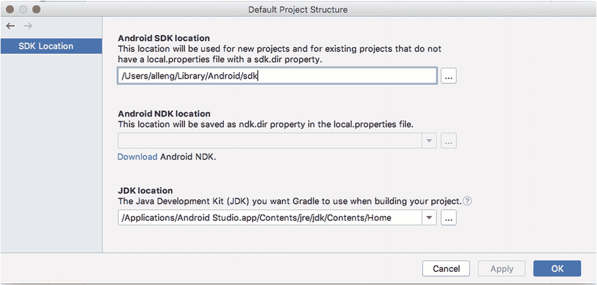

# 第二部分 掌握 Android 开发技能

## 7. 介绍用于 Android 开发的 Java

在本章中，我们将探讨如何入门使用 Java 进行 Android 应用开发，并特别关注如何在不被 Java 庞大的体系吓倒或挫败的情况下，攻克这门宏大的语言。已经熟悉 Java 开发的读者可以略读大部分内容，但我会建议所有读者重点关注一些关于 Android 特性的关键点。

将 Java 学习到专家级别是一项巨大的工程。即使只是学到“快乐的初学者”水平，也远远不止本书这一章，甚至一整本书的篇幅。关于 Java 及其众多方面的书籍确实有“数千本”之多。与其提供一个不完整且最终用途不大的介绍，我们将聚焦于三个关键的预备要点，引导你借助本书之外的资源和工具踏上学习 Java 的征途。

首先，我们将从软件角度审视 Java，包括 Java 开发工具包 (`JDK`) 和 Java 运行时环境 (`JRE`)，以及 Android 使用和采用 Java 虚拟机环境 (`JVM`) 的特殊性——包括其让软件“一次编写，到处运行”的承诺，以及 Java 各版本的漫长历史。

其次，我们将深入一个基础的纯 Java 应用程序，你可以在任何安装了 Java 的机器上运行它。我们将从一两个基础部分入手，作为你扩展理解 Java 及其如何（以及如何不）转化为 Android 应用程序的起点。

最后，我们将涵盖你应逐步学习的 Java 关键领域或主题，并附上一些最佳免费和商业资源的链接，以助你在本章结束后继续学习。

### Android 的其他开发语言选择

Java 在 Android 起步时是（共同的）首选开发语言，与 Android 有着悠久的历史。但它并非开发应用程序唯一受支持的语言。除了 Java 之外，Android 从早期就通过“原生开发工具包”（`NDK`）支持使用 C++ 进行“原生”形式的开发。2016 年，谷歌大胆地将 Kotlin 添加到受支持的语言阵容中，并于去年决定将 Kotlin 作为新的首选语言。就应用使用率而言，Java 仍然是 Android 开发中的主导语言，占比接近 90%。但许多新应用混合使用 Kotlin 和 Java，或只选择 Kotlin。您可以从 Apress 出版的 *Learn Kotlin for Android Development* （Späth 著，ISBN 9781484244661）中了解更多关于 Kotlin 用于 Android 开发的知识。


## Java，无处不在

这个引人注目的标题有两层含义——`Java` 被设计为一种“一次编写，随处运行”的语言。尽管面临诸多质疑、阻力，甚至法律障碍，它在很大程度上仍成功实现了这一目标。同时，`Java` 的“无处不在”还体现在：它既是编程语言的名称，也常作为实现“随处运行”承诺的软件的简称。Java 虚拟机（即 `JVM`），以及为在计算机上部署而打包的方式，也常被简称为 `Java`。似乎这还不够令人困惑，一旦你深入接触 `Java`，你还会发现自己和其他从业者也将提供核心功能的核心库称为 `Java`。

命名上的复杂性是你作为 `Java` 开发者需要适应的一个问题，但 `Java` 在真正实现“随处运行”能力方面，也经历了一段曲折的历史。`JVM` 配合 `Java` 发行版使用，这些发行版要么是被称为 Java 运行时环境（`JRE`）的运行时，要么是被称为 Java 开发工具包（`JDK`）的完整开发者工具。其版本管理方式一直是软件领域最复杂的故事之一，以至于经常能发现系统试图同时支持五个主版本——`Java 6`、`Java 8`、`Java 9`、`Java 11`，以及最新发布的某个 `Java` 版本。

多亏了谷歌的行动，你得以避免部分版本管理的烦恼。`Android Studio` 在其 `2.3` 版本中大胆地将 `JDK` 隐式捆绑，并为你全面管理它，因此你永远无需再自行配置。然而，在 Android 之外测试代码，以及学习非 Android 应用中的 `Java` 知识，有时仍会很有用。在本章后面，如果你还不熟悉这种方法，我们将演示如何操作，并将其作为跳板的一部分，帮助你学习 `Java` 这门语言——如果你是绝对的初学者。

### Java 安全

不讨论安全，这个话题就不完整。无论是作为独立安装还是 `Android Studio` 的一部分，`Java` 及其运行时和 `JVM` 在安全问题上都有着漫长而令人担忧的历史。我不会深入探讨过去二十年间已被发现并修复的成千上万个漏洞、缺陷和攻击手段，但我要说的是：请始终更新你的 `Java` 安装，包括始终让 `Android Studio` 保持最新。切记！

要了解更多曾影响 Android 的历史 `Java` 漏洞，请随意访问 [`www.beginningandroid.org`](http://www.beginningandroid.org) 进一步阅读。

### Android 的 Java 时间扭曲

在首次发布时，谷歌选择了当时主流的 `Java` 版本作为 Android 的基础，即 `Java` 版本 `6`（当时称为 `Java 1.6`）。随着未来 Android 版本的发布，`Java` 版本的更新相对缓慢，而保持 Android 与 `Java 6` 的兼容性有显著好处。随着时间的推移，发布模式发生了变化，尤其是 `Java`，在 `Java 7` 和 `Java 8` 的缓慢发布之后，速度加快了。在撰写本书时，我们已到了 `Java 15`，但出于各种技术和非技术原因，Android 对 `Java` 的兼容性“卡”在了 `Java 7` 和对 `Java 8` 的部分支持上。如果你是为了编写 Android 应用而学习 `Java`，请牢记这一点！

在开发 Android 应用时，`Java 9` 及更高版本的概念和功能根本无法使用。这意味着诸如 `Java 9` 引入的模块、`Java 10` 引入的数据类共享，或 `Java 12` 中 `switch` 语句增强的安全性和实用性等功能，你都无法使用。在实践中，这并不构成巨大障碍，但如果你熟悉现代 `Java` 并习惯了其最新功能，可能需要一段时间来适应。

### 使用 JDK 安装学习 Java

得益于 `Android Studio` 将 `JDK` 捆绑在其安装中，除了出色的 `Android Studio IDE` 体验外，你还拥有一个现成的“纯 Java”环境可供使用。要单独使用 `JDK`，你可以查找 `Android Studio` 放置 `JDK` 的磁盘目录。你可以直接在 `Android Studio` 中，打开任意项目，选择 `File` ➤ `Other Settings` ➤ `Default Project Structure` 菜单来找到它。你将看到一个如图 7-1 所示的对话框，其中显示了 `JDK` 的位置。



图 7-1

`Android Studio` 显示 `JDK` 的位置

总结一下，对于 `Android Studio` 支持的各操作系统：

*   在 macOS/OSX 上：`JDK` 位于 `/Applications/Android Studio.app/Contents/jre/jdk/Contents/Home`。
*   在 Linux 上：`JDK` 的位置可能因你指示 `Android Studio` 安装程序放置 IDE 的位置而异，但它位于该位置下的 `./android-studio/jre` 文件夹中。
*   在 Windows 上：`JDK` 的位置可能因你指示 `Android Studio` 安装程序放置 IDE 的位置而异，但默认位于 `C:\Android\Android Studio\jre\bin`。

对于本章中纯（非 Android）`Java` 的示例，你可以使用命令提示符或 shell，通过 `cd` 命令导航到该目录。你也可以测试该目录是否已包含在计算机的 `PATH` 环境变量中——这意味着无论你在哪个目录下工作，操作系统都知道去哪里找到 `JDK` 的关键工具。例如，在 macOS 和 Linux 上，`which javac` 命令会返回 `javac` 二进制文件（即 Java 编译器）第一个安装位置的路径（如果在 `PATH` 指定的目录中找到）。例如，在我的 `MacBook Air` 上，我看到以下内容：

```
$ which javac
/usr/bin/javac
```

还有比这更简单的吗？嗯，你可能还记得，在之前关于 Java 无处不在的标题中，提到在同一个机器上安装多个 `Java` 版本是很常见的，这些版本可能是提供 `Java` 开发工具的全功能 `JDK`，也可能只是提供运行时 `JVM` 和一些支持工具的 `JRE`，但不包括编译器这样的开发工具。

如果你想绝对确定自己使用的是 `Android Studio` 捆绑的编译器（`javac` 二进制文件）和 `JVM`（`java` 二进制文件），则在调用这些程序时请使用它们的完整路径。例如，为了确保我在以下示例中使用的是来自 `Android Studio` 的 `javac`，我会这样调用：

```
"/Applications/Android Studio.app/Contents/jre/jdk/Contents/Home/bin/javac" somejavafile.java
```

有很多方法可以查问你默认使用的是哪个安装版本的 `Java`，并且出于各种原因（甚至在 `Android Studio` 内部）在不同版本之间切换。然而，这超出了本书的范围。对于初学者，我建议不要随意修改 `Android Studio` 在这方面的设置。


### 代码中的第一个 Java 概念

学习编程语言的传统是从编写“Hello World”应用开始。我们将跳过这一步，直接进入一个稍微进阶的示例，向你展示 Java 代码运行的最基础内容。清单 7-1 展示了我们的非 Android Java 应用程序示例 `FirstJavaDemo` 的代码，你可以在 `Ch07/FirstJavaDemo.zip` 中找到它。

```
import java.io.*;
import java.util.*;
public class FirstJavaDemo {
public static void main(String[] args) {
Console console = System.console();
if (console == null) {
System.out.println("Console not found");
System.out.println("Please re-run from a command line, shell, or console window");
System.exit(0);
}
System.out.print("Tell me something about yourself: ");
String something = console.readLine();
System.out.println("Interesting!  You said: " + something);
}
}
清单 7-1
来自 FirstJavaDemo.java 文件的源代码
```

在接下来的几节中，我们将逐步讲解这段代码中各个部分的作用。从更宏观的角度来看，让我们通览整个结构，并用通俗易懂的英语解释程序运作的流程。这将使你能够将面向外行的解释与 Java 特有的方面进行对照参考。

第一行是 `import` 语句，指示我们的程序使用 Java 的库系统（其中打包了其他 Java 功能供你使用，无需从头开始自行构建所有内容）。其语法看起来有点奇怪，但其核心是我们指示 Java 引入 `java.io` 库和 `java.util` 库的所有特性。这些库处理诸如文件和控制台输入输出等事务，以及你经常想要或需要的其他通用功能。

接下来是一个 `class` 声明。类是面向对象（OO）设计范式的应用开发中的核心概念，我们将在本章后面更详细地讨论它。重要的是，这是一个由我（或你）选择的类定义。我选择了名称 `FirstJavaDemo`。Java 关键字 `"public"` 意味着，如果需要，其他 Java 程序可以尝试导入我的类并重用。

类的主体和其他逻辑子块都包裹在你看到的花括号 `{` 和 `}` 符号中。这些花括号是重要的标点符号（用编程和编译器的术语来说，就是标记），必须用于对嵌套的逻辑集（无论是类、类的方法，还是诸如循环和条件测试等内部逻辑块）进行分组。

接下来，是强制性的 `main()` 方法，我们将其定义为返回类型 `void`，这本质上意味着程序退出时不从变量或其他方法调用中返回任何数据，并且它接受一个名为 `args` 的 `String` 数组作为（可选）参数。实际上，这种方法是许多编程语言中的长期风格，即可以在程序首次运行时向其传递参数（或实参），供开发者出于任何目的使用，例如在程序中开启或关闭选项，或者用关键的启动数据初始化程序。

然后，我们基于 `System.console()` 方法提供的 `Console` 对象，定义并创建了一个名为 `console`（小写）的对象。`System.console()` 方法本身是我们能够使用的一个工具，这得益于我们导入了 `java.util` 库。该方法隐藏了 `FirstJavaDemo` 程序和 JVM（Java 虚拟机）之间的大量操作系统交互，以便将你的程序连接到控制台——通常是一个 shell 或命令提示符窗口，或者类似 Android Studio IDE 中控制台窗口这样更复杂程序中的一部分。

### 核心概念：数据类型与变量

这个 `Console` 对象以及名为 "console" 的工作副本或容器的示例，引入几乎所有编程语言（包括 Java）的两个基本方面。这些概念是变量和数据类型。

变量可以被视为一个容器或占位符，用于存放某个尚未明确的值——就像高中数学或代数那样。在 Java 中，变量首先被定义，目的是标识其将包含的信息种类，即所谓的数据类型。

Java 中的数据类型是对变量或其他情况下所用信息或数据种类的一种规范。数据类型有两种形式：第一种是非常简单的数据类型，称为原始类型，它们以几种形式表示简单的整数或浮点数——`int`、`short`、`long`、`float` 和 `double`，以及表示简单字符文本的 `char` 和表示 `true` 或 `false` 值的 `boolean`。

第二种数据类型是更复杂的对象，比如我们 `Console` 示例中的情况。你可以将这种更复杂的数据类型视为多个原始数据类型和可用于处理该数据的预定义逻辑的复合集合。这就是 Java 和其他面向对象编程语言中类的本质。

有时创建控制台会因奇怪的原因失败——权限问题就是一个例子。我们使用 Java 的 If-Then 逻辑引入一个逻辑测试，用 `==` 符号表示，以判断我们的 `console` 是否存在或未定义——在 Java 术语中为 `null`。如果 `console` 未定义，我们使用由于导入了 `java.io` 库而可以访问的 `System.out.println()` 方法，并输出一些有用的、对人类阅读者有意义的字面字符串文本。然后我们使用 `System.exit()` 方法在此时退出程序。

### 核心概念：Java 中的分支与循环结构 – If、While、For

清单 7-1 中的代码展示了 Java 中主要的逻辑控制结构之一——`If` 语句。还有其他几种这样的结构，允许你基于测试某个值来决定执行合适的分支逻辑，或者基于测试某个值并持续到条件改变来重复执行操作。除了 `If` 语句，Java 还提供了 `For` 循环、`While` 循环和 `Do While` 循环。这些后续的每个结构都有许多细微差别，我们将在本书后面探讨，但你可以在 [`http://en.wikibooks.org/wiki/Java_Programming/`](http://en.wikibooks.org/wiki/Java_Programming/) 了解更多相关信息。

在创建 `console` 对象一切顺利这种更可靠和常见的情况下，我们接着使用 `System.print()` 方法在控制台打印一个问题的文本，并使用 `System.readln()` 方法接收你键入的回应，并将其存储在我们定义的一个名为 `something` 的 `String` 变量中，作为存放你输入文本的位置。最后，我们再次使用 `System.println()` 方法，结合由 `+` 运算符提供的 `String` 拼接功能来回应你。

这段简短的描述应该能帮助你理解 `FirstJavaDemo` 应用的作用，但除了非常初步的层面外，它并不能让你深入理解 Java 的语法、结构或规则。我们稍后将进一步加深你的理解。现在，让我们练习编译和运行这个程序。

要编译程序，请打开一个 shell 或命令提示符，如果需要的话，根据你的操作系统所述切换到 JDK 目录。记下你将 `Ch07/FirstJavaDemo.zip` 中的 `FirstJavaDemo.java` 文件放在了磁盘的哪个位置。然后调用 `javac` 二进制程序，并传递 `FirstJavaDemo.java` 的完整路径和文件名，例如在 macOS 或 Linux 上如下所示：

```
$ javac /FirstJavaDemo.java
```

稍等片刻后，你应该会看到命令或 shell 提示符重新回到你的控制之下。那么发生了什么？`javac` 工具已经处理了源代码，并生成了 JVM 现在可以理解和运行的中间版本代码。在你的目录中，你应该会看到一个名为 `FirstJavaDemo.class` 的新文件，这就是 `javac` 命令的输出结果。


要运行你的代码，请使用 `java` 命令（小写），并将 `FirstJavaDemo.class` 文件的完整路径传递给它，但要从文件名中省略文件扩展名（即 `.class` 部分），例如：

```
$ java /FirstJavaDemo
```

在回答完屏幕上出现的提示问题后，输出内容将如下所示：

```
$ java FirstJavaDemo
Tell me something about yourself: I program in Java
Interesting!  You said you: I program in Java
```

你做到了！通过使用 Java 特有的工具和一些新学的代码，你创建了一个纯 Java 应用程序。继续阅读以了解更多关于 Java 语言的知识，以及如何深入理解 `FirstDemoJava` 应用程序中的每一个词、每一行代码和每一个奇怪的标点符号。

### Android 开发的关键 Java 构建模块

本书剩余部分的所有示例都将依赖于一定程度的 Java 知识。在本章的剩余部分，我们将为你提供一个涵盖基础知识的主题总览列表，你至少需要掌握这些内容才能跟上进度，但更重要的是，这也会为你提供一个起点，让你能够从网上、书店、学校和学院等海量的免费和商业资源中进一步学习和自我提升。我们还将直接链接到其中一些资源，以确保你的 Java 学习之旅不会中断——我鼓励你在阅读本章时点击这些链接，因为深入探索 Java 主题永远不会嫌早！

为了最高效地学习用于 Android 开发的 Java，以下主题至关重要：

通用软件开发知识：

1.  代码的结构与布局
2.  面向对象的设计与编程，包括类与对象
3.  类方法与数据成员

Java 特有的编码知识：

1.  接口与实现
2.  线程与并发
3.  垃圾回收
4.  异常处理
5.  文件处理
6.  泛型
7.  集合

显然，这并不是 Java 的全部内容，但它足以构成一个子集，为你立即开始 Android 开发提供构建模块！

#### 代码结构

回顾 `FirstJavaDemo` 的源代码，你可以了解到 Java 代码在最简单情况下的结构。Java 可以被看作是一个不断叠加的“洋葱层”，从最基本的构造层层叠加，直至最深远、最复杂的构造。从最简单到最复杂，我们有：

*   **标记**：Java 的最小构建模块，一个标记代表事物的名称，例如我们创建的或者系统提供的对象实例（如 `FirstJavaDemo` 代码中的 `String` 对象）、Java 语言的关键字（如 `return`）、运算符、标点符号（如括号）等等。

*   **表达式**：一个或多个标记与运算符（如 `+`）或方法调用组合在一起，构成一段逻辑。在 `FirstJavaDemo` 示例中，我们在 `"Interesting! You said: " + something` 中看到了一个表达式，这是一个使用 `+` 运算符连接两个字符串的表达式。

*   **语句**：由标记和表达式构建的完整逻辑单元，以分号结束。它通常等同于一行代码，但实际上可以跨越多行。

*   **方法**：一组逻辑上相关的语句，构成一个完整的逻辑单元，并可以通过方法名进行调用。在 `FirstJavaDemo` 代码中，我们为类的 `main` 方法创建了逻辑，同时也引用了其他类的方法，例如用于在控制台读取文本输入的 `readLine()` 方法和用于向控制台输出结果的 `println()` 方法。

*   **类**：表示一个概念化对象及其所有方法和数据成员，这些成员用于表示该对象并允许对其进行操作并利用其能力。类的概念与面向对象设计的概念紧密相关，我们稍后将提到这一点。

*   **包**：虽然在我们的示例中没有展示，但包是一组类的集合，通常用于将支持特定相关逻辑组（例如文件处理或图形渲染）的类捆绑在一起。

Java 代码还有许多其他结构方面，但掌握上述内容将使你能够基于对基础知识的理解，解读并利用更特殊的构造。

#### Android 与 Main

这可不是一个十字路口，但它确实可以像那样理解。在 `FirstJavaDemo` 示例中，你会看到我们定义了一个名为 `main` 的方法。Java 的设计规定，Java 程序的少数强制性要求之一就是存在一个名为 `main` 的方法，并且它将是 JVM 在运行程序时调用的第一个方法。可以将其视为 Java 中一个写着“从这里开始”的巨型标志。

但是看看我们在前面章节中编写的 Android 示例，比如 `MyFirstApp` 应用程序。`MainActivity.java` 文件中缺少 `main` 方法。这是怎么回事？别担心。你的应用程序确实有一个 `main` 方法，但它隐藏在 Android Studio 提供的辅助框架中。Android 并没有让你去处理 `main` 方法以及所有为用户提供运行应用程序体验的流程或事件处理工作，而是提供了一个活动生命周期，其中包含一些定义好的节点，你作为开发者可以专注于这些节点，处理你的活动被创建、使用、暂停和销毁的时刻。这个活动生命周期将在第 11 章中深入介绍。

如果你查看已经编写的 Android Java 代码，包括 `MyFirstApp` 应用程序，你可以在实践中看到 Java 语言层次结构的许多方面——在你没有意识到的情况下，你已经在你最初的应用程序中运用了这些概念。

#### 理解面向对象设计、类和对象

Java 编程语言从设计之初就旨在拥抱并表达面向对象设计（有时简称为“OO”）的概念。其核心是，面向对象设计使用对象（或实体）（例如“人”或“动物”）来表达你在应用程序中创建的几乎所有的概念模型，然后利用一些强大的设计理念来塑造对象的定义、操作、扩展和改进方式。这是一个庞大的主题，但你可以从一些优秀的在线资料开始，这些资料会随着时间推移帮助你理解关键的 OO 概念，包括封装、继承、多态等。

#### 使用类方法和数据成员

采用面向对象方法进行编码的一个固有概念是，关于对象和对象实例的数据属于这些实体本身，而要操作和查询这些数据，应该使用生成这些对象的类所设计提供（并规定）的技术。简而言之，这意味着使用该类定义并向开发者提供的方法（或函数）。

对于刚接触面向对象开发的你来说，这并不像最初看起来那样具有约束性。它体现了面向对象的原则之一：封装。处理一个对象所需的一切都与其类整洁地打包在一起（封装起来）。这种方法有无数好处，你可以在许多面向对象设计的文献中（例如 Apress 出版社的 *Interactive Object-Oriented Programming in Java*，Sarcar 著，ISBN 9781484254035）以及无数的网页中广泛阅读到。请记住，当编写自己的类时，你可以自由地决定提供哪些类方法。


##### 培养 Java 特定编码知识

正如我之前所说，学习整个 Java 是一项艰巨的任务。为 Android 学习 Java 虽然不那么令人望而生畏，但仍需掌握大量 Java 相关知识。为了让你入门，以下列出需要开始掌握的关键领域，并附上一些最佳免费在线资源链接。虽然我会引用免费在线资源《Java 编程维基教科书》，但许多其他在线资料也同样优质。你还可以从 Android 专属 Java 书籍中获益良多，例如 Apress 出版社的 *《学习 Java 进行 Android 开发》*（Späth 和 Friesen 著，ISBN 9781484259429）。

##### 接口与实现

理解 Java 对象如何构建和扩展其他对象，并通过具体的实现机制提供一个派生版本应遵循的模板。参见 [`http://en.wikibooks.org/wiki/Java_Programming/Interfaces`](http://en.wikibooks.org/wiki/Java_Programming/Interfaces)。

##### 线程与并发

尤其是在多核 CPU 时代，并发和线程提供了同时执行多个工作流的方法，但需要小心谨慎。参见 [`http://en.wikibooks.org/wiki/Java_Programming/Threads_and_Runnables`](http://en.wikibooks.org/wiki/Java_Programming/Threads_and_Runnables)。

##### 垃圾回收

Java 是最早采用精细管理内存等资源方法的语言之一，旨在将开发者从追踪和手动释放资源分配（至少可以说是一项容易出错的任务！）中解放出来。请参阅 [`https://en.wikibooks.org/wiki/Java_Programming/Java_Overview`](https://en.wikibooks.org/wiki/Java_Programming/Java_Overview) 中关于自动内存垃圾回收的部分。

##### 异常处理

当问题发生时，目标是提供安全、结构化且信息丰富的方式来得体地处理问题。参见 [`http://en.wikibooks.org/wiki/Java_Programming/Exceptions`](http://en.wikibooks.org/wiki/Java_Programming/Exceptions)。

##### 文件处理

虽然我们的 `FirstJavaDemo` 应用让用户直接在控制台通过打字输入数据，但更常见的方式是使用文件及其管理规则来消费和创建数据。参见 [`http://en.wikibooks.org/wiki/Java_Programming/BasicIO`](http://en.wikibooks.org/wiki/Java_Programming/BasicIO)。

##### 泛型

Java 理论上是一种“强类型”语言，这意味着它提供了护栏和保护，确保 `String`、`integer` 和其他类型永远不会以不兼容的数据负载形式存在，并且一种类型的数据不会意外地被放入另一种类型的变量中。这是一个关键的保护机制，但在某些情况下会造成不灵活性。泛型提供了一种方式来保持强类型特性，同时避免在支持不同类型数据的相同通用逻辑时出现不必要的重复和过度复制。参见 [`http://en.wikibooks.org/wiki/Java_Programming/Generics`](http://en.wikibooks.org/wiki/Java_Programming/Generics)。

##### 集合

就像整数等原始数据类型可以分组为数组一样，对象也可以分组为便捷的集合。集合是 Java 支持将对象组作为集合进行操作的一种方式（但不是唯一方式）。参见 [`http://en.wikibooks.org/wiki/Java_Programming/Collections`](http://en.wikibooks.org/wiki/Java_Programming/Collections)。

## 总结

没有任何一个单独的章节——或一整本书——能成为你完整的 Java 入门指南，但在本章中，我们已尽了最大努力。现在，你已经掌握了关于 Java 语言、Java 软件产品、Java 对 Android 的意义，以及学习路线图和帮助你精进 Java 技能的资源。我强烈建议 Java 新手在继续阅读本书其余部分之前，先探索本章提到的其他资源，甚至更多可在商业和网络上免费获取的海量资源。即使只是少量的附带阅读和实践，也将对你理解 Android 带来巨大回报。

