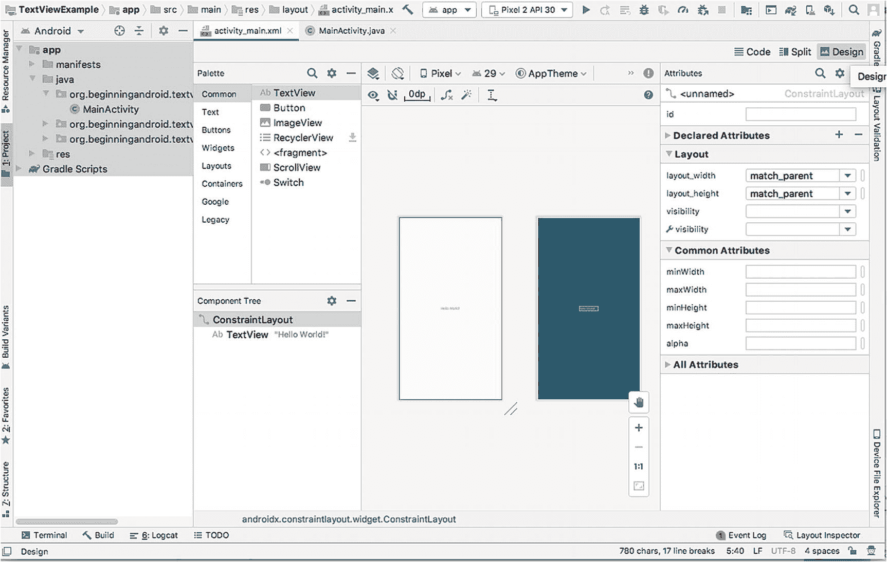

# 在本书的第 1 部分中，您快速浏览了为 Android 应用创建新 Android Studio 项目所需的步骤，并探索了默认 Android 项目各组成部分的结构、文件及其用途。您深入了解了通过 XML 配置为应用配色方案创建自定义行为的初步步骤，并利用文本资源工具在应用的主活动中个性化欢迎信息。

在本章中，我们将超越前几章的表层修改，深入探讨所有 Android 应用中都可用且将成为您未来所有 Android 工作所开发和部署的众多活动核心支柱的主要用户界面元素。您将学习如何部署、适配和控制作为 Android 开发者可用的众多用户界面控件，并开启构建更复杂的 Android 用户体验之旅。

## 一切始于 `View`

在 Android 世界中，您可以在用户界面（即活动）上显示的每个主要元素都继承自一个名为 `View` 的基类。任何派生自 `View` 的控件（无论是文本框、按钮、选择列表还是其他控件），都为您提供了一系列源自此 `View` 血统的通用行为和优势。这些通用行为和属性包括一致地设置和控制字体、颜色及其他样式特征的方法。

除了这些通用特性之外，得益于所有控件共有的 `View` 继承关系，还可使用一系列方法和属性。接下来我们将介绍这些继承的特性。

## 源自 `View` 的关键方法

任何派生自 `View` 基类的控件都会继承一系列方法和属性，这些方法和属性有助于管理基本状态管理、与其他控件分组、布局中的父对象和子对象等。您将看到的属性包括：

1.  `findViewById()`: 通过给定 ID 查找控件，广泛用于将 XML 中定义的控件链接到 Java（以及 Kotlin）中的控制逻辑。
2.  `getParent()`: 查找父对象，无论是控件还是容器。
3.  `getRootView()`: 获取活动最初调用 `setContentView()` 所提供的视图树的根节点。
4.  `setEnabled()`、`isEnabled()`: 设置和检查任何控件的启用状态，例如用于复选框、单选按钮等。
5.  `isClickable()`: 报告此视图（例如按钮）是否响应点击或按下事件。
6.  `onClickListener()`: 对于可点击的视图（如按钮），定义一个回调函数，当关联视图被点击时触发。回调函数实现中包含您认为需要的任何逻辑。

## 源自 `View` 的关键属性和特性

除了 `View` 基类的核心方法外，所有控件还继承了一些关键属性。这些属性包括：

1.  `android:contentDescription`：这是与任何控件关联的文本值，可供无障碍工具使用，当控件的视觉效果对用户帮助甚微或毫无帮助时，此属性尤为重要。
2.  `android:visibility`：决定控件在首次实例化时是可见还是不可见。
3.  `android:padding`、`android:paddingLeft`、`android:paddingRight`、`android:paddingTop`、`android:paddingBottom`：在控件各边设置内边距的不同方法。

**注意** 控件的内边距也可以在运行时使用 `setPadding()` 方法进行设置。

## Android 核心 UI 控件简介

在构建 Android 应用时，您会反复使用一组核心 UI 控件，因为它们提供了计算机、智能手机等用户在过去几十年中已经习以为常的常见用户界面体验。让我们逐一了解这些核心控件的示例。

### 用 `TextView` 标记内容

提供可读的文本标签可能是所有 UI 控件中最基础的，您几乎会在所有已发明的设计工具包中找到标签或静态文本的等价物。Android 提供了 `TextView` 控件来实现此功能，让您可以在活动 UI 的任何位置放置静态字符串（或至少最初是静态的，因为 `TextView` 的值可以通过编程方式更改）。此字符串的文本完全由您决定，无论是提供相邻控件的描述、标题、评论还是注释——都取决于您。

Android 提供了两种主要方式来定义 `TextView` 以及所有 UI 控件。第一种方法是通过 Java 代码完全定义 `TextView`，设置诸如屏幕位置、大小、文本内容等属性。任何有开发复杂用户界面经验的人都会告诉您，这是一种费力的工作，容易出错，并且您很快就会看到代码增长到难以管理的地步。但还有更好的方法，而您已经用过它了！

使用 Android 的另一种 UI 设计方法（通过声明式 XML）要快得多，也容易得多。在第 3 章中，您创建了 `MyFirstApp` 应用，并控制了 `TextView` 控件中的文本。在第 7 章中，您进一步尝试了控制 `TextView` 字符串的源以及其他一些装饰属性。您可以根据需要随时添加任意数量的 `TextView` 控件，既可以直接在活动的 XML 定义文件中定义更多的 `<TextView>` 元素，也可以使用图形布局编辑器。

图形布局编辑器让您可以专注于视觉样式，并在后台自动生成必要的匹配 XML 来描述您的 `TextView` 控件。

现在让我们来实际操作一下。尽管您的 `MyFirstApp` 应用运行良好，但我们先把它放在一边。在 Android Studio 中，通过 `文件` ➤ `新建...` ➤ `新建项目` 菜单选项创建一个新项目。就像我们在第 3 章中所做的那样，为您的项目起一个有意义的名称，例如 `TextViewExample`，并选择“空活动”模板。这将创建您的新项目，并默认在 `activity_main.xml` 文件中放置一个 `TextView` 控件（就像您创建 `MyFirstApp` 应用时一样）。您的 `activity_main.xml` 内容应如清单 9-1 所示。

```
清单 9-1
一个使用“空活动”模板的全新 Android Studio 应用
```

这里我们不编辑 XML，而是通过点击 Android Studio 视图最右侧的 **设计** 按钮来调用图形布局设计器。这将隐藏 XML 内容，并为您呈现如图 9-1 所示的等效图形布局。



图 9-1 调用图形布局设计器


