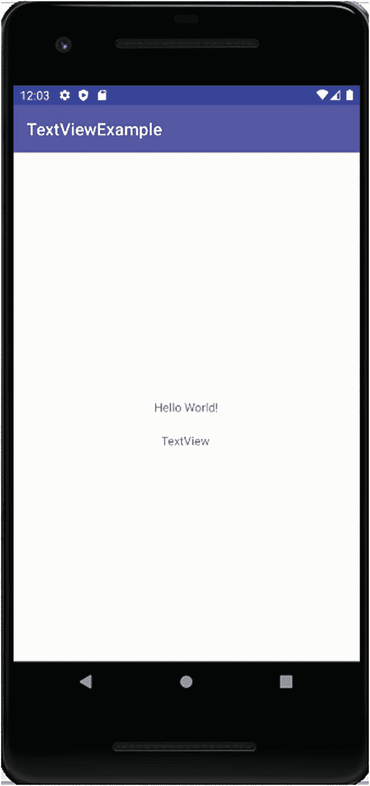
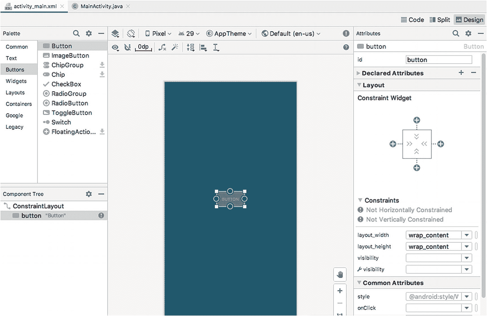
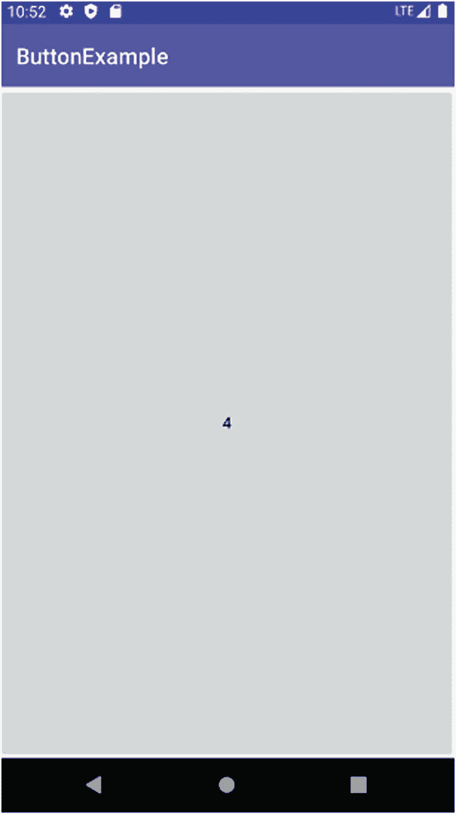
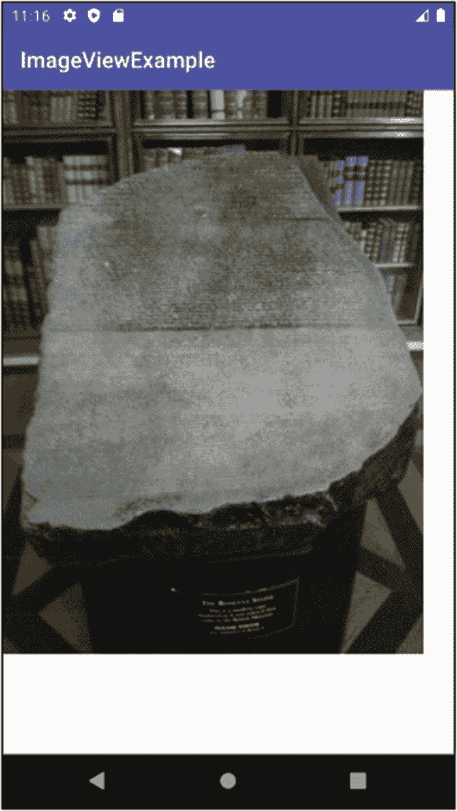

# 视图中的大量内容

这个视图中包含很多内容，但最佳的学习方式是逐一尝试每个区域。从 **Palette**（面板）部分开始，你会看到一系列小部件类型——Common（通用）、Text（文本）、Buttons（按钮）等——旁边是对应的实际小部件列表。在此列表顶部，你会看到`TextView`，如图 9-1 所示。将其拖放到屏幕中央的微型屏幕示意图上，你会看到一个微小的浮动标签在移动，直到你松开鼠标按钮。请在你认为“合适”的位置进行操作。

第二个`TextView`现在会显示在相应位置，但你会看到一个红色错误标志——点击它会提示你尚未在新`TextView`上设置“约束”（constraints），因此如果你实际构建并运行此应用程序，你放置的位置将不会被保留。别担心！我们马上就会修复这个问题，但需要在你的 XML 定义中处理，并在此过程中了解更多关于`TextView`小部件的知识。点击最右侧的 **Code** 按钮，切换回布局的代码视图。

你的`activity_main.xml`文件现在应与清单 9-2 相似，其中包含一个新的`<TextView>`元素及其关联属性。

```
Listing 9-2
你的修订版 activity_main.xml 文件
```

我们已经在之前的章节中修改过`<TextView>`的属性，现在我们要更进一步！让我们介绍一些有助于控制`TextView`和其他小部件的新属性：

1.  `android:layout_marginStart`
2.  `android:layout_marginEnd`
3.  `android:layout_marginLeft`
4.  `android:layout_marginRight`
5.  `android:layout_marginBottom`

正如其名称所示，每个属性都用于设置小部件各边缘的边距。

我们还受益于应用程序使用的默认布局方法，称为`ConstraintLayout`。我们将在后续章节中更详细地讨论布局，但目前你可以将其理解为帮助你放置小部件到活动（activity）中的各种方法。某些布局为你处理了大量设置，但代价是稍微减少了艺术自由度；而其他布局则给予你完全的自由，但需要你完成更多工作。`ConstraintLayout`属于前者，旨在尽可能帮助你获得美观的布局。它为所有小部件的布局带来了几个关键属性，包括：

1.  `app:layout_constraintTop_toTopOf`
2.  `app:layout_constraintBottom_toBottomOf`
3.  `app:layout_constraintLeft_toLeftmOf`
4.  `app:layout_constraintRight_toRightOf`

还有更多`layout_constraint*`风格的属性组合，它们都服务于一个目的：根据与另一个小部件的顶部、底部、左侧或右侧边缘（以及其中心、相关小部件中任何文本的定位等）的接近度和关系，来指定如何对齐和调整小部件的大小。

我们需要这些布局边距属性和约束属性，以便为新的`TextView`提供可预测的行为，如下所示：

```
实际值相当容易理解。三个不同的边距属性分别设置 TextView 周围像素单位的边距大小。布局约束属性将垂直和水平约束的默认值绑定到所谓的“父布局”（parent）。在本例中，这意味着父活动本身。你也可以引用另一个小部件的 `android:id`，使其成为约束该小部件的引导因素。
```

完成这些更改后，你应该保存`activity_main.xml`文件，然后运行你的`TextViewExample`应用程序，查看新的标签是否已就位，并按照你的指令定位，如图 9-2 所示。



*图 9-2 为你的应用程序添加更多 TextView 标签*

要完整了解`TextView`小部件，你应该知道有近 100 种不同的属性可以控制`TextView`标签的行为、样式、大小、颜色等。更多示例如下：

1.  `android:hint`：要显示的提示。
2.  `android:typeface`：设置标签使用的字体（例如，等宽字体 monospace）。
3.  `android:textStyle`：指示应用于文本的样式组合：粗体（bold）、斜体（italic）或两者结合（bold_italic）。
4.  `android.textAppearance`：一个综合属性，允许你一次性组合文本颜色、字体、大小和样式！
5.  `android:textColor`：使用通用的十六进制 RGB 表示法来选择标签的文本颜色。例如，`#0000FF` 表示蓝色。

你可以在`Ch09/TextViewExample`项目文件夹中找到此示例的代码。

到目前为止，通过仅使用 Android 的 XML 就能完成如此多的工作，这既具启发性，也希望能让你学到东西。但开发应用程序真正的强大功能和灵活性来自于你选择的编程语言与 Android XML 功能的结合。一旦我们转向更复杂的 UI 小部件，部署你的 Java（或 Kotlin）能力就变得既必要又理想，正如你将在后续关于其他 UI 小部件的章节中看到的那样。

## 打造完美 UI 的按钮

按钮是任何 UI 开发的基础组件，其历史可以追溯到模拟电视机、收音机（还记得吗？）和汽车仪表盘等电子设备上的真实物理按钮。Android 提供了几种类型的按钮，其中最直接的是来自`android.widget`包的`Button`小部件，它在按钮“表面”显示简单的文本。让我们开始创建一个使用按钮和 Java 逻辑来跟踪和控制按钮上显示文本的新应用程序。你可以在`Ch09/ButtonExample`项目文件夹中查看此示例。

首先，使用 Android Studio 的新项目向导创建一个新项目，并选择 **Empty Activity** 模板作为起点。将项目命名为`ButtonExample`（或你认为同样具有描述性的名称）。项目创建完成后，打开`activity_main.xml`文件，删除默认的`TextView`元素。切换到布局编辑器的 **Design**（设计）视图，从 **Palette**（面板）中选择`Button`小部件并将其放置在屏幕上。按钮的精确位置无关紧要，因为我们稍后会让它自动扩展以填满整个应用程序活动。你应该会看到类似于图 9-3 所示的布局。



*图 9-3 在 ButtonExample 的设计蓝图中添加一个按钮*

请注意，有两个错误提示表明按钮未被约束。这是因为当你选择使用`ConstraintLayout`布局来容纳其他子 UI 小部件时，每个小部件都需要至少一个水平和垂直的“约束”，或者说是关于它们应该如何相对于父布局或其他小部件的顶部、底部、起始端和结束端进行定位的指令。要解决此问题，请使用每边中点处的两个圆圈之一，单击并拖动连接线到设计蓝图的侧边。这将为按钮设置水平约束，使其紧贴活动的侧边（减去任何边距）。然后选择按钮顶部或底部边缘中心的圆圈，单击并拖动连接线到活动的顶部或底部边缘，以设置垂直约束。切换到`activity_main.xml`文件的代码视图，它应该类似于清单 9-3 所示。

```
Listing 9-3
ButtonExample activity_main.xml 文件，显示 Button 定义
```


接下来，我们需要为按钮增加一些“活力”，让它能够真正执行操作。为此，请打开 `ButtonExample` 项目的 `MainActivity.java` 源文件，并将其内容替换为清单 9-4 中的 Java 代码。

```
package org.beginningandroid.buttonexample;
import androidx.appcompat.app.AppCompatActivity;
import android.os.Bundle;
import android.view.View;
import android.widget.Button;
public class MainActivity extends AppCompatActivity implements View.OnClickListener{
Button myButton;
Integer myInt;
@Override
protected void onCreate(Bundle savedInstanceState) {
super.onCreate(savedInstanceState);
myButton = new Button(this);
myButton.setOnClickListener(this);
myInt = 0;
updateClickCounter();
setContentView(myButton);
}
@Override
public void onClick(View v) {
updateClickCounter();
}
private void updateClickCounter() {
myInt++;
myButton.setText(myInt.toString());
}
}
清单 9-4
修改后的 ButtonExample Java 代码
```

逐段分析这段代码将有助于你理解其运行原理，并演示你将在整个开发过程中（而不仅仅是按钮点击应用）用到的一些常见方法。

上述清单的前几行引入了包名以及所需或必要的 Java 类导入：

```
package org.beginningandroid.buttonexample;
import androidx.appcompat.app.AppCompatActivity;
import android.os.Bundle;
import android.view.View;
import android.widget.Button;
```

包名将根据你在新建项目向导中输入的名称自动设置。类库导入 `androidx.appcompat.app.AppCompatActivity` 和 `android.os.Bundle` 也是新建项目向导默认包含的。然后我显式添加了 `android.widget.Button` 类，因为这是一个预构建的类，提供了所有我希望能与我放置在布局中的按钮关联的通用逻辑和行为。最后，我添加了 `android.view.View` 类，因为它提供了为派生自 `View` 类的小部件（即本章中讨论的所有小部件）定义事件监听器的预建能力。特别是，如下文所述，我定义并使用了 `OnClick` 监听器，以便 `ButtonExample` 应用能够接收点击事件通知并触发我所需的逻辑。

你可以从 `MainActivity` 类定义的修改中看出启用 `OnClick` 监听的第一步。我改变了新建项目向导提供的默认类声明，添加了 `implements View.OnClickListener`，如下所示：

```
public class MainActivity extends AppCompatActivity implements View.OnClickListener{
Button myButton;
Integer myInt;
// 更多代码在此
}
```

此修改为后续提供 `OnClick` 逻辑做好了准备——Android Studio 会通过警告提示你完成此操作，如果你尚未添加 `android.view.View` 的导入，它也会提示你添加。接下来我定义了两个便捷变量：一个名为 `myButton` 的 `Button` 对象，它将与 UI 小部件关联；以及一个名为 `myInt` 的 `Integer` 对象，我将其用作计数器来跟踪按钮被点击的次数。

接下来，`onCreate()` 方法被增强，以便在 Activity 首次运行时执行我们所需的设置任务。我们将在第 12 章深入探讨 Activity 的四个主要生命周期方法，但现在你可以依赖这样一个事实：`onCreate()` 在你的 Activity 启动时仅被调用一次。在 `ButtonExample` 代码中，我们定义并实例化了 `myButton` 对象，为 `myButton` 设置了 `OnClick` 监听器，将 `myInt` 的初始值设置为 `0`（零），然后调用了私有方法 `updateClickCounter()`。

整个 `updateClickCounter()` 方法由两个非常简单的步骤组成，如下所示：

```
private void updateClickCounter() {
myInt++;
myButton.setText(myInt.toString());
}
```

首先，`myInt` 值递增 1。随后，调用 `myButton` 对象的 `.setText()` 辅助方法，并将 `myInt` 值的字符串表示形式传递给它，以便按钮小部件上显示的文本更新为反映 `myInt` 的新值。简而言之，我们递增点击计数器的值，并将其作为按钮文本显示出来。

我们跳过的代码最后一部分是 `onClick()` 方法，该方法由我们定义的监听器在按钮被点击时调用。此方法内的逻辑简单地调用了私有方法 `updateClickCounter()`，这意味着我们在 `onCreate()` 时和后续任何按钮点击中都重复使用了相同的逻辑。

继续运行你的代码——或本书中的 `Ch09/ButtonExample` 代码——你应该会看到一个充满按钮的应用程序，按钮标签上显示一个递增的计数器，类似于图 9-4 所示。



图 9-4
正在运行的 ButtonExample 应用程序

## 借助 ImageView 和 ImageButton 获取图像

如果您的 Android 应用程序仅由文本和几个按钮组成，那么事情会变得非常乏味——也许字谜游戏除外。图像和图片是 UI 设计的核心部分，许多应用程序不仅将它们用于装饰，还作为核心应用功能的一部分，例如相册、图像编辑器等。

Android 有一对图像功能的等效组件，对应于您已经使用过的 `TextView` 和 `Button`——它们是 `ImageView` 和 `ImageButton` 小部件，并且同样派生自基类 `View`。

与本章中的许多小部件一样，通常最好在蓝图/设计模式和随附的代码视图中使用布局编辑器，以 XML 方式定义您的 `ImageView` 或 `ImageButton`，而不是费力地在 Java 中以编程方式定义它们。

`ImageView` 和 `ImageButton` 都在其相对元素的 XML 定义中引入了一个额外属性，即 `android:src` 值。此属性的值是对您提供的图像资源的引用，无论该资源是 `.png` 文件、`.jpg/.jpeg` 文件、`.gif` 文件还是其他支持的图像格式。在第 4 章中，我介绍了项目结构，包括 `res/drawable` 层次结构。您应该将图像文件放置在此文件夹中以供引用，Gradle 将在构建时在此处查找引用的图像，以便将它们打包到应用程序包中。

`ImageButton` 与 `ImageView` 的不同之处在于，它支持您在本章前面已经了解的常规 `Button` 小部件的按钮式行为。这意味着 `ImageButton` 小部件可以（并且应该）定义 `onClick` 监听器，并构建后续逻辑来处理您希望在点击 `ImageButton` 时应用程序执行的任何操作或行为，就像您为 `Button` 小部件所做的那样。

如果您还记得我们在第 3 章中对典型项目布局的概述，您可能已经猜到，指定 `android:src` 值的默认方法是引用您放置在项目的 `res/drawable` 目录（和/或其密度特定变体）中的图形资源。

清单 9-5 展示了一个配置为引用 `res/drawable` 文件夹中图像的 `ImageView` 示例，本例中的图像是我在大英博物馆拍摄的罗塞塔石碑照片。

```
清单 9-5
为 ImageViewExample 布局使用 ImageView 小部件
```

正在运行的应用程序如图 9-5 所示。




  
