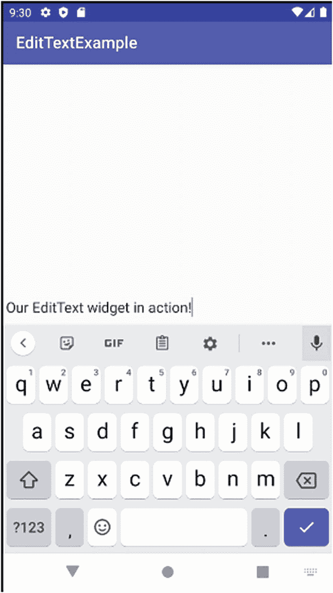

# 使用`EditText`编辑和输入文本  

在你迄今对 Android 控件的探索中，你已经了解了静态文本标签、可触发活动的按钮以及显示图像的方法。几乎每个应用程序在某个时刻都需要用户输入，而输入通常是文本。没有某种可编辑表单或字段控件的控件集是不完整的，Android 通过`EditText`控件满足了这一需求。  

`EditText`的类层级结构显示它派生自你已经熟悉的`TextView`类，并最终派生自`View`类。作为`TextView`的子类，`EditText`继承了你在`TextView`中见过的许多能力、方法和数据成员，例如`textAppearance`。`EditText`还引入了一系列新的属性和特性，使你能精细控制文本字段的外观和行为。这些新属性包括：  

1. `android:singleLine`：管理回车键的行为，确定回车键是应在文本字段内创建新行，还是将焦点移动到活动布局中的下一个控件。  
2. `android:autoText`：管理内置拼写校正功能的使用。  
3. `android:password`：配置字段，在输入字符时显示密码圆点。  
4. `android:digits`：限制输入仅接受数字，隐藏字母类型的字符。  

Android 还提供了一种更细致——有人会说更精密——的方法来指定`EditText`的字段特性。可以使用`inputType`属性，将`EditText`字段的所有期望属性和特性集中在一起。我们将在第 10 章中介绍`inputType`以及键盘和输入方法的相关主题。清单 9-6 展示了`inputType`与其他选项配合使用的情况。  

清单 9-6 展示了`android:inputType`属性的基本用法，此处标记用户文本应自动将第一个单词的首字母大写。我们还使用了常规属性`android:singleLine`并设置为 false，从而在`EditText`字段中启用多行文本。  

```  
清单 9-6  
使用 XML 属性配置 EditText 字段的行为  
```  

清单 9-7 展示了如何通过附带的 Java 包以编程方式操作`EditText`字段。你可以在`Ch09/EditTextExample`中找到此示例。  

```  
package org.beginningandroid.edittextexample;  
import androidx.appcompat.app.AppCompatActivity;  
import android.os.Bundle;  
import android.widget.EditText;  
public class MainActivity extends AppCompatActivity {  
@Override  
protected void onCreate(Bundle savedInstanceState) {  
super.onCreate(savedInstanceState);  
setContentView(R.layout.activity_main);  
EditText myfield=(EditText)findViewById(R.id.myfield);  
myfield.setText("Our EditText widget");  
}  
}  
清单 9-7  
EditText 控件可以轻松地从代码中操作  
```  

请注意，我们在该清单中引入了`findViewById`方法。你可以想象，当你有任意数量的控件时，你需要一种编程方式来找到程序逻辑中要操作的那个控件。通过使用`R.id.named_id_from_XML_definition`形式的资源 ID 引用，你可以隐式地查找并链接到 XML 布局中通过该控件的`android:id`属性定义的匹配控件。因此，在此例中，`R.id.myfield`查找并匹配你的`EditText`的`android:id`，即`@+id/myfield`。  

你可以在图 9-6 中看到`EditText`示例的结果。  

  

**图 9-6**  
`EditText`控件运行中，通过键盘完整编辑文本  

还有其他典型迹象表明这是一个可编辑字段。内置的字典和拼写检查器可用——尝试拼错一个单词，它将以红色下划线显示。当字段获得文本输入焦点时，闪烁的光标也显而易见。你还可以通过选择称为`AutoCompleteTextView`变体（同样继承自`TextView`和`View`）的兄弟控件来帮助用户更快地输入，它会在用户输入时提示自动补全的建议词。  

> **注意**  
> 在使用`EditText`控件时，你可以通过使用名为`TextInputLayout`的布局实现更精密的功能，该布局包装并扩展了默认的`EditText`行为，提供了文本提示、高亮、帮助提示等功能。你可以在`developer.android.com`上找到更多关于`TextInputLayout`的信息。  

