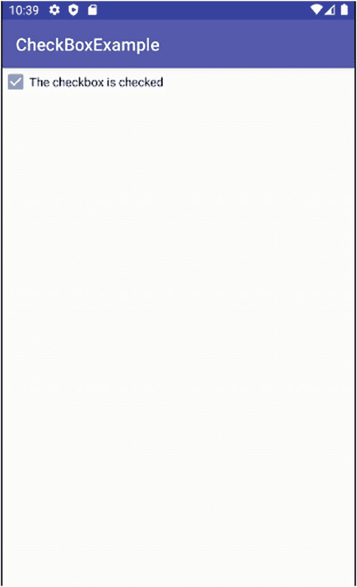
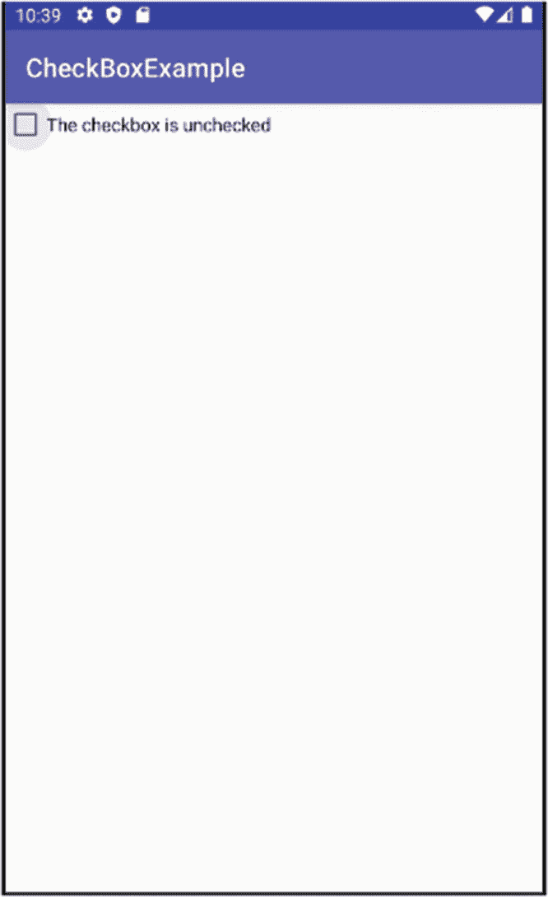
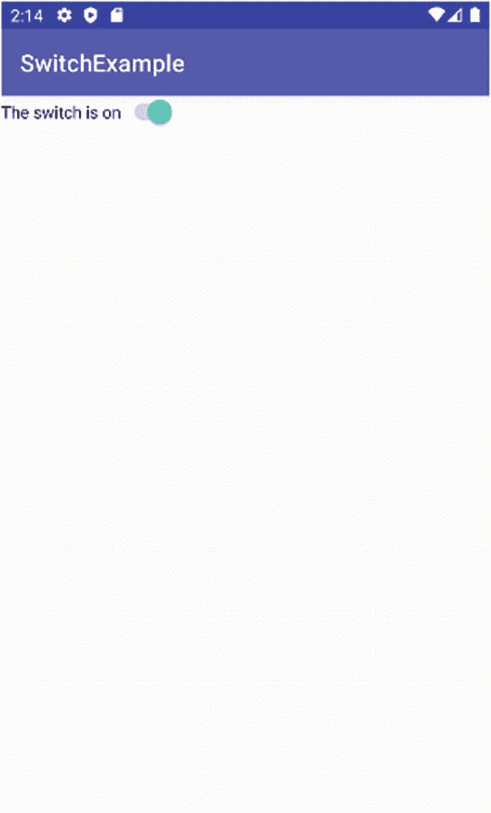
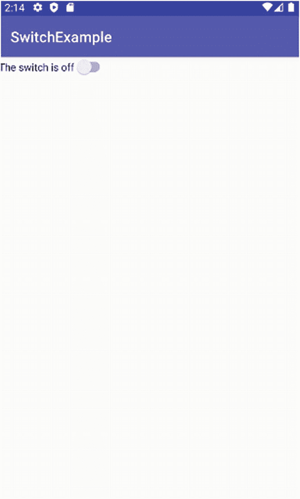
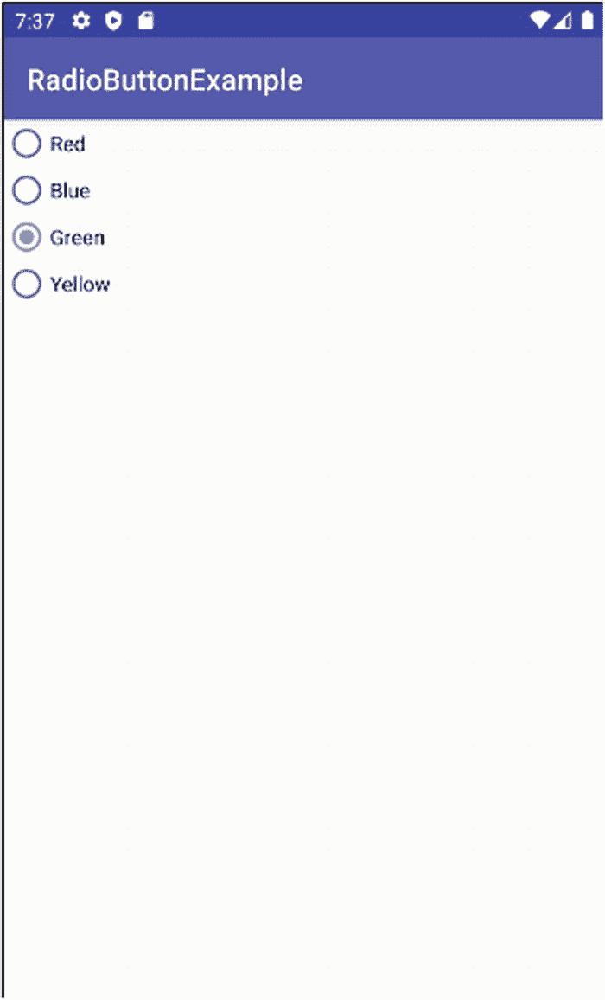

# 初探`CheckBox`  

Android 中另一个经典的 UI 控件是`CheckBox`，它提供了一种二元开关/是/否/选中/未选中的控件。`CheckBox`是`View`（你猜对了）和`TextView`（这可能会让你惊讶）的子类。这种类继承关系意味着你可以通过继承获得一系列有用的属性。`CheckBox`对象为你提供了一些 Java 辅助方法，用于对复选框执行有用的操作：  

1. `toggle()`：切换`CheckBox`的状态  
2. `setChecked()`：无论当前状态如何，都选中（设置）`CheckBox`  
3. `isChecked()`：用于检查`CheckBox`是否被选中的方法  

在清单 9-8 中，我们有一个示例复选框布局及简单的附带 Java 逻辑，你可以在`Ch09/CheckboxExample`项目中找到它。  

```  
清单 9-8  
一个包含 CheckBox 的布局  
```  

虽然一个略显吸引人的`CheckBox`单独看起来可能不错，但它真正需要*做*些什么，才能对你或你的用户有用。我们通过添加 Java 逻辑来配合布局，从而释放`CheckBox`的能力。清单 9-9 是演示如何将逻辑链接到复选框的 Java 包。  

```  
package org.beginningandroid.checkboxexample;  
import androidx.appcompat.app.AppCompatActivity;  
import android.os.Bundle;  
import android.widget.CheckBox;  
import android.widget.CompoundButton;  
import android.widget.CompoundButton.OnCheckedChangeListener;  
public class MainActivity extends AppCompatActivity {  
CheckBox myCheckbox;  
@Override  
protected void onCreate(Bundle savedInstanceState) {  
super.onCreate(savedInstanceState);  
setContentView(R.layout.activity_main);  
myCheckbox = (CheckBox)findViewById(R.id.check);  
myCheckbox.setOnCheckedChangeListener(new OnCheckedChangeListener() {  
@Override  
public void onCheckedChanged(CompoundButton buttonView, boolean isChecked) {  
if (buttonView.isChecked()) {  
myCheckbox.setText("The checkbox is checked");  
}  
else  
{  
myCheckbox.setText("The checkbox is unchecked");  
}  
}  
});  
}  
}  
清单 9-9  
用一些编程逻辑启动 CheckBox  
```  


显然，这里的 `CheckBox` 代码比之前的 `EditText` 等示例要复杂一些。首先看看导入的类，就能对发生的事情有所了解。我导入了 `OnCheckedChangeListener` 并提供了 `onCheckedChanged()` 回调方法的实现。这意味着我们将 `CheckBox` 设置为其自身状态变更事件（如被点击）的事件监听器。当用户点击 `CheckBox` 进行切换时，`onCheckChanged()` 回调会被触发。我们回调实现中的逻辑会测试切换后 `CheckBox` 的当前状态，并用文字描述更新复选框的文本，以反映其新状态。这是一种很好的方式，可以将小部件的所有行为集中在一个地方，并让我们能够在用户输入时的同一逻辑流中执行表单验证等操作，而无需传递一堆用户或数据状态。你的代码和相关的运行时输入检查将优雅地并排呈现。

图 9‑7 和图 9‑8 展示了我们的 `CheckBoxExample` 应用在选中和未选中状态下的界面。



**图 9‑8：** 复选框现在处于选中状态。



**图 9‑7：** 复选框处于未选中状态。

## 用 Switch 进行切换

`Switch` 小部件是在 Android 开发后期引入的，但其用途正如其名。`Switch` 就像一个二元开关，提供开/关式状态，用户可以通过手指滑动或拖动来激活它，就像拨动电灯开关一样。用户也可以像对待 `Checkbox` 一样，直接点击 `Switch` 小部件来改变其状态。在 Android 的多个版本中，`Switch` 小部件经过了调整以解决兼容性和其他问题，因此有时会使用 `SwitchCompat` 等其他变体来代替原始的 `Switch` 小部件，但总体用途和处理方式类似。

除了从 `View` 等继承的属性外，`Switch` 小部件还提供了 `android:text` 属性，用于显示与 `Switch` 状态关联的文本。该文本通过两个辅助方法 `setTextOn()` 和 `setTextOff()` 进行控制。

`Switch` 小部件还有其他可用方法，包括：

1.  `setChecked()`：将当前 `Switch` 状态更改为开（就像 `Checkbox` 一样）。
2.  `getTextOn()`：返回开关打开时使用的文本。
3.  `getTextOff()`：返回开关关闭时使用的文本。

`Ch09/SwitchExample` 项目提供了一个 `Switch` 的工作示例。清单 9‑10 展示了一个简单的开关布局。

```
清单 9‑10：SwitchExample 的布局。
```

> **注意：**  
> 不要试图将你的 `android:id` 设置为“switch”，例如 `@+id/switch`。Java 保留 `switch` 一词用于其 case 风格的分支逻辑语句，因此你需要像本示例中那样使用其他名称。

配置开关行为的逻辑位于我们的 Java 代码中，如清单 9‑11 所示。

```
package org.beginningandroid.switchexample;
import androidx.appcompat.app.AppCompatActivity;
import android.os.Bundle;
import android.widget.Switch;
import android.widget.CompoundButton;
import android.widget.CompoundButton.OnCheckedChangeListener;
public class MainActivity extends AppCompatActivity {
    Switch mySwitch;
    @Override
    protected void onCreate(Bundle savedInstanceState) {
        super.onCreate(savedInstanceState);
        setContentView(R.layout.activity_main);
        mySwitch = (Switch) findViewById(R.id.switchexample);
        mySwitch.setOnCheckedChangeListener(new OnCheckedChangeListener() {
            @Override
            public void onCheckedChanged(CompoundButton buttonView, boolean isChecked) {
                if (buttonView.isChecked()) {
                    mySwitch.setText("The switch is on");
                } else {
                    mySwitch.setText("The switch is off");
                }
            }
        });
    }
}
清单 9‑11：在代码中控制开关行为。
```

如果这段代码结构和逻辑看起来眼熟，那就对了！从概念上讲，`Switch` 和 `CheckBox` 几乎相同，并且对它们进行操作时的逻辑，至少在入门级别，几乎是可互换的。你可以在图 9‑9 和 9‑10 中看到开关在开启和关闭状态下的实际效果。



**图 9‑10：** 开关已打开，逻辑已触发以更改其文本。



**图 9‑9：** 开关小部件处于关闭位置。

## 使用单选按钮选择项目

在结束对 Android 核心 UI 小部件的详细探讨之前，是时候介绍 `RadioButton` 了。与大多数其他小部件工具包一样，Android 的 `RadioButton` 共享了你在 `CheckBox` 和 `Switch` 小部件中已经体验过的双状态逻辑，并且通过同样是 `View` 和 `CompoundButton` 的子类，获得了许多相同的特性。正如你在之前的示例中看到的那样，你可以通过 `toggle()` 和 `isChecked()` 等方法设置或测试状态，并通过样式属性控制文本大小、颜色等。

Android 的 `RadioButton` 小部件进一步扩展了这些能力，它增加了一层额外的功能，允许将多个单选按钮分组到一个逻辑集合中，并且任何时候只允许设置其中一个按钮。如果你在近年使用过任何其他 UI 工具包、网页或智能手机应用，这听起来应该很熟悉。为了对多个 `RadioButton` 进行分组，在 XML 布局中，每个按钮都被添加到一个称为 `RadioGroup` 的容器元素中。

与其他小部件一样，你可以通过 `android:id` 属性为 `RadioGroup` 分配一个 ID，并以该引用为起点，利用整个 `RadioButton` 组上可用的方法。这些方法包括：

1.  `check()`：通过 ID 选中/设置特定的单选按钮，无论其当前状态如何。
2.  `clearCheck()`：清除 `RadioGroup` 中的所有单选按钮。
3.  `getCheckedRadioButtonId()`：返回当前选中的 `RadioButton` 的 ID（如果没有 `RadioButton` 被选中，则返回 `-1`）。

清单 9‑12 展示了一个包含 `RadioButton` 的 `RadioGroup` 布局。

```
清单 9‑12：RadioButton 和 RadioGroup 布局。
```

你还可以在 `RadioGroup` 结构中穿插添加其他小部件，它们将根据 `ConstraintLayout` 的约束规则或我们将在下一章讨论的其他布局放置规则在组内渲染。你可以在图 9‑11 中看到基本的 `RadioButton` 的实际效果。



**图 9‑11：** `RadioGroup` 和 `RadioButton` 的实际效果。

## 学习更多 UI 小部件


Android 平台上总有许多新的微件等待你去学习或掌握，你可以在网站 [`www.beginningandroid.org`](http://www.beginningandroid.org) 上找到更多示例。在这里，你将看到诸如以下微件的更多示例：

1. `Slider`（滑块）
2. `AnalogClock`（模拟时钟）
3. `DigitalClock`（数字时钟）

我们还会在第 13 章和第 14 章中介绍更多侧重于音频和视频的微件。

## 本章小结

在本章中，你已经了解了构建 Android 用户界面时可用的许多基础微件（或称视图）。下一章，我们将进一步探讨用户界面设计概念，并介绍布局。布局作为一种容器和框架，用于在 Activity 及其他用户界面中放置、组织和嵌套你的微件。

