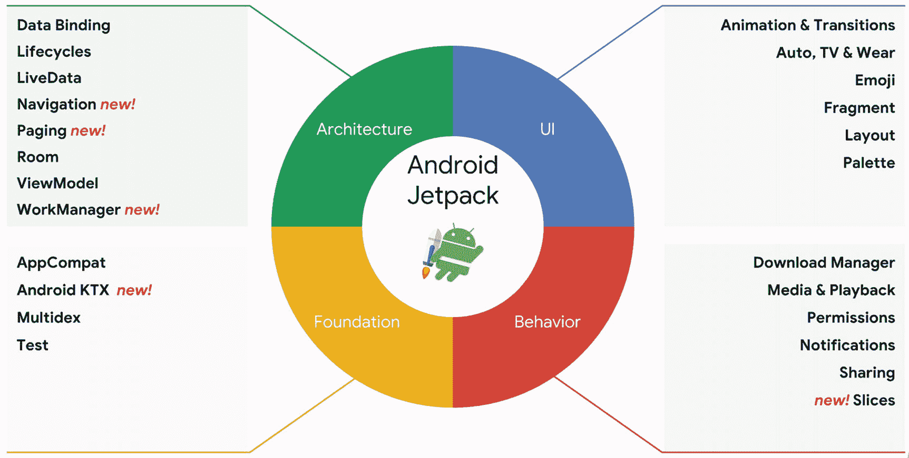
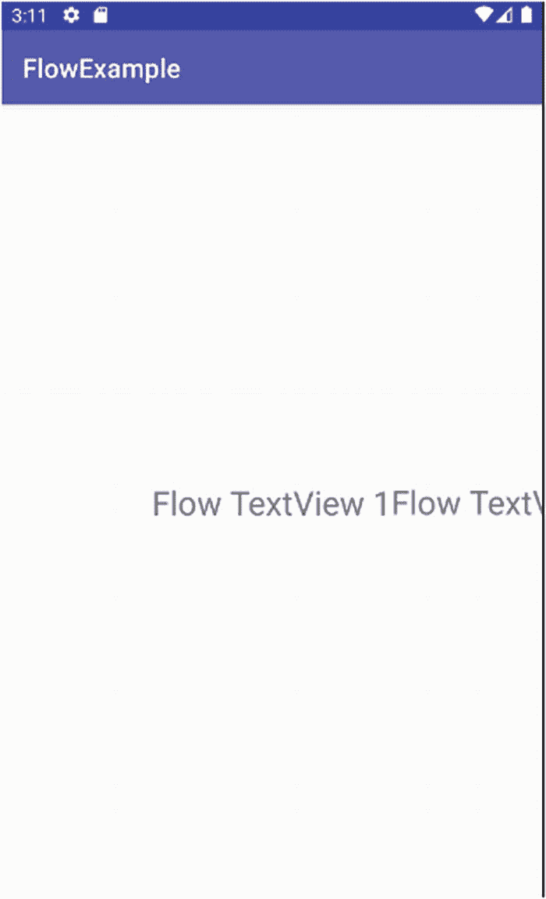
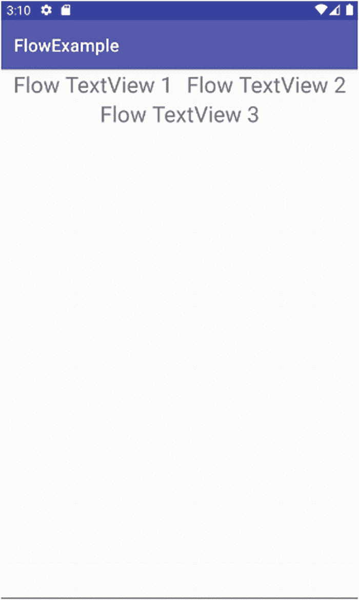
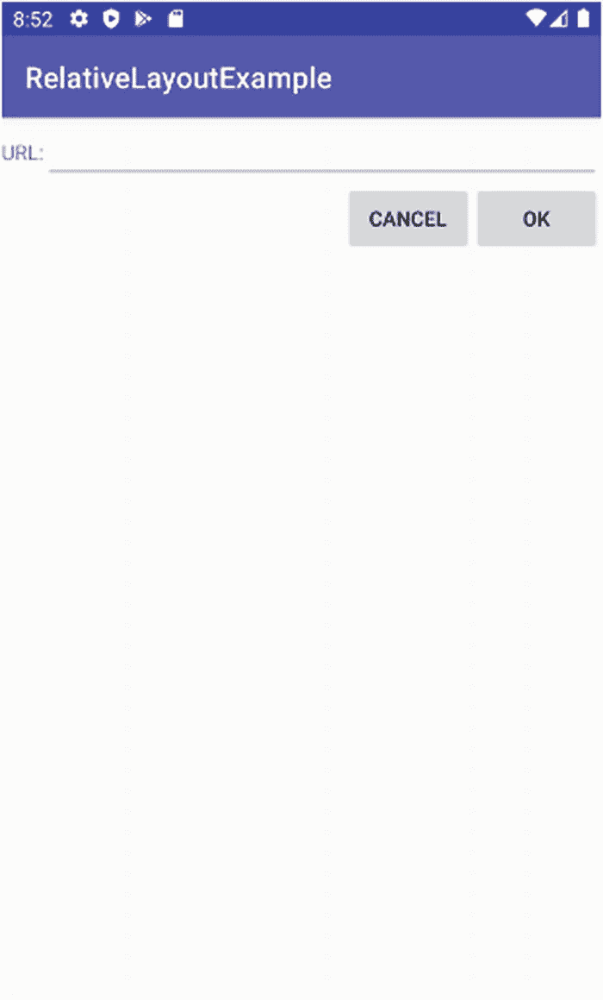
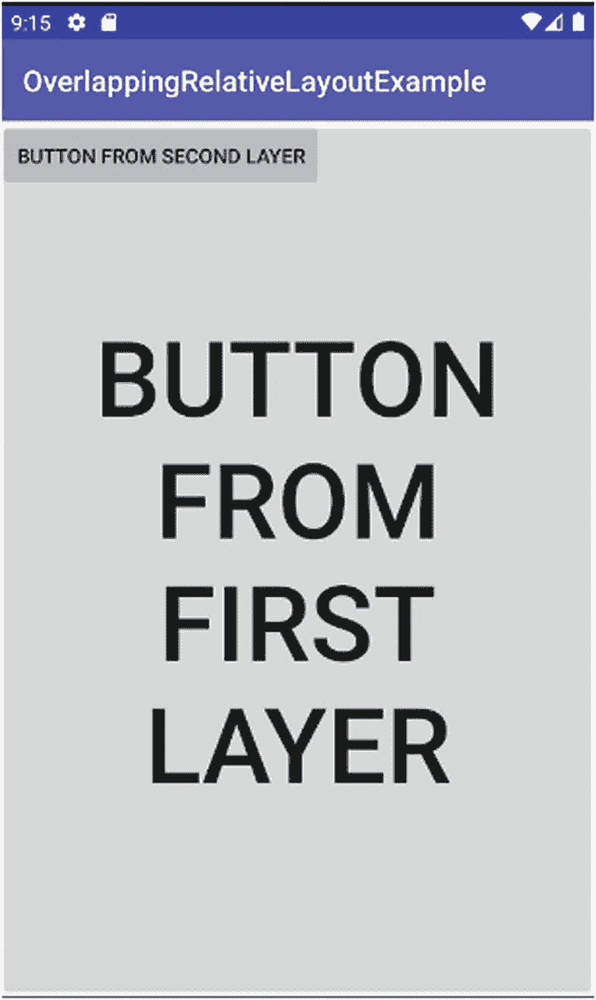
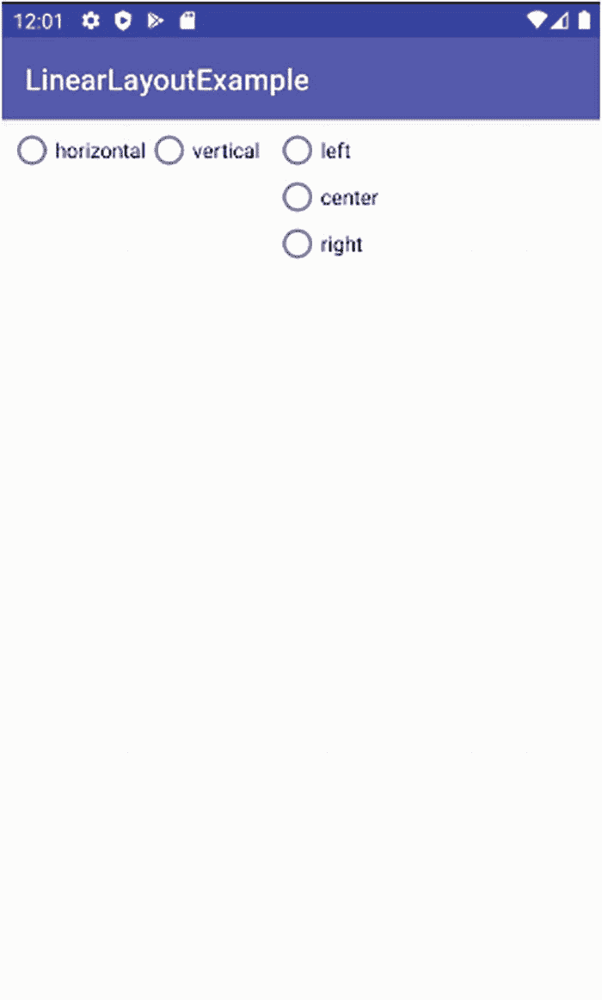
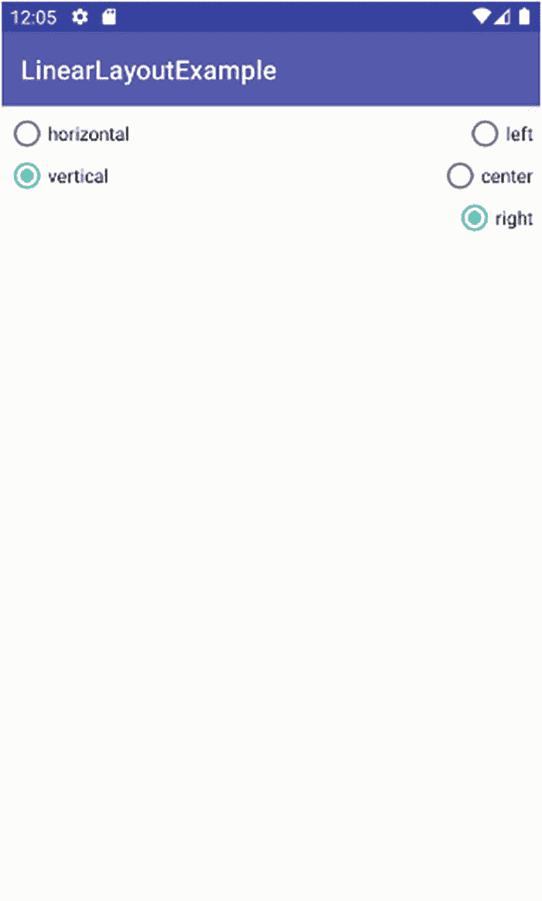

# 10. 探索 Android 概念：布局与更多内容

理解 Android 中提供的各种 UI 微件，确实能让你对应用中的特定功能和行为的呈现方式做出多种设计选择。然而，Activity 的设计远不止选择单选按钮或 `TextView`。布局是 Android 的一种声明式机制，它让你能够完全掌控应用的屏幕显示布局。从概念上讲，布局既是你在应用或 Activity 中希望使用的微件的容器，也是一份蓝图和框架，规定了所有微件应如何显示、交互以及相互配合。当你开始构思使用超过一两个微件的设计方案时，你会希望借助布局的强大功能，从而避免手动控制位置、缓冲区和空白区域、分组等繁琐工作。

在接下来的部分中，我们将回顾一些 Android 支持的最有用、最流行的布局类型，而网站上则包含了一些更专业或较少使用的布局的更多示例。

### 什么是 Android Jetpack

任何对 Android 设计的粗略搜索或回顾，都会浮现出一些有趣的里程碑，有些人甚至会称之为 Android 近期发展史上的分岔路口。你很可能会从近几年的搜索结果中看到两个专业术语。首先，你会看到“Material Design”这个术语，这是谷歌在 2012 年向世界推出的一种样式和设计理念，它影响着 Android 中的默认调色板、微件样式以及其他设计特性。第二个你会遇到的术语是“Android Jetpack”，毫无疑问，你会看到关于它如何让设计（包括布局）变得“更简单”、“更好”以及“全新且与众不同”的评论。这些说法没错，但它们可能会给新开发者带来一些困惑。我是否在使用 Jetpack？我怎么才能“获得”Jetpack？等等。

在 2018 年的 Google I/O 开发者大会上，谷歌推出了 Android Jetpack。抛开这些宣传，你会发现 Jetpack 本身并非什么“不同”的东西，而是对许多零散的 Android UI 框架组件和基础元素的一次重新打包，以及对 Android 支持库的一次修订和扩展后的方法。Jetpack 并不是另一种构建事物的竞争方式。相反，它几乎会渗透到你所做的所有事情中，从引用 `androidx` 命名空间中的任何库，到管理向后兼容性和对历史版 Android 的支持。因此，你实际上并不是“添加”Jetpack 到你的设计工作中。相反，当你利用那些在构建应用和借助 Android Studio 帮助时自然会用到的功能时，它会隐式地、几乎是自动地介入进来。

在 `android.com` 网站上，谷歌提供了对 Android Jetpack 旗下内容的快速概览。被纳入 Jetpack 旗下的现有 Android 部分分为四个领域：

1.  基础组件
2.  架构组件
3.  行为组件
4.  UI 组件

谷歌提供了图 10-1 所示的图表（来源：android-developers.googleblog.com/2018/05/use-android-jetpack-to-accelerate-your.html），用以展示这四个领域中 Android Jetpack 的特定部分。



**图 10-1** 理解 Android Jetpack 的概念组件 (¹)

如果你从这一节只带走一个观点，那就是你不必担心问自己“我是不是在使用 Jetpack？”，因为你肯定已经在用了！你可能没有使用所有的特性和功能组，但也没必要试图去全部使用。

### 使用流行的布局设计

在接下来的小节中，我们将介绍以下主要的布局容器：

1.  `ConstraintLayout`：当前 Android 新项目的默认布局，是 Jetpack 的一部分。它使用最少的定位约束来表达微件，且没有（或几乎没有）树状层次结构。
2.  `RelativeLayout`：从 Android 4.0 到引入 Jetpack 和 `ConstraintLayout` 之前的多年间使用的默认布局。它采用规则引导的方法来实现 UI 元素的自动排列。
3.  `LinearLayout`：最初的默认布局，在许多早期的 Android 应用中普遍使用。它遵循传统的盒模型，将所有微件想象为彼此嵌套或并列的盒子。

在本书的网站 [`www.beginningandroid.org`](http://www.beginningandroid.org) 上，你还会找到关于 Android 提供的其他布局的补充材料，包括：

1.  `TableLayout`：一种类似网格的方法，类似于在 Web 开发中使用 HTML 表格。
2.  `GridLayout`：与 `TableLayout` 看似相似，`GridLayout` 使用任意精度的网格线将你的显示区域分割成越来越具体的区域，以便在其中放置微件。

在讨论了这些主题之后，我们将转向如何从 Java 代码中操作 XML 布局，并通过对 ButtonExample 应用的修改版本来演示如何在代码中查找和处理你的布局。

> **注意**  
> 虽然本章我们将花大量篇幅讨论布局的 XML，但请始终记住，图形布局编辑器拥有设计模式，允许你直观地添加微件、放置和排列它们、设置关系等等。虽然你很可能总是混合使用手写 XML 和布局编辑器，但随着你开始偏好某一种方法，不时地切换到“另一种”方法也是值得的。这也是学习布局 XML 更多细微差别的好方法，通过观察当你使用图形布局编辑器时，Android Studio 在自动生成的 XML 中做了什么。

### 重新审视约束布局

在前面的章节中，你已经通过非常基础的 `ConstraintLayout` 设计实践过，包括你的 `MyFirstApp` 和第 9 章中的许多微件示例。虽然你可以继续将 `ConstraintLayout` 用作微件的简单容器，为 Android 提供约束设置以便其为你管理布局，但 `ConstraintLayout` 还有一些更高级的特性，你绝对应该了解并探索，以使你的 Activity 设计更上一层楼。

`ConstraintLayout` 提供了许多非常令人兴奋的特性，但我想重点介绍其中三个最新、最有用的特性。


#### 进入流动布局

随着 Android 的最新更新，`ConstraintLayout` 新增了一项可选功能，可以像倾倒一样将界面中的小部件“流动”排列在屏幕上，并能根据特定设备的界面尺寸和密度，在运行时自动换行和调整小部件的位置。

用 Flow 的术语来说，您可以将小部件集合链接到一个虚拟的 Flow 布局中，该布局充当基础 `ConstraintLayout` 的辅助工具。在布局 XML 文件中，通过 `<androidx.constraintlayout.helper.widget.Flow>` 元素来指定分组的 Flow 链式连接，然后由两个关键属性控制 Flow 的链式连接及其行为。

第一个属性是 `app:constraint_referenced_ids`，它接受一个逗号分隔的小部件 ID 字符串，告知 Android 界面中的哪些部分被分组到特定的虚拟 Flow 布局中。

第二个属性是 `app:flow_wrapMode`，它接受三个字符串值之一，用于指示 Android 如何管理 Flow 组中小部件的流动。`app:flow_wrapMode` 的可能取值及相关行为如下：

1.  `none`：默认方式——为组内所有小部件创建单一的逻辑链，如果小部件超出活动（Activity）的尺寸，则会溢出。
2.  `chain`：如果发生溢出，则将溢出的小部件添加到后续的链中进行容纳。
3.  `align`：与 chain 方式大致相似，区别在于会将行对齐成列。

熟悉 `ConstraintLayouts` 中的 Flow 选项非常容易。清单 10-1 显示了 `Ch10/FlowExample` 项目中 `FlowExample` 的相关布局 XML 文件。

```
清单 10-1
在 ConstraintLayout 中设置 Flow
```

`FlowExample` 布局非常简单。我们有三个 `TextView`，它们通过约束进行定义，正常情况下你会（尝试）先放置 `text1 TextView`，然后在它右侧放置 `text2 TextView`，再在 `text2` 右侧放置 `text3 TextView`。我特意选择了长文本和大字体来演示我的观点。在布局底部，你会看到在 `<androidx.constraintlayout.helper.widget.Flow>` 元素中定义的 Flow，其中我将 `flow_wrapMode` 指定为 `chain`，并将组的引用 ID 设置为 `"text1, text2, text3"`——也就是我的 `TextView` ID。

如果我省略了虚拟的 Flow 布局（参见控制此功能的 XML 布局中的注释），Android 会尝试按照常规的 `ConstraintLayout` 规则渲染活动，结果如图 10-2 所示。



**图 10-2** 没有 Flow 时，ConstraintLayout 将小部件渲染到屏幕之外

你可以立刻发现问题。我特意使用了一个屏幕尺寸较小的 AVD。我的 `text1 TextView` 正常渲染，`text2` 的一半也显示在了屏幕上。但 `text2` 的其余部分被截断了，`text3` 则完全不可见。实际上，它已经被渲染，但由于布局没有 Flow 选项来适应屏幕尺寸，因此不可见。你可以尝试在多种不同屏幕尺寸的 AVD 上运行移除了 Flow 元素的示例，看看小部件在何处以及如何被截断或无法显示。

在添加 Flow 元素后，重新运行 `FlowExample` 应用，Flow 的能力立刻显现。图 10-3 显示了同样的三个 `TextView`，但这次有了虚拟 Flow 布局的帮助，Android 能够遵循我指定的链式规则，将小部件流动到新行中，从而完整显示布局中的所有内容。



**图 10-3** 使用 Flow 后，ConstraintLayout 渲染出了所有内容

Flow 是一个极易掌握的全新功能。你可以获取 `FlowExample` 示例代码，开始添加更多小部件，扩展 Flow 引用 ID 集合，甚至可以更改 `flow_wrapMode`，以观察 Flow 的行为。

#### 使用 Layer 进行分层

Layer 将小部件和视图的自适应能力向前推进了一步。在界面设计中，“Layer” 这个名称的用法非常多，所以需要明确说明：Layer 并不直接布局小部件，也不帮助构建一系列 UI 组件的“堆叠”。通过扩展 `ConstraintLayout` 并使用 Layer，你可以获得一种统一的方法，通过单一机制来旋转、平移和缩放一组小部件和视图。

举个例子，你可能正在开发一个图形化的拼图游戏，并希望弱化用户当前未选中的任何图片块。借助 Layer，你可以将所有其他 `ImageView` 小部件添加到同一个 Layer 中，从而对它们应用相同的布局更改，然后将所需的变换一次性应用到 Layer 上，Layer 会将其应用到其组成的小部件上。

#### 使用 Motion 实现动画

最新版本 Android 中备受关注的一个功能是 `ConstraintLayout` 的扩展——`MotionLayout`。通过 `MotionLayout`，你可以将各种静态视图变得生动，通过定义和使用 `ConstraintSets` 来构建动画变化，例如旋转、淡入淡出、尺寸变化等。本质上，描述小部件和视图如何关联与定位的约束本身，就可以被视为控制运动和流动的变量。

手动构建基于 `MotionLayout` 的应用及其使用的各种 `ConstraintSet` 配置可能非常繁琐。考虑到这一点，Google 在 Android Studio 中引入了 Motion 编辑器，为你提供了一个动画画布，用于构建引人入胜的动画布局。

为了在 Motion 编辑器中开始使用 Motion 和 `MotionLayout` 设计，Android 引入了 `androidx.constraintlayout.motion.widget.MotionLayout` 作为 `ConstraintLayout` 的变体。`MotionLayout` 仍处于早期阶段，存在不少粗糙之处和手动设置步骤，并且会随着 Android Studio 的小版本更新而频繁变更。带有运动效果的布局也不适合在像本书这样的静态书籍中展示。

因此，为了确保你能获得关于 `MotionLayout` 的最新教程，并且能够看到这些选项如何在动态、运动的布局中发挥作用，相关教程和 `MotionExample` 演示可从网站 [`www.beginningandroid.org`](http://www.beginningandroid.org) 获取。

### 使用相对布局

`RelativeLayout` 长期以来一直是 Android 的默认布局，并且仍然是活动和片段设计的流行选择。正如“相对”一词所暗示的，`RelativeLayout` 利用小部件之间以及小部件与父活动之间的关系来控制小部件的布局。这种相对概念很容易理解，例如，你可以规定一个小部件相对于另一个小部件的位置放置在其下方，或者使其顶部边缘与某个相关小部件对齐等等。

所有这些关系设置都使用一组标准化的属性，这些属性定义在布局 XML 文件中的小部件 XML 定义中。

#### 相对于父容器放置小部件

理解 `RelativeLayout` 的一个良好起点是探索那些允许你相对于父容器定位小部件的属性。有一组核心属性可用于基于父容器（例如活动）及其顶部边缘、底部边缘、侧边等来锚定位置。这些属性包括：

1.  `android:layout_alignParentTop`：将小部件的顶部边缘与容器的顶部对齐。
2.  `android:layout_alignParentBottom`：将小部件的底部边缘与容器的底部对齐。


### 3. `android:layout_alignParentStart`：将微件的起始侧与容器的左侧对齐，适用于考虑从右到左和从左到右书写脚本的情况。例如，在美式英语的从左到右布局中，这将控制微件的左侧。

### 4. `android:layout_alignParentEnd`：将微件的结束侧与容器的左侧对齐，适用于考虑从右到左和从左到右书写脚本的情况。

### 5. `android:layout_centerHorizontal`：将微件水平居中放置在容器中。

### 6. `android:layout_centerVertical`：将微件垂直居中放置在容器中。如果您希望同时水平和垂直居中，可以使用组合属性`layout_centerInParent`。

在确定微件边缘的最终位置时，会考虑各种其他属性，包括内边距和外边距宽度。如果您要进行像素级的精确相对定位，请务必注意这些属性。

#### 使用 ID 控制相对布局属性

为`RelativeLayout`正确引用微件的关键在于使用被引用微件的标识符，这一点您已经遇到过：即微件的`android:id`标识符。例如，在之前章节的`ButtonExample`项目中，按钮的标识符为`@+id/button`。为了进一步控制微件的布局并描述它们相对于布局中其他微件的位置，您需要提供布局容器中微件的标识符。这可以通过在任何您想要引用的微件上使用`android:id`标识符属性来实现。

首次引用`android:id`值时，请确保使用加号修饰符（例如`@+id/button`）。后续对同一标识符（微件）的引用可以省略加号。在首次引用标识符时使用加号有助于 Android 代码检查工具检测标识符不匹配的情况，即您未在布局文件中正确命名微件的情况。可以将其视为在使用变量前先声明变量。

有了 ID 之后，我们之前的示例`@+id/button`现在可以被另一个微件（例如另一个名为`button2`的按钮）通过在其自身布局相关属性中引用该 ID 字符串的机制来引用。

注意：像`button`、`button1`和`button2`这样简单的名称对于此类示例来说没有问题，但在您的应用程序中，您非常希望使用有意义的微件标识符和名称。

#### 相对定位属性

现在您已经牢固掌握了标识符的机制，可以理解使用以下六个属性来控制微件相对于彼此的位置：

1.  `android:layout_above`：用于将 UI 微件放置在属性中引用的微件上方。
2.  `android:layout_below`：用于将 UI 微件放置在属性中引用的微件下方。
3.  `android:layout_toStartOf`：用于指示该微件的结束边缘应放置在属性中引用的微件的起始边缘处。
4.  `android:layout_toEndOf`：用于指示该微件的起始边缘应放置在属性中引用的微件的结束边缘处。
5.  `android:layout_toLeftOf`：用于将 UI 微件放置在属性中引用的微件左侧。
6.  `android:layout_toRightOf`：用于将 UI 微件放置在属性中引用的微件右侧。

更微妙地，您还可以使用众多其他属性来控制微件相对于另一个微件的对齐方式。其中一些属性包括：

1.  `android:layout_alignStart`：标记微件的起始边缘应与属性中引用的微件的起始边缘对齐。
2.  `android:layout_alignEnd`：标记微件的结束边缘应与属性中引用的微件的结束边缘对齐。
3.  `android:layout_alignBaseline`：标记两个微件中任何文本的基线（无论边框或内边距如何）应对齐（详见下文）。
4.  `android:layout_alignTop`：标记微件的顶部应与属性中引用的微件的顶部对齐。
5.  `android:layout_alignBottom`：标记微件的底部应与属性中引用的微件的底部对齐。

#### 使用 RelativeLayout 的示例

您已经了解了`RelativeLayout`的能力和行为，足以进入一个实际示例。清单 10-2 提供了来自`ch10/RelativeLayoutExample`项目、使用`RelativeLayout`的布局 XML。

```
清单 10-2
RelativeLayoutExample 应用程序的 XML 布局
```

在这个`RelativeLayoutExample`布局中，我们基于前几章的学习内容进行构建，以提供更丰富的理解。首先，您看到根元素是`<RelativeLayout>`，这是决定该活动将使用`RelativeLayout`方法进行布局和放置的关键因素。在常规的样板 XML 命名空间属性之上，引入了另外三个属性。

为了确保`RelativeLayout`跨越所用任何尺寸屏幕上的全部可用宽度，使用了`android:layout_width="match_parent"`属性。高度也可以这样做，但我们也可以告诉`RelativeLayout`仅使用容纳所含微件所需的垂直空间——因此使用了`android:layout_height="wrap_content"`属性。

借助我们在第 9 章中介绍的微件，我们为活动引入了四个元素：一个用作标签的`TextView`，一个用于可编辑字段的`EditText`，以及`OK`和`Cancel`两个按钮。

对于`TextView`标签，布局指示 Android 将其左边缘与父`RelativeLayout`的左边缘对齐，使用`android:layout_alignParentLeft="true"`。我们还希望一旦引入相邻的`EditText`，`TextView`的基线就能够自动管理，因此我们使用`android:layout_alignBaseline="@+id/entry"`来调用像素级微调。注意，我们引入带加号的 ID，是因为我们尚未描述`EditText`，所以需要预先告知其即将存在。

对于`EditText`，我们希望它位于标签的右侧，并且自身位于布局的顶部，占用`TextView`右侧的所有剩余空间。我们使用`android:layout_toRightOf="@id/label"`（该 ID 已引入，因此无需添加加号标记）指示它布局到右侧。我们使用`android:layout_alignParentTop="true"`强制`EditText`在`RelativeLayout`的剩余空间中尽可能高地放置，并通过使用`android:layout_width="match_parent"`占据画布上`TextView`右侧的剩余空间。这样做是可行的，因为我们知道也要求父布局使用最大可用剩余空间作为宽度。

最后，我们将两个按钮的位置绑定到之前引入的微件。我们希望`OK`按钮放置在`EditText`下方，并与它的右侧对齐，因此为其赋予属性`android:layout_below="@id/entry"`和`android:layout_alignRight="@id/entry"`。然后我们告诉 Android 将`Cancel`按钮放置在`OK`按钮的右侧，并使两个按钮的顶部对齐，使用`android:layout_toLeft="@id/ok"`和`android:layout_alignTop="@id/ok"`。

图 10-4 展示了我们对一个全新的空活动项目进行这些布局更改后的布局效果。



**图 10-4**  
`RelativeLayout`的实际应用


#### 相对布局中的重叠控件

Android 支持的每种布局都为您提供了独特且专业的功能，而`RelativeLayout`则具备一些关键能力，包括让控件相互重叠或实现一个控件看起来位于另一个控件前方或与之重叠的效果。这是通过 Android 跟踪 XML 定义中的子元素，并为布局中的每个单独子元素应用一个图层来实现的。这意味着，如果在布局 XML 文件中靠后定义的项与较早定义的项使用了 UI 中的同一空间，那么前者将位于后者之上。

没有什么比实际演示更能直观地展示这种效果以及它在应用设计中的帮助了。图 10-5 展示了一个包含两个按钮的布局，其中第二个按钮将位于第一个按钮的前方或之上。



**图 10-5** `RelativeLayout` 的重叠特性效果演示

关于你想要叠加的控件类型和数量，几乎没有任何限制。你可能也会好奇，为什么有人会想要以这种方式叠加控件。除了实现一些非传统的布局构想外，`RelativeLayout` 的重叠可能性意味着可以让控件在屏幕上显示但处于不可见状态，同时仍然对活动行为产生影响。

### 使用线性布局进行排列

在设计布局时，有时你不需要或不想使用约束或相对定位这种复杂方式，而只想依赖一些久经考验的传统布局方法。任何熟悉图形设计或界面设计历史的人都会听说过盒子模型，该模型将构成界面的所有项目（或控件）视为排列成行和列的元素。`LinearLayout` 遵循此模型，并且是早期 Android 版本使用的原始默认布局。它可能不再是当前首选的布局，但你始终可以依靠 `LinearLayout` 作为一种简单直接的选项来调整控件的排列、嵌套等。`LinearLayout` 缺少的是我们在 `ConstraintLayout` 和 `RelativeLayout` 中讨论过的一些巧妙、省时或实用的功能，但有时简单的解决方案正是我们所需要的一切。

#### 掌握 `LinearLayout` 的五大主要限定符

使用 `LinearLayout` 时，一组五个关键属性可帮助你控制整体布局及其中任何控件的几乎所有放置和外观方面：

- **方向（Orientation）**：对于 `LinearLayout`，首要且最基本的控制是确定盒子模型应被视为水平逐行填充还是垂直逐列填充。这就是 `LinearLayout` 的所谓方向，由 `android:orientation` 属性控制，其取值可以是字符串 `HORIZONTAL` 或 `VERTICAL`。方向也可以在运行时通过 Java 代码使用 `setOrientation()` 方法并传入类似参数进行设置。

- **外边距（Margins）**：默认情况下，你放置的任何控件与相邻控件之间都没有缓冲或间距。外边距让你可以控制这一点，并使用 `android:layout_margin`（影响控件的所有边）或单边属性（如 `android:layout_marginTop`）等属性来添加缓冲（正如其名，即外边距）。任何外边距属性都接受像素大小作为值，例如 10 dip。这在概念上与 `RelativeLayout` 的内边距类似，但仅当控件具有非透明背景（例如按钮）时才适用。

- **填充方式（Fill method）**：我们之前已经介绍过 `RelativeLayout` 中的 `wrap_content` 和 `match_parent` 概念。在 `LinearLayout` 方法中，所有控件都必须通过 `android:layout_width` 和 `android:layout_height` 属性指定填充方式。这些属性可以采用以下三个值之一：`wrap_content`，根据你之前所学，这指示控件仅大到足以容纳文本或图像内容；`match_parent`，占据父布局提供的最大空间量；或者一个以设备独立像素为单位的特定像素值，例如 125 dip。

- **权重（Weight）**：当 `LinearLayout` 中的两个或多个控件都指定了 `match_parent` 时，哪个控件会获胜？它们如何都能占据父布局提供的最大空间？答案是 `android:layout_weight` 属性，它允许你为每个控件应用一个简单的数值，例如 1、2、3、4 等。Android 会累加 `LinearLayout` 中所有控件的权重总和，然后根据每个控件在布局中所有控件总权重中所占的份额来分配 UI 空间。例如，如果我们有两个都配置为 `match_parent` 的 `TextView`，第一个 `TextView` 的 `android:layout_weight` 为 5，第二个为 10，那么第一个按钮将获得可用空间的三分之一（5/(5+10)），第二个按钮将获得三分之二。还有一些其他设置权重的方法，但都没有 `android:layout_weight` 方法直观。

- **重力（Gravity）**：使用 `LinearLayout` 时，Android 采取的默认布局方式是在使用 `HORIZONTAL` 方向时将所有控件从左侧对齐，在使用 `VERTICAL` 方向时将所有控件从顶部对齐。有时，你可能希望覆盖此行为，以强制布局采用自下而上或向右对齐的偏好。XML 属性 `android:layout_gravity` 允许你控制此行为，运行时方法 `setGravity()` 也是如此。对于 `VERTICAL` 方向，`android:layout_gravity` 可接受的值有 `left`、`center_horizontal` 和 `right`。对于 `HORIZONTAL` 方向，Android 默认会相对于控件文本的不可见基线进行对齐。使用值 `center_vertical` 可让 Android 改用控件的概念中心点进行对齐。

#### 一个 `LinearLayout` 示例

一开始就审视 `LinearLayout` 的理论可能会让人感到有些不知所措，因此从探索一些概念入手是有意义的，这有助于直观地理解如何使用、何时以及何处运用这些关键的 `LinearLayout` 杠杆。

如果纯粹从理论角度思考，所有 `LinearLayout` 选项可能会令人望而生畏。清单 10-3 中的动态示例展示了这些选项中的许多是如何工作的。

```
清单 10-3
演示 LinearLayout 提供的选项
```

该示例使用了两个简单的构建块来帮助我们理解方向和重力。我定义了两个独立的 `RadioGroup` 控件，其中第一个包含一组用于控制方向的 `RadioButton`，另一个包含一组用于控制重力的 `RadioButton`。作为起点，我们通过选择 `android:orientation="vertical"` 在 XML 定义中使用垂直方向，这将使两个 `RadioGroup` 上下排列，并且其中的 `RadioButton` 也垂直排列。

然后，我覆盖了第一个 `RadioGroup` 中两个单选按钮的垂直堆叠方式，使用 `android:orientation="horizontal"` 将它们切换为水平布局。虽然我想从父 `RadioGroup` 继承其他属性，但我灵活地覆盖了子 `RadioButton` 中的特定属性。最后，我们为所有控件设置了 5 dip 的内边距，并设置了 `wrap_content` 选项。


##### 运行无支持 Java 逻辑的示例

在没有支持 Java 逻辑的情况下运行此示例代码（仅包含布局），可以展示这些初始设置的实际效果。虽然目前还没有其他行为来改变你所看到的内容，但稍后就会实现。布局如图 10-6 所示。



**图 10-6** 设置方向和重力示例

##### 实现方向和重力变化的 Java 逻辑

看到布局渲染出来固然不错，但更理想的是编写一些 Java 逻辑来根据单选按钮的设置实际改变方向和重力。这正是代码清单 10-4 所示的内容。

```java
package org.beginningandroid.linearlayoutexample;
import androidx.appcompat.app.AppCompatActivity;
import android.os.Bundle;
import android.view.Gravity;
import android.widget.LinearLayout;
import android.widget.RadioGroup;
public class MainActivity extends AppCompatActivity implements RadioGroup.OnCheckedChangeListener {
    RadioGroup orientation;
    RadioGroup gravity;
    @Override
    protected void onCreate(Bundle savedInstanceState) {
        super.onCreate(savedInstanceState);
        setContentView(R.layout.activity_main);
        orientation=(RadioGroup)findViewById(R.id.orientation);
        orientation.setOnCheckedChangeListener(this);
        gravity=(RadioGroup)findViewById(R.id.gravity);
        gravity.setOnCheckedChangeListener(this);
    }
    public void onCheckedChanged(RadioGroup group, int checkedId) {
        switch (checkedId) {
            case R.id.horizontal:
                orientation.setOrientation(LinearLayout.HORIZONTAL);
                break;
            case R.id.vertical:
                orientation.setOrientation(LinearLayout.VERTICAL);
                break;
            case R.id.left:
                gravity.setGravity(Gravity.LEFT);
                break;
            case R.id.center:
                gravity.setGravity(Gravity.CENTER_HORIZONTAL);
                break;
            case R.id.right:
                gravity.setGravity(Gravity.RIGHT);
                break;
        }
    }
}
```

**代码清单 10-4** 基于 UI 选择实现方向和重力变化的 Java 逻辑

理解这段 Java 代码的作用非常容易。首先，在应用程序调用 `onCreate()` 期间，我们使用 `setOnCheckedChangedListener()` 为两个 `RadioGroup` 的点击事件注册了监听器。我们在 Activity 中实现了 `OnCheckedChangeListener`，这意味着 Activity 本身成为了监听器。

当你点击任何一个 `RadioButtons` 时，监听器会触发回调函数 `onCheckChanged()`。在该回调方法的定义中，我们会判断五个渲染的 `RadioButton` 中哪一个被点击了。一旦确定了是哪个 `RadioButton`，我们的逻辑就会调用 `setOrientation()` 来在垂直和水平布局流之间切换，或者调用 `setGravity()` 来设置相应的左、右或居中重力值。六个可能结果中的两个如图 10-7 和 10-8 所示。


**图 10-8** 另一个方向和重力示例



**图 10-7** 方向和重力的全方位展示

### 更多布局选项

Android 提供了一系列其他布局类型，其中许多类型在 Android 的各个版本中流行程度有所起伏。以下是需要了解的主要布局类型——更多关于这些布局的示例可从网站 [`www.beginningandroid.org`](http://www.beginningandroid.org) 获取。

#### 表格布局

早在互联网初期，网页设计师经常使用简单的 HTML 表格在页面上放置内容。虽然网页设计已经突飞猛进，但基于表格的布局概念仍然有用，Android 在 `TableLayout` 容器中采用了它们。

与 HTML 一样，Android 中的 `TableLayout` 使用起来很便捷，它依赖于 `TableLayout` 拥有 `TableRow` 子元素来控制大小、位置等概念。与旧的 HTML 网页方法还有一个相似之处：高精度的布局很难做到完美。

#### 网格布局

如果 `TableLayout` 的想法让你浮想联翩，那么你肯定会喜欢 `GridLayout`。作为 `TableLayout` 的近亲，`GridLayout` 将其子控件和 UI 元素放置在一个由无限精细的线条组成的网格上，这些线条将你的 Activity 所渲染的区域分割成多个单元格。`GridLayout` 精确控制的秘诀在于，用于描述单元格的单元格数量或网格线数量没有限制或阈值。只需添加更多网格线，就能将你的 UI 更精细地划分成子单元格，用于放置控件。

### 掌握基于 XML 的布局与 Java 逻辑：两全其美！

随着你对 XML 布局和 Java 管理的布局越来越熟悉，你最终会意识到你可以两全其美，并且随时可以改变主意。你可能更喜欢在 XML 中制作原型并使用图形布局编辑器，或者你可能更喜欢使用 Java 来尝试真正微妙的运行时布局选择。无论采用哪种方法，你都可以随时通过一些代码或调整 XML 来改变主意。为了说明这一点，代码清单 10-5 列出了你的 `ButtonExample` 应用程序中的计数 `Button` 代码，并将其转换为 XML 布局文件。你可以在 `Ch10/ButtonAgain` 示例项目中找到这段代码。

**代码清单 10-5** 灵活运用 XML 布局并通过 Java 逻辑控制

在代码清单 10-5 中，你应该能找到我们为 `ButtonExample` 应用程序拼装的各个部分的 XML 等效项，包括以下内容：

1.  将 `ConstraintLayout` 设置为根元素
2.  定义充当点击器和计数器显示的按钮，并分配一个 `android:id`，以便我们可以从代码中引用它，并在 Java 中执行点击计数
3.  `android:layout_alignParentBottom`、`android:layout_alignParentTop`、`android:layout_alignParentLeft` 和 `android:layout_alignParentRight`，每个都用于按钮的“父级”对齐
4.  `android:layout_width` 和 `android:layout_height`，将按钮设置为占据整个屏幕，就像我们在 `ButtonExample` 中所做的那样
5.  `android:text`，按钮上要显示的文本，初始为空字符串

虽然这是一个非常简单的转换为 XML 的示例，但核心概念才是最重要的，并且它们保持不变。更复杂的示例将包含用 XML 表示的多个控件、子布局和分支来控制复杂性。由于我倾向于使用基于 XML 的布局，你将在本书的后半部分看到更多这样的示例。

#### 在 Java 代码中连接 XML 布局定义

当你接受 XML 布局方法并开始精调控件位置等时，一个非常重要的问题出现了：即使我们的 Activity 只有一个布局，如何在 Java 逻辑中确定使用哪个布局？解决方案基于一个专门为此目的设计的方法调用，该方法通常在 Activity 的 `onCreate()` 回调中调用，以实现 Java 和 XML 的完美结合：`setContentView()` 方法。

`ButtonExample` 应用程序的简化版将其布局放在默认位置 `res/layout/activity_main.xml` 中，不过无论你的 Activity XML 文件如何自定义命名，该技术都适用。要从代码连接到布局，请像这样调用 `setContentView()`：

```java
setContentView(R.layout.activity_main);
```


