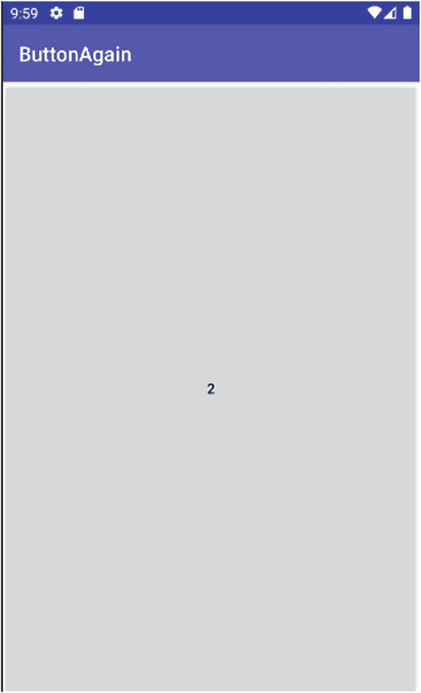
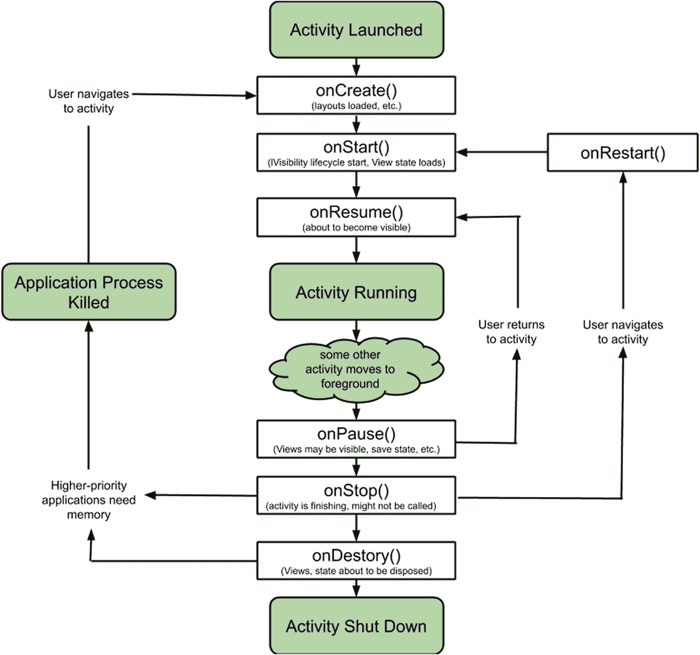

# 处理后的 Markdown 文档

查看`ButtonExample`的原始版本，你会发现`setContentView()`也在其中被调用。那么发生了什么变化呢？在`ButtonAgain`中，我们传递了一个基于 XML 定义的视图引用，这得益于 Android Studio 内置的 AAPT 工具解析了你的 XML 并生成了`R` Java 类。你可以利用`R`类对 XML 布局及其内部组件进行简洁的代码引用。无论你有多少布局、布局有多复杂，AAPT 都会将它们打包到一个统一的 Java 类中，并在`R.layout`命名空间中提供访问。你可以使用约定格式`R.layout.<你的布局文件名 _ 不含 _XML_ 扩展名>`来引用任何布局。要查找由`setContentView()`返回的布局中的控件，你可以调用`findViewById()`方法，并传入该控件的数字引用。请再读一遍这句话，你会发现一个“陷阱”。我说的数字引用是什么意思？在 XML 中并没有明确显示出控件的数字标识符或引用。这个谜团很容易解开。

在打包时，AAPT 会识别布局中的所有控件，为它们分配 ID 编号，并将其作为成员数据包含在`R.java`文件中。你可以随时打开`R.java`文件自行验证。但不必费心用这种方式去记忆。你可以通过`R.id.<控件 _android:id_ 值>`参数让 Android 解析任何你想引用的控件的 ID 编号。你可以用这个方法来解析任何继承自`View`基类的控件的 ID（几乎涵盖了所有控件）。

了解了这些机制之后，你就能看到 AAPT 基于你的布局将内容整齐地打包到`R.java`中，再结合`setContentView()`和`findViewById()`方法所带来的巨大威力。例如，不同的活动可以传入不同的`View`实例；更有趣的是，你可以根据某些程序逻辑来更换`View`，从而在检测到不同设备类型时使用不同的布局。

##### 通过`ButtonAgain`重温 MyFirstApp

在最初的`ButtonExample`示例中，按钮的显示内容会记录按钮被按下的次数。计数器从按钮通过`onCreate()`加载时开始计数。大部分现有逻辑（例如点击计数代码）在我们修改后的`ButtonAgain`版本中仍然有效。与`ButtonExample`代码的主要区别见列表 10-6，我们用`ButtonAgain`应用的 XML `ConstraintLayout`布局中的定义替换了之前活动`onCreate()`方法中的 Java 调用。

```
package org.beginningandroid.buttonagain;
import androidx.appcompat.app.AppCompatActivity;
import android.os.Bundle;
import android.app.Activity;
import android.view.View;
import android.widget.Button;
public class MainActivity extends AppCompatActivity implements View.OnClickListener{
Button myButton;
Integer myInt;
@Override
protected void onCreate(Bundle savedInstanceState) {
super.onCreate(savedInstanceState);
setContentView(R.layout.activity_main);
myButton=(Button)findViewById(R.id.button);
myButton.setOnClickListener(this);
myInt = 0;
updateClickCounter();
}
public void onClick(View view) {
updateClickCounter();
}
private void updateClickCounter() {
myInt++;
myButton.setText(myInt.toString());
}
}
列表 10-6
ButtonAgain Java 代码，与 XML 布局无缝对接
```

现在，通过查看`onCreate()`方法，你可以清晰地看到这些变化。首先，我们为指定的 XML 布局使用了自动生成的`R` Java 类中的`setContentView()`。然后，我们使用`findViewById()`方法，让它查找`android:id`值为“`button`”的控件。我们获得了以编程方式驱动按钮行为所需的引用，包括更改其标签以反映计算出的点击计数。

将所有的代码和 XML 组合在一起，就生成了一个`ButtonAgain`应用，其外观和行为与`ButtonExample`应用惊人地相似，如图 10-9 所示。



图 10-9
ButtonAgain 应用，完美结合 Java 逻辑与 XML 布局

## 总结

经过对布局及其部分特性的快速介绍，你现在应该开始思考可以在哪些地方使用本章中的容器和布局样式了。你也可以玩“猜猜你最喜欢的应用用了什么布局样式”的游戏。这并非布局学习的终点，在本书的剩余章节中，我们还将继续探讨更多相关概念。

## 脚注

11. 理解活动

到目前为止，你对活动的介绍主要集中在将其用作学习 UI 控件和布局的容器，同时你也了解到它们在计算上是“轻量”的，是 Android UI 的基本构建块，并且设计成你可以放心地在应用中使用任意数量的活动，因为 Android 操作系统会愉快地回收资源并保持你的活动可控。这在理论上很好，但实践如何呢？在本章中，我们将深入探讨 Android 如何通过活动生命周期来管理活动，实验活动生命周期的各个阶段，然后通过介绍活动的“伙伴”——Fragment——来扩展你构建引人入胜的用户界面的基础。你可以将 Fragment 视为合成技术，用于决定在何时、如何利用不同的活动和活动组件组合来适配大屏幕或极端尺寸的屏幕。

## 深入探索 Android 活动生命周期

到目前为止，本书中的所有示例都只使用了一个活动，尽管你已经多次读到你的应用可以拥有任意数量的活动。无论你有多少个活动，每个活动的使用都受生命周期管控，其中包括活动被选中运行、创建、使用、暂停和/或恢复，以及最终停止和销毁。在用通俗易懂的语言描述了生命周期的阶段，帮助你理解发生了什么之后，让我们来看看生命周期状态的实际技术细节，以及 Android 用于触发电状态转换的回调方法。图 11-1 展示了这些生命周期状态及相应回调方法的全貌。



图 11-1
带有回调转换方法的 Android 活动生命周期

一个应用通常处于以下四种主要状态之一：

1. 启动：应用在某个动作（通常是用户触发）指示 Android 操作系统运行该应用后的初始状态。
2. 运行：用户首次看到你的应用并能够与之交互的时刻（及持续状态）。通常这是在启动后完成一系列准备步骤之后。
3. 终止：当 Android 操作系统收到通知，得知应用不再需要时（无论是用户关闭了它，还是因资源问题被回收），应用进入的状态。


