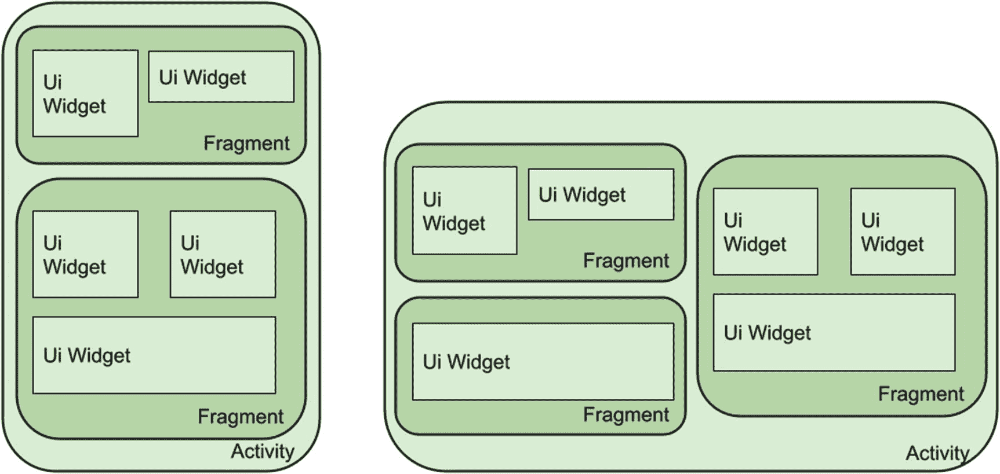
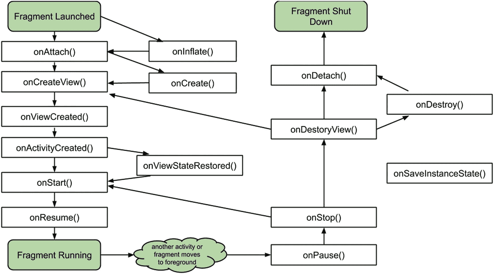

# 12. 初识 Fragment

在迄今为止我们关于 Android 布局基础的讲解中，我们涵盖了基本的基于 View 的 UI 小部件，并介绍了 Activity 及其生命周期。多年来，在 Android 世界中创建应用仅此而已——设计你的 Activity，添加你为应用所需的逻辑，然后在用户浏览应用功能时创建并销毁由此产生的已填充（或渲染）的 Activity。

大约在 2011 年，情况发生了爆炸性变化。或者更具体地说，随着平板电脑及其更大显示屏的出现和流行，屏幕尺寸发生了爆炸性增长。快进几年，我们发现汽车中出现了类似平板电脑的显示屏、巨大的电视屏幕等等，所有这些都由 Android 驱动。如何最大限度地利用突然可用的屏幕空间，促使 Google 匆忙推出了自 Android UI 诞生以来最大的变革之一：Fragment。

Fragment 解决了许多问题。从确保没有大面积的浪费空间，到克服那些看起来糟糕透顶的粗暴缩放技巧，Fragment 提供了一种机制，让你能够从多个相关的小部件集合中组合 UI，然后灵活地在 Activity 中显示 Fragment，从而能够在一个屏幕中展示更多内容或提供更多功能。

## 从 Fragment 类开始

随着大屏幕的出现，以及用户体验通常涉及更多的设备旋转——例如，先以竖屏模式阅读，然后以横屏模式观看电影——开发者面临着选择：要么创建更多的 Activity，要么找到更好的方式来重用已为应用构建的 Activity 集合。Fragment 倾向于后者的重用范式，并在 Activity 与它们被渲染的布局容器以及用于实现功能的 UI 小部件之间引入了一个中间层。这有助于在处理几乎无休止的屏幕尺寸 proliferations 时降低复杂性。使用应用的一些方面会发生变化，特别是 Activity 的生命周期。我们接下来将详细讨论这一点。

## Fragment 与向后兼容性

Fragment 早在 Android 3.0（代号 Honeycomb）版本中就被引入了。你可以通过 Jetpack 或更早的 Android 兼容性库，在更旧的版本中获得良好的支持。

## 为应用使用基于 Fragment 的设计

在深入探讨以 Fragment 为中心的设计之前，你应该知道使用 Fragment 完全是可选的。如果你现在喜欢设计大量 Activity 的想法，则无需放弃这种方法。但如果你更愿意利用 Fragment 提供的优势，那么请继续阅读。

### 以碎片化思维进行设计

以碎片化思维进行设计时，请思考你现有的布局，以及 `TextView`、`Button`、`RadioGroup` 等各类小部件放置的位置。任何在概念上相关并组合在一起的小部件子集——例如，用作标签的 `TextView` 与 `EditText` 相邻——都可以考虑将其包裹在一个碎片中。为了更直观地展示，图 12-1 展示了这种分组方式，其中碎片作为小部件与整体活动之间的中介层。

**图 12-1** 碎片作为小部件与活动之间的中介组

通过这种模型，你可以看到碎片分组如何在更大屏幕或不同方向上移动，以及如何显示更多碎片及其包含的小部件。你仍然能够在较小的手机屏幕上展示精良的用户界面，而无需在屏幕尺寸的两端做出妥协。为了实现这一目标，碎片首先通过在布局中添加使用 `<fragment>` 元素块的 XML 来实现。你将在接下来的示例中看到这一实践。布局定义的其他部分基本保持不变，这意味着你到目前为止学到的所有知识在碎片环境中仍然 100% 可用。这使你能够像以前一样继续使用视图层级结构，并通过填充这些层级结构来生成用户与之交互的最终屏幕。

使用碎片还会引入一个额外场景，即你使用 `Bundle` 对象进行初始化、保存状态和重新创建，这与第 11 章中讨论的活动生命周期非常相似。碎片还有其他值得了解的特性，包括以下几点：

1.  你可以继承基础碎片类并添加自己的自定义逻辑，但必须为派生类提供构造函数。
2.  在使用碎片时，Android 会创建一个 `FragmentManager` 来处理碎片之间的双向交互——你无需为此编写代码。

另一个需要了解的主要变化是整体活动与碎片生命周期的改变。

## 使用碎片生命周期

碎片生命周期与我之前在第 11 章介绍的活动生命周期之间存在着许多共享的行为和概念。与活动生命周期一样，碎片生命周期的可视化图有助于理解其状态和转换。完整的碎片生命周期如图 12-2 所示。

**图 12-2** 碎片生命周期

原始活动生命周期与碎片生命周期的主要区别在于宿主活动与组成碎片之间的交互。与父活动的单一状态转换相比，碎片的转换可能带来额外的复杂性，并且可能包含多个事件转换。

### 审视碎片生命周期回调方法

许多碎片生命周期回调方法与你在活动中看到的回调方法名称相同，但要注意，这并不意味着它们执行完全相同的操作。以下列表列出了主要差异，以及碎片独有的回调方法。

#### `onInflate()`

调用 `onInflate()` 方法是为了将布局 XML 文件中使用 `<fragment>` 元素定义的碎片布局填充到屏幕上的 UI 中。如果你通过代码中的 `newInstance()` 调用以编程方式显式创建新的碎片，也可以直接调用 `onInflate()`。传递给它的参数包括碎片将驻留的引用活动，以及一个 `AttributeSet`，其中包含来自 `<fragment>` 标签的任何额外 XML 属性。在此阶段，Android 正在确定你的碎片在渲染时的外观，尽管它当前不会显示它。这一步将在 `onAttach()` 回调期间发生。

#### `onCreate()`

碎片的 `onCreate()` 方法与活动的类似，但有一些微小的调整。主要的变化是，你不能依赖任何活动的视图层级结构在 `onCreate()` 调用中作为引用。仔细想想，这很有道理，因为与碎片关联的活动正在经历其自身的生命周期，而就在你认为可以开始依赖它时，它很可能会停止存在，或经历配置变更或其他导致视图层级结构被销毁或重新创建的事件。

#### `onAttach()`

`onAttach()` 回调紧随 Android 确定碎片附加到哪个活动之后发生。此时，你可以安全地进行与活动关系相关的操作，例如获取并使用上下文进行其他操作。任何碎片都有一个继承的 `getActivity()` 方法，该方法将返回其附加到的活动。你的碎片还可以使用 `getArguments()` 方法来获取并处理任何初始化参数。

#### `onCreateView()`

`onCreateView()` 回调为你提供了一种机制，用于返回碎片所选的视图层级结构。它接收一个 `LayoutInflater` 对象、`ViewGroup` 以及实例状态的 `Bundle`，然后依靠 Android 根据所有常见的屏幕尺寸和密度属性选择合适的布局，使用 `LayoutInflater` 的 `.inflate()` 方法对其进行填充，按你认为必要的方式修改布局，最后返回生成的视图对象进行渲染。

#### `onViewCreated()`

在 `onCreateView()` 返回后立即触发 `onViewCreated()`。它可以在使用任何已保存状态修改视图之前执行进一步的后处理工作。

#### `onViewStateRestored()`

当碎片的视图层级结构的所有状态都已恢复时，会调用 `onViewStateRestored()` 方法。这对于区分新创建与配置变更后恢复等情况非常有用。

#### `onStart()`

碎片的 `onStart()` 回调直接与父活动对应的 `onStart()` 相关联，并在碎片显示在用户 UI 中后立即调用。你原先打算放在活动级 `onStart()` 回调中的任何逻辑，都应改为放入相关碎片的 `onStart()` 方法中。

#### `onResume()`

碎片的 `onResume()` 方法也与对应的活动 `onResume()` 方法紧密映射。它是在用户完全控制活动及其碎片之前进行的最后一次调用。

#### `onPause()`

`onPause()` 回调也与整个活动的 `onPause()` 方法紧密匹配。如果将逻辑移到碎片中，那么关于暂停音频或视频、停止或释放其他操作和资源等活动变体的规则在此处同样适用。

