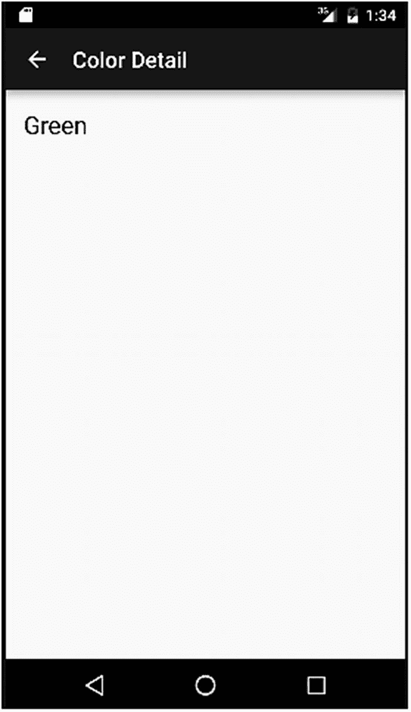
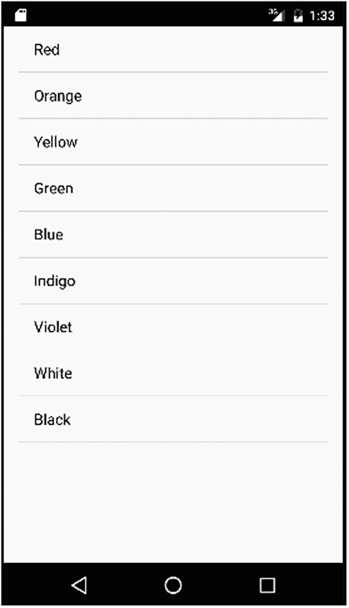
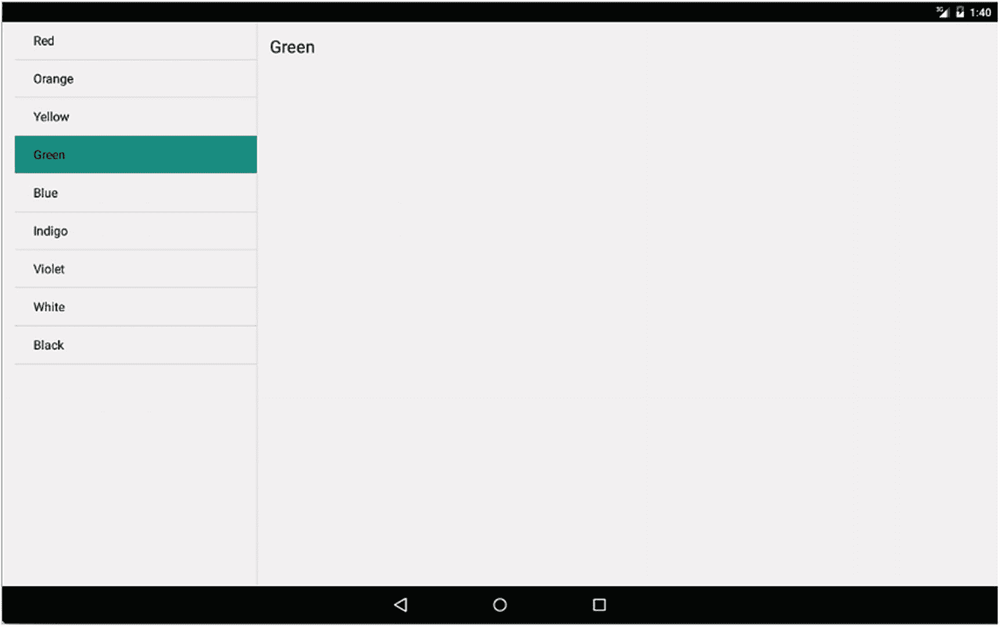
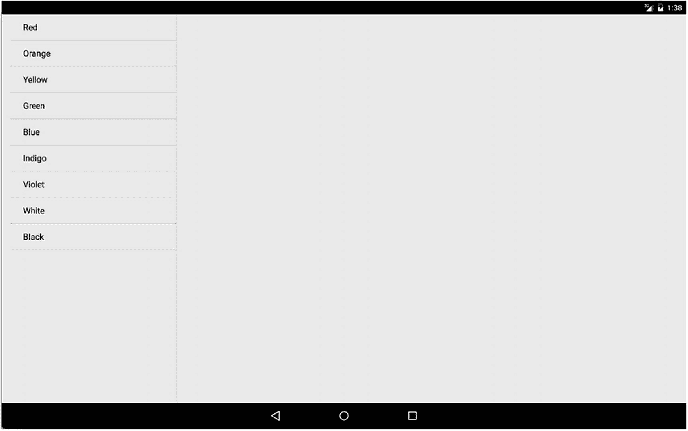

# 片段生命周期方法

#### `onSaveInstanceState()`

片段的`onSaveInstanceState()`方法与 Activity 中的同名方法完全相同。您应使用`onSaveInstanceState()`通过片段的`Bundle`对象来持久化希望在片段实例间保留的任何资源或数据。但不要过度保存大量数据和状态——请记住，对于片段外部的长生命周期对象，您可以使用标识符引用，只需引用和保存这些对象即可。

#### `onStop()`

`onStop()`方法与 Activity 中的同名方法功能相同。

#### `onDestroyView()`

当片段进入生命周期结束阶段时，会调用`onDestroyView()`。当 Android 系统分离与片段关联的视图层次结构后，便会触发`onDestroyView()`。

#### `onDestroy()`

当片段不再使用时，会调用`onDestroy()`方法。此时片段仍与其宿主 Activity 保持关联，尽管它很快就会被送入"回收站"！

#### `onDetach()`

终止片段的最后一步是将其从父 Activity 中分离。这也标志着所有其他资源、引用以及残留的标识符应当被销毁、移除或释放。

### 从片段生命周期事件简单入手

前面介绍的片段生命周期阶段及其关联的回调方法可能让您感到头晕目眩，您可能担心为了使用片段并从中受益，必须立即为所有这些方法编写代码。其实无需担心！正如 Activity 生命周期的介绍一样，您不必用自己的逻辑覆盖所有存根方法。只有在某个状态转换时需要执行特定操作时，才需要提供支持代码。您可以从最低限度开始，只需覆写`onCreateView()`方法即可完成基本功能。

在下面的`ColorFragmentsExample`代码中，我就是这样做的，将回调逻辑保持在最低限度。

## 创建基于片段的应用程序

是时候看看片段的实际应用了！我将使用一组简单的颜色主题控件和 Activity 来演示使用片段的便捷性。

### 创建片段布局：颜色列表

清单 12-1 显示了将在父 Activity 中使用的基于片段的布局，用于展示颜色列表。

```
清单 12-1
用于显示颜色列表的片段布局
```

此定义包含`<fragment>` XML 元素，并依赖内置的`list_content`布局在列表中显示`TextView`条目。我们将为所有可能的显示尺寸和方向使用此片段，无论是手机屏幕上的单面板视图，还是大屏幕上的多面板视图布局。

### 创建片段布局：颜色详情

我将使用`TextView`控件显示颜色的详细信息，该控件将放置在片段中，而该片段将放置在父 Activity 中。`Ch12/ColorFragmentExample`项目中的`fragment_color_detail.xml`文件提供了`TextView`的简单布局。清单 12-2 显示了其内容。

```
清单 12-2
用于显示颜色详情的 TextView 布局
```

### 颜色详情的单面板父 Activity

在小型屏幕设备上运行时，我们将把`TextView`布局在适合这种尺寸的 Activity 中。该 Activity 的唯一任务就是创建容纳`TextView`的片段，您可以在清单 12-3 中看到此代码。

```
清单 12-3
activity_color_detail.xml 布局
```

这是一个简单的`<FrameLayout>`，带有一些基本修饰。`TextView`将通过片段放置在此布局中。

### 颜色详情的双面板父 Activity

当转移到更大的屏幕时，更合适的布局会将所有片段和 UI 控件同时显示在屏幕上，最大化利用空间。

`activity_color_twopane.xml`布局文件可能会让您觉得工作量更大，但仔细检查后，您会发现它实际上只是一个组合，包含了我们为小屏幕分离到单独布局中的`<fragment>`和`<FrameLayout>`。清单 12-4 显示了此 XML。

```
清单 12-4
activity_color_twopane.xml 布局
```

与拼接在一起的单独布局相比，唯一的区别在于`android:layout_weight`的值，这些值将用于管理两个片段在同一个 Activity 中同时呈现时所占据的屏幕空间比例。通过选择 1:3 的比例，主列表片段将获得四分之一的屏幕空间，而详情片段则占据剩余的四分之三。

### 选择要填充的布局

您的 Android 应用程序如何决定使用哪个布局以及显示哪些片段的排列方式？答案在于使用项目中`res/`资源文件夹层次结构中的多个`refs.xml`文件。在我们的示例中，`res/values-large`和`res/values-sw600dp`文件夹中各有一个`refs.xml`文件。

当代码运行时，Android 会在运行时检查所有不同的尺寸特定`res/`目录（数量可能不止两个，正如您在本书前面探索 Android 项目结构时所看到的）中是否存在任何尺寸特定的 XML 资源。对于大屏幕和`sw600dp`尺寸的屏幕，`refs.xml`中只有一个子元素，如下所示：

```
@layout/activity_color_twopane
```

任何被 Android 归类为"large"或满足`sw600dp`分辨率标准的屏幕，都会触发 Android 使用来自同名 XML 文件的`activity_color_twopane`布局。

### 为片段编写代码

在为基于片段的应用程序编写代码时，需要注意的差异非常少。主要的不同之处在于我们之前在第 11 章中介绍的生命周期相关回调，以及您以 UI 为核心的逻辑和任何相关的数据处理将转移到片段级别。您的 Activity 仍然存在，它们处理 Activity 生命周期事件和跨片段功能性的逻辑也保持不变。

我们的`ColorListActivity`是使用片段时编码负担较低的一个绝佳示例。清单 12-5 显示了应用程序的完整逻辑，包括处理应用程序在父 Activity 中最终显示为一个还是两个片段的情况。

```
package org.beginningandroid.colorfragmentexample;
import android.content.Intent;
import android.os.Bundle;
public class ColorListActivity extends FragmentActivity
implements ColorListFragment.Callbacks {
private boolean mTwoPane;
@Override
protected void onCreate(Bundle savedInstanceState) {
super.onCreate(savedInstanceState);
setContentView(R.layout.activity_color_list);
if (findViewById(R.id.color_detail_container) != null) {
mTwoPane = true;
((ColorListFragment) getSupportFragmentManager()
.findFragmentById(R.id.color_list))
.setActivateOnItemClick(true);
}
}
@Override
public void onItemSelected(String id) {
if (mTwoPane) {
Bundle arguments = new Bundle();
arguments.putString(ColorDetailFragment.ARG_ITEM_ID, id);
ColorDetailFragment fragment = new ColorDetailFragment();
fragment.setArguments(arguments);
getSupportFragmentManager().beginTransaction()
.replace(R.id.color_detail_container, fragment)
.commit();
} else {
Intent detailIntent = new Intent(this, ColorDetailActivity.class);
detailIntent.putExtra(ColorDetailFragment.ARG_ITEM_ID, id);
startActivity(detailIntent);
}
}
}
```

清单 12-5
ColorListActivity 的代码


### ColorFragmentExample 示例

总体而言，逻辑非常直接。当调用 `onCreate()` 时，我们将 `activity_color_list` 布局加载到用户界面中。接着，我们通过测试来判断 `color_detail_container` 视图对象是否已被实例化（无论其是否显示）。这为我们提供了一个代理，用于根据 Android 的屏幕检测规则和我们的 `refs.xml` 规则，判断应用程序是否在 `activity_color_twopane` 布局内运行。如果在此状态下运行，我们将布尔值 `mTwoPane` 设置为 true，并使用 `getSupportFragmentManager()` 通过 `setActivateOnItemClick()` 方法设置点击处理。

然后，重写的 `onItemSelected()` 方法负责判断当用户点击一种颜色时该执行什么操作。我们是应该使用 `color_detail_fragment` 布局及 `ColorDetailFragment.java` 中的关联代码创建一个额外的 fragment，还是应该触发 `startActivity()`，并显式调用 `color_detail_activity` 布局及关联的 `ColorDetailActivity.java` 代码？

`Ch12/ColorFragmentExample` 中的源代码还展示了显示颜色细节的机制以及辅助类 `ColorContent`，它只是一个用 Java 封装颜色项目集和一些管理函数的方法（请记住，Android 对 Java 的支持尚未超越 Java 8，因此像数据类这样更现代的方法不可用）。其他可以提供此列表的选项包括 Content Provider 或其他数据源。

### 运行中的 ColorFragmentExample

完成应用程序逻辑、布局和 fragment 后，让我们运行这个应用程序！

为了看到 fragment 的实际威力，我们需要两个先前示例中已设置好的不同尺寸的模拟器。图 12-3 和 12-4 展示了在小屏幕设备上，颜色列表和颜色细节 fragment 分别位于不同的 activity 中——在此示例中，我使用了 Pixel 2 AVD。



图 12-4
通过触发新 activity 显示颜色细节 fragment



图 12-3
在 Pixel 2 模拟器上显示的颜色列表 fragment

当在更大的屏幕上运行同一个应用程序时，您可以看到差异。图 12-5 和 12-6 展示了 fragment 的强大功能，此时应用程序在 Pixel C 模拟器上运行。



图 12-6
检测到大屏幕后，第二个 fragment 被添加到 activity 中



图 12-5
`ColorListActivity` 在 Pixel C 上的初始显示，带有一个 fragment

## 总结

现在您已经掌握了 fragment 的核心概念，探索 fragment 方法全部威力的最佳方式就是通过越来越多的应用程序进行实践。在本书的其余部分，我们将提供更多使用 fragment 的示例，更多内容请访问本书网站 [`www.beginningandoid.org`](http://www.beginningandoid.org)。您也可以在网络上找到成千上万的更多示例。

---

