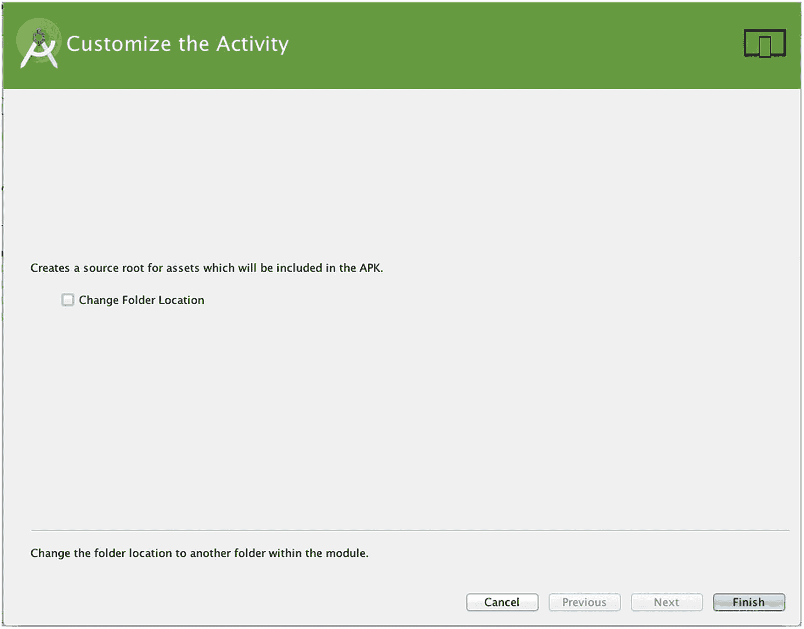
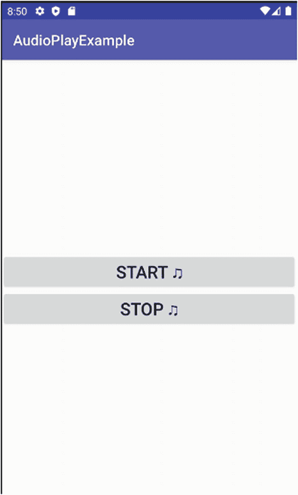
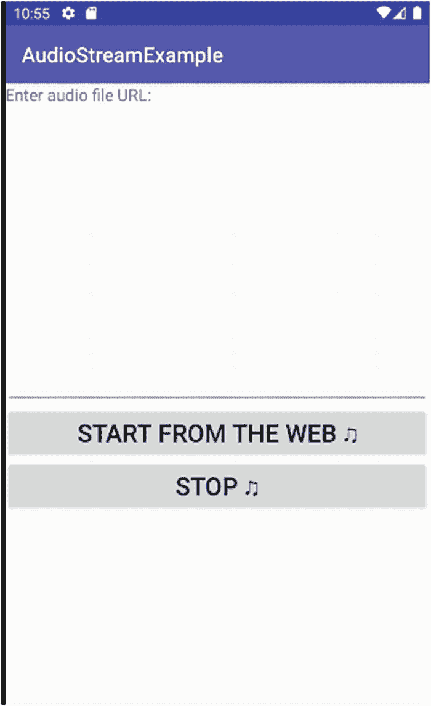

# 第三部分 – 进阶

## 13. 为 Android 处理声音、音频和音乐

是时候转向 Android 应用开发中一些更复杂、更有趣的方面了。在接下来的几章中，我们将探讨为应用程序添加音频、视频和静态图像，以及创建和录制这些媒体类型、显示和使用它们的机制。

让我们从音频功能的概述开始。本章剩余部分有一个注意事项：印刷书籍无法真正提供音频示例（尽管在线版本可以）。为了充分利用本章的示例代码，您绝对应该在真实设备或 AVD 上运行这些应用程序。

### 播放音频

Android 提供了丰富的方式让您在应用中使用音频。事实上，随着时间的推移，这些方式已经多到让选择变得令人眼花缭乱。不过别担心。Android 还构建了一个结构良好的方法来帮助管理所有这些不同的方法——即 Media 包，我们稍后将介绍。

#### 选择您的音频方法

首先，让我们看看在 Android 中利用音频播放的主要方式。根据您的需求以及您计划从哪里获取音频，每种不同的方法都为您提供了优势和各种选项。

##### 使用原始音频资源

原始音频资源是一种声音文件或音频源，它被打包成文件并与您的应用程序一起捆绑在 `raw` 文件夹中。原始方法意味着您可以保证所需的音频始终可用，这种方法非常常用于游戏中的音效、通知等音频。原始方法的缺点是，更改与应用程序 APK 捆绑的音频只能通过替换（升级）整个应用程序来实现。

##### 使用音频资产

音频资产也与您的应用程序捆绑在一起，因此具有与原始方法相同的优点和缺点。资产方法提供的额外好处是可以通过 URI 命名方案来访问您的音频，例如 `file:///android_asset/some_URL`。这在您使用任何期望或需要 URI 的 API 时会带来便利，而 Android 中有许多这样的 API。

##### 使用文件存储存储音频

文件存储方法比原始方法更基础，不适合胆小者。您使用设备的内置或可移动存储来保存音频文件。通过文件 I/O API（我们将在本书后面介绍）进行访问。虽然管理起来负担更重，但这意味着理论上您可以下载新文件、更改文件和删除文件，而无需升级应用程序。

##### 访问音频流服务

如果您完全不想操心音频存储问题，流式传输就是答案。您可以从设备上的其他服务或 Android Content Provider（它们本身可能从其他地方流式传输）流式传输音频，或者直接从基于互联网的服务流式传输。流式传输使您无需担心存储、文件管理、空间需求或升级。但它将这些担忧换成了对连接性的焦虑——您只能在拥有可用数据连接时进行流式传输。

### 使用 Media 包

处理音频的各种选项既可以是福音，也可以是诅咒。有适合您各种想法的机制，但选择也带来了复杂性。幸运的是，Android 配备了多才多艺的 Media 包，帮助简化您作为开发者的生活，同时保留您可用的选项。

Media 包提供了两个关键类供您使用：`MediaPlayer` 用于播放音频，我们将首先介绍它；以及 `MediaRecorder` 用于设备端录制，我们将在本章后面介绍。


### 创建音频应用

为了让`Media`包（以及`MediaPlayer`类）发挥作用，我们将创建一个你几乎肯定熟悉的标志性应用。如果你曾拥有 iPod、智能手机或类似设备，很可能播放过自己喜欢的音乐、播客等 MP3 音频文件。是时候制作你自己的 MP3 播放器应用了。

#### 在资源文件夹与资产文件夹之间选择

如本章前面所述，你可以选择使用哪种方法来管理音频文件，以便你的应用能够访问它们。

如果我们想使用原始音频资源，首先需要在项目中创建一个`raw`文件夹来存放音频文件。在 Android Studio 中，可以通过导航到层次结构中的`res`文件夹，选择菜单选项`File` ➤ `New` ➤ `Directory`来完成此操作。将目录命名为"raw"，你的`raw`文件夹就创建好了。

如果我们想使用基于资产的方法，同样需要首先为应用创建`assets`文件夹。要在 Android Studio 中创建`assets`文件夹，请突出显示项目层次结构中的`app`父级文件夹，然后选择`File` ➤ `New` ➤ `Folder` ➤ `Assets Folder`菜单选项，系统会提示为项目创建`assets`文件夹，如图 13-1 所示。



**图 13-1** 在 Android Studio 中为项目添加`assets`文件夹的提示

项目中 Android Studio 的`assets`文件夹对应的文件系统位置是`./app/src/main/assets`（Windows 系统下为`.\app\source\main\assets`）。如果你想继续使用传统的`raw`文件夹，可以在项目的`./app/src/main/res`文件夹下找到（或创建）它。

#### 编写音频播放代码

本着学习`MediaPlayer`以及了解音频播放器各部分工作原理的初衷，我们将暂时跳过`Media`包中的其他好东西，包括捆绑的特殊屏幕控件和其他精美资产——这些虽然能让你快速拥有一个外观出色的媒体播放器，但会让你失去学习其工作原理和原因的机会。

我们将从简单开始，在接下来的几章中逐步构建，逐步探索`Media`框架的各个部分。

##### 简单方式播放音频

对于音频播放中`Media`框架的初步探索，我们将使用一个非常简单的初始界面，如图 13-2 所示。别担心，我们将在接下来的几章中扩展和完善它。



**图 13-2** 初始的简易音频播放器界面

虽然这个简陋的设计并不华丽，但它让我们能够探索开始播放和停止播放的机制。布局 XML 如代码清单 13-1 所示，并包含在`Ch13/AudioPlayExample`项目中。

```
代码清单 13-1
AudioPlayExample 项目的布局文件
```

简单来说，该布局提供了两个按钮，分别标有"开始"和"停止"，并附带了音乐符号的 Unicode 字符。重要的是，每个按钮都添加了`android:onClick`属性，这使我们能够将点击按钮时调用的方法连接起来。我们为每个按钮使用了相同的目标方法名——`onClick`。当任意按钮被点击时，该方法都会被调用，我们将使用`android:id`值来驱动该方法中的逻辑，以决定要执行的操作。

##### 为 AudioPlayExample 编写 Java 逻辑

`AudioPlayExample`的 Java 逻辑如代码清单 13-2 所示，同样包含在`Ch13/AudioPlayExample`项目中。

```java
package org.beginningandroid.audioplayexample;
import androidx.appcompat.app.AppCompatActivity;
import android.media.AudioManager;
import android.media.MediaPlayer;
import android.os.Bundle;
import android.view.View;
public class MainActivity extends AppCompatActivity {
private MediaPlayer mp;
@Override
protected void onCreate(Bundle savedInstanceState) {
super.onCreate(savedInstanceState);
setContentView(R.layout.activity_main);
}
public void onClick(View view) {
switch(view.getId()) {
case R.id.startButton:
doPlayAudio();
break;
case R.id.stopButton:
doStopAudio();
break;
}
}
private void doPlayAudio() {
mp = MediaPlayer.create(this, R.raw.audio_file);
mp.setAudioStreamType(AudioManager.STREAM_MUSIC);
mp.start();
}
private void doStopAudio() {
if (mp != null) {
mp.stop();
}
}
public void onPrepared(MediaPlayer mp) {
mp.start();
}
@Override
protected void onDestroy() {
super.onDestroy();
if(mp != null) {
mp.release();
}
}
}
```

**代码清单 13-2** 支持`AudioPlayExample`应用的 Java 代码

在我们深入分析代码之前，先退一步看看有多少行代码。非常少，而且其中很多是你期望看到的生命周期回调方法样板。正如你将看到的，这是因为即使以底层方式使用`MediaPlayer`，编码效率仍然非常高。

除了预期的`view.View`（用于所有标准 Android 控件等）和`os.Bundle`导入之外，我们还导入了用于音频播放的关键`Media`框架包：

- `Android.media.AudioManager`：`AudioManager`提供了一系列支持功能，使各种音频处理变得更加容易。你可以使用`AudioManager`来标记音频源是流媒体、语音、机器生成音等。
- `Android.media.MediaPlayer`：作为`Media`包的主力，`MediaPlayer`让你能够完全控制从本地和远程源准备和播放音频的过程。
- `Android.media.MediaPlayer.OnPreparedListener`：作为异步播放的关键，`OnPreparedListener`是一个接口，使在离线线程准备完成后能够通过回调播放音乐。


`onCreate()`回调的实现执行了我们非常熟悉的操作：将布局文件填充到应用程序的用户界面中。随后，它将控制权交给其他方法，以响应用户与按钮的交互。

从之前对布局 XML 的描述中，您知道`onClick()`方法会根据传递给它的`View`来决定执行的操作。当用户决定点击`startButton`或`stopButton`按钮时，Android 会将一个代表被点击按钮的`View`引用传递给`onClick()`方法。一个 Java `switch`语句会检测哪个`View`被传递给了该方法，从而判断哪个按钮被点击。如果`startButton`被点击，则会调用`doPlayAudio()`方法。反之，如果是`stopButton`，则会调用`doStopAudio()`方法。

当用户点击“Start”按钮并触发`startButton`的逻辑时，一系列意料之中和意料之外的事情会发生。首先会创建一个`MediaPlayer`对象，并将音频文件绑定到该对象上。`R.raw.audio_file`这个标记在概念上类似于您之前见过的布局填充标记（例如`R.layout.activity_main`）。Android 会遍历应用程序`.apk`文件中打包的`raw`文件夹，尝试找到一个名为`audio_file`且带有任何支持的音频扩展名（例如 mp3、m4a 等——在我们的示例中为`audio_file.m4a`）的资源。

确定文件后，我们通过`mp.setAudioStreamType()`方法首次使用了`AudioManager`类。`AudioManager`可以为您做很多事情，其中之一就是为给定的音频资源设置流类型。Android 支持多种音频流类型，以便为相关音频提供最佳的音量、保真度等支持。我们使用`STREAM_MUSIC`流类型，表示我们希望获得设备支持的最高动态范围等。其他选项包括用于 DTMF 音调的`STREAM_DTMF`（Android 会过滤任何标记为此方式的流以符合 DTMF 标准），以及`STREAM_VOICE_CALL`流类型，它会触发 Android 对语音音频调用或抑制各种回声消除技术。

由于我们直接处理原始资源，我们可以立即在`doPlayAudio()`中调用`mp.start()`。这将触发`MediaPlayer`对象开始实际播放文件，并将音频发送到扬声器或耳机。

用户点击“Stop”会触发`doStopAudio()`方法，该方法基本上不言自明。如果`MediaPlayer`对象已实例化，我们首先调用其`stop()`方法。我们使用`if{}`块来检查实例化状态，以确保如果用户从未点击过“Start”（例如，用户打开应用程序后误操作首先点击了“Stop”），我们不会尝试停止任何内容。

接下来是`onPrepared()`回调方法。此方法与包定义相关联，在包定义中`AudioExample`实现了`OnPreparedListener`接口。从技术上讲，在`AudioExample`应用程序的第一次实现中，我们没有使用`onPrepared()`回调，但此处包含它是为了强调，在某些情况下，在`MediaPlayer`对象实例化并且`AudioManager`已被调用来设置流类型之后，您不能立即开始播放。何时以及为何使用`onPrepared()`将在流式播放示例中进一步介绍。

最后，我们使用`onDestroy()`回调来释放`MediaPlayer`对象（如果它之前已被创建）。代码介绍完毕，现在您可以亲自尝试了。启动一个 AVD 映像，运行该示例，或者如果您修改了`Ch13/AudioPlayExample`代码，可以运行您的变体，以确认最终可用的产品确实能发出声音！

---

**使用流式传输进行音频播放**

虽然播放 MP3 文件和其他存储的音频在 iPod 和其他音乐播放器兴起之初被认为是风靡一时的，但时代显然已经改变，Android 必须与时俱进。Android 完全支持来自设备本身和远程服务的流媒体（包括音频）播放。媒体框架再次为您处理了一切。

图 13-3 展示了我们修改后的`AudioPlayExample`，它现在变成了全新的`AudioStreamExample`。为了节省篇幅，这里不再重复 XML 内容——请随时查看`Ch13/AudioStreamExample`中的文件。



**图 13-3** `AudioStreamExample` 用户界面

要获取并流式播放音频，我们的 Java 代码需要做更多的工作，您可以在清单 13-3 中看到。

```
package org.beginningandroid.audiostreamexample ;
import androidx.appcompat.app.AppCompatActivity;
import android.media.AudioManager;
import android.media.MediaPlayer;
import android.media.MediaPlayer.OnPreparedListener;
import android.os.Bundle;
import android.view.View;
import android.widget.EditText;
public class MainActivity extends AppCompatActivity implements OnPreparedListener {
// useful for debugging
// String mySourceFile=
//         "https://ia801400.us.archive.org/2/items/rhapblue11924/rhapblue11924_64kb.mp3";
private MediaPlayer mp;
@Override
protected void onCreate(Bundle savedInstanceState) {
super.onCreate(savedInstanceState);
setContentView(R.layout.activity_main);
}
public void onClick(View view) {
switch(view.getId()) {
case R.id.startButton:
try {
EditText mySourceFile=(EditText)findViewById(R.id.sourceFile);
doPlayAudio(mySourceFile.toString());
} catch (Exception e) {
// error handling logic here
}
break;
case R.id.stopButton:
doStopAudio();
break;
}
}
private void doPlayAudio(String audioUrl) throws Exception {
mp = new MediaPlayer();
mp.setAudioStreamType(AudioManager.STREAM_MUSIC);
mp.setDataSource(audioUrl);
mp.setOnPreparedListener(this);
mp.prepareAsync();
}
private void doStopAudio() {
if (mp != null) {
mp.stop();
}
}
// The onPrepared callback is for you to implement
// as part of the OnPreparedListener interface
public void onPrepared(MediaPlayer mp) {
mp.start();
}
@Override
protected void onDestroy() {
super.onDestroy();
if(mp != null) {
mp.release();
}
}
}
```

**清单 13-3** `AudioStreamExample` 逻辑

我们的代码从第一个`AudioPlayExample`进化为两个方面，您可以在`doClick()`和`doStartAudio()`方法中看到。`doClick()`方法已更改，它接受用户在`EditText`对象`mySourceFile`中输入的 URL，并将其视为要播放的选定音频文件。我们使用`EditText`的`String`值传递给修改后的`doPlayAudio()`方法进行后续调用。`try-catch`块用于处理`doPlayAudio()`现在可能抛出的异常，例如，如果 URL 未找到或未返回流。

`doPlayAudio()`方法现在放弃了直接文件访问方式。相反，我们只需创建一个新的`mp` `MediaPlayer`对象。我们调用`AudioManager`包，并声明最终的数据源将是`STREAM_MUSIC`。随后，我们使用传递的 URL 调用`setDataSource()`（此方法还有许多其他有用的选项，但我们将留待以后讨论）。

要成功使用`setDataSource()`调用，我们需要在清单文件中授予我们的应用程序`android.permission.INTERNET`权限，以便它能获取源（音乐）流。我们将在第 19 章深入介绍权限，但现在您只需在项目的`AndroidManifest.xml`文件中添加以下内容：

```
<uses-permission android:name="android.permission.INTERNET" />
```

最后，在`MediaPlayer`对象上调用了`.prepareAsync()`。

**同步播放与异步播放**


