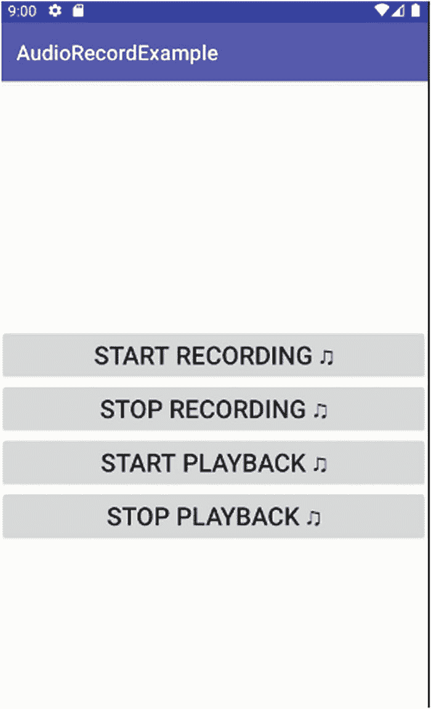

# 在 Android 中播放音频

### 即时播放的优缺点

尝试即时播放音频（无论其来源如何）都存在利弊。简而言之，作为开发者，你需要回答这样一个问题：在用户点击“播放”（或等效操作）与实际准备好通过设备播放音乐之间的这段时间内，会发生什么？你是阻止所有活动并等待，还是让其他事情继续进行？这是一个颇具深度的主题，存在一系列细微差别，你可以在书籍网站 [`www.beginningandroid.org`](http://www.beginningandroid.org) 上阅读更多内容。

#### 播放音频流

掌握了这些变化后，我们的 `AudioStreamExample` 最终将接收到对 `onPrepared()` 的回调，从而开始播放音乐（或语音、鸟鸣声等）。`onPrepared` 的逻辑与之前的示例保持一致。

### 探索其他播放选项

使用 Media 包和 `MediaPlayer` 对象并非你在 Android 下处理音频和音乐的唯一选择。其他选项包括：

- **SoundPool**：作为 `MediaPlayer` 的精简版本，`SoundPool` 简化了处理设备上声音文件的方法。它摒弃了任何流式传输或服务提供的音频，并利用文件/资源访问，通过 `FileDescriptor` 来访问与应用 `.apk` 文件打包在一起的音频文件，这通过包括 `.load()` 和 `.getAssets().openFd()` 在内的简单方法实现。

- **AsyncPlayer**：`MediaPlayer` 为音频播放的异步准备提供了一些支持，但正如你在 `AudioPlayExample` 应用中所见，实际播放的大部分机制是同步的。`AsyncPlayer` 则采用完全异步的两步法。首先，实例化一个 `AsyncPlayer` 对象，然后调用其 `.play()` 方法，并传入要播放音频的 URI。在此之后的某个时刻，音频将开始播放，但由于此方法的异步特性，所涉及的时间是不确定的。

- **JetPlayer**：在复杂度的另一端则是 `JetPlayer`。使用 `JetPlayer`，你可以利用 Android SDK 和 API 附带的外部工具来打包和管理应用的音频，并通过 MIDI 标准呈现对其的访问。随后，你的 Android 应用便可以使用该音频，并访问一些相当复杂的操作选项，但这些超出了本书的范围。

- **ExoPlayer**：最新且日益流行的播放方法。`ExoPlayer` 是谷歌提供的开源产品，独立于常规 Android 机制发布，并提供诸如 SmoothStreaming 自适应播放等实验性或新颖的功能。它专为像你这样的开发者进行扩展和修改而设计。更多详情请参见 [`https://github.com/google/ExoPlayer`](https://github.com/google/ExoPlayer)。

`android.com` 网站上提供了大量关于这些音频替代方案的文档。

### 录制音频

在掌握了音频播放的基本原理之后，现在我们将注意力转向录制音频和分享这些声音。正如播放有多种替代方法一样，在 Android 中录制音频也有一系列多样的可能性。

#### 使用 MediaRecorder 录制音频

作为本章开头介绍的 `MediaPlayer` 的补充，`MediaRecorder` 提供了一套广泛的工具，用于在各种情况下录制声音。学习其功能的最佳方法是通过一个示例深入实践。我们将通过扩展之前的示例，在 `Ch13/AudioRecordExample` 代码中整合录制功能来做到这一点。在图 13-4 中，你看到了扩展后的用户界面——虽然仍然简单——它在你已经见过的现有播放示例基础上添加了录制按钮。



**图 13-4** 为 `AudioRecordExample` 的 UI 添加的录制按钮

`AudioRecordExample` 的布局 XML 如代码清单 13-4 所示。最值得注意的一点是，按照之前的模式，所有按钮都会触发 `onClick()` 回调方法，这意味着录制和播放（以及两者的停止）将在相应的 Java 代码中处理。

```
代码清单 13-4
AudioRecordExample 布局 XML
```

`AudioRecordExample` 布局包含用于启动和停止录制及播放的按钮，这些按钮的作用不言自明。与我们之前的示例相比，一个显著的区别发生在幕后。为了访问任何 Android 设备的录制功能，你的应用都需要权限。此外，它还需要将录制的内容写入存储的权限（假设你想要存储录制的音频）。我们将在第 19 章详细讨论权限和安全性，但现在是时候将以下两个权限声明添加到 `AndroidManifest.xml` 文件中：

运行时还需要一个额外的权限步骤，即提示用户允许写入外部存储。设置好相关权限后，你的代码现在便可以访问录制的内容并将其存储起来。代码清单 13-5 显示了 `AudioRecordExample` 的 Java 逻辑。

```java
package org.beginningandroid.audiorecordexample;
import androidx.appcompat.app.AppCompatActivity;
import android.media.AudioManager;
import android.media.MediaPlayer;
import android.media.MediaRecorder;
import android.os.Bundle;
import android.view.View;
import java.io.File;
public class MainActivity extends AppCompatActivity {
    private MediaRecorder mr;
    private MediaPlayer mp;
    private String myRecording="myAudioRecording";
    @Override
    protected void onCreate(Bundle savedInstanceState) {
        super.onCreate(savedInstanceState);
        setContentView(R.layout.activity_main);
    }
    public void onClick(View view) {
        switch(view.getId()) {
            case R.id.startRecordingButton:
                doStartRecording();
                break;
            case R.id.stopRecordingButton:
                doStopRecording();
                break;
            case R.id.startButton:
                doPlayAudio();
                break;
            case R.id.stopButton:
                doStopAudio();
                break;
        }
    }
    private void doStartRecording() {
        File recFile = new File(myRecording);
        if(recFile.exists()) {
            try {
                recFile.delete();
            } catch (Exception e) {
                // 此处可扩展代码以处理录制过程中的错误。
            }
        }
        mr = new MediaRecorder();
        mr.setAudioSource(MediaRecorder.AudioSource.MIC);
        mr.setOutputFormat(MediaRecorder.OutputFormat.DEFAULT);
        mr.setAudioEncoder(MediaRecorder.AudioEncoder.DEFAULT);
        mr.setOutputFile(myRecording);
        try {
            mr.prepare();
        } catch (Exception e) {
            // 在此处进行异常处理
        }
        mr.start();
    }
    private void doStopRecording() {
        if (mr != null) {
            mr.stop();
        }
    }
    private void doPlayAudio() {
        mp = new MediaPlayer();
        try {
            mp.setDataSource(myRecording);
        } catch (Exception e) {
            // 在此处进行异常处理
        }
        mp.setAudioStreamType(AudioManager.STREAM_MUSIC);
        try {
            mp.prepare();
        } catch (Exception e) {
            // 此处可扩展代码以处理播放过程中的错误。
        }
        mp.start();
    }
    private void doStopAudio() {
        if (mp != null) {
            mp.stop();
        }
    }
    @Override
    protected void onDestroy() {
        super.onDestroy();
        if(mr != null) {
            mr.release();
        }
        if(mp != null) {
            mp.release();
        }
    }
}
```

**代码清单 13-5** `AudioRecordExample` 代码


#### `AudioRecordExample` 代码详解

`AudioRecordExample` 的代码看起来应该大致熟悉，因为它模拟了我们之前在`onClick()`方法中使用过的控制逻辑。在`onClick()`中，我们根据用户点击的按钮进行切换（`switch`），播放开始和停止基本模仿了`AudioPlayExample`的早期代码，而`doStopRecording()`方法与`doStopAudio()`几乎相同，只是分别改变了`MediaRecorder`和`MediaPlayer`对象的基础。这两个类之间的这种平行设计是有意为之，其中共同的目标由概念上匹配的方法来实现。

我们代码中主要的新逻辑体现在`doStartRecording()`方法中。首先，`doStartRecording()`确保`File`对象`myRecording`是新创建的，必要时会删除任何先前存在的对象。在这种情况下，我们使用`java.io.File`包来提供文件处理能力——严格来说，这是标准的 Java 在运行，访问一个标准的 Java 库，并且超出了 Android 的常规框架范围。我们将在本书后续部分介绍更多关于使用标准 Java 库的能力。

然后，我们创建一个名为`mr`的`MediaRecorder`对象，并调用其`setAudioSource()`方法来指示应用程序想要访问麦克风（`MIC`），以便能够录制声音。正是这个逻辑要求我们在清单文件中声明`RECORD_AUDIO`权限。

在授予应用程序访问麦克风的权限后，我们能够设置音频所需的输出容器格式，以及用于编码将要录制并放入容器中的声音的编解码器。这些分别是`.setOutputFormat()`和`.setAudioEncoder()`调用。在我们的示例中，我们在每种情况下都使用了`DEFAULT`选项，这在实践中会根据所用硬件设备和 Android 版本的具体支持情况来选择容器和音频编解码器。

##### Android 支持的主要输出格式

1.  `AAC_ADTS`：由 Apple 推广的容器和 AAC 音频格式。
2.  `AMR_NB`：当你希望在 Android 设备间获得最大可移植性时，推荐使用 AMR 窄带容器类型。
3.  `MPEG_4`：MPEG-4 容器格式是最古老之一，但也最有可能在旧平台和设备上被错误解释。请谨慎使用。
4.  `THREE_GPP`：另一个为广泛 Android 支持而推荐的容器格式。
5.  `WEBM`：用于 Google 的`WEBM`格式以及无专利阻碍的 Ogg 编码文件格式的容器。

容器格式以及音频和视频编解码器的主题非常广泛，并且充满了历史纷争和行业故事。它本身可以写成一本好书，但可惜我们无法在此深入探讨。为了帮助您开始编写利用音频的 Android 应用程序，以下是 Android 中用于音频（和视频）编码的更流行的编解码器列表：

1.  `AAC`（以及`AAC_ELD`和`HE_AAC`）：用于高级音频编码（AAC）标准的音频编解码器。被 Apple 和其他设备及平台广泛支持。
2.  `AMR_NB`：AMR 窄带的实际音频编码器。虽然在 Android 之外使用不广，但此编解码器在 Android 版本和设备上提供了广泛的支持。
3.  `VORBIS`：Ogg Vorbis 音频编解码器格式。

如果您再看一下`.doStartRecording()`方法，`.setOutputFile()`调用将我们之前创建的 Java `File`对象配置为用户将要录制的音频流的存储库。

最后，我们进入正常的两步操作：为我们的`MediaRecorder`对象调用`.prepare()`和`.start()`。就像`MediaPlayer`对象必须应对一系列潜在的延迟一样，`MediaRecorder`也是如此。这些延迟可能来自无响应的远程服务、缓慢的内部存储等等。无论何种情况，`.prepare()`会处理准备工作，以便允许您的录制数据被存储，并在一切就绪后将控制权返回给调用者（您的应用程序）。正是在这一点上，对`.start()`的调用才真正开始捕获音频输入。

体验这一切的最佳方式是在您选择的设备或 AVD 上亲自运行示例`Ch13/AudioRecordExample`。

### 扩展您的开发者音频工具箱

在向您介绍了 Android 下音频和声音的第一方面之后，还有其他关于将音频内容引入 Android 应用程序的知识值得了解。这些领域包括计算机和移动设备音频的一些基础知识，以及在 Android Studio 之外对于在应用程序中最佳利用声音和音频至关重要的各种工具。

数字音频——即为在计算机、手机和其他数字设备上再现和使用而以数字形式捕获或创建的音频——是一个巨大的主题。本章的其余部分将为您提供进一步探索的起点。

### 理解关键音频方面

在评估音频“好”的程度时，存在很多主观意见——我不会分享我的音乐偏好，尽管它们很棒！但也有一些客观的音频方面您应该熟悉，这样您才能首先理解哪些属性有助于提高音频质量，以及然后如何影响这些质量以产生“更好的声音”。

#### 音频采样与频率

您的 Android 设备及其音频播放、您编写的音频应用程序、您用来听音乐的计算机以及大多数现代电子音频设备都基于音频或声音的数字编码。这种编码通过以下两种方式之一产生：要么直接创建数字值，要么更典型的是（至少在历史上）对连续的音频源或信号进行采样，并以足够高的频率采集足够多的样本，从而在数字“快照”中创建音频信号的良好近似值。这是音频采样的基本原则。

当您考虑应该以多高的频率对模拟信号进行采样以获得足够的数字快照以提供一定的保真度——使得重放时听起来与模拟原始声音几乎无法区分时，事情就变得复杂了。这里使用的术语是采样频率。对于音频，您通常会看到每秒 44100 次的采样率——例如，44.1 kHz。还存在其他更高和更低的频率，选择会影响最终音频的质量和用于表示它的数据量。


#### 音频分辨率

如果以 44.1 kHz 的频率对音频进行采样，那么在采样模拟信号时，我们究竟在捕捉什么？答案是在采样时间点上，关于声波振幅（大小）的信息比特。分配给存储一个样本的空间越多，就越能覆盖信号幅度中的绝对高点和低点，但更重要的是，就越能精细地区分信号中的微小步进。这也就是音频样本的“比特率”。

一些历史上著名的音频分辨率比特率示例包括光盘（CD），其在 CD 标准中使用了 8 位比特率。这实现了不错的采样保真度，并在 44.1 kHz 采样率下，每秒产生的数据约为 44 kB。DVD 提升了比特率水平，支持高达 16 位的音频，而当代的“高清”音频通常被认为比特率为 24 位或更高。这一切都有助于更好地捕捉数据，理论上也能带来更好的音质和保真度，但代价是需要越来越多的存储空间来保存最终数据。正是这些存储方面的考量，导致了那些以牺牲质量为代价来节省空间的格式（即编解码器领域）的激增。

#### 编码、解码与数据丢失

人们探索了多种途径，力求找到能大幅减少所需存储空间的音频编码方式。简而言之，一系列研究和技巧在研究机构和商业环境中被开发出来，它们对采样音频进行处理，以丢弃或移除那些代表声音或声音特征的数据，而这些被丢弃的部分大多数人通常注意不到。最著名的例子是德国弗劳恩霍夫研究所开发的标准 MPEG-1 Audio Layer 3——也就是广为人知的 **MP3**。它利用频率剪切和其他技术，捕捉到远少于原始数据量的信息，却仍能用于生成保真度相当高的原始音频再现。

这种音频编码方法通常被称为“有损”压缩或编码，因为部分数据会丢失。另一种方法是“无损”编码，即不丢弃任何源数据。包括 WAVE（或 WAV，一种脉冲编码调制形式）和 FLAC 在内的编码标准都是无损格式。您会经常听到所有这些方法被统称为编解码器（codec），这个词是两个缩写的组合词：code 来自单词 encode（编码），dec 来自单词 decode（解码）。

对于您使用音频开发 Android 应用程序的工作而言，您可以明白，编解码器的选择以及有损与无损捕捉的方式，将直接影响您所用音频的大小和质量。

