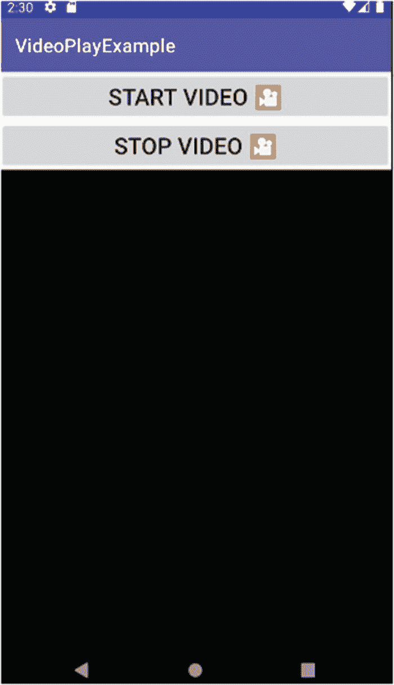
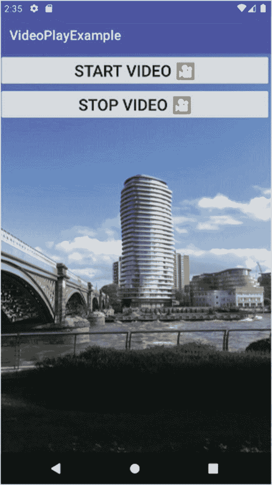
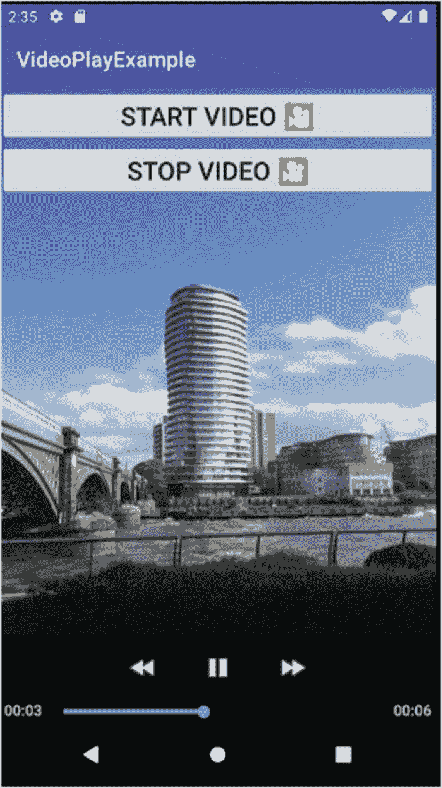
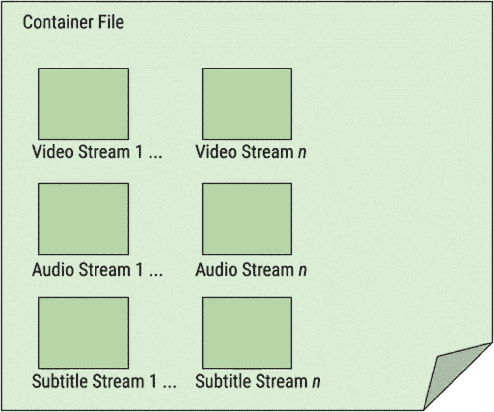

# Mobile Video Playback

近年来，移动设备使用增长最快的领域之一是视频。无论是在通勤时流式观看 Netflix 节目、在 YouTube 上追看猫咪的搞笑视频，还是使用基于视频的聊天和消息应用，视频在 Android 领域从未像现在这样占据核心地位。为你的应用添加视频功能非常简单，不过你也需要了解 Android 中关于视频的一些奇特且出乎意料的方面。

在本章中，我们将探讨为应用添加视频内容的最简单方式，然后花时间介绍更广泛的视频工具集——如果你打算认真对待 Android 视频开发，就应该掌握这些工具。在本书后续章节中，我们还将提到使用 Android 的 `ContentProvider` 机制进行视频播放的选项。

## 播放视频

与音频和声音一样，Android 提供了多种方式将视频播放功能引入你的应用。实际上，其中一些方式与你在前一章中已经接触过的类和框架相同，例如 `Media` 框架。视频播放有其独特的方面，其中最重要的是使用专用小部件 `VideoView`，它用于实际显示视频，控制视频在播放期间的某些行为，以及控制用户在播放过程中对视频的操作。

在 Android 中处理视频可以非常直接。虽然你可以构建复杂的层次结构，但从最基础的内容入手是理解视频播放过程中内部机制的好方法，同时也能让你熟悉那些更复杂方法所隐藏的基本构建块。

我们将通过一个示例应用来开始探索视频播放，你可以在 `Ch14/VideoPlayExample` 项目文件夹中找到它。

### 设计基于 `VideoView` 的布局

为了显示视频进行播放，我们需要一个带有 `VideoView` 对象的合适 Activity。清单 14-1 显示了 `VideoPlayExample` 应用的布局，其中就包含这样一个 `VideoView`。

```
Listing 14-1
Layout XML including VideoView object for VideoPlayExample
```

审视我们的布局，你会注意到我们有以下三个小部件：

1.  一个“Start Video”按钮，其 `android:id` 为 `startButton`，并且 `android:onClick` 属性设置为 `"onClick"`。
2.  一个“Stop Video”按钮，其 `android:id` 为 `stopButton`，并且 `android:onClick` 属性也设置为 `"onClick"`，与 `startButton` 相同。
3.  一个 `VideoView` 小部件，其 `android:id` 为 `video`。

我们使用了 `ConstraintLayout` 布局，并将 `startButton` 约束到父布局顶部（即 Activity 窗口顶部）。`stopButton` 被约束为与 `startButton` 底部对齐，而 `video` 的 `VideoView` 被约束为与 `stopButton` 底部对齐。在显示任何视频之前，最终的布局看起来很像图 14-1 中的图像。



**图 14-1** `VideoPlayExample` 应用的视觉布局

该布局特意设计得非常简单，以便更容易理解访问视频文件、播放视频等逻辑。考虑到两个按钮都使用了 `android:onClick="onClick"` 属性，你可能已经能猜到基本结构了。

### 在代码中控制视频播放

查看与布局配套的 Java 逻辑，你会立刻发现一个模式，它与我在第 13 章中介绍的音频和声音示例相似。正如我们在 `AudioPlayExample` 和 `AudioStreamExample` 应用中看到的那样，大部分控制逻辑都围绕着使用 `onClick()` 方法来驱动 Activity 行为。我们的 Java 代码如下，如清单 14-2 所示。

```
package org.beginningandroid.videoplayexample;
import androidx.appcompat.app.AppCompatActivity;
import android.net.Uri;
import android.os.Bundle;
import android.view.View;
import android.widget.MediaController;
import android.widget.VideoView;
public class MainActivity extends AppCompatActivity {
private VideoView vv;
private MediaController mc;
@Override
protected void onCreate(Bundle savedInstanceState) {
super.onCreate(savedInstanceState);
setContentView(R.layout.activity_main);
}
public void onClick(View view) {
switch(view.getId()) {
case R.id.startButton:
doPlayVideo();
break;
case R.id.stopButton:
doStopVideo();
break;
}
}
private void doPlayVideo() {
vv =(VideoView)findViewById(R.id.video);
mc = new MediaController(this);
mc.setAnchorView(vv);
vv.setMediaController(mc);
vv.setVideoURI(Uri.parse("android.resource://" + getPackageName() + "/" + R.raw.video_file));
vv.requestFocus();
vv.start();
}
private void doStopVideo() {
if (vv != null) {
vv.stopPlayback();
}
}
}
```

**清单 14-2** 视频播放的 Java 逻辑

> **注意**：此代码示例使用了一个名为 `video_file.m4a` 的视频文件。如果你因任何原因需要访问原始视频文件，可以从 `beginningandroid.org` 网站获取。

从我们的 `MainActivity` 开始，你会观察到我们创建了两个对象。第一个是 `VideoView` 对象，名为 `vv`，它将用于后续绑定到已加载布局的 `<VideoView>` 元素。第二个是 `MediaController` 对象，名为 `mc`，我们稍后会讨论它。`onCreate()` 重写方法执行了加载布局的基本操作，仅此而已。

接下来，你会看到 `onClick()` 方法，就像在音频示例中一样，它接受一个 `View` 作为参数，然后使用基于视图 `android:id` 的 `switch` 语句来判断哪个按钮被点击：`startButton` 或 `stopButton`。这与第 13 章示例中使用的模式几乎相同——你可以看出这是我觉得非常有价值且反复使用的模式！

如果检测到 `startButton` 是被点击的 `View`（按钮），则会调用 `doPlayVideo()` 方法。该方法首先通过使用现在已经很熟悉的 `findViewById()` 技术，并利用布局中 `VideoView` 持有的 `android:id` 为 `"video"` 的 `R.id.video` 样式表示，确保 `vv` 的 `VideoView` 对象绑定到 `VideoView` UI 小部件。

接着，我们实例化新的 `MediaController` 对象 `mc`，然后立即调用 `setAnchorView()` 方法。这会将 `MediaController` 绑定起来，并允许它在应用中使用时，呈现一组浮动控件，这些控件将显示在 `VideoView` 对象之上。当你运行 `VideoPlayExample` 应用时，你将能够看到其中一些控件。同样地，我们向 `VideoView` 指示，`mc` 的 `MediaController` 负责管理在 `vv` 的 `VideoView` 中显示的任何视频的播放某些方面。

调用 `vv.setVideoURI()` 会构建一个符合规范的 URI，该 URI 引用了一个名为 `video_file.m4v` 的视频，该视频已放置到项目的 `raw` 文件夹中。要查看完整形成的 URI 是什么样子，你可以在 Android Studio 中调试代码并设置断点。


将视频的 URI 传递给`VideoView`后，我们调用`requestFocus()`确保该小部件获得焦点，然后通过调用`start()`方法开始播放。假设一切按描述正常工作，你将看到视频开始播放，如图 14-2 所示（至少为静态截图）。



**图 14-2** `VideoPlayExample`在播放过程中的视频显示

我们逻辑的最后一部分是`doStopVideo()`方法，该方法响应`onClick()`方法检测到用户点击`stopVideo`按钮时被调用。在`doStopVideo()`中，我们首先检查确保`VideoView`对象`vv`已被实例化，然后调用其`stopPlayback()`方法。

除了我们非常基础、明确的控件外，如果你在播放过程中触摸`VideoView`边界内的任意位置，还能看到`MediaController`的浮动 UI 元素出现在视频上方。`MediaController`播放控件将如图 14-3 所示。



**图 14-3** 播放过程中显示的`MediaController`控件

## 理解关键视频概念

掌握了视频播放的基本机制后，你可以通过多种途径开始扩展你的视频技能库。你可以尝试活动和`VideoView`及`MediaController`视图对象的更多组合，以精确布局你期望的各种视频界面。你还可以将视频片段组合成更复杂的活动，例如应用程序或游戏中的过场动画开场序列。你还可以（也应该）并行采取的另一个途径是确保你对数字视频的基本方面有良好的基础，以便在构建 Android 应用时，能对内容、其大小、质量及用途做出良好决策。接下来，我们将涵盖你应该了解的关键概念。

### 比特率

我们在第 13 章讨论音频时引入了比特率的概念。从概念上讲，比特率代表了视频的同一方面——即在任何给定时刻可用于表示视频或视频帧各个方面的数据量。视频的比特率通常由至少两个因素组合计算得出。首先，视频的分辨率是多少？换句话说，是决定视频帧实际物理高度和宽度的水平及垂直像素密度。其次，在整体分辨率中，描述每个给定像素的颜色、色调和饱和度使用了多少位信息？一般来说，正如我们在音频中看到的，更高的比特率意味着更好的保真度，这通常会带来观看者感知到的更高质量。权衡之处也是一样的：更高的比特率占用更多存储空间，因为每个视频帧编码了更多信息位。这便引出了我们对帧率的讨论。

### 帧率

视频的帧率几乎不言自明。图像帧以何种速率显示，才能触发人类的视觉暂留效应，让我们以为画面在运动？Android 支持的大多数视频编解码器（下文讨论）默认设置为每秒 30 帧。对更低和更高帧率也有一定支持，但通常只在特殊情况下才会使用。

### 编解码器

与音频领域 Android 支持大量音频编解码器形成鲜明对比的是，在视频领域，Android 设备支持的视频编解码器和视频容器格式的列表相对有限。其原因涉及既得利益、专利法、行业卡特尔以及供应商和许可证持有者几乎从不把用户放在首位的可疑优先级，如同一团乱麻。

我稍后将对我认为的一系列驱动因素和约束条件发表看法，但以下是撰写本文时 Android 中视频编解码器支持的客观情况。现代 Android 设备及 Android 操作系统原生支持以下编解码器的视频播放：

*   **H.263**：由视频编码专家组开发，旨在成为一种低比特率压缩格式。
*   **H.264**（基线配置和主要配置）：旨在提高 H.263 的质量，同时降低比特率从而减小文件大小，近年来 H.264 一直主导着视频编解码器领域。
*   **H.265**：H.264 的继任者，也称为 HEVC 或高效视频编码方案。其设计者曾设想它将接替 H.264 成为最流行的编解码器，但其专利束缚意味着许多在线、媒体和技术公司寻求了不同路径，专注于像 AV1（下文讨论）这样的编解码器。
*   **MPEG-4 SP**：这是一种特定类型的编解码器，不要与容器格式 MPEG-4 混淆。你会发现一些声明为 MPEG 或 MPEG-4 的文件，实际上包含的是 H.263、H.264 或 H.265 编码的视频。它们声称是 MPEG 或 MPEG-4 是基于容器格式（其全称为 MPEG-4 Part 14），而非视频编解码器。关于此区别的更多细节请见下文。
*   **VP8**：由 On2 Technologies 创建，专门设计为一种用于现代场景的更高效率编解码器。当 On2 Technologies 被谷歌收购后，该编解码器被重新发布为开放、免版税的编解码器。
*   **VP9**：On2 Technologies VP8 编解码器的继任者，提供了更高的编码和解码性能。
*   **AV1**：近期由科技和媒体领域的多家公司合作开发。AV1 最大的卖点是其作为一种“无负担”格式可用，意味着无需为其使用向专利持有人支付版税。

这看起来可能是一份相当广泛的视频编解码器列表。实际上，这是一个非常有用的集合，将使你能够处理各种类型的视频。然而，当今使用的视频编解码器远不止这些，包括许多非常流行的编解码器，以及许多容器格式，而 Android 同样仅支持其中的一部分。大多数限制和不兼容性与技术无关，完全归因于专利和许可制度，以及来自电子、电影和娱乐等行业某些利益相关方的反复无常特性。

## 理解视频容器与子编解码器的复杂世界

为了更好地为你未来的视频开发做准备，深入探究视频容器、格式、编解码器和字幕的世界绝对值得，这样你就能了解视频的真正构成，以及你可能使用和分发的媒体内容中包含和不包含的内容。你认为的视频文件——即后缀如`.mp4`、`.m4v`、`.avi`、`.mov`、`.mkv`等文件——实际上是可能包含多个视频、音频和字幕资源的表示形式，被封装在一个容器中。容器术语用于指示文件的专有、行业标准或开放格式，这意味着文件的使用者可以找出视频内容、音频内容和字幕在文件中的位置。

图 14-4 直观地向你展示了一种视频容器格式及其包含的媒体。




