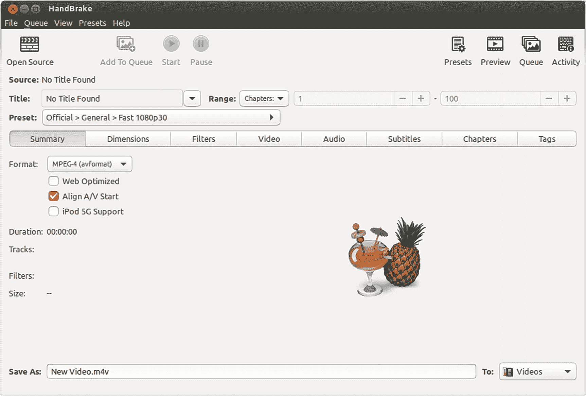
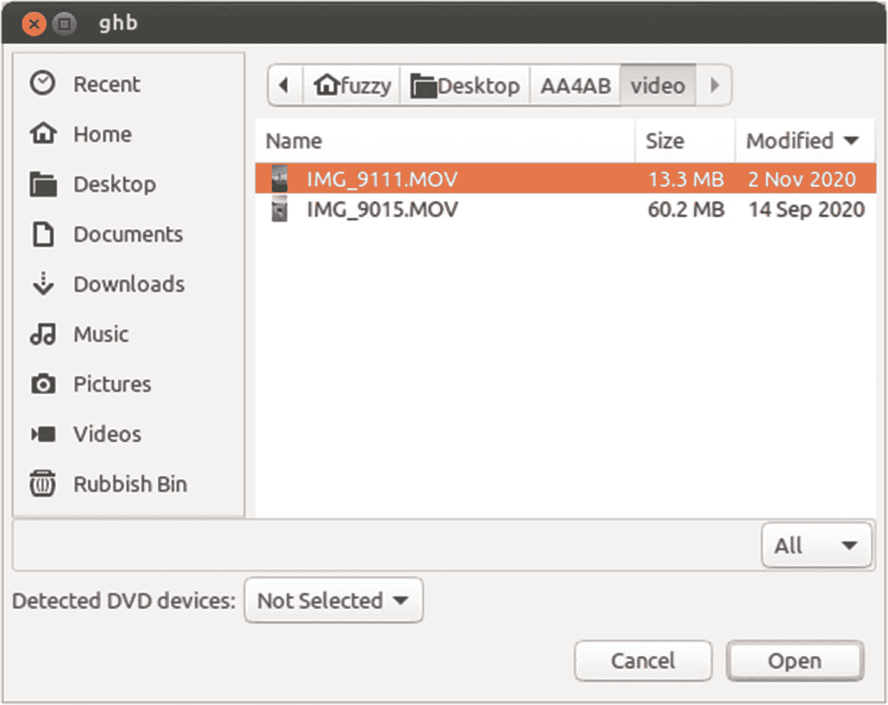
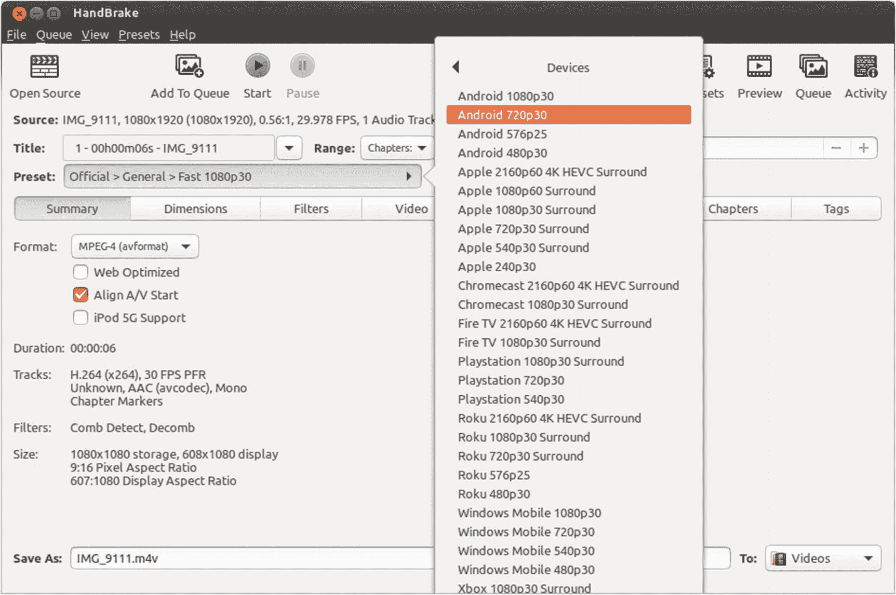

# 图 14-4  
视频容器格式的概念视图

如你所见，视频文件实际上是以下四个方面的组合：

1.  整体容器格式，Android 支持 MPEG-4 Part 14、Matroska、3GPP 和 WebM，但不支持 AVI 等其他流行容器。
2.  使用支持的编解码器（本章前面已概述）编码的一个或多个视频。
3.  使用支持的音频编解码器（第 13 章已概述）编码的一个或多个音频流。
4.  一个或多个字幕/标题资源。

这些因素的结合让身为热衷视频开发者的你处境更复杂一些。如果复杂性仅限于此，你或许会觉得处理这些因素还算得心应手。但还有另一个复杂之处，涉及 Android 在特定容器格式内支持的视频和音频编解码器组合。遗憾的是，事情并非普遍即插即用，你不能随意组合这里列出的选项。相反，你应该始终参考 Android 开发者参考文档中当前支持的组合，文档地址是 [`https://developer.android.com/guide/topics/media/media-formats`](https://developer.android.com/guide/topics/media/media-formats)。那么，当你遇到想在应用中使用却恰好使用了不受支持的容器、或想使用不受支持的编解码器或容器格式与编解码器组合的优秀视频素材时，该怎么办？问得好！在下一节中，我们将介绍一系列出色的工具，你可以考虑将它们添加到你的开发者工具包中，以提升视频内容创建、编辑和管理技能。

## 扩展你的开发者视频工具集

作为一名热衷的 Android 开发者，你很快会意识到像 `Android Studio` 这样的工具主要围绕编码、布局以及将代码转化为可运行应用的工作流程而设计。`Android Studio` 并未配备用于图形或视频创建、编辑等的高级工具，这意味着要拓展你的选项，你应该寻找那些在视频编辑等方面表现出色且能补充你 `IDE` 的工具。

### 审视你可用的视频编辑工具范围

在视频制作、视频编辑和视频内容管理领域，可供开发者选择的软件选项出奇地丰富。这些选项包括传统的本地安装软件，以及一些功能强大的工具的托管/云版本。

在决定采用哪种或哪些工具时，你需要问自己几个关于计划如何在应用中使用视频的问题，因为这会相应地影响工具的选择。需要问的一些关键问题如下：

1.  我是否会将视频嵌入到应用中——因此将其作为原始文件或资源文件包含在内——还是从在线源流式传输？
2.  我是否会自己创建和录制视频，还是使用其他来源的视频，仅仅整合以这种方式获取的内容？
3.  我是否需要管理一个视频或视频内容库，还是我的视频总量非常少，可以临时管理？
4.  我是否想要编辑、更改或修改视频以包含到应用中？

思考这些问题可以帮助你避免选择在你需要的领域并非强项的工具，更不用说通过挑选更适合你意图的工具，还可能帮助你节省金钱成本和开发者时间。我在下文概述了一系列当代流行的免费及商业工具，你应该亲自探索，并判断哪种或哪些工具最能满足你的需求。然后，我将介绍使用 `HandBrake`——一款非常受欢迎的免费开源工具——来处理你作为 Android 开发者会遇到的最常见的视频工作流程之一：为在 Android 上播放而编辑现有视频。

### 流行的开源视频编辑套件

这份开源工具列表并非详尽无遗，但涵盖了多种流行的视频编辑工具：

-   **FFmpeg**：一个功能极其强大的库和命令行工具集，适用于各种形式的视频编辑、转码等。FFmpeg 也常作为本书及其他地方提到的其他工具中完成繁重工作的引擎。
-   **VideoLAN VLC**：一个集视频播放、编辑于一身的万能工具，VLC 的优点是可以在包括 Android 本身在内的所有主流操作系统平台上使用。
-   **HandBrake**：一个单一用途、功能非常强大的工具。HandBrake 的主要目标是提供最好的视频转码工具。它在这方面做得非常出色——事实上，我们将在本章后面探讨它的用法。
-   **Kdenlive**：一个非常强大的视频编辑和管理套件，也是发展最成熟的套件之一。
-   **OpenShot**：比 Kdenlive 更新，但目标同样是提供全面的视频编辑和管理工具集。

### 流行的商业视频编辑套件

-   **Adobe Premiere**：作为 Premiere 的长期用户，我可以告诉你它功能丰富，并且与其他 Adobe 产品配合得相当好。但其定价往往让爱好者或早期开发者另寻他选。
-   **Final Cut Pro**：苹果主要的商业产品，一个非常强大的工具，但显然是专为 macOS 社区设计的。
-   **Lightworks**：一个用于严肃视频编辑和管理的专业工具，Lightworks 起源于电影行业，并且是该领域的实际标准。
-   **DaVinci Resolve**：一个较新且非常有趣的产品，Resolve 采用“Freemium”（免费增值）模式，入门级是免费的（而且非常好用），更高级的功能和能力则在付费版本中提供。
-   **Apple iMovie**：如果你拥有 Mac 电脑，那么你的购买中包含了捆绑的 iMovie 软件。虽然它面向家庭和消费者用途，但实际上它是一个很棒的产品，可以满足你初始的电影编辑和管理需求。显然仅限 Mac。

## 介绍用于视频编辑的 HandBrake

为了让你熟悉视频编辑的工作流程，让我们回顾一下你最可能遇到的最直接的任务，即从某种任意容器格式和视频编解码器，将现有视频转码为受支持的容器和编解码器，以便在你的 Android 应用中使用。这类工作中最出色的工具之一是 `HandBrake`，它就像是视频转码领域的瑞士军刀。其他工具也能出色地完成转码任务，但 `HandBrake` 是最容易掌握的工具之一。


### 下载与安装 HandBrake

我喜爱 HandBrake 的原因之一，是它支持所有主流操作系统。无论你使用的是 macOS、Windows 还是 Linux，都能在系统上运行原生版本的 HandBrake。请访问 HandBrake 官网 [`https://handbrake.fr/`](https://handbrake.fr/)，下载适用于你操作系统的软件包或软件包配置。在接下来的示例中，我们将使用 Ubuntu（Debian）Linux 安装，其中包含配置包管理器以便为你下载 HandBrake 的额外步骤。之后的步骤无论使用何种平台，基本完全相同。

在基于 Debian 的系统上，按照网站说明将 HandBrake 仓库添加到仓库配置中，然后运行：

```
sudo apt install handbrake-gtk
```

你也可以选择同时安装命令行版本，例如：

```
sudo apt install handbrake-gtk handbrake-cli
```

对于基于 RPM 的 Linux 系统（如 Fedora、CentOS、Red Hat 等），请使用等效的 `yum` 包管理命令。Windows 用户请使用可下载的安装程序来安装 HandBrake。macOS 用户请下载 HandBrake 的 `DMG` 镜像文件，双击挂载后，将 HandBrake 应用程序拖拽到“应用程序”文件夹中。

### 运行与使用 HandBrake

根据你的操作系统启动 HandBrake，你应该会看到如图 14-5 所示的主屏幕。



图 14-5 HandBrake 主屏幕

正如你所料，从主屏幕出发可以探索众多选项。为了演示 HandBrake 的关键功能，我们将选择一个现有的视频文件，将其转码为适用于 Android 的格式。选择文件时，请点击 HandBrake 窗口左上角的“Open Source”按钮。在我的例子中，我将选择从另一台设备捕获的文件，名为`IMG_9111.MOV`。文件选择器如图 14-6 所示——如果你按照这些说明操作自己的视频文件，源文件名显然会不同。



图 14-6 在 HandBrake 中选择要转码的源视频文件

HandBrake 最出色的功能之一，是能够自动识别源文件的容器格式、视频和音频的编解码器等信息。无需你指定任何这些输入参数——当然，你也可以根据自己的专业知识在 HandBrake 中进行覆盖调整。选择源文件后，你的主要任务是指示 HandBrake 将视频转码为基于 Android 支持的编解码器的格式，并将其打包到同样支持的容器格式中。HandBrake 在这方面表现出色，预装了一系列现成选项，只需点击几下即可满足 Android 要求的格式和编解码器支持。

要让 HandBrake 使用针对 Android 预配置的目标格式，请点击 `Preset` 字段右侧的右箭头。这将弹出一个包含 `General`、`Web`、`Devices` 等选项的菜单。选择 `Devices` 子菜单，将显示进一步的子菜单，类似于图 14-7 所示。



图 14-7 HandBrake 中 `Devices` 子菜单下的预配置选项

如图所示，这里为众多设备（不仅仅是 Android 设备）提供了许多预配置选项。我们需要在整体分辨率和帧率之间找到一个良好的平衡，以确保转码后的视频不会过大。在我的示例中，我选择了 `Android 720p30` 这个预配置选项，它将为我的转码视频自动设置以下属性：

1.  Android 支持的容器格式：此示例中为 MPEG-4 容器格式。
2.  Android 支持的视频编解码器：`Android 720p30` 预配置设置使用 H.264 作为视频编解码器。
3.  Android 支持的音频编解码器：AAC 将被用作音频编解码器。
4.  分辨率：视频每帧最多允许 720 条“逐行”扫描线（因此简称为 720p）。
5.  帧率：每秒 30 帧。

我将指定目标文件来保存转码后的视频，本例中命名为 `IMG_9111.m4v`。点击“Start”按钮开始转码，完成后，HandBrake 会显示一条俏皮的消息，告诉你放下咖啡，因为转换好的视频已经准备好了。在我的例子中，最终产品是一个大小为 1.1 MB 的视频文件，在 Android 设备上播放时画质依然非常好。这与 14 MB 的原始视频文件相比优势明显。

## Android 视频进阶

你可以通过查看本章开头介绍的 `VideoPlayExample` 应用，亲自体验我的示例视频转码效果有多好，以及视频播放的基本机制。我鼓励你在这个示例基础上进一步探索，以了解 Android 下视频的优势和挑战。首先，尝试替换为你自己的视频，包括你使用 HandBrake 或其他工具编辑和转码的视频。你可以开始用 `VideoPlayExample` 作为各种视频实验的简易测试工具，自行判断哪些方法适合你的应用。

第二件事是将 `VideoPlayExample` 改造为使用 URI 并流式传输其源文件。你可以从第 [13](https://www.beginningandroid.org/) 章的音频流式传输示例中复制相关逻辑，或访问本书网站 [`www.beginningandroid.org/`](http://www.beginningandroid.org/) 获取更多视频流播放的示例代码。

## 本章小结

在本章中，我们介绍了 Android 应用的视频世界，并展示了如何为你的应用添加基本的视频播放功能。你还了解到，在开发者工具包中添加其他视频编辑和创作软件，将极大地扩展你使用视频的能力。

