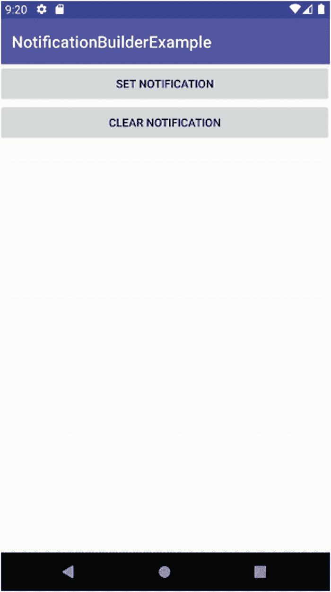
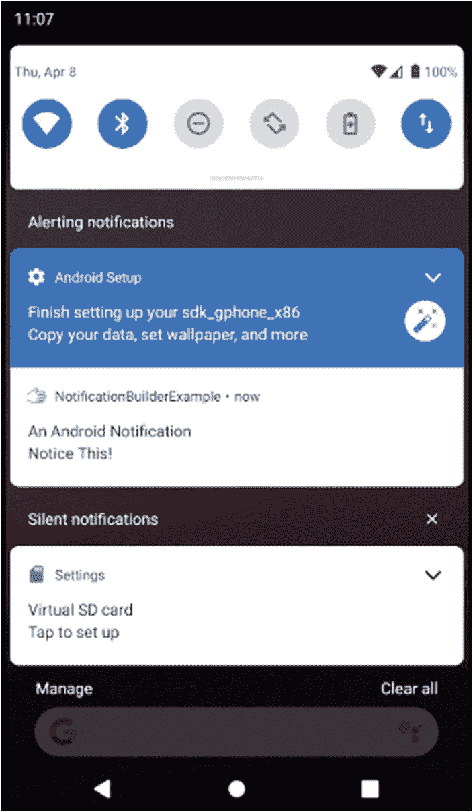
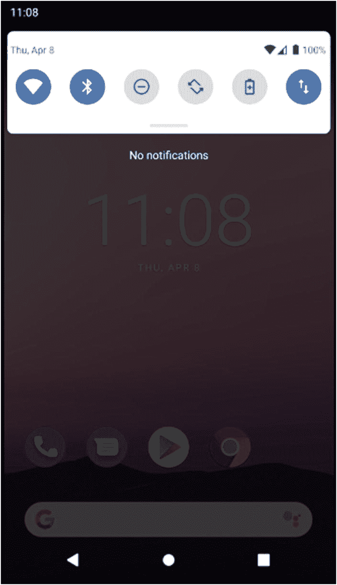
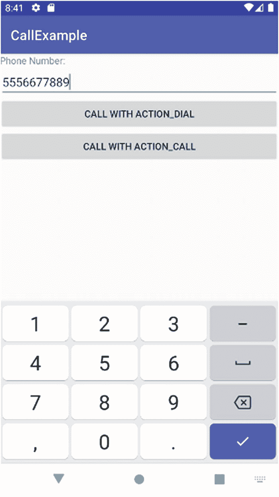
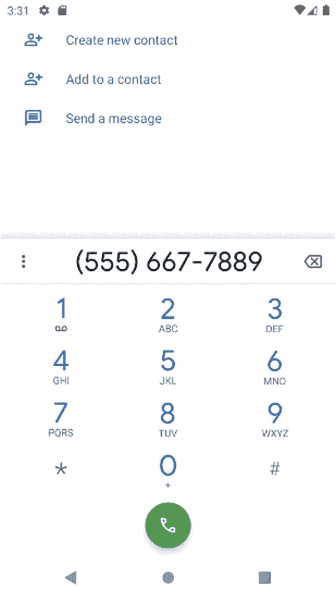
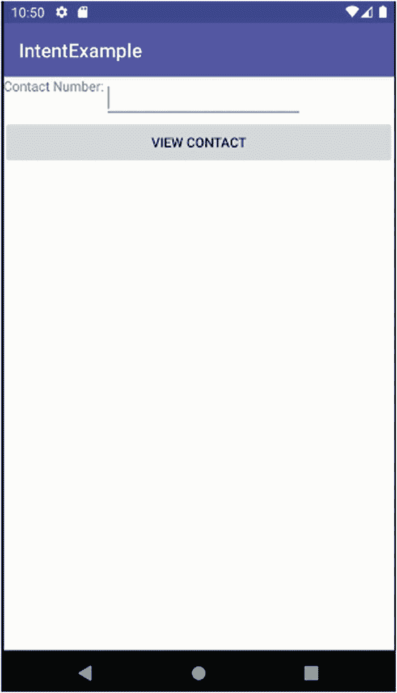
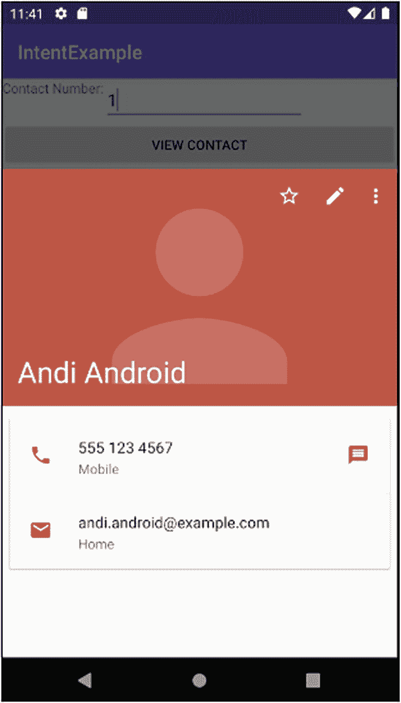

# 15. 通知简介

几乎历史上所有的操作系统都发明了一种机制来提醒你注意有趣、重要或紧急的信息。从“点赞”统计到电量不足警告，通知几乎是所有设备体验中无处不在的一部分。Android 提供了一个现代化的通知生态系统，并通过其通知框架中的一些非常实用的功能，将基础知识进一步拓展。

从手机到平板电脑再到车载娱乐系统，每台 Android 设备都拥有一系列通知机制，我们将在本章中对此进行探讨。如果你使用过 Android 设备，你应该对出现在屏幕顶部或锁屏上的托盘图标很熟悉。你可能也见过弹出式对话框通知，它们各有优缺点。

除了软件的通知功能之外，Android 还提供了各种硬件选项来协助通知的处理。无论是通过震动来增强传入通知的提示效果，还是通过触觉反馈来确保用户得到即时的触感回馈，Android 都通过一个全面的框架，为你的通知需求提供了统一的解决方案。


## 配置通知

在正常使用应用程序的过程中，它有许多方式来呈现新的或重要信息以吸引用户的注意力。有时发生了值得注意的事情，但用户已经离开应用，或者应用处于后台或暂停状态。对于像没有界面的服务这类应用，没有正常的面向用户的可见性，因此在需要引起注意时存在额外障碍。

Android 通过其 `NotificationManager` 系统服务来处理这些情况以及其他更多情况。你可以通过向 `getSystemService()` 方法调用传递一个结构适当的参数，在应用程序中获取 `NotificationManager`。这可以像以下代码片段一样简单：

```
getSystemService(NOTIFICATION_SERVICE)
```

调用 `getSystemService()` 将为你提供一个 `NotificationManager` 对象，然后你就可以访问它提供的通知管理方法。你将与 `NotificationManager` 对象一起使用的一些最常见方法包括：

1.  `notify()`：顾名思义，这是用于根据你认为需要用户注意的任何触发条件或情况来激活通知的方法。它接收一个 `Notification` 对象作为参数，该对象在有效载荷中包含通知的详细信息（文本、图像等），以及你选择的希望 Android 通知基础设施提醒用户的方式。

2.  `cancel()`：使用此方法取消通知。Android 也可以响应用户的某些操作（例如“滑动以消除”等手势）来取消通知。

3.  `cancelAll()`：这是最终选择！当你想要清除 `NotificationManager` 对象激活的所有通知时，只需调用 `cancelAll()`。

## 使用通知对象自定义通知

在通知用户方面，Android 的默认通知行为能够胜任你想要的绝大多数事情。但有时，你想更进一步，真正寻求用户的关注。`Notification` 对象提供了增强和自定义通知的方法。

### 了解增强通知的旧方式和新方式

通知随着 Android 的发展而演变，因此存在原始（旧）方式，即使用单独的额外方法来调整和增强你的效果，以及更新的方式，即使用 `NotificationBuilder` 对象一次性完成所有自定义。我将展示这两种方法，并指出，如果你的目标版本是 Android 7 之前的旧版本，那么旧方法更可能满足你的需求。

## 为通知添加声音

让我们从较旧的传统方法开始探索通知，特别是 Android 对多种不同类型通知的声音支持。通过利用基础 Android 层的一系列用户可配置的声音，如果你不想自己管理音频资源，就可以避免这样做。你可以通过调用 `.defaults()` 方法让 `Notification` 对象使用设备的默认声音（无论用户是否配置），如下所示：

```
Notification myNotification = new Notification(...);
myNotification.defaults = Notification.DEFAULT_SOUND;
```

你可以更进一步，通过使用指向音频资源的 `Uri` 引用（无论是你提供的原始文件或资源管理文件，还是 Android 捆绑的众多声音之一）来提供自己的声音。

下面的示例展示了如何使用 Android 自带的“Kalimba”声音，通过 `ContentResolver` 类获取此资源的 `Uri` 并相应地分配声音：

```
Notification myNotification = new Notificiation(...);
myNotification.sound = Uri.parse(ContentResolver.SCHEME_ANDROID_RESOURCE +
"://" +
getPackageName() +
"/raw/kalimba");
```

由于有多种触发通知的机制，因此了解存在优先级层次结构很重要。任何通过 `.sound()` 分配的语音通知（或其他使用其相关方法的通知形式）将被通过 `.defaults()` 方法设置的任何等效设置覆盖，前提是该调用包含通知类型的参数，例如用于声音的 `DEFAULTS_SOUND` 标志。无论你调用这些方法的顺序如何，都会发生这种情况。

在 Android 较新的通知世界中，你通过构建一个 `NotificationBuilder` 对象来设置诸如你想使用的声音等属性，然后在设置完所有所需属性后，最终让 `Notification` 使用该 `NotificationBuilder`。使用新方法设置声音的等效操作如下所示：

```
Notification.Builder myBuilder = new Notification.Builder(this, ...)
myBuilder.setSound(Uri.parse(ContentResolver.SCHEME_ANDROID_RESOURCE +
"://" +
getPackageName() +
"/raw/kalimba"));
```

## 使用设备灯光进行通知

很少有 Android 手机或平板电脑缺乏内置 LED 灯作为前置显示屏的一部分。这种灯光可用于多种用途，包括作为通知用户的另一途径（而不只是让您忠实的作者我在凌晨 3 点保持清醒）。可以通过基于 `Notification` 对象的配置进行设置，以多种方式控制 Android 设备的内置灯光：

1.  当向 `.lights()` 方法传递布尔值 TRUE 时，它会激活 LED。
2.  在支持的设备上，你可以通过 `ledARGB` 参数和与你想要使用的 RGB 颜色匹配的十六进制代码来更改 LED 的颜色。
3.  使用 `ledOnMS` 和 `ledOffMS` 值（以毫秒为单位表示开启和关闭时间）使灯光闪烁和循环。

对于使用 `Notification.Builder` 的较新 Android 版本，等效的方法是 `.setLights()`。你可能能开始猜测如何从直接使用基础 `Notification` 对象的旧方法推断出使用构建器模式的新方法，反之亦然。

**注意：** `Notification.Builder()` 方式是在 Android 8 中引入的，并且旧的样式已弃用。对于 API 级别高于 24 的情况，你应该始终使用 `Notification.Builder()`，并让 Android 的兼容性库处理旧版本上的行为。

除了你想使用的特定通知特效之外，请务必设置 `Notification.flags` 字段以包含 `Notification.FLASH_SHOW_LIGHTS` 标志。在使用单色 LED 的基本设备上，你可能会发现你的颜色选择不适用，设备会改变 LED 的亮度。对于具有支持多色输出 LED 的设备，如果制造商没有包含必要的智能功能使 `Notification` 类能够控制颜色，则在小部分情况下也会发生这种情况。还有某些设备没有用于通知的 LED，例如电视、Android Auto 系统以及一些 Android 的嵌入式用途。鉴于这种多样化的设备格局，你应该将闪烁 LED 通知视为一种锦上添花的手段，而不是一种关键的吸引注意力的方法。

## 振动吧！

你的用户拥有的感官不仅仅是你可以利用来吸引他们注意力的视觉和听觉。当闪烁的灯光和引人注目的声音不够时，你可以转向振动（双关语）。Android 的原始通知模型包含一个默认标志，允许使用设备范围的默认设置来振动：

```
myNotification.defaults = Notifcation.DEFAULT_VIBRATE;
```

较新的通知方法使用 `Builder` 对象上的 `.setVibrate()` 方法来达到相同的效果。

要使任何基于振动的通知实际触发物理振动，你需要在清单文件中添加以下权限：

```


当默认振动不够时，你可以通过 `.vibrate()` 和 `.setVibrate()` 方法执行自定义振动，提供一个以毫秒为单位的 `long[]` 值，例如：

```
new long[] {1000, 500, 1000, 500, 1000}
```

是一个有效的序列，会触发三次各一秒的振动，每次振动之间有半秒的间隔。

## 为通知添加图标

我们之前介绍的通知方法旨在及时吸引用户的注意。Android 还提供了使用图形（图标形式）的功能，以便为用户提供关于通知的更多信息和上下文。图标是图像文件，在 Android 的资源管理中视为可绘制对象（drawable）。你需要提供一个 `contentIntent` 值，该值在用户点击你在通知中提供的图标时作为 `PendingIntent` 传递。这个 `PendingIntent` 作为一个占位符和延时函数，允许提前准备一个 `Intent`，以便稍后由活动或其他技术触发。

### 理解 `PendingIntent`

`PendingIntent` 是 Android 使用的一种机制，用于提前向设备上运行的其他应用或服务传递令牌或权限。通过 `PendingIntent`，接收方应用可以在未来的某个时间点——无论你的应用本身是否正在运行——从你的应用中执行选定的代码片段，并使用你应用的权限来完成此操作。

除了能够添加你选择的图标和相关的 `contentIntent`，你还可以使用 `tickerText` 属性添加简短的文本描述。这段文本应包含你希望用户看到的最重要的通知内容，例如发送消息的联系人姓名、电子邮件主题、社交媒体帖子的标题等。`setLatestEventInfo()` 方法允许你在一次调用中指定 `icon`、`contentIntent` 和 `tickerText` 这三个属性。无论你使用哪种通知模型（旧版或新版），这种 `PendingIntent` 方法都适用。

### 不同 Android 版本的图标尺寸

添加图标使你可以根据所需的艺术水平定制图标，但需要注意各种 Android 版本，因为这会影响支持的图标图像分辨率。为了最大程度地支持 Android 设备及其相关的通知样式和尺寸，你应至少创建四个代表图标的可绘制对象：

1.  一个 12x19 像素的边界框，内含一个 12x16 像素的方形图标，用于低密度屏幕。此图标应放置在 `res/drawable-ldpi-v9` 项目文件夹中。
2.  一个 16x25 像素的边界框，内含一个 16x16 像素的方形图标，用于中密度屏幕。此图标应放置在 `res/drawable-mdpi` 文件夹中。
3.  一个 24x38 像素的边界框，内含一个 24x24 像素的方形图标，用于高密度、超高密度和超超高密度屏幕。此图标应放置在 `res/drawable-hdpi-v9`、`res/drawable-xhdpi-v9` 和 `res/drawable-xxhdpi-v9` 文件夹中。
4.  一个 25x25 像素的方形图标，适用于所有 2.3 版本之前的 Android 设备（无论这些旧设备的实际屏幕密度如何）。此图标应放置在 `res/drawable` 资源文件夹中。

这些变化会随着时间而改变，Android 支持不同分辨率的建议方法也是如此。因此，请务必查看 Android 开发者网站上关于图标样式的详细信息。该网站包含一些有用的信息，涉及在你决定不提供或无法提供应用所需的任何预期保真度级别时，如何向上和向下缩放可绘制对象。如果你跳过了其中某个图标也不必惊慌，但要注意 Android 会尝试缩放你提供的其他图标来填补空缺，而最终屏幕上的图像效果可能并不理想。

### 浮动数字以增加信息

通知还有最后一个你可能已经见过并可能依赖的变体：应用启动器图标上的浮动数字。它提供了针对该应用的相似通知或未读/未响应通知的计数。通过设置 `Notification` 对象的公共数据成员 `number`（你可以将其设置为任意数字），即可实现该浮动数字功能。该数字将作为叠加层显示在应用启动器图标的右上角或左上角（取决于区域设置和设备的从右到左或从左到右惯例）。默认情况下，该值未设置，Android 会忽略它，除非你为 `number` 设置了一个值。

### 在 API 级别中引入通知渠道

随着 API 26 的出现，Android 摒弃了所有应用和服务共用通知空间的概念，并引入了渠道（channels）的概念。渠道的目标是允许用户（以及隐式地允许应用）将通知分组和分区到不同的组中，然后对这些组进行差异化处理。一个典型的用例是，将某些通知视为信息性通知，在“正常”时间显示，但在用户指定免打扰时段时隐藏。其他通知可以分配到“紧急关注”或“紧急情况”渠道，并以不同方式处理。由于 Google 不断调整和改变通知格局，渠道概念在实际应用中并未完全普及。然而，作为开发者，如果你在使用 Android 9.0、10.0、11.0 或更高版本的新设备上使用任何形式的通知，都需要考虑这一点。本章后面的 `NotificationBuilderExample` 展示了定义和使用渠道，以及处理新旧 API 级别下的新旧 Android 设备行为是多么简单。

### 通知的实际应用

你已经了解了 Android 在多个版本中一直依赖的原始且仍然有用的通知概念。让我们在 `NotificationBuilderExample` 应用中看看通知的实际使用情况，该应用位于 `ch15/NotificationBuilderExample` 项目文件夹中。

我使用了一个简单的布局，为节省空间，此处省略其 XML。你可以在图 15-1 中看到 UI。



**图 15-1** 基本的 `NotificationBuilderExample` 布局，未显示任何通知

### 支持创建通知的逻辑

`NotificationBuilderExample` 的核心是用户与 UI 交互时，将用户通知变为现实的代码，如列表 15-1 所示。


虽然代码量不小，且附带的`NotificationFollowon`类也是如此，但其中大部分内容你应该已经熟悉。在`onCreate()`中设置 Activity 时，执行了恢复或创建状态、填充布局等常规任务，此外还创建了`myNotifyMgr`对象以绑定系统通知基础设施。`NotificationBuilderExample`类本身还为通知设置了一个虚拟 ID，并用一个计数器来跟踪有多少待处理的通知。请注意，你可以轻松决定从你的应用程序发送多种不同类型的通知。如果你决定这样做，请务必使用不同的 ID 来区分每种类型。

`onCreate()`中的另一个主要逻辑部分执行了必要的 SDK（API）级别检查，以确定是否需要使用通知通道来向用户显示所需的通知。如果 SDK 版本处于或高于强制使用通知通道的级别，我们会检查`MYCHANNEL`是否存在（`null`比较），如果它尚不存在，则实例化它以供使用。如果它已存在，则无需额外工作——例如，如果我们已经使用过该应用程序，并且在至少触发一次通知后让它保持运行状态。

`onClick()`方法是我用来将按钮点击处理分组在一起的常见模式——尽管在这个例子中，你也可以让每个按钮直接调用相关的`raiseNotification()`和`dismissNotification()`方法。正是这些方法的实现包含了我们有趣的逻辑。

在`raiseNotification()`方法中，我们执行了本章开头描述的几乎所有可选配置和自定义。首先，我们创建一个指向`NotificationFollowon` Activity 的`PendingIntent`。如果用户决定点击通知抽屉中的挥手图标，此意图将被触发。

接下来，创建`Notification`（或本例中的`NotificationCompat`）的`Builder`对象，并将由此构建器实例生成的任何结果通知分配到`onCreate()`方法中设置的`MYCHANNEL`通道。

然后，我们进入使用`myNotifyBuilder`对象的核心部分，为最终要构建的`Notification`对象添加许多通知“附加功能”：

1.  调用`.setTicker()`来提供一些滚动条文本。
2.  调用`.setNumber()`来增加通知已被触发的次数。
3.  调用`.setSound()`并传入`pop.mp3`声音文件作为来自`raw`文件夹的资源。
4.  调用`.setVibrate()`，设置振动模式为响 1 秒、停半秒。
5.  调用`.setAutoCancel()`来禁用自动取消选项。

配置完所有选项后，我最终将构建的当前状态传递给`myNotification`对象，然后将这个`Notification`和`NOTIFICATION_ID`传递给`NotificationManager`，以便呈现给用户。

**从用户视角看通知**

在虚拟设备上运行`NotificationBuilderExample`应用程序可以提供大部分的通知体验（振动往往是 AVD 处理得不好的一个方面）。图 15-2 显示了通知出现在主屏幕的图标栏中。


**图 15-2**
在左上角触发的通知——小小的挥手图标


如果你仔细观察，就会在屏幕顶部看到一个小挥手图标。如果在打印（或屏幕）页面上难以看清，请务必亲自运行示例，看看它是否出现在你自己的虚拟设备中。根据你的 AVD 所支持的 API 级别，你可能会或可能不会看到与 `Notification` 对象关联的附加状态文本。点击 `Clear Notification` 按钮会使图标消失，如果你在提示音还在播放或真实设备仍在振动时足够快地点击它，那些额外的自定义设置也会停止。

通知会在 `NotificationBuilderExample` 活动的整个生命周期内持续存在，甚至在你将其发送到后台以使用其他应用或返回启动器主屏幕后仍然存在。亲自尝试一下，你仍应看到通知图标，如图 15-3 所示。


**图 15-3** 即使离开活动，通知图标仍然存在

一旦通知触发，并且在之后的任何时刻，用户可以访问通知抽屉，该抽屉会收集设备上所有应用的所有通知（如果使用足够新的 API 级别和兼容设备，还可能通过渠道对它们进行分组）。在 Android 中，你可以通过“抓住”屏幕顶部的栏并将其一直拖到底部来打开通知抽屉。在图 15-4 中，你可以看到示例通知及其我添加的附加详情，包括通知标题和附加文本。



**图 15-4** 通知抽屉打开，显示我们的通知

你在通知抽屉中看到的内容直接取决于正在使用的 Android 版本。前面图示中的示例来自 Android 10.0 AVD 实例，我们的图标是从适当的屏幕密度资源中选择的，或者从与应用打包的最接近可用资源缩放而来。我们 25x25 像素的挥手图标在通知抽屉中更容易识别。标题和附加文本会与创建时传递给 `Notification` 对象的时间戳一起显示。

你还会注意到，在较新版本的 Android 中，通知抽屉中显示的是数值，而不是作为图标栏中图标上的叠加层。Google 对 Android 做出这一更改是为了处理开始涌入较小手机屏幕图标显示中的杂乱信息。通过将数字移至通知抽屉，人们的启动器屏幕变得不那么拥挤。

用户可以点击图标触发后续活动，或者直接清除通知——就像他们在活动主屏幕上点击了 `Clear Notification` 按钮一样。在最近的 Android 版本中，你会在通知下方看到三个略微偏移的水平条，这是 `Dismiss All`（全部清除）选项。甚至更新的 Android 版本会在通知抽屉底部显示“清除全部”和“管理”选项。在我们的示例中，无论你选择哪种清除方式，都会在所有活动的 `NotificationManager` 对象上触发 `cancelAll()` 方法，从而完全清除通知抽屉中的内容。

一个完全清空的通知抽屉看起来就像图 15-5 中描述的那样。



**图 15-5** 设备上的所有通知已被清除

请注意，以这种方式清除通知不一定会清除你可能在应用中跟踪的通知计数。请记住，即使你已经切换到其他应用，Android 也不一定会触发 `onDestroy()` 或回收应用的资源。

## 总结

现在，你已经对 Android 可用的通知系统有了扎实的理解，并获得了使用通知的经验。还有一些更高级的主题可以扩展通知及其用途，你可以在本书的网站 [www.beginningandroid.org](http://www.beginningandroid.org) 上找到它们。这些高级通知主题包括时间线通知、针对相关通知组或集合的捆绑通知、可展开通知，以及适用于 Wear OS 和 Android 嵌入式用途（如 Android Auto）的专用通知类型。

---

# 16. 使用通话探索设备能力

结合我们在本书中已经涵盖以及将在后续章节中涵盖的所有想法，很容易一头扎进只处理 Android 提供的出色软件平台的各种应用开发中。事实上，这非常容易，以至于你常常忽略了作为 Android 开发者所拥有的另一个巨大机会：同时使用 Android 硬件。

在本章中，我们将非常简要地介绍如何开始使用设备能力——具体来说，是通话和传感器。这将会非常简短，但应该能为你提供一个起点，让你能继续独立学习更多关于硬件能力的知识。

## 掌控通话

Android 从早期专注于手机的阶段已经走过了很长一段路。正如我在第 1 章中概述的那样，随着现在使用 Android 的设备数量和形态的激增，提前思考你的应用如何以及为何需要添加电话支持，以及它如何适应没有“电话”的环境和设备，是很有价值的。

### 指定电话支持

要向 Android 表明你的应用需要访问与电话功能相关的硬件特性，你应该将以下硬件需求条目添加到你的 `AndroidManifest.xml` 文件中：

```
android.hardware.telephony 特性表明你的应用需要蜂窝网络访问和支持，
意味着可以提前引导用户判断该应用是否适合他们的设备，
例如在 Google Play 上搜索或下载应用时。
```

### 使电话支持变为可选

如果你觉得将整个应用完全取决于是否拥有蜂窝网络访问权限有点极端，那你是对的。当你考虑构建一个应用，其中电话访问是锦上添花而非硬性要求时，你可以利用一些技术，在应用运行时检查电话支持，并同时处理拥有和无法访问蜂窝硬件这两种情况。

Android 使用 `PackageManager` 类来帮助检测各种硬件，从加速度计和麦克风，一直到电话硬件相关的能力。最常见的方法是使用 `hasSystemFeature()` 方法，如清单 16-1 中的伪代码片段所示。

```
PackageManager myDevice = getPackageManager();
if (myDevice.hasSystemFeature(PackageManager.FEATURE_TELEPHONY) {
    // 用户的设备支持电话功能
    // 在此处添加与通话相关的逻辑
} else {
    // 用户的设备不支持电话功能
    // 执行不需要拨打电话的操作
};
```

**清单 16-1** 一个展示检测蜂窝硬件访问的代码片段

你还可以检查电话支持的其他有用方面，例如网络类型和语音实现方式，例如 VoLTE、LTE、GSM、CDMA 等。


## 拨打电话

既然你已经掌握了判断设备是否需要或适合支持通话功能的机制，就可以开始在应用中使用它来实现有趣的功能了。值得庆幸的是，Android 让这一切变得非常简单，这得益于其作为智能手机操作系统的根基——核心功能就是电话。

Android 在拨打电话及其他通信功能方面非常便捷，访问和使用这些功能的核心类是 `TelephonyManager`。顾名思义，`TelephonyManager` 负责管理通话及相关任务，包括呼叫处理、通话状态、网络详情等。你通常会用到以下方法：

1.  `getPhoneType()`：返回手机和网络的相关信息，包括对 GSM、LTE 等无线网络的支持情况。
2.  `getNetworkType()`：提供当前连接的蜂窝网络的数据能力信息，有助于判断网络类型，如 LTE、4G、3G 及其他变体。
3.  `getCallState()`：一个非常实用的方法，可以帮助你判断手机处于空闲状态（未通话）、通话建立状态还是正在通话中——即通常所说的“摘机”或“offhook”状态。

要实际拨打电话号码并开始通话，你需要调用 `ACTION_DIAL` 或 `ACTION_CALL` 中的一个 Intent。这些方法的使用及区别将在稍后介绍。两种方法都有一个共同起点，即一个包含 `Uri` 的 Intent，该 Uri 以 `tel:`*nnnnnnnn* 的字符串格式表示用户想要呼叫的号码。在 Uri 字符串中，*nnnnnnnn* 代表要拨打的电话号码的数字。通过实际演示，拨打电话的步骤将变得清晰。

## 注意事项

在发起任何新通话之前，最好先检查当前的通话状态。Android 提供了一系列选项来同时处理多个呼入和呼出电话，但这属于高级蜂窝通信管理的范畴，超出了本书的讨论范围。现在，请善用 `getCallState()` 方法，并根据其返回的结果来决定你的操作。

## 设计 CallExample 应用界面

一个可运行的拨号应用示例可以在 `Ch16/CallExample` 项目中找到。该项目采用非常简洁的布局，让你专注于它所展示的呼叫和拨号功能。首先，你可以看到清单 16-2 中使用的布局。

```
清单 16-2
CallExample 应用的布局
```

查看布局中指定的字段，你会看到 `TextView` 和 `EditText` 的组合，`EditText` 作为用户输入目标号码的输入字段。还有两个按钮，分别是 `"使用 ACTION_DIAL 拨号"` 和 `"使用 ACTION_CALL 拨号"`，顾名思义，它们会触发相应的方法，发起对应类型的 Intent，从而拨打电话。

图 16-1 显示了最终的渲染效果。



*图 16-1 用于拨打用户指定号码的 CallExample 布局*

除了展示通话功能所需的部分外，我特意在这个布局中加入了一些新特性——我们先来处理这些。为了增加一些变化，我将此布局基于 `LinearLayout`。你会看到 ID 为 `phonenumber` 的 `EditText` 视图包含一个 `inputType="number"` 属性。这会触发 Android 修改该视图的输入法参数，使其只允许输入数字和有限的标点符号。运行应用时你会看到这一效果，因为用于输入的虚拟键盘（即输入法编辑器 IME）看起来更像一个电话拨号盘，而不是全尺寸键盘。

### Android 输入法框架

Android 提供了一个非常强大的抽象层来处理用户输入，使其能够灵活地兼容物理键盘、屏幕上的软键盘，甚至手写识别硬件和软件。这就是输入法框架。当你使用任何触发用户输入的视图时，你都会隐式地与框架交互，系统会呈现一个默认的编辑器视图——即 IME。你可以使用默认配置，并按我们在电话拨号示例中的方式进行配置，也可以针对其他常见情况（如日期输入）进行配置。你还可以自定义任何 IME，以添加或限制编辑器中可供用户“按下”的“按键”或值。你可以在本书网站 [`www.beginningandroid.org`](http://www.beginningandroid.org) 上阅读更多关于输入法框架和 IME 的信息。

`usedialintent` 和 `usecallintent` 按钮的 ID 明确暗示了点击每个按钮后会发生什么。使用第一个按钮 `"使用 ACTION_DIAL 拨号"` 将执行触发 `ACTION_DIAL` Intent 的代码路径，而 `"使用 ACTION_CALL 拨号"` 则会触发 `ACTION_CALL` Intent。我们将在第 17 章更详细地讨论 Intent，但现在，这两者有什么区别呢？

使用 `ACTION_DIAL` Intent 时，Android 会收到通知，需要向用户显示一个 IME，以便在启动后台的通信魔法之前，让用户确认（或调整）要拨打的号码。你可以在本章后面的图 16-2 中看到这一点。而在另一种情况下，触发 `ACTION_CALL` Intent 会立即使用 Uri 中提供的号码发起通话，无需任何额外的用户界面或确认。



*图 16-2 触发 ACTION_DIAL 的 CallExample 应用*

这两种不同方法存在的原因有很多，但主要的一点是，通过 `ACTION_DIAL`，确保用户知晓通话即将发起，并让他们对整个过程拥有控制权。考虑到这是 Android 内置的、可能会让用户花费真金白银的功能之一，这一点非常重要。在某些地方拨打电话很便宜，但在许多国家和地区，这仍然是一笔不小的开销。

由于 `ACTION_CALL` 会立即发起通话，而没有 `ACTION_DIAL` 提供的确认步骤，Android 为 `ACTION_CALL` 提供了一种保护措施：要求应用在使用 `ACTION_CALL` Intent 调用 `startActivity()` 之前，在其清单中声明 `CALL_PHONE` 权限。请注意，`CALL_PHONE` 权限因其被滥用的可能性而被视为最高级别的权限，因此不仅需要在应用清单中包含此权限，而且在运行时，系统还会提示用户允许应用拨打电话。可以说是深度防御。

## CallExample 应用的工作逻辑

了解了拨号选项，并有了一个简洁的布局可供用户使用后，现在来看看实现拨号功能的逻辑。清单 16-3 展示了将逻辑嵌入到 `CallExample` 应用中的 Java 代码。


```java
package org.beginningandroid.callexample;
import androidx.appcompat.app.AppCompatActivity;
import android.content.Intent;
import android.net.Uri;
import android.os.Bundle;
import android.view.View;
import android.widget.EditText;
public class MainActivity extends AppCompatActivity {
@Override
protected void onCreate(Bundle savedInstanceState) {
super.onCreate(savedInstanceState);
setContentView(R.layout.activity_main);
}
public void callWithActionDialIntent(View view) {
EditText targetNumber=(EditText)findViewById(R.id.phonenumber);
String dialThisNumber="tel:"+targetNumber.getText().toString();
startActivity(new Intent(Intent.ACTION_DIAL, Uri.parse(dialThisNumber)));
}
public void callWithActionCallIntent(View view) {
EditText targetNumber=(EditText)findViewById(R.id.phonenumber);
String callThisNumber="tel:"+targetNumber.getText().toString();
//the following intent only works with CALL_PHONE permission in place
startActivity(new Intent(Intent.ACTION_CALL, Uri.parse(callThisNumber)));
}
}
代码清单 16-3
CallExample 应用程序的 Java 逻辑
```

在本例中，我转变了通常的做法：不再通过单一的`onClick()`方法，并利用 switch 语句根据传入的视图参数来引导后续执行，而是分别从布局配置中为每个按钮直接调用了`callWithActionDialIntent()`和`callWithActionCallIntent()`方法。每个方法都执行一些相似的处理：首先确定用户在哪个`View`（此处是`EditText`）中输入了所需的电话号码，然后以适当的格式创建`Uri`字符串，最后调用`startActivity()`，传入所需的意图和`Uri`作为参数。

### 发起 ACTION_DIAL 通话

在图 16-2 中，您可以看到用户点击`useDialIntent`按钮的结果。在`callWithActionDialIntent()`方法内部，`EditText`字段中的数字（如果有的话）已被构建成一个`Uri`，并触发了`ACTION_DIAL`意图。图 16-2 中显示的拨号器与图 16-1 中显示的 IMEI（输入法编辑器）看起来相似但不完全相同。您应该注意到的关键差异不仅包括数字的样式、配色方案等略有不同，还包括新增的选项，例如将此号码添加为联系人的功能。您可能已经猜到，这是通过触发另一个意图实现的。您还会看到数字及其相关标点符号（如连字符和括号）的格式差异。这些都将根据设备的位置和语言设置进行样式化。图 16-2 中视图所使用的我的 AVD 采用的是美国区域设置和英语语言，因此您看到的格式将前三位数字视为区号并置于括号内，以及数字的连字符用法，这在美国和加拿大是惯用做法。最后，也是最重要的，显示屏底部增加了一个绿色的电话软按键，您可以猜到这是用来实际发起通话的。

### 发起 ACTION_CALL 通话

使用`usecallintent`按钮触发通话会向您展示——嗯，它会向您展示——Android 中的拨号屏幕，此外没有更多内容。上一个示例中的拨号器没有被触发，因此几乎没有其他内容可展示或解释。您的用户将直接进入“实际拨打电话”的拨号屏幕，如图 16-3 所示。


图 16-3
使用 ACTION_CALL 进行通话

### 处理来电

处理来电比接听电话要复杂得多，并且超出了本书的范围。但完全接管来电并不总是必需的，即使您的应用程序不是处理通话管理这一主要任务的应用，当有电话呼入时，您也可以让您的应用程序执行其他有用的操作。

让辅助应用程序响应来电的主要方法是在`AndroidManifest.xml`文件中为广播意图`ACTION_PHONE_STATE_CHANGED`注册一个广播接收器。我们将在下一章更深入地探讨广播接收器。目前，只需知道当有电话呼入时，`TelephonyManager`框架会触发`ACTION_PHONE_STATE_CHANGED`意图就足够了。代码清单 16-4 说明了您清单文件中的接收器声明。

```
代码清单 16-4
在 AndroidManifest.xml 中设置来电接收器
```

当有电话打入设备时，`TelephonyManager`会触发该意图，任何接收器（包括您的接收器）都会通过回调到各自指定的方法而被通知。`ACTION_PHONE_STATE_CHANGED`意图还可以包含两个可选的数据片段，您可以用它们来驱动您的逻辑。一个是通话的状态值，例如`CALL_STATE_OFFHOOK`（通话已摘机）或`CALL_STATE_RINGING`（电话仍在响铃等待接听）。如果使用了`CALL_STATE_RINGING`值，还有一个可选的附加值`EXTRA_INCOMING_NUMBER`，如果网络提供了该信息，它将提供主叫方 ID。

代码清单 16-5 是`MyPhoneStateChangedReceiver`类的一个 Java 方法示例，让您了解在回调中可以做什么。

```java
public class MyPhoneStateChangedReceiver extends BroadcastReceiver {
@override
public void onReceive(Context context, Intent intent) {
String deviceCallState = intent.getStringExtra(TelephonyManager.EXTRA_STATE);
if (deviceCallState.equals(TelephonyManager.EXTRA_STATE_RINGING) {
// 电话仍在响铃，可能包含主叫方 ID
String callerID =
intent.getStringExtra(TelephonyManager.EXTRA_INCOMING_NUMBER);
// 尝试显示号码等
} else {
// 执行其他操作
}
}
}
代码清单 16-5
处理来电的 Java 方法片段
```

与其他硬件功能一样，处理来电被视为一项敏感任务，需要明确的安全权限。您的应用程序需要在清单文件中具有`READ_PHONE_STATE`权限，才能接收`ACTION_PHONE_STATE_CHANGED`意图。

第四部分 整合

## 17\. 理解意图、事件和接收器


# 使用多活动与 Android Intents

当你阅读到本书的后半部分时，你已经接触了许多设计和构建活动的技术。你已经牢固掌握了活动的生命周期，以及在活动启动、等待、暂停和最终结束时，各种回调触发的时机。到目前为止，分享的大多数示例应用都只包含一个单一的活动。这与我在本书开头所提到的“活动易于创建、使用和销毁，你应该大量使用它们”的观点如何保持一致呢？

我很高兴你提出这个问题！我们希望确保你能够轻松地使用和部署多个活动。虽然早期的视频播放器、电话拨号器等示例都是很好的例子，但这些示例应用在启动时，都通过 `AndroidManifest.xml` 文件中指定了活动，并在一个名为 `<intent-filter>` 的子元素中设置了几个引人注目的属性，从而启动了其单一活动。这为我们提供了一些关于如何处理多个活动的线索，但是，当应用启动时并非必然需要启动其他活动的情况下，我们应该在何处以及如何指定第二个或后续的活动，又如何在需要时启动它们呢？现在，让我们来解开这些谜团。

### 介绍 Android Intents

在你的应用中使用多个活动这一谜题的答案，在于 Android 的事件驱动或消息驱动系统，它被称为“Intents”。与许多其他操作系统（如 Linux、Windows 和 macOS）一样，它们基于发送和响应事件，Android 也使用了许多与 Intents 类似的概念，包括触发和响应那些需要向应用呈现不同活动的操作。Android 在这方面的工作原理有一些细微差别，所以请继续阅读！

在最简单的形式中，一个 `Intent` 是从 Android 上的应用或服务发送的消息，表明该应用或服务的用户想要执行某些操作。这个“某些操作”可能是一个非常明确的动作，比如根据用户的操作精确地知道要显示哪个活动。但 Android 也提供了在你的应用内部，使用来自基础平台和其他应用的其他活动的可能性。在这些情况下，你可能无法控制哪些其他活动可用，如果存在多种方式满足用户的 `Intent`，你也不能决定设备用户更偏好哪一个。Android 通过使用消息系统的匹配部分（称为接收器）涵盖了已知和未知的选项。

接收器的职责——无论是你编写的还是来自其他应用的——是监听 `Intent`，如果该接收器能够处理所请求的 `Intent` 类型，就以多种方式做出响应。我们将在本章后面介绍 Intents 的机制之后，再讨论接收器。Intents 和接收器共同构成了触发后续活动，并将你希望在应用中使用的所有活动连接起来以创建最终体验的核心机制。额外的好处是，当对你的应用有意义时，同样的机制允许你利用其他应用的活动。

### 理解 Intent 行为

Android 的 `Intent` 结构由两个基本部分组成：用户或应用期望的动作，以及触发该期望动作的上下文。当我们谈论期望的动作时，我们指的是诸如“查看这个东西”、“新建一个这种东西”等简单概念。我们稍后将介绍一个更详尽的动作列表。至于上下文，它可能更加多样化，最好将其看作是一系列支持数据，这些数据有助于理解 `Intent`、其任何细微差别或特殊情况，以便它可以被恰当地定向并服务于最终的活动。

这种支持数据的概念采用 `Uri` 的形式，例如 `content://contacts/people/4`，这是 Android 联系人存储中第四条联系数据的 `Uri` 表示法。如果你将该 `Uri` 与一个像 `ACTION_VIEW` 这样的动作配对，你就拥有了一个 `Intent` 的所有基本要素。Android 会解释这个 `Intent`，并找到一个能够向用户展示（或提供到一个视图以供填充）一组联系人详细信息的活动。如果你改为对一个指向集合的 `Uri`（如 `content://contacts/people`）执行诸如 `ACTION_PICK` 这样的动作，Android 将寻找任何能够呈现多个联系人并提供从中选择能力的活动。

虽然一个 `Uri` 与一个动作的结合是最简单的 `Intent` 形式，但这并非其所能包含的全部内容。你可以在你构建的任何 `Intent` 中包含另外四个方面，以扩展 `Intent` 的有效载荷，并帮助改善 Android 和应用对 `Intent` 及其数据有效载荷的处理能力。每个方面都构成了 `Intent` 对象的一部分：

*   **Intent 类别**：`Intent` 的类别有助于定义哪个活动可以满足其基本动作。例如，你希望用户开始与应用交互的“主”活动将是 `LAUNCHER` 类别。通过这种方式，你向 Android 发出信号，表明该活动适合包含在 Launcher 菜单（你的 Android 主屏幕）中。其他活动/`Intent` 类别包括 `DEFAULT` 和 `ALTERNATIVE`。

*   **MIME 类型规范**：有时，无法为诸如联系人或照片之类的项目集合知道或定义一个特定的 `Uri`。为了帮助 Android 在这些情况下找到能够处理数据集的合适的活动，你可以指定一个 MIME 类型，例如，对于图像文件指定 `image/jpeg`，以在处理照片集时提供帮助。

*   **组件提名**：Android 的优势之一是能够在运行时利用你在构建应用时不知道的活动。但在其他时候，你确切知道你想用你的 `Intent` 调用哪个活动。实现这一点的一种方法是在 `Intent` 的（期望）组件中指定该活动的类。这样，你就不需要添加其他上下文提示以期触发正确的 `Intent`，但代价是承担了对组件类实现的假设性知识风险。这违背了面向对象编程中称为封装的原则。

*   **附加信息 (Extras)**：有时，由于各种原因，你希望让接收器获得其他上下文线索和数据。当这些内容无法整齐地融入 `Uri` 命名方案时，`Extras` 就派上用场了。这是一个简单的 `Bundle` 对象，可以包含你想要的任何其他内容。唯一需要注意的是，提供这样一个 `Bundle` 并不能保证接收器会使用它。


#### 适用于各种场景的 Intent Action

你可以在 Android 官方文档中找到完整的 Intent Action 和类别列表：[`https://developer.android.com/reference/android/content/Intent#constants_1`](https://developer.android.com/reference/android/content/Intent%2523constants_1)，因此这里不再重复。相反，让我们看看最常见和最有趣的 Action，以便为本章及本书后续的示例提供参考：

1.  `ACTION_AIRPLANE_MODE_CHANGED`：设备的用户已切换飞行模式设置（从开至关，或反之）。
2.  `ACTION_CAMERA_BUTTON`：相机按钮（物理按钮或软按钮）被点击。
3.  `ACTION_DATE_CHANGED`：日期已更改，这意味着您编写的任何使用计时器、经过时间等的应用程序逻辑可能会受到影响。
4.  `ACTION_HEADSET_PLUG`：设备的用户已将耳机插入或从耳机插孔拔出。

如您所见，Intent Action 涵盖了您的应用程序以及整个设备环境中发生的各种事件。
**注意**：谷歌会在每个新的 Android 版本中为可用的 Intent 集添加新的 Action。同时，它也会弃用（并随后移除）一些它认为不再有用的旧 Action。当您长期维护应用程序时，应检查您的应用程序所依赖的 Action 是否已被弃用或移除。

#### 理解 Intent 路由

您可能会认为，本章前面提到的组件提名通常是调用您所需任何 Activity 的好方法，无论是您自己编写的还是其他人的。实际情况略有不同。
如果您拥有自己编写的一个 Activity 类，并理解它为何以及如何是 Intent 的最佳接收者，那么这样做是完全没问题的。但是，当处理来自其他应用程序的 Activity 时，这种方式并不可靠，有时甚至不安全，并且可能导致糟糕、意外或完全错误的行为。
编程原则中的封装性是这一警告的核心。请想象一下，让其他开发人员依赖您自己的类及其内部实现。随着您作为开发者的成熟，您会不断调整和修改代码及类，这很可能导致某人对类内部实现的假设最终出错，因为您更改了逻辑。反过来也是如此，您不应依赖其他人应用程序中保持不变的实现逻辑（甚至不应依赖其一直存在）。
为了安全地使用 Intent 模型定位您选择的应用程序或服务，应优先使用 `Uri` 和 MIME 类型。如果我们能够窥探其他人应用程序的内部，那么如何指导 Android 将 Intent 发送给首选的 Activity 或接收器（如 Service）呢？答案在于 Android 的隐式路由方案，该方案基于一组资格规则，将 Intent 传递给所有应该接收它们的 Activity 等。

隐式路由方案的规则如下：

1.  Activity 必须通过适当的清单文件条目（在下一节中讨论）表明其处理 Intent 的能力。
2.  如果 MIME 类型是 Intent 上下文的一部分，则 Activity 必须支持该 MIME 类型。
3.  Activity 还必须支持事件上下文中的每个类别。

这些规则有助于将可能匹配的 Activity 集缩小到那些能够以适合您使用的方式忠实执行 Intent 的 Activity。

#### 在 Manifest 中包含 Intent

Android 使用您的 `AndroidManifest.xml` 文件来保存 Intent 过滤器，指示您的应用程序中哪些组件可以被通知并适当响应给定的 Intent。如果您组件的清单条目没有列出该 Intent Action，那么它就不会被选中通过隐式路由机制接收此类 Intent 的通知。您可以将其视为组件处理 Intent 的“选择加入”方式，构建一个您希望消费的 Intent 列表。

当您创建一个新的 Android 项目时，Android Studio 会创建您的第一个 Intent 过滤器，作为骨架 `AndroidManifest.xml` 文件的一部分。本书至今为止的所有示例应用程序中，您都已经看到了它的实际应用。作为复习，代码清单 17-1 是您第一个应用程序 `MyFirstApp`（来自第 2 章）的清单。以粗体显示的是 `MainActivity` Activity 及其指定的 Intent 过滤器。

```
代码清单 17-1
来自 AndroidManifest.xml 文件的 Intent 过滤器示例
```

Intent 过滤器有两个关键部分。首先，我们指定 `MainActivity` Activity 属于 `LAUNCHER` 类别，这意味着任何触发它的 Intent 也必须是该类别。其次，我们还指定了 Action `android.intent.action.MAIN`，用于表明任何寻找具有 `MAIN` 能力的 Activity 的 Intent 都可以被接受。您可以为您的 `MainActivity` 设置更多可能的 Action 以及更多类别，表明它通过您为该 Activity 类编写的任何逻辑支持更多功能。

您的应用程序的任何其他 Activity 通常不会使用 `MAIN/LAUNCHER` 组合作为 Action 和类别——在几乎所有情况下，您的清单中只使用一个这样的标识。虽然有众多类别和 Action 可供选择，但您通常会经常使用 `DEFAULT` 类别，特别是对于任何视图或编辑类型的 Action，并结合 `<data>` 元素来描述 Activity 可以处理用于查看或编辑的 `mimeType`。例如，代码清单 17-2 显示了一个笔记类应用程序的 Intent 过滤器。

```
代码清单 17-2
您应用程序中一个示例次要 Activity 的 Intent 过滤器
```

上述定义的 Activity 包含一个 Intent 过滤器，描述了它如何被启动，以处理来自任何应用程序的 Intent，该 Intent 请求使用 `Uri` 查看类型为 `vnd.android.cursor.dir/vnd.google.note` 的 `mimeType` 内容。这个 Intent 可以来自您自己的应用程序（例如，跟随您启动器 Activity 中的用户操作），也可以来自任何其他能够为此 Activity 创建格式良好的 `Uri` 并将其用作其所触发 Intent 有效负载的应用程序。

#### 使用 Android 的验证链接

处理 Intent 中 `Uri` 的另一个功能是自动验证链接机制，它专门处理同时也是有效 URL（即网址）的 `Uri`。通过验证链接，您可以在代码中添加显式规则，使来自特定网站的 URL 与配套应用程序之间的链接 100% 得到验证，并成为处理具有匹配 URL 的 Intent 的首选方式。这包括后台机制，用于在需要时实现无缝身份验证，并避免 Android 传统上使用的“网站或应用程序”选择器对话框。


### 一探意图启动的活动

掌握了意图的理论与结构后，你现在可以深入一个示例，了解它们的强大与便捷。我多次提到 Android 的哲学——拥有众多活动来支持应用所需的各种功能。例如，一个相册应用可能有专门查看单张图片的活动、另一个用于查看分组或相册的活动（或许使用`GridView`），以及更多用于标记、在社交媒体上分享等操作的活动。

在着手实现多活动应用之前，还有最后一点需要考虑。如果应用通过意图从某个活动启动另一个活动，调用活动应关注被启动活动的哪些状态信息？启动活动是否需要了解第二个（或后续）活动的任何情况，例如它何时完成、完成了什么工作，以及是否返回某些结果？

#### 决定活动的依赖关系

为了解决依赖与非依赖的问题，Android 提供了两种主要方式通过意图调用活动。

第一种方法是`StartActivity()`，用于指示 Android 找到与意图负载（包括操作、类别和 MIME 类型）最匹配的活动。匹配的活动被启动，意图的负载会传递给它使用。调用活动将继续其生命周期，不会收到关于被调用活动的工作、生命周期事件、数据更改等任何更新或通知。

依赖抽签或类似方式来决定选择哪个活动处理意图，听起来并不是最佳方式。但无需担心，还有第二种方法——`startActivityForResult()`。在`startActivityForResult()`中，不仅使用格式良好的意图来影响触发哪个活动，还包括对目标活动的具体引用以及一个唯一的调用编号。当被调用活动结束时，会向调用活动发送通知，这意味着你可以模拟传统的父窗口或父屏幕打开子窗口或子屏幕的用户体验，例如处理登录请求或从可用列表中选择选项。

具体来说，回调包括：

1. 与该调用和原始`startActivityForResult()`方法相关的唯一调用编号。在这种设计中，你可以选择使用 switch 模式来判断哪个子活动已完成，并相应地继续应用逻辑。

2. 一个来自 Android 系统提供的标准结果码，包括`RESULT_OK`和`RESULT_CANCELED`，以及你提供的任意自定义数据或结果，形式为`RESULT_FIRST_USER`、`RESULT_FIRST_USER + 1`等。

3. （可选）一个`String`对象，包含被调用活动应返回的任何数据，例如从`ListAdapter`中选择的项目。

4. （可选）一个`Bundle`，包含不适合前三种选项的任何附加信息。

在`startActivity()`和`startActivityForResult()`之间做出选择时，主要考虑的是在应用设计阶段确定哪种方法最合适。虽然可以在运行时动态决定，但在可能涉及数十或数百个活动的情况下，应对所有可能出现的情况会变得十分复杂。

#### 创建意图

掌握了使用所需方法调用活动的知识后，接下来要创建`Intent`对象，作为触发启动的负载。如果要在自己的应用中启动另一个活动，最直接的方法是显式创建意图并明确指定要激活的组件。可以这样创建一个新的`Intent`对象：

```
new Intent(this, SomeOtherActivity.class);
```

这里明确引用了要调用的`SomeOtherActivity`活动。对于这种直接调用方式，无需在`AndroidManifest.xml`文件中配置意图过滤器——`SomeOtherActivity`会直接被启动，无论它是否“愿意”！显然，作为开发者，你有责任确保`SomeOtherActivity`能够做出相应的响应。

我在本章前面部分阐述了使用`Uri`和匹配条件集供 Android 查找合适活动的优雅与偏好。Android 支持多种`Uri`方案，你可以自由创建匹配其中任何一种的`Uri`。例如，以下代码片段创建了一个指向联系人系统中某个联系人的`Uri`：

```
int myContactNumber = 4;
Uri myUri = Uri.parse("content://contacts/people/" + myContactNumber.toString());
Intent myIntent = new Intent(Intent.ACTION_VIEW, myUri);
```

我们使用第四个联系人的编号，然后构建引用该联系人的`Uri`字符串。接着可以将该`Uri`传递给`Intent`对象。

#### 启动意图调用的活动

你已经构建好意图，现在需要选择调用`startActivity()`还是`startActivityForResult()`。还有一些更高级的选项可以考虑，但超出了本书的范围。如果你感兴趣，Android 文档对`startActivities()`、`startActivityFromFragment()`和`startActivityIfNeeded()`等选项有更详细的说明。

代码清单 17-3 展示了`ch17/IntentExample`项目中的一个示例布局，使用了一个非常简单的布局，包含一个标签、一个字段和一个按钮。

```
代码清单 17-3
演示意图的布局
```

> **注意**
>
> 在此`ConstraintLayout`示例中，我特意未将`EditText`和`TextView`完全垂直和/或水平约束。你会在 Android Studio 中看到警告，如果没有这些约束，控件会“跳转”到默认位置。在此设计中，这仍然能产生所需的布局，但如果你在运行示例时愿意，可以为这些视图添加约束。

如果查看布局中基于视图的控件，你会发现按钮将调用一个`viewContact()`方法。为了给用户带来预期的体验，我们需要按照前一节所述，编写创建联系人`Uri`的代码，并用它来创建`Intent`对象，从而启动一个（希望是）显示联系人的活动。示例代码如代码清单 17-4 所示。

```
package org.beginningandroid.intentexample;

import androidx.appcompat.app.AppCompatActivity;
import android.content.Intent;
import android.net.Uri;
import android.os.Bundle;
import android.view.View;
import android.widget.EditText;

public class MainActivity extends AppCompatActivity {
    private EditText myContact;

    @Override
    protected void onCreate(Bundle savedInstanceState) {
        super.onCreate(savedInstanceState);
        setContentView(R.layout.activity_main);
        myContact = (EditText) findViewById(R.id.myContact);
    }

    public void viewContact(View view) {
        String myContactNumber = myContact.getText().toString();
        Uri myUri = Uri.parse("content://contacts/people/" + myContactNumber);
        startActivity(new Intent(Intent.ACTION_VIEW, myUri));
    }
}

代码清单 17-4
用于触发意图的联系人应用的 Java 逻辑
```


此处使用的逻辑特意设计得极其简单且直接，这能让您将注意力完全集中于本章讨论的内容上。

**注意**

要在实践中看到此示例的运行效果，您需要先在 AVD 或设备上创建一些联系人，并保留 AVD 的状态，以便重启 AVD 时这些联系人不会丢失。这样，当 intent 触发时，才会有实际的联系人显示出来！

运行`IntentExample`项目后，`IntentExample`活动将如图 17-1 所示。



**图 17-1** 启动后显示的主`IntentExample`活动

您首先看到此活动的原因是，Android Studio（或您使用的任何其他 IDE）的自动项目设置已将其添加到清单文件中，并添加了必要的属性和`LAUNCHER`类别的数据值。

在`EditText`字段中输入联系人的编号，然后点击“查看联系人”按钮，intent 和接收器就会施展它们的魔力。您的联系人`Uri`被捆绑到 intent 中，而`startActivity()`的调用则指示 Android 系统筛选设备上所有应用的所有活动，以找到最适合处理您 intent 中`ACTION_VIEW`操作的活动。结果如图 17-2 所示。



**图 17-2** 为满足我们的 intent 而选中的联系人活动

图 17-2 所示的屏幕中显示的是当前 Android 原生的联系人查看活动，而不是我在`IntentExample`项目中编写的任何内容。您可以认为这是从您的应用外部安全地调用活动，因为我们采取了正确的步骤来提供`Uri`，并且可以放心地期望 Android 系统本身能找到正确的活动来执行我们的 intent。我们没有使用组件命名方法强行要求启动特定活动。

### 介绍接收器

在本章中，我们探讨了如何使用 intent 在您的应用内创建和激活多个活动，目的是处理应用中响应于用户交互和需求的多种操作。但是，并非所有对用户意愿的响应或触发 intent 的处理都必须在（另一个）活动的范围内完成。有许多现实世界中的例子表明，在处理某个 intent 时，您实际上并不需要活动所提供的全部功能和复杂性（尽管活动本身已经很轻量）。一些例子包括数据操作、执行计算等，这些场景可以在不涉及任何用户界面的情况下确定计算结果，或者希望将 intent 指向一个 Android 服务，而不是面向最终用户的应用。例如，您可能想构建一个音乐分享服务，该服务能在没有任何用户交互的情况下，将所有音乐发送到云存储提供商进行备份。还有一些更高级的情况，即在运行时才知道是否需要完整的 UI 活动，这意味着您需要同时设计和规划依赖活动的和“无活动”的两种方式。

#### 无需 UI 时使用接收器

为了处理这些“无活动”的情况，Android 提供了`BroadcastReceiver`接口和接收器的概念。您现在应该已经熟悉了基于活动的 UI 屏幕在处理用户交互方面的轻量特性，而接收器是对此的补充，它提供了轻量级的对象，这些对象被创建出来用于接收和处理广播 intent，然后即可被丢弃。Android 文档指出，`BroadcastReceiver`的定义中只有一个名为`onReceive()`的方法。`onReceive()`方法可以被视为接收器的“开始操作！”方法。您需要自行在接收器中实现所需的逻辑，并确保它按照您设想的方式与关联的 intent 协作。

实现`BroadcastReceiver`的方式与实现活动相同，首先在您的`AndroidManifest.xml`文件中进行声明。使用元素名称`<receiver>`，并指定一个`android:name`属性，其值为实现了`BroadcastReceiver`的类，例如：

```
<receiver android:name=".MyReceiver" />
```

您实现的任何接收器都是短暂的，其存在时间仅够执行您为`onReceive()`方法所创建的逻辑，之后它就会被丢弃并进行垃圾回收。接收器的行为有一些限制，有些是意料之中的，有些则令人惊讶。正如您对这种专为非 UI 场景设计的方法所预期的那样，您不能在接收器逻辑中调用任何 UI 元素。不太常见但仍然重要的是，您不能在接收器中发起任何回调。这些限制对于在服务或活动（一种允许的组合）上实现的接收器会有所放宽，在这些情况下，接收器的生命周期与相关对象的生命周期相同。您不能通过清单文件为服务或活动创建接收器。对于这些情况，您可以在`onResume()`中使用`registerReceiver()`动态生成接收器，以标记您的活动能够接收特定操作/类别/MIME 类型组合的 intent。如果使用这种方法，您还必须在`onPause()`回调期间进行清理，调用`unregisterReceiver()`。

#### 处理接收器的限制

除了上一节提到的限制之外，您还需要了解接收器的另一个限制。到目前为止所描述的 intent 和广播接收器机制可能会让您认为可以将两者结合使用，作为应用通用的消息传递方法。但这个想法中的“拦路虎”是活动的生命周期。特别是当活动被暂停时，它们将无法接收 intent。暂停时无法接收 intent 意味着您将面临消息丢失（intent 广播）的问题，因此您需要避免将接收器绑定到活动，而更倾向于通过`AndroidManifest.xml`进行声明。您还需要考虑“重新发送消息”和重试逻辑，以便能够从丢失的消息中恢复，或者考虑使用更复杂的第三方消息总线系统或类似的方法。

## 总结

在本章中，我介绍了将您的应用从单活动程序扩展到拥有众多活动领域所需的所有机制！您已经对 Android 的 intent 和广播接收器机制有了良好的基础，应该能够在您计划编写的应用中扩展活动的使用范围。

# 18. 介绍 Android 服务


## 得益于其 Linux 操作系统血统

得益于其 Linux 操作系统血统，Android 拥有众多平台特性，将 Linux 的强大功能带给了全新的用户群体。这份丰富传承的一部分包含了一类特殊的应用程序，它们在后台运行且没有用户界面，却能为 Android 上运行的所有其他程序提供功能支持。在 Android 中，这些被称为服务，类似于 Linux 中的`daemon`（守护进程）概念和 Microsoft Windows 中的服务概念。

本章将探讨 Android 服务的一些基础知识，向您展示创建、启动和操作服务的步骤。为进一步深化这一探索，我们还将研究一系列简单的服务示例，以拓宽您对服务的使用理解。

## 服务背景

服务的出现源于多种需求，特别是当一个或多个应用程序需要执行某些功能或任务，但这些任务无需任何形式的用户界面交互或面向用户的活动显示时。在任何 Android 设备上，任意时间点都有数百个服务在运行，包括以下类型的服务：

1.  提供本地接口以控制远程 API，例如定位服务或地图应用。
2.  为需要持续数天、数周、数月甚至更长时间“对话”的即时通讯和聊天应用维持长期连接。
3.  在用户发起后继续处理某项任务或工作，无需进一步交互。一个很好的例子是从 Google Play 商店和其他位置下载 Android 应用程序的更新。

这些只是您当前在 Android 设备上能找到的部分示例，显然还有很多。例如，回想一下我们之前讨论的音频和视频示例以及媒体框架，其中实际的音频和视频播放任务就依赖于后台服务。

在构建应用程序时，您并非必须使用服务，但可以将它们视为随时准备在需要时帮助您的助手——无论是您自己编写的服务，还是 Android 平台提供的默认服务。

### 使用 WorkManager 作为服务的替代方案

尽管本章剩余部分主要关注经过验证的、传统的服务方法来满足上一节概述的需求，但 Android 确实也提供了其他方法。其中之一是`WorkManager`，它是本书前面介绍的 Jetpack 库的一部分。`WorkManager`允许您在应用程序被终止后，仍在后台执行工作任务。您可以将`WorkManager`视为在应用程序之外异步执行工作的简单、便捷方式。

`WorkManager`有其优势，您可以在[`https://developer.android.com/topic/libraries/architecture/workmanager/basics`](https://developer.android.com/topic/libraries/architecture/workmanager/basics)上了解更多信息。

服务的通用能力，以及它们的强大功能和实用性，使其成为一个值得掌握并添加到开发者工具包中的引人入胜的主题。本章剩余部分将深入探讨这一点。

## 开始创建你自己的服务

定义和创建自己的服务应用程序，与您已学过的创建常规基于 Activity 的 Android 应用程序非常相似。创建 Android 服务的步骤对您来说应该很熟悉：

1.  使用 Android 提供的基础类，进行扩展并添加任何必要的类继承，以创建您自己的自定义服务。
2.  确定您需要重写的回调方法，然后编写代码以实现您期望的逻辑。
3.  在`AndroidManifest.xml`中添加必要的条目，以提供权限、定义和到更广泛 Android 平台的链接，从而使您的服务能够运行并为其他应用程序提供服务。

我们将在下一节中探讨这些领域，让您全面理解。

### 实现服务类

在默认的 Android 开发框架中，提供了`Service`类作为构建您自己服务的基础。`Service`类还提供了一些现成的有用子类，这些子类符合许多开发人员常见的服务模式，但您可以根据需要自由地从`Service`类本身或任何辅助子类开始。其中，迄今为止最有用且最常用的是`IntentService`子类。

一个简单服务的基本代码大纲如代码清单 18-1 所示。

```java
package com.artifexdigital.android.serviceskeleton
import android.app.service
//更多导入语句
public class SkeletonService extends Service {
//重写和实现逻辑
}
```

*代码清单 18-1 — Android 中服务应用程序的大纲*

### 通过回调管理服务生命周期

`Service`类及其子类提供了一系列回调，供您重写并加入自己的逻辑以实现服务控制行为。`Service`的回调和生命周期概念与我们在第 11 章和第 12 章中探讨的`Activity`和`Fragment`生命周期非常相似，主要区别在于服务所处的状态更少。这种简单性意味着在编写支持逻辑处理服务行为时，您只需要考虑五个主要的回调：

1.  `onCreate()`：与 Activity 的`onCreate()`方法非常相似，服务的`onCreate()`方法在触发任何服务活动时被调用。
2.  `onStartCommand()`：当客户端应用程序调用相关的`startService()`方法时，`onStartCommand()`方法被调用并执行其逻辑。
3.  `onBind()`：当客户端应用程序尝试通过`bindService()`调用绑定到服务时，每次都会调用`onBind()`方法。
4.  `onTrimMemory()`：作为 Android 主动管理资源的一部分，当设备内存不足时，被选中进行资源回收的服务将调用其`onTrimMemory()`方法。这为服务提供了一种更可控的方式，以便在采取更严厉措施之前尝试释放内存。
5.  `onDestroy()`：执行正常的优雅关闭时，会调用`onDestroy()`。与常规 Activity 一样，正常的优雅关闭并不保证一定发生，因此对`onDestroy()`的调用也不保证一定发生。

您从 Activity 和 Fragment 学到的生命周期管理知识在此同样适用。这意味着您的服务应在其`onCreate()`调用中创建所需资源，并在`onDestroy()`中（如果可能的话更早）清理和释放所有残留资源。

Activity 和服务之间的一点不同在于，服务没有`onPause()`和`onResume()`的对应方法。您的服务要么在运行，要么不在运行。这意味着，既然服务总被视为在后台运行，那么就没有必要提供后台转换方法。缺少暂停/恢复机制意味着您应当时刻注意尽量减少服务持有的状态，或使用偏好设置或其他存储方式，以便在服务意外终止时能够存活下来。Android 不仅可以随时为了资源而终止服务（绕过对`onDestroy()`的任何调用），用户也可以通过应用管理系统的设置 Activity 来杀死您的服务。在这方面，有客户端绑定的服务管理起来会更加复杂，我们将在稍后的示例中进行探讨。

### 为服务提供清单条目


## 服务声明与通信

要声明你的服务应用，你需要在 `AndroidManifest.xml` 文件中进行适当的声明。首先要将 `<service>` 元素作为 `<application>` 元素的子元素进行核心定义。清单 18-2 展示了服务的基本条目，包括必需的 `android:name` 属性，此处其值为 "`Skeleton`"。

```
清单 18-2
AndroidManifest.xml 文件中的最小服务定义
```

你可以在同一个项目中自由地混合定义服务和活动，因此它们也可以放在同一个 `AndroidManifest.xml` 文件中。你会发现，这种操作方式在与其自身服务一起开发的应用程序中很常见。当你创建服务时，并不总是希望允许任意应用程序绑定并使用它们。在这些情况下，你可以使用 `<service>` 元素中的 `android:permission` 属性来限制访问。

### 服务通信

定义新服务并不比本章已概述的步骤更复杂。一旦你创建了服务，控制客户端应用（如活动和其他服务）如何与你的服务交互，就需要多费些心思。与服务通信的客户端（活动或服务）有两种可能的路径：启动命令或绑定。当涉及你的服务向客户端回传通信时，选项会扩展到很多，供开发者选择。

#### 客户端到服务的通信

当任何类型的客户端（无论是活动、片段还是其他服务）想要与服务协作时，一个核心问题将指导你选择两种通信方式中哪一种更适合当前任务。这个请求是一次性的、不再重复的服务为客户端执行某事的请求吗？在这些单次交互的情况下，命令方式的服务通信是最佳选择。如果客户端需要通过一系列操作与服务协作，并保持与服务持续交互，那么服务绑定是正确的方法。

### 使用 `startService()` 调用命令

让服务为客户端应用（无论是活动还是其他来源）执行任务的最简单方法是调用 `startService()` 方法。在第 17 章中，我们介绍了 `startActivity()` 方法，它可以通过接收一个意图和一些参数来触发任意活动。类似地，`startService()` 方法也接受一个意图和一组意图附加参数作为参数，让你将特定于上下文的负载传递到接收服务。调用 `startService()` 的最基本形式如下：

```
startService(someSignatureIntent);
```

这种调用 `startService()` 的基本形式将预期的 `Intent` 类作为唯一的参数。调用 `startService()` 是异步的，你的应用程序的主线程（负责管理主 UI）不会阻塞等待响应，而是会立即继续其正常的生命周期。调用 `startService()` 将触发 Android 启动该服务（如果尚未启动），并且无论是在已启动还是将启动的流程中，Android 都会将第一个参数中的意图传递给 `onStartCommand()` 方法。你的服务实现可以根据你在 `onStartCommand()` 方法中编码的逻辑，检查并使用该意图，以及可选地在第二个参数中检查和使用数据负载。

虽然调用方应用不会因服务调用而被阻塞，但你的服务将在其主线程中处理 `onStartCommand()` 方法，因此你应注意不要承担过多繁重的处理、阻塞外部调用或任何其他可能妨碍快速响应的耗时工作。如果你确实需要在服务逻辑中执行此类长时间运行的工作，你可以考虑使用 `java.util.concurrent` 包及其执行器和相关功能，在主服务线程之外添加更多线程来执行这项工作。

使用 `startService()` 的“发射后不管”特性意味着它不会向调用方应用返回常规意义上的负载或响应。对于需要返回结果的情况，服务到客户端的通信方式更为合适，这将在本章后面介绍。`startService()` 调用确实会返回一个值，以指示调用是成功完成还是因资源不足或其他原因而被终止。此返回值来自一个小的预定义集合，你通常会看到以下内容：

1.  `START_STICKY`：一旦 Android 有足够的空闲内存，就重启服务，但不要关心触发意图，而是传递一个空意图。
2.  `START_NON_STICKY`：根本不要自动重启服务，即使 Android 资源压力降至足够低的水平也不重启。这隐含地意味着，在你的应用或其他应用显式调用 `startService()` 或重新调用服务之前，该服务不会启动。
3.  `START_REDELIVER_INTENT`：一旦 Android 有足够空闲内存，就重启服务，并尝试重新传递在原始（失败）调用时传递给服务的原始 `Intent` 对象。

一旦服务启动，无论是通过 `startService()` 调用还是其他方式，它都将无限期运行，除非设备上资源不足，可能由于 Android 作为更广泛的资源管理的一部分而将其终止。这符合一个概念：一旦你的客户端获得了它想要的东西，它就不会再关心之后服务会发生什么。从开发者的角度来看，你可能时不时要考虑你的服务是否在做有用的事情，如果缺乏客户端需求，则确定它无事可做并优雅地关闭。服务终止自身有两种主要方式，如下所示：

1.  使用 `stopService()` 方法。与 `startService()` 类似，你调用 `stopService()` 并传入一个参数，该参数是用于启动服务的相同意图，或者是派生类的意图。服务将被停止，所有资源将被释放，状态将被销毁。由于 Android 不跟踪对某个服务的 `startService()` 调用的来源或数量，因此它也同样不区分是哪个客户端发送了相应的 `stopService()` 调用。无论服务的生命周期中接收了多少次 `startService()` 调用，都只需要一个 `stopService()` 命令。


#### 2. 使用 `stopSelf()` 调用编写你的服务

你的服务可以控制自身的终止，你可能希望在服务工作的某个逻辑终点执行此操作，例如当一首音乐播放完毕或文件下载完成时。

在构建自己的服务时，可以自由探索这两种管理其终止的方法。或者，你也可以将这一任务交给 Android 的通用服务清理机制。如果你选择使用服务绑定作为与服务交互的方式，其清理和关闭机制则截然不同。

### 使用服务的绑定方法

使用 `startService()` 进行一次性服务交互的单次触发方法是一个非常有用的机制。但有些情况下，你可能需要与服务进行多次交互，或处理更复杂的场景，这些场景需要多次往返通信，例如发送连续命令或双向交换数据，以便你的应用程序能为用户执行一些有用的工作。

此时就需要用到 `bindService()` 的绑定方法。绑定到服务会建立一个双向通信通道，使你的应用程序可以通过服务的 `Binder` 访问其 API。`Binder` 是从 `bindService()` 调用返回给调用应用程序的对象，并用于后续的所有活动。使用绑定方法的客户端可以通过 `BIND_AUTO_CREATE` 标志向 Android 发出信号，指示如果服务当前已停止，希望启动它。与 `startService()` 方法的一个区别是，一旦客户端释放与服务的绑定，该服务将被标记为可被关闭。我们将在本章后面部分详细介绍这种场景下的关闭机制。

#### 警告

当调用一个可能未运行的服务时，如果你没有在 `bindService()` 调用中提供 `BIND_AUTO_CREATE` 标志，那么如果服务尚未运行，该方法可能返回 `false`（并且不向你提供 `Binder` 对象）。这里要吸取的教训是不要依赖对服务状态的猜测或假设。相反，始终要编写清晰的异常处理代码，并且无论何种情况，都要检查 `bindService()` 是否失败。

当 Android 面临内存压力时，使用 `BIND_ALLOW_OOM_MANAGEMENT` 标志可以表明你能够应对所使用服务的突然关闭。此标志表明你的应用程序的绑定不被视为关键任务，并且它可以容忍由于内存不足而导致的服务突然终止。简单来说，你是在声明为了设备及其上运行的所有其他应用程序的更大利益，愿意牺牲你的绑定（以及 `Binder` 对象）。

应用程序对 `bindService()` 的调用是一个异步调用，其中包含用于标识服务的 intent，以及可选的 `BIND_AUTO_CREATE` 标志。由于 `bindService()` 是异步的，你需要查询 `ServiceConnection` 对象并从 `onBind()` 返回相应的 `Binder` 对象，才能知道服务的结果和后续状态。一旦确认这些对象已被实例化并可用，你就可以开始调用 `Binder` 方法，并实际与服务的功能进行交互。通常，你会对 `Binder` 方法进行子类化，以实现你希望服务具备的任何逻辑。

你的应用程序可以按照需要长时间保留 `ServiceConnection` 对象（以及与之隐式连接的服务）。当完成与服务的交互后，你调用 `unbindService()` 方法来指示可以释放你的服务绑定，此时 `ServiceConnection` 对象及相关资源会被释放。这种解除绑定最终会导致 `onServiceDisconnected()` 被调用，同时 `Binder` 对象超出作用域，这意味着你通过其类似 API 的方法构建并提供的任何自定义逻辑都不应再被调用。如果有其他应用程序也绑定到了该服务，你调用 `unbindService()` 不会导致该服务被停止。实际上，最后一个解除绑定的客户端应用程序才会触发 Android 关闭该服务。

### 服务到客户端的通信

正如我们在本章中对服务的探讨，你可以看到客户端到服务的通信通过命令方法和绑定方法得到了很好的支持。当涉及到从服务向客户端通信时，有各种选项可以覆盖你几乎能想象到的任何场景。让我们探讨主要的选项，并请记住，这些方法在结构化程度上不如用于客户端到服务通信的 `startService()` 和 `bindService()` 选项。

#### 使用 `bindService()` 方法进行所有通信

在考虑服务如何向其感兴趣的客户端回传通信时，首先可以考虑通过 `bindService()` 以及你为客户端创建的方法来实现交互。绑定方法的优势在于，你可以通过服务方法返回的对象和信息精确控制客户端接收的内容，并且可以保证客户端确实得到了它请求的内容，因为客户端获取所需内容的唯一途径就是调用你的 API 方法。

这种方法的明显缺点是，未使用 `bindService()` 与服务建立持久双工通道的客户端将无法接收到任何信息——任何通过 `startService()` 调用进行交互的客户端都无法获得服务！这听起来现在可能可以接受，但良好的实践是设计你的服务以适应多种不同的客户端使用模式。


### 意图与广播接收器

在第 17 章中，我们介绍了 Android 在应用程序间通信的基础方法，即通过意图和广播接收器机制。如文中所述，你通过从代码中广播意图的示例进行了实践。服务也同样可以自由使用这种方法！

在实际应用中，你可以通过在客户端应用中使用 `registerReceiver()` 方法注册一个 `BroadcastReceiver` 对象来利用意图和接收器，并用它来捕获服务中组件特定的广播，这在你记录服务指令时是必需的，这样客户端就能正确识别广播意图并按需处理它们。

采用意图方法有其优势，但也存在一个缺点，即意图必须面向操作，而非依赖某个活动主动执行操作。你还需要假设客户端活动本身仍在运行并持有其接收器，且未因资源压力或其他设备事件而被暂停或选中终止。

#### 使用 PendingIntent 对象

Android 提供了 `PendingIntent` 对象，用于发出带有需要执行的关联操作的意图。当涉及到服务时，客户端会在服务执行完工作后调用 `onActivityResult()` 来处理后续逻辑。客户端通过 `startService()` 调用能够携带额外负载的能力，将 `PendingIntent` 对象传递给服务，然后服务通过调用其 `send()` 方法来向客户端发送信号。

要使这种方法行之有效，还需要额外的工作，因为你需要编写客户端代码来解释和识别使用了哪种 `send()` 方法调用。

#### 使用 Messenger 和 Message 对象

如果 `PendingIntent` 对象作为替代方案还不够用，Android 还提供了 `Messenger` 对象用于跨上下文通信，例如从服务到活动。每个活动都带有一个 `Handler` 对象，该对象可用于活动自身发送消息。然而，`Handler` 并不暴露给活动到服务或活动内部交互。这时 `Messenger` 对象就能解决问题了。它可以向任何 `Handler` 发送消息，因此可以用来弥合差距并到达任何活动。

要使用 `Messenger` 对象，你需要在调用服务之前，将其作为额外数据添加到意图中。服务以典型方式接收意图，并可以提取出 `Messenger` 对象。当需要与客户端通信时，服务应创建并填充一个 `Message` 对象，然后调用 Messenger 的 `send()` 方法，将该 Message 作为参数传回给客户端。在客户端，你通过 Handler 及其 `handleMessage()` 方法来接收该消息。

虽然这在概念上非常简洁，但需要额外的步骤来创建和交换 `Messenger` 和 `Message` 对象。同时，还可能存在潜在的性能影响，因为你必须在活动的主应用线程中处理 `handleMessage()` 方法——因此请确保此类处理保持轻量级！

### 使用独立消息传递

除了我们在前面章节中介绍的各种 Android 原生及设备内方法之外，你还可以通过外部消息传递或发布/订阅系统来处理服务到客户端的通信。随着 Google Cloud Messaging 及其类似产品开发出越来越多有用的功能，这种方式越来越受欢迎。当你的用例能够容忍异步消息传递时，通常就是采用这种第三方方法的最佳时机。

有关 Google Cloud Messaging 的更多详细信息，请查看开发者网站上的文档：[`https://developers.google.com/cloud-messaging/android`](https://developers.google.com/cloud-messaging/android)。

### 创建回调和监听器

前面章节中的 `Messenger` 和 `PendingIntent` 示例展示了将对象附加到传递给服务的意图附加数据中是多么容易。使用这种方法要求你的对象是“`Parcelable`”的，你可以创建自己的对象来满足此需求，包括你自己的回调或监听器。

采用这种方法需要你定义监听器对象，并在运行时让客户端和服务代码在需要通信时部署和释放监听器。你还需要负责注册和撤销监听器，以免留下任何孤儿监听器及其随之而来的资源浪费/损耗。

### 使用通知

服务本身没有直接的 UI，但它可以与其他应用程序的 UI 进行交互。回顾我们在第 15 章中介绍的通知主题，你可以看到服务如何利用这一点来直接向用户呈现信息和响应。

## 服务实战

我们已经介绍了服务的诸多方面、客户端通信以及 Android 中的整体行为，现在是时候构建并运行你自己的示例服务和客户端应用了。为了提供一个有用且不会占用整章篇幅的示例，我们将创建一个简单的照片分享服务和简单的客户端示例，将服务理论付诸实践。这不会是一个 Instagram 或 Flickr 的克隆——目标是简洁，以便你能专注于设计服务。

### 选择服务设计

一个简单的照片分享应用程序是使用 `startService()` 服务交互模型的完美场景。我们将向服务发送一条“请分享这个”的指令，并且不需要进行任何需要绑定服务的后续操作。我们将从基础的 `Service` 类派生我们的服务，然后实现 `onStartCommand()` 方法和 `onBind()` 方法（即使我们的示例客户端未使用它，我们仍需要这样做来正确扩展 `Service` 基类）。

我们本可以选择另一个 `Service` 子类，例如 `IntentService`，它为你处理了许多实现细节，例如干净地调用 `stopService()`、`startService()` 等，但由于我们不需要这些辅助功能中的某些部分，我们将坚持使用前面的方法。特别地，我希望服务在 `startService()` 调用之后继续运行，以便我们以后如果需要可以停止分享。

你选择分享哪些照片对于示例来说并不重要，因此我在示例中对此进行了模拟。如果你愿意，可以自行修改并添加图片或其他资源。

### 创建服务的 Java 逻辑

`ServiceExample` 的实现相当直接，重点关注对基础 `Service` 类预期重写实现的核心部分，再加上我为照片分享自定义的服务特定逻辑。清单 18-3 显示了 `ch18/ClientExample` 示例中的完整服务实现。


```java
package com.beginningandroid.clientexample;
import android.app.Service;
import android.content.Intent;
import android.os.IBinder;
import android.util.Log;
public class ServiceExample extends Service {
public static final String EXTRA_ALBUM="EXTRA_ALBUM";
private boolean isShared=false;
@Override
public IBinder onBind(Intent intent) {
// 作为 Service 的子类，我们需要实现 onBind 方法
// 在这个案例中我们实际上不需要它，因此可以简单地返回 null
return(null);
}
@Override
public int onStartCommand(Intent intent, int flags, int startId) {
String album=intent.getStringExtra(EXTRA_ALBUM);
startSharing(album);
return(START_NOT_STICKY);
}
@Override
public void onDestroy() {
stopSharing(); }
private void startSharing(String album) {
if(!isShared) {
// 简化的逻辑——你可能在这里有更多复杂的操作
Log.w(getClass().getName(), "相册已成功分享");
isShared=true;
}
}
private void stopSharing() {
if(isShared) {
// 简化的逻辑——你可能在这里有更多复杂的操作
Log.w(getClass().getName(), "相册分享已移除");
isShared=false;
}
}
}
```

**清单 18-3** `ServiceExample.java` 的服务实现

在服务启动时，我们不需要执行任何特定于服务的设置，因此可以省略 `onCreate()` 调用中的额外逻辑，并依赖父类来处理它。我们实现了 `onStartCommand()`，以便在客户端调用 `startService()` 时能够执行所需操作。这意味着我们需要检查用于指定服务的 Intent，并询问 `ServiceExample` 需要哪些附加信息，例如要分享的照片相册名称。获取相册名称后，我们调用为此服务实现的 `startSharing()` 方法。

如前所述，我已将 `startSharing()` 方法的大部分后续步骤进行了桩代码处理。在此示例中，我们可以实现的一个有用功能是使用 Android 的日志记录基础设施，在多个关键点输出相关信息，从而告知我们服务处于活动状态并正在工作，即使它缺少用户界面。在实际的服务中，这项技术也有助于你进行各种调试、性能计量等操作。通过示例应用程序和服务，你可以通过 Logcat 中的输出来判断服务正在运行并执行其服务逻辑的各个部分。如果你什么都没有看到，这也很有用——没有日志记录能提示你出了问题。

我实现了 `onDestroy()` 方法，目前它只调用我们服务的 `stopSharing()` 方法。与 `startSharing()` 一样，这里大部分也是桩代码处理，只包含一些日志记录，帮助你确认服务代码在被调用时能正常工作。

如前所述，尽管我们计划不使用绑定方法，但我们仍然需要基于从 `Service` 继承的子类来实现 `onBind()`。在本实例中，它可以返回 `null`。未来的增强功能可能允许其他客户端绑定并执行更复杂的操作，例如创建照片蒙太奇、显示相册缩略图等。

### 创建使用服务的示例客户端

为了完整性，最好能看到一个客户端实际使用该服务，而不是仅仅依赖我关于服务功能正常运行的承诺。清单 18-4 提供了一个供客户端驱动 `ServiceExample` 服务的简单布局。

```
清单 18-4
ClientExample 应用的布局
```

你可以看到我创建了一个非常简单的用户界面，`ClientExample` 应用只有两个按钮，一个标记为“开始分享”，另一个标记为“停止分享”。请记住，此处的目标是理解服务机制，而不是追求界面的美观性。

由于我们采用命令式的 `startService()` 方法与服务进行一次性交互，因此我们的 Java 逻辑也非常直接。清单 18-5 展示了完整的客户端逻辑。

```java
package org.beginningandroid.clientexample;
import androidx.appcompat.app.AppCompatActivity;
import android.content.Intent;
import android.os.Bundle;
import android.view.View;
public class MainActivity extends AppCompatActivity {
@Override
protected void onCreate(Bundle savedInstanceState) {
super.onCreate(savedInstanceState);
setContentView(R.layout.activity_main);
}
public void onClick(View view) {
switch(view.getId()) {
case R.id.startSharing:
startSharing(view);
break;
case R.id.stopSharing:
stopSharing(view);
break;
}
}
public void startSharing(View view) {
Intent myIntent=new Intent(this, ServiceExample.class);
myIntent.putExtra(ServiceExample.EXTRA_ALBUM, "我的假期快照");
startService(myIntent);
}
public void stopSharing(View v) {
stopService(new Intent(this, ServiceExample.class));
}
}
```

**清单 18-5** 示例 `ClientExample` 应用的 Java 代码

你现在应该非常熟悉基本的 `onCreate()` 方法，在 `ClientExample` 中它只是加载了布局。`onClick()` 实现遵循了通过检查传入的视图来判断用户点击了哪个按钮的模式，并根据需要触发 `startSharing()` 或 `stopSharing()` 方法。

如果调用了 `startSharing()`，它会为服务实例化一个 Intent，并传递一个非常可信的、我们希望分享的照片集的相册名称。通过 `startService()` 传递 Intent 来调用服务。我们的 `stopSharing()` 实现基本上是用一个与原始服务调用匹配的新 Intent（类型恰当）来调用 `stopService()` 命令，从而将目标指向我们的服务以进行关闭。

### 实际测试服务

你可以继续测试运行服务并观察结果。请确保在清单文件中添加了 `<service>` 条目，例如：

```

当你运行 `ClientExample` 应用时，它触发了对 `ServiceExample` 服务的调用，使你能够在 Logcat 中看到如下条目：

```
...org.beginningandroid.clientexample.ServiceExample: 相册已成功分享
...org.beginningandroid.clientexample.ServiceExample: 相册分享已移除
```

## 小结

你现在已经探讨了关于服务的所有基础知识，并准备好在未来的应用程序设计中加入它们。请务必尝试构建你自己的服务变体，使用我们在本章中探讨过的不同服务与客户端通信方法。

