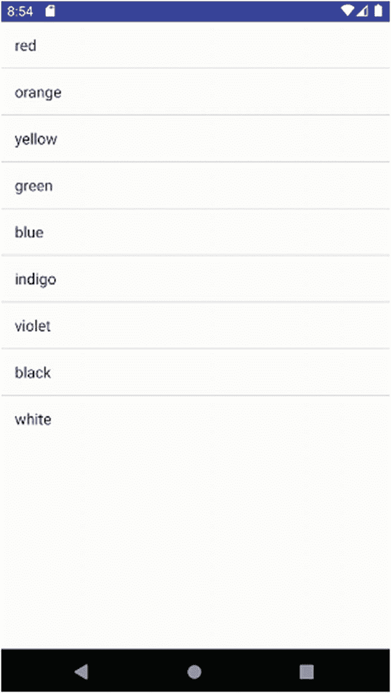
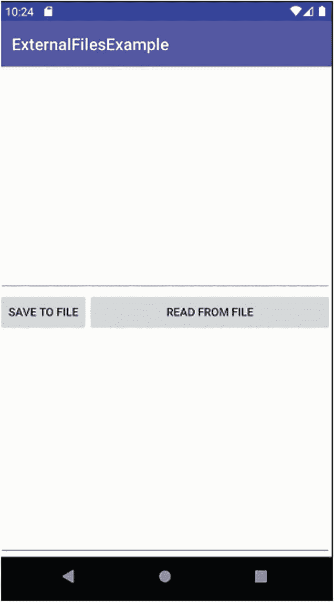

# 19. 在 Android 中处理文件

在本章中，我们将详细探讨文件，包括 Android 为应用程序存储、检索和管理数据的方法。在下一章中，我们将处理关于数据库的配套工具，它们与文件一起为应用程序中的数据管理提供了丰富的选项。我们还将把这些与内容提供者进行对比，后者是 Android 更高级的数据访问和管理模型。

本章中的示例集中介绍 Android 提供的两种基于文件数据的主要方法。方法一可以视为“应用内嵌”模型，它使用与应用一同打包的原始资源和资产。方法二是“Java I/O”方法，它利用广为人知的 `java.io` 包来操作文件、数据流等，就像你在任何其他操作系统上使用基于 Java 的文件管理一样。

每种方法都有其优点和缺点，我们将会讨论，你可以放心，没有所谓的最佳方法——只有最适合当前问题的方法。


## 使用资源文件和原始文件

在第 13 章和第 14 章中，我们介绍了直接处理文件的音频和视频示例，这些示例依赖于 Android 的某些功能。在这两章的示例中，我们探索了`raw`和`asset`位置的用途，它们并不仅限于音频、图像和视频等媒体文件。只要开发者了解如何访问和操作文件内容，几乎可以将任何类型的文件放置在这些位置。例如，你可以存储一个`.csv`文件来保存某些有用的数据。

Android 通过`Resources`类及其`getResources()`方法提供了对文件的便捷访问。对于原始资源文件，你可以通过调用`openRawResources()`方法，以`InputStream`的形式呈现其内容。作为开发者，你的任务是了解`InputStream`中的数据含义。

在查看示例之前，有必要了解使用原始文件或资源文件作为数据源的一些重要优缺点。

### 基于原始资源方法的优势

1. 借助 Android 资源打包工具 AAPT，你的文件可以与应用程序一起打包。
2. 可以在库项目中集中放置资源，因此需要时可以从多个应用程序访问它们。
3. 文件默认是私有的，外部访问需要完全了解包名和资源名称才能引用，或进行适当的库或 API 调用，同时需要在清单文件或运行时授予文件访问权限。
4. 只读和静态数据可以以常见格式（如 JSON 或 XML）打包。

### 基于原始资源方法的劣势

1. 默认情况下为只读。编辑已随应用打包的现有资源并不简单。
2. 对于其他应用程序或服务用户而言，共享并非易事。
3. 静态特性导致信息更新和维护存在困难。

了解了这些优缺点后，你可以做出明智的选择，判断这种方法是否适合你的应用程序及其所需功能。

## 从资源文件填充列表

通过示例最能展示文件管理的优缺点。在本例中，我们将介绍`ListView` UI 控件和适配器逻辑，并使用它们作为机制，在应用程序运行时从 XML 文件动态读取数据并填充值列表。清单 19-1 展示了一个简单的布局，该布局提供了一个`ListView`，最终用于显示来自 XML 资源文件的数据。

```
清单 19-1
RawFileExample 的布局
```

对于这个示例应用程序，我们将让`ListView`显示颜色名称，并从`ch19/RawFileExample`项目中提供的 XML 文件`colors.xml`中获取这些颜色名称。你可以在清单 19-2 中看到`colors.xml`文件的内容。

```
清单 19-2
colors.xml 文件内容
```

你可以看到`colors.xml`文件非常简单，这是有意为之。我们的重点是实际打开此文件、读取并解析其内容，以及将结果数据用于应用程序的合适数据结构所需的逻辑，而非 XML 的复杂性。清单 19-3 显示了一个基于`ListActivity`的简单应用程序的逻辑，该应用程序将`colors.xml`文件中的颜色名称显示在列表中，并允许用户点击选择特定颜色。

```
package org.beginningandroid.rawfileexample;
import android.app.ListActivity;
import android.os.Bundle;
import android.view.View;
import android.widget.ArrayAdapter;
import android.widget.ListView;
import android.widget.TextView;
import org.w3c.dom.Document;
import org.w3c.dom.Element;
import org.w3c.dom.NodeList;
import java.io.InputStream;
import java.util.ArrayList;
import javax.xml.parsers.DocumentBuilder;
import javax.xml.parsers.DocumentBuilderFactory;
public class MainActivity extends ListActivity {
private TextView mySelection;
ArrayList colorItems = new ArrayList();
@Override
protected void onCreate(Bundle savedInstanceState) {
super.onCreate(savedInstanceState);
setContentView(R.layout.activity_main);
mySelection = (TextView) findViewById(R.id.mySelection);
try {
InputStream inStream = getResources().openRawResource(R.raw.colors);
DocumentBuilder docBuild = DocumentBuilderFactory
.newInstance().newDocumentBuilder();
Document myDoc = docBuild.parse(inStream, null);
NodeList colors = myDoc.getElementsByTagName("color");
for (int i = 0; i < colors.getLength(); i++) {
colorItems.add(((Element) colors.item(i)).getAttribute("value"));
}
} catch (Exception e) {
e.printStackTrace();
}
setListAdapter(new ArrayAdapter(this,
android.R.layout.simple_list_item_1, colorItems));
}
public void onListItemClick(ListView parent, View v, int position,
long id) {
mySelection.setText(colorItems.get(position).toString());
}
}
清单 19-3
处理 XML 资源文件的 RawFileExample Java 逻辑
```

查看`RawFileExample`的代码时，你会立即注意到我们导入的大量外部 Java 库，用于处理文件 I/O 和 XML 解析。这就是 Android 中 Java 遗产的实际力量。即使你选择转向 Kotlin 作为首选编程语言，庞大的 Java 库也能为你提供功能支持。

`onCreate()`方法首先创建一个`InputStream`对象，然后我们调用`getResources().openRawResource()`来在`.apk`中找到该文件，分配其文件描述符，将它们与`InputStream`关联起来，最后让系统准备好使用来自该文件的数据流。从那时起，剩余的逻辑就是解释文件内容所需的部分。

在初始文件处理之后，我们使用`DocumentBuilder`对象解析文件内容，并将结果表示存储在一个名为`myDoc`的`Document`对象中。利用 DOM 语义，我们调用`getElementsByTagName()`将所有`<color>`元素收集到我们的`NodeList`对象中。鉴于我们的文件非常简单，这看起来可能有些过度，但想象一个包含其他元素、子元素等的更复杂的 XML 模式，你就能看到这种方法如何高效地筛选出我们想要的元素。

最后，我们使用`for`循环遍历`NodeList`中的`<color>`条目，提取`value`属性的文本——即我们想要在`ListView`中显示的实际颜色名称字符串。填充好`NodeList`后，我们可以通过配置为使用颜色名称列表的`ArrayAdapter`来填充`ListView`，并要求它使用默认的内置 XML 布局`simple_list_item_1`来渲染结果。

处理用户点击颜色的逻辑会检索颜色字符串，并将用户选择的条目填充到`TextView`中。

运行应用程序会显示来自`colors.xml`文件的数据，这些数据已呈现在我们的`ListView`中，如图 19-1 所示。



图 19-1
RawFileExample 应用程序显示 XML 文件内容


## 处理文件系统中的文件

如果您之前在传统文件系统中使用过通用 Java 应用程序进行文件 I/O 操作，那么 Android 的操作方式对您来说会非常熟悉。如果您不熟悉基于 Java 的文件读写操作，下面是一个快速入门介绍。从 Java 的角度来看，文件被视为数据流，而两个对象在文件的读写过程中至关重要：`InputStream` 和 `OutputStream`。这些流通过调用代码中的 `openFileInput()` 和 `openFileOutput()` 方法来提供。有了流之后，您的程序逻辑负责执行以下操作：从 `InputStream` 读取数据或向 `OutputStream` 写入数据，以及在操作完成后清理所有资源。

### Android 的文件系统模型

由于 Android 的历史以及谷歌对用户是否应拥有对其设备的完全访问权所抱有的过度家长式作风，您在处理设备上的本地文件存储时会遇到两个概念。所有存储空间被划分为“内部”和“外部”，但这两个术语的含义有所偏差。在当代 Android 中，“内部”基本上符合您的理解，而“外部”既包括 SD 卡等传统外部存储，也包括一部分板载存储——这些存储普通人会认为是内部存储，但 Android 将其称为外部，以表明您对这些存储区域有更自由的访问权限，可进行传统的文件 I/O 操作。

除了将“内部”区域用于系统相关用途之外，在 Android 下思考文件系统时还存在其他差异，这些差异体现了内部和外部存储各自的优缺点。

内部存储的特点如下：

1.  每个 Android 设备都包含内部存储，并且始终存在。
2.  指定存储在内部存储中的、属于应用程序的文件被视为应用程序的组成部分。这些文件在安装应用程序时安装，并在卸载应用程序时删除。
3.  内部存储文件的默认安全边界是仅供您的应用程序私有访问。共享需要执行额外的明确步骤。
4.  内部存储的容量通常远小于可用的外部存储，即使用户有充足的外部存储空间，也能看到内部存储空间被填满，从而带来空间管理问题。

外部存储则不同，特点如下：

1.  Android 为外部存储提供了一个 USB 抽象层和接口。当作为 USB 设备使用时，设备上的应用程序无法访问外部存储。
2.  默认的安全边界是使外部存储上的所有文件对世界可读。其他应用程序可以在开发者或用户不知情或未经许可的情况下读取您存储在外部存储上的文件。
3.  根据所调用的保存方法，卸载应用程序时，外部存储上的文件可能不会被删除。

现在您已经了解了内部和外部存储的这些方面，请继续阅读下文！

### 读写文件的权限

如果您选择使用内部存储，那么您的应用程序始终拥有对其预留的内部存储部分的读写权限。要查找应用程序的任何内部存储的详细信息，请调用 `getFilesDir()`。您还可以使用 `getDir()` 来获取一个命名的（子）目录供您使用，如果该目录不存在，则在过程中创建它。

您可以通过调用 `openFileOutput()` 打开一个文件用于输出流（也就是写入）。如果文件不存在，系统会为您创建。`openFileInput()` 方法用于打开一个文件以获取 `InputStream`，满足您的读取需求，但请注意，调用此方法时，您指定的文件必须已经存在。

`openFileOutput()` 和 `openFileInput()` 都接受许多 `MODE_*` 选项，用于控制文件和流的行为。最常用的 `MODE_*` 选项包括：

- `MODE_APPEND`：文件中的现有数据不变，将字符串中的数据追加到文件的现有内容中。
- `MODE_PRIVATE`：将文件权限设置为仅允许创建它的应用程序（以及任何以同一用户身份运行的其他应用程序）访问该文件。这是默认模式。
- `MODE_WORLD_READABLE`：向设备上的所有应用程序和用户开放读取权限。这被认为是不良的安全实践，但常见于使用 Content Providers 或服务被视为大材小用时。
- `MODE_WORLD_WRITABLE`：比世界可读更危险的是世界可写。任何应用程序或用户都可以写入该文件。其他开发者使用此选项并不意味着您也应该使用！

对于您的应用程序用户来说，在应用程序分配的内部文件系统空间内创建、打开或写入内部文件无需特定权限。在内部设备存储中创建文件的最简单示例如下：

```
FILE myFile = new FILE(context.getFilesDir(), "myFileName");
```

当您开始使用外部存储时，情况就不同了。您可以使用不同的方法，并且权限模型严格实施适当的控制和安全措施。为了写入外部存储，您的 Android Manifest 需要包含权限 `android.permission.WRITE_EXTERNAL_STORAGE`，正如我们在第 13 章和第 14 章的音频和视频示例中看到的那样。在 Android Marshmallow 及更早的版本中，您的应用程序无需指定或请求任何特定权限即可自由地从外部存储读取数据。对于更新版本的 Android，您需要在 Manifest 中包含 `android.permission.READ_EXTERNAL_STORAGE`。由于在旧版本中包含此项没有影响，因此无论您的版本支持计划如何，都应默认添加此项。

用于访问外部存储的方法在命名上与之前介绍的内部存储方法高度相似，但通常会增加“External”或“Public”字样。`getExternalStoragePublicDirectory()` 方法旨在分配结构良好的目录和文件，您可以在其中存储文档、音频、图片、视频等。该方法接受一个枚举，表示一个预定义的应用程序目录，以及您选择的文件名。

Android 有数十个应用程序目录，包括：

- `DIRECTORY_DOCUMENTS`：用于存储用户创建的传统文本或其他可编辑文档。
- `DIRECTORY_MUSIC`：用于存放各种音乐和音频文件。
- `DIRECTORY_PICTURES`：用于存储静态图像文件，如照片、绘图等。

所有这些预定义位置都很有用，在它们适合的场景中具有令人安心的可预测性，但有时您会需要存储类型截然不同的文件。对于这些情况，可使用通用方法 `getExternalStorageDirectory()`，其功能与本章前面提到的用于内部存储的 `getFilesDir()` 类似。

### 实战检查外部文件

在消化了更多理论知识之后，是时候通过一个可运行的示例来探索外部文件了。位于 `ch19/ExternalFilesExample` 的 `ExternalFilesExample` 应用演示了保存文件并读回其内容的机制。

图 19-2 显示了用于提供文本输入字段、文件写入和读取按钮以及文本读取字段的布局。相应的布局 XML 文件位于 `ch19/ExternalFilesExample` 项目中，但此处不再重复以节省篇幅。




