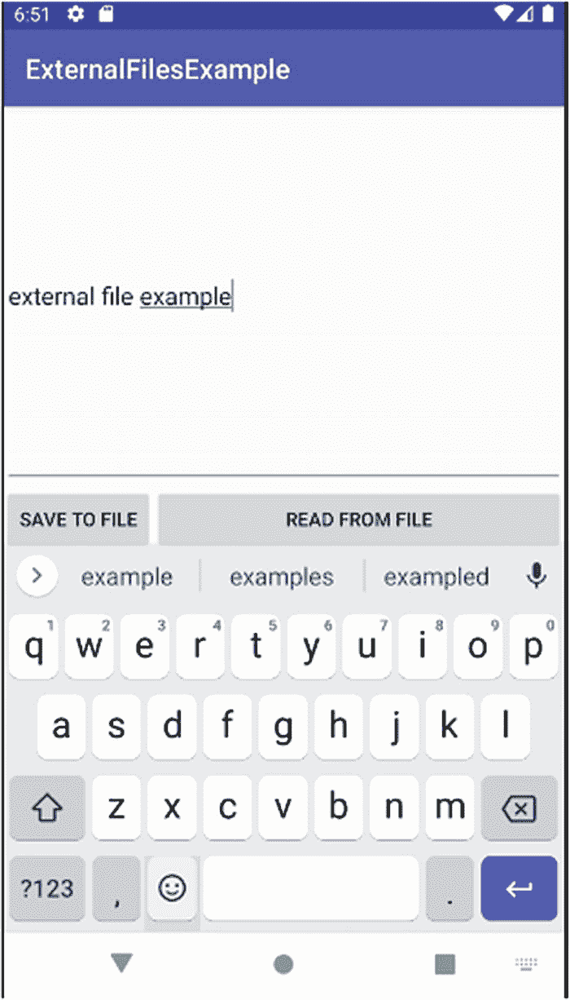
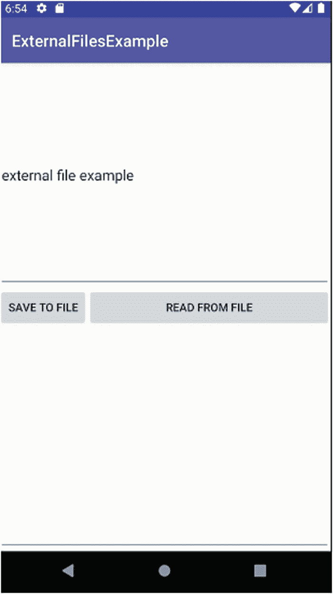
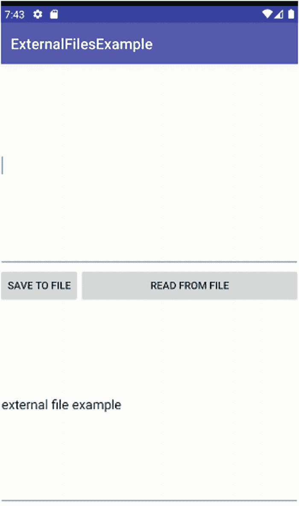

# 图 19-2
用于测试外部文件管理的包含字段和按钮的活动界面

我们应用程序的支持逻辑遵循了我多次使用过的模式：一个集中的 `onClick()` 方法接收按钮点击事件，并根据用户在运行时选择的视图（按钮）切换到相应的方法。代码如代码清单 19-4 所示。

```
package org.beginningandroid.externalfilesexample;
import androidx.appcompat.app.AppCompatActivity;
import android.content.Context;
import android.os.Bundle;
import android.view.View;
import android.view.inputmethod.InputMethodManager;
import android.widget.EditText;
import java.io.BufferedReader;
import java.io.IOException;
import java.io.InputStream;
import java.io.InputStreamReader;
import java.io.OutputStreamWriter;
public class MainActivity extends AppCompatActivity {
public final static String FILENAME="ExternalFilesExample.txt";
@Override
protected void onCreate(Bundle savedInstanceState) {
super.onCreate(savedInstanceState);
setContentView(R.layout.activity_main);
}
public void onClick(View view) {
switch(view.getId()) {
case R.id.btnRead:
try {
doReadFromFile();
}
catch (Exception e) {
e.printStackTrace();
}
break;
case R.id.btnSave:
doSaveToFile();
break;
}
}
public void doReadFromFile() throws Exception {
doHideKeyboard();
EditText readField;
readField=(EditText)findViewById(R.id.editTextRead);
try {
InputStream inStrm=openFileInput(FILENAME);
if (inStrm!=null) {
// 我们将使用传统的 Java I/O 流和构建器。
// 这比较繁琐，我们将在第 20 章中使用 IOUtils 外部库提供更好的版本
InputStreamReader inStrmRdr=new InputStreamReader(inStrm);
BufferedReader buffRdr=new BufferedReader(inStrmRdr);
String fileContent;
StringBuilder strBldr=new StringBuilder();
while ((fileContent=buffRdr.readLine())!=null) {
strBldr.append(fileContent);
}
inStrm.close();
readField.setText(strBldr.toString());
}
}
catch (Throwable t) {
// 在此处执行异常处理
}
}
public void doSaveToFile() {
doHideKeyboard();
EditText saveField;
saveField=(EditText)findViewById(R.id.editText);
try {
OutputStreamWriter outStrm=
new OutputStreamWriter(openFileOutput
(FILENAME, Context.MODE_PRIVATE));
try {
outStrm.write(saveField.getText().toString());
}
catch (IOException i) {
i.printStackTrace();
}
outStrm.close();
}
catch (Exception e) {
e.printStackTrace();
}
}
public void doHideKeyboard() {
View view = this.getCurrentFocus();
if (view != null) {
InputMethodManager myIMM=(InputMethodManager)
this.getSystemService(Context.INPUT_METHOD_SERVICE);
myIMM.hideSoftInputFromWindow
(view.getWindowToken(), InputMethodManager.HIDE_NOT_ALWAYS);
}
}
}
```

**代码清单 19-4** `ExternalFilesExample` Java 代码

### 保存和读取文件的原理

探索 `ExternalFilesExample` 项目，我们可以看到两个关键方法。首先是 `doSaveToFile()` 方法，它会调用 `doHideKeyboard()`（稍后介绍）进行一些准备和清理工作，然后创建局部变量 `saveField` 并将其绑定到布局中的 `EditText` 视图。这样做的目的是为了最终能够引用 UI 中的文本以便保存。

接着是主要的 `try/catch` 块，定义用于将文本流式传输到由变量 `FILENAME` 指定的文件的输出流。然后我们调用 `.write()` 方法，尝试实际通过流将文本写入文件。

你可能已经注意到，在 `ExternalFilesExample` 代码中，有许多嵌套的异常处理层。写入文件可能会遇到许多问题，从存储空间已满，到用户在写入过程中突然拔出正在写入的 SD 卡！简而言之，在对文件进行访问时，对异常多加小心总是明智的。

其次，为了从文件中读取数据，我们使用 `doReadFromFile()` 方法，其设置工作与 `doSaveToFile()` 方法类似。我们首先调用 `doHideKeyboard()`（将在后面介绍），然后创建局部变量 `readField` 并将其绑定到 `editTextRead` 控件。这个控件将用于显示读取后的文件内容。

接下来，我们添加一个 `try/catch` 块，其中包含了一些教科书式的 Java 文件处理方法。我们使用流读取器来访问文件，并将该缓冲区传递过去，以便消费者可以控制对数据的访问。通过 `while` 块逐行访问流中的内容，并在字符串构建器中逐步构建文件的完整内容。当从流（即文件）中读取完所有行后，关闭流，然后通过 `strBldr` 对象将缓冲区中的所有内容传输到布局中的 `readField EditText` 控件。

当然，有更精简、更现代的方式来实现上述所有功能，但关键是这些方式会掩盖底层的运作机制。在 `ExternalFilesExample` 代码中，你将看到 Java I/O 在最底层运作时的繁琐细节，从而帮助你理解所需的对象和工作，以及所有可能出现问题的地方！在今天，任何理智的人都不会暴露这种文件访问的编程模式——他们都会将其隐藏起来，尽管在幕后所有这些步骤仍然会发生。

### 助力优化输入法

我们的代码在 `doHideKeyboard()` 方法上稍微偏离了严格的文件处理逻辑。这是一个你会反复用到的辅助方法，它有助于减少用户在输入文本并继续执行所需操作时的步骤。当用户在 `EditText` 字段中输入文本时，输入法会被触发并显示软键盘供用户输入。我们可以自定义输入法，通过使用输入法的“附件按钮”选项来添加一个“完成”按钮，但这会要求用户额外点击一次。

因此，我特意设计了布局，确保即使输入法处于活动状态，保存（和读取）按钮也始终可见，这意味着用户可以输入文本后立即点击保存按钮。调用 `doSaveToFile()` 时会调用 `doHideKeyboard()`，该方法首先确定用户与哪个 `View` 进行了交互，以及输入法框架是否处于活动状态并显示了键盘。如果键盘已显示，我们会调用 `.hideSoftInputFromWindow()` 来隐藏键盘。虽然用户看不到所有这些机制，但他们受益于用户体验的简化——保存文件时可以少按一次键！

### 保存和读取文件的实际操作


现在您已经了解了`ExternalFilesExample`示例，是时候看看它如何实际运行了。图 19-3 展示了用户首次开始在顶部字段中输入文本时应用程序的初始显示效果。



**图 19-3** 输入要保存到外部文件的文本

如我所承诺的，输入法编辑器（键盘）出现在屏幕的下半部分，但我们的按钮仍然可以访问。在这个示例中，这更像是一种权宜之计——它并非成熟应用程序应有的精致用户界面，而是展示了我们关心的文件输入/输出操作。用户可以随时点击“保存到文件”按钮，触发`doSaveToFile()`方法。正如本章前面所述，该方法会调用`doHideKeyboard()`方法，此时我们的用户界面将如图 19-4 所示。



**图 19-4** 保存文件的同时隐藏输入法编辑器

输入到`EditText`字段中的文本会保存到名为`ExternalFilesExample.txt`的文件中。随时可以通过点击“从文件读取”按钮调出`ExternalFilesExample.txt`的内容。这会触发读取文件内容，并由`doReadFromFile()`方法显示。图 19-5 展示了此文件检索的结果。



**图 19-5** 调出外部文件的内容

### 确保外部存储在需要时可用

当我之前介绍使用外部存储时，我概述了一些潜在的缺点，包括其是否可靠的不可确定性。您的用户可能会做出疯狂的事情，比如物理移除设备中的 SD 卡，即使对于那些通过内部内存分区模拟外部存储的设备，Android 仍然允许将该外部存储作为 USB 设备挂载到其他地方，这隐式地切断了其他应用程序对该存储的访问。

作为开发者，您的目标应该是创建行为良好的应用程序，即使您的用户并非如此！这意味着，在您的应用程序尝试使用外部存储之前，对其进行存在性和可用性检查是明智的。

为此，Android 提供了一些有用的环境方法，其中最有用的是`Environment.getExternalStorageState()`，它从预定义的枚举中返回一个字符串，描述外部存储的当前状态。您可以使用此状态来确定外部存储的可用性、健康状况等。常见的返回值包括：

- `MEDIA_BAD_REMOVAL`：此状态表示物理 SD 卡在卸载之前被移除，可能由于缓存的页面未被刷新而导致文件处于不一致状态（请参阅本章后面的文件系统讨论）。
- `MEDIA_REMOVED`：当板载设备未映射外部存储且没有 SD 卡存在时，返回此值。
- `MEDIA_SHARED`：当设备的外部存储作为 USB 设备挂载到其他外部平台时，返回此值，表示外部存储此时不可用，即使它存在于设备中。
- `MEDIA_CHECKING`：当插入 SD 卡时，会执行检查以确定该卡是否已格式化以及使用何种文件系统。这些过程进行时返回此值。
- `MEDIA_MOUNTED`：可用的外部存储的正常状态。
- `MEDIA_MOUNTED_READ_ONLY`：通常在 SD 卡的物理开关设置为只读位置时出现，意味着无法对该部分外部存储执行写入操作。

developer.android.com 上的 Android 文档列出了所有可能的外部存储状态值。

## Android 文件系统的其他注意事项

现在您已经熟悉了在 Android 中处理文件的多种方法，还有一些微妙和不太微妙的管理注意事项需要考虑，以确保在文件系统上使用文件的长期可行性。

### Android 文件系统发展史

纵观 Android 作为智能手机操作系统的历史，它支持了一系列用于板载存储的文件系统标准。这段历史中的三种主要格式是：

1.  `YAFFS`，即另一种闪存文件系统：作为基于 NAND 存储的原始文件系统，它提供了许多有用的好处，包括磨损均衡支持，使得闪存因多次写入而随时间衰减的问题得到管理，并在一定程度上对操作系统和应用程序隐藏；同时还提供了文件系统级别的垃圾回收工具，帮助将存储的坏区移入“废弃池”，不用于有意义的存储。
2.  `YAFFS2`：是`YAFFS`的演进和调整版本，为底层存储提供更好的长期健康管理。
3.  `EXT4`：由 Linux 推广的文件系统，具备成熟文件系统的所有“高级”管理特性，包括每文件锁定语义、权限等。

基于较旧的`YAFFS`和`YAFFS2`文件系统及其使用的设备的一个问题是缺乏文件锁定语义。简而言之，作为开发者，两者都不提供锁定单个文件的选项（例如，在编辑共享文件时），而是依赖于锁定“整个文件系统”来确保一致的访问。这有许多缺点，从阻塞可能同时尝试写入该文件的其他应用程序，到如果文件输入/输出发生在主线程上时阻碍高效的 UI 行为。

作为开发者，您的主要问题只是不知道用户设备可能使用何种文件系统。即使问题可能出在 Android 本身，您也很可能因输入/输出锁定和阻塞问题导致的性能不佳而受到指责。

### 避免文件输入/输出引起的 UI 问题

作为开发者，您可以使用一系列技术来缓解`YAFFS`或`YAFFS2`文件系统的锁定和争用问题。这些技术通常也有助于处理其他类型的网络端点输入/输出。


### 使用 StrictMode 分析应用性能

Android 生态系统提供了一系列工具来帮助分析应用行为和性能。`StrictMode` 策略工具就是其中之一，它通过分析所有代码的运行情况来查找其策略中定义的问题，从而帮助解决任何 I/O 延迟问题。

`StrictMode` 提供了多种策略，不过你可能会发现自己主要使用它最初提供的两种策略。第一种是虚拟机策略，用于覆盖整个应用中普遍存在的不良行为或做法，例如泄漏数据库连接对象。第二种是线程策略，专门用于查找在主 UI 线程上运行的不良代码。这有助于发现那些会减慢或中断用户与 UI 流畅交互的代码——无论是你自己的代码还是 Android 的代码。

你可以通过从 `onCreate()` 回调中调用静态方法 `StrictMode.enableDefaults()` 来激活 `StrictMode` 策略。调用此方法会在 Logcat 输出中报告一系列关于 UI 线程问题（包括文件 I/O 相关问题）的有用信息。你也可以根据需要定义自己的策略——具体细节超出了本书的范围，但如果你有兴趣，Android 文档中有更详细的介绍。

#### 警告

尽管 `StrictMode` 策略非常有用，但切勿将其保留在最终发布的代码和应用程序中。如果保留 `StrictMode`，将会在用户设备上生成大量的日志数据，从而消耗你一直小心管理的文件系统空间。

### 将逻辑移至异步线程

前面关于 `StrictMode` 的讨论开启了将逻辑从应用的主 UI 线程和界面移出的世界。几乎在任何时候，都值得思考你的应用中是否存在不需要在关键路径上执行的逻辑，例如从在线服务后台查询数据、消息传递或发布/订阅风格的通知、缓存项目等等。

任何可以在关键路径之外执行的操作都应考虑进行异步处理，这正是 Android 的 `AsyncTask` 的强项，它能够生成额外的线程来处理你交给它的任何逻辑。这非常值得你在学习 Android 的过程中掌握，因为大多数开发者都将其作为管理跨应用线程的主力工具。

`AsyncTask` 类以一种需要你（作为开发者）对其进行子类化的形式提供，以便为你想要完成的工作创建具体的实现。这很合理，因为 Android 无法预先了解你的应用的详细信息，也无法覆盖全世界开发者希望它处理的数百万种任务。要使用 `AsyncTask`，你需要实现它提供的 `doInBackground()` 方法，并在其中编写你想要在另一个线程上执行的实际逻辑。你还可以选择实现一些额外的方法，用于提供执行前后的逻辑、以受控的方式与 UI 交互等。

代码清单 19-5 给出了一个展示子类化 `AsyncTask` 的框架，说明了如何用它来执行文件保存操作。实现方式不胜枚举，但你可以领会其总体思路。

```
private class SmartFileSaver extends AsyncTask {
protected void onPreExecute() {
// 此方法将在 UI 线程上触发
// 显示一条 Toast 消息
Toast.makeText(this, "正在保存文件", Toast.LENGTH_LONG).show();
}
protected void doInBackground() {
// 此方法将生成一个后台线程
// 所有工作都在 UI 线程之外执行
// 创建输出流
// 调用 .write()
// 捕获异常
// 等等
}
protected void onPostExecute() {
// 此方法将在 UI 线程上触发
// 显示一条 Toast 消息
Toast.makeText(this, "文件已保存", Toast.LENGTH_LONG).show();
}
}
代码清单 19-5
一个 AsyncTask 子类化示例
```

使用 `SmartFileSaver.execute()` 方法将调用我们定义的各种 `onPreExecute()`、`doInBackground()` 和 `onPostExecute()` 方法，并由 Android 管理相关的线程生命周期和 UI 交互。

## 本章小结

你现在已经对 Android 下文件 I/O 的基本机制有了扎实的了解，特别是对文件系统、文件处理、以及流和文件内容机制有了深入的理解，这些都是处理文件时不可或缺的部分。

