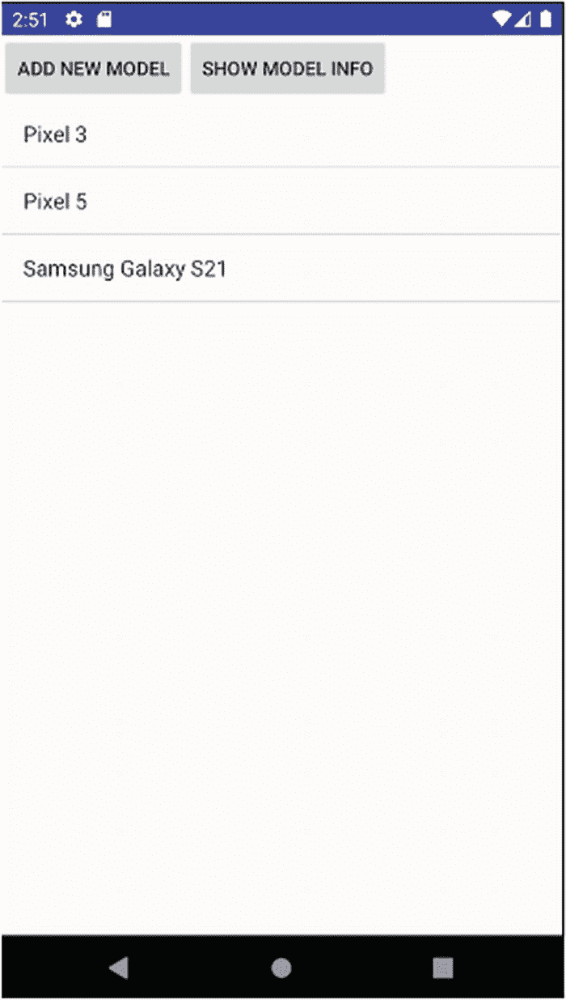
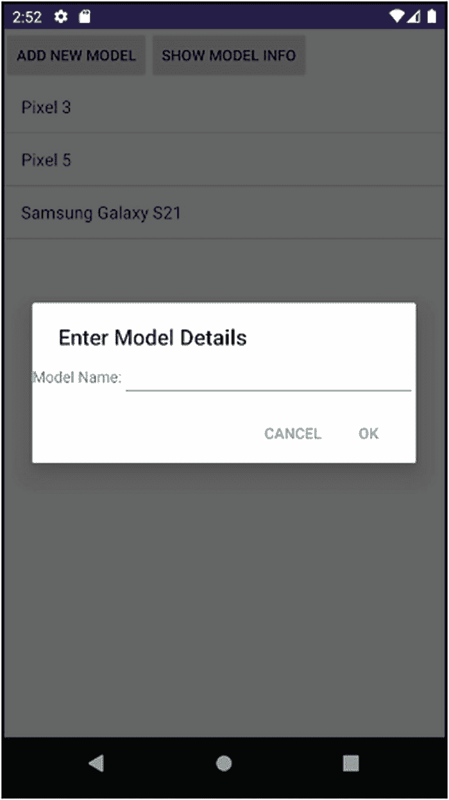

# 20. 在 Android 中使用数据库

文件并不是将应用信息存储到 Android 设备的唯一方式。Android 还提供了两种主要的信息管理方法：一个基于 SQLite 的成熟关系型数据库，以及 Android 内容提供者框架。在本章中，我们将探讨 SQLite 数据库——如果你对内容提供者感兴趣，可以访问本书网站 [`www.beginningandroid.org`](http://www.beginningandroid.org) 了解更多。

如果你熟悉 SQLite，你会知道它是一个坚如磐石的数据库引擎，可以作为单个包含文件或库提供给任何类型的应用程序。SQLite 最近迎来了作为正式发布产品的 25 周年，证明了它自己是软件开发史上始终如一的中流砥柱。

## 使用 SQLite：世界上最流行的数据库！

任何在数据库领域工作过的人都会熟悉 SQLite，但尽管它如此流行，其他领域的人可能从未听说过它。毫不夸张地说，SQLite 是地球上“最流行”的关系型数据库技术。这是一个大胆的说法，所以让我提供一些佐证。

为了让您了解 SQLite 的普遍性和流行程度，我整理了这份简短的数据点清单来帮助说明。

SQLite 是：

1. 每款智能手机操作系统默认且核心的关系型数据库。显然，本书主要讨论 Android，但其他你听说过的智能手机操作系统——例如 iOS——以及你可能没听说过的操作系统，比如 Symbian，都将 SQLite 用作几乎所有内部需求的默认数据库。

2. 被所有网络浏览器选为本地缓存、书签等的关键技术。无论你使用的是 Chrome、Safari、Opera、Edge 还是 Internet Explorer（还记得它吗？！），你每天都在使用 SQLite。

3. 被包含在“数百万”商业和开源产品中。我说数百万绝非夸张！

我最喜欢用来说明 SQLite 究竟有多流行的方法之一就是如下表述。亲爱的读者，从你购买智能手机的第一天起，你每天就都在使用或受益于 SQLite。即使你没有意识到，你也是一个活生生的、行走的 SQLite 受益者！

### 注意

要更深入地探索 SQLite 的世界，我推荐《SQLite 权威指南（第二版）》（ISBN 9781430232254）。为充分披露信息，我是该书的合著者之一。

你们中的许多人可能完全不熟悉 SQLite。你可能没有探索过 SQLite 在 Android 下的能力，也没有利用过它的优势。这完全在意料之中，也正是本章存在的原因。从现在开始，我们将逐步介绍使用 SQLite 作为数据库和 Android 核心功能的基础知识，并且我们将构建一个可运行的数据库驱动的示例应用程序来磨练你的技能。

## 快速学习用于 Android 开发的 SQLite

`SQLite` 主要被定位为一个直接的数据库库，提供了你可能想要从关系型数据库查询和事务引擎中获得的所有核心功能。这意味着你可以访问一个完全兼容的结构化查询语言（SQL）接口，但始终要记住你感兴趣的任何特性所引入的是哪个 SQL 级别（例如 SQL-92 和 SQL-99），这一点非常重要。这一点尤其重要，因为用户设备上附带的 SQLite 版本通常比最新版本落后好几年。


好的，作为一名高级文档工程师和翻译员，我将严格按照您提供的格式和注意事项，将给定的英文文本翻译成中文。


SQLite 支持常规的 SQL 命令，如 `SELECT`、`INSERT`、`UPDATE` 和 `DELETE`，但根据版本的不同，可能不支持后期 SQL 演进的一些关键特性。这包括：

1.  只支持 ANSI 外连接语法的子集
2.  极有限的 ALTER TABLE 支持，只允许重命名和添加列，但不能删除列或修改数据类型
3.  支持行级触发器，但不支持语句级触发器
4.  视图是只读的
5.  不支持窗口函数和公共表表达式，即使这些功能已在 SQLite 3.25 版本中添加——只有支持 Android SDK 级别 29 或更高的设备才能提供支持窗口函数的 SQLite 版本

你可能会担心这些缺失的特性，但实际上，它们大多属于数据库的高级用法，对于小型嵌入式数据库库的大多数日常使用场景来说并非必需。即使没有这些较新的功能，你仍然可以享受到 SQL 的强大能力。

## 为你的应用程序创建 SQLite 数据库

在开始使用 SQLite 数据库为你的应用程序赋能时，你可以选择两种方法：

1.  在开发环境中创建一个 SQLite 数据库文件，或者从外部获取该文件，并将其作为资源复制到你的 Android 项目中。
2.  让你的 Android 应用程序自行创建所需的数据库，并可选地填充一些初始数据。

每种方法都有其优缺点。通过打包一个预制的 SQLite 数据库，你需要确保数据库模式与代码开发保持同步——尽管这个问题并非 Android 独有。让应用程序自行创建数据库可以免除这个负担，但根据你的 SQLite 数据库可能需要的数据种类和数量，可能会给应用程序的启动带来沉重负担。Android 可以帮助解决这个问题，因为它提供了一系列 SQLite 设置辅助选项。

Android 提供了 `SQLiteOpenHelper` 类，供你在应用程序中创建其子类使用。`SQLiteOpenHelper` 负责 SQLite 数据库的所有初始设置，并处理未来的变更和升级。你的工作是实现父类 `SQLiteOpenHelper` 中的（至少）三个方法，另外还有一个用于处理降级的方法可选。

你的首要任务是为 `SQLiteOpenHelper` 构造函数添加逻辑，将父类构造函数作为基础进行调用。父类负责检查指定的数据库文件是否已存在，并在需要时创建该文件。构造函数还会根据提供的版本号执行版本检查，并能在必要时调用 `onUpgrade()` 和 `onDownGrade()` 方法，以及执行一些其他超出本介绍范围的更复杂任务。

其次，你必须实现 `onCreate()` 方法的逻辑。在这里，你将构建并执行数据定义语言（DDL）SQL 命令，根据你的数据库模式设计来创建表、索引、视图等。在 SQLite 数据库中创建对象后，你应该通过插入和更新语句来填充所需的任何数据。

最后，你需要实现 `onUpgrade()` 方法（并可选择实现 `onDowngrade()` 方法）。这些方法处理实现模式变更的 DDL，以及在你升级应用程序并决定需要更改 SQLite 数据库结构以支持所需应用程序行为时，你想要进行的任何相关数据更改。

在了解了在应用程序中使用 SQLite 的理论之后，现在是时候探索一个示例应用程序，它将帮助您将这些概念付诸实践。

## SQLiteExample 应用程序介绍

在本章的剩余部分，我们将使用 `ch20/SQLiteExample` 应用程序来突出展示你在构建数据库驱动的 Android 应用程序时可能用到的所有关键 SQLite 功能。我们将使用简单的 `LinearLayout` 和 `ListView` 来演示如何从 SQLite 数据库中使用和显示数据。

图 20-1 显示了包含一个 `ListView` 的用户界面，用于从 SQLite 数据库中显示已知的 Android 设备型号。我们还有用于添加新设备型号和显示已知设备信息的按钮。



**图 20-1** SQLiteExample 主活动界面

这种简单的布局和视图你现在应该已经很熟悉了，所以我们不再赘述。清单 20-1 显示了布局结构。

```
清单 20-1
SQLiteExample 主活动布局
```

关于此布局有两点需要注意。首先，我定义了两个嵌套的 `LinearLayout`。最外层的 `LinearLayout` 设置了 `orientation=vertical` 属性，并包含内部的 `LinearLayout` 和使用 Android 标准 id 的 `ListView`。内部的 `LinearLayout` 包含了两个按钮 `addNewModel` 和 `getModelInfo`，并设置了 `orientation=horizontal` 属性。这是一个让 UI 组件按我们想要的方式排列的有用技巧，但可以通过适当的权重、重力属性和布局引用来设计出更优雅的解决方案。

其次，我使用了我常用的模式，即两个按钮都调用 `onClick()` 方法，该方法将使用匹配的 Java 代码来确定点击了哪个按钮，并从那里引导逻辑。

回顾图 20-1，你可以看到已经列出了关于几个设备的一些数据。这意味着在某个数据库中已经有数据被用来演示该应用程序。这是在 `SQLiteExample` 应用程序中使用的 `SQLiteOpenHelper` 的实现中完成的。该实现的 Java 代码如清单 20-2 所示。

```java
package org.beginningandroid.sqliteexample;
import android.content.Context;
import android.database.sqlite.SQLiteDatabase;
import android.database.sqlite.SQLiteOpenHelper;
public class MySQLiteHelper extends SQLiteOpenHelper {
public static final String TABLE_NAME="devices";
public static final int COLNO__ID = 0;
public static final int COLNO_MODEL_NAME = 1;
public static final int COLNO_RELEASE_YEAR = 2;
public static final String COLNAME__ID = "_id";
public static final String COLNAME_MODEL = "model_name";
public static final String COLNAME_YEAR = "release_year";
public static final String[] TABLE_COLUMNS =
new String[]{"_id","model_name","release_year"};
private static final String DBFILENAME="devices.db";
private static final int DBVERSION = 1;
private static final String INITIAL_SCHEMA=
"create table devices (" +
"_id integer primary key autoincrement," +
"model_name varchar(100) not null," +
"release_year integer not null" +
")";
private static final String INITIAL_DATA_INSERT=
"insert into devices (model_name, release_year) values " +
"('LG Nexus 4', 2012)," +
"('LG Nexus 5', 2013)," +
"('Samsung Galaxy S6', 2015)";
public MySQLiteHelper(Context context) {
super(context, DBFILENAME, null, DBVERSION);
}
@Override
public void onCreate(SQLiteDatabase db) {
db.execSQL(INITIAL_SCHEMA);
db.execSQL(INITIAL_DATA_INSERT);
}
@Override
public void onUpgrade(SQLiteDatabase db, int oldVersion, int newVersion) {
// perform upgrade logic here
// This can get quite complex
if (oldVersion==1) {
// do upgrade logic to new version
}
// and so on
}
}
清单 20-2
MySQLiteHelper SQLiteOpenHelper 实现
```


```markdown
`MySQLiteHelper`的 Java 代码展示了本章前面概述的辅助类需求。构造函数接收文件名和版本信息，并用其检查 SQLite 数据库文件是否存在，必要时会创建该文件。我选择`devices.db`作为 SQLite 数据库文件的文件名，意在使其含义稍显明确。

观察`onCreate()`方法，可以看到它连续两次调用了`execSQL()`方法，这是你首次接触到与 SQLite 数据库交互的常用方法。`execSQL()`方法有众多参数和返回信息的变体，但最直接的方式是接收一个`String`类型的 SQL 语句作为参数，该语句即由 SQLite 库执行的 SQL 命令。通常情况下，SQL 语句执行成功不会提供返回值——这正是“没有消息就是好消息”原则的体现。

用于`execSQL()`调用的每条 SQL 语句，都是在类顶部的常量声明中构建的。这种基于常量的语句构建方式并非新概念，但此处使用的几个额外常量值得注意：

*   三个`COLNO_*`常量各自代表我所定义的表中列的列号（或序数位置）。因此，`_id`列（将在下文讨论）位于位置 0，`model_name`列位于位置 1，依此类推。这些位置对于某些隐式使用表默认列顺序返回数据的 SQLite 辅助方法很重要。

*   `TABLE_COLUMNS`是一个`String`数组，包含了表中各列的名称。我们即将探索的许多方法都会用到这个名称集合。

回到表中的`_id`列，它利用了 SQLite 的自增特性，为每一行生成一个唯一的整数值，作为表的主键。`_id`这个名称是许多内置 Android 工具、辅助类和方法所使用和期望的约定。我建议你为所有 SQLite 表都沿用这种设计传统，至少在你充分理解不同做法所带来的后果之前应如此。

通过`execSQL()`调用的下一条 SQL 语句是`INITIAL_DATA_INSERT`语句。该语句执行多行插入，用于向我们模式中的唯一一张表填充初始数据集。这种数据播种完全是可选的，你肯定会遇到需要这样做的情况，当然也会有不需要的时候。插入语句所使用的语法仅在较新版本的 SQLite 中受支持，因此也仅限于较新版本的 Android。有关 SQLite 版本、特性与 Android 版本之间更详细的对应关系，请查阅本书网站[`www.beginningandroid.org`](http://www.beginningandroid.org)上的补充材料。

辅助类中的最后一个方法是`onUpgrade()`的框架。在示例应用中，我们处理的是应用的第一版（`DBVERSION` 等于 1，并在构造函数调用中使用）。我留下了一个逻辑框架，你可以利用它来处理提供的`oldVersion`和`newVersion`值，从而决定在应用升级过程中可能需要哪些模式变更、数据变更或其他修改操作。谈到数据库模式升级，你会在网上看到许多示例，其中人们只是简单地删除并重新创建数据库作为`onUpgrade()`的实现。这是一种实用的 hack 方法，但仅在你不关心用户数据时才能在一定程度上有效！如果你期望用户存储任何有价值的数据，并且希望在数据库模式升级后仍保留这些数据，请警惕这种方法！

## 创建数据库驱动的 Activity

理解了`SQLiteOpenHelper`类的用途和结构后，你就可以使用它来构建一个有用的数据库驱动应用了。在`Ch20/SQLiteExample`应用中，你将看到如代码清单 20-3 所示的逻辑。这份代码清单相当长，不过我省略了我编写的另一个名为`DialogWrapper`的辅助类，从而节省了篇幅。请继续阅读 Java 代码以及随后的逻辑详解。

```java
package org.beginningandroid.sqliteexample;

import android.app.AlertDialog;
import android.app.ListActivity;
import android.content.ContentValues;
import android.content.DialogInterface;
import android.os.Bundle;
import android.database.Cursor;
import android.database.sqlite.SQLiteDatabase;
import android.view.LayoutInflater;
import android.view.View;
import android.widget.ArrayAdapter;
import android.widget.Toast;

import java.util.ArrayList;
import java.util.Calendar;
import java.util.List;

public class MainActivity extends ListActivity {

    private SQLiteDatabase myDB;
    private MySQLiteHelper myDBHelper;

    @Override
    protected void onCreate(Bundle savedInstanceState) {
        super.onCreate(savedInstanceState);
        setContentView(R.layout.activity_main);
        myDBHelper = new MySQLiteHelper(this);
        myDB = myDBHelper.getWritableDatabase();
        displayModels();
    }

    public void onClick(View view) {
        switch(view.getId()) {
            case R.id.addNewModel:
                addModel();
                break;
            case R.id.getModelInfo:
                getModelInfo(view);
                break;
        }
    }

    public List getModels() {
        List models = new ArrayList();
        Cursor cursor = myDB.query(MySQLiteHelper.TABLE_NAME,
                MySQLiteHelper.TABLE_COLUMNS, null, null, null, null, null);
        cursor.moveToFirst();
        while (!cursor.isAfterLast()) {
            String model = cursor.getString(MySQLiteHelper.COLNO_MODEL_NAME);
            models.add(model);
            cursor.moveToNext();
        }
        cursor.close();
        return models;
    }

    public void displayModels() {
        List modelEntries = getModels();
        ArrayAdapter adapter = new ArrayAdapter(this,
                android.R.layout.simple_list_item_1, modelEntries);
        setListAdapter(adapter);
    }

    public void getModelInfo(View view) {
        Cursor cursor = myDB.rawQuery(
                "select _id, model_name, release_year " +
                        "from devices", null);
        cursor.moveToFirst();
        while (!cursor.isAfterLast()) {
            String model = cursor.getString(MySQLiteHelper.COLNO_MODEL_NAME);
            Integer year = cursor.getInt(MySQLiteHelper.COLNO_RELEASE_YEAR);
            Toast.makeText(this, "The " + model +
                    " was released in " + year.toString(),
                    Toast.LENGTH_LONG).show();
            cursor.moveToNext();
        }
        cursor.close();
    }

    private void addModel() {
        LayoutInflater myInflater = LayoutInflater.from(this);
        View addView = myInflater.inflate(R.layout.add_model_edittext, null);
        final DialogWrapper myWrapper = new DialogWrapper(addView);

        new AlertDialog.Builder(this)
                .setTitle(R.string.add_model_title)
                .setView(addView)
                .setPositiveButton(R.string.ok,
                        new DialogInterface.OnClickListener() {
                            public void onClick(DialogInterface dialog,
                                                int whichButton) {
                                insertModelRow(myWrapper);
                            }
                        })
                .setNegativeButton(R.string.cancel,
                        new DialogInterface.OnClickListener() {
                            public void onClick(DialogInterface dialog,
                                                int whichButton) {
                                // 此处无需操作
                            }
                        })
                .show();
    }

    private void insertModelRow(DialogWrapper wrapper) {
        ContentValues myValues = new ContentValues(2);
        myValues.put(MySQLiteHelper.COLNAME_MODEL, wrapper.getModel());
        myValues.put(MySQLiteHelper.COLNAME_YEAR,
                Calendar.getInstance().get(Calendar.YEAR));
        myDB.insert(MySQLiteHelper.TABLE_NAME,
                MySQLiteHelper.COLNAME_MODEL, myValues);
        // 如果希望插入后立即显示，请取消下面这行注释
        //displayModels();
    }

    @Override
    public void onDestroy() {
        super.onDestroy();
        myDB.close();
    }
}
```

**代码清单 20-3** SQLiteExample 主活动
```


### 关键实现步骤与 SQLite 查询方法

以下是前述代码中需要记住的一些关键实现步骤，适用于所有基于 SQLite 的 Android 开发。任何基于 SQLite 的 Android 应用的关键步骤是：从你的辅助类创建一个对象，并确保它在需要它的活动（**Activity**）的整个生命周期内保持有效。这通常不难，我在启动活动（Launcher Activity）中创建该对象的方式是一种常见做法。

现在你已经有了可用的辅助对象，每当需要操作数据库时，与数据库的交互都将从调用其`getReadableDatabase()`或`getWritableDatabase()`方法开始，这两个方法会返回一个底层 SQLite 数据库的数据库对象。正如方法名所示，只读数据库对象仅用于通过`SELECT`查询读取数据，而可写版本则允许执行 DML 语句（如`INSERT`、`UPDATE`、`DELETE`）以及用于创建和修改对象的 DDL 语句，就像我们在辅助类的`onCreate()`方法中使用的那样。

当使用数据库对象完成特定任务后，只需调用其`.close()`方法，辅助类就会清理资源。这通常在活动的`onDestroy()`或类似方法中完成。

`SQLiteExample`应用创建了辅助对象，并使用`getWritableDatabase()`以可写模式访问数据库，接着通过`getModels()`方法填充`modelEntries`列表。利用这些结果，它为`ArrayAdapter`提供所需数据，以将数据库返回的数据填充到`ListView`中。`getModels()`方法虽短，但功能强大，因为它引入并使用了两个关于 SQLite 数据库和 Android 的重要能力。第一个概念是查询辅助方法（Query Helper），用于从 SQLite 数据库中收集数据；第二个概念是游标对象（**Cursor**），用于管理返回的结果。熟练使用 SQLite（及其他）数据库需要掌握这两种技术，让我们更深入地研究它们。

#### 为 SQLite 和 Android 选择查询方法

在应用中使用 SQLite 数据库时，你可以选择两种主要方式来检索其存储的数据。每种方式都使用`SELECT`语句，但在提供给开发者的辅助程度和假定结构方面有所不同。

##### 使用查询构建过程

方法一，如`SQLiteExample`应用的`getModels()`方法所示，是使用`query()`方法。通过使用`query()`，你可以获得一条结构化的路径来构建查询所需的列、源表、谓词逻辑等，直到形成最终将在 SQLite 数据库上执行的查询。

使用`query()`时，你不需要直接编写 SQL `SELECT`语句。相反，你需要按照一组预定义的构建阶段逐步操作，`query()`方法会在底层为你构建 SQL 语句：

1.  提供要用于查询的表名。
2.  提供要选择的列名（如果你熟悉关系数据库术语，也可称为“投影”）。
3.  为`WHERE`子句提供谓词，包括任何可选的占位参数。
4.  如果使用了占位参数，则提供这些参数的值。
5.  提供任何`GROUP BY`、`HAVING`或`ORDER BY`子句。

如果不需要查询的某一部分，只需在`query()`调用的相应参数位置传入`null`即可。你可以在`SQLiteExample`代码中对`query`的调用中看到这一点：

```java
myDB.query(MySQLiteHelper.TABLE_NAME, MySQLiteHelper.TABLE_COLUMNS,
null, null, null, null, null)
```

这意味着我们没有使用任何谓词来为 SQL 语句的`WHERE`子句添加逻辑，没有为该语句提供参数，也没有使用任何`GROUP BY`、`HAVING`或`ORDER BY`选项。这看起来非常简单直接，实际使用中也是如此。这种方法的一个显著局限性就隐藏在第 1 步中：你为查询提供了表名——但只能是一个表。这就是它的缺点！使用`query()`方法，你只能查询单个表，这意味着无法进行连接（Join），更微妙的是，你也不能使用任何像子查询、关联查询或其他会引用其他表的技术。

##### 使用 SQL 的原始能力

如果你渴望突破`query()`方法的限制，那么`rawQuery()`可以为你提供几乎完整的 SQL 能力。顾名思义，`rawQuery()`接受一个代表 SQL 语句的“原始”字符串作为参数，并接受一个可选的占位参数数组（如果你选择在 SQL 语句中使用它们）。当你的查询不需要参数化时，你可以将`null`作为第二个参数传入。

你可以在`SQLiteExample`逻辑的`getModelInfo()`实现中看到`rawQuery()`的实际应用：

```java
myDB.rawQuery("select _id, model_name, release_year " +
"from devices", null)
```

使用`rawQuery()`，你可以尽情施展你所能掌握的任何 SQL 技巧，包括 SQLite 支持的 SQL 标准中的任何内容，如嵌套子查询、连接等。这种广泛的能力也带来了其自身的考量。使用`rawQuery()`管理一组小的静态查询是没有问题的，然而，当表示查询的字符串变得复杂，或者通过动态生成 SQL 文本来构建越来越大的语句时，就需要关注一些普遍问题。首要的是被称为 SQL 注入的安全问题。SQL 注入漏洞本身并非 Android 问题，也非 SQLite 问题。这些问题可能影响任何使用数据库的应用程序。避免 SQL 注入的关键在于字符串“净化”，即确保生成的 SQL 不仅有效，而且不超出你原本预期的范围。

> **注意**
>
> 使用原始 SQL 的强大能力，也带来了当你完全控制并完全负责查询语法、正确性等方面时可能出现的所有复杂问题。如果你是 SQL 初学者，我建议先用查询构建器方法进行测试，然后再将`rawQuery()`和查询构建器进行对比学习，以便了解其中存在的陷阱和风险！

#### 使用游标管理查询结果

无论你选择哪种查询执行模型来操作数据库，查询结果都会以一个名为**Cursor**的对象呈现给你（或你的应用）。**Cursor**本质上与你在几乎所有数据库库中能找到的概念相同，因此如果你曾使用过其他数据库及其编程接口，以下描述会非常熟悉。如果你是数据库和/或游标的新手，可以将它们想象成：一个由查询产生的完整数据集，以及一个指向结果集中当前关注行的指针（或游标位置）。想象一下你最喜欢的文本编辑器或文字处理器中光标位于文档整个文本的某个位置，你就有了一个粗略的概念。在数据库库中，你可以将游标视为整个结果集以及在该结果集中的当前位置。

这种“数据集加位置指针”的比喻是理解**Cursor**对象强大功能的关键。**Cursor**使你能够执行以下操作及其他更多操作：

1.  使用`moveToFirst()`和`moveToNext()`等方法移动游标位置并遍历结果集，并使用`isAfterLast()`测试位置。


```markdown
2. 使用 `getString()`、`getInt()` 以及其他等效方法从当前行中提取单个列的值。

3. 使用 `getColumnNames()` 和 `getColumnIndex()` 查询结果集，以了解列名、列序号位置等信息。

4. 使用 `getCount()` 获取结果集的统计信息。但请注意，尝试对结果进行计数会强制按顺序读取 `Cursor` 的整个结果集，这可能会消耗大量内存，并且对于大型结果集需要较长时间。

5. 使用 `close()` 方法释放所有 `Cursor` 资源。

处理 `Cursor` 中结果的一种常见方法是使用循环逻辑结构遍历其行，并对每一行执行所需的任何应用程序逻辑。`SQLiteExample` 应用程序在几个地方执行此操作，例如 `getModels()` 中的这段代码：

```java
Cursor cursor = myDB.query(MySQLiteHelper.TABLE_NAME,
MySQLiteHelper.TABLE_COLUMNS, null, null, null, null, null);
cursor.moveToFirst();
while (!cursor.isAfterLast()) {
String model = cursor.getString(MySQLiteHelper.COLNO_MODEL_NAME);
models.add(model);
cursor.moveToNext();
}
cursor.close();
```

这展示了 `SQLiteDatabase` 对象的 `query()` 方法的用法，我们将表名和包含我们感兴趣的列名的 `String` 数组传递给它。我们返回一个包含结果集的 `Cursor`，如下所示：

```
_id  model_name          release_year
---  ------------------  ------------
1    Pixel 3             2018
2    Pixel 5             2020
3    Samsung Galaxy S21  2021
Listing 20-4
Sample cursor result set for the SQLiteExample activity
```

为了处理返回的 `Cursor`，我们在进入循环之前调用 `.moveToFirst()` 方法，该方法将游标的当前行定位到 `_id=1` 的行。在逐步循环时，我们使用 `isAfterLast()` 测试是否已移动到游标结果集的末尾，从而避免因读取超出游标范围而导致的任何错误。我们通过传递 `COLNO_MODEL_NAME` 常量（表示 `model_name` 列的列位置）来调用 `getString()`。此字符串被添加到我们的 `ArrayList` 中，然后我们调用 `moveToNext()` 继续处理下一行。

**注意**

在处理数据库（无论是 SQLite 还是其他数据库）时，很容易总是依赖这种迭代行处理的方法。然而，这种模式隐藏了所有数据库相关编程中最常见的性能陷阱。`While` 循环和 `for` 循环易于编码，但无法与数据库引擎使用原生 SQL 执行集合逻辑的能力相匹配。无论你是编程新手还是经验丰富的开发者，都值得记住，对于大规模计算和处理数据，SQL 几乎总是最佳选择。在你的代码中，对于数据处理逻辑之外的事情，例如将数据绑定到 UI 小部件或执行非 SQL 类处理，使用基于 Java 或 Kotlin 的迭代循环是可以的。但要保持警惕，以确保为用户提供良好的性能！

超越简单的迭代和手动处理，你可以使用 `Cursor` 对象来填充 `SimpleCursorAdapter`，以便与 `ListView` 或其他选择 UI 小部件进行绑定。在使用任何 `CursorAdapter` 选项或其子类时，你需要遵循本章前面介绍的表结构模式。你必须创建一个名为 `_id` 的主键列，并为其设置自增属性。适配器的所有方法（例如 `onListItemClick()`）都期望 `_id` 列及其值的存在。当你遇到游标的限制时，还有更高级的方法来处理结果，例如 `SQLiteDatabase.CursorFactory` 对象以及与其配合使用的 `queryWithFactory()` 和 `rawQueryWithFactory()` 方法。这些已超出本书的讨论范围，但你可以在 `developer.android.com` 上了解更多信息。

**使用你的 Android 应用程序修改数据**

从数据库读取数据当然非常有用，但对于数据库驱动的应用程序来说，这只是故事的一半。在几乎所有情况下，你都会希望用户能够从你的 SQLite 数据库中添加、更新和删除信息，这意味着希望使用 SQL 的 `INSERT`、`UPDATE` 和 `DELETE` SQL DML 语句对你的数据库进行操作。

Android 对 SQLite 的支持扩展到了提供两种执行修改数据的 DML 语句的方式。第一种是使用 `execSQL()` 方法，你需要向其传递一个结构完整的 SQL 语句。回顾一下 `SQLiteExample` 应用程序，它在数据库首次创建时通过辅助类使用了这种方法。如前所述，`execSQL()` 适用于任何不期望返回结果或游标的语句。由于 `INSERT`、`UPDATE` 和 `DELETE` 语句不返回结果，因此它们符合要求。在最新版本的 Android（以及相应的 SQLite 3.24 及更高版本）中，这包括 `INSERT` 的 “`UPSERT`” 变体，该变体通过 `INSERT` 语句实现了 `ON CONFLICT` 支持以更新现有行。

如果 `execSQL()` 让你感觉像是在冒险操作，那么另一种选择是使用 `SQLiteDatabase` 对象的 `.insert()`、`.update()` 和 `.delete()` 方法，采用逐步执行 DML 的方法，就像 `.query()` 方法帮助你构建所需的 `SELECT` 语句一样。这些方法都使用 `ContentValues` 对象，该对象为你提供了一个针对 SQLite 定制的值和列映射。

**插入数据**

查看 `SQLiteExample` 中的 `insertModelRow()` 方法，你将看到 `.insert()` 方法的实际运用：

```java
private void insertModelRow(DialogWrapper wrapper) {
ContentValues myValues=new ContentValues(2);
myValues.put(MySQLiteHelper.COLNAME_MODEL, wrapper.getModel());
myValues.put(MySQLiteHelper.COLNAME_YEAR,
Calendar.getInstance().get(Calendar.YEAR));
myDB.insert(MySQLiteHelper.TABLE_NAME,
MySQLiteHelper.COLNAME_MODEL, myValues);
//uncomment if you want inserts to be displayed immediately
//displayModels();
}
```

由于使用了辅助类常量，该代码段中对 `.insert()` 的调用非常清晰。查看这些常量本身，第一个参数接受我们正在插入数据的表名，第二个参数提供一个可以接受 `null` 值的列，这是 Android 的要求，而不是我个人的设计选择。其目的是规避 SQLite 有时在最后一个参数（`ContentValues` 对象）为空时的奇怪插入行为，这被称为“空插入技巧”。
```


在使用`ContentValues`对象之前，通常需要先用相关数据填充它。在`SQLiteExample`应用程序中，我们通过`DialogWrapper`对象的`.getModel()`方法，用来自该对象的`String`数据填充它。打开`DialogWrapper`的 Java 源代码，你会看到`.getModel()`方法返回用户在点击“Add New Model”按钮触发的弹出对话框中输入的文本，如图 20-2 所示。



**图 20-2** 提示在 SQLiteExample 应用程序中插入新数据

输入的文本成为`ContentValues`对象上`.put()`调用的值，同时`COLNAME_MODEL`常量的`String`值作为键。为了生成年份值，我们使用一种常见的 Java 技术来确定当前年份。如果你对扩展`SQLiteExample`应用程序感兴趣，可以将此逻辑调整为弹出对话框的一部分。

#### 更新数据

使用`.update()`方法更新数据与`.insert()`方法大致相似。除了需要提供表示要更新表名的`String`和表示要更新的列新值的`ContentValues`对象外，还可以提供一个可选的`where`子句。这个`where`子句允许你添加任何谓词逻辑来精确定位要更新的行。它可以包含问号`?`作为占位符，这些占位符的值在执行语句之前被替换，此外还有一个最终参数，该参数是一个值列表，用作任何`?`参数占位符的替换值。这是一种非常常见的参数替换技术，也是防止 SQL 注入的技术之一（但不是唯一的技术）。你可以使用你认为必要的任何逻辑来保护`.update()`中使用的任何参数值，而不是仅仅信任用户的直接输入。

`.update()`方法易于使用，但其简洁性也有代价。用于更新的值必须是实际的静态值。不能通过`.update()`方法传递公式或计算供 SQLite 评估。在需要这种能力的情况下，请改用`execSQL()`方法。

#### 删除数据

在管理 SQLite 数据的辅助方法之旅的最后一站是`.delete()`语句。它与你已经见过的`.insert()`和`.update()`语句非常相似，最接近`.update()`。`.delete()`的关键区别在于你不需要提供任何新数据值，因为你是删除数据，而不是修改数据！

调用`.delete()`时，需要提供包含要删除数据的表名，并可选地包含`where`子句以及谓词所需的所有参数值，以定位要影响的行子集（假设你不是要删除表中的所有数据）。例如：

```
myDB.delete(MySQLiteHelper.TABLE_NAME, "_id=?", args);
```

你需要提供一个填充好的`args`值，在我们的例子中，这将是某行手机型号数据的`_id`值，例如，`_id`为 2 的行的`args`值为`"2"`。SQLite 看到并执行的语句如下所示：

```
delete from devices where _id=2
```

与`.update()`一样，同样的警告也适用于`.delete()`。不能在参数中传递计算或动态公式供 SQLite 评估。若要达到这种复杂度，你应再次选择`execSQL()`。

#### 使用 Room 持久化库

使用原始 SQL 语句，甚至通过 Query Builder 方法寻求帮助，仍然要求你掌握 SQL 作为一门语言和关系型数据库概念的知识。总的来说，这是一个非常好的主意。一些开发人员回避 SQL，认为它与 Java 和 Kotlin 等语言相比太难用或太“奇怪”。还有第三种使用数据库的方法，称为对象关系映射（ORM）库。这些方法有很多优点和缺点，但本质上提供了一种更类似 Java（或 Kotlin）的方式来操作数据库。在 Android 世界中，Google 提供了作为 androidx（Jetpack）一部分的 Room 持久化库。学习 ORM（包括 Room）可以帮助你的代码更少出现原始 SQL 错误，并且更容易理解。Room 本身是一个非常庞大的话题，你可以在[这里](https://developer.android.com/jetpack/androidx/releases/room)阅读更多相关信息。作为新开发人员，建立对 SQL 的基本理解对于使用 Android 提供的任何方法（无论是 Query Builder、原始 SQL 还是 Room）都至关重要，因此从 SQL 开始是正确的选择。

## 为 Android 打包和管理 SQLite 数据库

在将 SQLite 添加到应用程序时，有一些超越编码的考量因素，它们将帮助你在设计、构建和支持以数据库为中心的应用程序时做出正确的选择。在 I/O、文件位置和种子数据库等关键问题上投入一点时间和思考会很有回报。

## 管理 Android 存储以提升数据库性能

第 19 章详细介绍了使用 Android 应用程序管理文件的内容。本章无需重复这些内容，但我们未涉及的一个主题是用于存储这些文件的硬件技术。几乎所有 Android 设备都配备基于闪存的板载存储，通常采用 NAND 硬件构建。不同品牌和制造商之间的内存质量和可靠性差异很大。

在使用 SQLite 数据库构建 Android 应用程序时，当你的应用程序代表用户插入、更新和删除数据时，你将隐式地触发对此硬件存储的读取和写入。闪存的一个特点是快速写入的可预测性较差。在 99%的情况下，你可能会获得极快的写入性能，却突然发现下一次写入的速度下降，因为闪存触发了某种内部清理或管理。最常见的原因是“磨损均衡管理”，闪存管理层试图延长其部分存储的使用寿命。

这可能很难发现其导致的性能问题，尤其是在 AVD 中测试应用程序时，因为 AVD 的内存几乎肯定是由笔记本或台式电脑的非常快速且可靠的 RAM 模拟的。你可以通过使用第 18 章中描述的`AsyncTask()`方法将数据库更改放在异步线程上（远离主 UI 线程），来缓解一系列写入性能的不确定性。

数据库管理的另一个怪癖是考虑设备故障时会发生什么——无论是电量不足、意外崩溃，还是用户恰好在数据库活动的关键时刻选择关机按钮。SQLite 能够从崩溃和故障中恢复，使用 ACID 数据库原则来持久化（用 ACID 术语来说是“持久化”）数据的更改。了解这种情况的发生很重要，因为任何名副其实的数据库的 ACID 保证都包括：为了保持完整性，可能需要回滚事务。

### ACID 数据库原则


在所有的关系型数据库中，包括 SQLite，都有四个关键原则，它们是确保数据得到保护、完整并按预期可用的标准方式。这些原则被称为 **ACID** 原则，其中字母分别代表原子性（Atomicity）、一致性（Consistency）、隔离性（Isolation）和持久性（Durability）。

**原子性**是指针对数据库的一个事务中的所有工作要么全部成功，要么全部回滚。不允许出现半完成的工作。

**一致性**是指数据库中的数据始终处于一致状态，事务只能将数据从一个一致状态调整到另一个一致状态。

**隔离性**是指一个事务的工作过程，在该事务对数据所做的全部原子性、一致性的更改集变为可见之前，对数据库的其他用户是不可见的。

**持久性**是指一旦对数据做出的更改将得以持久保存，即使发生异常的系统事件、灾难等情况也是如此。

你应该考虑为应用程序添加健全性检查逻辑，以便在能够预先获知问题的情况下进行追踪并采取行动。低电量状态是你能够检测到的最常见情况，方法是在你的应用中注册一个接收器来监听诸如 `ACTION_BATTERY_CHANGED` 之类的广播。通过检查意图（intent）的有效载荷，你可以判断电量是否不足，并可能推迟写入密集型任务。

### 将 SQLite 数据库打包到应用中

我的 `SQLiteExample` 应用程序附带了一个辅助类，它可以方便地将三行数据填充到设备的表中，从而为数据库播种（seed the database）。对于这个示例来说，这很好，但它可能会让你思考：如果我需要几百行甚至几千行数据才能使我的数据库从一开始就有用，该怎么办？在首次创建数据库时执行此类批量插入活动，会导致程序的首次执行速度可能非常慢，因为需要执行所有这些 I/O 操作。这不仅可能让用户失望，而且这种长时间运行的工作也增加了应用程序在运行时遇到各种错误的可能性。

如果你希望在应用程序中提供一个填充了相当数量数据的 SQLite 数据库，可以将其与其他资源一起打包到 `.apk` 文件中。存放 SQLite 文件的合适位置是在你的 `assets/` 文件夹下的一个特定子文件夹中，这样它的路径就可以传递给重载的 `openDatabase()` 方法，该方法接受一个完整的文件路径作为其第一个参数。

SQLite 数据库文件必须放置在 `assets/` 文件夹下的文件系统路径 `/data/data/your.package.name/databases/` 中。将表示你的文件名的 `String`（例如，我们示例应用中的 `devices.db`）附加到该路径后，你就得到了可以传递给 `openDatabase()` 的参数值。对于 `SQLiteExample` 应用，这个完整的路径和文件名实际上是：
```
/data/data/org.beginningandroid.sqliteexample/devices.db
```

## 选择 SQLite 管理工具来准备要打包的数据库

手工设计任何类型的数据库都是一件繁琐的事情，因此如果你希望将一个数据库文件与你的 Android 应用程序一起打包，你几乎肯定需要一些工具来帮助设计数据库并填充数据。

### 使用内置工具

SQLite 附带了一些有用的管理工具，例如 `sqlite3` shell 程序，该程序随几乎所有操作系统（不包括 Windows）一起提供（即使在 Windows 下，也可以从 `sqlite.org` 轻松下载）。AVD 工具也提供了对 `sqlite3` 实用程序的访问，一旦你连接到模拟设备，就可以从 `adb` shell 实用程序中调用它。例如，
```
$ sqlite3 /data/data/org.beginningandroid.sqliteexample/devices.db
```


查阅 `sqlite.org` 文档，获取关于 `sqlite3` 实用程序的更多详细信息。`adb` 工具还提供了一些其他有用的通用文件管理命令，可用于管理你的 SQLite 数据库文件，例如使用 `adb push` 将文件移动到设备，以及使用 `adb pull` 从设备复制文件。

### 使用第三方数据库工具

当简单的命令行工具无法满足你的严苛需求时，还有许多其他更复杂的 GUI 工具可用来帮助你管理 SQLite 数据库。其中一些最流行的工具包括：

- **DBeaver**：一个因其支持众多数据库（不仅仅是 SQLite）而越来越受欢迎的工具。支持跨平台，并提供免费的社区版。了解更多信息请访问 `https://dbeaver.io`。
- **SQLite 的数据库浏览器**：另一个跨平台工具，专注于 SQLite 管理。了解更多信息请访问 `https://sqlitebrowser.org`。

历史上，还有一个名为 SQLite Manager 的工具曾非常流行且实用，因为它被打包成一个 Firefox 浏览器插件。不幸的是，随着 Firefox 在其插件工作方式上的重大架构变革，SQLite Manager 不再得到支持。我在此提及它，是为了避免你走弯路去寻找它——它在许多与 SQLite 相关的历史性在线文章和网站中仍然被广泛提及。

## 总结

现在，你已经扎实掌握了将 SQLite 数据库集成到应用程序中，并构建由其中数据驱动和支持的功能与逻辑的关键步骤。我们也到达了本书的终点——至少是印刷版和打包版的终点。本书中提到的许多主题都有额外的专题和补充示例，可在网站 `www.beginningandroid.org` 上获取。我祝愿你在成为 Android 应用程序开发者的道路上取得圆满成功！

## 索引

### A

- Android
  - 优势
  - 挑战
  - 代号
  - 累积分布
  - 开发者
  - Dream/G1
  - 未来
  - 全球市场份额
  - 问题
  - 版本/API 级别
- Android 活动
  - 配置变更
  - 生命周期
  - 目标
  - 原则
  - 状态
- Android 应用程序
  - Android Studio 屏幕
  - 编写的代码
  - 配置项目屏幕
  - 创建新项目向导
  - 空活动选项
  - 逻辑构建模块
    - 活动
    - 内容提供者
    - 意图
    - 服务
  - MyFirstApp 项目
    - 语言
    - 库
    - 名称
    - 包名
    - 保存位置
    - SDK
  - 运行配置
    - 详细配置屏幕
    - 提示，编辑
    - 运行/调试配置屏幕
    - 设置
  - 运行
  - SDK 包
    - 下载/安装
    - Gradle 构建工具
    - SDK 管理器选项
    - 版本
    - 警告/错误
- Android 开发者工具 (ADT)
- Android 开发者网站
- Android 开发
  - 类
  - 代码结构
  - 编码知识
  - 集合
  - 数据
  - 异常处理
  - 文件处理
  - 垃圾回收
  - 泛型
  - 接口
  - 主活动
  - 面向对象
  - 线程
- Android Jetpack
  - 组件
- Android 项目结构
  - Android 视图
    - Gradle 文件
    - `build.gradle` 文件
    - Java 源文件
    - 清单文件
    - `AndroidManifest.xml`
      - 特性
      - 关键属性
      - `MainActivity`
      - XML
  - 项目浏览器视图
    - Gradle 文件
      - 应用版本管理
      - `build.gradle` 文件
      - 依赖项
      - Jetpack
      - SDK 版本参数
    - 资源文件
      - 可绘制对象
      - 布局
      - mipmap
      - 值
- Android 服务
  - 客户端到服务的通信
  - 通信
  - 设计
  - 示例客户端
  - 创建 Java 逻辑
  - 提供清单条目
  - 自有服务应用
    - 创建
    - 实现服务类
    - 通过回调实现的服务生命周期
  - 测试服务
  - 界面交互/面向用户的活动
  - WorkManager
- Android 原始通知模型
- Android Studio
  - 4.0
  - ADT
  - 与平台无关的开发工具
  - AVD 管理器
  - 优势
  - 分类
  - 在真实设备上运行代码
  - 命令
  - 设备菜单
  - 多设备选项
  - MyFirstApp
  - 名称/类型
  - 目的
  - SDK 工具目录
  - 系统镜像
  - 虚拟设备
  - 构建工具
  - 注意事项
  - 跨平台工具
  - 调试
    - 断点
    - 调试器
    - 启动应用程序
    - 单步执行代码
  - 网站
  - 台式机/笔记本电脑硬件
  - 下载
  - Eclipse
  - 事件日志
  - 特性
  - 安装
  - IntelliJ IDEA
  - Logcat
    - 控制台
    - 输出
  - 操作系统
    - Linux
    - macOS
    - Windows
  - 项目浏览器
    - 上下文菜单
    - 项目源文件视图


