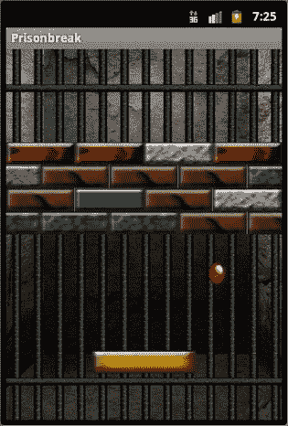

# 街机风格游戏

当下最流行的游戏风格之一便是街机风格。街机游戏作为一种风格，实际上是融合了多种不同游戏类型的混合体。要理解什么是街机风格的游戏，让我们先简要回顾一下街机游戏的历史。

毫无疑问，你曾亲眼或在网上见过像《*吃豆人*》或《*蜈蚣*》这样的老式街机游戏柜。在早期，游戏硬件价格昂贵，而且通常是为每款游戏专门定制的。开发者与硬件创造者紧密合作，由此诞生了体积庞大、像家具一样的游戏机柜。

这些大型的一体式机柜通常包含显示器、控制器以及运行游戏所需的所有内部电子元件。然而，由于这些设备价格高得令人望而却步，普通人根本负担不起；因此它们通常只出现在游戏厅里。机柜上装有投币器，人们急切地投入硬币来玩最新的游戏。因此，“街机”游戏风格这一名称的根源，就来自于最初玩这些游戏的场所。

街机老板们很快明白了一件事：为了收回购买游戏机的高昂成本，他们需要尽可能多的玩家来玩每一款游戏。如今，人们可以一次连续玩一款游戏几个小时。我就曾在《*最终幻想*》游戏上投入过 10 小时、20 小时甚至 30 小时。这种硬核游戏玩法对每次只收 0.25 美元的街机老板来说，无疑是灭顶之灾。

街机老板和游戏开发者迅速意识到，三分钟是黄金时长。在平均三分钟的游戏时间里，玩家觉得自己的投入物有所值，而街机老板也能让大量玩家轮番体验游戏。

于是，游戏开发者必须创造出这样一种游戏：玩家可以随时上手，无需任何指导就能理解玩法和目标，并且能在三分钟后停止游玩。由此，开发那些令人上瘾、目标明确且能在相对短时间内玩完的游戏便应运而生。这就是街机风格游戏的起源。

在本章的下一节中，我们将讨论你将在本书中开发的游戏。

## 你的游戏：越狱

在本书剩余的章节中，你将学习如何创建一款名为“越狱”的街机风格游戏。“越狱”是一款球拍游戏，涉及将球的轨迹偏转并击向一堵砖墙，以击碎它们。该游戏大致基于 Atari 公司的游戏《*打砖块*》。《*打砖块*》在街机游戏早期极具影响力，其令人上瘾的玩法和易于理解的概念使其成为本书的完美范例。

“越狱”包含了构建良好游戏开发知识库所需的所有元素。你将学习多边形和纹理渲染、基本游戏物理以及碰撞检测。毫无疑问，你会在其他游戏中使用到所有这些概念。

本书将按照自然顺序，从头到尾引导你完成“越狱”游戏的开发过程。你将获得创建游戏并在 Android 设备上运行它的代码示例和解释。到本书结束时，你将掌握所需的知识，能够轻松地基于相同概念创建其他游戏。图 2-1 展示了完成版“越狱”的一个游戏场景。

图 2-1。完成版“越狱”的截图

为了让你清楚了解后续内容，下一节将列出剩余章节的内容和目标。

## 本书内容……

本书共有八章。虽然整本书看起来篇幅可能不长，但它将包含大量有用信息。每一章都旨在让你掌握完成“越狱”游戏所需的一项关键技能。以下是对我们剩余六章目标的简要概述。

