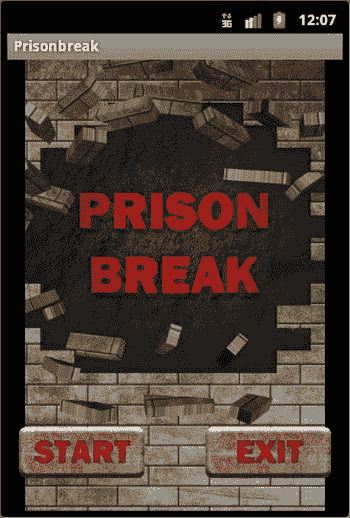
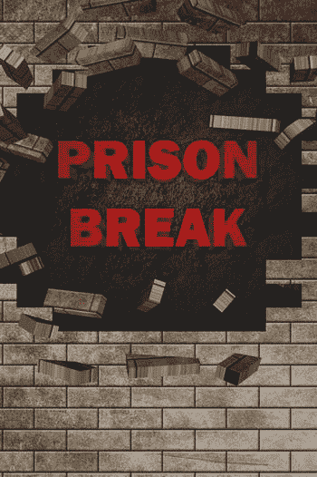
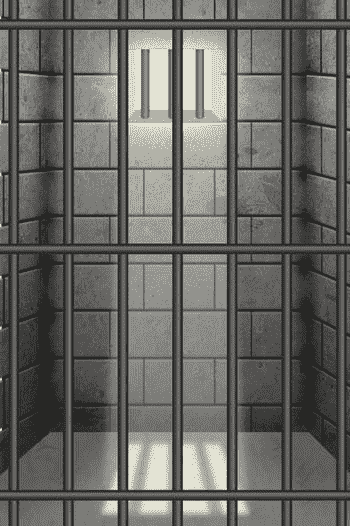
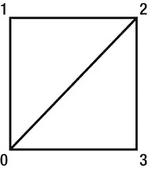
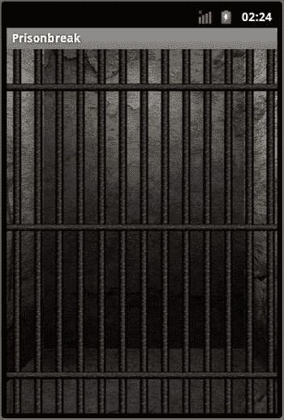
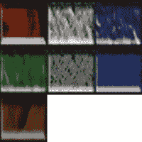
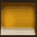
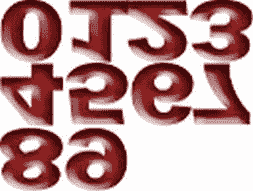

# 第 3 章：创建菜单

在本章中，您将为《越狱》游戏创建一个由两部分组成的菜单屏幕。菜单屏幕（如图 3-1 所示）由两个不同的“屏幕”组成，总共包含五个不同的图像。



图 3-1. 《越狱》菜单屏幕

在下一节中，您将了解为本章提供的代码需要做哪些准备。

## 准备工作

在开始应用本章的代码之前，您需要做两件事来准备。首先，创建一个名为 `prisonbreak` 的新 Android 项目。该项目将保存本书中使用的所有代码和图像。

其次，为您的《越狱》游戏收集或创建一些图像。在本章中，您总共需要五个图像：一个启动画面、两个不同的开始按钮状态和两个不同的退出按钮状态。我使用的图像如图 3-2 至图 3-6 所示。



图 3-2. prisonbreaksplash.png


图 3-3. startbtn.png


图 3-4. `startbtndown.png`


图 3-5. `exitbtn.png`


图 3-6. `exitbtndown.png`

如果你从未在 Android 中处理过图形或图像，我有几个宝贵的建议。首先，图像处理有两种方式：通过 Android SDK 原生方式（本章介绍），或使用 OpenGL ES（后续章节介绍）。这两种方法在图像的存储和处理方式上略有不同。

另一个重要提示是：图像名称必须全部小写，这是处理 Android 图像时的通用规则。如果在图像名称中使用大写字母或驼峰式命名，Android 将无法识别这些图像。

**注意** 凡事都有例外，这条规则也不例外。只有当图像存储在给定的 Android 项目结构内（即 `res` 文件夹）时，才必须使用小写名称。如果将图像存储在 Android 项目结构外部的压缩文件中，并通过自定义文件读取器进行读取，则可以随意使用大小写命名。不过，这个问题超出了本书的讨论范围。

本章中的五张图像应保存在 `res/drawable-hdpi` 文件夹中，因为它们将通过标准的 Android SDK 方法读取。

在下一节中，你将创建显示主菜单所需的文件。

## 创建启动画面和主菜单

《越狱》的主菜单由一个淡出至菜单画面的启动画面组成。菜单画面包含“开始”和“退出”按钮。

对于《越狱》，启动画面和主菜单背景将使用同一张图像（参见图 3-2）。这样会产生按钮淡入背景的效果。这是一种比静态画面更棒的视觉效果。

### `PrisonbreakActivity`

你需要处理的第一个文件是 `PrisonbreakActivity`。这是创建项目时生成的主活动。清单 3-1 展示了 `PrisonbreakActivity.java` 的代码。

`清单 3-1. PrisonbreakActivity.java`

```
package com.jfdimarzio;

import android.app.Activity;
import android.content.Context;
import android.content.Intent;
import android.os.Bundle;
import android.os.Handler;
import android.view.WindowManager;

public class PrisonbreakActivity extends Activity {
    /** 当活动首次创建时调用 */
    @Override
    public void onCreate(Bundle savedInstanceState) {
        PBGameVars.display = ((WindowManager) getSystemService(Context.WINDOW_SERVICE)).getDefaultDisplay();
        super.onCreate(savedInstanceState);
        /*显示启动画面图像*/
        setContentView(R.layout.splashscreen);
        /*在延迟线程中启动启动画面和主菜单*/
        PBGameVars.context = this;
        new Handler().postDelayed(new Thread() {
            @Override
            public void run() {
                Intent mainMenu = new Intent(PrisonbreakActivity.this, PBMainMenu.class);
                PrisonbreakActivity.this.startActivity(mainMenu);
                PrisonbreakActivity.this.finish();
                overridePendingTransition(R.layout.fadein, R.layout.fadeout);
            }
        }, PBGameVars.GAME_THREAD_DELAY);
    }
}
```

查看 `PrisonbreakActivity` 的代码，你会发现它引用了其他几个文件。第一个是位于 `PBGameVars.java` 类中的多个共享变量。在你的项目中创建一个同名的新类，并添加以下公共变量。（请注意，随着本书内容的深入，你还需要多次向这个类中添加内容。）

```
public static Display display;
public static Context context;
public static final int GAME_THREAD_DELAY = 3000;
public static final int MENU_BUTTON_ALPHA = 0;
public static final boolean HAPTIC_BUTTON_FEEDBACK = true;
```

接下来，`PrisonbreakActivity` 引用了一个位于 `res/layouts/splashscreen` 的布局文件。清单 3-2 展示了 `splashscreen.xml` 的内容。

`清单 3-2. splashscreen.xml`


```xml

<?xml version = "1.0" encoding = "utf-8"?>

<FrameLayout
    xmlns:android = "http://schemas.android.com/apk/res/android"
    android:layout_width = "match_parent"
    android:layout_height = "match_parent">

    <ImageView
        android:id = "@+id/splashScreenImage"
        android:src = "@drawable/prisonbreaksplash"
        android:layout_width = "match_parent"
        android:layout_height = "match_parent">
    </ImageView>

    <TextView
        android:text = "game by: j.f.dimarzio graphics by: ben eagel"
        android:id = "@+id/creditsText"
        android:layout_gravity = "center_horizontal|bottom"
        android:layout_height = "wrap_content"
        android:layout_width = "wrap_content">
    </TextView>

</FrameLayout>
```

下一个由`PrisonbreakActivity`调用的文件是`PBMainMenu.java`。我们暂时跳过这个文件，稍后再回来处理。首先，让我们看看`PrisonbreakActivity.java`中使用的另外两个布局。

查看主活动中调用的`overridePendingTransition()`。这个调用接收两个过渡布局。第一个布局定义了启动画面的淡入效果，第二个定义了淡出到菜单屏幕的效果。清单 3-3 和清单 3-4 分别包含了`fadein.xml`和`fadeout.xml`的代码。虽然它们乍看起来相同，但存在一些关键差异。

根本区别在于：淡入时使用了加速插值器，而淡出时使用了减速插值器。

**清单 3-3. fadein.xml**

```xml
<?xml version = "1.0" encoding = "utf-8"?>
<alpha xmlns:android = "http://schemas.android.com/apk/res/android"
    android:interpolator = "@android:anim/accelerate_interpolator"
    android:fromAlpha = "0.0"
    android:toAlpha = "1.0"
    android:duration = "1000" />
```

**清单 3-4. fadeout.xml**

```xml
<?xml version = "1.0" encoding = "utf-8"?>
<alpha xmlns:android = "http://schemas.android.com/apk/res/android"
    android:interpolator = "@android:anim/decelerate_interpolator"
    android:fromAlpha = "1.0"
    android:toAlpha = "0.0"
    android:duration = "1000" />
```

`PrisonbreakActivity`显示启动画面图像，然后将该图像淡入到`PBMainMenu.java`调用中。让我们看看`PBMainMenu.java`中的内容。

## PBMainMenu

`PBMainMenu`控制主游戏循环的启动和退出；因此，它需要显示两个按钮：开始按钮和退出按钮。清单 3-5 展示了`PBMainMenu.java`的当前代码（你将在下一章中向此代码添加内容）。

请注意，`PBMainMenu`是一个新的活动，必须在项目的`AndroidManifest`中将其定义为活动。

**清单 3-5. PBMainMenu.java**

```java
public static Display display;
public static Context context;
public static final int GAME_THREAD_DELAY = 3000;

package com.jfdimarzio;

import android.app.Activity;
import android.content.Intent;
import android.os.Bundle;
import android.view.View;
import android.view.View.OnClickListener;
import android.widget.ImageButton;

public class PBMainMenu extends Activity {
    /** Called when the activity is first created. */
    final PBGameVars engine = new PBGameVars();

    @Override
    public void onCreate(Bundle savedInstanceState) {
        super.onCreate(savedInstanceState);
        setContentView(R.layout.main);
        PBGameVars.context = getApplicationContext();

        /** Set menu button options */
        ImageButton start = (ImageButton)findViewById(R.id.btnStart);
        ImageButton exit = (ImageButton)findViewById(R.id.btnExit);
        start.getBackground().setAlpha(PBGameVars.MENU_BUTTON_ALPHA);
        start.setHapticFeedbackEnabled(PBGameVars.HAPTIC_BUTTON_FEEDBACK);
        exit.getBackground().setAlpha(PBGameVars.MENU_BUTTON_ALPHA);
        exit.setHapticFeedbackEnabled(PBGameVars.HAPTIC_BUTTON_FEEDBACK);
        exit.setOnClickListener(new OnClickListener(){
            @Override
            public void onClick(View v) {
                int pid = android.os.Process.myPid();
                android.os.Process.killProcess(pid);
            }
        });
    }
}
```

与`PrisonbreakActivity`类似，`PBMainMenu`也使用了三个不同的布局文件。第一个是`main.xml`。这个布局定义了玩家看到的主菜单屏幕，其中包含开始按钮和退出按钮。清单 3-6 展示了`main.xml`布局。

**清单 3-6. main.xml**

```


```xml
<?xml version = "1.0" encoding = "utf-8"?>

<RelativeLayout xmlns:android = "http://schemas.android.com/apk/res/android"
    android:orientation = "vertical"
    android:layout_width = "match_parent"
    android:layout_height = "match_parent"
    >
    <ImageView android:id = "@ + id/mainMenuImage"
        android:src = "@drawable/prisonbreaksplash"
        android:layout_width = "match_parent"
        android:layout_height = "match_parent">
    </ImageView>
    <RelativeLayout
        android:id = "@ + id/buttons"
        android:layout_width = "match_parent"
        android:layout_height = "wrap_content"
        android:orientation = "horizontal"
        android:layout_alignParentBottom = "true"
        android:layout_marginBottom = "20dp">
        <ImageButton
            android:id = "@ + id/btnStart"
            android:clickable = "true"
            android:layout_alignParentLeft = "true"
            android:layout_width = "wrap_content"
            android:src = "@drawable/startselector"
            android:layout_height = "wrap_content" >
        </ImageButton>
        <ImageButton
            android:id = "@ + id/btnExit"
            android:layout_width = "wrap_content"
            android:src = "@drawable/exitselector"
            android:layout_height = "wrap_content"
            android:layout_alignParentRight = "true"
            android:clickable = "true" >
        </ImageButton>
    </RelativeLayout>
</RelativeLayout>
```

`PBMainMenu` 还调用了两个名为选择器的布局文件。这些文件定义了当玩家选择“开始”按钮或“退出”按钮时的行为。对于《越狱》游戏，你希望将可见的“开始”和“退出”按钮替换为看起来像是玩家用手指按下的按钮。选择器布局负责处理这些图像的切换。`清单 3-7` 显示了退出选择器的内容，`清单 3-8` 显示了开始选择器的内容。

`清单 3-7. exitselector.xml`

```xml
<?xml version = "1.0" encoding = "utf-8"?>
<selector
    xmlns:android = "http://schemas.android.com/apk/res/android">
    <item android:state_pressed = "true" android:drawable = "@drawable/exitbtndown" />
    <item android:drawable = "@drawable/exitbtn" />
</selector>
```

`清单 3-8. startselector.xml`

```xml
<?xml version = "1.0" encoding = "utf-8"?>
<selector
    xmlns:android = "http://schemas.android.com/apk/res/android">
    <item android:state_pressed = "true" android:drawable = "@drawable/startbtndown" />
    <item android:drawable = "@drawable/startbtn" />
</selector>
```

现在你应该能够编译并运行代码了。运行时，你会看到一个启动画面，随后淡出为菜单。触摸“退出”按钮会终止主活动并退出游戏。然而目前，触摸“开始”按钮没有任何反应。

## 总结

在本章中，你为第一个游戏项目添加了九个代码文件和五个图像。这些文件组合在一起，创建了一个引人入胜且专业的菜单界面。现在你已拥有一个可用的启动画面和一个包含两个选项的基本菜单系统。

在下一章中，你将向“开始”按钮添加代码，以启动主游戏循环。同时还会将游戏背景图像添加到屏幕上。

# 第 4 章：绘制背景

在上一章中，你创建并完善了《越狱》的主菜单。你应该已经在 Android 模拟器或基于 Android 的手机上以调试模式编译并运行了代码，并看到了一个功能完整的菜单界面。主菜单的“退出”按钮已连接到终止游戏进程的逻辑。然而截至目前，“开始”按钮尚未连接到任何代码。

在本章中，你将编写“开始”按钮的代码，并为《越狱》创建背景。为了将游戏背景绘制到屏幕上，你将使用 OpenGL ES 调用。在之前的章节中，你使用了 Android SDK 方法来显示菜单界面和按钮等图形。接下来，你将进入 OpenGL ES 的领域。

让我们从编写主菜单中“开始”按钮激活的代码开始。

## 开始游戏

玩家通过主菜单上的“开始”按钮来启动游戏。启动游戏时，会启动一个新的 Android Activity，该 Activity 控制所有游戏功能。为什么游戏要作为另一个新的 Activity 启动？


游戏作为另一个 `Activity` 启动，这样作为游戏开发者的你便能更灵活地控制游戏的执行方式。如果你想在主菜单中添加与游戏无直接关联的其他功能（例如配置器或计分板），这种方法可以有效避免游戏因冗余代码而变得臃肿。

`清单 4-1` 展示了你之前在第 3 章开始编写的 `PBMainMenu` 代码。其中加粗的代码是新添加的，用于启动 `PBGame Activity`。请将此代码添加到你的 `PBMainMenu` 中。接下来你将创建 `PBGame Activity`。

```
Listing 4-1\. PBMainMenu.java
package com.jfdimarzio;
import android.app.Activity;
import android.content.Intent;
import android.os.Bundle;
import android.view.View;
import android.view.View.OnClickListener;
import android.widget.ImageButton;
public class PBMainMenu extends Activity {
/** Called when the activity is first created. */
final PBGameVars engine = new PBGameVars();
@Override
public void onCreate(Bundle savedInstanceState) {
super.onCreate(savedInstanceState);
setContentView(R.layout.main);
PBGameVars.context = getApplicationContext();
/** Set menu button options */
ImageButton start = (ImageButton)findViewById(R.id.btnStart);
ImageButton exit = (ImageButton)findViewById(R.id.btnExit);
start.getBackground().setAlpha(PBGameVars.MENU_BUTTON_ALPHA);
start.setHapticFeedbackEnabled(PBGameVars.HAPTIC_BUTTON_FEEDBACK);
exit.getBackground().setAlpha(PBGameVars.MENU_BUTTON_ALPHA);
exit.setHapticFeedbackEnabled(PBGameVars.HAPTIC_BUTTON_FEEDBACK);
start.setOnClickListener(new OnClickListener(){
@Override
public void onClick(View v) {
/** Start Game!!!! */
Intent game = new Intent(getApplicationContext(),PBGame.class);
PBMainMenu.this.startActivity(game);
}
});
exit.setOnClickListener(new OnClickListener(){
@Override
public void onClick(View v) {
int pid= android.os.Process.myPid();
android.os.Process.killProcess(pid);
}
});
}
}
```

请注意，现在当你点击 `Start` 按钮时，代码指示 `PBMainMenu` 启动 `PBGame Activity`。你目前还没有 `PBGame`，让我们创建一个。

在你的 `Prison Break` 项目中创建一个名为 `PBGame` 的新 `Activity`。就代码而言，`PBGame` 相当简单。`PBGame` 会将 `Activity` 的内容视图设置为游戏渲染器，并控制 `onPause` 和 `onResume` 事件。

**注意** 请记住，当我提到 `onPause` 和 `onResume` 时，这些并非游戏功能函数，而是 Android 在暂停或恢复你的 `Activity` 时调用的方法。

你的新 `PBGame Activity` 中的代码应类似于 `清单 4-2` 所示。

```
Listing 4-2\. PBGame.java
package com.jfdimarzio;
import android.app.Activity;
import android.os.Bundle;
import android.view.MotionEvent;
public class PBGame extends Activity {
final PBGameVars gameEngine = new PBGameVars();
private PBGameView gameView;
@Override
public void onCreate(Bundle savedInstanceState) {
superonCreate(savedInstanceState);
gameView = new PBGameView(this);
setContentView(gameView);
}
@Override
protected void onResume() {
superonResume();
gameView.onResume();
}
@Override
protected void onPause() {
superonPause();
gameView.onPause();
}
}
```

请注意，`onCreate()` 方法将 `Activity` 的内容视图设置为 `PBGameView` 的新实例。`PBGameView` 是一个扩展了 `GLSurfaceView` 的新类。本章下一节将在你创建 `PBGameView` 时介绍 `GLSurfaceView`。

## 创建 SurfaceView 和 Renderer

在本节中，你将创建游戏的 `SurfaceView` 和 `Renderer`。`PBGameView` 是一个简单的 Android 类，扩展了 OpenGL 的 `GLSurfaceView`。

如果你从未使用过 OpenGL ES 进行开发，可以将 `GLSurfaceView` 视为 OpenGL 绘制游戏的画布。`GLSurfaceView` 是 Android 显示在屏幕上的内容。但它无法单独工作。`GLSurfaceView` 需要一个对应的 `GLSurfaceView Renderer` 来将游戏渲染到该表面上。


```markdown
从 `GLSurfaceView` 开始，创建一个名为 `PBGameView` 的新类，并继承 `GLSurfaceView`，如代码清单 4-3 所示。

`代码清单 4-3. PBGameView.java`

```
package com.jfdimarzio;

import android.content.Context;
import android.opengl.GLSurfaceView;

public class PBGameView extends GLSurfaceView {

    private PBGameRenderer renderer;

    public PBGameView(Context context) {
        super(context);
        renderer = new PBGameRenderer();
        this.setRenderer(renderer);
    }
}
```

这是一个相当小的类。你可以看到，该类中唯一构造函数的目的就是创建渲染器（`PBGameRenderer`）的实例。这里没有什么特别的，所以我们继续创建渲染器。

**注意** 在创建 `PBGameRenderer` 之前，请将以下内容添加到你的 `PBGameVars` 中：`public static final int GAME_THREAD_FPS_SLEEP = (1000/60);`

在你的 Prison Break 项目中创建一个名为 `PBGameRenderer` 的新类。这个类需要实现 `GLSurfaceView.Renderer` 接口，如代码清单 4-4 所示。

`代码清单 4-4. PBGameRenderer.java`

```
package com.jfdimarzio;

import javax.microedition.khronos.egl.EGLConfig;
import javax.microedition.khronos.opengles.GL10;
import android.opengl.GLSurfaceView.Renderer;

public class PBGameRenderer implements Renderer{

    private long loopStart = 0;
    private long loopEnd = 0;
    private long loopRunTime = 0 ;

    @Override
    public void onDrawFrame(GL10 gl) {
        // TODO Auto-generated method stub
        loopStart = System.currentTimeMillis();
        // TODO Auto-generated method stub
        try {
            if (loopRunTime < PBGameVars.GAME_THREAD_FPS_SLEEP){
                Thread.sleep(PBGameVars.GAME_THREAD_FPS_SLEEP - loopRunTime);
            }
        } catch (InterruptedException e) {
            // TODO Auto-generated catch block
            e.printStackTrace();
        }
        gl.glClear(GL10.GL_COLOR_BUFFER_BIT | GL10.GL_DEPTH_BUFFER_BIT);
        loopEnd = System.currentTimeMillis();
        loopRunTime = ((loopEnd - loopStart));
    }

    @Override
    public void onSurfaceChanged(GL10 gl, int width, int height) {
        // TODO Auto-generated method stub
        gl.glViewport(0, 0, width,height);
        gl.glMatrixMode(GL10.GL_PROJECTION);
        gl.glLoadIdentity();
        gl.glOrthof(0f, 1f, 0f, 1f, -1f, 1f);
    }

    @Override
    public void onSurfaceCreated(GL10 gl, EGLConfig arg1) {
        // TODO Auto-generated method stub
        gl.glEnable(GL10.GL_TEXTURE_2D);
        gl.glClearDepthf(1.0f);
        gl.glEnable(GL10.GL_DEPTH_TEST);
        gl.glDepthFunc(GL10.GL_LEQUAL);
    }
}
```

渲染器有三个需要重写的方法：`onSurfaceCreated()`、`onSurfaceChanged()` 和 `onDrawFrame()`。作为开发者，你不会在代码中直接调用这些方法。`GLSurfaceView` 负责在正确的时间调用所有这些方法。

简而言之，`onSurfaceCreated()` 充当渲染器的构造函数，在渲染器创建时被调用。如果一切运行顺利，这个方法应该只被调用一次；因此，所有初始化设置代码都应放在这个方法中。目前，在初始化例程中只调用了 OpenGL 函数来设置纹理和深度缓冲区。

`onSurfaceChanged()` 方法在表面发生变化时被调用。但不要将其与 `onDrawFrame()` 混淆。绘制一帧并不构成表面变化。表面变化更像是屏幕方向改变或类似的破坏性事件。`onSurfaceChanged()` 方法也会在渲染器首次被调用时（完成设置后）执行。

在 `onSurfaceChanged()` 中，你需要设置游戏视口，并调用 OpenGL 的渲染管线来绘制对象。游戏视口是游戏世界中被绘制到屏幕上的区域。可以把视口想象成相机的取景器。当你将相机对准某个方向时，你只能看到整个世界的一小部分。同样地，使用 OpenGL 创建游戏时：你可能会在游戏世界中创建超出当前视野的更多“对象”。视口告诉 OpenGL 你期望看到哪些内容被渲染到显示屏上。

**注意** 使用传递给 `onSurfaceChanged()` 的宽度和高度变量时要小心。当 `GLSurfaceView` 调用 `onSurfaceChanged()` 时，传入的宽度和高度不一定是屏幕的真实宽度和高度。要获取屏幕的完整宽度和高度，请使用 `context.display.width` 和 `context.display.height`。

你应该将所有每帧都要调用的代码放在 `onDrawFrame()` 中。这包括帧率计算器、绘制游戏所有对象的代码、碰撞检测和清理工作。在代码清单 4-4 中，每帧运行的代码只有用于控制帧率的线程调度以及清除缓冲区的 OpenGL 方法。

在下一节中，你将创建绘制背景的类；然后从 `onDrawFrame()` 中调用该类，将背景绘制到屏幕上。

## 创建背景类

在 Prison Break 中，你将创建一个类来处理用于绘制游戏背景的索引、顶点和纹理的初始化设置。我们后续添加到游戏中的每个新元素都遵循这个类的格式。你使用的背景图片应复制到项目中的 `res/drawable-nodpi` 文件夹，并命名为 `bg1.png`。将以下变量添加到你的 `PBGameVars` 文件中，以便后续引用该图片。

```
public static final int BACKGROUND = R.drawable.bg1;
```

我正在使用的图片如 图 4-1 所示。



图 4-1. bg1.png，Prison Break 的背景图片

现在该设置创建背景的类了。在你的 Prison Break 项目中创建一个名为 `PBBackground.java` 的新类。这个类需要三个方法：构造函数、`draw()` 方法和 `loadTexture()` 方法。

构造函数将顶点、索引和纹理数组加载到缓冲区中。由于这是决定背景渲染到屏幕上时外观的关键步骤，让我们花点时间讨论这些数组是什么以及它们是如何使用的。

顶点数组用于定义背景图片所映射到的多边形的角。这些角使用笛卡尔坐标系中的 x、y、z 轴定义。因此，在创建一个正方形时，你需要分别提供左下角、左上角、右上角和右下角的 x、y、z 坐标。

现在，我需要澄清上一段中可能存在的混淆。虽然最终绘制的多边形是正方形（或矩形），但 OpenGL 实际上绘制的是直角三角形。两个三角形并排放置形成一个正方形。索引缓冲区的目的是告诉 OpenGL 三角形边的索引顺序，从而告诉 OpenGL 顶点缓冲区中各角的绘制顺序。换句话说，如果索引缓冲区是 0, 1, 2, 0, 2, 3——就像 图 4-2 中的三角形，那么顶点缓冲区中的角依次是左下角、左上角、右上角和右下角。



图 4-2. 索引三角形

最后，纹理数组告诉 OpenGL 纹理（或图片）的哪些角映射到顶点的特定角。由于纹理映射中没有深度概念，纹理数组只有 x 和 y 坐标。
```


**提示** 如果你的三维多边形顶点使用了 z 坐标，并且你想将纹理映射到这些顶点上，你仍然只需通过 x 和 y 坐标提供纹理的角点即可。实际上，你的纹理数组很可能会针对每个顶点重复使用。当处理直线多边形时，即使顶点会变化，你的纹理数组很可能保持不变。

该类的 `draw()` 方法会在每一帧被调用。该方法利用渲染器中修改的矩阵信息来绘制背景。它还包含一些设置，用于剔除不被渲染的多边形面。

最后一个方法 `loadTexture()` 包含一些调用，用于接收你传入的图像，并将该图像作为纹理加载到 OpenGL 中。该类在 `draw()` 方法中使用这个纹理。清单 4-5 展示了 `PBBackground` 类的代码。

`清单 4-5. PBBackground 类`

```
package com.jfdimarzio;

import java.io.IOException;
import java.io.InputStream;
import java.nio.ByteBuffer;
import java.nio.ByteOrder;
import java.nio.FloatBuffer;
import javax.microedition.khronos.opengles.GL10;
import android.content.Context;
import android.graphics.Bitmap;
import android.graphics.BitmapFactory;
import android.opengl.GLUtils;

public class PBBackground {

    private FloatBuffer vertexBuffer;
    private FloatBuffer textureBuffer;
    private ByteBuffer indexBuffer;
    private int[] textures = new int[1];
    private float vertices[] = {
            0.0f, 0.0f, 0.0f,
            1.0f, 0.0f, 0.0f,
            1.0f, 1.0f, 0.0f,
            0.0f, 1.0f, 0.0f,
    };
    private float texture[] = {
            0.0f, 0.0f,
            1.0f, 0f,
            1f, 1.0f,
            0f, 1f,
    };
    private byte indices[] = {
            0,1,2,
            0,2,3,
    };

    public PBBackground() {
        ByteBuffer byteBuf = ByteBuffer.allocateDirect(vertices.length * 4);
        byteBuf.order(ByteOrder.nativeOrder());
        vertexBuffer = byteBuf.asFloatBuffer();
        vertexBuffer.put(vertices);
        vertexBuffer.position(0);

        byteBuf = ByteBuffer.allocateDirect(texture.length * 4);
        byteBuf.order(ByteOrder.nativeOrder());
        textureBuffer = byteBuf.asFloatBuffer();
        textureBuffer.put(texture);
        textureBuffer.position(0);

        indexBuffer = ByteBuffer.allocateDirect(indices.length);
        indexBuffer.put(indices);
        indexBuffer.position(0);
    }

    public void draw(GL10 gl) {
        gl.glBindTexture(GL10.GL_TEXTURE_2D, textures[0]);
        gl.glFrontFace(GL10.GL_CCW);
        gl.glEnable(GL10.GL_CULL_FACE);
        gl.glCullFace(GL10.GL_BACK);
        gl.glEnableClientState(GL10.GL_VERTEX_ARRAY);
        gl.glEnableClientState(GL10.GL_TEXTURE_COORD_ARRAY);
        gl.glVertexPointer(3, GL10.GL_FLOAT, 0, vertexBuffer);
        gl.glTexCoordPointer(2, GL10.GL_FLOAT, 0, textureBuffer);
        gl.glDrawElements(GL10.GL_TRIANGLES, indices.length, GL10.GL_UNSIGNED_BYTE, indexBuffer);
        gl.glDisableClientState(GL10.GL_VERTEX_ARRAY);
        gl.glDisableClientState(GL10.GL_TEXTURE_COORD_ARRAY);
        gl.glDisable(GL10.GL_CULL_FACE);
    }

    public void loadTexture(GL10 gl,int texture, Context context) {
        InputStream imagestream = context.getResources().openRawResource(texture);
        Bitmap bitmap = null;
        try {
            bitmap = BitmapFactory.decodeStream(imagestream);
        }catch(Exception e){
        }finally {
            try {
                imagestream.close();
                imagestream = null;
            } catch (IOException e) {
            }
        }
        gl.glGenTextures(1, textures, 0);
        gl.glBindTexture(GL10.GL_TEXTURE_2D, textures[0]);
        gl.glTexParameterf(GL10.GL_TEXTURE_2D, GL10.GL_TEXTURE_MIN_FILTER, GL10.GL_NEAREST);
        gl.glTexParameterf(GL10.GL_TEXTURE_2D, GL10.GL_TEXTURE_MAG_FILTER, GL10.GL_LINEAR);
        GLUtils.texImage2D(GL10.GL_TEXTURE_2D, 0, bitmap, 0);
        bitmap.recycle();
    }
}
```

在本章最后一部分，你将使用 `PBBackground` 类，并在 `PBGameRenderer` 中调用它，从而使用 OpenGL 将背景绘制到屏幕上。

## 绘制背景

在本节中，你将创建一个背景的新实例，并在 `PBGameRenderer` 中调用它。绘制背景的步骤如下：

1.  实例化一个新的 `PBBackground`。这无需过多解释；在使用背景类之前，你必须先实例化它。
2.  将你的 `bg1.png` 图像加载为背景纹理。由于图像只需加载一次，因此你在 `PBGameRenderer` 的 `onSurfaceCreated()` 方法中调用背景类的 `loadTexture()` 方法。
3.  在 `PBGameRenderer` 中创建一个新方法，用于调整背景多边形的大小。如果不调整多边形的大小，它们将无法与你在屏幕上期望的大小匹配。此步骤可能需要一些微调才能达到理想效果。
4.  在 `onDrawFrame()` 中调用这个新方法。这会将背景绘制到每一帧的屏幕上。如果不在此处调用该方法，它将不会被渲染。

清单 4-6 展示了 `PBGameRenderer` 的代码；其中用于绘制背景的新代码以粗体显示。

`清单 4-6. 调用绘制背景功能的 PBGameRenderer`

```
package com.jfdimarzio;

import javax.microedition.khronos.egl.EGLConfig;
import javax.microedition.khronos.opengles.GL10;
import android.opengl.GLSurfaceView.Renderer;

public class PBGameRenderer implements Renderer{

    private PBBackground background = new PBBackground();
    private long loopStart = 0;
    private long loopEnd = 0;
    private long loopRunTime = 0 ;

    @Override
    public void onDrawFrame(GL10 gl) {
        // TODO Auto-generated method stub
        loopStart = System.currentTimeMillis();
        // TODO Auto-generated method stub
        try {
            if (loopRunTime < PBGameVars.GAME_THREAD_FPS_SLEEP){
                Thread.sleep(PBGameVars.GAME_THREAD_FPS_SLEEP - loopRunTime);
            }
        } catch (InterruptedException e) {
            // TODO Auto-generated catch block
            e.printStackTrace();
        }

        gl.glClear(GL10.GL_COLOR_BUFFER_BIT | GL10.GL_DEPTH_BUFFER_BIT);
        drawBackground1(gl);
        loopEnd = System.currentTimeMillis();
        loopRunTime = ((loopEnd - loopStart));
    }

    @Override
    public void onSurfaceChanged(GL10 gl, int width, int height) {
        // TODO Auto-generated method stub
        gl.glViewport(0, 0, width,height);
        gl.glMatrixMode(GL10.GL_PROJECTION);
        gl.glLoadIdentity();
        gl.glOrthof(0f, 1f, 0f, 1f, -1f, 1f);
    }

    @Override
    public void onSurfaceCreated(GL10 gl, EGLConfig arg1) {
        // TODO Auto-generated method stub
        gl.glEnable(GL10.GL_TEXTURE_2D);
        gl.glClearDepthf(1.0f);
        gl.glEnable(GL10.GL_DEPTH_TEST);
        gl.glDepthFunc(GL10.GL_LEQUAL);
        background.loadTexture(gl,PBGameVars.BACKGROUND, PBGameVars.context);
    }

    private void drawBackground1(GL10 gl){
        gl.glMatrixMode(GL10.GL_MODELVIEW);
        gl.glLoadIdentity();
        gl.glPushMatrix();
        gl.glScalef(1f, 1f, 1f);
        background.draw(gl);
        gl.glPopMatrix();
    }
}
```

编译并运行你的项目。在主菜单中，点击“开始”按钮。你应该会看到背景，如图 4-3 所示。



图 4-3. 渲染后的背景

在结束本章之前，让我们简要谈谈 OpenGL 的矩阵模式。当你在 `PBGameRenderer` 中看到这些调用后，可能会对它们的作用感到困惑。OpenGL 有三种模式，你可以在这些模式下修改渲染管线中的不同矩阵。这三种模式（以及矩阵）分别是 `ModelView`、`Texture` 和 `Projection`。在这些模式下工作需要进行一些抽象思考，但理解起来并不太难。

将 OpenGL 置于 `ModelView` 模式会加载 `ModelView` 矩阵。`ModelView` 矩阵控制着 OpenGL 世界中的每一组多边形。

另一方面，`Texture` 模式会加载世界中所有纹理的矩阵。请记住，当你在 OpenGL 世界中将一个纹理与一组顶点关联时，它们仍然包含在两个不同的矩阵中。这里的措辞很重要。如果屏幕上有 50 个对象，每个都有纹理，将 OpenGL 置于 `Texture` 模式会赋予你访问所有 50 个纹理的权限——而不仅仅是那个你认为要处理的对象。

`Projection` 模式加载控制 OpenGL 摄像头的矩阵。


**注意**：OpenGL 实际上并没有真正理解或拥有“摄像机”的概念。大多数人明白摄像机用于创建视图和渲染器，因此很容易将投影矩阵中的操作等同于常见的图形学中的摄像机概念。

在每个矩阵模式下，都有特定的命令可用于操作这些矩阵中的对象。

命令`glLoadIdentity()`告诉 OpenGL 加载一个未经修改的矩阵副本。例如，假设你处于纹理模式，并且你已经将一个红色纹理映射到一个正方形上。在纹理模式下，你将纹理交换为绿色纹理。调用`glLoadIdentity()`就会加载包含红色纹理的纹理矩阵。

命令`glPushMatrix()`执行类似的功能。该命令会为你提供一个当前矩阵及其当前状态的副本。因此，在上一个例子中，如果你调用`glPushMatrix()`而不是`glLoadIdentity()`，你将获得一个带有绿色纹理的矩阵副本。但是，如果在调用`glLoadIdentity()`之后调用`glPushMatrix()`，那么你将获得一个带有红色纹理的矩阵副本。

完成使用`glPushMatrix()`创建的矩阵副本后，使用`glPopMatrix()`将该副本写回 OpenGL 管道。如果你希望对矩阵进行多次变换，并且不想给主矩阵带来任何意外问题，这将非常有用。

最后，有三个命令可用于变换矩阵：`glScale`、`glTranslate` 和 `glRotate`。顾名思义，`glScale` 和 `glRotate` 分别用于缩放和旋转矩阵。再次强调，这些命令的效果在很大程度上取决于你所处的矩阵模式。`glTranslate` 命令根据给定的坐标集移动矩阵。这些命令将在后续章节中详细探讨。

**总结**

在本章中，你学习了如何使用 OpenGL 创建并绘制屏幕背景。你还学习了如何使用 OpenGL 渲染器和 SurfaceView。最后，你创建了处理 OpenGL 顶点、纹理和索引支持的类。

在下一章中，你将开始添加方块和玩家挡板。

## 第 5 章

创建玩家角色和障碍物

在上一章中，你学习了如何为你的游戏《越狱》添加背景图像。你创建了一个类，实例化后即可提供添加背景所需的所有资源。

在本章中，你将运用这些知识来创建游戏中的砖块、玩家挡板和球。这将提供你制作游戏所需的所有屏幕对象。

然而，在开始处理砖块、挡板或球之前，你需要做一些准备工作。

## 开始之前

你需要向项目中添加一些内容来为本章做准备，首先是你将用于砖块、挡板和球的图像。我为砖块使用的图像（游戏中可以使用多种不同的砖块）是一个*精灵表*，通过将所有不同砖块的图像包含在一个物理文件中，使你能够更轻松地使用不同的图像。

如果你从未使用过精灵表，它是一个单一图像文件，其中包含了特定动画或角色集的所有不同图像。例如，如果你正在制作一个主角可以横穿屏幕的游戏，那么该角色的精灵表将包含用于制作角色动画的所有帧。

同样，为了让你（游戏开发者）在游戏外观上有一些选择，球的图像也包含在一个精灵表中。这个精灵表有两个不同的球图像供你选择。

我在《越狱》中使用的砖块精灵表、玩家挡板和球精灵表的图像分别如图 5-1、图 5-2 和图 5-3 所示。



图 5-1. 砖块精灵表



图 5-2. 玩家挡板


图 5-3. 球精灵表

你可能注意到砖块和玩家挡板几乎是方形的，而不是长方形。这很好，因为这让你有机会使用 OpenGL 将图像拉伸成矩形。

接下来，你需要向 `PBGameVars` 文件中添加更多变量。将以下几行代码添加到你的 `PBGameVars` 中。暂时不要太担心你现在不理解的那些变量；我们会在使用它们时进行解释。

```
public static float playerBankPosX = -.73f;
public static int playerAction = 0;
public static final int PLAYER_MOVE_LEFT_1 = 1;
public static final int PLAYER_RELEASE = 3;
public static final int PLAYER_MOVE_RIGHT_1 = 4;
public static final float PLAYER_MOVE_SPEED = .2f;
public static final int PADDLE = R.drawable.goldbrick;
public static final int BRICK_BLUE = 1;
public static final int BRICK_BROWN = 2;
public static final int BRICK_DARK_GRAY = 3;
public static final int BRICK_GREEN = 4;
public static final int BRICK_LITE_GRAY = 5;
public static final int BRICK_PURPLE = 6;
public static final int BRICK_RED = 7;
public static final int BRICK_SHEET = R.drawable.bricksheet;
public static final int BALL_SHEET = R.drawable.ballsheet;
public static final float BALL_SPEED = 0.01f;
public static float ballTargetY = 0.01f;
public static float ballTargetX = -1.125f;
```

处理好这些准备工作后，是时候开始为游戏创建一些元素了。让我们从玩家挡板开始。

## 创建玩家挡板类

向你的项目中添加一个名为 `PBPlayer` 的新类。这个类看起来与你为背景创建的类 `PBBackground` 非常相似。该类包含一个构造函数、一个 `draw()` 方法和一个 `loadTexture()` 方法。`PBPlayer` 类的代码如清单 5-1 所示。

**清单 5-1. PBPlayer 类**

```
package com.jfdimarzio;

import java.io.IOException;
import java.io.InputStream;
import java.nio.ByteBuffer;
import java.nio.ByteOrder;
import java.nio.FloatBuffer;
import javax.microedition.khronos.opengles.GL10;
import android.content.Context;
import android.graphics.Bitmap;
import android.graphics.BitmapFactory;
import android.opengl.GLUtils;

public class PBPlayer {

    private FloatBuffer vertexBuffer;
    private FloatBuffer textureBuffer;
    private ByteBuffer indexBuffer;
    private int[] textures = new int[1];
    private float vertices[] = {
        0.0f, 0.0f, 0.0f,
        1.5f, 0.0f, 0.0f,
        1.5f, .25f, 0.0f,
        0.0f, .25f, 0.0f,
    };
    private float texture[] = {
        0.0f, 0.0f,
        1.0f, 0.0f,
        1.0f, 1.0f,
        0.0f, 1.0f,
    };
    private byte indices[] = {
        0,1,2,
        0,2,3,
    };

    public PBPlayer() {
        ByteBuffer byteBuf = ByteBuffer.allocateDirect(vertices.length * 4);
        byteBuf.order(ByteOrder.nativeOrder());
        vertexBuffer = byteBuf.asFloatBuffer();
        vertexBuffer.put(vertices);
        vertexBuffer.position(0);

        byteBuf = ByteBuffer.allocateDirect(texture.length * 4);
        byteBuf.order(ByteOrder.nativeOrder());
        textureBuffer = byteBuf.asFloatBuffer();
        textureBuffer.put(texture);
        textureBuffer.position(0);

        indexBuffer = ByteBuffer.allocateDirect(indices.length);
        indexBuffer.put(indices);
        indexBuffer.position(0);
    }

    public void draw(GL10 gl) {
        gl.glBindTexture(GL10.GL_TEXTURE_2D, textures[0]);
        gl.glFrontFace(GL10.GL_CCW);
        gl.glEnable(GL10.GL_CULL_FACE);
        gl.glCullFace(GL10.GL_BACK);
        gl.glEnableClientState(GL10.GL_VERTEX_ARRAY);
```


`gl.glEnableClientState(GL10.GL_TEXTURE_COORD_ARRAY);`

`gl.glVertexPointer(3, GL10.GL_FLOAT, 0, vertexBuffer);`

`gl.glTexCoordPointer(2, GL10.GL_FLOAT, 0, textureBuffer);`

`gl.glDrawElements(GL10.GL_TRIANGLES, indices.length, GL10.GL_UNSIGNED_BYTE, indexBuffer);`

`gl.glDisableClientState(GL10.GL_VERTEX_ARRAY);`

`gl.glDisableClientState(GL10.GL_TEXTURE_COORD_ARRAY);`

`gl.glDisable(GL10.GL_CULL_FACE);`

`}`

`public void loadTexture(GL10 gl, int texture, Context context) {`

`InputStream imagestream = context.getResources().openRawResource(texture);`

`Bitmap bitmap = null;`

`try {`

`bitmap = BitmapFactory.decodeStream(imagestream);`

`} catch (Exception e) {`

`} finally {`

`try {`

`imagestream.close();`

`imagestream = null;`

`} catch (IOException e) {`

`}`

`}`

`gl.glGenTextures(1, textures, 0);`

`gl.glBindTexture(GL10.GL_TEXTURE_2D, textures[0]);`

`gl.glTexParameterf(GL10.GL_TEXTURE_2D, GL10.GL_TEXTURE_MIN_FILTER, GL10.GL_NEAREST);`

`gl.glTexParameterf(GL10.GL_TEXTURE_2D, GL10.GL_TEXTURE_MAG_FILTER, GL10.GL_LINEAR);`

`GLUtils.texImage2D(GL10.GL_TEXTURE_2D, 0, bitmap, 0);`

`bitmap.recycle();`

`}`

`}`

在下一节中，你将添加砖块类。在本章稍后的内容中，你将添加用于实例化并调用所有类的代码。

## 创建砖块类

与玩家挡板和背景类似，你需要一个类来表示砖块。不过，砖块类会稍有不同。因为将要在砖块类中使用精灵表，所以你不会像处理背景和玩家挡板那样调用 `loadTexture()` 方法。为了让你了解代码的灵活性如何，我们会将所有精灵表加载到一个数组中，并将它们一并传递。因此，我们将移除 `loadTexture()` 方法，并创建一个新的类来处理精灵表纹理。

这段代码并非必须如此编写；更确切地说，由于本书是一本教学工具，我试图向你展示处理问题的不同方式。这里仅仅是介绍一个以不同方式完成任务的合适场景。在了解这些差异之后，你可以自由选择你认为最适合自身情况的纹理加载方法。

首先，创建一个名为 `PBBricks` 的新类。`PBBricks` 的代码如清单 5-2 所示。

`清单 5-2. PBBrick`

```
PBBrick

package com.jfdimarzio;

import java.nio.ByteBuffer;
import java.nio.ByteOrder;
import java.nio.FloatBuffer;
import javax.microedition.khronos.opengles.GL10;

public class PBBrick {

    public float posY = 0f;
    public float posX = 0f;
    public float posT = 0f;
    public boolean isDestroyed = false;
    public int brickType = 0;
    private FloatBuffer vertexBuffer;
    private FloatBuffer textureBuffer;
    private ByteBuffer indexBuffer;

    private float vertices[] = {
        0.0f, 0.0f, 0.0f,
        1.0f, 0.0f, 0.0f,
        1.0f, .25f, 0.0f,
        0.0f, .25f, 0.0f,
    };

    private float texture[] = {
        0.0f, 0.0f,
        0.25f, 0.0f,
        0.25f, 0.25f,
        0.0f, 0.25f,
    };

    private byte indices[] = {
        0,1,2,
        0,2,3,
    };

    public PBBrick(int type) {
        brickType = type;
        ByteBuffer byteBuf = ByteBuffer.allocateDirect(vertices.length * 4);
        byteBuf.order(ByteOrder.nativeOrder());
        vertexBuffer = byteBuf.asFloatBuffer();
        vertexBuffer.put(vertices);
        vertexBuffer.position(0);

        byteBuf = ByteBuffer.allocateDirect(texture.length * 4);
        byteBuf.order(ByteOrder.nativeOrder());
        textureBuffer = byteBuf.asFloatBuffer();
        textureBuffer.put(texture);
        textureBuffer.position(0);

        indexBuffer = ByteBuffer.allocateDirect(indices.length);
        indexBuffer.put(indices);
        indexBuffer.position(0);
    }

    public void draw(GL10 gl, int[] spriteSheet) {
        gl.glBindTexture(GL10.GL_TEXTURE_2D, spriteSheet[0]);
        gl.glFrontFace(GL10.GL_CCW);
        gl.glEnable(GL10.GL_CULL_FACE);
        gl.glCullFace(GL10.GL_BACK);
        gl.glEnableClientState(GL10.GL_VERTEX_ARRAY);
        gl.glEnableClientState(GL10.GL_TEXTURE_COORD_ARRAY);
        gl.glVertexPointer(3, GL10.GL_FLOAT, 0, vertexBuffer);
    }
}
```


```gl.glTexCoordPointer(2, GL10.GL_FLOAT, 0, textureBuffer);
gl.glDrawElements(GL10.GL_TRIANGLES, indices.length, GL10.GL_UNSIGNED_BYTE, indexBuffer);
gl.glDisableClientState(GL10.GL_VERTEX_ARRAY);
gl.glDisableClientState(GL10.GL_TEXTURE_COORD_ARRAY);
gl.glDisable(GL10.GL_CULL_FACE);
```

**注意** – 请密切关注粗体部分的代码。它与你之前创建的其他 `draw()` 方法不同，并且对于本章后续加载正确的纹理非常重要。

由于 `PBBrick` 使用了精灵表（spritesheet）作为其纹理——`PBBall` 也是如此，你将在本章稍后创建它——因此你需要创建一个新类来处理纹理加载。

创建一个名为 `PBTextures` 的新类。`PBTextures` 类持有一个纹理数组，并向需要纹理的类提供正确的纹理。你应该能认出 `PBTextures` 中的代码来自 `loadTexture()` 方法。`PBTextures` 类的代码如清单 5-3 所示。

**清单 5-3.** `PBTextures`

```java
package com.jfdimarzio;

import java.io.IOException;
import java.io.InputStream;
import javax.microedition.khronos.opengles.GL10;
import android.content.Context;
import android.graphics.Bitmap;
import android.graphics.BitmapFactory;
import android.opengl.GLUtils;

public class PBTextures {
    private int[] textures = new int[3];
    
    public PBTextures(GL10 gl) {
        gl.glGenTextures(3, textures, 0);
    }
    
    public int[] loadTexture(GL10 gl, int texture, Context context, int textureNumber) {
        InputStream imagestream = context.getResources().openRawResource(texture);
        Bitmap bitmap = null;
        try {
            bitmap = BitmapFactory.decodeStream(imagestream);
        } catch (Exception e) {
        } finally {
            try {
                imagestream.close();
                imagestream = null;
            } catch (IOException e) {
            }
        }
        
        gl.glBindTexture(GL10.GL_TEXTURE_2D, textures[textureNumber - 1]);
        gl.glTexParameterf(GL10.GL_TEXTURE_2D, GL10.GL_TEXTURE_MIN_FILTER, GL10.GL_NEAREST);
        gl.glTexParameterf(GL10.GL_TEXTURE_2D, GL10.GL_TEXTURE_MAG_FILTER, GL10.GL_LINEAR);
        gl.glTexParameterf(GL10.GL_TEXTURE_2D, GL10.GL_TEXTURE_WRAP_S, GL10.GL_CLAMP_TO_EDGE);
        gl.glTexParameterf(GL10.GL_TEXTURE_2D, GL10.GL_TEXTURE_WRAP_T, GL10.GL_CLAMP_TO_EDGE);
        GLUtils.texImage2D(GL10.GL_TEXTURE_2D, 0, bitmap, 0);
        bitmap.recycle();
        return textures;
    }
}
```

搞定了 `PBTextures` 类，接下来该创建最终的物体类 `PBBall` 了。

## 创建 `PBBall` 类

创建一个名为 `PBBall` 的新类。这个类与 `PBBrick` 一样，使用精灵表，因此不需要 `loadTexture()` 方法。`PBBall` 类与 `PBBrick` 非常相似。不过，请注意粗体代码；其中包含一个重要变化，对于后续显示正确的纹理是必需的。

`PBBall` 的代码如清单 5-4 所示。

**清单 5-4.** `PBBall`

```java
package com.jfdimarzio;

import java.nio.ByteBuffer;
import java.nio.ByteOrder;
import java.nio.FloatBuffer;
import java.util.Random;
import javax.microedition.khronos.opengles.GL10;

public class PBBall {
    public float posY = 0f;
    public float posX = 0f;
    public float posT = 0f;
    public int ballMode = 0;
    private Random randomPos = new Random();
    private int damage = 0;
    private FloatBuffer vertexBuffer;
    private FloatBuffer textureBuffer;
    private ByteBuffer indexBuffer;
    
    private float vertices[] = {
        0.0f, 0.0f, 0.0f,
        0.25f, 0.0f, 0.0f,
        0.25f, 0.25f, 0.0f,
        0.0f, 0.25f, 0.0f,
    };
    
    private float texture[] = {
        0.0f, 0.0f,
        0.50f, 0.0f,
        0.50f, 0.50f,
        0.0f, 0.50f,
    };
    
    private byte indices[] = {
        0, 1, 2,
        0, 2, 3,
    };
    
    public PBBall() {
        posY = (randomPos.nextFloat() + 1f) * (float)(-1.75 - -1.6);
        posX = randomPos.nextFloat() * .75f;
        ByteBuffer byteBuf = ByteBuffer.allocateDirect(vertices.length * 4);
        byteBuf.order(ByteOrder.nativeOrder());
        vertexBuffer = byteBuf.asFloatBuffer();
        vertexBuffer.put(vertices);
        vertexBuffer.position(0);
        byteBuf = ByteBuffer.allocateDirect(texture.length * 4);
        byteBuf.order(ByteOrder.nativeOrder());
        textureBuffer = byteBuf.asFloatBuffer();
    }
}
```


`textureBuffer.put(texture);`

`textureBuffer.position(0);`

`indexBuffer = ByteBuffer.allocateDirect(indices.length);`

`indexBuffer.put(indices);`

`indexBuffer.position(0);`

`}`

`}`

`public void draw(GL10 gl, int[] spriteSheet) {`

`gl.glBindTexture(GL10.GL_TEXTURE_2D, spriteSheet[2]);`

`gl.glFrontFace(GL10.GL_CCW);`

`gl.glEnable(GL10.GL_CULL_FACE);`

`gl.glCullFace(GL10.GL_BACK);`

`gl.glEnableClientState(GL10.GL_VERTEX_ARRAY);`

`gl.glEnableClientState(GL10.GL_TEXTURE_COORD_ARRAY);`

`gl.glVertexPointer(3, GL10.GL_FLOAT, 0, vertexBuffer);`

`gl.glTexCoordPointer(2, GL10.GL_FLOAT, 0, textureBuffer);`

`gl.glDrawElements(GL10.GL_TRIANGLES, indices.length, GL10.GL_UNSIGNED_BYTE, indexBuffer);`

`gl.glDisableClientState(GL10.GL_VERTEX_ARRAY);`

`gl.glDisableClientState(GL10.GL_TEXTURE_COORD_ARRAY);`

`gl.glDisable(GL10.GL_CULL_FACE);`

`}`

`}`

现在你已经为砖块、挡板和球准备好了所有类，是时候将它们整合起来，并学习如何在`PBGameRenderer`中调用它们了，不是吗？并非如此。你还需要两个较小的辅助类，以便在后续开发中简化工作。

## PBRow 和 PBWall

毫无疑问，你过去一定见过*打砖块*风格的游戏。在这些游戏中，你需要击碎的那些砖块是以砖墙图案排列的。*越狱（Prison Break）*游戏中也是如此。

你将创建两个类：`PBRow`和`PBWall`，以帮助完成实例化多个砖块并将其排列成砖墙样式的任务。`PBWall`类将由指定数量的行组成。这些行是`PBRow`的独立实例，而每一行则由预定数量和布局的`PBBrick`组成。因此，在初始化游戏时，你只需要创建一个`PBWall`实例并告知它你需要的行数；剩下的工作将由`PBWall`处理。

创建一个名为`PBWall`的新类。`PBWall`的代码如清单 5-5 所示。

```
Listing 5-5\. PBWall

package com.jfdimarzio;

public class PBWall {

    public PBRow[] rows;

    public PBWall(int numberOfRows){
        rows = new PBRow[numberOfRows];
        for(int x = 0; x <= numberOfRows - 1; x++)
        {
            rows[x] = new PBRow(x);
        }
    }
}
```

接下来，在你的项目中创建一个名为`PBRow`的新类。`PBRow`的代码如清单 5-6 所示。

```
Listing 5-6\. PBRow

package com.jfdimarzio;

import java.util.Random;

public class PBRow {

    public PBBrick[] bricks;
    private Random brickType = new Random();
    private boolean isRowOdd = false;
    private int numberOfBricks = 0;

    public PBRow(int rowNumber){
        if(rowNumber % 2 > 0)
        {
            numberOfBricks = 4;
            isRowOdd = true;
        }
        else
        {
            numberOfBricks = 5;
            isRowOdd = false;
        }

        bricks = new PBBrick[numberOfBricks];

        for(int x = 0; x < numberOfBricks ; x++)
        {
            bricks[x] = new PBBrick((int) (brickType.nextFloat() * 7));
            if(isRowOdd)
            {
                bricks[x].posX = x - 2f ;
                bricks[x].posY = (rowNumber * .25f) + 1 ;
            }
            else
            {
                bricks[x].posX = x - 2.5f;
                bricks[x].posY = (rowNumber * .25f) + 1 ;
            }
        }
    }
}
```

我将`PBRow`中的一段代码加粗了，以便你特别关注。这行代码创建一个随机数并将其赋值给`brickType`。稍后在`PBGameRenderer`中，你将使用这个随机的`brickType`来确定砖块的颜色（和纹理）。

现在，我们将所有内容整合到`PBGameRenderer`中。

## 在 PBGameRenderer 中调用砖块、挡板和球

在本章的这一部分，我将重点介绍你需要添加到`PBGameRenderer`中的代码。在重点介绍代码之后，我将给出`PBGameRenderer`类的完整代码，以便你能够在上下文中查看它。

你需要做的第一件事是为你的墙、挡板、球、精灵表等创建变量。以下是需要添加到`PBGameRenderer`中的新变量：

`private PBPlayer player1 = new PBPlayer();`

`private PBBall ball = new PBBall();`

`private PBTextures textureLoader;`

`private int[] spriteSheets = new int[3];`

`private int numberOfRows = 4;`


`private PBWall wall;`

变量就绪后，你需要在 `onSurfaceCreated()` 方法中添加一些纹理加载器。需要添加的代码在以下代码片段中以粗体显示：

```
@Override
public void onSurfaceCreated(GL10 gl, EGLConfig arg1) {
    // TODO Auto-generated method stub
    initializeBricks();
    textureLoader = new PBTextures(gl);
    spriteSheets = textureLoader.loadTexture(gl, PBGameVars.BRICK_SHEET, PBGameVars.context, 1);
    gl.glEnable(GL10.GL_TEXTURE_2D);
    gl.glClearDepthf(1.0f);
    gl.glEnable(GL10.GL_DEPTH_TEST);
    gl.glDepthFunc(GL10.GL_LEQUAL);
    background.loadTexture(gl,PBGameVars.BACKGROUND, PBGameVars.context);
    player1.loadTexture(gl,PBGameVars.PADDLE, PBGameVars.context);
}
```

注意，`onSurfaceCreated()` 调用了一个新方法 `initializeBricks()`。这个新方法为你创建墙体。

```
private void initializeBricks(){
    wall = new PBWall(numberOfRows);
}
```

现在你需要一个能够在每一帧绘制砖块的方法；类似于 `drawBrackground()` 方法，可以被 `drawFrame()` 方法调用。`drawBricks()` 方法在每一帧被调用，并承担若干功能。首先，通过遍历 `PBWall` 并读取每个砖块的 `isDestroyed` 标志，判断砖块是否已被击出游戏。如果砖块已被摧毁，则在绘制循环中跳过它，从而避免将其渲染到屏幕上，使其从游戏中消失。

其次，`drawBricks()` 方法使用基于每个砖块 `brickType` 的 switch 语句，来决定使用砖块精灵表中的哪张图片作为该特定砖块的纹理。这部分代码需要特别留意，因为它使用 `glTranslatef()` 将精灵表移动到每个砖块对应的正确纹理位置。

可以这样理解：游戏中绘制的砖块是一个砖块的大小，但包含所有图像的精灵表却是七个砖块的大小。因此，通过使用 `glTranslatef()`，你将在砖块上移动精灵表，直到正确的砖块图像映射到正确的砖块上。

你可以在以下以粗体显示的代码中看到这一实际应用：

```
private void drawBricks(GL10 gl){
    for (int x = 0; x < wall.rows.length; x++)
    {
        for(int y = 0; y < wall.rows[x].bricks.length; y++)
        {
            if(!wall.rows[x].bricks[y].isDestroyed)
            {
                switch (wall.rows[x].bricks[y].brickType){
                    case PBGameVars.BRICK_BLUE:
                        gl.glMatrixMode(GL10.GL_MODELVIEW);
                        gl.glLoadIdentity();
                        gl.glPushMatrix();
                        gl.glScalef(.25f, .25f, 1f);
                        gl.glTranslatef(wall.rows[x].bricks[y].posX, wall.rows[x].bricks[y].posY, 0f);
                        gl.glMatrixMode(GL10.GL_TEXTURE);
                        gl.glLoadIdentity();
                        gl.glTranslatef(0.50f, 0.25f , 0.0f);
                        wall.rows[x].bricks[y].draw(gl, spriteSheets);
                        gl.glPopMatrix();
                        gl.glLoadIdentity();
                        break;
                    case PBGameVars.BRICK_BROWN:
                        gl.glMatrixMode(GL10.GL_MODELVIEW);
                        gl.glLoadIdentity();
                        gl.glPushMatrix();
                        gl.glScalef(.25f, .25f, 1f);
                        gl.glTranslatef(wall.rows[x].bricks[y].posX, wall.rows[x].bricks[y].posY, 0f);
                        gl.glMatrixMode(GL10.GL_TEXTURE);
                        gl.glLoadIdentity();
                        gl.glTranslatef(0.0f, 0.50f , 0.0f); 
                        wall.rows[x].bricks[y].draw(gl, spriteSheets);
                        gl.glPopMatrix();
                        gl.glLoadIdentity();
                        break;
                    case PBGameVars.BRICK_DARK_GRAY:
                        gl.glMatrixMode(GL10.GL_MODELVIEW);
                        gl.glLoadIdentity();
                        gl.glPushMatrix();
                        gl.glScalef(.25f, .25f, 1f);
                        gl.glTranslatef(wall.rows[x].bricks[y].posX, wall.rows[x].bricks[y].posY, 0f);
                        gl.glMatrixMode(GL10.GL_TEXTURE);
                        gl.glLoadIdentity();
                        gl.glTranslatef(0.25f, 0.25f , 0.0f); 
                        wall.rows[x].bricks[y].draw(gl, spriteSheets);
                        gl.glPopMatrix();
                        gl.glLoadIdentity();
                        break;
                    case PBGameVars.BRICK_GREEN:
                        gl.glMatrixMode(GL10.GL_MODELVIEW);
                        gl.glLoadIdentity();
                        gl.glPushMatrix();
                        gl.glScalef(.25f, .25f, 1f);
                        gl.glTranslatef(wall.rows[x].bricks[y].posX, wall.rows[x].bricks[y].posY, 0f);
                        gl.glMatrixMode(GL10.GL_TEXTURE);
                        gl.glLoadIdentity();
                        gl.glTranslatef(0.0f, 0.25f , 0.0f); 
                        wall.rows[x].bricks[y].draw(gl, spriteSheets);
                        gl.glPopMatrix();
                        gl.glLoadIdentity();
                        break;
                    case PBGameVars.BRICK_LITE_GRAY:
```


# 排版后的文本

```
gl.glMatrixMode(GL10.GL_MODELVIEW);
gl.glLoadIdentity();
gl.glPushMatrix();
gl.glScalef(.25f, .25f, 1f);
gl.glTranslatef(wall.rows[x].bricks[y].posX, wall.rows[x].bricks[y].posY, 0f);
gl.glMatrixMode(GL10.GL_TEXTURE);
gl.glLoadIdentity();
gl.glTranslatef(0.25f, 0.0f , 0.0f);
wall.rows[x].bricks[y].draw(gl, spriteSheets);
gl.glPopMatrix();
gl.glLoadIdentity();
break;

case PBGameVars.BRICK_PURPLE:
gl.glMatrixMode(GL10.GL_MODELVIEW);
gl.glLoadIdentity();
gl.glPushMatrix();
gl.glScalef(.25f, .25f, 1f);
gl.glTranslatef(wall.rows[x].bricks[y].posX, wall.rows[x].bricks[y].posY, 0f);
gl.glMatrixMode(GL10.GL_TEXTURE);
gl.glLoadIdentity();
gl.glTranslatef(0.50f, 0.0f , 0.0f);
wall.rows[x].bricks[y].draw(gl, spriteSheets);
gl.glPopMatrix();
gl.glLoadIdentity();
break;

case PBGameVars.BRICK_RED:
gl.glMatrixMode(GL10.GL_MODELVIEW);
gl.glLoadIdentity();
gl.glPushMatrix();
gl.glScalef(.25f, .25f, 1f);
gl.glTranslatef(wall.rows[x].bricks[y].posX, wall.rows[x].bricks[y].posY, 0f);
gl.glMatrixMode(GL10.GL_TEXTURE);
gl.glLoadIdentity();
gl.glTranslatef(0.0f, 0.0f , 0.0f);
wall.rows[x].bricks[y].draw(gl, spriteSheets);
gl.glPopMatrix();
gl.glLoadIdentity();
break;

default:
gl.glMatrixMode(GL10.GL_MODELVIEW);
gl.glLoadIdentity();
gl.glPushMatrix();
gl.glScalef(.25f, .25f, 1f);
gl.glTranslatef(wall.rows[x].bricks[y].posX, wall.rows[x].bricks[y].posY, 0f);
gl.glMatrixMode(GL10.GL_TEXTURE);
gl.glLoadIdentity();
gl.glTranslatef(0.0f, 0.0f , 0.0f);
wall.rows[x].bricks[y].draw(gl, spriteSheets);
gl.glPopMatrix();
gl.glLoadIdentity();
break;
```

**注意**：请密切关注`switch`语句中的每个`case`。虽然它们看起来相同，但有一个重要的区别。注意每个`case`在纹理模式下的`glTranslatef()`调用。每个调用都移动到不同的坐标集合，表示精灵表中的不同砖块图像。

最后，你需要两个方法来在每个新帧中移动玩家挡板和球。首先，在`moveBall()`方法中，你会注意到后台执行了一些基本的轨迹数学运算，仅仅是为了将球从其随机起点移动到屏幕外。这些数学运算没有考虑任何碰撞检测或角度偏转；这些内容将在下一章中介绍。

```
private void moveBall(GL10 gl){
    gl.glMatrixMode(GL10.GL_MODELVIEW);
    gl.glLoadIdentity();
    gl.glPushMatrix();
    gl.glScalef(.25f, .25f, 1f);
    ball.posX += (float) ((PBGameVars.ballTargetX - ball.posX) / (ball.posY / PBGameVars.ballTargetY));
    ball.posY -= PBGameVars.ballTargetY * 3;
    gl.glTranslatef(ball.posX, ball.posY, 0f);
    gl.glMatrixMode(GL10.GL_TEXTURE);
    gl.glLoadIdentity();
    gl.glTranslatef(0.0f, 0.0f, 0.0f);
    ball.draw(gl, spriteSheets);
    gl.glPopMatrix();
    gl.glLoadIdentity();
}
```

`movePlayer1()`方法也类似；但它使用`PBGameVars`中的一些变量来确定将玩家移动到何处。

```
private void movePlayer1(GL10 gl){
    gl.glMatrixMode(GL10.GL_MODELVIEW);
    gl.glLoadIdentity();
    gl.glPushMatrix();
    gl.glScalef(.25f, .25f, 1f);
    if (PBGameVars.playerAction == PBGameVars.PLAYER_MOVE_LEFT_1 && PBGameVars.playerBankPosX > 0) {
        PBGameVars.playerBankPosX = PBGameVars.playerBankPosX - PBGameVars.PLAYER_MOVE_SPEED;
    } else if (PBGameVars.playerAction == PBGameVars.PLAYER_MOVE_RIGHT_1 && PBGameVars.playerBankPosX < 2.5) {
        PBGameVars.playerBankPosX = PBGameVars.playerBankPosX + PBGameVars.PLAYER_MOVE_SPEED;
    }
    gl.glTranslatef(PBGameVars.playerBankPosX, .5f, 0f);
    gl.glMatrixMode(GL10.GL_TEXTURE);
    gl.glLoadIdentity();
    gl.glTranslatef(0.0f, 0.0f, 0.0f);
    player1.draw(gl);
    gl.glPopMatrix();
    gl.glLoadIdentity();
}
```

在先前的代码示例中，变量`playerAction`决定了玩家是否想要向左或向右移动挡板。在现实世界中，玩家通过触摸设备屏幕的左侧或右侧来移动挡板。为了检测屏幕触摸并设置适当的变量，请在`PBGame`文件中添加以下加粗的代码：

```
package com.jfdimarzio;

import android.app.Activity;
import android.os.Bundle;
import android.view.MotionEvent;
```


`public class PBGame extends Activity {`

`final PBGameVars gameEngine = new PBGameVars();`

`private PBGameView gameView;`

`@Override`

`public void onCreate(Bundle savedInstanceState) {`

`super.onCreate(savedInstanceState);`

`gameView = new PBGameView(this);`

`setContentView(gameView);`

`}`

`@Override`

`protected void onResume() {`

`super.onResume();`

`gameView.onResume();`

`}`

`@Override`

`protected void onPause() {`

`super.onPause();`

`gameView.onPause();`

`}`

`@Override`

`public boolean onTouchEvent(MotionEvent event) {`

`float x = event.getX();`

`float y = event.getY();`

`int height = PBGameVars.display.getHeight() / 4;`

`int playableArea = PBGameVars.display.getHeight() - height;`

`if (y > playableArea){`

`switch (event.getAction()){`

`case MotionEvent.ACTION_DOWN:`

`if(x < PBGameVars.display.getWidth() / 2){`

`PBGameVars.playerAction = PBGameVars.PLAYER_MOVE_LEFT_1;`

`}else{`

`PBGameVars.playerAction = PBGameVars.PLAYER_MOVE_RIGHT_1;`

`}`

`break;`

`case MotionEvent.ACTION_UP:`

`PBGameVars.playerAction = PBGameVars.PLAYER_RELEASE;`

`break;`

`}`

`}`

`return false;`

`}`

`}`

截至本章，完整的 `PBGameRenderer` 应如清单 5-7 所示。你在本章中添加的代码以粗体显示。

**`清单 5-7. PBGameRenderer`**

```
package com.jfdimarzio;

import javax.microedition.khronos.egl.EGLConfig;
import javax.microedition.khronos.opengles.GL10;
import android.opengl.GLSurfaceView.Renderer;

public class PBGameRenderer implements Renderer{
    
    private PBBackground background = new PBBackground();
    private PBPlayer player1 = new PBPlayer();
    private PBBall ball = new PBBall();
    private PBTextures textureLoader;
    private int[] spriteSheets = new int[3];
    private int numberOfRows = 4;
    private PBWall wall;
    private long loopStart = 0;
    private long loopEnd = 0;
    private long loopRunTime = 0 ;
    private float bgScroll1;

    @Override
    public void onDrawFrame(GL10 gl) {
        // TODO Auto-generated method stub
        loopStart = System.currentTimeMillis();

        // TODO Auto-generated method stub
        try {
            if (loopRunTime < PBGameVars.GAME_THREAD_FPS_SLEEP){
                Thread.sleep(PBGameVars.GAME_THREAD_FPS_SLEEP - loopRunTime);
            }
        } catch (InterruptedException e) {
            // TODO Auto-generated catch block
            e.printStackTrace();
        }

        gl.glClear(GL10.GL_COLOR_BUFFER_BIT | GL10.GL_DEPTH_BUFFER_BIT);
        drawBackground1(gl);
        movePlayer1(gl);
        drawBricks(gl);
        moveBall(gl);

        loopEnd = System.currentTimeMillis();
        loopRunTime = ((loopEnd - loopStart));
    }

    @Override
    public void onSurfaceChanged(GL10 gl, int width, int height) {
        // TODO Auto-generated method stub
        gl.glViewport(0, 0, width,height);
        gl.glMatrixMode(GL10.GL_PROJECTION);
        gl.glLoadIdentity();
        gl.glOrthof(0f, 1f, 0f, 1f, -1f, 1f);
    }

    @Override
    public void onSurfaceCreated(GL10 gl, EGLConfig arg1) {
        // TODO Auto-generated method stub
        initializeBricks();
        textureLoader = new PBTextures(gl);
        spriteSheets = textureLoader.loadTexture(gl, PBGameVars.BRICK_SHEET,PBGameVars.context, 1);
        gl.glEnable(GL10.GL_TEXTURE_2D);
        gl.glClearDepthf(1.0f);
        gl.glEnable(GL10.GL_DEPTH_TEST);
        gl.glDepthFunc(GL10.GL_LEQUAL);
        background.loadTexture(gl,PBGameVars.BACKGROUND, PBGameVars.context);
        player1.loadTexture(gl,PBGameVars.PADDLE, PBGameVars.context);
    }

    private void drawBackground1(GL10 gl){
        gl.glMatrixMode(GL10.GL_MODELVIEW);
        gl.glLoadIdentity();
        gl.glPushMatrix();
        gl.glScalef(1f, 1f, 1f);
        background.draw(gl);
        gl.glPopMatrix();
        gl.glLoadIdentity();
    }

    private void initializeBricks(){
        wall = new PBWall(numberOfRows);
    }

    private void drawBricks(GL10 gl){
        for (int x = 0; x < wall.rows.length; x++)
        {
            for(int y = 0; y < wall.rows[x].bricks.length; y++)
            {
                if(!wall.rows[x].bricks[y].isDestroyed)
                {
                    switch (wall.rows[x].bricks[y].brickType){
                        case PBGameVars.BRICK_BLUE:
                            gl.glMatrixMode(GL10.GL_MODELVIEW);
                            gl.glLoadIdentity();
                            gl.glPushMatrix();
                            gl.glScalef(.25f, .25f, 1f);
                            gl.glTranslatef(wall.rows[x].bricks[y].posX, wall.rows[x].bricks[y].posY, 0f);
                            gl.glMatrixMode(GL10.GL_TEXTURE);
                            gl.glLoadIdentity();
                            gl.glTranslatef(0.50f, 0.25f, 0.0f); 
                            wall.rows[x].bricks[y].draw(gl, spriteSheets);
                            gl.glPopMatrix();
                            gl.glLoadIdentity();
                            break;

                        case PBGameVars.BRICK_BROWN:
                            gl.glMatrixMode(GL10.GL_MODELVIEW);
                            gl.glLoadIdentity();
                            gl.glPushMatrix();
                            gl.glScalef(.25f, .25f, 1f);
```


```gl
gl.glTranslatef(wall.rows[x].bricks[y].posX, wall.rows[x].bricks[y].posY, 0f);
gl.glMatrixMode(GL10.GL_TEXTURE);
gl.glLoadIdentity();
gl.glTranslatef(0.0f, 0.50f, 0.0f);
wall.rows[x].bricks[y].draw(gl, spriteSheets);
gl.glPopMatrix();
gl.glLoadIdentity();
break;

case PBGameVars.BRICK_DARK_GRAY:
gl.glMatrixMode(GL10.GL_MODELVIEW);
gl.glLoadIdentity();
gl.glPushMatrix();
gl.glScalef(.25f, .25f, 1f);
gl.glTranslatef(wall.rows[x].bricks[y].posX, wall.rows[x].bricks[y].posY, 0f);
gl.glMatrixMode(GL10.GL_TEXTURE);
gl.glLoadIdentity();
gl.glTranslatef(0.25f, 0.25f, 0.0f);
wall.rows[x].bricks[y].draw(gl, spriteSheets);
gl.glPopMatrix();
gl.glLoadIdentity();
break;

case PBGameVars.BRICK_GREEN:
gl.glMatrixMode(GL10.GL_MODELVIEW);
gl.glLoadIdentity();
gl.glPushMatrix();
gl.glScalef(.25f, .25f, 1f);
gl.glTranslatef(wall.rows[x].bricks[y].posX, wall.rows[x].bricks[y].posY, 0f);
gl.glMatrixMode(GL10.GL_TEXTURE);
gl.glLoadIdentity();
gl.glTranslatef(0.0f, 0.25f, 0.0f);
wall.rows[x].bricks[y].draw(gl, spriteSheets);
gl.glPopMatrix();
gl.glLoadIdentity();
break;

case PBGameVars.BRICK_LITE_GRAY:
gl.glMatrixMode(GL10.GL_MODELVIEW);
gl.glLoadIdentity();
gl.glPushMatrix();
gl.glScalef(.25f, .25f, 1f);
gl.glTranslatef(wall.rows[x].bricks[y].posX, wall.rows[x].bricks[y].posY, 0f);
gl.glMatrixMode(GL10.GL_TEXTURE);
gl.glLoadIdentity();
gl.glTranslatef(0.25f, 0.0f, 0.0f);
wall.rows[x].bricks[y].draw(gl, spriteSheets);
gl.glPopMatrix();
gl.glLoadIdentity();
break;

case PBGameVars.BRICK_PURPLE:
gl.glMatrixMode(GL10.GL_MODELVIEW);
gl.glLoadIdentity();
gl.glPushMatrix();
gl.glScalef(.25f, .25f, 1f);
gl.glTranslatef(wall.rows[x].bricks[y].posX, wall.rows[x].bricks[y].posY, 0f);
gl.glMatrixMode(GL10.GL_TEXTURE);
gl.glLoadIdentity();
gl.glTranslatef(0.50f, 0.0f, 0.0f);
wall.rows[x].bricks[y].draw(gl, spriteSheets);
gl.glPopMatrix();
gl.glLoadIdentity();
break;

case PBGameVars.BRICK_RED:
gl.glMatrixMode(GL10.GL_MODELVIEW);
gl.glLoadIdentity();
gl.glPushMatrix();
gl.glScalef(.25f, .25f, 1f);
gl.glTranslatef(wall.rows[x].bricks[y].posX, wall.rows[x].bricks[y].posY, 0f);
gl.glMatrixMode(GL10.GL_TEXTURE);
gl.glLoadIdentity();
gl.glTranslatef(0.0f, 0.0f, 0.0f);
wall.rows[x].bricks[y].draw(gl, spriteSheets);
gl.glPopMatrix();
gl.glLoadIdentity();
break;

default:
gl.glMatrixMode(GL10.GL_MODELVIEW);
gl.glLoadIdentity();
gl.glPushMatrix();
gl.glScalef(.25f, .25f, 1f);
gl.glTranslatef(wall.rows[x].bricks[y].posX, wall.rows[x].bricks[y].posY, 0f);
gl.glMatrixMode(GL10.GL_TEXTURE);
gl.glLoadIdentity();
gl.glTranslatef(0.0f, 0.0f, 0.0f);
wall.rows[x].bricks[y].draw(gl, spriteSheets);
gl.glPopMatrix();
gl.glLoadIdentity();
break;
}
```

```gl
private void moveBall(GL10 gl) {
    gl.glMatrixMode(GL10.GL_MODELVIEW);
    gl.glLoadIdentity();
    gl.glPushMatrix();
    gl.glScalef(.25f, .25f, 1f);
    ball.posX += (float) ((PBGameVars.ballTargetX - ball.posX) / (ball.posY / (PBGameVars.ballTargetY)));
    ball.posY -= PBGameVars.ballTargetY * 3;
    gl.glTranslatef(ball.posX, ball.posY, 0f);
    gl.glMatrixMode(GL10.GL_TEXTURE);
    gl.glLoadIdentity();
    gl.glTranslatef(0.0f, 0.0f, 0.0f);
    ball.draw(gl, spriteSheets);
    gl.glPopMatrix();
    gl.glLoadIdentity();
}
```

```gl
private void movePlayer1(GL10 gl) {
    gl.glMatrixMode(GL10.GL_MODELVIEW);
    gl.glLoadIdentity();
    gl.glPushMatrix();
    gl.glScalef(.25f, .25f, 1f);
    if (PBGameVars.playerAction == PBGameVars.PLAYER_MOVE_LEFT_1 && PBGameVars.playerBankPosX > 0) {
        PBGameVars.playerBankPosX = PBGameVars.playerBankPosX - PBGameVars.PLAYER_MOVE_SPEED;
    } else if (PBGameVars.playerAction == PBGameVars.PLAYER_MOVE_RIGHT_1 && PBGameVars.playerBankPosX < 2.5) {
        PBGameVars.playerBankPosX = PBGameVars.playerBankPosX + PBGameVars.PLAYER_MOVE_SPEED;
    }
    gl.glTranslatef(PBGameVars.playerBankPosX, .5f, 0f);
    gl.glMatrixMode(GL10.GL_TEXTURE);
    gl.glLoadIdentity();
    gl.glTranslatef(0.0f, 0.0f, 0.0f);
    player1.draw(gl);
    gl.glPopMatrix();
    gl.glLoadIdentity();
}
```

在模拟器或设备上编译并运行你的游戏。现在你将看到一堵待摧毁的砖墙、一个响应灵敏的玩家挡板，以及一个快速移出屏幕的球。

## 总结


在本章中，你创建了一面随机颜色的砖墙、一个可移动的玩家挡板和一个球。这些代码为游戏增加了大量内容，使《越狱》游戏接近完成。你还学习了如何使用精灵表（`spritesheet`），并创建了一个优秀的辅助类（`helper class`），用于构建指定行数的砖墙。

使用辅助类来完成游戏中一些更繁琐的设置工作是一项宝贵的技能，你会发现自己在开发中越来越频繁地使用它。试着在游戏中寻找可以使用辅助类来处理角色或对象设置的地方。

在下一章中，你将创建碰撞检测逻辑，从而完成游戏可玩的物理部分。

第 6 章

碰撞检测

在上一章中，你将所有游戏元素添加到了游戏世界中：砖块、玩家挡板和球。然而，运行代码后，你发现虽然可以移动玩家挡板，但对游戏玩法没有影响。球从一个随机位置开始，最终从屏幕底部掉落。原因是你的游戏中明显缺少碰撞检测。

在本章中，你将向游戏添加碰撞检测。

碰撞检测的目的

碰撞检测的严格定义是：检测屏幕上的元素何时发生碰撞。然而，它的重要性远不止于此。一个良好的碰撞检测系统会测试并评估游戏世界中的元素何时相互接触，并为你提供对这些碰撞做出反应的方法。

《越狱》的碰撞检测系统将是基础的，但它会向你展示碰撞检测的工作原理，并允许你在此基础上根据需要进行扩展。

请记住，`OpenGL` 没有任何内置的碰撞检测或顶点测试功能；它并非为此而设计。作为游戏开发者，你有责任为游戏提供这种机制。

《越狱》中的碰撞检测

在开始为《越狱》编写碰撞检测系统之前，我们需要讨论它需要做什么。在开始编码之前，最好对系统的运作方式有一个清晰的概念。

以下是《越狱》碰撞检测系统需要测试的项目列表：

-  球是否击中了挡板？
-  球是否击中了砖块？
-  球是否击中了屏幕的右“墙”或边缘？
-  球是否击中了屏幕的左“墙”或边缘？
-  球是否离开了游戏的上边界？
-  球是否离开了游戏的下边界？

除了这些测试，碰撞检测系统还必须执行以下操作：

-  “销毁”被球击中的任何砖块。
-  计算偏转角（angle of deflection），如果球击中挡板或游戏屏幕的左右边缘，则移动球。

虽然这看起来很多，但对于你的游戏来说，这是一个相当基础的碰撞检测系统。有些碰撞检测系统非常复杂。

创建碰撞检测系统

你不需要为碰撞检测系统创建一个新类；相反，它将位于`PBGameRenderer`的一个方法中。重要的是，碰撞检测系统必须在游戏渲染器的每一帧上运行。因此，该方法将在`onDrawFrame()`中被调用。

在你的`PBGameRenderer`中创建一个新方法，命名为`detectCollisions()`。让我们逐步查看`detectCollisions()`中的代码。然后我会提供`PBGameRenderer`的完整代码，以便你了解其上下文。

该方法首先测试球是否在屏幕底部边缘之外。如果是，则表示游戏结束场景。要确定球是否在屏幕边缘之外，只需测试其 `y` 轴位置是否小于 0。

```
if(ball.posY < = 0){
  //GameOver
}
```

**注意**：当你在《越狱》中测试屏幕上任何元素的 `x` 或 `y` 坐标位置时，给定的坐标表示纹理映射到的顶点（vertex）的左上角位置。这一点很重要，因为在测试某些碰撞时，你可能需要考虑顶点的宽度或高度。

接下来，你测试每个砖块，看球是否与其接触。

```
for (int x = 0; x < wall.rows.length; x++)
{
  for(int y = 0; y < wall.rows[x].bricks.length; y++)
  {
    if(!wall.rows[x].bricks[y].isDestroyed)
    {
      if (((ball.posY > wall.rows[x].bricks[y]. posY - .25f)
        && (ball.posY < wall.rows[x].bricks[y].posY)
        && (ball.posX + .25f > wall.rows[x].bricks[y].posX)
        && (ball.posX < wall.rows[x].bricks[y]. posX + 1.50f)))
      {
        wall.rows[x].bricks[y].isDestroyed = true;
        PBGameVars.ballTargetY = PBGameVars. ballTargetY * -1f;
        if(PBGameVars.ballTargetX == −2f){
          PBGameVars.ballTargetX = 5f;
        }else{
          PBGameVars.ballTargetX = −2f;
        }
      }
    }
  }
}
```

注意测试球是否碰到砖块的 `if` 语句。首先，它测试球的 `y` 轴位置（左上角）是否大于砖块的 `y` 轴位置减去 0.25。这是因为砖块的 `y` 轴位置是其左上角；但我们要判断球是否击中了砖块的底部，所以从砖块的 `y` 轴位置减去其高度，得到底部的 `y` 轴位置。

如果球击中砖块，砖块的 `isDestroyed` 标志将被设置为 `true`。正如你从 `drawBricks()` 方法中看到的，任何 `isDestroyed` 标志为 `true` 的砖块都不会被绘制。因此，在游戏循环的下一次迭代中，被击中的砖块将不会被绘制，并从游戏屏幕中消失。

砖块被销毁后，球会弹开。因此，你现在需要计算球的偏转角。幸运的是，所有砖块都呈 90 度角，而球的攻击角（angle of attack）总是（大约）45 度。这为你提供了一个非常清晰且一致的偏转角。事实上，要正确偏转球，你只需将 `y` 轴值设置为其自身的相反符号。

**提示**：攻击角是球从物体上弹开并继续在游戏屏幕上前进的角度。在现实物理中，球以一个逆于其接近角度的角度，从呈 90 度角的平坦物体上弹开。因此，以一个 30 度角接近平坦、90 度物体的球，会以 60 度角弹开。为了避免进行完整的物理课教学，《越狱》中的球始终以 45 度角移动，并且所有表面都将呈 90 度角。这样，每次球被偏转时，都会以 45 度角进行。

最后，你需要为球设置目标。这在上章中没有讨论，但你在让球移动时稍微取巧了。通过使用`ballTargetX`变量，你为球提供了一个“瞄准”的 `x` 轴值。这让你可以轻松地保持其航向。如果球向右移动，目标在 `x` 轴的正侧；如果球向左移动，目标在 `x` 轴的负侧。

当球发生碰撞时，它会弹开；因此，目标需要翻转，使球向相反方向移动。

碰撞检测方法的最后一部分测试球是否击中了玩家挡板。你会注意到，针对砖块进行的测试以及偏转处理，同样适用于挡板。


```  
if((ball.posY - .25f < = .5f)  
&& (ball.posX + .25f > PBGameVars.playerBankPosX )  
&& (ball.posX < PBGameVars.playerBankPosX + 1.50f)){  
   PBGameVars.ballTargetY = PBGameVars.ballTargetY * -1f;  
   if(PBGameVars.ballTargetX == −2f){  
      PBGameVars.ballTargetX = 5f;  
   }else{  
      PBGameVars.ballTargetX = −2f;  
   }  
}  
if(ball.posX < 0 || ball.posX + .25f > 3.75f)  
{  
   PBGameVars.ballTargetX = PBGameVars.ballTargetX * -1f;  
}  
```  

让我们在上下文中看一下完整的方法。  

**提示** 如果你想调整碰撞检测系统，可以将球的 y 轴位置检测改为使用 y 坐标减去 0.125。这样会得到一个更接近球顶部的检测点。在前面的代码中，我使用了球的角来同时摧毁更多砖块，从而更快清空屏幕。  

## 完整的 PBGameRenderer  

清单 6-1 展示了完整的 `PBGameRenderer`。碰撞检测方法及对其的调用已加粗，以便更清晰地查看。  

```
清单 6-1. PBGameRenderer
```

```  
package com.jfdimarzio;  

import javax.microedition.khronos.egl.EGLConfig;  
import javax.microedition.khronos.opengles.GL10;  
import android.opengl.GLSurfaceView.Renderer;  

public class PBGameRenderer implements Renderer {  

    private PBBackground background = new PBBackground();  
    private PBPlayer player1 = new PBPlayer();  
    private PBBall ball = new PBBall();  
    private PBTextures textureLoader;  
    private int[] spriteSheets = new int[3];  
    private int numberOfRows = 4;  
    private PBWall wall;  
    private long loopStart = 0;  
    private long loopEnd = 0;  
    private long loopRunTime = 0;  
    private float bgScroll1;  

    @Override  
    public void onDrawFrame(GL10 gl) {  
        // TODO Auto-generated method stub  
        loopStart = System.currentTimeMillis();  

        try {  
            if (loopRunTime < PBGameVars.GAME_THREAD_FPS_SLEEP) {  
                Thread.sleep(PBGameVars.GAME_THREAD_FPS_SLEEP - loopRunTime);  
            }  
        } catch (InterruptedException e) {  
            e.printStackTrace();  
        }  

        gl.glClear(GL10.GL_COLOR_BUFFER_BIT | GL10.GL_DEPTH_BUFFER_BIT);  
        drawBackground1(gl);  
        movePlayer1(gl);  
        drawBricks(gl);  
        moveBall(gl);  
        detectCollisions();  

        loopEnd = System.currentTimeMillis();  
        loopRunTime = ((loopEnd - loopStart));  
    }  

    @Override  
    public void onSurfaceChanged(GL10 gl, int width, int height) {  
        gl.glViewport(0, 0, width, height);  
        gl.glMatrixMode(GL10.GL_PROJECTION);  
        gl.glLoadIdentity();  
        gl.glOrthof(0f, 1f, 0f, 1f, -1f, 1f);  
    }  

    @Override  
    public void onSurfaceCreated(GL10 gl, EGLConfig arg1) {  
        initializeBricks();  
        textureLoader = new PBTextures(gl);  
        spriteSheets = textureLoader.loadTexture(gl, PBGameVars.BRICK_SHEET, PBGameVars.context, 1);  
        gl.glEnable(GL10.GL_TEXTURE_2D);  
        gl.glClearDepthf(1.0f);  
        gl.glEnable(GL10.GL_DEPTH_TEST);  
        gl.glDepthFunc(GL10.GL_LEQUAL);  
        background.loadTexture(gl, PBGameVars.BACKGROUND, PBGameVars.context);  
        player1.loadTexture(gl, PBGameVars.PADDLE, PBGameVars.context);  
    }  

    private void drawBackground1(GL10 gl) {  
        gl.glMatrixMode(GL10.GL_MODELVIEW);  
        gl.glLoadIdentity();  
        gl.glPushMatrix();  
        gl.glScalef(1f, 1f, 1f);  
        background.draw(gl);  
        gl.glPopMatrix();  
        gl.glLoadIdentity();  
    }  

    private void initializeBricks() {  
        wall = new PBWall(numberOfRows);  
    }  

    private void drawBricks(GL10 gl) {  
        for (int x = 0; x < wall.rows.length; x++) {  
            for (int y = 0; y < wall.rows[x].bricks.length; y++) {  
                if (!wall.rows[x].bricks[y].isDestroyed) {  
                    switch (wall.rows[x].bricks[y].brickType) {  
                        case PBGameVars.BRICK_BLUE:  
                            gl.glMatrixMode(GL10.GL_MODELVIEW);  
                            gl.glLoadIdentity();  
                            gl.glPushMatrix();  
                            gl.glScalef(.25f, .25f, 1f);  
                            gl.glTranslatef(wall.rows[x].bricks[y].posX, wall.rows[x].bricks[y].posY, 0f);  
                            gl.glMatrixMode(GL10.GL_TEXTURE);  
                            gl.glLoadIdentity();  
                            gl.glTranslatef(0.50f, 0.25f, 0.0f);  
                            wall.rows[x].bricks[y].draw(gl, spriteSheets);  
                            gl.glPopMatrix();  
                            gl.glLoadIdentity();  
                            break;  
                        case PBGameVars.BRICK_BROWN:  
                            gl.glMatrixMode(GL10.GL_MODELVIEW);  
                            gl.glLoadIdentity();  
                            gl.glPushMatrix();  
                            gl.glScalef(.25f, .25f, 1f);  
                            gl.glTranslatef(wall.rows[x].bricks[y].posX, wall.rows[x].bricks[y].posY, 0f);  
                            gl.glMatrixMode(GL10.GL_TEXTURE);  
                            gl.glLoadIdentity();  
                            // ...（为简洁起见，省略了剩余代码）  
```  


```java
gl.glTranslatef(0.0f, 0.50f, 0.0f);

wall.rows[x].bricks[y].draw(gl, spriteSheets);

gl.glPopMatrix();

gl.glLoadIdentity();

break;

case PBGameVars.BRICK_DARK_GRAY:

gl.glMatrixMode(GL10.GL_MODELVIEW);

gl.glLoadIdentity();

gl.glPushMatrix();

gl.glScalef(.25f, .25f, 1f);

gl.glTranslatef(wall.rows[x].bricks[y].posX, wall.rows[x].bricks[y].posY, 0f);

gl.glMatrixMode(GL10.GL_TEXTURE);

gl.glLoadIdentity();

gl.glTranslatef(0.25f,0.25f , 0.0f);

wall.rows[x].bricks[y].draw(gl, spriteSheets);

gl.glPopMatrix();

gl.glLoadIdentity();

break;

case PBGameVars.BRICK_GREEN:

gl.glMatrixMode(GL10.GL_MODELVIEW);

gl.glLoadIdentity();

gl.glPushMatrix();

gl.glScalef(.25f, .25f, 1f);

gl.glTranslatef(wall.rows[x].bricks[y].posX, wall.rows[x].bricks[y].posY, 0f);

gl.glMatrixMode(GL10.GL_TEXTURE);

gl.glLoadIdentity();

gl.glTranslatef(0.0f, 0.25f,0.0f);

wall.rows[x].bricks[y].draw(gl, spriteSheets);

gl.glPopMatrix();

gl.glLoadIdentity();

break;

case PBGameVars.BRICK_LITE_GRAY:

gl.glMatrixMode(GL10.GL_MODELVIEW);

gl.glLoadIdentity();

gl.glPushMatrix();

gl.glScalef(.25f, .25f, 1f);

gl.glTranslatef(wall.rows[x].bricks[y].posX, wall.rows[x].bricks[y].posY, 0f);

gl.glMatrixMode(GL10.GL_TEXTURE);

gl.glLoadIdentity();

gl.glTranslatef(0.25f, 0.0f, 0.0f);

wall.rows[x].bricks[y].draw(gl, spriteSheets);

gl.glPopMatrix();

gl.glLoadIdentity();

break;

case PBGameVars.BRICK_PURPLE:

gl.glMatrixMode(GL10.GL_MODELVIEW);

gl.glLoadIdentity();

gl.glPushMatrix();

gl.glScalef(.25f, .25f, 1f);

gl.glTranslatef(wall.rows[x].bricks[y].posX, wall.rows[x].bricks[y].posY, 0f);

gl.glMatrixMode(GL10.GL_TEXTURE);

gl.glLoadIdentity();

gl.glTranslatef(0.50f, 0.0f, 0.0f);

wall.rows[x].bricks[y].draw(gl, spriteSheets);

gl.glPopMatrix();

gl.glLoadIdentity();

break;

case PBGameVars.BRICK_RED:

gl.glMatrixMode(GL10.GL_MODELVIEW);

gl.glLoadIdentity();

gl.glPushMatrix();

gl.glScalef(.25f, .25f, 1f);

gl.glTranslatef(wall.rows[x].bricks[y].posX, wall.rows[x].bricks[y].posY, 0f);

gl.glMatrixMode(GL10.GL_TEXTURE);

gl.glLoadIdentity();

gl.glTranslatef(0.0f, 0.0f, 0.0f);

wall.rows[x].bricks[y].draw(gl, spriteSheets);

gl.glPopMatrix();

gl.glLoadIdentity();

break;

default:

gl.glMatrixMode(GL10.GL_MODELVIEW);

gl.glLoadIdentity();

gl.glPushMatrix();

gl.glScalef(.25f, .25f, 1f);

gl.glTranslatef(wall.rows[x].bricks[y].posX, wall.rows[x].bricks[y].posY, 0f);

gl.glMatrixMode(GL10.GL_TEXTURE);

gl.glLoadIdentity();

gl.glTranslatef(0.0f, 0.0f, 0.0f);

wall.rows[x].bricks[y].draw(gl, spriteSheets);

gl.glPopMatrix();

gl.glLoadIdentity();

break;

}

}

}

}

}

private void moveBall(GL10 gl){

gl.glMatrixMode(GL10.GL_MODELVIEW);

gl.glLoadIdentity();

gl.glPushMatrix();

gl.glScalef(.25f, .25f, 1f);

ball.posX + = (float) ((PBGameVars.ballTargetX - ball.posX )/ (ball.posY / (PBGameVars.ballTargetY )));

ball.posY - = PBGameVars.ballTargetY * 3;

gl.glTranslatef(ball.posX, ball.posY, 0f);

gl.glMatrixMode(GL10.GL_TEXTURE);

gl.glLoadIdentity();

gl.glTranslatef(0.0f,0.0f, 0.0f);

ball.draw(gl,spriteSheets);

gl.glPopMatrix();

gl.glLoadIdentity();

}

private void movePlayer1(GL10 gl){

gl.glMatrixMode(GL10.GL_MODELVIEW);

gl.glLoadIdentity();

gl.glPushMatrix();

gl.glScalef(.25f, .25f, 1f);

if (PBGameVars.playerAction == PBGameVars.PLAYER_MOVE_LEFT_1 &&PBGameVars.playerBankPosX > 0)

{

PBGameVars.playerBankPosX = PBGameVars.playerBankPosX - PBGameVars.PLAYER_MOVE_SPEED;

}

else if(PBGameVars.playerAction == PBGameVars.PLAYER_MOVE_RIGHT_1 && PBGameVars.playerBankPosX < 2.5)

{

PBGameVars.playerBankPosX = PBGameVars.playerBankPosX + PBGameVars.PLAYER_MOVE_SPEED;

}

gl.glTranslatef(PBGameVars.playerBankPosX, .5f, 0f);

gl.glMatrixMode(GL10.GL_TEXTURE);

gl.glLoadIdentity();

gl.glTranslatef(0.0f,0.0f, 0.0f);

player1.draw(gl);

gl.glPopMatrix();

gl.glLoadIdentity();

}

private void detectCollisions(){

if(ball.posY < = 0){

//游戏结束

}

for (int x = 0; x < wall.rows.length; x++)

{

for(int y = 0; y < wall.rows[x].bricks.length; y++)

{

if(!wall.rows[x].bricks[y].isDestroyed)

{

if (((ball.posY > wall.rows[x].bricks[y].posY - .25f)

&& (ball.posY < wall.rows[x].bricks[y].posY)

&& (ball.posX + .25f > wall.rows[x].bricks[y].posX)

&& (ball.posX < wall.rows[x].bricks[y].posX + 1.50f)))

{
```


```java
wall.rows[x].bricks[y].isDestroyed = true;

PBGameVars.ballTargetY = PBGameVars.ballTargetY * -1f;

if(PBGameVars.ballTargetX == −2f){

PBGameVars.ballTargetX = 5f;

}else{

PBGameVars.ballTargetX = −2f;

}

}

}

}

}

if((ball.posY - .25f < = .5f)

&& (ball.posX + .25f > PBGameVars.playerBankPosX )

&& (ball.posX < PBGameVars.playerBankPosX + 1.50f)){

PBGameVars.ballTargetY = PBGameVars.ballTargetY * -1f;

if(PBGameVars.ballTargetX == −2f){

PBGameVars.ballTargetX = 5f;

}else{

PBGameVars.ballTargetX = −2f;

}

}

if(ball.posX < 0 || ball.posX + .25f > 3.75f)

{

PBGameVars.ballTargetX = PBGameVars.ballTargetX * -1f;

}

}

}
```

编译并运行你的游戏。现在你应该能玩到一个相当完整的游戏版本，并击碎一些砖块了。

## 总结

在本章中，你学习了如何制作一个基本的碰撞检测系统并将其添加到游戏中。这为你提供了一个相当完整的游戏版本。在本书的下一章，我们将探索几种记录得分的方法。

## 第 7 章：记录得分

在上一章中，你学习了如何在《越狱》游戏中实现一个基本的碰撞检测系统。这个碰撞检测系统让你能够检测游戏球与砖块或挡板之间的任何碰撞。现在是时候为游戏画上点睛之笔了。

大多数街机风格的游戏都包含一个计分组件。无论是直接显示的分数，还是与关卡完成情况相关的排名，分数都是让玩家了解自己与其他玩家相比表现如何的指标。

在本章中，你将了解两种在《越狱》中记录得分的可能方法。第一种方法是为每个击碎的砖块向玩家加特定分数。第二种方法是为玩家消除的每一整行砖块奖励一定分数。

## 创建计分方法

为了记录得分，你首先需要在`PBGameRenderer()`中添加一个新方法，用于追踪玩家的分数。这个方法会在你调用时增加分数。

分数将如何显示在屏幕上？你将创建三个小顶点，遵循第 4 章和第 5 章中制作背景、砖块、球和挡板的方法。由于我们已经四次完成这个流程，这里不再重复。

创建一个名为`PBScoreTile`的新类，并将其实例放置在游戏屏幕的右上角。接下来，向你的项目添加一个新的精灵表，其中包含构建分数所需的所有数字。该精灵表如图 7-1 所示。



图 7-1. 计分数字精灵表

每个方块在绘制时默认应为 0。这通过在纹理矩阵中执行`glTranslatef()`到坐标 0,0,0 来实现。

```java
gl.glMatrixMode(GL10.GL_TEXTURE);
gl.glLoadIdentity();
gl.glTranslatef(0.0f, 0.0f, 0.0f);
```

每增加一分，使用`glTranslatef()`将精灵表移动到对应的数字。这最好通过一个循环实现，该循环持续对当前分数加 1，在需要时将 9 变回 0，并前进到下一个计分方块。因此，每次调用该方法时，通过使用`glTranslatef()`移动到精灵表中下一个 0.25 增量，使你的分数前进到下一个数字。

以下是伪代码示例：

```java
private void advanceScore(){
...
//将 glTranslatef()前进到精灵表中的下一个图像
gl.glMatrixMode(GL10.GL_TEXTURE);
gl.glLoadIdentity();
gl.glTranslatef(0.0f, 0.0f, 0.0f);
...
}
```

当你完成计分方法后，就该调用它了。

在下一节中，你将学习如何按砖块调用它。

## 按砖块计分

让玩家按砖块得分非常简单。你只需要修改`detectCollisions()`方法，在砖块被消除时增加分数。修改你的`detectCollisions()`方法（如下面的粗体代码所示），每次玩家摧毁一个砖块时增加分数。

```java
private void detectCollisions(){
   if(ball.posY <= 0){
      //游戏结束
   }
   for (int x = 0; x < wall.rows.length; x++)
   {
      for(int y = 0; y < wall.rows[x].bricks.length; y++)
      {
         if(!wall.rows[x].bricks[y].isDestroyed)
         {
            if (((ball.posY > wall.rows[x].bricks[y].posY - .25f)
            && (ball.posY < wall.rows[x].bricks[y].posY)
            && (ball.posX + .25f > wall.rows[x].bricks[y].posX)
            && (ball.posX < wall.rows[x].bricks[y].posX + 1.50f)))
            {
               wall.rows[x].bricks[y].isDestroyed = true;
               advanceScore();
               PBGameVars.ballTargetY = PBGameVars. ballTargetY * -1f;
               if(PBGameVars.ballTargetX == -2f){
                  PBGameVars.ballTargetX = 5f;
               }else{
                  PBGameVars.ballTargetX = -2f;
               }
            }
         }
      }
   }
...
}
```

为了给计分增加一些多样性，你还可以实现一种为每个砖块赋予不同分值的方法。首先，修改你的`advanceScore()`方法，使其接受一个代表要增加的分数值的`int`参数。然后，你可以简单地将被摧毁砖块的`brickType`作为其分值传递进去，如下面的粗体代码所示：

```java
private void detectCollisions(){
   if(ball.posY <= 0){
      //游戏结束
   }
   for (int x = 0; x < wall.rows.length; x++)
   {
      for(int y = 0; y < wall.rows[x].bricks.length; y++)
      {
         if(!wall.rows[x].bricks[y].isDestroyed)
         {
            if (((ball.posY > wall.rows[x].bricks[y].posY - .25f)
            && (ball.posY < wall.rows[x].bricks[y].posY)
            && (ball.posX + .25f > wall.rows[x].bricks[y].posX)
            && (ball.posX < wall.rows[x].bricks[y].posX + 1.50f)))
            {
               wall.rows[x].bricks[y].isDestroyed = true;
               advanceScore(wall.rows[x].bricks[y]. brickType);
               PBGameVars.ballTargetY = PBGameVars. ballTargetY * -1f;
               if(PBGameVars.ballTargetX == -2f){
                  PBGameVars.ballTargetX = 5f;
               }else{
                  PBGameVars.ballTargetX = -2f;
               }
            }
         }
      }
   }
...
}
```

如果你不想按击碎的砖块为玩家计分，你也可以按行增加分数。

## 按行计分

当你创建`PBWall`类时，其内置功能之一就是可以指定玩家需要突破的砖块行数。理论上，你可以将其实例化为数百行，使游戏更像一种耐力挑战。这样，你就可以追踪玩家成功清除的行数。

**注意：** 虽然这超出了本章的范围，但如果你想创建一个包含数百行砖块的新游戏，你必须创建一个方法，当球移动到视口上方时滚动屏幕。在伪代码中，这意味着如果`ball.posY > 4`，则在投影矩阵中执行`glTranslatef(ball.posY - 2, 0.0f,0.0f)`。其中的`-2`确保在滚动时球保持在屏幕中央。

向`PBRow`添加一个名为`numberOfBricksRemaining`的新属性。该属性将追踪当前行中剩余的砖块数量。当计数器归零时，你可以增加分数，如下例所示：

```java
public class PBRow {
   public PBBrick[] bricks;
   public int numberOfBricksRemaining = 0;
   public boolean rowIsScored = false;
   private Random brickType = new Random();
   private boolean isRowOdd = false;
   private int numberOfBricks = 0;

   public PBRow(int rowNumber){
      if(rowNumber 2 > 0)
      {
         numberOfBricks = 4;
         numberOfBricksRemaining = 4;
         isRowOdd = true;
      }
      else
      {
         numberOfBricks = 5;
         numberOfBricksRemaining = 5;
         isRowOdd = false;
      }
      bricks = new PBBrick[numberOfBricks];
      for(int x = 0; x < numberOfBricks ; x++)
      {
         bricks[x] = new PBBrick((int) (brickType.nextFloat() * 7));
         if(isRowOdd)
         {
            bricks[x].posX = x - 2f ;
            bricks[x].posY = (rowNumber * .25f) + 1 ;
         }
         else
         {
            bricks[x].posX = x - 2.5f;
            bricks[x].posY = (rowNumber * .25f) + 1 ;
         }
      }
   }
}
```

**提示：** `rowIsScored`属性让你能够追踪是否已经为已清除的行奖励了分数。


这会首先将行中剩余的砖块数量设置为该行的砖块总数。接着，在遍历碰撞检测方法的过程中，每检测到一个被销毁的砖块，就从该属性中减去 1。一旦该属性值达到 0，就调用计分方法。

```
private void detectCollisions(){

if(ball.posY <= 0){

//游戏结束

}

for (int x = 0; x < wall.rows.length; x++)

{

for(int y = 0; y < wall.rows[x].bricks.length; y++)

{

if(!wall.rows[x].bricks[y].isDestroyed)

{

if (((ball.posY > wall.rows[x].bricks[y].posY- .25f)

&& (ball.posY < wall.rows[x].bricks[y].posY)

&& (ball.posX + .25f > wall.rows[x].bricks[y].posX)

&& (ball.posX < wall.rows[x].bricks[y].posX + 1.50f)))

{

wall.rows[x].bricks[y].isDestroyed = true;

wall.rows[x].numberOfBricksRemaining -=;

PBGameVars.ballTargetY = PBGameVars. ballTargetY * -1f;

if(PBGameVars.ballTargetX == -2f){

PBGameVars.ballTargetX = 5f;

}else{

PBGameVars.ballTargetX = -2f;

}

}

}

}

if(wall.rows[x]. numberOfBricksRemaining = 0 && wall. rows[x].rowIsScored == false){

advanceScore();

wall.rows[x].rowIsScored = true;

}

}

...

}
```

以上就是创建几种不同计分机制所需的全部内容。我相信，稍加思考，你就能实现一个更具创意的计分机制。

## 总结

在本章中，你学习了如何创建三种不同的方式，让玩家能够追踪自己的得分并与其他玩家比较。这对于街机游戏至关重要，因为它能带给玩家更强的成就感。

在本书的下一章（也是最后一章）中，你将学习如何为《越狱》添加新的关卡。

## 第 8 章：添加新关卡

至此，你已经创建了一款功能完整的街机游戏。《越狱》可以作为许多其他游戏的模板，并且你在本简短的案例研究中所积累的知识将帮助你创建引人入胜的街机风格游戏。

然而，就目前而言，《越狱》仍然是一款相当简短的游戏。本章将带你了解为游戏添加关卡的理论。对于《越狱》——以及大多数街机游戏而言——有两种添加新关卡的方法。你可以将每个关卡硬编码到游戏中（*静态关卡*）；或者，你也可以编写游戏代码，使其从外部、可变的数据源读取关卡信息（*动态关卡*）。

让我们首先看看为游戏添加静态关卡背后的理论。

## 添加静态关卡

如果你为《越狱》添加有限数量的关卡（在已有的基础上），你就是在创建静态关卡。创建额外《越狱》关卡所需的大部分功能已经内置于游戏中。

首先，你应该为你的《越狱》项目创建并添加多个背景。这样，你就可以根据玩家选择的关卡调用相应的新背景。为了简化工作，请在 `PBGameVars` 中创建新的变量，以便调用新的背景图片。

接下来，在你的菜单上为关卡创建一个新按钮。以 第 3 章 为指南，添加一个新按钮及其监听器。然后，当玩家选择对应于他想玩的关卡的按钮时，像“开始”按钮现在所做的那样调用游戏活动；但同时，在 `PBGameVars` 中设置一个变量，类似于：

```
PBGameVars.levelSelected = 5;
```

现在，在 `PBGameRenderer` 中，你可以根据玩家选择的关卡来改变游戏加载。在游戏渲染器的加载方法中，你可以切换背景图片、加载不同数量的行、或者改变小球以对应不同的关卡。

## 添加动态关卡

第二种选择，也是更耗费精力的方法，是修改游戏代码以支持动态创建关卡。修改代码以使用动态关卡将为玩家提供更丰富的体验，因为他们可以持续为游戏添加内容。实现这一点的关键在于使用基于 XML 的关卡定义文件。你创建一个类似于`代码清单 8-1` 所示的关卡定义文件，它告诉你的代码如何加载关卡。然后，利用这个定义文件，你就能创建出无限数量的关卡。

**代码清单 8-1. 关卡 XML**

```
<prisonbreaklevel>

<levelnumber>5</levelnumber>

<levelbackground>background5.png</levelbackground>

<levelwall>

<numberofrows>6</numberofrows>

<levelwall>

<levelball>

<type>normal</type>

</ prisonbreaklevel >
```

这个文件可以存储在网页服务器上，或者通过更新下载到游戏中并存储在 Android 数据库中。查看文件中的信息后，应该可以清楚地知道代码需要如何修改才能使用它。

在加载 `PBGameRenderer` 时，你的代码现在会打开并读取与玩家选择的关卡相对应的定义文件。然后将相应的定义文件选项加载到游戏中，并创建关卡。

## 总结

在本章，也就是这本 Android 街机游戏专家案例研究的最后一章中，你学习了如何修改《越狱》的代码以支持创建多个关卡。

我真诚地希望你享受本书，并希望它让你对使用 Android 平台创建游戏有了更深入的见解。

# 索引

 **A**

- Android 游戏开发
- 街机游戏
  - 开发
  - 历史
  - 集成开发环境 (IDE)
  - 任天堂 Game Boy
  - OpenGL ES
  - 编程技能
  - 优缺点
- Android SDK
- 街机游戏 (Arcade game)
  - 起源
- 越狱 (Prison Break)
  - 背景着色
  - 碰撞检测与游戏内物理
  - 游戏描述
  - 游戏得分
  - 添加关卡
  - 创建菜单
  - 创建玩家挡板和砖块
  - 屏幕截图

 **B**

- 背景 (Background)
  - bg1.png
  - 绘制代码
  - 构造函数
  - draw() 方法
  - loadTexture()
  - PBBackground 类代码
  - 渲染后的背景
  - 渲染器 (见 渲染器)
  - 绘制步骤
  - SurfaceView
- Ball 类
- Brick 类

 **C**

- 碰撞检测 (Collision detection)
  - 创建
    - ballTargetX 变量
    - drawBricks() 方法
    - 游戏结束场景，小球测试
    - PBGameRenderer
    - 完成的 PBGameRenderer
  - 《越狱》中的碰撞检测
  - 目的

 **D, E, F**

- detectCollisions() 方法


`drawBricks()` 方法

 G, H

`GLSurfaceView`

`glTranslatef()`

 I, J, K, L, M

集成开发环境（IDE）

 N

`numberOfBricksRemaining`

 O

`onCreate()` 方法

`onDrawFrame()` 方法

`onSurfaceChanged()` 方法

`onSurfaceCreated()` 方法

`OpenGL`

背景（*参见* 背景）

`glLoadIdentity()`

`glPopMatrix()`

`glPushMatrix()`

`glScale` 和 `glRotate`

`glTranslate`

ModelView 模式

project 模式

texture 模式

 P, Q

玩家角色与障碍物

砖块类创建

`PBBrick` 代码

`PBTextures`

在模拟器/设备上编译并运行

`PBBall` 类创建

`PBGameRenderer`

代码

`drawBricks()` 方法

`glTranslatef()`

`initializeBricks()`

`moveBall()` 方法

`PBGame` 文件中的触摸事件代码

纹理加载器

变量

`PBGameVars` 文件

`PBPlayer` 类创建

`PBRow` 创建

`PBWall` 创建

精灵表

玩家挡板类

`Prison Break`

`Android SDK`

街机游戏

背景着色

碰撞检测与游戏内物理

游戏描述

游戏分数

关卡添加

菜单创建

玩家挡板与砖块创建

截图

背景（*参见* 背景）

动态难度

`exitbtndown.png`

`exitbtn.png`

图片名称

菜单屏幕

`PBGame` 活动代码

`PBMainMenu`

代码

退出按钮

`exitselector.xml`

游戏循环，启动与退出

`main.xml` 布局

`PBMainMenu.java` 代码

开始按钮

`startselector.xml`

玩家角色与障碍物（*参见* 玩家角色与障碍物）

`PrisonbreakActivity`

`fadein.xml` 代码

`fadeout.xml` 代码

`overridePendingTransition()`

`PBGameVars.java`

`PBMainMenu.java`

`PrisonbreakActivity.java` 代码

公有变量

`splashscreen.xml`

过渡布局

`prisonbreaksplash.png`

`public static final int GAME_THREAD_FPS_SLEEP = (1000/60)`

`res/drawable-hdpi` 文件夹

分数（*参见* 分数）

闪屏与主菜单创建

`startbtndown.png`

`startbtn.png`

静态难度

 R

渲染器

`onDrawFrame()`

`onSurfaceChanged()`

`onSurfaceCreated()`

`PBGameRenderer` 代码

`rowIsScored` 属性

 S, T, U, V, W, X, Y, Z

分数

计分方法

每块砖得分

每行得分

`ScoreNumbers` 精灵表

`SurfaceView`
