# 1. Espresso for Android 入门指南

Espresso for Android 是一个轻量级、快速且可定制的 Android 测试框架，旨在提供简洁可靠的自动化 UI 测试。2013 年 10 月底，Espresso 在 Google 测试自动化大会上被宣布后，由 Google 开源。从那时起，它在 Android 软件和测试工程师中日益流行。如今，它已成为 Android 平台上最受欢迎的测试框架，因为其特性和发展由 Google 和 Android 开源社区共同推动。

本章介绍 Espresso 的基础知识——Espresso 测试框架的核心组件，这些组件在测试自动化中用于模拟终端用户行为。这包括在屏幕上定位应用程序 UI 元素并对其进行操作。

Espresso 包含以下包：

- `espresso-core` —— 包含核心和基本的视图匹配器、操作及断言。
- `espresso-contrib` —— 外部贡献，包含 `DatePicker`、`RecyclerView` 和 `Drawer` 操作、可访问性检查以及 `CountingIdlingResource`。
- `espresso-intents` —— 用于验证和存根 Intent 的扩展，以进行隔离测试。
- `espresso-idling-resource` —— Espresso 用于同步后台任务的机制。
- `espresso-remote` —— Espresso 多进程功能的所在地。
- `espresso-web` —— 包含支持 `WebView` 的资源。

## 用户界面测试：目标与方法

如前所述，本书专注于编写功能性的端到端 UI 测试，这是最接近重现终端用户行为并在产品上线前捕获潜在问题的方式。尽管这类测试可能比单元测试或集成测试慢得多，但它们通常能发现单元测试和集成测试阶段未能捕获的问题。

我想强调一个事实：本书中的所有测试示例都不包含任何条件逻辑。在测试自动化中使用条件逻辑是一种不良实践，因为同一个测试可以以不同方式执行，这不仅消除了简化 Bug 复现的途径，降低了测试的可信度，还增加了测试维护的工作量。

测试应以简单明了的方式编写，这样任何查看测试的人都能理解是哪个步骤导致了问题。


## 搭建示例项目

适用于 Android 的 Espresso 测试框架支持运行 Android 2.3.3（API 级别 10）及更高版本的设备。它专为在单一目标应用程序内编写 UI 测试而开发。在本书中，所有示例均在以下环境中开发和测试：

*   设备 — Nexus 5X，Android 8.1.0（API 级别 27）
*   集成开发环境 — AndroidStudio 3.2.1

让我们开始搭建示例项目。这是一个简单的待办事项应用，派生自 `googlesamples/android-architecture` GitHub 仓库 (https://github.com/googlesamples/android-architecture)，并进行了修改，以便向你展示大多数 Espresso 用例。

以下是 GitHub 页面的链接，你可以在其中下载源代码，或直接在 AndroidStudio IDE 中签出项目——https://github.com/Apress/android-espresso-revealed。该示例应用允许我们添加、编辑和删除待办任务。它包含了不同类型的 UI 元素，虽然没有功能负载，但其中使用的组件的多样性使我们能够看到 Espresso 的实际应用。

将仓库拉取到 AndroidStudio IDE 后，你会看到一个包含一个 `app` 模块的 `todoapp` 项目。该示例项目已包含一个测试包。Espresso 依赖项已添加到 `build.gradle` 文件中。见图 1-1。通常，对于每个使用 Espresso 的测试项目，应执行以下步骤（此示例基于待办事项应用）：

1.  在应用模块内添加一个 `androidTest` 包。
2.  在应用模块内的 `todoapp/app/build.gradle` 文件中设置 Espresso 依赖项。将它们放在 `dependencies{...}` 部分。

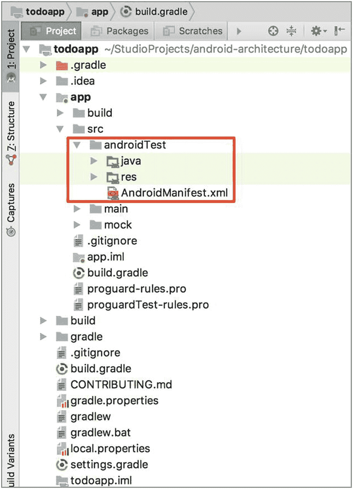

图 1-1 – 示例项目结构

3.  将 Espresso 依赖项版本放入根项目 `todoapp/build.gradle` 文件中（见图 1-2）。这不是强制性的，但在存在多模块应用结构的情况下是一种良好实践。之后，我们无需在多个 gradle 文件中更新依赖版本，只需在一个地方更新即可。

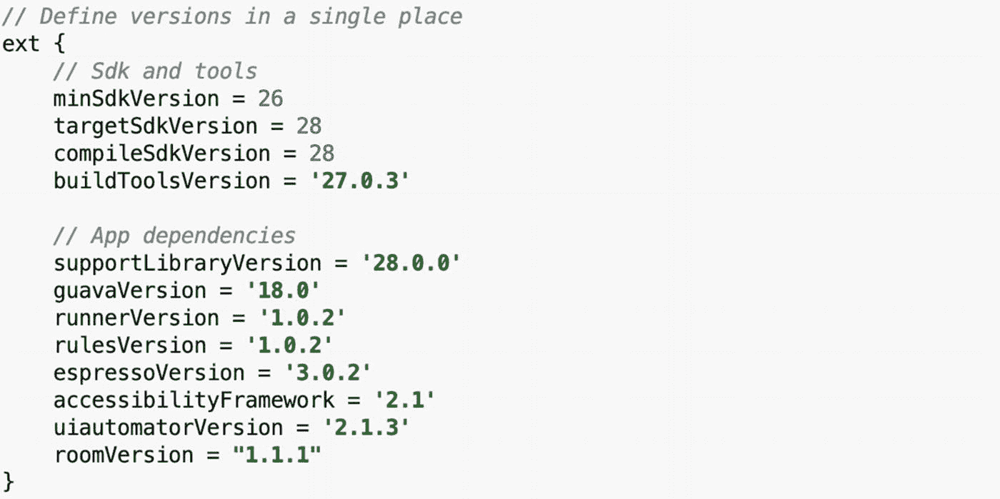

图 1-2 – `todoapp/build.gradle`：将依赖版本集中放在一处

大多数情况下，在添加、更改或删除依赖项后，我们必须通过点击 Gradle 同步图标  来同步 AndroidStudio 中的项目。你需要连接互联网以下载任何已更改的依赖项。

```
// Android Testing Support Library's runner and rules
androidTestImplementation "com.android.support.test:runner:$rootProject.ext.runnerVersion"
androidTestImplementation "com.android.support.test:rules:$rootProject.ext.rulesVersion"
androidTestImplementation "android.arch.persistence.room:testing:$rootProject.roomVersion"
// Espresso UI Testing
androidTestImplementation "com.android.support.test.espresso:espresso-core:$rootProject.espressoVersion"
androidTestImplementation "com.android.support.test.espresso:espresso-contrib:$rootProject.espressoVersion"
androidTestImplementation "com.android.support.test.espresso:espresso-intents:$rootProject.espressoVersion"
androidTestImplementation "com.android.support.test.espresso.idling:idling-concurrent:$rootProject.espressoVersion"
androidTestImplementation "com.android.support.test.espresso:espresso-idling-resource:$rootProject.espressoVersion"
androidTestImplementation "com.android.support.test.espresso:espresso-web:$rootProject.espressoVersion"
androidTestImplementation "com.android.support.test.espresso:espresso-accessibility:$rootProject.espressoVersion"
```

4.  在 `todoapp/app/src/androidTest/java` 目录中添加一个测试包。通常，测试包的名称与正在测试的应用程序相同，但带有 `.test` 后缀。

从此刻开始，你就可以添加第一个测试类并开始编写测试。

## 理解 Android 插桩测试

在 Android UI 测试中，我们使用插桩机制来执行测试。与可以直接在 JVM 上运行的单元测试不同，插桩测试在真实设备或模拟器上运行。此类测试可以访问插桩 API，这使我们能够从测试代码控制测试应用程序，提供对应用程序上下文的访问，并允许我们通过不同的 UI 操作（如点击、滑动等）来模拟用户行为。之所以能实现这一点，是因为插桩测试应用程序与正在测试的应用程序运行在同一个进程中。插桩将在任何应用程序代码之前被实例化，从而使其能够监控系统与应用程序之间的交互。

插桩通常使用 `instrumentation` XML 标签在测试应用程序的 Android 清单文件中声明。以下是使用 Android 支持库中的 `AndroidJUnitRunner` 声明插桩的示例：

```
以下是 AndroidX 测试库的相同示例：
```

这也可以通过将其声明在应用程序模块的 `build.gradle` 文件中来实现：

```
android {
...
defaultConfig {
...
applicationId "com.example.android.architecture.blueprints.todoapp"
testInstrumentationRunner 'android.support.test.runner.AndroidJUnitRunner'
}
...
}
android {
...
defaultConfig {
...
applicationId "com.example.android.architecture.blueprints.todoapp"
testInstrumentationRunner 'androidx.test.runner.AndroidJUnitRunner'
}
...
}
```

在这两种情况下，我们都提供了插桩测试运行器名称和目标应用程序包，即测试应用程序包。在 `build.gradle` 文件中，它被称为 `applicationId`。`AndroidJUnitRunner` 是默认的 Android JUnit 测试运行器，从 API 级别 8（Android 2.2）开始引入。它允许我们运行基于 JUnit3 或 JUnit4 的测试。测试运行器负责将你的测试包和测试应用程序加载到设备上、运行你的测试并报告测试结果。要访问当前测试的信息，我们运行 `InstrumentationRegistry` 类。它持有对运行在该进程中的插桩对象的引用，以及对目标应用程序上下文对象、测试应用程序上下文对象以及传递给测试的命令行参数的引用。

最后简单介绍一下与 Espresso 一起使用的注解：

*   每当我们创建一个测试类时，该类或其超类应使用 `@RunWith(AndroidJUnit4.class)` 注解进行标注。否则，默认的 JUnit 运行器将接管运行进程，测试将会失败。
*   要在类中任何测试方法之前或之后执行一次代码，可以使用 `@BeforeClass` 或 `@AfterClass` JUnit 注解。
*   要在类中每个测试方法之前或之后执行代码，可以使用 `@Before` 或 `@After` JUnit 注解。当多个测试需要在运行前后创建或删除相似对象时，这会非常有用。
*   `@Rule` 注解那些引用规则或返回规则的方法的字段。规则可用于不同的目的。例如，在本书后面，我们将讨论 Activity 规则或 `TestWatcher` 规则。

请参考 `BaseTest.java` 类，了解上述部分注解是如何使用的：

```
@RunWith(AndroidJUnit4.class)
public class BaseTest {
@Before
public void setUp() throws Exception {
setFailureHandler(new CustomFailureHandler(
InstrumentationRegistry.getInstrumentation().getTargetContext()));
}
@Rule
public ActivityTestRule menuActivityTestRule =
new ActivityTestRule(TasksActivity.class);
}
```


## Espresso 基础知识

每款移动应用都包含某种形式的用户界面（UI）。在 Android 世界中，这是通过使用 `View` 和 `ViewGroup` 对象来实现的。它们用于在 Android 设备屏幕上绘制 UI 元素。从测试的角度来看，我们关注这些 UI 元素，以便进一步对它们执行操作或验证。我们需要做的第一步就是在应用 UI 中定位这些视图。

### 识别应用 UI 元素

在深入探讨 Espresso 主题之前，让我们从最终用户的角度来思考移动应用。用户在使用应用时会做什么？他们会：

1.  在屏幕上查找 UI 元素（按钮、列表、编辑文本字段、图标等）。
2.  对 UI 元素执行操作（点击、双击、滑动、输入等）。
3.  检查结果（文本已输入、点击后达到预期结果、列表已滚动等）。

因此，当我们开始编写自动化测试时，第一项任务就是在应用中找到我们想要对其执行操作的 UI 元素。借助一些工具可以轻松定位它们。第一种可能性是使用 Android Device Monitor。

要启动独立的 Device Monitor 应用，请在 `android-sdk/tools/` 目录下的命令行中输入以下内容：

```
monitor
```

Android Device Monitor 启动后，连接设备。在 Devices 选项卡中点击设备名称将其选中，打开您想要检查的屏幕，然后点击电话  图标（见图 1-3）。完成这些步骤后，您只需点击 Android Device Monitor 中可用的元素，即可检查应用 UI。元素的详细信息会显示在右侧，包括资源 ID、文本、内容描述等。这些信息非常重要，因为它们将成为在应用 UI 内识别视图的基础。

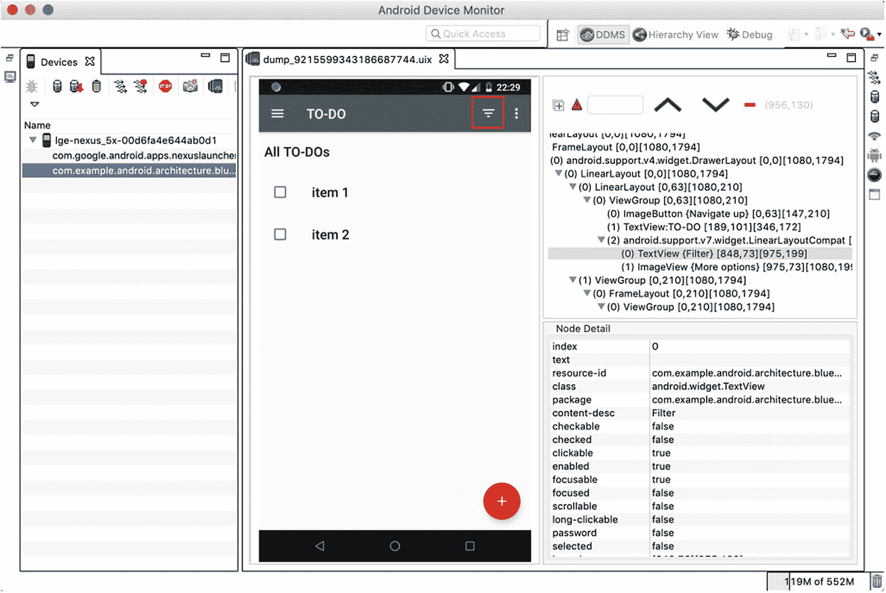

**图 1-3** 通过点击来识别 UI 元素

第二种选择是使用**布局检查器**，它可以从 AndroidStudio 的“工具” ➤ “布局检查器”菜单中获取。选择所需的活动或片段，然后开始检查应用布局（见图 1-4 和 1-5）。

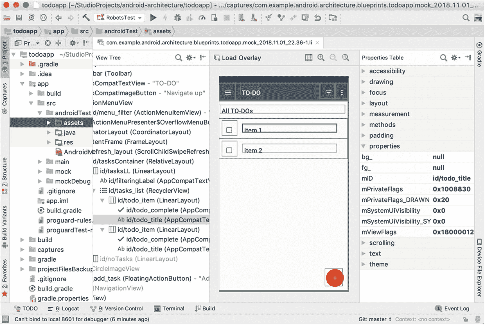

**图 1-5** 从布局检查器分析应用布局

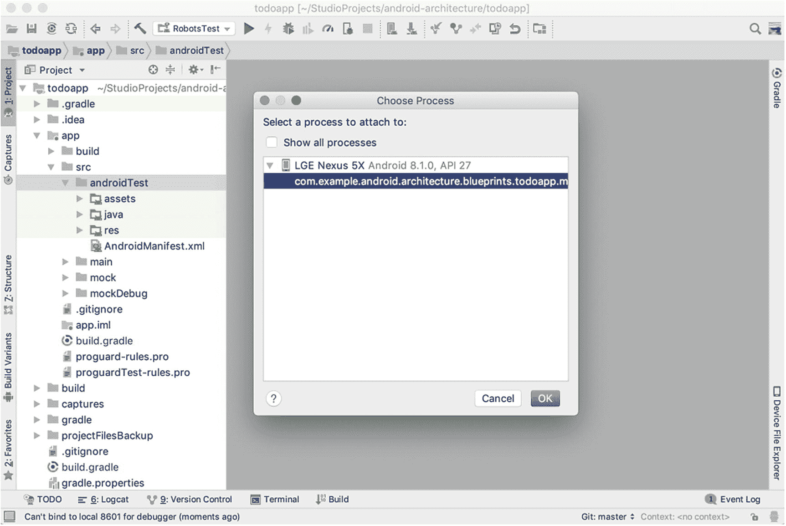

**图 1-4** 从布局检查器中选择正在运行的进程

如图 1-5 所示，布局检查器视图更详细。与 Android Device Monitor 相比，它为我们提供了更多数据，为视图识别和验证提供了更多可能性。布局检查器的另一个好处是，它可以将布局转储文件保存在 `/captures` 文件夹中，无需启动其他工具即可轻松访问。这些文件可以提交到源代码控制系统，并由多个团队成员使用。

### 练习 1：检查应用布局

现在是时候进行第一个练习了——在模拟器或真实设备上构建并安装示例 TODO 应用，启动它，然后使用 Monitor 和 Layout Inspector 工具在不同应用部分创建布局转储文件。然后您可以分析布局，了解这些工具的工作原理，并最终决定哪种工具更适合您。

1.  在“所有待办事项”列表中进行布局转储，并研究其层级结构。
2.  在“所有待办事项”列表中打开上下文菜单工具栏，并创建一个布局转储文件。研究其层级结构。

## Espresso

至此，借助这些工具或基于源代码，我们已经识别出 UI 元素，现在可以使用 Espresso 开始对它们进行操作。核心的 `Espresso` 类是 Espresso 框架的入口点，Espresso 核心方法都在这里。可以通过使用某个 `on` 方法（例如 `onView()`）或执行顶层用户操作（例如 `pressBack()`）来启动测试。

*   `onView()` — 针对给定视图的 `ViewInteraction`。接收 Hamcrest `ViewMatcher` 实例作为参数。您可以将一个或多个这些匹配器传递给 `onView()` 方法，以便根据视图属性在当前视图层次结构中定位视图。

> **注意**  
> 该视图必须是视图层次结构的一部分。如果它是作为 `AdapterView`（例如 `ListView`）的一部分渲染的，则可能并非如此。如果是这种情况，请先使用 `Espresso.onData` 加载该视图。

*   `onData()` — 针对数据对象（例如 `ListView`）的 `DataInteraction`。接收一个匹配列表中单个项目所表示的数据对象的 Hamcrest 匹配器作为参数。

*   `pressBack()` — 按下返回键。如果当前显示的活动是根活动，则抛出 `PerformException`，因为按下返回键会导致应用关闭。

*   `closeSoftKeyboard()` — 如果软键盘是打开的，则将其关闭。

*   `openContextualActionModeOverflowMenu()` — 打开在 `ActionMode` 的上下文选项中显示的溢出菜单。

*   `openActionBarOverflowOrOptionsMenu()` — 打开在 ActionBar 中显示的溢出菜单。

我们将从基本的 Espresso 功能开始。首先，我们将看到如何使用 `onView()` 方法对单个视图进行操作。它接收一个 Hamcrest 匹配器作为参数，用于匹配应用 UI 中的视图。我们将在下一节中详细了解视图匹配器。

## Espresso 视图匹配器

视图匹配器构成了一个用于匹配视图的 Hamcrest Java 匹配器集合。Espresso 视图匹配器如下所示（我根据自己的经验标注了最常用的那些）：

*   `isAssignableFrom()` — 基于提供的类的实例或子类来匹配视图。通常与其他 ViewMatcher 结合使用。常用。

*   `withClassName()` — 返回一个匹配器，用于匹配类名与给定匹配器匹配的视图。

*   `isDisplayed()` — 返回一个匹配器，用于匹配当前显示在用户屏幕上的视图。常用。

> **注意**  
> `isDisplayed()` 会选择部分显示的视图（例如，视图的完整高度/宽度大于可见矩形的高度/宽度）。如果您想确保整个矩形都显示，请使用 `isCompletelyDisplayed()`。

*   `isCompletelyDisplayed()` — 返回一个只接受高度和宽度完美适配当前显示区域的视图的匹配器。

> **注意**  
> 存在某些视图（例如 `ScrollViews`），其高度和宽度在设计上就大于物理设备屏幕。此类视图永远不会被完全显示。

*   `isDisplayingAtLeast()` — 返回一个可接受视图的匹配器，只要该视图的给定百分比区域未被任何父视图遮挡，从而对用户可见。

*   `isEnabled()` — 返回一个匹配器，用于匹配已启用的视图。常用。

*   `isFocusable()` — 返回一个匹配器，用于匹配可聚焦的视图。

*   `hasFocus()` — 返回一个匹配器，用于匹配当前具有焦点的视图。

*   `isSelected()` — 返回一个匹配器，用于匹配已选中的视图。


*   `hasSibling()` — 返回一个匹配器，用于基于视图的兄弟视图来匹配视图。当无法通过文本或视图 ID 等属性唯一选择某个视图时，此方法特别有用。例如，某个通讯录布局中多次出现同一个呼叫按钮，而区分这些呼叫按钮视图的唯一方法是看它旁边的内容（例如，联系人的唯一姓名）。
*   `withContentDescription()` — 返回一个匹配器，用于基于内容描述属性值来匹配视图。常用。
*   `withId()` — 返回一个匹配器，用于基于内容描述的 ID 来匹配视图。常用。

> **注意**
> Android 资源 ID 不能保证是唯一的。您可能需要将此匹配器与另一个匹配器配对使用，以确保唯一的视图选择。

*   `withResourceName()` — 返回一个匹配器，用于基于资源 ID 名称来匹配视图（例如 `channel_avatar`）。
*   `withTagKey()` — 返回一个匹配器，用于基于标签键来匹配视图。
*   `withTagValue()` — 返回一个匹配器，用于基于标签属性值来匹配视图。
*   `withText()` — 返回一个匹配器，用于基于文本属性值来匹配视图。
*   `withHint()` — 返回一个匹配器，用于基于提示属性值来匹配视图。
*   `isChecked()` — 返回一个匹配器，仅当视图是 `CompoundButton`（或其子类型）且处于选中状态时匹配。常用。
*   `isNotChecked()` — 返回一个匹配器，仅当视图是 `CompoundButton`（或其子类型）且不处于选中状态时匹配。常用。
*   `hasContentDescription()` — 返回一个匹配器，用于匹配任何具有内容描述的视图。
*   `hasDescendant()` — 返回一个匹配器，用于基于视图层级中是否存在某个后代视图来匹配视图。
*   `isClickable()` — 返回一个匹配器，用于匹配可点击的视图。
*   `isDescendantOfA()` — 返回一个匹配器，用于基于给定的祖先类型来匹配视图。
*   `withEffectiveVisibility()` — 返回一个匹配器，用于匹配“有效”可见性设置为指定值的视图。
*   `withAlpha()` — 匹配具有指定 alpha 值的视图。Alpha 是视图的一个属性值，范围从 0 到 1，其中 0 表示视图完全透明，1 表示视图完全不透明。
*   `withParent()` — 一个匹配器，仅当视图的父视图被所提供的匹配器接受时，才接受该视图。
*   `withChild()` — 匹配子视图被所提供的匹配器接受的视图。
*   `hasChildCount()` — 如果 `ViewGroup`（例如 `ListView`）恰好具有指定数量的子视图，则匹配该 `ViewGroup`。
*   `hasMinimumChildCount()` — 如果 `ViewGroup`（例如 `ListView`）至少具有指定数量的子视图，则匹配该 `ViewGroup`。
*   `isRoot()` — 返回一个匹配根视图的匹配器。
*   `hasImeAction()` — 返回一个匹配支持输入法的视图的匹配器。
*   `hasLinks()` — 返回一个匹配包含链接的 `TextView` 的匹配器。
*   `withSpinnerText()` — 返回一个匹配器，用于匹配 Spinner 中显示与给定资源 ID 关联的选中项字符串的后代视图。
*   `isJavascriptEnabled()` — 返回一个匹配器，用于匹配正在执行 JavaScript 的 Web 视图。
*   `hasErrorText()` — 返回一个匹配器，用于基于编辑文本的错误字符串值来匹配 `EditText`。
*   `withInputType()` — 返回一个匹配器，用于匹配 `android.text.InputType`。
*   `withParentIndex()` — 返回一个匹配器，用于匹配 `ViewParent` 内部的子视图索引。

例如，以下 `withText()` ViewMatcher 被传递给 `onView()` 方法，以基于其文本匹配图 1-6 中所示的视图：

```java
onView(withText("item 1"));    // 通过待办项 "item 1" 定位视图
```

类似的方法用于基于视图 ID 并使用 `withId()` ViewMatcher 定位图 1-3 中的筛选视图。您可能知道，所有 Android 应用的资源（从视图到字符串）都存储在动态生成的 `R.java` 文件中。因此，如果目标视图具有开发者定义的 ID 值，我们可以通过引用 `R.java` 类中的 ID 值来定位它—— `R.id.view_id`：

```java
onView(withId(R.id.menu_filter));    //定位筛选菜单项
```

现在是时候看看官方 Espresso 速查表了，可通过以下链接获取：[`developer.android.com/training/testing/espresso/cheat-sheet`](https://developer.android.com/training/testing/espresso/cheat-sheet)。（见图 1-6）此刻我们关注的是 ViewMatchers 部分。您可以看到 ViewMatchers 被分为以下几个关注领域：

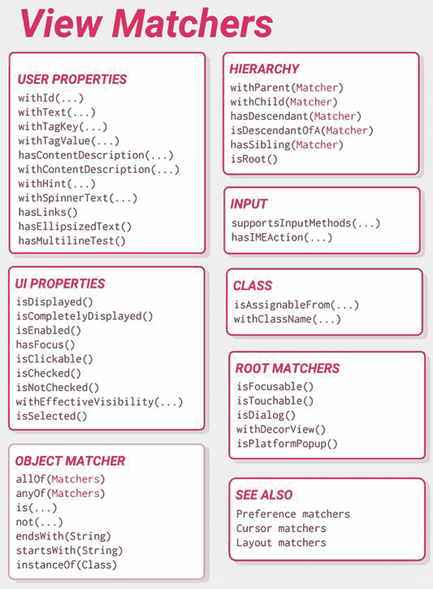

**图 1-6** Espresso 速查表 2.1 — ViewMatchers（来源 [`developer.android.com/training/testing/espresso/cheat-sheet`](https://developer.android.com/training/testing/espresso/cheat-sheet)）

*   用户属性
*   UI 属性
*   对象匹配器
*   层级关系
*   输入
*   类
*   根匹配器

让我们看一些示例，了解这些 ViewMatchers 如何在我们的示例应用中使用。打开 `ViewMatchersExampleTest.java` 类并查看测试方法。所有这些方法都列在图 1-7 中。

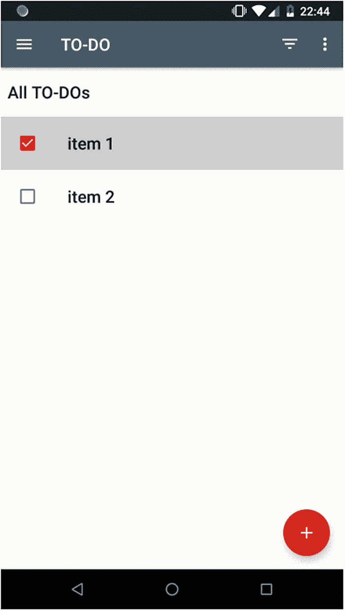

**图 1-7** 待办事项应用中的待办事项列表

```java
@Test
public void userProperties() {
    onView(withId(R.id.fab_add_task));
    onView(withText("All TO-DOs"));
    onView(withContentDescription(R.string.menu_filter));
    onView(hasContentDescription());
    onView(withHint(R.string.name_hint));
}
```

在这个测试用例中，您可以看到我们识别了图 1-7 所示屏幕上的视图。浮动操作按钮通过其 ID 识别：`onView(withId(R.id.fab_add_task))`。待办事项列表标题基于其文本识别：`onView(withText("All TO-DOs"))`。工具栏中的筛选图标通过内容描述文本定位：`onView(withContentDescription(R.string.menu_filter))`。内容描述的存在性则通过视图本身或基于视图提示来确定。

```java
@Test
public void uiProperties() {
    onView(isDisplayed());
    onView(isEnabled());
    onView(isChecked());
}
```

在这个测试用例中，有通过 UI 外观识别视图的示例。基于图 1-7 中的屏幕，我们看到大多数视图都是已显示且已启用的。这意味着在没有额外匹配器的情况下，无法单独使用 `onView(isDisplayed())` 或 `onView(isEnabled())`，因为测试会因歧义匹配异常而失败。在下面的测试用例中，您可以看到如何借助 `allOf()` hamcrest 逻辑匹配器将两个匹配器组合成一个匹配器序列。只有当序列中的所有匹配器都成功执行时，它才会返回匹配的对象。请参阅图 1-8 至 1-10。在后面的章节中，您将了解更多关于 hamcrest 匹配器的内容。

```java
@Test
public void objectMatcher() {
    onView(not(isChecked()));
    onView(allOf(withText("item 1"), isChecked()));
}

@Test
public void hierarchy() {
    onView(withParent(withId(R.id.todo_item)));
    onView(withChild(withText("item 2")));
    onView(isDescendantOfA(withId(R.id.todo_item)));
    onView(hasDescendant(isChecked()));
    onView(hasSibling(withContentDescription(R.string.menu_filter)));
}
```


```java
@Test
public void input() {
    onView(supportsInputMethods());
    onView(hasImeAction(EditorInfo.IME_ACTION_SEND));
}

@Test
public void classMatchers() {
    onView(isAssignableFrom(CheckBox.class));
    onView(withClassName(is(FloatingActionButton.class.getCanonicalName())));
}

@Test
public void rootMatchers() {
    onView(isFocusable());
    onView(withText(R.string.name_hint)).inRoot(isTouchable());
    onView(withText(R.string.name_hint)).inRoot(isDialog());
    onView(withText(R.string.name_hint)).inRoot(isPlatformPopup());
}
```

```java
@Test
public void preferenceMatchers() {
    onData(withSummaryText("3 days"));
    onData(withTitle("Send notification"));
    onData(withKey("example_switch"));
    onView(isEnabled());
}
```

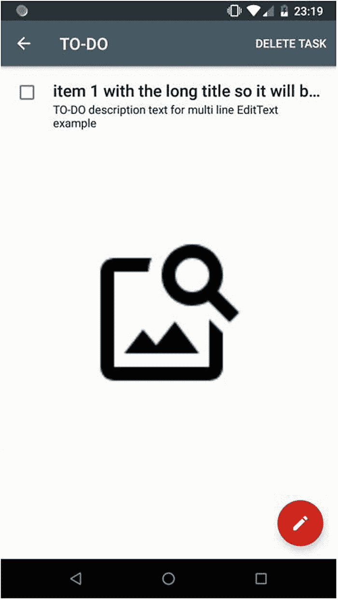

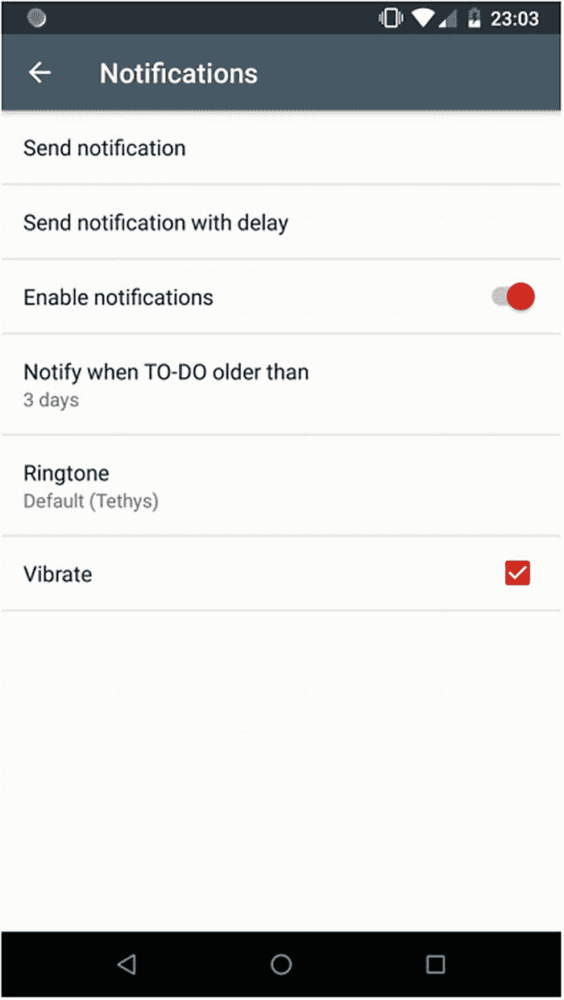

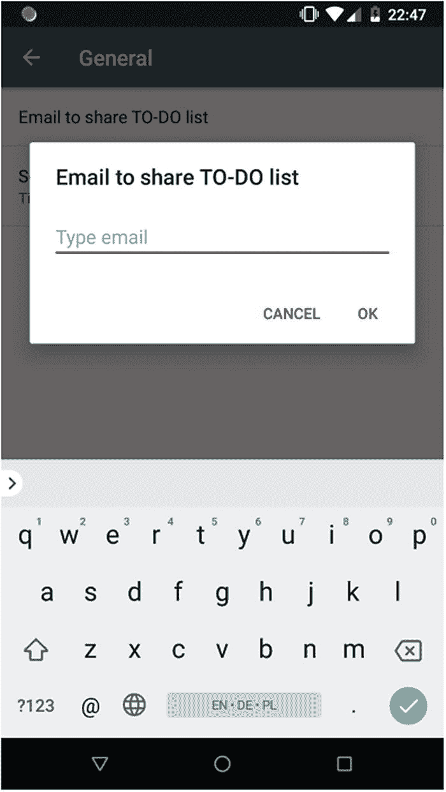

```java
@Test
public void layoutMatchers() {
    onView(hasEllipsizedText());
    onView(hasMultilineText());
}
```

我们将不讨论 Espresso 表格中 `ViewMatchers` 部分列出的光标匹配器（cursor matchers），因为它们的目的是在数据库层面进行操作，这适用于单元测试和集成测试，因此超出了本书的讨论范围。

现在，让我们暂时离开示例应用程序，来看一些 Hamcrest 字符串匹配器的示例。为简单起见，我们将使用字符串 `"XXYYZZ"` 作为预期文本模式。Espresso 的 `ViewMatcher` 类实现了两个字符串匹配方法——`withText()` 和 `withContentDescription()`。它们用于匹配与预期文本或预期内容描述相等的视图：

```java
onView(withText("XXYYZZ")).perform(click());
onView(withContentDescription("XXYYZZ")).perform(click());
```

使用 Hamcrest 字符串匹配器，我们可以创建更灵活的匹配组合。我们可以匹配文本以 `"XXYY"` 模式开头的视图：

```java
onView(withText(startsWith("XXYY"))).perform(click());
```

我们可以匹配文本以 `"YYZZ"` 模式结尾的视图：

```java
onView(withText(endsWith("YYZZ"))).perform(click());
```

我们可以断言，指定了 `R.id` 的特定视图的文本内容描述中包含 `"YYZZ"` 字符串（出现在任意位置）：

```java
onView(withId(R.id.viewId)).check(matches(withContentDescription(containsString("YYZZ"))));
```

我们可以匹配文本与指定字符串相等（忽略大小写）的视图：

```java
onView(withText(equalToIgnoringCase("xxYY"))).perform(click());
```

我们可以匹配文本与指定文本在（大部分）忽略空白差异后相等的视图：

```java
onView(withText(equalToIgnoringWhiteSpace("XX YY ZZ"))).perform(click());
```

我们可以断言，指定了 `R.id` 的特定视图的文本不包含 `"YYZZ"` 字符串：

```java
onView(withId(R.id.viewId)).check(matches(withText(not(containsString("YYZZ")))));
```

添加 `allOf()` 或 `anyOf()` 这些 Hamcrest 核心匹配器将赋予我们更强大的能力。我们可以断言，指定了 `R.id` 的特定视图的文本不以 `"ZZ"` 开头，且在任意位置包含 `"YYZZ"` 字符串：

```java
onView(withId(R.id.viewId))
    .check(matches(allOf(withText(not(startsWith("ZZ"))),
                         withText(containsString("YYZZ")))));
```

我们还可以断言，指定了 `R.id` 的特定视图的文本以 `"ZZ"` 结尾，或者在任意位置包含 `"YYZZ"` 字符串：

```java
onView(withId(R.id.viewId))
    .check(matches(anyOf(withText(endsWith("ZZ")),
                         withText(containsString("YYZZ")))));
```

要全面了解 Hamcrest 匹配器，请参阅其官方文档：[`http://hamcrest.org/JavaHamcrest`](http://hamcrest.org/JavaHamcrest)。至此，我们已经了解了 `ViewMatchers` 的概念，也明白它们在 Espresso 测试框架中扮演着最重要的角色之一。它们的任务是在应用布局中定位匹配的视图，如果匹配失败则测试不通过。

## Espresso 的 `ViewInteraction` 类

在前面的示例中，我们一直在对视图执行新的 `perform()` 和 `check()` 操作。这些方法是 `ViewInteraction` 类的代表。交互（Interactions）如同粘合剂，连接着 `ViewMatcher` 与 `ViewAssertion` 或 `ViewAction`。

每个交互都与之前由 `ViewMatcher` 定位到的视图绑定。你可能已经根据方法名猜到了，`perform()` 方法接受一个动作（action），而 `check()` 方法则断言作为参数提供的某个条件。还有一个我们尚未使用的 `ViewInteraction`——`inRoot()`。

-   `perform()`——接收一个视图动作或一组视图动作作为参数，并在当前 `ViewMatcher` 选中的视图上执行这些动作。
-   `check()`——接收一个视图断言作为参数，并在当前 `ViewMatcher` 选中的视图上检查该断言。

那么，`inRoot()` 方法又是做什么的呢？通过这个视图交互，我们可以在应用中定位多窗口状态。例如，绘制在测试应用上方的 `AutoComplete` 窗口布局。在这种情况下，我们应该通过合适的 `RootMatcher` 匹配正确的窗口，来明确指示 Espresso 应在哪个窗口上操作。

-   `inRoot()`——接收一个根匹配器作为参数，并将视图交互的范围设置为由该根匹配器标识的根视图。

**注意**  
Espresso 会在 UI 线程上执行所有操作，这意味着它会先等待应用 UI 渲染完成，然后再执行所需的步骤。这确保了应用 UI 元素已完全加载并显示在屏幕上，从而提高了测试的可靠性和健壮性。这也消除了在测试中编写等待和休眠代码的需要。

在下一节中，你将看到 `perform()` 和 `check()` 视图交互如何被使用的示例。

## Espresso 的 `ViewActions` 类

你可能已经猜到，`ViewAction` 负责在所需的视图上执行动作。其目标是通过与屏幕上的 UI 元素进行交互来模拟最终用户的行为。以下是我们可执行的一些动作类型的示例（见图 1-11）：

-   `clearText()`——返回一个清除视图上文本的动作。该视图必须显示在屏幕上。
-   `click()`——返回一个点击视图的动作。该视图至少必须有 90% 的部分显示在屏幕上。
-   `swipeLeft()`——返回一个在视图垂直中心从左向右执行滑动的动作。滑动不会从视图的最边缘开始，而是有一个小的偏移量，因为从确切边缘滑动可能会导致意外行为（例如，可能会打开导航抽屉）。Espresso 定义的其他滑动动作包括 `swipeRight()`、`swipeDown()` 和 `swipeUp()`。对于所有滑动动作，至少必须有 90% 的视图显示在屏幕上。
-   `closeSoftKeyboard()`——返回一个关闭软键盘的动作。如果键盘已经关闭，则该动作无效。
-   `pressImeActionButton()`——返回一个在 IME（输入法编辑器）上按下当前操作按钮（如“下一步”、“完成”、“搜索”等）的动作。
-   `pressBack()`——返回一个点击硬件返回按钮的动作。
-   `pressMenuKey()`——返回一个按下硬件菜单键的动作。市场上大多数现代设备已不再支持硬件菜单键，因此该方法很少使用。


*   `pressKey()` ⎯ 返回一个按下指定键码（例如 `KeyEvent.KEYCODE_BACK`）的操作。在 `android.view.KeyEvent.java` 类中声明了所有可能的键码的庞大列表。

*   `doubleClick()` ⎯ 与 `click()` 操作类似，此操作返回一个双击视图的操作。视图的至少 90% 必须在屏幕上显示。

*   `longClick()` ⎯ 返回一个长按视图的操作。视图的至少 90% 必须在屏幕上显示。

*   `scrollTo()` ⎯ 返回一个滚动到视图的操作。基于当前实现，我们想要滚到的视图必须是以下类之一的子代：`ScrollView.class`、`HorizontalScrollView.class`、`ListView.class`。视图的至少 90% 必须在屏幕上显示。

    **注意**
    如果视图已经显示，`scrollTo()` 操作将无效。

*   `typeText()` ⎯ 返回一个选择视图（通过点击它）并将提供的字符串键入视图的操作。在字符串末尾附加 `'\n'` 将转换为 Enter 键事件。视图必须在屏幕上显示并且必须支持输入法。

    **注意**
    `typeText()` 方法在键入之前会执行一次视图点击以强制其获得焦点。如果视图已包含文本，此点击可能会将光标放置在文本内的任意位置。

    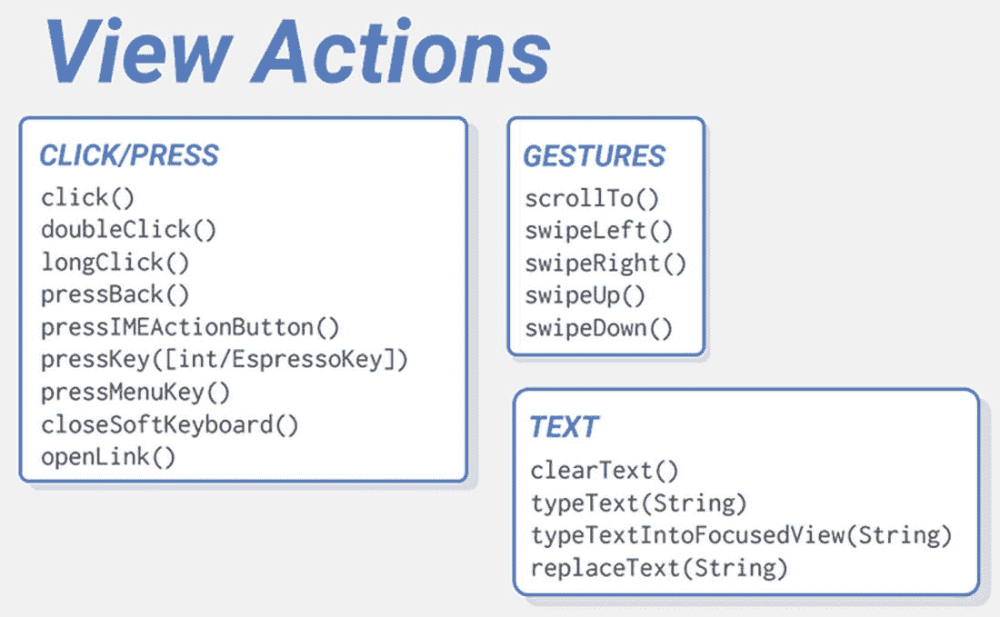

    图 1-11 Espresso 速查表 2.1——`ViewActions`（来源：[`https://developer.android.com/training/testing/espresso/cheat-sheet`](https://developer.android.com/training/testing/espresso/cheat-sheet)）

*   `replaceText()` ⎯ 返回一个更新视图文本属性的操作。

*   `openLink()` ⎯ 返回一个打开与给定链接文本和 URI 匹配器匹配的链接的操作。该操作通过调用链接的 `onClick` 方法来执行（而不是在实际屏幕上发起点击）。

图 1-11 中的 Espresso 速查表显示所有操作被分为三类：

*   点击/按压操作
*   手势
*   文本相关操作

在我看来，我们可以在下一个速查表版本中增加一种类型：

*   条件操作

目前，这类操作由一个方法表示——`repeatedlyUntil()`。它允许对某个视图执行给定操作，直到其达到由给定 `ViewMatcher` 匹配的期望状态。当您重复对某个视图执行操作，并且该视图在运行时改变其状态时，此操作非常有用。使用此视图操作自动化的一个好用例是从头到尾浏览引导或入门屏幕。

如您所见，Espresso 提供了覆盖最终用户行为所需的几乎所有操作，但仍然缺少一些操作。例如：

*   拖放操作
*   多点手势操作，例如捏合缩放

现在我们已经掌握了 Espresso 的核心方法——`ViewInteractions`、`ViewMatchers` 和 `ViewActions`——我们可以开始自动化示例 TO-DO 应用程序的简单用例了。让我们提出一些用例：

*   添加一个提供标题和描述的新 TO-DO。验证它显示在 TO-DO 列表中。
*   添加一个新的 TO-DO，将其标记为已完成，并验证它出现在已完成 TO-DO 列表中。
*   添加一个新的 TO-DO，编辑它，并验证更改。

请参考 `ViewActionsTest` 查看示例代码。第一个、第二个和第三个用例分别显示在 `addsNewToDo()`、`checksToDoStateChange()` 和 `editsToDo()` 测试用例中。我们将深入其中一个来查看一些细节：

```
@Test
public void checksToDoStateChange() {
    // adding new TO-DO
    onView(withId(R.id.fab_add_task)).perform(click());
    onView(withId(R.id.add_task_title))
        .perform(typeText(toDoTitle), closeSoftKeyboard());
    onView(withId(R.id.add_task_description))
        .perform(typeText(toDoDescription), closeSoftKeyboard());
    onView(withId(R.id.fab_edit_task_done)).perform(click());
    // marking our TO-DO as completed
    onView(withId(R.id.todo_complete)).perform(click());
    // filtering out the completed TO-DO
    onView(withId(R.id.menu_filter)).perform(click());
    onView(allOf(withId(android.R.id.title), withText(R.string.nav_completed)))
        .perform(click());
    onView(withId(R.id.todo_title))
        .check(matches(allOf(withText(toDoTitle), isDisplayed())));
}
```

注意，我们引入了 `TestData` 类来保存所有生成输入数据的方法。这有助于减少测试方法中的样板代码。您可能会注意到，我们为每个 TO-DO 项目的标题和描述添加了唯一的毫秒级时间戳。这使我们的测试数据保持唯一，极大地简化了应用程序布局内的视图识别和验证。

现在，关于 Espresso 测试代码。注意 `ViewInteraction`、`ViewMatcher` 和 `ViewAction` 的单一组合，体现在以下代码行中：

```
onView(withId(R.id.fab_add_task)).perform(click());
```

同时，也有将多个视图操作作为参数传递给 `perform()` 视图交互的示例：

```
onView(withId(R.id.add_task_title))
    .perform(typeText(toDoTitle), closeSoftKeyboard());
```

还有示例展示了如何组合多个 `ViewMatchers`，为我们提供更强的条件组合以匹配所需视图或验证其状态，或避免多余的代码行。可提供给 `allOf()` 匹配器的最大匹配器数量是六个：

```
onView(allOf(withId(android.R.id.title), withText(R.string.nav_completed)))
    .perform(click());
onView(withId(R.id.todo_title))
    .check(matches(allOf(withText(toDoTitle), isDisplayed())));
```

请注意 Espresso 表示法的灵活性——`allOf()` 匹配器既可以在 `onView()` 方法内部使用，也可以在 `check(matches())` 视图交互内部使用。

**练习 2：编写您的第一个 Espresso 测试用例**

基于 `ViewActionsTest` 中的示例，为以下应用程序功能编写测试用例：

1.  添加一个 TO-DO 并标记为已完成。验证已完成 TO-DO 的复选框已被选中。
2.  添加一个新的 TO-DO，通过点击它打开 TO-DO 详情（提示：使用 `withText()` 匹配器），然后通过点击“删除任务”按钮删除它。验证所有 TO-DOs 列表为空（即，验证文本“You have no TO-DOs!”和 ID 为 `R.id.noTasksIcon` 的视图显示在屏幕上）。

**Espresso 的 `DataInteraction` 类**
如在“了解 Android 仪器化”部分所述，Android 应用程序通过 `View` 或 `ViewGroup` 来表示其元素。单个 UI 元素绘制在 `View` 内部。`ViewGroup` 用于表示一组视图或另一个视图组。可以将 `ViewGroup` 视为 UI 元素的容器。要在 Android 中表示对象列表，可以使用一个名为 `AdapterView` 的类，它扩展了 `ViewGroup` 类，其子视图由 `Adapter` 决定。表示对象列表的另一种可能性是使用 `RecyclerView`，但我们将在后续章节中讨论它。

因此，`Adapter` 负责将来自外部源的数据转换为绑定到 `AdapterView` 的 `View`。最终，`AdapterView` 包含许多由 `Adapter` 生成数据的视图，并形成一个项目列表，这称为 `ListView`（见图 1-12）。


### 图 1-12  
`ListView` 可视化效果（来源 [`https://developer.android.com/guide/topics/ui/layout/listview`](https://developer.android.com/guide/topics/ui/layout/listview)）

为了操作此类列表，Espresso 提供了 `DataInteraction` 接口，它允许我们与 `AdapterViews` 中显示的元素进行交互。下面简要介绍常用的 `DataInteraction` 方法：

- `atPosition(Integer atPosition)` — 根据数据匹配器选择适配器中第 n 个位置的视图。
- `inAdapterView(Matcher<View> adapterMatcher)` — 指向屏幕上要操作的特定适配器视图。当布局中有两个或更多 `AdapterViews` 时使用。例如，同时包含列表视图和菜单抽屉列表视图的布局。
- `inRoot(Matcher<Root> rootMatcher)` — 使数据交互在由给定根匹配器指定的根窗口内工作。当有 `AutoComplete` 列表视图在应用窗口上方弹出时，此方法可能会很有用。
- `onChildView(Matcher<View> childMatcher)` — 将执行操作和检查操作重定向到由 `Adapter.getView()` 返回的适配器项目内的视图。

现在，让我们看看如何在一个为某项设置功能编写的测试用例中使用 `DataInteraction` 方法。设置应用程序是使用 Android 首选项组件实现的——该 UI 构建块由 `PreferenceActivity` 以 `ListView` 的形式显示。该类提供了要在活动中显示的视图，并与 `SharedPreferences` 关联以存储/检索首选项数据。在 XML 中指定首选项层次结构时，每个元素都可以指向 `Preference` 的子类，类似于视图层次结构和布局。此类包含一个键，该键将用作 `SharedPreferences` 中的键。

如图 1-13 所示，主设置部分包含一个包含四个首选项标题（通用、通知、数据与同步以及 WebView 示例）的列表，其中每个标题都包含带有首选项列表的子部分。

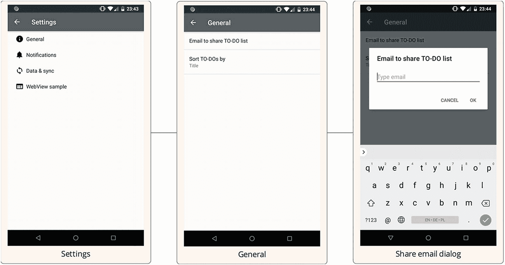

### 图 1-13  
`dataInteraction()` 测试用例流程，从设置部分开始

打开 `DataInteractionsTest` 类查看代码示例。

```
@Test
public void dataInteraction() {
    openDrawer();
    onView(allOf(withId(R.id.design_menu_item_text),
            withText(R.string.settings_title))).perform(click());
    // 如图 1-13 所示的流程开始
    onData(instanceOf(PreferenceActivity.Header.class))
        .inAdapterView(withId(android.R.id.list))
        .atPosition(0)
        .onChildView(withId(android.R.id.title))
        .check(matches(withText("General")))
        .perform(click());
    onData(withKey("email_edit_text"))
        /*我们必须明确指向通用首选项列表的父级，
          因为层次结构中有两个 {@ListView}s 的 id 为 android.R.id.list*/
        .inAdapterView(allOf(withId(android.R.id.list), withParent(withId(android.R.id.list_container))))
        .check(matches(isDisplayed()))
        .perform(click());
    onView(withId(android.R.id.edit)).perform(replaceText("sample@ema.il"));
    onView(withId(android.R.id.button1)).perform(click());
    onData(withKey("email_edit_text"))
        .inAdapterView(allOf(withId(android.R.id.list), withParent(withId(android.R.id.list_container))))
        .onChildView(withId(android.R.id.summary))
        .check(matches(withText("sample@ema.il")));
}
```

为了更好地理解 `DataInteraction` 方法的工作原理，我们将测试用例分为两部分。第一部分操作包含四个标题的主要设置部分：

```
onData(instanceOf(PreferenceActivity.Header.class))
    .inAdapterView(withId(android.R.id.list))
    .atPosition(0)
    .onChildView(withId(android.R.id.title))
    .check(matches(withText("General")))
    .perform(click());
```

首先，我们明确指出要操作的对象是 `PreferenceActivity.Header.class` 的实例：

```
instanceOf(PreferenceActivity.Header.class)
```

其次，我们指出包含我们对象的适配器。在 Android 默认 `ListView` 组件的适配器内部，其 ID 为 `android.R.id.list`，位于位置“0”。这是列表中的第一行：

```
inAdapterView(withId(android.R.id.list)).atPosition(0)
```

第三，我们指出要操作列表项中 ID 为 `android.R.id.title` 且文本匹配 `"General"` 的子视图，并对其执行点击操作：

```
onChildView(withId(android.R.id.title)).check(matches(withText("General"))).perform(click())
```

接下来是测试用例的第二部分，它操作通用设置部分的子部分：

```
onData(withKey("email_edit_text"))
    .inAdapterView(allOf(withId(android.R.id.list), withParent(withId(android.R.id.list_container))))
    .check(matches(isDisplayed()))
    .perform(click());
onView(withId(android.R.id.edit)).perform(replaceText("sample@ema.il"));
onView(withId(android.R.id.button1)).perform(click());
onData(withKey("email_edit_text"))
    .inAdapterView(allOf(withId(android.R.id.list), withParent(withId(android.R.id.list_container))))
    .onChildView(withId(android.R.id.summary))
    .check(matches(withText("sample@ema.il")));
```

在这里，您可能会看到首选项匹配器 `withKey("email_edit_text")` 通过其键指向 `EditTextPreference` 组件，该键在 `pref_general.xml` 文件中设置：

```
withKey("email_edit_text")
```

我们再次指向条目所属的适配器视图的 ID，并将其与额外的匹配器组合以避免多个视图匹配。我们检查此类对象是否显示在屏幕上并点击它：

```
.inAdapterView(allOf(
    withId(android.R.id.list),
    withParent(withId(android.R.id.list_container))))
.check(matches(isDisplayed()))
.perform(click())
```

最后，在编辑文本字段中输入电子邮件后，我们验证列表项的摘要是否与提供的电子邮件匹配：

```
.inAdapterView(allOf(
    withId(android.R.id.list),
    withParent(withId(android.R.id.list_container))))
.onChildView(withId(android.R.id.summary))
.check(matches(withText("sample@ema.il")))
```

让我们借助图 1-14 所示的 Espresso 速查表总结一下关于 `DataInteractions` 的内容。Espresso 的 `onData()` 方法用于操作列表视图中的对象。列表视图项由一个或多个数据选项的组合标识。在对象被识别和定位后，我们可以对其执行操作或进行断言。

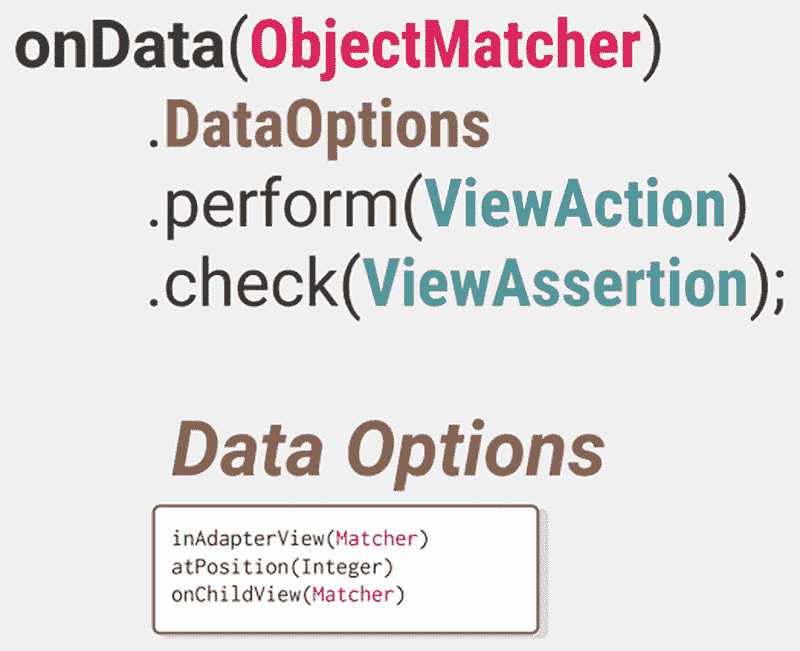

### 图 1-14  
Espresso 速查表 — `DataInteraction`（来源 [`https://developer.android.com/training/testing/espresso/cheat-sheet`](https://developer.android.com/training/testing/espresso/cheat-sheet)）

## 练习 3 — 编写一个操作 `ListView` 的测试用例

基于 `DataInteractionsTest` 中的示例：

1. 编写一个测试用例，导航到通知设置部分并通过文本或 ID 点击启用通知开关。使用布局检查器工具分析通知部分布局。

2. 扩展步骤 1 中的用例，并验证在启用通知开关打开后，其他通知设置是否显示在屏幕上。


## 使用 Espresso 操控 RecyclerView

`RecyclerView` 是 Android 开发中最常用的视图之一，它是 `ListView` 的进阶版本。无论你的应用是图片画廊、新闻客户端还是即时通讯软件，`RecyclerView` 通常都是实现这些功能的最佳工具。正因如此，理解如何为该组件编写正确的自动化测试显得尤为重要。

与简单视图类似，Espresso 提供了 `RecyclerViewActions` 类，其中包含可在 `RecyclerView` 上执行的所有操作，但遗憾的是 Espresso 并未提供 `RecyclerView` 匹配器。目前，我们先来看 `RecyclerViewActions` 的示例，在第二章 #469090_1_En_2_Chapter.xhtml 中，你将学习如何创建自己的 `RecyclerView` 匹配器。

我们将再次引用待办事项（TO-DO）示例应用，其中待办事项列表由 `RecyclerView` 组件呈现。

### `RecyclerViewActions`

该类表示可与 `RecyclerView` 进行交互的视图操作。乍看之下，你可能会认为可以在此处使用 `onData()` 方法，因为 `RecyclerView` 用于显示列表项；但实际上，`RecyclerView` 并非 `AdapterView`，因此无法与之配合使用。因此，要操作 `RecyclerView`，我们需结合 `RecyclerView` 匹配器使用 `onView()`，以匹配 `RecyclerView` 列表中的项或其子项。随后，需对其执行 `RecyclerViewAction` 或简单的 `ViewAction`。

- `actionOnItem(final Matcher<View> itemViewMatcher, final ViewAction viewAction)` — 返回一个 `ViewAction`，将 `RecyclerView` 滚动至与 `viewHolderMatcher` 匹配的视图。

- `actionOnHolderItem(final Matcher<VH> viewHolderMatcher, final ViewAction viewAction)` — 在与 `viewHolderMatcher` 匹配的视图上执行 `ViewAction`。它首先将 `RecyclerView` 滚动至与 `itemViewMatcher` 匹配的视图，然后对该匹配视图执行操作。

- `actionOnItemAtPosition(final int position, final ViewAction viewAction)` — 首先将 `RecyclerView` 滚动至与 `itemViewMatcher` 匹配的视图，然后对指定位置的视图执行操作。

- `scrollToHolder(final Matcher<VH> viewHolderMatcher)` — 返回一个 `ViewAction`，将 `RecyclerView` 滚动至与 `viewHolderMatcher` 匹配的视图。

- `scrollTo(final Matcher<View> itemViewMatcher)` — 一个 `ViewAction`，将 `RecyclerView` 滚动至与 `itemViewMatcher` 匹配的视图。

- `scrollToPosition(final int position)` — 一个 `ViewAction`，将 `RecyclerView` 滚动至指定位置。我们操作的视图必须可赋值给 `RecyclerView` 类，并且应在屏幕上显示。

以下代码展示了 `RecyclerViewActions` 在实际测试中的用法（相同的测试用例位于 `RecyclerViewActionsTest.java` 类中）：

```java
@Test
public void addNewToDos() throws Exception {
    generateToDos(12);
    onView(withId(R.id.tasks_list))
        .perform(actionOnItemAtPosition(10, scrollTo()));
    onView(withId(R.id.tasks_list))
        .perform(scrollToPosition(1));
    onView(withId(R.id.tasks_list))
        .perform(scrollToPosition(12));
    onView(withId(R.id.tasks_list))
        .perform(actionOnItemAtPosition(12, click()));
    Espresso.pressBack();
    onView(withId(R.id.tasks_list))
        .perform(scrollToPosition(2));
}
```

你可以暂时忽略 `generateToDos()` 方法以及那些将视图持有者匹配器作为参数的方法（如 `scrollToHolder()` 和 `actionOnHolderItem()`）。这些内容将在第二章 #469090_1_En_2_Chapter.xhtml 中讨论。这些测试添加了 12 个待办事项，因此部分项目在设备屏幕上不可见。这里的关键信息是：`RecyclerView` 适配器知道所有 12 个待办事项，但 `ViewActions` 只能对用户可见的项目执行。在此，`scrollToPosition()` 这个视图持有者 `ViewAction` 帮助我们进行滚动，使所需的待办事项在屏幕上可见。随后，视图操作即可顺利执行。

你可能注意到，两种方式都能执行相同的操作，且均有效：

```java
onView(withId(R.id.tasks_list))
    .perform(actionOnItemAtPosition(12, scrollTo()));
```

和

```java
onView(withId(R.id.tasks_list))
    .perform(scrollToPosition(12));
```

顺便提一下，当前测试用例很好地展示了当 `onView()` 方法中使用相同视图（即 `R.id.tasks_list`）时，如何链式调用 `perform()` 操作。该测试用例可以写成如下形式：

```java
@Test
public void addNewToDosChained() throws Exception {
    generateToDos(12);
    onView(withId(R.id.tasks_list))
        .perform(actionOnItemAtPosition(10, scrollTo()))
        .perform(scrollToPosition(1))
        .perform(scrollToPosition(12))
        .perform(actionOnItemAtPosition(12, click()))
        .perform(pressBack())
        .perform(scrollToPosition(2));
}
```

链式测试用例只需一处更改——用 `ViewActions.pressBack()` 方法替代了 `Espresso.pressBack()`。

### 练习 4

**探索 RecyclerView 操作**

1. 基于本文的示例，尝试在 `RecyclerView` 中使用各种操作。试着在不滚动到不可见待办事项的情况下对其执行操作，并观察结果。

## 从 AndroidStudio 运行 Espresso 测试

截至目前，我们已经基本了解了如何使用 Espresso 编写自动化测试。现在我们来看看如何运行 Espresso 测试。实现方式有两种：通过 AndroidStudio 或命令行。

在开始运行测试之前，我们需要理解 AndroidStudio 中 Gradle 构建变体（BuildVariant）的概念。构建变体代表将项目转换为 Android 应用程序包（APK）的流程。Android 构建过程非常灵活，允许在不修改应用源代码的情况下创建自定义构建配置。这种灵活性是通过构建变体实现的，而构建变体是构建类型和产品风味的组合结果。

构建类型定义了 Gradle 在构建和打包应用时使用的某些属性，通常针对开发生命周期的不同阶段进行配置。例如，*调试*构建类型会启用调试选项，并使用调试密钥签署 APK；而*发布*构建类型可能会对 APK 进行压缩、混淆，并使用发布密钥签署，以便分发。*产品风味*代表你可能向用户发布的应用程序的不同版本，例如应用的免费版和付费版。你可以自定义产品风味，使其使用不同的代码和资源，同时共享和重用所有应用版本通用的部分。

图 1-15 展示了 Android 构建过程。

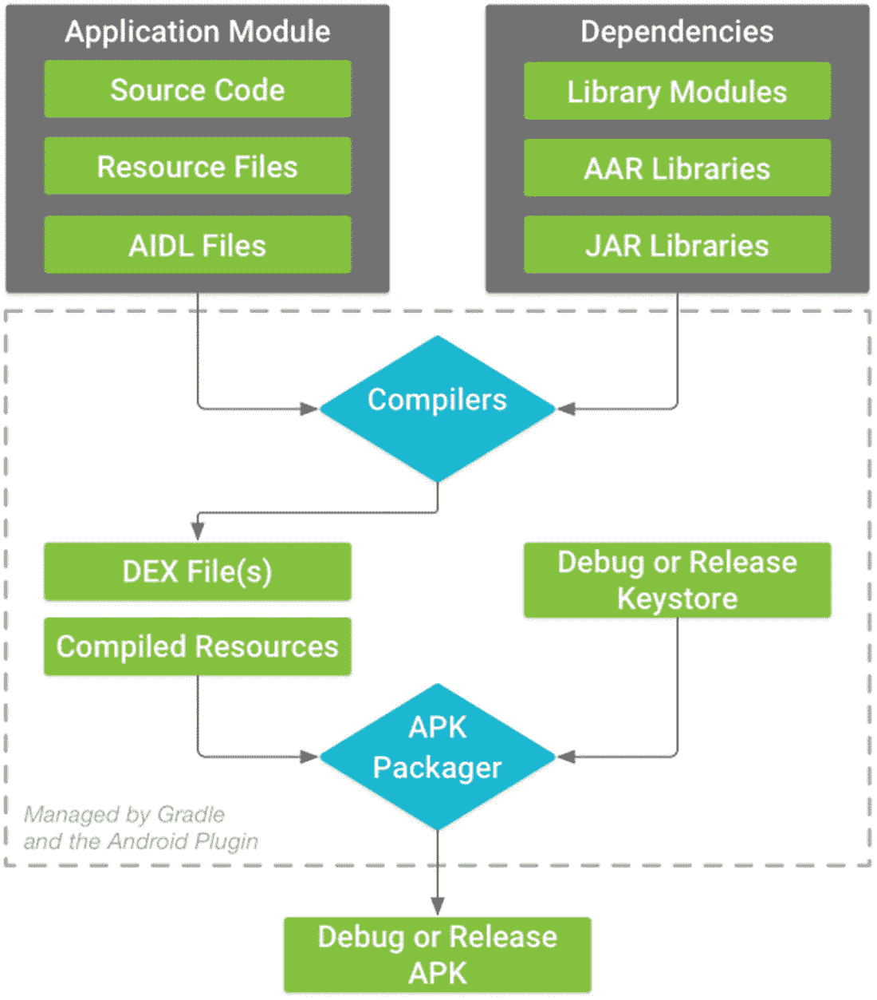

**图 1-15** Android 构建过程（来源 [`https://developer.android.com/studio/build`](https://developer.android.com/studio/build)）

简而言之，与发布版 APK 不同，调试版 APK 会包含运行 UI 测试所需的调试或测试依赖项（如 Espresso 依赖项）和测试资源。因此，首先需要确保拥有调试构建类型，如下面的 `build.gradle` 文件所示：

```gradle
buildTypes {
    debug {
        minifyEnabled true
        useProguard false
        proguardFiles getDefaultProguardFile('proguard-android.txt'), 'proguard-rules.pro'
        testProguardFiles getDefaultProguardFile('proguard-android.txt'), 'proguardTest-rules.pro'
    }
    release {
        minifyEnabled true
        useProguard true
        proguardFiles getDefaultProguardFile('proguard-android.txt'), 'proguard-rules.pro'
        testProguardFiles getDefaultProguardFile('proguard-android.txt'), 'proguardTest-rules.pro'
    }
}
```

其次，我们必须在 AndroidStudio 中为应用模块选择正确的 BuildVariant，如图 1-16 所示。

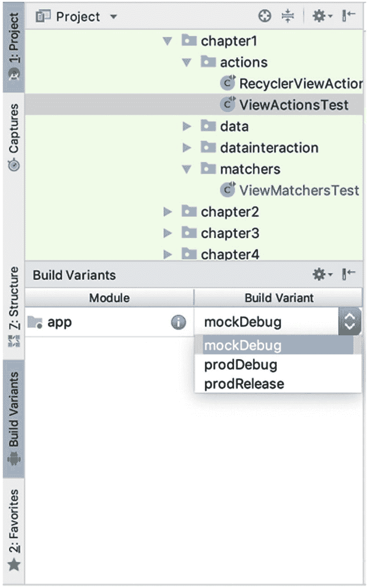

**图 1-16** 在 AndroidStudio 中选择 BuildVariant


选择正确的构建类型后，我们可以右键点击测试类或测试方法，为 UI 测试创建运行配置，如图 1-17 所示。

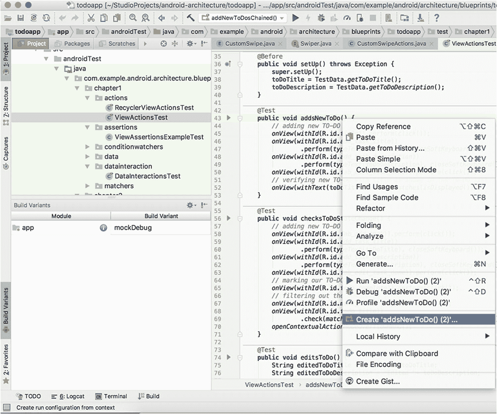

图 1-7
创建插桩测试配置

然后从弹出菜单中选择“Create”并用“OK”按钮确认。见图 1-18。

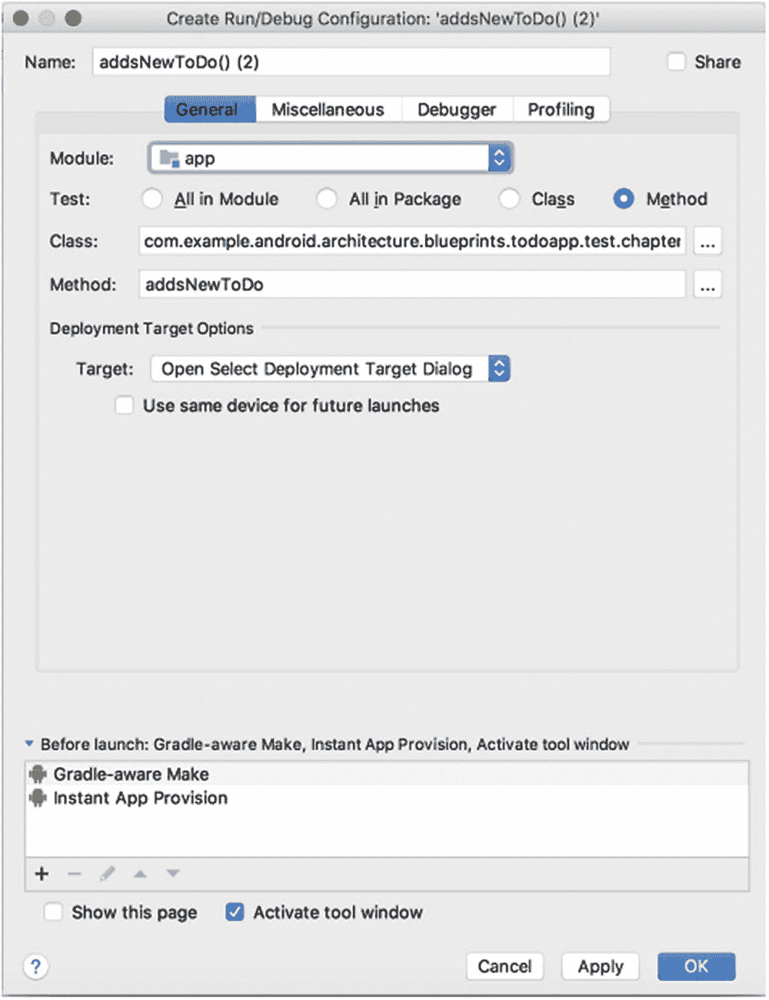

图 1-18
创建插桩测试运行配置

完成这些步骤后，我们就可以运行选定的测试了。通过点击 AndroidStudio 工具栏中的箭头按钮来运行测试。

### 从终端运行 Espresso 测试

有多种方法可以从终端运行 Espresso 和 Android Instrumentation 测试。其中包括：

*   使用 shell 命令运行 Instrumentation 测试
*   使用 Gradle 命令运行 Instrumentation 测试

#### 使用 Shell 命令运行 Instrumentation 测试

以下`shell`命令可用于运行位于`app`模块中的测试。

*使用 Android Testing Support Library 运行 App 模块测试。*
```
adb shell am instrument -w com.example.android.architecture.blueprints.todoapp.mock.test/android.support.test.runner.AndroidJUnitRunner
```

*使用 AndroidX Test Library 运行 App 模块测试。*
```
adb shell am instrument -w com.example.android.architecture.blueprints.todoapp.test/androidx.test.runner.AndroidJUnitRunner
```

如果要运行特定测试类中的测试，需要将`-e class <Class>`参数添加到之前的命令中。

*使用 Android Testing Support Library 运行 chapter1.actions.ViewActionsTest.java 类中的测试。*
```
adb shell am instrument -w -r -e debug false -e class com.example.android.architecture.blueprints.todoapp.test.chapter1.actions.ViewActionsTest com.example.android.architecture.blueprints.todoapp.test/android.support.test.runner.AndroidJUnitRunner
```

*使用 AndroidX Test Library 运行 chapter1.actions.ViewActionsTest.java 类中的测试。*
```
adb shell am instrument -w -r -e debug false -e class com.example.android.architecture.blueprints.todoapp.test.chapter1.actions.ViewActionsTest#addsNewToDo com.example.android.architecture.blueprints.todoapp.mock.test/androidx.test.runner.AndroidJUnitRunner
```

为了运行特定的测试方法或函数，`class`参数可以扩展`#<testMethod>`值，如下所示。

*使用 Android Testing Support Library 运行 chapter1.actions.ViewActionsTest.addsNewToDo() 测试。*
```
adb shell am instrument -w -r -e debug false -e class com.example.android.architecture.blueprints.todoapp.test.chapter1.actions.ViewActionsTest#addsNewToDo com.example.android.architecture.blueprints.todoapp.test/android.support.test.runner.AndroidJUnitRunner
```

*使用 AndroidX Test Library 运行 chapter1.actions.ViewActionsTest.addsNewToDo() 测试。*
```
adb shell am instrument -w -r -e debug false -e class com.example.android.architecture.blueprints.todoapp.test.chapter1.actions.ViewActionsTest#addsNewToDo com.example.android.architecture.blueprints.todoapp.mock.test/androidx.test.runner.AndroidJUnitRunner
```

如果要运行配置为使用 Android Test Orchestrator 的测试，应使用以下 shell 命令。

*使用 Android Testing Support Library 运行 chapter1.actions.ViewActionsTest.addsNewToDo() 测试。*
```
adb shell CLASSPATH=$(adb shell pm path android.support.test.services) app_process / android.support.test.services.shellexecutor.ShellMain am instrument -r -w -e targetInstrumentation com.example.android.architecture.blueprints.todoapp.mock.test/android.support.test.runner.AndroidJUnitRunner   -e debug false -e class 'com.example.android.architecture.blueprints.todoapp.test.chapter1.actions.ViewActionsTest#addsNewToDo' -e clearPackageData true android.support.test.orchestrator/android.support.test.orchestrator.AndroidTestOrchestrator
```

*使用 AndroidX Test Library 运行 chapter1.actions.ViewActionsTest.addsNewToDo() 测试。*
```
adb shell CLASSPATH=$(adb shell pm path androidx.test.services) app_process / androidx.test.services.shellexecutor.ShellMain am instrument -r -w -e targetInstrumentation com.example.android.architecture.blueprints.todoapp.mock.test/androidx.test.runner.AndroidJUnitRunner   -e debug false -e class 'com.example.android.architecture.blueprints.todoapp.test.chapter1.actions.ViewActionsTest#addsNewToDo' -e clearPackageData true androidx.test.orchestrator/androidx.test.orchestrator.AndroidTestOrchestrator
```

#### 使用 Gradle 命令运行 Instrumentation 测试

应使用以下 Gradle 命令来运行`app`项目模块中的所有测试（当前目录必须是项目的根目录）：

```
./gradlew app:connectedAndroidTest
```

请注意，对于我们的示例应用程序项目（以及您可能使用的许多其他项目），要测试应用程序，应使用`debug build`类型构建。此外，我们还有不同的构建变体——`mock`和`prod`——如`build.gradle`文件所述。这意味着运行`app`模块中所有测试的命令将随之改变，以反映构建类型和变体，如下所示：

```
./gradlew app:connectedMockDebugAndroidTest
```

与 shell 命令一样，Gradle 命令也可以接受附加参数，以便运行特定的测试类或测试方法。以下是运行特定测试类中测试的示例：

```
./gradlew app:connectedMockDebugAndroidTest -Pandroid.testInstrumentationRunnerArguments.class=com.example.android.architecture.blueprints.todoapp.test.chapter1.actions.ViewActionsTest
```

与 shell 命令类似，Gradle 中的`class`参数可以扩展`#<testMethod>`值。

*运行 chapter1.actions.ViewActionsTest.checksToDoStateChange() 测试。*
```
./gradlew app:connectedMockDebugAndroidTest -Pandroid.testInstrumentationRunnerArguments.class=com.example.android.architecture.blueprints.todoapp.test.chapter1.actions.ViewActionsTest#checksToDoStateChange
```

### 练习 5

**创建测试运行配置**

1.  为测试方法、测试类和包创建一个测试运行配置。运行测试。
2.  通过导航至 AndroidStudio 菜单 “Run” -> “Edit Configurations...”编辑其中一个配置。删除其中一个配置。
3.  练习使用`shell`终端命令运行测试类或特定的测试方法。
4.  练习使用`gradle`终端命令运行测试类或特定的测试方法。

## 总结
在本第一章中，您学习了所有关于 Espresso 的基础知识，从依赖声明到编写简单的测试，这将为本书后面描述的更高级示例奠定基础。此外，您还了解了如何使用 Monitor 和 Layout Inspector 工具检查应用程序布局，以及构建过程的样式以及如何从 AndroidStudio IDE 配置和运行 Espresso 测试。

