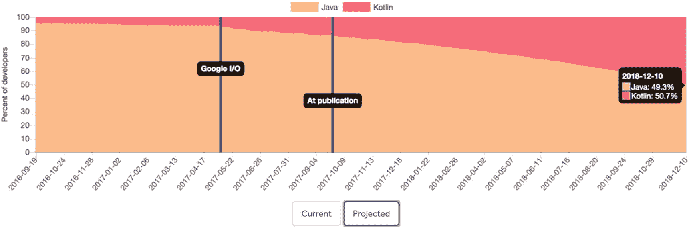
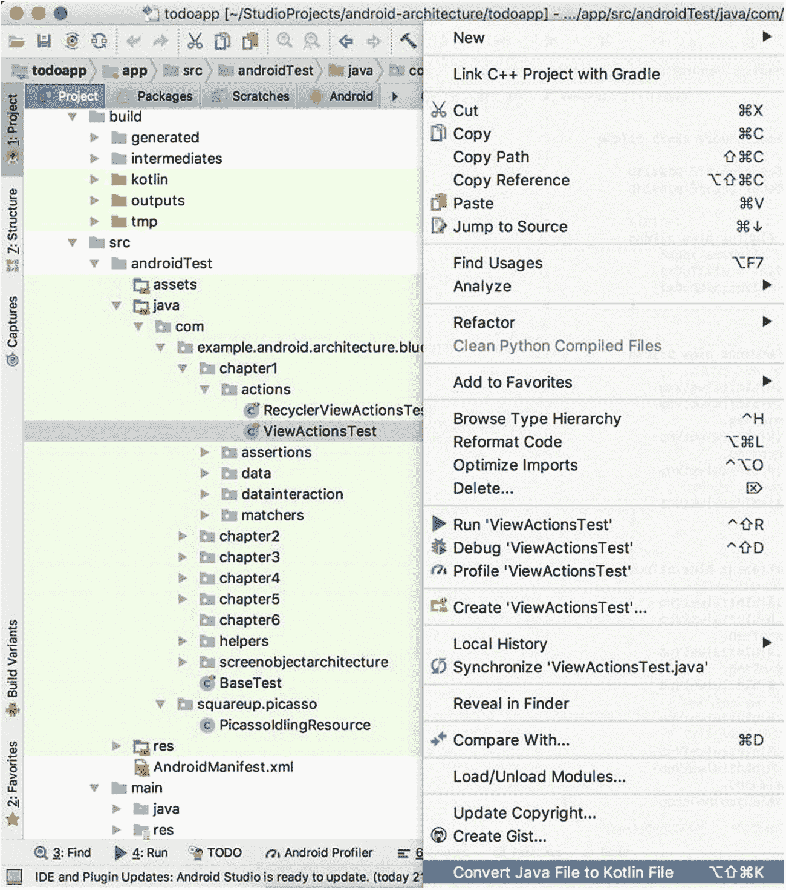
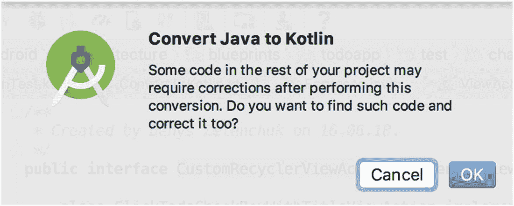
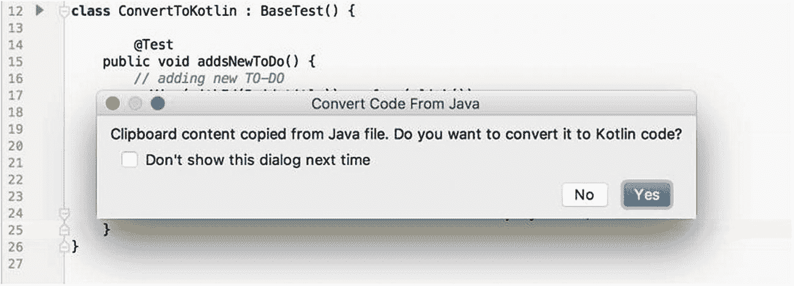
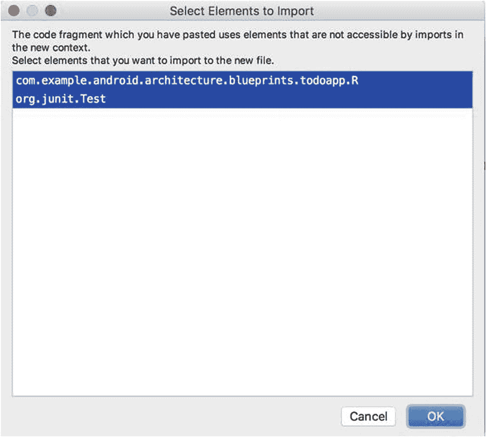
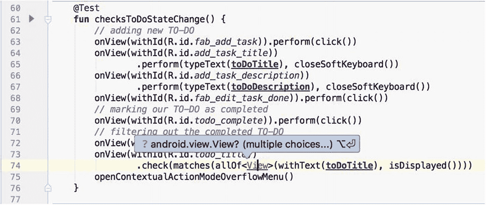
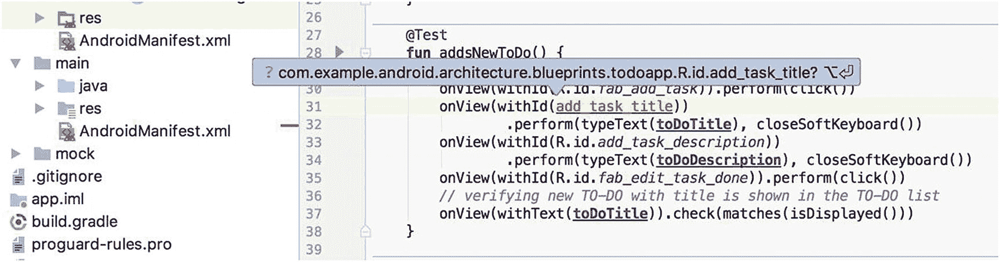
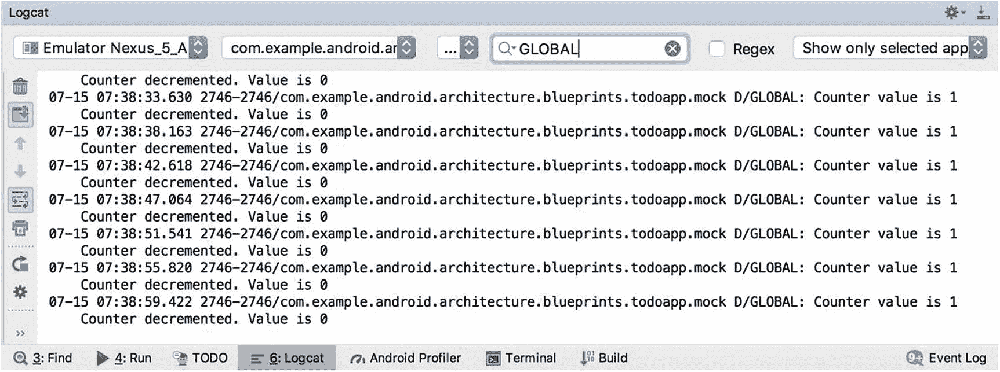

# 使用 Kotlin 编写 Espresso 测试

2017 年 5 月的 Google I/O 大会宣布了对 Kotlin 的官方支持。从那一刻起，Kotlin 在 Android 开发者中的受欢迎程度迅速飙升。考虑到当前的趋势以及 Google 关于将 Android 转向 Kotlin 的公告（这在 Android 文档和代码示例中都有体现），我们可以假设在两到三年内，Kotlin 将取代 Java。

图 3-1 显示了 Java 与 Kotlin 的使用预测，表明 Kotlin 很快将在 Android 开发领域超越 Java。



**图 3-1** Android 上 Kotlin 与 Java 的使用情况对比（来源：[`https://realm.io/realm-report/`](https://realm.io/realm-report/)）

本章将解释如何将现有的 Espresso Java 测试迁移到 Kotlin，列出用 Kotlin 编写 UI 测试可能带来的好处，并通过实际示例和任务提供创建 Espresso DSL 的示例。

## 将 Espresso Java 测试迁移到 Kotlin

Kotlin 在 Android 上与 Java 协同工作，这意味着您可以将 Kotlin 代码添加到现有项目中，并且可以像调用 Kotlin 代码一样从 Kotlin 调用 Java 代码，反之亦然。

第一步是通过将 `kotlin-gradle-plugin` 依赖项添加到项目的 `build.gradle` 文件中，来告知 Android Studio IDE 该项目使用了 Kotlin，如下所示：

```
dependencies {
    classpath "com.android.tools.build:gradle:3.1.4"
    classpath "org.jetbrains.kotlin:kotlin-gradle-plugin:1.2.61"
    ...
}
```

项目同步后，您可以开始将 Java 类转换为 Kotlin。这可以通过选择一个 Java 文件或包，打开 Code 菜单，然后选择 Convert Java File to Kotlin File 选项轻松实现。您也可以右键单击文件或包，然后从弹出菜单中选择此选项（见图 3-2）。



**图 3-2** 将 Java 文件转换为 Kotlin

对于测试类文件来说，事情可能看起来很简单，但对于复杂的 `ViewAction` 或 `ViewMatcher` 来说，可能会很复杂。当 IDE 转换器无法处理代码的复杂性时，它将需要开发人员的干预。图 3-3 中的对话框会提醒开发人员注意这一事实。



**图 3-3** 从 Java 转换为 Kotlin 时的代码更正

您也可以将现有的 Java 代码粘贴到 Kotlin 文件中。在这种情况下，IDE 会识别出剪贴板中的代码是从 Java 文件复制的，并会建议将其转换为 Kotlin 代码，如图 3-4 所示。



**图 3-4** 将剪贴板中的 Java 代码转换为 Kotlin

如果 Kotlin 文件中不存在这些导入，系统将要求您添加它们，如图 3-5 所示。



**图 3-5** 转换为 Kotlin 后向文件中添加新导入

转换无法处理具有多个导入的方法。这也需要开发人员手动干预（见图 3-6）。



**图 3-6** 从 Java 转换为 Kotlin 时的多个选择

下面显示了一个 Espresso UI 测试方法从 Java 转换为 Kotlin 的示例。您可能会注意到，除了函数声明和行尾的分号之外，几乎没有区别。

*分别在 Java 和 Kotlin 语言中添加一个新的 TO-DO 测试。*


```
@Test
public void addsNewToDo() {
    // 添加新的待办事项
    onView(withId(R.id.title)).perform(click());
    onView(withId(R.id.add_task_title))
        .perform(typeText(toDoTitle), closeSoftKeyboard());
    onView(withId(R.id.add_task_description))
        .perform(typeText(toDoDescription), closeSoftKeyboard());
    onView(withId(R.id.fab_edit_task_done)).perform(click());
    // 验证带有该标题的新待办事项已显示在待办事项列表中
    onView(withText(toDoTitle)).check(matches(isDisplayed()));
}

@Test
fun addsNewToDo() {
    // 添加新的待办事项
    onView(withId(R.id.title)).perform(click())
    onView(withId(R.id.add_task_title))
        .perform(typeText(toDoTitle), closeSoftKeyboard())
    onView(withId(R.id.add_task_description))
        .perform(typeText(toDoDescription), closeSoftKeyboard())
    onView(withId(R.id.fab_edit_task_done)).perform(click())
    // 验证带有该标题的新待办事项已显示在待办事项列表中
    onView(withText(toDoTitle)).check(matches(isDisplayed()))
}
```

你可以在 `chapter3/testsamples` 包中，基于 `ViewActionsTest.kt`、`RecyclerViewActionsTest.kt` 和 `DataInteractionsTest.kt` 类实现的示例，查看更多将 Java 文件转换为 Kotlin 的示例。

## 练习 10

## 将 Java 代码转换为 Kotlin

1. 将现有的 Java 文件转换为 Kotlin。
2. 将包含多个 Java 文件的包转换为 Kotlin。
3. 复制一个 Java 代码示例并粘贴到 Kotlin 文件中。如果只粘贴 Java 方法的一半，会发生什么？转换结果还会正确吗？

## 用 Kotlin 编写测试的好处

将 Kotlin 引入测试代码库有许多优势，其中包括：

- 函数作为类型支持
- 扩展函数
- 字符串模板
- 能够导入 `R.class` 资源
- 更简洁的代码

### 函数作为类型

这个过程将函数保存到变量中，然后将其用作另一个函数的参数，或通过另一个函数返回一个函数。在下面的示例中，你可以看到 Espresso 的 `ViewMatchers.withText()` 函数是如何作为 `viewWithText()` 函数的值返回的：

```
fun viewWithText(text: String): ViewInteraction =
    Espresso.onView(ViewMatchers.withText(text))
```

### 扩展函数

扩展并不会真正修改它们所扩展的类。通过定义扩展，你并没有向类中添加新成员，只是使新函数能够通过点表示法在该类型的实例上调用。借助扩展函数，Espresso 的 `perform(ViewAction.typeText())` 函数可以用以下方式表示：

```
fun ViewInteraction.type(text: String): ViewInteraction =
    perform(ViewActions.typeText(text))
```

在这个示例中，我们为 `ViewInteraction` 类扩展了一个额外的 `type()` 方法。

### 字符串模板

字符串可以包含模板表达式，即经过求值并将结果连接到字符串中的代码片段。模板表达式以美元符号（`$`）开头，包含一个简单的名称。请看这个示例：

```
fun main(args: Array) {
    val i = 10
    println("i = $i") // 输出 "i = 10"
}
```

或者考虑花括号中的任意表达式：

```
fun main(args: Array) {
    val s = "abc"
    println("$s.length is ${s.length}") // 输出 "abc.length is 3"
}
```

### 导入 `R.class` 资源

Kotlin 与 Kotlin Android Gradle 插件一起，简化了项目资源（包括字符串值、ID 和可绘制对象）的访问方式。在下面的清单中，基于 `chapter3/testsamples/ViewActionsKotlinTest.kt` 文件中的 `addsNewToDo()` 测试实现，你可以看到 Kotlin 如何允许我们导入应用程序资源。

*chapter3.testsamples.ViewActionsKotlinTest.kt*

```
... // 其他导入和包声明
import com.example.android.architecture.blueprints.todoapp.R.id.*

class ViewActionsKotlinTest : BaseTest() {
    private var toDoTitle = ""
    private var toDoDescription = ""

    @Before
    override fun setUp() {
        super.setUp()
        toDoTitle = TestData.getToDoTitle()
        toDoDescription = TestData.getToDoDescription()
    }

    @Test
    fun addsNewToDo() {
        // 添加新的待办事项
        onView(withId(fab_add_task)).perform(click())
        onView(withId(add_task_title))
            .perform(typeText(toDoTitle), closeSoftKeyboard())
        onView(withId(add_task_description))
            .perform(typeText(toDoDescription), closeSoftKeyboard())
        onView(withId(fab_edit_task_done)).perform(click())
        // 验证带有该标题的新待办事项已显示在待办事项列表中
        onView(withText(toDoTitle)).check(matches(isDisplayed()))
    }
}
```

与导入整个 `R.class` 不同，Android Studio IDE 允许你只导入一个或几个资源（见图 3-7）。



**图 3-7** 使用 Kotlin 导入 R 类资源

## Kotlin 中的 Espresso 领域特定语言

借助 Kotlin 的扩展函数和函数作为类型支持，我们可以通过实现 Espresso 领域特定语言（DSL），大幅减少测试代码的样板。我们的 Espresso DSL 的目标是简化测试代码库，使其更易读，最重要的是，让我们的测试易于编写和维护。

首先，我们必须确定在 UI 测试代码库中最常使用的 Espresso 函数或表达式：

- 由 `Espresso.onView()` 和 `Espresso.onData()` 方法表示的视图或数据交互——这是每一行 Espresso 测试代码的起点。
- 不同的视图操作，例如 `ViewActions.click()`、`ViewActions.typeText()`、`ViewActions.swipeDown()`、`ViewActions.closeSoftKeyboard()` 等。
- 大量的视图匹配器，这些是测试代码库中最常用的函数，因为它们不仅用于定位页面上的元素，还用于结合视图断言检查视图属性：`ViewMatchers.withId()`、`ViewMatchers.withText()`、`check(matches(ViewMatchers.isDisplayed()))` 等。
- 聚合的 Hamcrest 匹配器，如 `Matchers.allOf()` 或 `Matchers.anyOf()`。
- RecyclerView 操作，例如 `RecyclerViewActions.scrollToHolder()` 和 `RecyclerViewActions.actionOnItem()`。

当然，这个列表可以根据你的需求进行扩展或缩减。值得强调的是，本段的目的不是将 Espresso DSL 与 Kotlin 标准化，而是提供一个如何实现的示例，以便你可以将其应用到你的测试项目中。

核心的 `Espresso.onView()` 和 `Espresso.onData()` 方法是我们将首先处理的函数。鉴于它们始终接受一个视图匹配器或对象匹配器参数，我们可以将整个表达式转换为一个单一的 Kotlin 函数，如下所示：

```
fun viewWithText(text: String): ViewInteraction = Espresso.onView(ViewMatchers.withText(text))
```

或者在 `onData()` 的情况下：

```
fun onAnyData(): DataInteraction = Espresso.onData(CoreMatchers.anything())
```

你可能会注意到，返回类型与 `onView()` 和 `onData()` 方法返回的类型相同——分别是 `ViewInteraction` 和 `DataInteraction`。另一点是，可以将参数传递给扩展函数，并在原始函数内部使用。这些示例使用 Kotlin 局部函数（即函数内部的函数）来简化代码，可以用以下更复杂的函数声明来表示：

```
fun viewWithText(text: String): ViewInteraction {
    return Espresso.onView(ViewMatchers.withText(text))
}
```

以及

```
fun onAnyData(): DataInteraction {
    return Espresso.onData(CoreMatchers.anything())
}
```


现在开始对视图操作进行说明。是时候使用 Kotlin 扩展函数了。以下是 Espresso 对带文本的视图执行点击操作的方式：

```
onView(withText("item 1")).perform(ViewActions.click())
```

你已经知道，`onView()`方法返回一个`ViewInteraction`类型，该类型包含`perform()`公有方法。现在我们要声明另一个函数，用来替换`perform(ViewActions.click())`。为了保持`ViewInteraction`类的点号表示法，我们将用新函数对其扩展，如下所示：

```
fun ViewInteraction.click(): ViewInteraction = perform(ViewActions.click())
```

这样，我们用简单的`click()`函数表示了`perform(ViewActions.click())`表达式。这个使用带文本视图的示例现在看起来是这样的：

```
viewWithText("item 1").click()
```

这里我们同样保持了正确的返回类型`ViewInteraction`。它与原始`perform()`方法返回的类型相同。

同样的扩展函数可以添加到`DataInteraction`类。我们只需要将`ViewInteraction`扩展类替换为`DataInteraction`：

```
fun DataInteraction.click(): ViewInteraction = perform(ViewActions.click())
```

就这样，目前看来还不错。

接下来是视图匹配器和视图断言，它们也使用了同样的扩展函数方法。以下是一个视图显示状态的断言示例：

```
onView(withText("item 1")).check(matches(isDisplayed()))
```

表达式的`check`部分可以用这个扩展函数替换：

```
fun ViewInteraction.checkDisplayed(): ViewInteraction =
check(ViewAssertions.matches(ViewMatchers.isDisplayed()))
```

结合`viewWithText()`扩展函数示例，这被转换为以下简化表达式：

```
viewWithText("item 1").checkIsDisplayed()
```

再次说明，将`ViewInteraction`替换为`DataInteraction`类可以为`DataInteraction`添加相同的扩展函数。

```
fun DataInteraction.checkDisplayed(): ViewInteraction =
check(ViewAssertions.matches(ViewMatchers.isDisplayed()))
```

有了`Espresso.onView()`、`ViewActions`和`ViewAssertions`方法的 DSL 示例，我们可以比较一个常用的原始 Espresso 表达式和一个用 DSL 编写的表达式（同时假设我们已经导入了所有 Espresso 静态方法）：

```
onView(withText("item 1")).check(matches(isDisplayed())).perform(click())
```

这是使用 DSL 编写的同一行代码：

```
viewWithText("item 1").checkIsDisplayed().click()
```

我们可以将同样的方法应用于聚合的`allOf()` Hamcrest 匹配器：

```
check(matches(allOf(withText(), isDisplayed())))
```

这将变成`allOf()`函数，如下所示：

```
fun ViewInteraction.allOf(vararg matcher: Matcher): ViewInteraction {
return check(ViewAssertions.matches(Matchers.allOf(matcher.asIterable())))
}
```

用法如下：

```
viewWithId(R.id.title).allOf(withText("item 1"), isDisplayed())
```

接下来，我们有 RecyclerView 操作。与前面的示例类似，我们可以处理 RecyclerView 操作。以下示例基于`RecyclerViewActions.actionOnItemAtPosition()`，如下所示：

```
onView(withId(R.id.tasks_list)).perform(actionOnItemAtPosition(10, scrollTo()));
```

将此方法应用于 DSL 后，我们得到以下表达式：

```
fun ViewInteraction.actionAtPosition(position: Int, action: ViewAction): ViewInteraction =
perform(actionOnItemAtPosition(position, action))
```

因此，最终用法是：

```
viewWithId(R.id.tasks_list)).actionAtPosition(10, scrollTo())
```

这些示例以及更多内容都定义在我们示例项目的`chapter3/EspressoDsl.kt`文件中，供你参考。

现在是时候将我们的领域特定语言应用到测试中，并观察转换后的 Espresso Kotlin 测试与使用 DSL 编写的测试有何不同。首先，我们来看一下`ViewActionsKotlinTest.kt`中实现的`ViewActions`测试示例。

**`checksToDoStateChange()` 测试方法实现于 `chapter3.testsamples.ViewActionsKotlinTest.kt`。**

```
@Test
fun checksToDoStateChange() {
// 添加新的待办事项
onView(withId(R.id.fab_add_task)).perform(click())
onView(withId(R.id.add_task_title))
.perform(typeText(toDoTitle), closeSoftKeyboard())
onView(withId(R.id.add_task_description))
.perform(typeText(toDoDescription), closeSoftKeyboard())
onView(withId(R.id.fab_edit_task_done)).perform(click())
// 将待办事项标记为已完成
onView(withId(R.id.todo_complete)).perform(click())
// 筛选出已完成的待办事项
onView(withId(R.id.menu_filter)).perform(click())
onView(allOf(withId(R.id.title), withText("Active"))).perform(click())
onView(withId(R.id.todo_title)).check(matches(not(isDisplayed())))
onView(withId(R.id.menu_filter)).perform(click())
onView(allOf(withId(R.id.title), withText("Completed"))).perform(click())
onView(withId(R.id.todo_title))
.check(matches(allOf(withText(toDoTitle), isDisplayed())))
}
```

现在我们可以将其与`ViewActionsKotlinDslTest.kt`中的测试进行比较。

**`checksToDoStateChange()` 测试方法实现于 `chapter3.testsamples.ViewActionsKotlinDslTest.kt`。**

```
// 测试中使用的视图交互
private val addFab = viewWithId(fab_add_task)
private val taskTitleField = viewWithId(add_task_title)
private val taskDescriptionField = viewWithId(add_task_description)
private val editDoneFab = viewWithId(fab_edit_task_done)
private val todoCheckbox = viewWithId(todo_complete)
private val toolbarFilter = viewWithId(menu_filter)
private val todoTitle = viewWithId(todo_title)
private val allFilterOption = onView(allOf(withId(title), withText("All")))
private val activeFilterOption = onView(allOf(withId(title), withText("Active")))
private val completedFilterOption = onView(allOf(withId(title), withText("Completed")))
@Test
fun checksToDoStateChangeDsl() {
// 添加新的待办事项
addFab.click()
taskTitleField.type(toDoTitle).closeKeyboard()
taskDescriptionField.type(toDoDescription).closeKeyboard()
editDoneFab.click()
// 将待办事项标记为已完成
todoCheckbox.click()
// 筛选出已完成的待办事项
toolbarFilter.click()
activeFilterOption.click()
todoTitle.checkNotDisplayed()
toolbarFilter.click()
completedFilterOption.click()
todoTitle.checkMatches(allOf(withText(toDoTitle), isDisplayed()))
}
```

你可能已经注意到，使用 DSL 实现的测试方法更加清晰易读。为了进一步提高可读性，我们在测试类开头声明了所有使用的视图交互。这使得测试更加流畅。

**练习 11**

**实践 Espresso DSL 用法**

1.  仔细阅读`DataInteractionKotlinDslTest.kt`和`RecyclerViewActionsKotlinDslTest.kt`类中实现的测试，理解 DSL 是如何应用于这些测试的。

2.  基于`ViewActionsKotlinTest.kt`中的`editsToDo()`测试方法，使用 DSL 完成位于`ViewActionsKotlinDslTest.kt`中的`editsToDoDsl()`测试用例的实现。

**总结**

在 Java 语言主导 Android 平台多年之后，Kotlin 为其应用和测试开发带来了新鲜且进步的方法。用 Kotlin 编写的测试更易读、更简洁、更易于维护。其扩展函数支持允许开发者轻松创建和测试领域特定语言，这进一步简化了测试代码。从 Java 迁移到 Kotlin 是无痛且快速的。最终，很明显在某个时间点 Kotlin 将在 Android 应用开发中取代 Java。你应该做好准备，至少迁移到 Kotlin 并改进你的测试代码。

**4. 处理网络操作和异步操作**


好的，作为高级文档工程师和翻译员，我将遵循您提供的注意事项，将以下英文文本翻译成中文。


## Espresso 框架中的同步机制

Espresso 框架的主要优势之一是其测试的健壮性。这是通过自动化同步大部分测试操作来实现的。当主应用程序 UI 线程繁忙时，Espresso 会等待它，并在 UI 线程变为空闲后释放测试操作。此外，在进入下一个测试步骤之前，它还会等待 `AsyncTask` 操作完成。在本章中，我们将了解 Espresso 如何使用 `IdlingResource` 机制处理网络操作，并熟悉作为 `IdlingResource` 替代方案的 `ConditionWatcher` 机制。

## IdlingResource 基础

每次您的测试调用 `onView()` 或 `onData()` 时，Espresso 会等待，直到满足以下同步条件后，才执行相应的 UI 操作或断言：

*   消息队列为空。
*   当前没有正在执行任务的 `AsyncTask` 实例。
*   所有开发者定义的空闲资源都处于空闲状态。

通过执行这些检查，Espresso 大大提高了在任何给定时间点只有一个 UI 操作或断言可能发生的可能性。此功能为您提供了更可靠和可信赖的测试结果。

然而，并非在所有情况下都能依赖自动同步，例如，当被测试的应用程序通过 `ThreadPoolExecutor` 执行网络调用时。为了让 Espresso 处理这类长时间运行的异步操作，必须在执行测试之前创建并注册 `IdlingResource`。当这些操作更新您想要进一步验证的应用程序 UI 时，注册 `IdlingResource` 非常重要。

可以使用 `IdlingResource` 的常见用例是当您的应用程序：

*   执行网络调用。
*   建立数据库连接。

目前，Espresso 提供了以下空闲资源：

*   `CountingIdlingResource` — 维护一个活动任务的计数器。当计数器为零时，关联的资源被视为空闲。此功能与信号量非常相似。在大多数情况下，此实现足以管理测试期间应用的异步工作。
*   `UriIdlingResource` — 类似于 `CountingIdlingResource`，但计数器需要在一段特定时间内保持为零，资源才被视为空闲。这个额外的等待时间考虑到了连续的网络请求，即线程中的应用可能在收到前一个请求的响应后立即发出一个新请求。
*   `IdlingThreadPoolExecutor` — 一个自定义的 `ThreadPoolExecutor` 实现，它跟踪所创建线程池中正在运行的任务总数。该类使用 `CountingIdlingResource` 来维护活动任务的计数器。
*   `IdlingScheduledThreadPoolExecutor` — 一个自定义的 `ScheduledThreadPoolExecutor` 实现。它提供与 `IdlingThreadPoolExecutor` 类相同的功能，但它还可以跟踪计划在未来执行或定期执行的任务。

要在应用程序中开始使用空闲资源机制，必须将以下依赖项添加到应用程序的 `buid.gradle` 文件中（依赖项针对 Android Support 和 AndroidX 库列出）。

**Android Support 库中的 IdlingResource 依赖项：**

```
androidTestImplementation "com.android.support.test.espresso.idling:idling-concurrent:3.0.1"
```

**AndroidX 库中的 IdlingResource 依赖项：**

```
androidTestImplementation 'androidx.test.espresso.idling:idling-concurrent:3.1.0'
```

这些空闲资源类型在其实现中使用了 `CountingIdlingResource`，因此我们将重点参考 `CountingIdlingResource`。

`IdlingResource` 接口包含三个方法：

*   `getName()` — 返回资源的名称。

    > **注意：** `IdlingResource` 名称由 `String` 类表示，并在日志记录以及注册/注销时使用。因此，资源名称应该是唯一的。

*   `isIdleNow()` — 如果资源当前空闲，则返回 `true`。Espresso 会始终在主线程中调用此方法；因此，它应该是非阻塞的并立即返回。

*   `registerIdleTransitionCallback()` — 向空闲资源注册给定的资源回调。然后，在 `isIdleNow()` 方法中使用已注册的回调。

    > **注意：** `IdlingResource` 类包含一个 `ResourceCallback` 接口，该接口在 `registerTransitionCallback()` 方法中使用。每当应用程序要从繁忙状态切换到空闲状态时，都应调用 `callback.onTransitionToIdle()` 方法来通知 Espresso。

`CountingIdlingResource` 是 `IdlingResource` 的一个实现，它通过维护一个内部计数器来判断空闲状态。当计数器为零时，视为空闲；当计数器非零时，则非空闲。这与 `java.util.concurrent.Semaphore` 的行为非常相似。可以从任何线程递增或递减计数器。如果达到非逻辑状态（例如计数器小于零），则会抛出 `IllegalStateException`。然后，此类可用于包装那些在执行过程中会阻止测试访问 UI 的操作。

## 编写代码

以下是我们应用程序中简单的 `CountingIdlingResource` 的样子（请参阅主应用程序源代码中的 `util/SimpleCountingIdlingResource.java` 文件）：

```java
public final class SimpleCountingIdlingResource implements IdlingResource {
    private final String mResourceName;
    private final AtomicInteger counter = new AtomicInteger(0);
    // 从主线程写入，从任何线程读取。
    private volatile ResourceCallback resourceCallback;

    /**
     * 创建一个 SimpleCountingIdlingResource
     *
     * @param resourceName 要向 Espresso 报告的资源名称。
     */
    public SimpleCountingIdlingResource(String resourceName) {
        mResourceName = checkNotNull(resourceName);
    }

    @Override
    public String getName() {
        return mResourceName;
    }

    @Override
    public boolean isIdleNow() {
        return counter.get() == 0;
    }

    @Override
    public void registerIdleTransitionCallback(ResourceCallback resourceCallback) {
        this.resourceCallback = resourceCallback;
    }

    /**
     * 递增正在监视的资源的进行中事务计数。
     */
    public void increment() {
        counter.getAndIncrement();
    }

    /**
     * 递减正在监视的资源的进行中事务计数。
     *
     * 如果此操作导致计数器低于 0 - 则会引发异常。
     *
     * @throws IllegalStateException 如果计数器低于 0。
     */
    public void decrement() {
        int counterVal = counter.decrementAndGet();
        if (counterVal == 0) {
            // 我们已从非零变为零。这意味着我们现在空闲了！告诉 Espresso。
            if (null != resourceCallback) {
                resourceCallback.onTransitionToIdle();
            }
        }
        if (counterVal < 0) {
            throw new IllegalArgumentException("计数器已损坏！");
        }
    }
}
```

`SimpleCountingIdlingResource` 类被同一位置中持有其静态引用的 `EspressoIdlingResource` 类所使用（请参阅 `util/EspressoIdlingResource.java` 文件），并且它使用其 `increment()` 和 `decrement()` 方法：

```java
public class EspressoIdlingResource {
    private static final String RESOURCE = "GLOBAL";
    private static SimpleCountingIdlingResource mCountingIdlingResource =
        new SimpleCountingIdlingResource(RESOURCE);

    public static void increment() {
        mCountingIdlingResource.increment();
    }

    public static void decrement() {
        mCountingIdlingResource.decrement();
    }

    public static IdlingResource getIdlingResource() {
        return mCountingIdlingResource;
    }
}
```


现在让我们来看一下主应用源代码中`tasks/TasksPresenter.java`类的实现，该类使用了`EspressoIdlingResource`。这个类负责加载待办事项并在待办事项列表中呈现它们。你可以看到，当任务加载过程开始时，会调用`EspressoIdlingResource.increment()`方法来暂停测试。当任务加载完成后，会调用`EspressoIdlingResource.decrement()`来通知 Espresso 即将进入空闲状态：

```java
private void loadTasks(boolean forceUpdate, final boolean showLoadingUI) {
    if (showLoadingUI) {
        mTasksView.setLoadingIndicator(true);
    }
    if (forceUpdate) {
        mTasksRepository.refreshTasks();
    }
    // 网络请求可能在不同的线程中处理，因此请确保 Espresso 知道应用在响应处理完成前处于忙碌状态。
    EspressoIdlingResource.increment(); // 应用在进一步通知前保持忙碌
    mTasksRepository.getTasks(new TasksDataSource.LoadTasksCallback() {
        @Override
        public void onTasksLoaded(List tasks) {
            List tasksToShow = new ArrayList();
            // 此回调可能被调用两次：一次用于缓存，一次用于从服务器 API 加载数据，
            // 因此我们在递减前进行检查，否则会抛出"Counter has been corrupted!"异常。
            if (!EspressoIdlingResource.getIdlingResource().isIdleNow()) {
                EspressoIdlingResource.decrement(); // 将应用设为空闲状态。
            }
            ... // 其他代码
        }
    }
}
```

## 运行第一个测试

为了实际观察`EspressoIdlingResource`的运行情况，我们在`SimpleCountingIdlingResource.java`类的`increment()`和`decrement()`方法中添加一些日志，并运行`addNewToDosChained()`测试：

```java
@Override
public boolean isIdleNow() {
    Log.d(getName(), "Counter value is " + counter.get());
    return counter.get() == 0;
}
```

以及：

```java
public void decrement() {
    int counterVal = counter.decrementAndGet();
    Log.d(getName(), "Counter decremented. Value is " + counterVal);
    if (counterVal == 0) {
        // 我们从非零变为零。这意味着现在空闲了！通知 Espresso。
        if (null != resourceCallback) {
            resourceCallback.onTransitionToIdle();
        }
    }
    if (counterVal < 0) {
        throw new IllegalArgumentException("Counter has been corrupted!");
    }
}
```

在测试运行期间，观察我们应用程序的 logcat 日志，可以通过`GLOBAL`标签进行过滤。图 4-1 展示了你将会看到的内容；每次添加一个待办事项时，待办事项列表会显示给用户，并且计数器会在加载完成后立即递增和递减。



**图 4-1** 空闲资源计数器日志记录

`IdlingResource`应在使用前注册。`IdlingRegistry`负责注册和注销`IdlingResource`。

*注册和注销 IdlingResource 实例。*

```kotlin
@Before
fun registerResources() {
    val idlingRegistry = IdlingRegistry.getInstance()
    val okHttp3IdlingResource = OkHttp3IdlingResource(client)
    val picassoIdlingResource = PicassoIdlingResource()
    idlingRegistry.register(okHttp3IdlingResource)
    idlingRegistry.register(picassoIdlingResource)
}
@After
fun unregisterResources() {
    val idlingRegistry = IdlingRegistry.getInstance()
    for (idlingResource in idlingRegistry.resources) {
        if (idlingResource == null) {
            continue
        }
        idlingRegistry.unregister(idlingResource)
    }
}
```

至此，`CountingIdlingResource`机制应该已经清楚了。这个示例描述了我们在测试中处理应用程序长时间运行或异步操作的方法。在使用这类空闲资源时务必小心，不要在测试执行期间将其锁定。

## `OkHttp3IdlingResource`

我们要查看的另一个空闲资源示例是`OkHttp3IdlingResource`。为什么我们要特别关注它？`OkHttp`是最常用的 HTTP 客户端库之一。它由 Square 开发，并广泛应用于许多 Android 应用程序中。可能正因如此，Square 开发者 Jake Wharton 实现并开源了这个资源。请参见：[`github.com/JakeWharton/okhttp-idling-resource`](https://github.com/JakeWharton/okhttp-idling-resource)。以下是它的实现。

*chapter4.idlingresources.OkHttp3IdlingResource.kt。*

```java
public final class OkHttp3IdlingResource implements IdlingResource {
    @CheckResult
    @NonNull
    @SuppressWarnings("ConstantConditions") // 作为库的额外防护。
    public static OkHttp3IdlingResource create(@NonNull String name, @NonNull OkHttpClient client) {
        if (name == null) throw new NullPointerException("name == null");
        if (client == null) throw new NullPointerException("client == null");
        return new OkHttp3IdlingResource(name, client.dispatcher());
    }
    private final String name;
    private final Dispatcher dispatcher;
    volatile ResourceCallback callback;
    private OkHttp3IdlingResource(String name, Dispatcher dispatcher) {
        this.name = name;
        this.dispatcher = dispatcher;
        dispatcher.setIdleCallback(new Runnable() {
            @Override public void run() {
                ResourceCallback callback = OkHttp3IdlingResource.this.callback;
                if (callback != null) {
                    callback.onTransitionToIdle();
                }
            }
        });
    }
    @Override public String getName() {
        return name;
    }
    @Override public boolean isIdleNow() {
        return dispatcher.runningCallsCount() == 0;
    }
    @Override public void registerIdleTransitionCallback(ResourceCallback callback) {
        this.callback = callback;
    }
}
```

基本上，这个资源开箱即用，几乎所有事情都为我们处理好了。`isIdleNow()`方法中调用的`dispatcher.runningCallsCount()`方法会返回正在运行的同步和异步请求数量，并与零进行比较。当结果为零时，资源处于空闲状态。不过，要使用它，我们仍然需要执行一些步骤：

1.  在`build.gradle`文件中添加依赖：
    ```
    androidTestCompile 'com.jakewharton.espresso:okhttp3-idling-resource:1.0.0'
    ```
2.  在你的测试代码中，获取`OkHttpClient`实例并创建一个空闲资源：
    ```java
    OkHttpClient client = // ... 获取 OkHttpClient 实例
    IdlingResource resource = OkHttp3IdlingResource.create("OkHttp", client);
    ```
3.  在运行任何 Espresso 测试之前，在测试代码中注册空闲资源：
    ```java
    IdlingRegistry.getInstance().register(resource);
    ```

顺便说一下，不要使用已废弃的`Espresso.registerIdlingResources()`方法；而应使用本节中展示的`IdlingRegistry`实现。

## `PicassoIdlingResource`

Picasso 是 Square 为 Android 开发的一个强大的图片下载和缓存库。Picasso 允许在应用程序中轻松加载图片——通常只需一行代码（[`square.github.io/picasso/`](http://square.github.io/picasso/)）：

```java
Picasso.get().load("http://i.imgur.com/DvpvklR.png").into(imageView);
```

Picasso 是 Android 最流行的图片下载库，这意味着它是另一种`IdlingResource`类型的完美候选。当我们希望确保整个应用程序窗口布局连同图形资源一起加载完成时，可以使用图片下载空闲资源。在需要验证测试中的图形资源时，这一点极其重要。以下是在`androidTest/com.squareup.picasso`包中同样实现的`PicassoIdling`资源示例。

*androidTest/com.squareup.picasso.PicassoIdlingResource.java。*


```java
public class PicassoIdlingResource implements IdlingResource, ActivityLifecycleCallback {
    private static final int IDLE_POLL_DELAY_MILLIS = 100;
    private ResourceCallback mCallback;
    private WeakReference mPicassoWeakReference;
    private final Handler mHandler = new Handler(Looper.getMainLooper());

    @Override
    public String getName() {
        return "PicassoIdlingResource";
    }

    @Override
    public boolean isIdleNow() {
        if (isIdle()) {
            notifyDone();
            return true;
        } else {
            /* 强制在一小段时间后重新检查空闲状态。
             * 如果 isIdleNow() 返回 false，Espresso 只会每隔几秒轮询一次，这可能会拖慢测试速度。
             */
            mHandler.postDelayed(new Runnable() {
                @Override
                public void run() {
                    isIdleNow();
                }
            }, IDLE_POLL_DELAY_MILLIS);
            return false;
        }
    }

    public boolean isIdle() {
        return mPicassoWeakReference == null
                || mPicassoWeakReference.get() == null
                || mPicassoWeakReference.get().targetToAction.isEmpty();
    }

    @Override
    public void registerIdleTransitionCallback(ResourceCallback resourceCallback) {
        mCallback = resourceCallback;
    }

    void notifyDone() {
        if (mCallback != null) {
            mCallback.onTransitionToIdle();
        }
    }

    @Override
    public void onActivityLifecycleChanged(Activity activity, Stage stage) {
        switch (stage) {
            case RESUMED:
                mPicassoWeakReference = new WeakReference(Picasso.with(activity));
                break;
            case PAUSED:
                // 清理引用
                mPicassoWeakReference = null;
                break;
            default: // 无操作
        }
    }
}
```

注意：Picasso 的 `IdlingResource` 之所以放在一个单独的包中，是因为 `Picasso` 类中 `targetToAction` 变量的可见性为包保护级别。

## 作为 `IdlingResource` 替代方案的 `ConditionWatcher`

正如你可能注意到的，`IdlingResource` 的实现并不简单，需要对注册和注销进行持续的控制。此外，在需要特定 Activity 实例才能运行的深度 UI 测试中，使用 `IdlingResource` 也不方便。

作为替代方案，你可以尝试使用 AzimoLabs 的 `ConditionWatcher` 类（`https://github.com/AzimoLabs/ConditionWatcher`）。它是一个简单的类，能使 Android 自动化测试更简单、更快速、更清晰、更直观。它可以将可能出现在任何线程上的操作与测试线程同步。`ConditionWatcher` 可以替代 Espresso 的 `IdlingResources`，也可以与它们并行工作。

其工作原理如下：`ConditionWatcher` 接收一个包含逻辑表达式的 `Instruction` 类实例。测试会暂停，直到条件返回 `true`。之后，测试会立即释放。如果在指定的超时时间内条件未满足，则会抛出异常，测试将失败。

`ConditionWatcher` 在其被请求的同一线程（即测试线程）上执行操作。默认情况下，`ConditionWatcher` 包含三个方法：

- `setWatchInterval()` — 设置周期性检查逻辑表达式的时间间隔。默认设置为 250 毫秒。
- `setTimeoutLimit()` — 设置 `ConditionWatcher` 等待 `checkCondition()` 方法返回真值的超时时间。默认设置为 60 秒。
- `waitForCondition()` — 接收包含逻辑表达式的指令作为参数，并以当前设置的时间间隔调用其 `checkCondition()` 方法，直到该方法返回 `true` 或达到超时时间。在此期间，测试代码将不会执行到下一行。如果达到超时时间，则会抛出 `Exception`。

另一方面，`Instruction` 类的结构与 `IdlingResource` 非常相似：

- `checkCondition()` — 核心方法，相当于 `IdlingResource` 的 `isIdleNow()`。它是一个逻辑表达式，其变化以及被监控的动态资源状态应该在此方法中实现。
- `getDescription()` — 随超时异常一起返回的字符串。测试作者可以包含对测试崩溃调试过程有帮助的信息。
- `setDataContainer()` 和 `getDataContainer()` — 一个捆绑包，可以添加到 `Instruction` 类中，用于共享原始类型（例如，可以创建一个通用的指令，等待任何类型的视图变为可见，而 `resId` 可以通过该捆绑包发送）。

为了开始使用 `ConditionWatcher`，需要在 `build.gradle` 文件中添加以下依赖：

```
dependencies {
    androidTestCompile 'com.azimolabs.conditionwatcher:conditionwatcher:0.2'
}
```

或者直接将 `ConditionWatcher.java` 和 `Instruction.java` 这两个类的源代码复制到你的测试源代码中。

`ConditionWatcher` 最简单的用法示例是等待元素在屏幕上显示的条件：

```
ConditionWatcher.waitForCondition(new Instruction() {
    @Override
    public String getDescription() {
        return "waitForElementIsDisplayed"; // 等待元素显示
    }

    @Override
    public boolean checkCondition() {
        try {
            interaction.check(matches(isDisplayed()));
            return true;
        } catch (NoMatchingViewException ex) {
            return false;
        }
    }
});
```

我更喜欢将 `ConditionWatcher` 封装到一个方法中，而不是创建一个继承 `Instruction` 的类。接下来，你将看到来自 `ConditionWatchers.java` 类的 `waitForElementIsDisplayed(final ViewInteraction interaction, final int timeout)` 观察器示例：

```
public static ViewInteraction waitForElementIsDisplayed(
        final ViewInteraction interaction,
        final int timeout) throws Exception {
    ConditionWatcher.setTimeoutLimit(timeout);
    ConditionWatcher.waitForCondition(new Instruction() {
        @Override
        public String getDescription() {
            return "waitForElementIsDisplayed"; // 等待元素显示
        }

        @Override
        public boolean checkCondition() {
            try {
                interaction.check(matches(isDisplayed()));
                return true;
            } catch (NoMatchingViewException ex) {
                return false;
            }
        }
    });
    return interaction;
}
```

通过这种 `waitForElementIsDisplayed()` 的实现，我们获得了一个重要的好处——如果观察器接收 `ViewInteraction` 作为参数，包装方法可以返回相同的 `ViewInteraction`，这简化了我们的测试源代码：

```
private ViewInteraction addTaskFab = onView(withId(R.id.fab_add_task));

@Test
public void waitForElementCondition() throws Exception {
    waitForElementIsDisplayed(addTaskFab, 4000).perform(click());
}
```

现在让我们转向更复杂的例子。在我们的示例应用中，有一个烦人的 snackbar，每次添加新的待办事项时都会弹出。它不允许我们在等待它消失之前添加多个待办事项到列表中。我们的任务是创建一个观察器，等待 snackbar 视图消失。以下是实现方法。

*chapter4.conditionwatchers.ConditionWatchers.tasksListSnackbarGone().*

```
public static void tasksListSnackbarGone() throws Exception {
    ConditionWatcher.waitForCondition(new Instruction() {
        @Override
        public String getDescription() {
            return "Condition tasksListSnackbarGone"; // 条件：任务列表中的 Snackbar 消失
        }

        @Override
        public boolean checkCondition() {
            final FragmentActivity fragmentActivity = getCurrentActivity();
            if (fragmentActivity != null) {
                Fragment currentFragment = fragmentActivity
                        .getSupportFragmentManager()
                        .findFragmentById(R.id.contentFrame);
                if (currentFragment instanceof TasksFragment) {
                    View contentView =
                            fragmentActivity.getWindow().getDecorView().findViewById(android.R.id.content);
                    if (contentView != null) {
                        TextView snackBarTextView =
                                contentView.findViewById(android.support.design.R.id.snackbar_text);
                        return snackBarTextView == null;
                    }
                }
            }
            return false;
        }
    });
}
```


`ConditionWatchers` 在我们需要等待不同视图状态时非常有用，但我们不应过度依赖它们来延长等待时间。当某个视图状态等待时间过长时，可能会引发问题。如果等待时间过长，可能会被误认为是测试应用本身的问题，此时更合理的做法是提交一个 bug 报告，而不是在测试中处理该问题。理想情况下，在大多数场景中，`IdlingResources` 应处理应用非空闲状态的大部分时间，因此 `ConditionWatchers` 仅应作为等待机制的少量补充，并像示例中的 snackbar 那样偶尔使用。

## 练习 12

**在测试中使用 `ConditionWatcher`**

1.  实现一个测试，打开菜单抽屉并导航到另一个界面。在该测试中，添加一个条件监视器，等待菜单抽屉显示或隐藏。对于显示状态，使用 `ViewMatchers.isDisplayed()`；对于隐藏状态，使用 hamcrest 的 `CoreMatchers.not(ViewMatchers.isDisplayed())`。

2.  实现一个可与 `DataInteraction` 类型配合使用的 `waitForElement() ConditionWatcher`。以 `ViewInteraction waitForElement()` 函数作为参考。

## 将条件监视器集成到 Espresso Kotlin DSL 中

第 3 章以 Espresso Kotlin DSL 为例，展示了更简洁紧凑的测试代码。你可能已经注意到，在当前实现中，`ConditionWatchers` 类中的所有函数尚无法以类似方式使用。问题在于 `ConditionWatchers` 以及其他 Espresso 方法与测试代码在同一位置、同一时间执行，这与 `IdlingResources` 的使用方式相反 —— `IdlingResources` 需要在测试运行前注册（通常在 `@Before` 方法中）。

因此，理想情况下 `ConditionWatchers` 应成为 Espresso Kotlin DSL 的一部分，并在编写测试代码时作为链式调用之一使用。以下展示了如何将 `ConditionWatchers` 声明为 DSL 的一部分（实现细节见 `EspressoDsl.kt`）：

- `ConditionWatchers.waitForElement()`：
- `ConditionWatchers.waitForElementFullyVisible()`：

```kotlin
fun ViewInteraction.wait(): ViewInteraction =
ConditionWatchers.waitForElement(this, FOUR_SECONDS)
```

- `ConditionWatchers.waitForElementIsGone()`：

```kotlin
fun ViewInteraction.waitFullyVisible(): ViewInteraction =
ConditionWatchers.waitForElementFullyVisible(this, FOUR_SECONDS)
```

```kotlin
fun ViewInteraction.waitForGone(): ViewInteraction =
ConditionWatchers.waitForElementIsGone(this, FOUR_SECONDS)
```

所有示例均返回 `ViewInteraction` 类型，并可如下所示链式调用到 Espresso 测试代码中。

*`chapter3.testsamples.ViewActionsKotlinDslTest.addsNewToDoWithWaiterDsl()`。*

```kotlin
@Test
fun addsNewToDoWithWaiterDsl() {
// 添加新的待办事项
addFab.click()
taskTitleField.wait().type(toDoTitle).closeKeyboard()
taskDescriptionField.type(toDoDescription).closeKeyboard()
editDoneFab.click()
snackbar.waitForGone()
// 验证待办事项列表中显示了包含标题的新待办事项
viewWithText(toDoTitle).checkDisplayed()
}
```

## 练习 13

**`ConditionWatcher` 作为 DSL 的一部分**

1.  实现一个测试，打开菜单抽屉并导航到另一个界面。在该测试中，添加一个条件监视器，等待菜单抽屉显示或隐藏。对于显示状态，使用 `ViewMatchers.isDisplayed()`；对于隐藏状态，使用 hamcrest 的 `CoreMatchers.not(ViewMatchers.isDisplayed())`。

2.  将上一任务中的 `DataInteraction waitForElement()` 函数作为 DSL 的一部分。

## 总结

正确处理网络操作和异步操作是 UI 测试中必不可少的环节。应用 `IdlingResource` 或 `ConditionWatcher` 能让你的 UI 测试更加稳定可靠。只要使用过一次，你就会清楚：完全没必要在整个测试中滥用显式的 `Thread.sleep()` 方法，这种做法既糟糕又容易出错。

