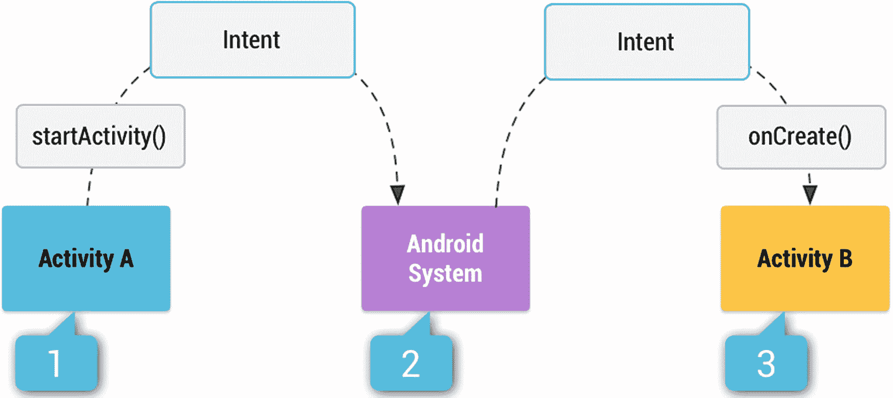

# 5. 使用 IntentMatchers 验证和存根 Intent

在本章中，我们将讨论如何验证和存根应用程序的 Intent。Intent 是一种消息传递对象，可用于请求另一个应用组件执行操作。Intent 通过多种方式促进组件之间的通信。根据 Android Intent 和过滤器文档（[`https://developer.android.com/guide/components/intents-filters`](https://developer.android.com/guide/components/intents-filters)），主要有三种基本用例：

- **启动 Activity** —— Activity 代表 Android 应用程序中的单个屏幕。通过向 `Context.startActivity(Intent)` 传递 Intent 即可启动 Activity 实例。传递的 Intent 应包含关于将启动哪个 Activity 的信息，并可能包含额外数据。当我们期待从启动的 Activity 接收结果时，使用 `Context.startActivityForResult(Intent)` 方法。结果以 Intent 对象的形式返回，并可在 `Activity.onActivityResult()` 回调中处理。

- **启动服务** —— Android 中的服务代表一种在后台执行操作的机制。与 Activity 类似，通过向 `Context.startService(Intent)` 传递 Intent 来启动服务。提供的 Intent 定义了要启动的服务，并可能包含额外数据。

- **发送广播** —— 广播代表一种可由任何应用或系统发送和接收的消息。系统广播的一个示例是系统启动事件。通过向 `Context.sendBroadcast(Intent)` 传递 Intent，可以将广播发送到其他应用。

以下是属于这些 Intent 类型的 Intent 示例：

- **启动 Activity 的 Intent** —— 通常用于为获取结果而启动 Activity 的 Intent。例如，在 Gmail 中点击附件按钮，会打开文件浏览器，以便查找并将文件附加到邮件中。

- **启动服务的 Intent** —— 用于触发在后台运行的长时间进程，如文件下载或监听某些系统事件（如连接状态变化）。

- **发送广播** —— 当需要发送本地 Intent 时使用，这意味着我们希望向与发送方位于同一应用中的接收器广播；或者只是将我们的广播发送给系统中所有能处理它的应用。一个示例是发送短信的广播。

你可能已经知道，Espresso 无法在被测应用之外运行，这在启动 Activity Intent 或发送广播时是常见情况。因此，为了使 Espresso 测试独立且封闭，我们需要使用 Espresso-Intents，它是 Espresso 的扩展，用于验证和存根被测应用发出的 Intent。

## 设置依赖项

为了使用 Espresso-Intents，需要在应用模块的 `build.gradle` 文件中添加以下代码行：

**Android Testing Support Library Espresso-Intents 依赖项。**

```groovy
androidTestImplementation 'com.android.support.test.espresso:espresso-intents:3.0.2'
```

**AndroidX Test Library Espresso-Intents 依赖项。**

```groovy
androidTestImplementation 'androidx.test.espresso:espresso-intents:3.1.0'
```

**注意：** Espresso-Intents 仅兼容 Espresso 2.1+ 和 Testing Support library 0.3+ 或 AndroidX Test library。

因此，为了满足此兼容性要求，还必须更新以下依赖项。

**Android Testing Support Library 依赖项。**

```groovy
androidTestImplementation 'com.android.support.test:runner:1.0.2'
androidTestImplementation 'com.android.support.test:rules:1.0.2'
androidTestImplementation 'com.android.support.test.espresso:espresso-core:3.0.2'
```

或者，如果使用 AndroidX Test library，则需要以下内容。

**AndroidX Test library 依赖项。**


```groovy
androidTestImplementation 'androidx.test:runner:1.1.0'
androidTestImplementation 'androidx.test:rules:1.1.0'
androidTestImplementation 'androidx.test.espresso:espresso-core:3.1.0'
```

在第 1 章中，我们讨论了`ActivityTestRule`在 Espresso 测试中的目的和作用。与`ActivityTestRule`类似，Espresso 还提供了`IntentsTestRule`，它是`ActivityTestRule`的扩展，必须在需要桩化(stub)或验证意图(intents)时使用。与`ActivityTestRule`的情况一样，`IntentsTestRule`会在每个带有`@Test`注解的测试执行前初始化 Espresso-Intents，并在每次测试运行后释放 Espresso-Intents。

以下是`IntentsTestRule`的示例：

```kotlin
@get:Rule
var intentsTestRule = IntentsTestRule(TasksActivity::class.java)
```

我们的示例应用包含为待办事项附加图片的功能，这是一个用于获取结果意图(activity for a result intent)的示例，该意图从系统接收图片文件。图 5-1 展示了当启动活动意图(start activity intent)发送给第三方应用时的意图流。



**图 5-1** 活动意图流（图片来源：[`https://developer.android.com/guide/components/intents-filters`](https://developer.android.com/guide/components/intents-filters)）

第 1 步展示了从我们的应用发送启动活动意图，以通知系统需要将某些功能委托给第三方应用。接着，系统会知道在第 1 步中可以发送给哪些应用；如果至少找到一个应用，系统会重新将同一个活动意图传输给它，如第 2 步所示。在第 3 步中，被选中的应用接收该意图并启动相应的活动。对于通过`startActivityForResult()`发送的意图，所启动活动的结果（例如，从图库或相册应用中选择的图片链接）会返回给最初创建该意图的应用。现在是时候了解 Espresso 如何桩化发送到应用上下文之外的第三方应用的意图。

## 桩化活动意图(Stubbing Activity Intents)

如前所述，Espresso 不支持离开测试上下文下的应用，即离开被测试的应用，以便与第三方应用交互。因此，Espresso 通过`Intents`类中的`intending()`方法提供了桩化机制。

该方法允许桩化意图响应，并且在启动意图的活动期望返回数据时特别有用（尤其是当目标活动是外部活动时）。在这种情况下，测试编写者可以调用：

```java
intending(intentMatcher).thenRespond(myResponse)
```

并验证启动活动是否正确处理了结果。

> **注意：** 在此代码示例中，第三方应用的目标活动将不会被启动。

## 桩化无返回结果的意图

意图桩化的第一个用例可以将我们的应用与任何可能导致启动第三方应用状态的操作隔离开来。为此，Espresso 的`intending()`机制支持桩化非内部意图，即不属于我们应用的意图。以下是它在测试类的`@Before`方法中的实现方式。

*chapter5.StubAllIntentsTest.kt*

```kotlin
@Before
fun stubAllExternalIntents() {
    // 默认情况下，Espresso Intents 不会桩化任何 Intents。
    // 桩化需要在每次测试运行前设置。
    // 在此情况下，所有外部 Intents 都将被阻止。
    intending(not(isInternal()))
        .respondWith(Instrumentation.ActivityResult(Activity.RESULT_OK, null))
}
```

> **注意：** 带有`@Before`注解的方法会在每个测试用例运行之前执行。

你可以在该代码示例中看到两个新方法：

* `isInternal()` — 意图匹配器，如果意图的包名与插桩测试的目标包名相同，则匹配该意图。
* `Instrumentation.ActivityResult(Activity.RESULT_OK, null)` — `ActivityResult`类，允许我们创建一个新的`ActivityResult`，该结果将以指定的结果代码传播回原始活动。有关更多详细信息，请参阅 Android 的`Instrumentation.java`类和`Activity.setResult()`方法。

我们从第 1 章和第 2 章中已经熟悉了 hamcrest 匹配器。`IntentMatchers`具有类似的功能。除了意图匹配器之外，Espresso 还提供了`BundleMatchers`、`ComponentNameMatchers`和`UriMatchers`，它们与`IntentMatchers`配合使用。以下是所有这些匹配器的简要概述。

**`IntentMatchers`**：
* `anyIntent()` — 匹配任何意图。
* `hasAction()` — 通过意图动作匹配意图。最常见的示例是`Intent.ACTION_CALL`用于执行电话呼叫动作，或`Intent.ACTION_SEND`用于发送电子邮件或短信。有关更多动作类型，请参阅 Android 的`Intent.java`类。
* `hasCategories()` — 匹配意图类别，它是一个包含有关应处理意图的组件类型的附加信息的字符串。例如，`CATEGORY_LAUNCHER`的字符串值为`android.intent.category.LAUNCHER`，用于指定初始应用活动。
* `hasComponent()` — 可以通过类名、包名或短类名匹配意图。使用`ComponentNameMatchers`。
* `hasData()` — 匹配具有该意图正在操作的特定数据的意图。通常使用`content:`方案，在内容提供者中指定数据。其他方案可能由特定活动处理，例如`http:`由网络浏览器处理。使用`UriMatchers`。
* `hasExtraWithKey()` — 匹配具有附加到意图的特定 Bundle 的意图。使用一个接受 Bundle 匹配器作为参数的`hasExtras()`方法。
* `hasExtra()` — 与`hasExtras()`相同，但针对额外数据。
* `hasExtras()` — 匹配具有特定扩展数据或额外数据的意图。此数据通过重载的`Intent.putExtra()`方法之一以`<名称, 值>`对的形式放入意图中。额外参数的名称必须包含包前缀。例如，应用`com.android.contacts`会使用像`com.android.contacts.ShowAll`这样的名称。
* `hasType()` — 匹配包含显式 MIME 类型的意图。
* `hasPackage()` — 匹配仅限于指定应用包名的意图。
* `toPackage()` — 根据可以处理意图的活动的包名来匹配意图。
* `hasFlag()` — 与`getFlags()`相同。
* `hasFlags()` — 匹配具有指定标志的意图。标志列表可在[`https://developer.android.com/reference/android/content/Intent#setFlags(int)`](https://developer.android.com/reference/android/content/Intent%2523setFlags%2528int%2529)找到。
* `isInternal()` — 如果意图的包名与插桩测试的目标包名相同，则匹配该意图。

**`BundleMatchers`** 类表示用于意图 Bundle 的 hamcrest 匹配器。Bundle 通常以`<键, 值>`对的形式用于在活动之间传递数据。
* `hasEntry()` — 基于`<键, 值>`对匹配 Bundle 对象。
* `hasKey()` — 基于键匹配 Bundle 对象。
* `hasValue()` — 基于值匹配 Bundle 对象。

**`ComponentNameMatchers`**：
* `hasClassName()` — 基于类名匹配组件。
* `hasPackageName()` — 基于提供的包名匹配组件。
* `hasShortClassName()` — 基于短类名匹配组件。


