# 文档排版

## 匹配器说明

- `hasMyPackageName()` — 匹配基于通过 Instrumentation Registry 为测试找到的目标包名的组件。

`UriMatchers` 用于基于 URI 对象匹配 Intent。例如，如果动作为 `ACTION_EDIT`，数据应包含要编辑的文档的 URI。

- `hasHost()` — 基于主机匹配 URI 对象。例如，如果 authority 是 `"bob@google.com"`，此方法将尝试基于 `"google.com"` 匹配该对象。
- `hasParamWithName()` — 基于参数名称匹配 URI 对象。
- `hasParamWithValue()` — 基于参数值匹配 URI 对象。
- `hasPath()` — 基于路径匹配 URI 对象。例如：`mailto:nobody@google.com`。
- `hasSchemeSpecificPart()` — 基于特定 scheme 部分匹配 URI 对象。这是 scheme 分隔符 `':'` 和 fragment 分隔符 `'#'` 之间的所有内容。如果是相对 URI，此方法返回整个 URI。例如：`"//www.google.com/search?q=android"`。

现在让我们回到 `chapter5.StubAllIntentsTest.kt` 类，看看 Intent 桩如何工作。以下是该类的实现。

*chapter5.StubAllIntentsTest.kt*

```kotlin
class StubAllIntents {
    @get:Rule
    var intentsTestRule = IntentsTestRule(TasksActivity::class.java)
    
    private var toDoTitle = ""
    private var toDoDescription = ""
    
    // 测试中使用的 ViewInteractions
    private val addFab = viewWithId(R.id.fab_add_task)
    private val taskTitleField = viewWithId(R.id.add_task_title)
    private val taskDescriptionField = viewWithId(R.id.add_task_description)
    private val editDoneFab = viewWithId(R.id.fab_edit_task_done)
    private val shareMenuItem = onView(allOf(withId(R.id.title), withText(R.string.share)))
    
    @Before
    fun setUp() {
        toDoTitle = TestData.getToDoTitle()
        toDoDescription = TestData.getToDoDescription()
    }
    
    @Before
    fun stubAllExternalIntents() {
        // 默认情况下，Espresso Intents 不会对任何 Intent 进行桩化。桩化需要在每次测试运行前设置。
        // 在这种情况下，所有外部 Intent 将被阻止。
        intending(not(isInternal()))
            .respondWith(Instrumentation.ActivityResult(Activity.RESULT_OK, null))
    }
    
    @Test
    fun stubsShareIntent() {
        // 添加新的待办事项
        addFab.click()
        taskTitleField.type(toDoTitle).closeKeyboard()
        taskDescriptionField.type(toDoDescription).closeKeyboard()
        editDoneFab.click()
        
        // 验证在待办事项列表中显示了包含标题的新待办事项
        viewWithText(toDoTitle).checkDisplayed()
        openContextualActionModeOverflowMenu()
        shareMenuItem.click()
        //viewWithText(toDoTitle).click()
    }
}
```

我们的类包含一个简单的测试，它添加一个新的待办事项，然后点击操作栏菜单中的分享按钮。如您所见，我们使用了 `IntentsTestRule` 和 `stubAllExternalIntents()` 方法。`stubsShareIntent()` 测试在列表中添加一个新的待办事项，打开操作栏菜单，然后点击分享选项，该选项会触发分享 Intent 并将其发送到系统。在实际使用场景中，系统会将此 Intent 重定向到另一个应用程序。如果系统有多个可以处理该 Intent 的应用程序，则会弹出显示选项的弹出窗口。

在我们的案例中，在每个测试方法之前运行的 `stubsAllExternalIntents()` 方法将执行其工作，Intent 不会离开应用程序。尝试运行测试并查看结果。图 5-2 显示了最后一个测试方法步骤后应用程序的最终状态。

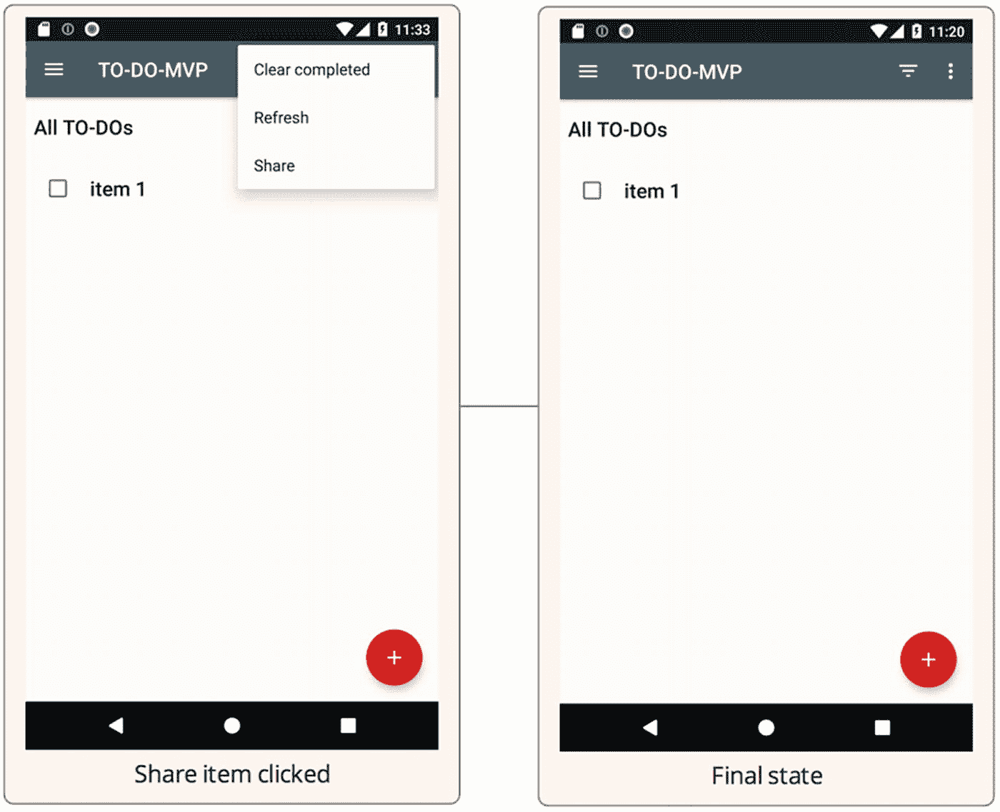

图 5-2 带有外部 Intent 桩的 `stubsShareIntent()` 测试的最终状态

让我们看看当外部 Intent 桩不存在时会发生什么——只需注释掉 `stubAllExternalIntents()` 方法并再次运行测试。图 5-3 显示了最终应用程序状态。

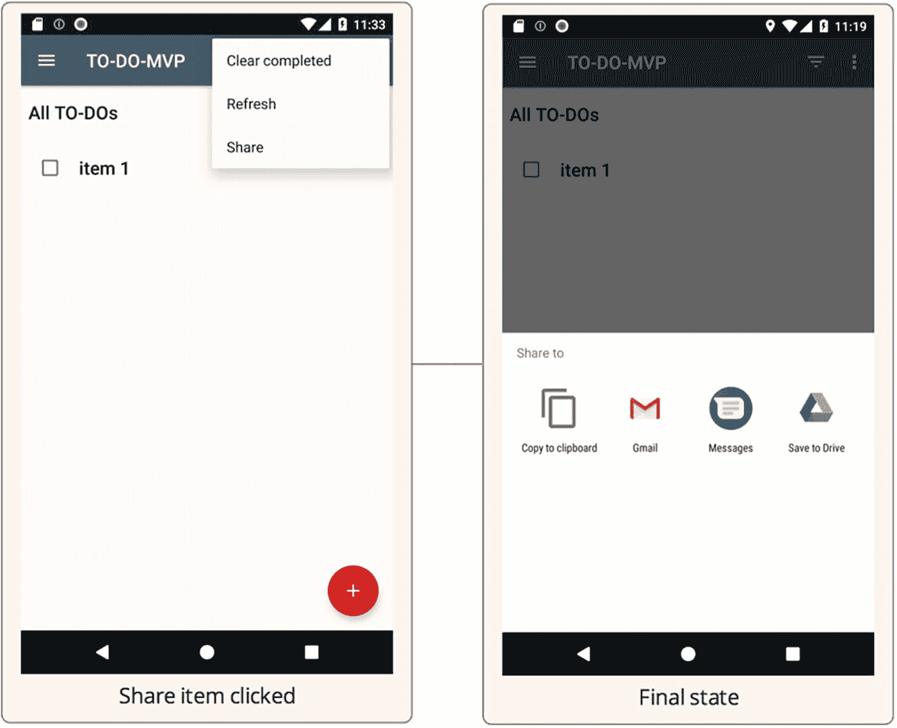

图 5-3 没有外部 Intent 桩的 `stubsShareIntent()` 测试的最终状态

您可以看到差异，并证明 Intent 桩有效。问题是，在两种情况下，测试都能通过。但在第二种情况下，它通过只是因为我们在发送 Intent 后没有任何额外的步骤。如果您注释掉 Intent 被桩化后的这行代码：

```kotlin
//viewWithText(toDoTitle).click()
```

并再次运行测试，您将看到测试失败。取消注释 `stubAllExternalIntents()` 方法将使测试再次通过。

## 为单个 Intent 设置桩

我们刚刚看到了如何对所有的外部应用程序 Intent 进行桩化，但如果只想对单个 Intent 进行桩化呢？那么，我们唯一需要做的就是用特定的 Intent 匹配器替换以下表达式中的 `intentMatcher`：

```kotlin
intending(intentMatcher).thenRespond(myResponse)
```

分享待办事项的 Intent 实现如下所示。

*来自 `com.example.android.architecture.blueprints.todoapp.tasks.TasksFragment.java` 类的分享 Intent Java 实现*

```java
String email = PreferenceManager
    .getDefaultSharedPreferences(getContext())
    .getString("email_text", "");
Intent shareIntent = new Intent();
shareIntent.setAction(Intent.ACTION_SEND);
shareIntent.setType("text/plain");
shareIntent.putExtra(Intent.EXTRA_TEXT, getTaskListAsArray());
shareIntent.putExtra(Intent.EXTRA_EMAIL, email);
startActivity(Intent.createChooser(shareIntent,
    getResources().getText(R.string.share_to)));
```

首先，我们将分解 Intent 实现，看看哪些 Intent 匹配器可以应用于它：

- `shareIntent.setAction(Intent.ACTION_SEND)` — 此 Intent 属性可以通过 `hasAction()` Intent 匹配器匹配。
- `shareIntent.setType("text/plain")` — 可以通过 `hasType()` Intent 匹配器匹配。
- `shareIntent.putExtra(Intent.EXTRA_TEXT, getTaskListAsArray())` 和 `shareIntent.putExtra(Intent.EXTRA_EMAIL, email)` — 可以通过 `hasExtra()` 或 `hasExtras()` Intent 匹配器匹配。

看起来简单明了，为了展示如何为每种情况实现 Intent 匹配器，请打开 `chapter5.StubIntentTest.kt` 类。其实现与 `chapter5.StubAllIntentsTest.kt` 类类似，但不是为每个测试方法应用外部 Intent 桩，而是在方法级别应用，并在此应用特定的 Intent 匹配器。

*`chapter5.StubIntentTest.kt` 类展示了如何使用不同的 Intent 匹配器对 Intent 进行桩化。*


```kotlin
class StubIntentTest {
    private var toDoTitle = ""
    private var toDoDescription = ""
    // 测试中使用的视图交互对象
    private val addFab = viewWithId(R.id.fab_add_task)
    private val taskTitleField = viewWithId(R.id.add_task_title)
    private val taskDescriptionField = viewWithId(R.id.add_task_description)
    private val editDoneFab = viewWithId(R.id.fab_edit_task_done)
    private val shareMenuItem = onView(allOf(withId(R.id.title), withText(R.string.share)))

    @get:Rule
    var intentsTestRule = IntentsTestRule(TasksActivity::class.java)

    @Before
    fun setUp() {
        toDoTitle = TestData.getToDoTitle()
        toDoDescription = TestData.getToDoDescription()
    }

    @Test
    fun stubsShareIntentByAction() {
        Intents.intending(hasAction(equalTo(Intent.ACTION_SEND)))
            .respondWith(Instrumentation.ActivityResult(Activity.RESULT_OK, null))

        // 添加新的待办事项
        addFab.click()
        taskTitleField.type(toDoTitle).closeKeyboard()
        taskDescriptionField.type(toDoDescription).closeKeyboard()
        editDoneFab.click()

        // 验证待办事项列表中显示了包含标题的新待办事项
        viewWithText(toDoTitle).checkDisplayed()

        // 打开菜单并点击"分享"项
        openContextualActionModeOverflowMenu()
        shareMenuItem.click()
        viewWithText(toDoTitle).click()
    }

    @Test
    fun stubsShareIntentByType() {
        Intents.intending(hasType("text/plain"))
            .respondWith(Instrumentation.ActivityResult(Activity.RESULT_OK, null))

        // 添加新的待办事项
        addFab.click()
        taskTitleField.type(toDoTitle).closeKeyboard()
        taskDescriptionField.type(toDoDescription).closeKeyboard()
        editDoneFab.click()

        // 验证待办事项列表中显示了包含标题的新待办事项
        viewWithText(toDoTitle).checkDisplayed()

        // 打开菜单并点击"分享"项
        openContextualActionModeOverflowMenu()
        shareMenuItem.click()
        viewWithText(toDoTitle).click()
    }

    @Test
    fun stubsShareIntentByExtra() {
        Intents.intending(hasType("text/plain"))
            .respondWith(Instrumentation.ActivityResult(Activity.RESULT_OK, null))

        // 添加新的待办事项
        addFab.click()
        taskTitleField.type(toDoTitle).closeKeyboard()
        taskDescriptionField.type(toDoDescription).closeKeyboard()
        editDoneFab.click()

        // 验证待办事项列表中显示了包含标题的新待办事项
        viewWithText(toDoTitle).checkDisplayed()

        // 打开菜单并点击"分享"项
        openContextualActionModeOverflowMenu()
        shareMenuItem.click()
        viewWithText(toDoTitle).click()
    }
}
```

运行完所有这些测试后，你可能会惊讶地发现它们都失败了。在开始分析 `com.example.android.architecture.blueprints.todoapp.tasks.TasksFragment.java` 中的 intent 实现后，我们可以清楚地看到我们的 intent 设置了哪些 action、type 和 extra 参数。那么为什么它们会失败呢？

经过调试并深入分析分享 intent 的启动方式，如下所示：

```java
startActivity(Intent.createChooser(
    shareIntent,
    getResources().getText(R.string.share_to)));
```

我们可以看到，Android 的 `Intent.createChooser()` 方法被用来将这个 intent 以自定义标题发送到系统。这个方法将提供的 intent 参数（包含指定的 action、type 和 extra 参数）包装到另一个具有新 action 的 intent 中，并将我们的 intent 作为其 extra 参数的一部分。图 5-4 展示了调试时发生的情况。

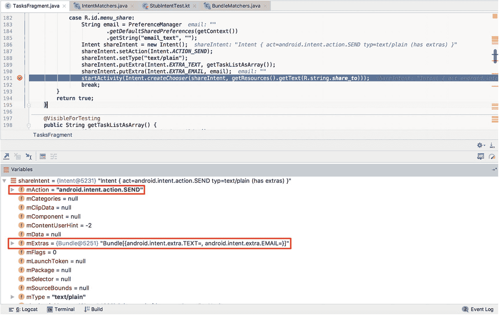

**图 5-4** 在 `com.example.android.architecture.blueprints.todoapp.tasks.TasksFragment.java` 类中实现的 ShareIntent 实例

初始 intent 看起来与我们的预期一致，具有正确的 action（参见高亮的 `mAction` 变量）和正确的 extra 参数（参见高亮的 `mExtras` 变量）。但是，如果我们将调试断点设置在 `IntentMatchers.hasExtras()` 匹配器中 intent 比较的位置，我们可以看到图 5-5。

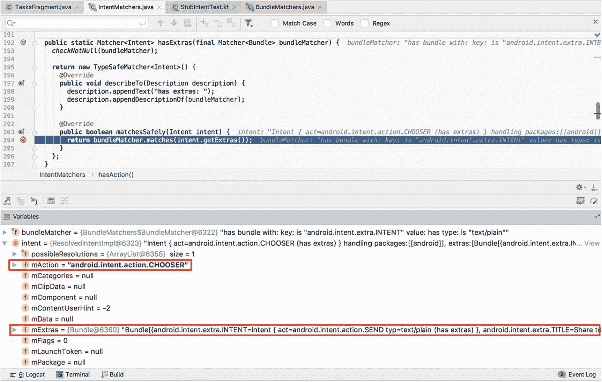

**图 5-5** 在测试执行期间点击"分享"菜单项时命中断点

此时，很明显初始 intent 已被添加为新的 intent 内部的 extra 参数（参见高亮的 `mExtras` 变量），并且 action 也已修改（参见高亮的 `mAction` 变量）。现在，为了使 `stubsShareIntentByAction()` 测试通过，我们可以将 action 更改为 `ACTION_CHOOSER`。

*chapter5.StubChooserIntentTest.kt* - 类

```kotlin
@Test
fun stubsShareIntentByAction() {
    Intents.intending(hasAction(equalTo(Intent.ACTION_CHOOSER)))
        .respondWith(Instrumentation.ActivityResult(Activity.RESULT_OK, null))

    // 添加新的待办事项
    addFab.click()
    taskTitleField.type(toDoTitle).closeKeyboard()
    taskDescriptionField.type(toDoDescription).closeKeyboard()
    editDoneFab.click()

    // 验证待办事项列表中显示了包含标题的新待办事项
    viewWithText(toDoTitle).checkDisplayed()

    // 打开菜单并点击"分享"项
    openContextualActionModeOverflowMenu()
    shareMenuItem.click()
    viewWithText(toDoTitle).click()
}
```

以下是使用 `Intent.createChooser()` 方法启动在 `chapter5.StubChooserIntentTest.kt` 类中实现的 intent 时，可用的 intent 匹配器示例。

* 基于初始 intent 的 action：

```kotlin
Intents.intending(hasAction(equalTo(Intent.ACTION_CHOOSER)))
    .respondWith(Instrumentation.ActivityResult(Activity.RESULT_OK, null))
```

* 基于初始 intent 的 type：

```kotlin
Intents.intending(hasExtras(hasEntry(Intent.EXTRA_INTENT, hasType("text/plain"))))
    .respondWith(Instrumentation.ActivityResult(Activity.RESULT_OK, null))
```

* 基于 `EXTRA_TITLE` 参数：

```kotlin
Intents.intending(hasExtras(hasEntry(Intent.EXTRA_TITLE, "Share to")))
    .respondWith(Instrumentation.ActivityResult(Activity.RESULT_OK, null))
```

最后，为了使 `chapter5.StubIntentTest.kt` 类中的测试通过，我们通过替换 `com.example.android.architecture.blueprints.todoapp.tasks.TasksFragment.java` 类中的第 192 行来更改分享待办事项 intent 的启动方式：

```java
startActivity(Intent.createChooser(shareIntent, getResources().getText(R.string.share_to)));
```

替换为：

```java
startActivity(shareIntent);
```

这样，intent 不会被修改，我们完全依赖系统向用户显示弹出窗口（见图 5-6）。

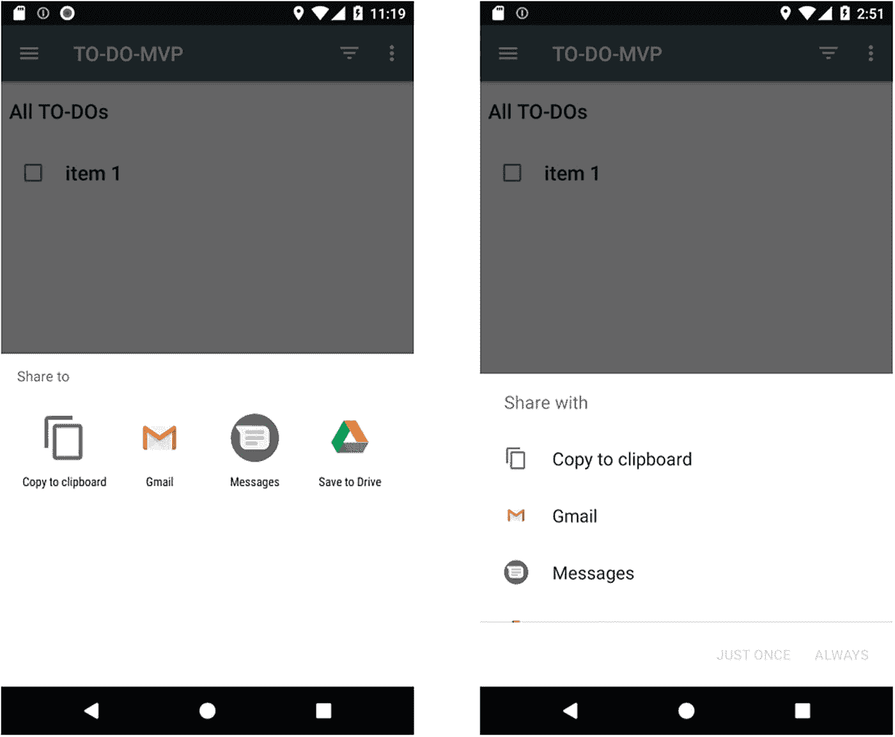

**图 5-6** 使用 `Intent.createChooser()`（左）和不使用 `Intent.createChooser()` 方法（右）发送分享待办事项 intent

## 练习 14
**Stubbing 意图**

1.  如图 5-4 所示，在 `TaskFragment.java` 文件的第 191 行设置断点，并如图 5-5 所示，在 `IntentMatchers.java` 文件的第 204 行设置断点。以调试模式运行 `StubIntentTest.kt` 文件中的测试。当到达断点时，观察 `shareIntent` 和 `intent` 变量。

2.  运行 `StubIntentTest.kt` 类中的所有测试并检查结果。测试应该会失败。在 `TaskFragment.java` 文件中，注释掉第 191 行并取消注释第 192 行。再次运行测试并验证它们是否通过。

3.  撤销第 2 步中所做的更改，然后运行 `StubChooserIntentTest.kt` 类中的所有测试。测试应该全部通过。
```


## 使用结果存根化 Intent

在许多情况下，被测应用启动的 Activity 意图必须以图库图像或设备文件系统中的文件形式返回结果。在 Android 中，这是通过在应用 Activity 或 Fragment 内使用 `startActivityForResult()` 方法启动一个 Activity 来实现的。启动 Activity 后，用户执行某些操作生成结果，该结果随后会返回给最初发送意图的 Activity 或 Fragment。Android Activity 类中的 `onActivityResult()` 方法负责接收先前调用 `startActivityForResult()` 方法所返回的结果。

示例 TO-DO 应用包含一个使用 `startActivityForResult()` 发送意图的示例，并在 `com.example.android.architecture.blueprints.todoapp.addedittask.AddEditTaskFragment.java` 类中实现的 `onActivityResult()` 方法中处理结果。

### 在 `AddEditTaskFragment.java` 中启动和处理图像 Intent

```java
public void onImageButtonClick() {
    Intent intent = new Intent();
    intent.setType("image/*");
    intent.setAction(Intent.ACTION_GET_CONTENT);
    startActivityForResult(intent, SELECT_PICTURE);
}

public void onActivityResult(int requestCode, int resultCode, Intent data) {
    if (resultCode == RESULT_OK) {
        if (requestCode == SELECT_PICTURE) {
            Uri selectedImageUri = data.getData();
            BitmapDrawable bitmapDrawable =
                ImageUtils.scaleAndSetImage(selectedImageUri, getContext(), 200);
            // 应用缩放后的位图
            imageView.setImageDrawable(bitmapDrawable);
            // 现在更改 ImageView 的尺寸以匹配缩放后的图像
            ConstraintLayout.LayoutParams params =
                (ConstraintLayout.LayoutParams) imageView.getLayoutParams();
            params.width = imageView.getWidth();
            params.height = imageView.getHeight();
            imageView.setLayoutParams(params);
        }
    }
}
```

你可以看到 `onImageButtonClick()` 方法中的 intent 预设了类型和 Action，可以在测试中使用这些信息来匹配该 intent 并进行存根化。

现在应该清楚了启动 Activity 以获取结果的机制。我们最后要做的是创建用于存根化的结果。在前一段中，我们使用了返回结果的机制，但将其设置为 null，主要是因为我们在分享意图的情况下不需要结果：

```kotlin
intending(not(isInternal()))
    .respondWith(Instrumentation.ActivityResult(Activity.RESULT_OK, null))
```

现在我们需要自己实现结果。我们将讨论通过 `startActivityForResult()` 方法启动的 Activity 获取存根化图像结果的两种方法：

- 使用存储在测试应用 drawable 中的图像文件提供结果。
- 使用存储在测试应用 assets 文件夹中的图像文件提供结果。

在图 5-7 中，你可以看到分别存储在测试应用 `res/drawable-xxxhdpi` 和 `assets` 文件夹中的 `todo_image_drawable.png` 和 `todo_image_assets.png` 文件。

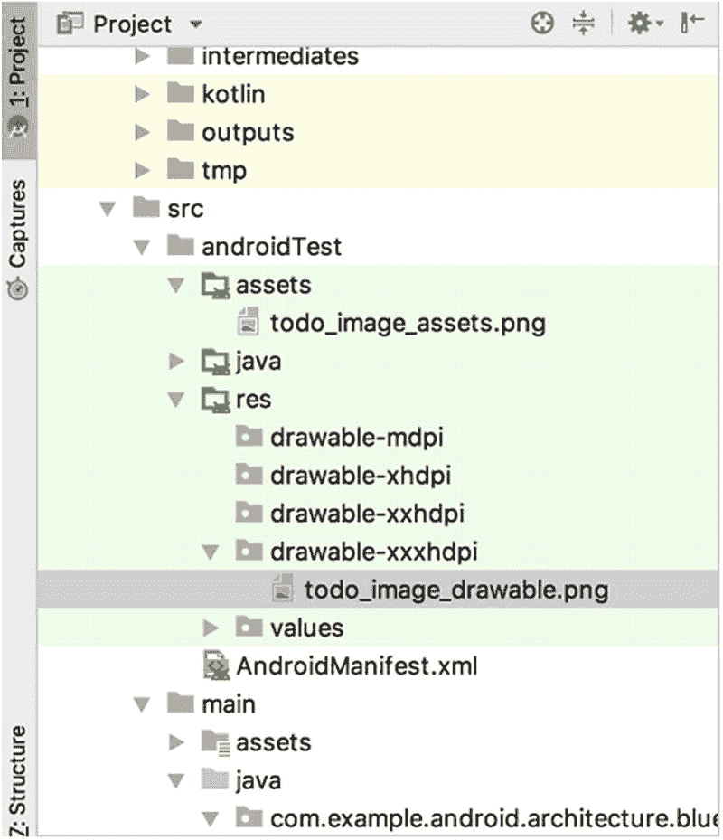

图 5-7
用于 Intent 存根化的 .png 文件位置

为了展示这两种方法的实现，示例应用包含带有测试用例的 `chapter5.StubSelectImageIntentTest.kt` 类，以及包含用于生成 Intent 存根化中使用的 Activity 结果方法的 `chapetr5.IntentHelper.kt` 对象。

### 在 `StubSelectImageIntentTest.kt` 类中实现的测试方法

```kotlin
@Test
fun stubsImageIntentWithDrawable() {
    val toDoImage =
        com.example.android.architecture.blueprints.todoapp.mock.test.R.drawable.todo_image
    Intents.intending(not(isInternal()))
        .respondWith(IntentHelper.createImageResultFromDrawable(toDoImage))
    // 添加新的待办事项。
    addFab.click()
    taskTitleField.type(toDoTitle).closeKeyboard()
    taskDescriptionField.type(toDoDescription).closeKeyboard()
    // 点击从图库获取图像按钮。此时返回存根化的图像。
    addImageButton.click()
    editDoneFab.click()
    viewWithText(toDoTitle).click()
}

@Test
fun stubsImageIntentWithAsset() {
    val imageFromAssets = "todo_image_assets.png"
    Intents.intending(not(isInternal()))
        .respondWith(IntentHelper.createImageResultFromAssets(imageFromAssets))
    // 添加新的待办事项。
    addFab.click()
    taskTitleField.type(toDoTitle).closeKeyboard()
    taskDescriptionField.type(toDoDescription).closeKeyboard()
    // 点击从图库获取图像按钮。此时返回存根化的图像。
    addImageButton.click()
    editDoneFab.click()
    viewWithText(toDoTitle).click()
}
```

### `IntentHelper.kt` 对象，提供用于生成 Intent 存根化中使用的 Activity 结果的方法

```kotlin
object IntentHelper {
    /**
     *  从存储在测试应用 drawable 中的图像创建新的 Activity 结果。
     *  有关结果的更多信息，请参见 {@link Activity#setResult}。
     */
    fun createImageResultFromDrawable(drawable: Int): Instrumentation.ActivityResult {
        val resultIntent = Intent()
        val testResources = InstrumentationRegistry.getContext().resources
        // 从 drawable 图像构建存根化的结果。
        resultIntent.data = Uri.parse(ContentResolver.SCHEME_ANDROID_RESOURCE
            + "://${testResources.getResourcePackageName(drawable)}"
            + "/${testResources.getResourceTypeName(drawable)}"
            + "/${testResources.getResourceEntryName(drawable)}")
        return Instrumentation.ActivityResult(Activity.RESULT_OK, resultIntent)
    }

    /**
     *  从存储在测试应用 assets 中的图像创建新的 Activity 结果。
     *  有关结果的更多信息，请参见 {@link Activity#setResult}。
     */
    fun createImageResultFromAssets(imageName: String): Instrumentation.ActivityResult {
        val resultIntent = Intent()
        // 声明测试上下文和应用上下文的变量。
        val testContext = InstrumentationRegistry.getContext()
        val appContext = InstrumentationRegistry.getTargetContext()
        val file = File("${appContext.cacheDir}/todo_image_temp.png")
        // 从测试 assets 读取文件并保存到主应用缓存中的 todo_image_temp.png。
        if (!file.exists()) {
            try {
                val inputStream = testContext.assets.open(imageName)
                val fileOutputStream = FileOutputStream(file)
                val size = inputStream.available()
                val buffer = ByteArray(size)
                inputStream.read(buffer)
                inputStream.close()
                fileOutputStream.write(buffer)
                fileOutputStream.close()
            } catch (e: Exception) {
                throw RuntimeException(e)
            }
        }
        // 从临时文件构建存根化的结果。
        resultIntent.data = Uri.fromFile(file)
        return Instrumentation.ActivityResult(Activity.RESULT_OK, resultIntent)
    }
}
```

`stubsImageIntentWithDrawable()` 测试用例使用位于测试应用 drawable 中的图像对 intent 结果进行存根化，而 `stubsImageIntentWithAsset()` 则使用存储在测试应用 assets 文件夹中的图像进行 intent 存根化。将所有测试图像和文件存储在测试应用中非常方便，因为主应用不需要存储任何不必要的测试数据。同样地，我们可以存储所有可能用于 intent 存根化的文件类型。

## 练习 15

## 使用结果存根化 Intent

1. 运行当前部分的所有测试并观察它们通过。将 `res/drawable-xxxhdpi` 和 assets 文件夹中的图像替换为不同的图像。再次运行测试。

2. 基于在 `AddEditTaskFragment.java` 中实现的图像 intent，更改 `Intents.intending(not(isInternal()))` 的实现，并将 `not(isInternal())` 部分替换为 `hasAction() IntentMatcher`。


好的，作为一名高级文档工程师和翻译员，我将严格遵循您提供的注意事项和示例，将给定的英文文本翻译成中文。


3.  执行与步骤 2 相同的更改，但将 `hasAction()` 替换为 `hasType()` 的 `IntentMatcher`。

## 验证 Intent

到目前为止，我们已经掌握了 Intent 匹配器的知识，并在测试示例中使用了它们。现在，是时候进入验证 Intent 的主题了。

与用于 Intent 桩代码的 `Intents.intending()` 机制一样，Espresso 提供了 `Intents.indended()` 用于 Intent 验证。此机制会记录所有试图从被测试应用启动 Activity 的 Intent。使用 `intended()` 方法，你可以断言已经看到了给定的 Intent。上一节提供了大量关于 Intent 匹配的信息和示例，因此我们将相同的 Intent 匹配器提供给 `intended()` 方法。

> **注意**  
> 即使我们为 Intent 设置了桩代码，它们仍然可以使用 `intended()` 方法进行进一步验证。

为了演示 `intended()` 的实际使用，让我们修改现有的 `stubsImageIntentWithDrawable()` 测试，如下所示。

*chapter5.*  
*StubSelectImageIntentTest.stubsImageIntentWithAsset()*  
*.*

```
@Test
fun stubsImageIntentWithAsset() {
val imageFromAssets = "todo_image_assets.png"
Intents.intending(not(isInternal()))
.respondWith(IntentHelper.createImageResultFromAssets(imageFromAssets))
// 添加新 TO-DO。
addFab.click()
taskTitleField.type(toDoTitle).closeKeyboard()
taskDescriptionField.type(toDoDescription).closeKeyboard()
// 点击从图库获取图片按钮。此时会返回桩代码图片。
addImageButton.click()
// 验证发送的 intent action。
intended(hasAction(Intent.ACTION_GET_CONTENT))
editDoneFab.click()
viewWithText(toDoTitle).click()
}
```

在当前实现中，测试通过是因为图片 intent 设置了 `ACTION_GET_CONTENT` 动作。当然，我们可以使用 `allOf()` hamcrest 匹配器来组合不同的 `IntentMatchers`，从而缩小验证范围。

有时你可能看不到 Intent 的实现，但当 `intended()` 验证失败时，仍然可以从 Espresso 失败堆栈跟踪中获取所有 Intent。

*来自失败的 intended(intentMatcher) 验证的 Espresso 堆栈跟踪（部分）。*

```
IntentMatcher: has action: is "android.intent.action.ANSWER"
Matched intents:[]
Recorded intents:
-Intent { cmp=com.example.android.architecture.blueprints.todoapp.mock/com.example.android.architecture.blueprints.todoapp.addedittask.AddEditTaskActivity } handling packages:[[com.example.android.architecture.blueprints.todoapp.mock]])
-Intent { act=android.intent.action.GET_CONTENT typ=image/* } handling packages:[[com.android.documentsui, com.google.android.apps.docs, com.google.android.apps.photos]])
```

这个堆栈跟踪是在将先前测试方法中的 Intent 动作设置为错误的值后得到的：

```
intended(hasAction(Intent.ACTION_ANSWER))
```

从堆栈跟踪中，我们可以看到在图片 intent 中：

```
{ act=android.intent.action.GET_CONTENT typ=image/* }
```

还有另一个：

```
{ cmp=com.example.android.architecture.blueprints.todoapp.mock/com.example.android.architecture.blueprints.todoapp.addedittask.AddEditTaskActivity }
```

为了理解 Intent 是如何出现在堆栈跟踪中的，让我们仔细看看 Espresso 的 `Intents.java` 类。这个类负责验证和桩代码处理被测试应用发出的 Intent。它包含 `init()` 方法，该方法初始化 Intent 并开始记录它们。必须在触发任何会发送需要验证或设置桩代码的 Intent 的动作之前调用它。正是因为 `IntentsTestRule` 使用了它，才需要运行 Intent 测试。

有了这些信息，我们可以对 `stubsImageIntentWithAsset()` 测试用例进行修改。我们还将验证，在点击添加 TO-DO 浮动操作按钮后，`AddEditTaskActivity` 是否会被启动。

*修改后的 stubsImageIntentWithAsset() 测试用例。*

```
@Test
fun stubsImageIntentWithAsset() {
val imageFromAssets = "todo_image_assets.png"
Intents.intending(not(isInternal()))
.respondWith(IntentHelper.createImageResultFromAssets(imageFromAssets))
// 添加新 TO-DO。
addFab.click()
// 验证 AddEditTaskActivity 已被启动。
intended(hasComponent(AddEditTaskActivity::class.java.name))
taskTitleField.type(toDoTitle).closeKeyboard()
taskDescriptionField.type(toDoDescription).closeKeyboard()
// 点击从图库获取图片按钮。此时会返回桩代码图片。
addImageButton.click()
// 验证发送的 intent action。
intended(hasAction(Intent.ACTION_GET_CONTENT))
editDoneFab.click()
viewWithText(toDoTitle).click()
}
```

同样重要的是要注意堆栈跟踪中的 Intent 细节和调试信息，如图 5-4 和 5-5 所示。这两个来源都包含有关 Intent 的信息，例如其 action、type 或 component。让我们再看一次堆栈跟踪：

```
Recorded intents:
-Intent { cmp=com.example.android.architecture.blueprints.todoapp.mock/com.example.android.architecture.blueprints.todoapp.addedittask.AddEditTaskActivity } handling packages:[[com.example.android.architecture.blueprints.todoapp.mock]])
-Intent { act=android.intent.action.GET_CONTENT typ=image/* } handling packages:[[com.android.documentsui, com.google.android.apps.docs, com.google.android.apps.photos]])
```

正如你可能猜到的：

*   `cmp` — 表示组件（component）。适用于 `hasComponent() IntentMatcher`。
*   `packages` — 表示包（package）。适用于 `hasPackage()` 或 `toPackage() IntentMatcher`。
*   `act` — 表示动作（action）。适用于 `hasAction() IntentMatcher`。
*   `typ` — 表示类型（type）。适用于 `hasType() IntentMatcher`。

## 练习 16

**验证 Intent**

1.  修改一个 Intent 测试，使其在使用 `intended()` 方法进行 Intent 验证时失败。观察堆栈跟踪。
2.  实现一个测试，验证“为无结果的 Intent 设置桩代码”部分讨论的分享 Intent 功能。根据 Intent 类型和动作进行验证。使用 `allOf()` hamcrest 匹配器来验证两者。

## 总结

Espresso-Intents 使你可以保持 UI 测试的封闭性，无需与第三方应用程序交互，并允许你验证在待测应用内部或外部发送的 Intent。它是一个强大的机制，可帮助你测试和应用 Intent 桩代码。熟悉它之后，它将提升你对整个 Android 系统的理解，因为应用组件、应用和系统之间的大部分通信都是通过 Intent 完成的。

6. 测试 WebView

如今，我们几乎可以找到针对任何事物的移动应用——游戏、社交网络、银行、音乐等。由单个开发者、小型创业公司或成熟公司开发的如此多样化的应用意味着不同的开发方法。这些方法以原生和混合应用为代表。原生应用是为移动操作系统开发的，遵循平台标准、用户界面和用户体验指南，并可访问移动设备功能，如摄像头、GPS 等。混合应用通常使用位于原生包装器或容器中的网站。在 Android 上，这个容器被称为 *WebView*。

然而，存在一个灰色地带。即使开发者选择了原生应用开发，应用中也存在许多地方可能使用集成的 Android `WebView` 组件。这是有道理的，因为 WebView 代表了那些应能远程控制而无需创建冗余应用发布的功能。`WebView` 组件可能被使用的常见领域如下：

*   网络浏览器应用
*   使用 Google、Facebook 或 Twitter 账号的注册或登录表单
*   法律和隐私声明
*   应用常见问题解答（FAQ）


# Espresso-Web 测试框架指南

## 支持的联系表单

我们已经知道原生 Android 应用程序可以通过 Espresso 进行测试。本章介绍 Espresso-Web，并展示如何使用它来测试集成到移动应用中的 Android `WebView` UI 组件。Espresso 和 Espresso-Web 可以结合使用，以在应用程序的不同层面进行完整交互。

## Espresso-Web 基础

与 Espresso 的 `onData()` 方法类似，`WebView` 交互由多个 *atoms* 组成。`WebView` 交互使用 Java 编程语言和 JavaScript 桥接的组合来完成其工作。由于没有机会通过从 JavaScript 环境暴露数据来引入竞态条件——Espresso 在基于 Java 端看到的所有内容都是隔离的副本——因此完全支持从 `Web.WebInteraction` 对象返回数据，允许您验证从请求返回的所有数据。

WebDriver 框架使用 *atoms* 以编程方式查找和操作 web 元素。Atoms 被 WebDriver 用于处理浏览器操作。一个 atom 在概念上类似于 `ViewAction`，它是一个自包含的单元，用于在 UI 中执行操作。您通过一组定义的方法（如 `findElement()` 和 `getElement()`）来暴露 atoms，从用户角度驱动浏览器。但是，如果直接使用 WebDriver 框架，atoms 需要被适当地编排，这需要相当冗长的逻辑。

在 Espresso 内部，`Web` 和 `Web.WebInteraction` 类封装了这些样板代码，并提供了类似 Espresso 的交互体验来操作 `WebView` 对象。因此，在 `WebView` 的上下文中，atoms 被用作传统 Espresso 的 `ViewMatchers` 和 `ViewActions` 的替代品。API 看起来相当简单，如下所示。

### Espresso-Web API 使用公式

```
onWebView()
.withElement(Atom)
.perform(Atom)
.check(WebAssertion)
```

要将 Espresso-Web 添加到项目中，请将以下代码行插入到应用程序的 `build.gradle` 文件中。

### Android 支持库中的 Espresso-Web 依赖

```
androidTestImplementation 'com.android.support.test.espresso:espresso-web:3.0.2'
```

或者将相同的依赖添加到 AndroidX 测试库中。

### AndroidX 测试库中的 Espresso-Web 依赖

```
androidTestImplementation 'androidx.test.espresso:espresso-web:3.1.0'
```

## Espresso-Web 构建块

Espresso-Web 包含以下 API 组件：

- `WebInteractions`——类似于 Espresso 的 `ViewInteraction` 或 `DataInteraction`。用于执行操作和调用验证方法、定位 web 元素以及设置 WebView 属性。
- `DriverAtoms`——来自 WebDriver 项目的 JavaScript atoms 集合。
- `WebAssertions`——断言给定 atom 的结果被提供的匹配器接受。

### Web 交互

- `reset()`——删除 web 交互中的 `Element` 和 `Window` 引用。
- `forceJavascriptEnabled()`——强制在 WebView 上使用 JavaScript。启用 JavaScript 可能会重新加载被测试的 WebView。
- `withNoTimeout()`——禁用此 `WebInteraction` 上的所有超时。
- `withTimelout()`——为当前 `WebInteraction` 设置定义的超时时间。
- `inWindow()`——使此 `WebInteraction` 在特定的 DOM 窗口中执行 JavaScript 评估。
- `withElement()`——使此 `WebInteraction` 在评估之前向 atom 提供给定的 `ElementReference`。调用此方法后，它会重置任何先前选择的 `ElementReference`。
- `withContextualElement()`——在所选元素的子视图上评估此 `WebInteraction`。类似于 Espresso 的 `withChild()` 方法。
- `perform()`——在当前上下文中执行提供的 atom。此方法会阻塞，直到 atom 返回。生成一个新的 `WebInteraction` 实例，可用于进一步交互。
- `check()`——评估给定的 `WebAssertion`。此方法完成后，atom 评估的结果可通过 `get` 获得。
- `get()`——返回先前调用 `perform` 或 `check` 的结果。

为了便于理解，web 交互可以分成不同的组，每组代表某种功能负载，如图 6-1 所示。

### Driver atoms

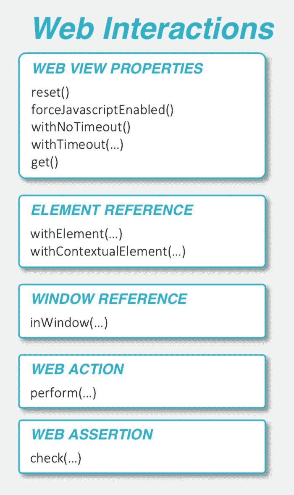

**图 6-1** 按功能负载分组的 WebInteractions

- `webClick()`——模拟 JavaScript 事件以点击特定元素。
- `clearElement()`——清除可编辑元素的内容。
- `webKeys()`——模拟发送到某个元素的 JavaScript 按键事件。
- `findElement()`——使用提供的 `locatorType` 策略查找元素。
- `selectActiveElement()`——查找文档中当前活动的元素。
- `selectFrameByIndex()`——按索引选择当前选中窗口的子框架。
- `selectFrameByIdOrName()`——按名称或 ID 选择给定窗口的子框架。
- `getText()`——返回给定 DOM 元素下方的可见文本。
- `webScrollIntoView()`——如果所需元素在滚动后可见，则返回 true。

`DriverAtoms` 可以按返回类型分组，这决定了特定方法的使用位置。请参见图 6-2。

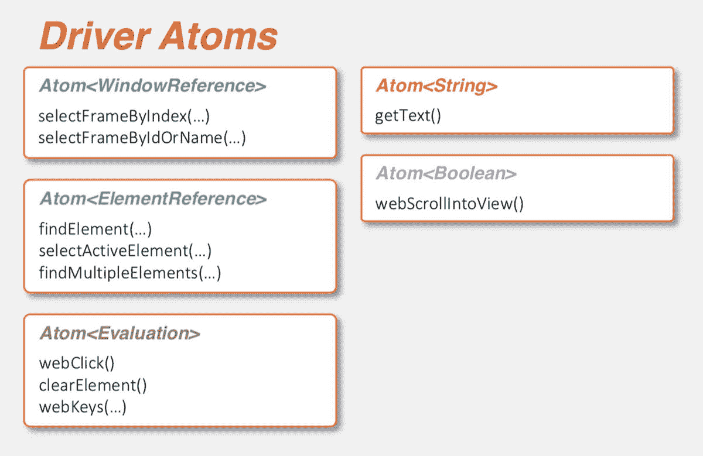

**图 6-2** 按返回类型分组的 DriverAtoms

### Web 断言

（见图 6-3）

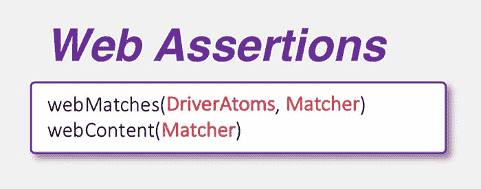

**图 6-3** WebAssertions 方法

- `webMatches()`——一个 `WebAssertion`，断言给定 atom 的结果被提供的匹配器接受。
- `webContent()`——一个 `WebAssertion`，断言文档与提供的匹配器匹配。

现在，我们可以用更详细的信息扩展 Espresso-Web API 使用公式，如图 6-4 所示。

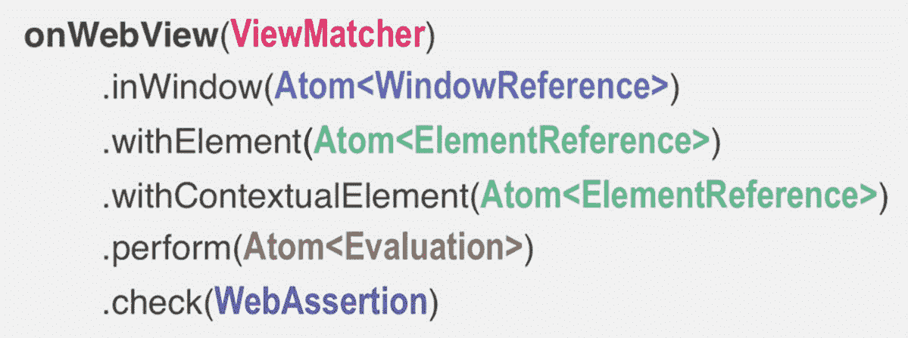

**图 6-4** 扩展的 Espresso-Web API 使用公式

您可能想知道为什么图 6-4 中显示的 `onWebView()` 方法将 Espresso `ViewMatcher`（在第 1 章中讨论）作为参数。`WebView` UI 元素仍然是 Android 原生组件，可以有自己的 ID、内容描述和其他元素属性。如果应用程序屏幕中有多个 `WebView` 组件，我们必须指定要操作哪个 `WebView`。

让我们再次查看我们的示例应用程序，其中 Settings 部分包含一个集成了 `WebView` 组件的 WebView 示例条目。图 6-5 显示了 LayoutInspector 中的布局层次结构。

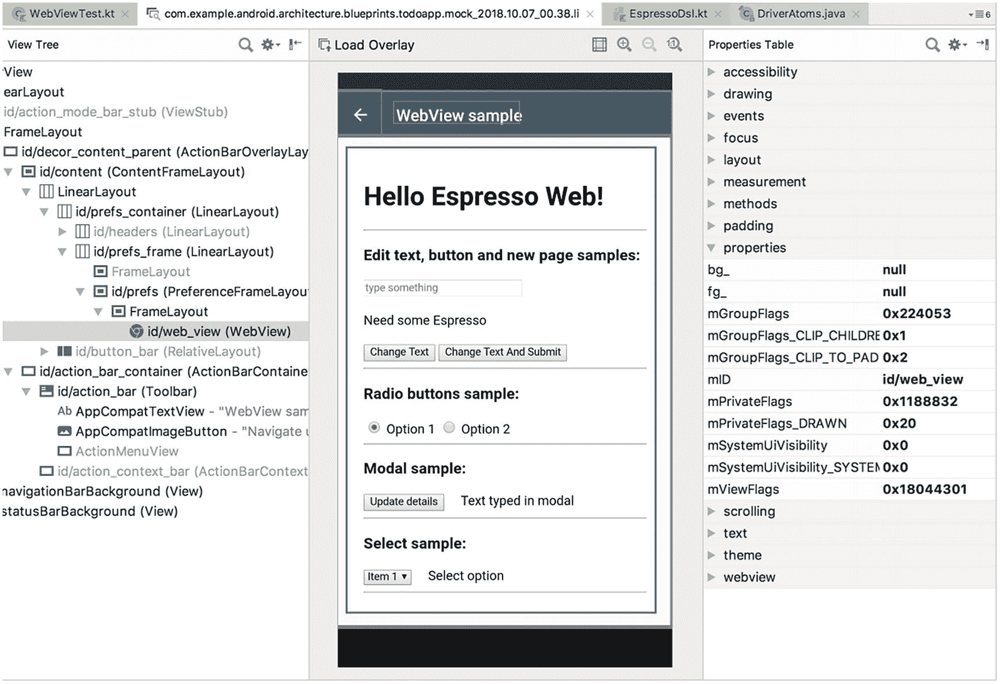

**图 6-5** WebView 组件的应用程序设置子节布局

如您所见，`WebView` 组件可以使用基于 ID 属性 `web_view` 的 Espresso `ViewMatcher` 进行标识。为方便起见，附录 A 中包含了 Espresso-Web 速查表，并作为示例应用程序源代码的补充。

## 练习 17：验证 Intent

1.  启动示例应用程序并导航到 Settings。打开 `WebView` 示例部分，并使用 LayoutInspector 工具进行布局转储。观察哪些 `WebView` 属性可用于 UI 测试。


2.  类似于步骤 1，使用监控应用程序进行布局转储。观察哪些`WebView`属性可以使用监控工具进行分析，并将其与`LayoutInspector`的结果进行比较。

## 使用 Espresso-Web 编写测试

现在我们可以深入探讨 Espresso 的 Web 测试。为了更好地理解，请在浏览器中打开主应用资源文件夹中的`web_form.html`和`web_form_response.html`文件，打开浏览器开发者工具，然后开始检查网页。假设您对 HTML 页面结构有基本了解，并能够使用浏览器开发者工具检查网页 UI 元素。

使用 Espresso-Web，可以通过以下定位器类型在布局中定位 UI 元素：

*   `CLASS_NAME("className")`
*   `CSS_SELECTOR("css")`
*   `ID("id")`
*   `LINK_TEXT("linkText")`
*   `NAME("name")`
*   `PARTIAL_LINK_TEXT("partialLinkText")`
*   `TAG_NAME("tagName")`
*   `XPATH("xpath")`

图 6-6 展示了`web_form.html`页面在 Chrome 开发者工具视图中的截图。

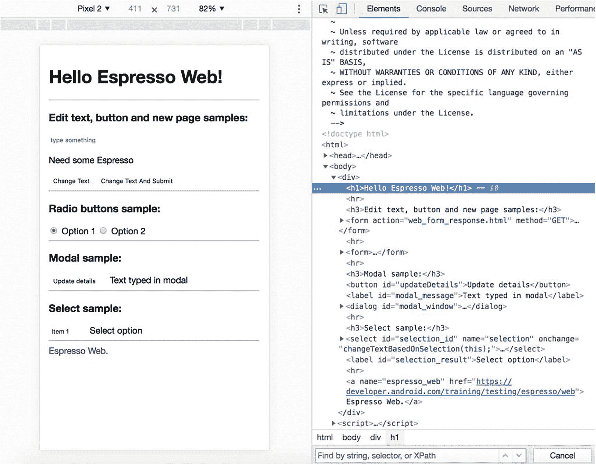

**图 6-6** Chrome 浏览器开发者工具视图

该网页的设计旨在展示 Espresso-Web 的大部分功能。打开`chapter6.WebViewTest.kt`类以查看已实现的测试用例。以下是`updatesLabelAndOpensNewPage()`测试用例。

*chapter6.* *`WebViewTest.updatesLabelAndOpensNewPage()`* *.*

```
@Test
fun updatesLabelAndOpensNewPage() {
    openDrawer()
    onView(allOf(withId(R.id.design_menu_item_text),
                 withText(R.string.settings_title))).perform(click())
    onData(instanceOf(PreferenceActivity.Header::class.java))
        .inAdapterView(withId(android.R.id.list))
        .atPosition(3)
        .perform(click())
    onWebView()
        .forceJavascriptEnabled()
        // Find edit text and type text.
        .withElement(findElement(Locator.ID, "text_input"))
        .perform(webKeys("Espresso WebView testing"))
        // Find button by id and click.
        .withElement(findElement(Locator.ID, "submitBtn"))
        .perform(webClick())
        // Find element by id and check its text.
        .withElement(findElement(Locator.ID, "response"))
        .check(webMatches(getText(), containsString("Espresso+WebView+testing")))
}
```

这里一切都很简单。导航到设置部分并点击`WebView`示例项后，`WebView`通过 Android `WebViewClient`显示。Espresso-Web 会处理网页加载，因此无需实现额外的等待器。此测试用例中的所有元素都通过其 ID 定位，这是最理想的情况。

下一个测试用例展示了如何通过 CSS 属性查找 Web 元素。这是常见的情况，当元素 ID 是动态生成且无法依赖它们时使用。

*chapter6.* *`WebViewTest.selectsRadioButtonWithCss()`* *.*

```
@Test
fun selectsRadioButtonWithCss() {
    openDrawer()
    onView(allOf(withId(R.id.design_menu_item_text),
                 withText(R.string.settings_title))).perform(click())
    onData(instanceOf(PreferenceActivity.Header::class.java))
        .inAdapterView(withId(android.R.id.list))
        .atPosition(3)
        .perform(click())
    onWebView()
        // Find radio button by CSS.
        .withElement(findElement(Locator.CSS_SELECTOR, "input[value=\"rb1\"]"))
        .perform(webClick())
}
```

另一种定位 Web 元素的方式是使用`XPATH`选择器，如下所示。

*chapter6.* *`WebViewTest.findsElementsByXpath()`* *.*

```
@Test
fun findsElementsByXpath() {
    openDrawer()
    onView(allOf(withId(R.id.design_menu_item_text),
                 withText(R.string.settings_title))).perform(click())
    onData(instanceOf(PreferenceActivity.Header::class.java))
        .inAdapterView(withId(android.R.id.list))
        .atPosition(3)
        .perform(click())
    onWebView()
        // Find label XPATH and check its text.
        .withElement(findElement(Locator.XPATH, "//label[@id=\"selection_result\"]"))
        .perform(webScrollIntoView())
        .check(webMatches(getText(), equalTo("Select option")))
}
```

**注意：** Web 浏览器开发者工具可以帮助通过`XPATH`或 CSS 选择器定位元素。只需使用`CMD+F`或`CTRL+F`快捷键并在搜索框中输入`try`表达式，元素即可在页面布局中高亮显示。

下一个示例测试用例展示了如何操作对话框弹出窗口内的元素。

*chapter6.* *`WebViewTest.opensModal()`* *.*

```
@Test
fun opensModal() {
    openDrawer()
    onView(allOf(withId(R.id.design_menu_item_text),
                 withText(R.string.settings_title))).perform(click())
    onData(instanceOf(PreferenceActivity.Header::class.java))
        .inAdapterView(withId(android.R.id.list))
        .atPosition(3)
        .perform(click())
    onWebView()
        // Find button and click.
        .withElement(findElement(Locator.ID, "updateDetails"))
        .perform(webClick())
        // Find edit text field and input text in the popped up dialog.
        .withElement(findElement(Locator.ID, "modal_text_input"))
        .perform(webKeys("Text from modal"))
        // Find and click Confirm button.
        .withElement(findElement(Locator.ID, "confirm"))
        .perform(webClick())
        // Verify text from modal is set in label.
        .withElement(findElement(Locator.ID, "modal_message"))
        .check(webMatches(getText(), equalTo("Text from modal")))
}
```

在当前情况下，对话框属于 HTML 页面，使用相同的`onWebView()`方法即可轻松找到其中的元素，如图 6-7 所示。

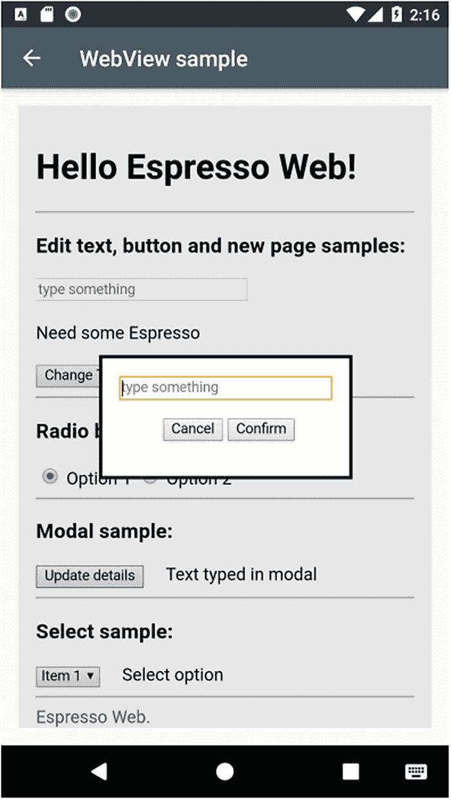

**图 6-7** Android WebView 客户端内显示的 HTML `<dialog>`。

下一个测试用例是关于测试与 HTML `<select>`组件的交互。事实证明这是一个棘手的问题。首先，实现了以下测试用例。

*chapter6.* *`WebViewTest.failsToClickSelectDropDown()`* *.*

```
@Test
fun failsToClickSelectDropDown() {
    openDrawer()
    onView(allOf(withId(R.id.design_menu_item_text),
                 withText(R.string.settings_title))).perform(click())
    onData(instanceOf(PreferenceActivity.Header::class.java))
        .inAdapterView(withId(android.R.id.list))
        .atPosition(3)
        .perform(click())
    onWebView()
        // Supposed to click on select.
        .withElement(findElement(Locator.ID, "selection_id"))
        .perform(webClick())
        // Select list is not shown, so test fails.
        .check(webMatches(getText(), equalTo("Item 3")))
}
```

问题在于，这个测试用例仅在最后一项检查上失败，因为 HTML `<select>`组件列表并未显示，尽管`webClick()`已发送到找到的元素。更改定位器类型在这种情况下无济于事，也没有必要，因为元素已经被找到。这导致一个事实：问题出在仅针对 HTML `<select>`元素的`webClick()`操作上。经过一番研究，发现这是一个已知问题，甚至有一个变通方法可以通过附加按钮使其工作：

*浏览器不允许通过纯 JavaScript 展开`<select>`，该控件只能通过鼠标直接点击来展开。`select.click()`将不起作用。但有一个解决方案。我们通过创建另一个一次显示多个选项的选择框来模拟展开的`<select>`控件，这可以通过设置`size`参数来实现。这个多选选择框将绝对定位在旧的单一选项选择框之上，并且旧的选项将通过样式的`visibility`属性隐藏。这样布局保持不变，新控件无缝显示。新控件看起来只是略有不同，但这不应该成为问题，请自行在下面的截图中查看。*

[`https://code.google.com/archive/p/expandselect/`](https://code.google.com/archive/p/expandselect/)


### 正文排版

但有一个来自测试端的变通方法，无需在网页上引入 UI 组件。当停留在显示 WebView 的屏幕上时，我们可以在`<select>`元素获得焦点时，通过发送`ViewActions.pressKey(KeyEvent.KEYCODE_SPACE)`事件来展开它。就像通过浏览器操作一样。要将焦点移动到`<select>`元素，我们发送所需数量的 Tab 操作以导航到目标 UI 元素——`ViewActions.pressKey(KeyEvent.KEYCODE_TAB)`。不幸的是，测试需要休眠一小段时间，以便发送的操作能在 WebView 中被应用。以下是在示例应用中的实现方式。

*章节 6* **.** *`WebViewTest.verifiesSelectDropDown()`**.*

```kotlin
@Test
fun verifiesSelectDropDown() {
    openDrawer()
    onView(allOf(withId(R.id.design_menu_item_text),
            withText(R.string.settings_title))).perform(click())
    onData(instanceOf(PreferenceActivity.Header::class.java))
            .inAdapterView(withId(android.R.id.list))
            .atPosition(3)
            .perform(click())
    // Send TAB keys as many times as needed to reach the "select".
    Thread.sleep(300)
    onView(withId(R.id.web_view)).perform(pressKey(KeyEvent.KEYCODE_TAB))
    Thread.sleep(300)
    onView(withId(R.id.web_view)).perform(pressKey(KeyEvent.KEYCODE_TAB))
    Thread.sleep(300)
    onView(withId(R.id.web_view)).perform(pressKey(KeyEvent.KEYCODE_TAB))
    Thread.sleep(300)
    onView(withId(R.id.web_view)).perform(pressKey(KeyEvent.KEYCODE_TAB))
    Thread.sleep(300)
    onView(withId(R.id.web_view)).perform(pressKey(KeyEvent.KEYCODE_TAB))
    Thread.sleep(300)
    onView(withId(R.id.web_view)).perform(pressKey(KeyEvent.KEYCODE_TAB))
    Thread.sleep(300)
    // Send SPACE key to expand "select".
    onView(withId(R.id.web_view)).perform(pressKey(KeyEvent.KEYCODE_SPACE))
    /**
     * At this point android platform popup is shown.
     * Use Espresso native methods to select item from the list.
     */
    onView(withText("Item 3")).click()
    onWebView()
    // Check that text from select list is set into the label.
            .withElement(findElement(Locator.ID, "selection_result"))
            .check(webMatches(getText(), equalTo("Item 3")))
}
```

这个测试用例功能完整，但看起来不够优雅。通过为`ViewInteraction`添加一个额外的扩展函数，我们可以清理测试代码。

*测试用例 chapter6* **.** *`WebViewTest.verifiesSelectDropDown()`**.*

```kotlin
/**
 * Expand function for web view test case.
 * It contains a Thread.sleep() each time key event is sent.
 *
 * @param key - keycode from [KeyEvent]
 * @param milliseconds - milliseconds to sleep
 * @param count - amount of times [KeyEvent] should be executed
 */
fun ViewInteraction.pressKeyAndSleep(key: Int, milliseconds: Long, count: Int = 1): ViewInteraction {
    for (i in 1..count) {
        /**
         * Having Thread.sleep() in tests is a bad practice.
         * Here we are using it just to solve specific issue and nothing more.
         */
        Thread.sleep(milliseconds)
        perform(ViewActions.pressKey(key))
    }
    return this
}
```

`verifiesSelectDropDown()`测试用例变得更加易读。

*测试用例 chapter6* **.** *`WebViewTest.verifiesSelectDropDown()`**.*

```kotlin
@Test
fun verifiesSelectDropDown() {
    openDrawer()
    onView(allOf(withId(R.id.design_menu_item_text),
            withText(R.string.settings_title))).perform(click())
    onData(instanceOf(PreferenceActivity.Header::class.java))
            .inAdapterView(withId(android.R.id.list))
            .atPosition(3)
            .perform(click())
    onView(withId(R.id.web_view))
            // Send TAB keys as many times as needed to reach the "select".
            .pressKeyAndSleep(KeyEvent.KEYCODE_TAB, 500, 6)
            // Send SPACE key to expand "select".
            .perform(ViewActions.pressKey(KeyEvent.KEYCODE_SPACE))
    /**
     * At this point android platform popup is shown.
     * Use Espresso native methods to select item from the list.
     */
    onView(withText("Item 3")).click()
    onWebView()
            // Check that text from select list is set into the label.
            .withElement(findElement(Locator.ID, "selection_result"))
            .check(webMatches(getText(), equalTo("Item 3")))
}
```

关于`<select>`下拉菜单的一点说明。它以原生平台弹出窗口的形式呈现给用户，可以通过 Espresso 方法与其进行交互，如图 6-8 所示。

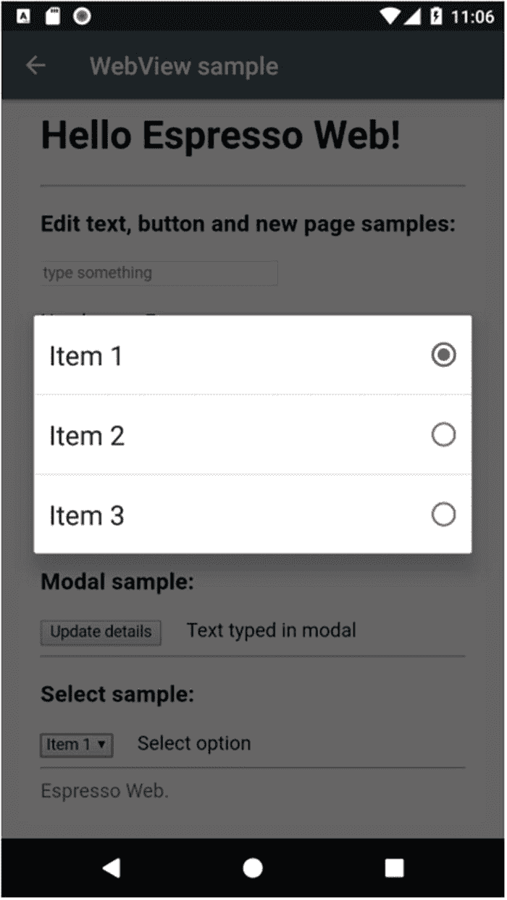

**Figure 6-8** HTML `<select>` 下拉选项显示在 Android WebView 客户端内部

`WebViewTest.kt`类中的最后一个测试用例包含了其余`Locator`类型的使用示例。

*测试用例 chapter6* **.** *`WebViewTest.showsOtherLocatorsSample()`**.*

```kotlin
@Test
fun showsOtherLocatorsSample() {
    openDrawer()
    onView(allOf(withId(R.id.design_menu_item_text),
            withText(R.string.settings_title))).perform(click())
    onData(instanceOf(PreferenceActivity.Header::class.java))
            .inAdapterView(withId(android.R.id.list))
            .atPosition(3)
            .perform(click())
    onWebView()
            // Find element by Locator.NAME
            .withElement(findElement(Locator.NAME, "text_input"))
            .perform(webScrollIntoView())
            // Find element by Locator.LINK_TEXT
            .withElement(findElement(Locator.LINK_TEXT, "Espresso Web."))
            .perform(webScrollIntoView())
            // Find element by Locator.PARTIAL_LINK_TEXT
            .withElement(findElement(Locator.PARTIAL_LINK_TEXT, "Espresso"))
            .perform(webScrollIntoView())
            // Find element by Locator.CLASS_NAME
            .withElement(findElement(Locator.CLASS_NAME, "header"))
            .check(webMatches(webScrollIntoView(), `is`(true)))
}
```

这个测试用例展示了如何将`webScrollIntoView()`动作作为参数传递给`WebAssertion.webMatches()`方法。当找不到我们操作的元素时，这种方法提供了更易读的错误描述。

### 练习 18

**编写 WebView 测试**

1.  在 Web 浏览器中打开`web_form.html`页面并分析页面结构。通过 XPATH 和 CSS 选择器搜索元素。

2.  更新`selectsRadioButtonWithCss()`测试，使得选中标签为“Option 2”的单选按钮。

3.  编写一个测试，仅通过 XPATH 查找所有元素。

4.  编写一个测试，仅通过 CSS 定位器查找所有元素。

## 总结

Espresso-Web 是 Espresso API 的一个很好的补充。它允许你测试包含 WebView 组件的混合应用程序。是的，它并不完美，不能用于纯粹的 Web 应用程序测试，但它以类似 Espresso 的方式很好地完成了自己的工作。

## 7. 无障碍测试

大多数移动应用程序的开发都基于对用户或用户类型的既定假设。在软件测试中，术语*用户画像*反映了这些用户类型，包括他们可能的使用流程以及应用程序可能如何在日常活动中帮助他们。尽管用户画像在软件开发生命周期的早期阶段就已被创建，但它们可能没有考虑残疾人群体。
全球约有 3 亿人患有视力障碍，他们借助安装在自己移动设备上的特定无障碍工具来使用移动应用程序。

## Android 无障碍工具

Android 平台为视力障碍人士提供了三种工具类型：

*   **TalkBack** — 预装的屏幕阅读器应用程序，允许用户在无需视觉访问屏幕的情况下与 Android 应用程序进行交互。视障用户可能依赖 TalkBack 来使用你的应用。

*   **BrailleBack** — 一项无障碍服务，帮助视障用户使用盲文设备。与 TalkBack 应用程序协同工作，提供组合的盲文和语音体验。

*   **Voice Access** — 允许用户通过语音命令控制其 Android 设备。Voice Access 适用于运行 Android 5.0（API 级别 21）及更高版本的设备。


如你所见，`BrailleBack` 依赖于 `TalkBack`，后者会向用户读出当前屏幕上每个可用的交互元素。为了让视觉障碍用户能够无障碍地使用 Android 应用，开发者应遵循无障碍指南。其中包括：

- **为 UI 元素添加标签** — 许多屏幕阅读器（如 `TalkBack`）依赖此服务来正确解释特定控件的功能。例如，对于 `ImageView` 和 `ImageButton` 这类 UI 对象，需设置 `android:contentDescription` 参数来指定其用途。对于 `EditText` 对象，则使用 `android:hint`。

- **对内容进行分组** — 正如可视 UI 被分组为易于理解的组件（如包含列表项的列表），屏幕阅读器的内容也应以逻辑方式分组。项目应作为一个整体通告（例如一个包含标题、描述和复选框状态的待办事项项），而不是作为独立元素呈现。

- **创建易于遵循的导航** — 应用应支持键盘导航和导航手势。避免 UI 元素在特定时间后淡出或消失。

- **使触摸目标足够大** — 提供更大的触摸目标，可显著提升用户导航应用的便捷性。通常，根据指南，可聚焦项的触摸区域最小应为 `48dp x 48dp`。

- **提供充分的颜色对比度** — 视力不佳或使用屏幕亮度较低设备的用户难以读取屏幕信息。通过提高应用中前景与背景颜色的对比度，用户可以更轻松地在屏幕内和屏幕间导航。

## 测试应用无障碍

`Espresso` 测试框架支持编写自动化的无障碍测试，用于评估应用的无障碍性。要开始编写无障碍测试，请将以下依赖项添加到 `build.gradle` 文件中。

*在应用模块的 `build.gradle` 文件中添加 Android 测试支持库的无障碍依赖项。*

```
androidTestImplementation "com.android.support.test.espresso:espresso-accessibility:3.0.2"
androidTestImplementation "com.google.android.apps.common.testing.accessibility.framework:accessibility-test-framework:2.1"
```

*在应用模块的 `build.gradle` 文件中添加 AndroidX 测试库的无障碍依赖项。*

```
androidTestImplementation 'androidx.test.espresso:espresso-accessibility:3.1.0'
androidTestImplementation "com.google.android.apps.common.testing.accessibility.framework:accessibility-test-framework:2.1"
```

添加这些依赖项后，你需启用无障碍检查，如下例所示：

```
companion object {
@BeforeClass
@JvmStatic
fun setAccessibilityPrefs() {
AccessibilityChecks.enable()
}
}
```

注意：每个测试类中 `AccessibilityChecks` 只能启用一次，否则测试将失败。因此，应在启用检查的方法上使用 `@BeforeClass` 注解。在 Kotlin 中，带有 `@BeforeClass` 注解的方法需声明在 `class` 的伴生对象中。

设置了 `AccessibilityChecks.enable()` 后，每次在 UI 元素（包括其子元素）上调用 Espresso 的 `ViewAction` 时都会启用检查。此方法将无障碍测试限制为仅涵盖 UI 测试范围。若要在测试运行中覆盖更多 UI 元素，可设置 `setRunChecksFromRootView(true)`，从而验证整个视图层级。

*`chapter7. AccessibilityTest.kt` 类中的伴生对象。*

```
@BeforeClass
@JvmStatic
fun setAccessibilityPrefs() {
AccessibilityChecks.enable().setRunChecksFromRootView(true)
}
```

遗憾的是，无法针对每个测试方法或测试类单独设置无障碍检查，也无法在测试运行后将其禁用。

有时，已知的无障碍问题可能尚未解决。借助 `com.google.android.apps.common.testing.accessibility.framework` 中实现的 `AccessibilityValidator`，你可以抑制这些问题：

```
@BeforeClass
@JvmStatic
fun setAccessibilityPrefs() {
AccessibilityChecks.enable()
.setRunChecksFromRootView(true)
.setSuppressingResultMatcher(AccessibilityCheckResultUtils.matchesViews(
hasSibling(withId(R.id.menu_filter))))
}
```

类似地，你也可以借助 `anyOf()` 匹配器来抑制多个无障碍问题，如下所示：

```
@BeforeClass
@JvmStatic
fun setAccessibilityPrefs() {
AccessibilityChecks.enable()
.setRunChecksFromRootView(true)
.setSuppressingResultMatcher(AccessibilityCheckResultUtils.matchesViews(anyOf(
hasSibling(withId(R.id.menu_filter)),
withChild(withChild(withId(android.support.design.R.id.snackbar_text))))))
}
```

顺便提一下，你可能会注意到原生 Android UI 元素（如 Snackbar）存在无障碍问题。有时抑制它们并非易事。在之前的代码示例中，`withChild()` 视图匹配器被使用了两次，以定位 Snackbar 的根布局并抑制其无障碍问题。

你还可以通过向 `setThrowExceptionForErrors()` 方法提供 `false` 值，让测试即使在存在无障碍问题时也能继续运行：

```
@BeforeClass
@JvmStatic
fun setAccessibilityPrefs() {
AccessibilityChecks.enable()
.setRunChecksFromRootView(true)
.setSuppressingResultMatcher(AccessibilityCheckResultUtils.matchesViews(anyOf(
hasSibling(withId(R.id.menu_filter)),
withChild(withChild(withId(android.support.design.R.id.snackbar_text))))))
.setThrowExceptionForErrors(false)
}
```

在这种情况下，所有问题都将重定向到 `logcat` 日志，其中 `I` 级别的日志为信息性日志（显示为黑色），`W` 为警告（显示为蓝色），`E` 为错误（显示为红色）。见图 7-1。

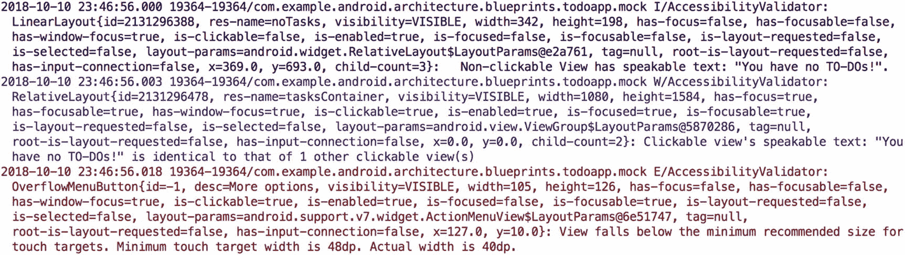

**图 7-1** 设置 `setThrowExceptionForErrors(false)` 时的无障碍 `logcat` 日志

以下是测试失败后无障碍问题堆栈跟踪的示例：

```
com.google.android.apps.common.testing.accessibility.framework.integrations.AccessibilityViewCheckException: There was 1 accessibility error:
OverflowMenuButton{id=-1, desc=More options, visibility=VISIBLE, width=105, height=126, has-focus=false, has-focusable=false, has-window-focus=false, is-clickable=true, is-enabled=true, is-focused=false, is-focusable=true, is-layout-requested=false, is-selected=false, layout-params=android.support.v7.widget.ActionMenuView$LayoutParams@48cbb74, tag=null, root-is-layout-requested=true, has-input-connection=false, x=127.0, y=10.0}: View falls below the minimum recommended size for touch targets. Minimum touch target width is 48dp. Actual width is 40dp.
at com.google.android.apps.common.testing.accessibility.framework.integrations.espresso.AccessibilityValidator.processResults(AccessibilityValidator.java:187)...
```

你可能注意到，两种情况下的头部部分是完全相同的。除了自动化的无障碍测试，Google 开发者还提供了使用 Accessibility Scanner 应用（[`https://play.google.com/store/apps/details?id=com.google.android.apps.accessibility.auditor`](https://play.google.com/store/apps/details%253Fid%253Dcom.google.android.apps.accessibility.auditor)）进行手动测试的可能性。该应用允许你检查无障碍问题的类型，并基于可视化表示更好地理解 Espresso 无障碍测试报告或 `logcat` 日志中显示的错误。

图 7-2 展示了无障碍扫描器的设置过程。

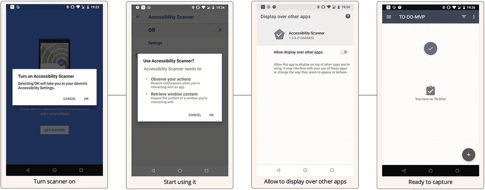

**图 7-2** 开始使用无障碍扫描器流程


### 图 7-3：创建任务视图中的无障碍问题

图 7-3 展示了示例待办事项应用中存在无障碍问题的几个无障碍分析实例。

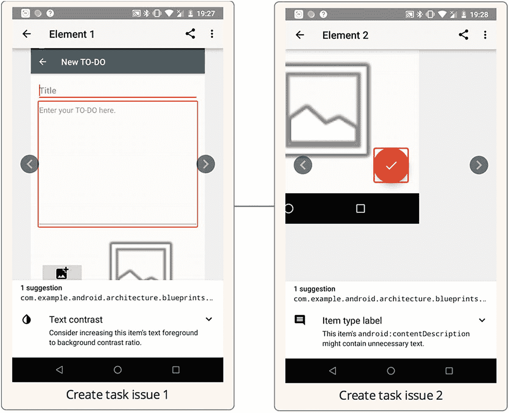

**图 7-3** 创建任务视图中的无障碍问题

## 练习 19：执行无障碍测试

1. 安装无障碍扫描器应用并启用无障碍检查。启动示例待办事项应用，对整个应用执行无障碍检查。观察问题类型。
2. 仅使用 `AccessibilityChecks.enable()` 选项，从 `AccessibilityTest.kt` 类中运行测试。观察测试结果。
3. 使用 `setRunChecksFromRootView(true)` 选项，从 `AccessibilityTest.kt` 类中运行测试。观察测试结果。
4. 如 `AccessibilityTest.kt` 类的 `setAccessibilityPrefs()` 方法所示，抑制某些无障碍失败问题，然后再次运行测试。观察测试结果。
5. 添加 `setThrowExceptionForErrors(false)` 参数并运行测试。观察测试结果和设备 `logcat` 日志。

## 总结

遗憾的是，无障碍测试常常被忽视，人们主要关注功能测试。乍一看可能不清晰，但良好的无障碍支持同样重要。其主要目标是使视障人士能够使用应用，但它也有不错的外溢效果——它能让你的应用更易于测试，并帮助你理解不同的应用使用场景。它甚至可能让你的应用在 Google PlayStore 上获得更高评分，因为 Android 爬行算法可能会从无障碍角度分析应用，并优先推荐那些具有良好无障碍支持的应用。

# 8. Espresso 与 UI Automator：完美组合

Espresso 是一个完美且快速的测试自动化框架，但它有一个重要的限制——我们只允许在测试应用的上下文内进行操作。这意味着无法针对以下使用场景自动化测试：

- 点击应用推送通知
- 访问系统设置
- 从另一个应用导航到正在测试的应用，反之亦然

这种限制的原因在于 Android 测试工具（Instrumentation）的特性。由于在 Espresso 测试运行期间，被测试应用和测试应用进程被生成，我们不允许与移动设备上安装的其他应用进行交互，例如通知栏、相机或系统设置应用。但可以使用 UI Automator 来访问它们。UI 测试框架适用于跨应用的功能性 UI 测试。

> **注意**  
> UI Automator 测试框架支持 Android 4.3（API 级别 18）及更高版本。

## UI Automator 的主要特性

UI Automator 的主要特性包括以下内容：

- 一个用于检查布局层次结构的 `uiautomatorviewer`。从 Android Studio 2.3 开始，它已被监视器工具取代。
- 一个用于检索设备状态信息并对其执行操作的 API。示例包括按下设备主页或返回按钮、更改设备旋转方向、打开通知和截取屏幕截图。
- 支持跨应用 UI 测试的 API。

我们将稍微关注一下 UI Automator 的 API：

- **By**——`By` 是一个实用类，允许以简洁的方式创建 `BySelector`。其主要功能是使用简化的语法提供用于构造 `BySelector` 的静态工厂方法。例如，你会使用 `findObject(By.text("foo"))` 而不是 `findObject(new BySelector().text("foo"))` 来选择文本值为 `"foo"` 的 UI 元素。
- **BySelector**——`BySelector` 在调用 `findObject(BySelector)` 期间指定匹配 UI 元素的标准。
- **Configurator**——允许你设置运行 UI Automator 测试的关键参数。新设置会立即生效，并且可以在测试运行期间的任何时间更改。
- **UiCollection**——用于枚举容器中的 UI 元素，以便根据子元素的文本或描述来计数或定位子元素。
- **UiObject**——`UiObject` 是视图的一种表示形式。它不会以对象引用的方式直接绑定到任何视图。`UiObject` 包含有助于在运行时根据其构造函数中指定的 [`UiSelector`](https://developer.android.com/reference/android/support/test/uiautomator/UiSelector.html) 属性来定位匹配视图的信息。创建 `UiObject` 的实例后，它可以重新用于匹配选择器标准的不同视图。
- **UiObject2**——`UiObject2` 表示一个 UI 元素。与 `UiObject` 不同，它绑定到特定的视图实例，并且如果底层视图对象被销毁，可能会变得过时。因此，如果 UI 发生显著变化，可能需要调用 `findObject(BySelector)` 来获取新的 `UiObject2` 实例。
- **UiScrollable**——`UiScrollable` 是一个 [`UiCollection`](https://developer.android.com/reference/android/support/test/uiautomator/UiCollection.html)，并提供对可滚动布局元素中项目搜索的支持。此类可用于水平或垂直可滚动的控件。
- **UiSelector**——指定测试目标在布局层次结构中的元素，通过文本值、内容描述、类名和状态信息等属性进行过滤。你还可以根据元素在布局层次结构中的位置来定位元素。

除了这个 API 列表之外，我们还应该熟悉以下框架类：

- **Until**——`Until` 类提供了用于构造常见条件的工厂方法。

> **注意**  
> UI Automator 测试框架是一个基于 Instrumentation 的 API，并与 `AndroidJUnitRunner` 测试运行器配合使用。这一事实允许我们在同一个测试中将 Espresso 与 UI Automator 代码一起使用。

## 开始使用 UI Automator

要开始使用 UI Automator，我们首先应在 `build.gradle` 文件中设置依赖项，如下所示。

**`build.gradle` 文件中的 UI Automator Android 测试支持库依赖项：**

```groovy
androidTestImplementation 'com.android.support.test.uiautomator:uiautomator-v18:2.1.3'
```

并且还需要设置 AndroidX 测试库依赖项。

**`build.gradle` 文件中的 UI Automator AndroidX 测试库依赖项：**

```groovy
androidTestImplementation 'androidx.test.uiautomator:uiautomator:2.2.0'
```

让我们从我们已经熟悉的 Espresso 角度来分析 UI Automator，并试图弄清楚它们有多不同。我们还将考虑 UI Automator 的优势和劣势：

- **处理应用转场：**
  - Espresso——自动处理窗口转场。
  - UI Automator——不支持自动窗口转场，即在活动或片段之间切换。你应该显式地使用等待。

- **定位 UI 元素：**
  - Espresso——使用核心的 Espresso `onView()` 和 `onData()` 方法，配合视图匹配器或数据匹配器来定位 UI 元素。
  - UI Automator——与 Espresso 类似，UI Automator 有自己的核心 `UiDevice` 类。它包含诸如 `hasObject(BySelector)`、`findObject(BySelector)` 和 `findObjects(BySelector)` 之类的方法，用于搜索元素或检查其在应用 UI 中的存在情况。

- **等待机制：**
  - Espresso——`IdlingResource` 和第三方 `ConditionWatcher` 类可用作等待机制，包括网络相关等待和元素存在等待。两种等待器都应根据每个具体情况进行实现。


- **UI Automator**——与 Espresso 不同，UI Automator 在 `UiDevice` 类中定义了 `wait()` 和 `performActionAndWait()` 方法。通过提供自定义的 `SearchCondition` 或 `EventCondition` 参数，可以轻松调整等待逻辑。

- **UI/视图操作**：

  - **Espresso**——支持多种视图操作，并允许定义自定义操作。但它只能与正在测试的应用进行交互。
  - **UI Automator**——如前所述，UI Automator 可以与设备上的任何应用进行交互，但可执行的操作范围非常有限。

- **设备控制**：

  - **Espresso**——不支持。
  - **UI Automator**——提供了大量的设备控制方法，从设备主页键点击到方向控制，一应俱全。

- **报告**：

  - **Espresso**——支持更丰富的测试失败报告，便于分析测试失败原因。
  - **UI Automator**——失败时通常返回非描述性的堆栈跟踪，需要分析才能了解问题所在。

基于这些差异，可以发现两者结合形成了一套非常强大的功能集，几乎涵盖了 Android 测试自动化的所有需求。

为了更容易理解 UI Automator 框架，我们可以用动词来描述其功能：

- `UiDevice().find`——展示 UI Automator 的查找方法。

  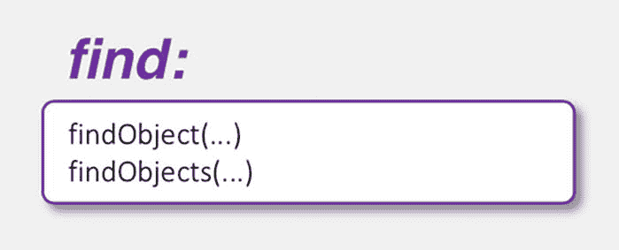

- `UiDevice().act`——整合所有可对设备执行的操作，从按下返回键到执行 shell 命令。

  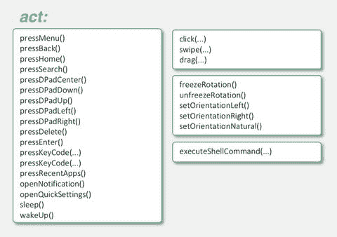

- `UiDevice().wait`——等待某个条件满足。

  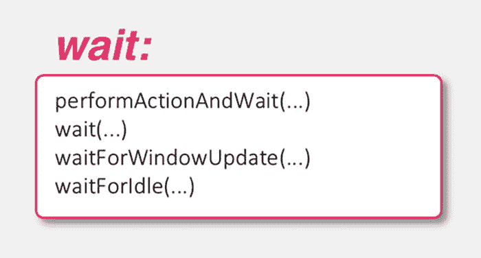

- `UiDevice().watch`——表示一组用于创建和控制条件观察器的方法。

  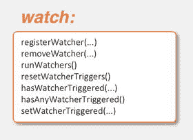

- `UiDevice().get`——获取设备或应用参数。

  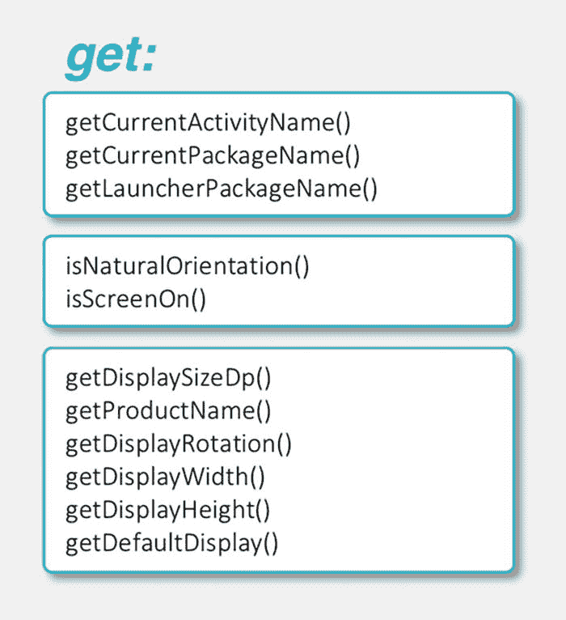

- `UiDevice().set`——启用或禁用布局层次压缩。

  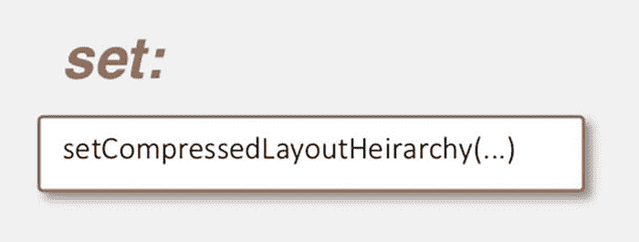

在接下来的章节中，我们将看到当 Android 的 Espresso 无法处理问题时，大多数 `UiDevice` 方法是如何被使用的。

## 查找并操作 UI 元素

UI Automator 的主要功能是定位 UI 元素并对其执行操作。如果讨论 UI Automator 与 Espresso 的结合使用，那么它可以用于在第三方应用或系统应用中导航、截屏，或者执行 shell 命令等。但当然，UI Automator 也可以作为独立的测试自动化框架使用。

如前所述，UI 元素搜索是通过 `findObject()` 和 `findObjects()` 方法完成的。`findObject()` 方法将以下类的实例作为参数，这些参数指定了在层级结构中匹配 UI 元素的条件：

- `UiSelector()`
- `BySelector()`

它们之间的概念性区别在于每个选择器指定的搜索条件的应用方式不同。为了理解这一点，我们首先来看 `UiSelector` 的示例测试，这些测试实现在 `UiAutomatorUiSelectorTest.kt` 测试类中。

*chapter8* *.UiAutomatorUiSelectorTest.uiSelectorSample()*。

```kotlin
private val instrumentation = InstrumentationRegistry.getInstrumentation()
private val uiDevice: UiDevice = UiDevice.getInstance(instrumentation)
private val fourSecondsTimeout = 4000L

@get:Rule
var activityTestRule = ActivityTestRule(TasksActivity::class.java)

/**
* 创建两个待办事项，将第一个标记为已完成，并验证其文本。
*/
@Test
fun uiSelectorSample() {
    // 添加第一个待办事项。
    uiDevice.findObject(
        UiSelector().resourceId(
            "com.example.android.architecture.blueprints.todoapp.mock:id/fab_add_task"))
        .click()
    uiDevice.findObject(UiSelector().resourceId(
        "com.example.android.architecture.blueprints.todoapp.mock:id/add_task_title"))
        .text = "item 1"
    uiDevice.findObject(UiSelector().resourceId(
        "com.example.android.architecture.blueprints.todoapp.mock:id/fab_edit_task_done"))
        .click()
    uiDevice.findObject(UiSelector().text("TO-DO saved")).waitUntilGone(fourSecondsTimeout)

    // 添加第二个待办事项。
    uiDevice.findObject(UiSelector().resourceId(
        "com.example.android.architecture.blueprints.todoapp.mock:id/fab_add_task"))
        .click()
    uiDevice.findObject(UiSelector().resourceId(
        "com.example.android.architecture.blueprints.todoapp.mock:id/add_task_title"))
        .text = "item 2"
    uiDevice.findObject(UiSelector().resourceId(
        "com.example.android.architecture.blueprints.todoapp.mock:id/fab_edit_task_done"))
        .click()
    uiDevice.findObject(UiSelector().text("TO-DO saved")).waitUntilGone(fourSecondsTimeout)

    // 将第一个待办事项标记为已完成，点击它并验证文本。
    uiDevice.findObject(UiSelector().className(RecyclerView::class.java.name)
        .childSelector(UiSelector().checkable(true)))
        .click()
    uiDevice.findObject(UiSelector().className(RecyclerView::class.java.name)
        .childSelector(UiSelector().className(LinearLayout::class.java)).instance(0))
        .click()

    val detailViewTitle = uiDevice.findObject(UiSelector().resourceId(
        "com.example.android.architecture.blueprints.todoapp.mock:id/task_detail_title"))
    assertTrue("未显示待办事项\"item 1\"。", detailViewTitle.exists())
    assertTrue("未显示待办事项\"item 1\"。", detailViewTitle.text.equals("item 1"))
}
```

如你所见，UI Automator 测试包含一个 `ActivityTestRule` 规则来启动应用的主 `TasksActivity`。之后，UI Automator 代码接管测试执行并执行 UI 交互。所有 `resourceId` 值都是在转储应用布局后从 `monitor` 工具中获取的。另外请注意，由于每个测试步骤都调用了 `uiDevice.findObject(UiSelector)` 方法，测试代码的可读性较差。但有一个简单的解决方法——由于 `uiDevice.findObject(UiSelector)` 返回一个在运行时定位匹配视图的 `UiObject` 实例，因此可以提前声明它，并在后续步骤中重复用于匹配选择条件的其他视图。简化后的测试方法如下所示。

*chapter8* *. UiAutomatorUiSelectorTest.uiSelectorSampleSimplified()* *。


```kotlin
/**
* 展示了如何通过预先声明 UiObject 元素来简化 interactsWithToDoInRecyclerViewUiSelector() 测试。
*/
@Test
fun uiSelectorSampleSimplified() {
// 声明稍后在测试中会使用的 UiObject 实例。
val fabAddTask = uiDevice.findObject(UiSelector().resourceId(
"com.example.android.architecture.blueprints.todoapp.mock:id/fab_add_task"))
val taskTitle = uiDevice.findObject(UiSelector().resourceId(
"com.example.android.architecture.blueprints.todoapp.mock:id/add_task_title"))
val fabDone = uiDevice.findObject(UiSelector().resourceId(
"com.example.android.architecture.blueprints.todoapp.mock:id/fab_edit_task_done"))
val todoSavedText = uiDevice.findObject(UiSelector().text("TO-DO saved"))
val taskDetailsTitle = uiDevice.findObject(UiSelector().resourceId(
"com.example.android.architecture.blueprints.todoapp.mock:id/task_detail_title"))
val firstTodoCheckbox = uiDevice.findObject(UiSelector()
.className(RecyclerView::class.java.name)
.childSelector(UiSelector().checkable(true)).instance(0))
val firstTodoItem = uiDevice.findObject(UiSelector().className(RecyclerView::class.java.name)
.childSelector(UiSelector().className(LinearLayout::class.java)).instance(0))
// 添加第一个待办事项。
fabAddTask.click()
taskTitle.text = "item 1"
fabDone.click()
todoSavedText.waitUntilGone(fourSecondsTimeout)
// 添加第二个待办事项。
fabAddTask.click()
taskTitle.text = "item 2"
fabDone.click()
todoSavedText.waitUntilGone(fourSecondsTimeout)
// 将第一个待办事项标记为已完成，点击并验证其文本。
firstTodoCheckbox.click()
firstTodoItem.click()
assertTrue("未显示待办事项“item 1”。", taskDetailsTitle.exists())
assertTrue("待办事项“item 1”标题错误。", taskDetailsTitle.text.equals("item 1"))
}
```

此测试方法看起来更美观且更具可读性。其附带好处是，你获得了易于维护的代码；因此，当诸如`id`或`class`等元素属性发生更改时，只需在声明中更新一次即可，而无需在整个测试代码中逐一修改。

接下来，我们看看在 `UiAutomatorBySelectorTest.kt` 类中实现的 `BySelector` 测试示例。`bySelectorSample()` 测试演示了如何使用 `BySelector` 和 `UiObject2`，来测试在 `UiAutomatorUiSelectorTest.kt` 类中实现自动化测试的同一个场景。

*chapter8* *.UiAutomatorBySelectorTest.bySelectorSample().*

```kotlin
private val instrumentation = InstrumentationRegistry.getInstrumentation()
private val uiDevice: UiDevice = UiDevice.getInstance(instrumentation)
private val twoSeconds = 2000L
private val fourSeconds = 4000L
private val applicationPackage = "com.example.android.architecture.blueprints.todoapp.mock"
@get:Rule
var activityTestRule = ActivityTestRule(TasksActivity::class.java)
/**
* 创建两个待办事项，将第一个标记为已完成，并验证其文本。
*/
@Test
fun bySelectorSample() {
// 添加第一个待办事项。
uiDevice.wait(
Until.findObject(By.res(applicationPackage, "fab_add_task")), twoSeconds)
.clickAndWait(Until.newWindow(), twoSeconds)
uiDevice.findObject(By.res(applicationPackage, "add_task_title")).text = "item 1"
uiDevice.findObject(By.res(applicationPackage, "fab_edit_task_done"))
.clickAndWait(Until.newWindow(), twoSeconds)
uiDevice.wait(Until.gone(By.text("TO-DO saved")), fourSeconds)
// 添加第二个待办事项。
uiDevice.wait(Until.findObject(By.res(applicationPackage, "fab_add_task")), twoSeconds)
.clickAndWait(Until.newWindow(), twoSeconds)
uiDevice.findObject(By.res(applicationPackage, "add_task_title")).text = "item 2"
uiDevice.findObject(By.res(applicationPackage, "fab_edit_task_done"))
.clickAndWait(Until.newWindow(), twoSeconds)
uiDevice.wait(Until.gone(By.text("TO-DO saved")), fourSeconds)
// 将第一个待办事项标记为已完成，点击并验证其文本。
val todoList = uiDevice.findObject(By.clazz(RecyclerView::class.java))
todoList.children[0]
.findObject(By.checkable(true))
.click()
todoList.children[0]
.click()
assertTrue("未显示待办事项“item 1”。", uiDevice.hasObject(By.text("item 1")))
}
```

使用 `BySelector` 的测试代码起初可能看起来更易读，但有一个缺点——`BySelector()` 是在调用 `UiDevice.findObject(BySelector)` 时才应用并执行的，这降低了测试代码编写的灵活性。这意味着以下行不能在测试方法开始时声明为变量并在之后复用。

*chapter8* *.UiAutomatorBySelectorTest.bySelectorSample(): 点击“添加任务”浮动按钮。*

```kotlin
uiDevice.findObject(By.res(applicationPackage, "fab_edit_task_done")).click()
```

我们仍然可以做的，是像下面这样提取选择器本身。

*chapter8* *.UiAutomatorBySelectorTest.bySelectorSample(): 查找并点击“完成”浮动按钮。*

```kotlin
val fabDone = By.res(applicationPackage, "fab_edit_task_done")
uiDevice.findObject(fabDone).click()
```

测试方法可能的改进如下代码所示。

*chapter8* *.UiAutomatorBySelectorTest.bySelectorSampleWithFindObjects()* *.*

```kotlin
@Test
fun bySelectorSampleWithFindObjects() {
val fabAddTask = By.res(applicationPackage, "fab_add_task")
val taskTitle = By.res(applicationPackage, "add_task_title")
val fabDone = By.res(applicationPackage, "fab_edit_task_done")
val todoSavedText = By.text("TO-DO saved")
val checkBox = By.checkable(true)
val toDoRecyclerView = By.clazz(RecyclerView::class.java)
// 添加第一个待办事项。
uiDevice.waitForWindowUpdate(uiDevice.currentPackageName, twoSeconds)
uiDevice.wait(Until.findObject(fabAddTask), twoSeconds)
.clickAndWait(Until.newWindow(), twoSeconds)
uiDevice.findObject(taskTitle).text = "item 1"
uiDevice.findObject(fabDone)
.clickAndWait(Until.newWindow(), twoSeconds)
uiDevice.wait(Until.gone(todoSavedText), fourSeconds)
// 添加第二个待办事项。
uiDevice.wait(Until.findObject(fabAddTask), twoSeconds)
.clickAndWait(Until.newWindow(), twoSeconds)
uiDevice.findObject(taskTitle).text = "item 2"
uiDevice.findObject(fabDone)
.clickAndWait(Until.newWindow(), twoSeconds)
uiDevice.wait(Until.gone(todoSavedText), fourSeconds)
// 将第一个待办事项标记为已完成，点击并验证其文本。演示了 findObjects() 方法的使用。
val todoListItems = uiDevice.findObjects(toDoRecyclerView)
todoListItems[0].findObject(checkBox).click()
todoListItems[0].click()
assertTrue("未显示待办事项“item 1”。", uiDevice.hasObject(By.text("item 1")))
}
```


## 等待 UI 元素

最后一种方法也有一个`findObjects(BySelector)`示例。在我们的具体案例中，我们使用此方法获取待办事项列表，然后根据列表中的位置遍历其项目。关于使用 UI Automator 查找和操作元素，这些内容应该就够了。当然，我们并未涵盖所有可能的搜索条件和操作，但我们讨论的示例应该能为您后续学习奠定良好基础。

在像 UI Automator 这样的测试框架中——自动化测试需要与多个应用交互，且我们无法完全控制网络请求执行、应用切换或动画——拥有合理的等待机制至关重要，这能帮助我们编写更可靠的测试代码。

UI Automator 的等待机制分为三种类型：

-   **等待** `EventCondition`——此条件依赖于某个事件或一系列事件的发生。
-   **等待** `SearchCondition`——此条件通过搜索 UI 元素来满足。
-   **等待** `UiObject2Condition`——此条件在`UiObject2`处于特定状态时得到满足。

所有这些条件都在 Android Testing Support 库中的`android.support.test.uiautomator.Until.java`类或 AndroidX Test 库中的`androidx.test.uiautomator`内实现。前一节包含了一些等待示例，您可能已经注意到了。等待`EventCondition`用于以下代码行，负责查找“添加任务”浮动操作按钮、点击它，然后等待新窗口呈现给用户。

`chapter8.UiAutomatorUiWatcherTest.kt`：实例化`UiWatcher`对象。

```
uiDevice.wait(
Until.findObject(By.res(applicationPackage, "fab_add_task")), twoSeconds)
.clickAndWait(Until.newWindow(), twoSeconds)
```

这里，`EventCondition`是从当前窗口切换到新窗口的变化。它仅作为参数用于`clickAndWait(EventCondition, Timeout)`方法。以下是`EventConditions`：

-   `newWindow()`——返回一个依赖于新窗口出现的条件。
-   `scrollFinished()`——返回一个条件，该条件依赖于滚动在给定方向到达末尾的情况。

`SearchCondition`负责定位布局中的元素，代表了第二组等待机制：

-   `gone()`——返回一个`SearchCondition`，当找不到与选择器匹配的元素时满足。
-   `hasObject()`——返回一个`SearchCondition`，当至少找到一个与选择器匹配的元素时满足。
-   `findObject()`——返回一个`SearchCondition`，当至少找到一个与选择器匹配的元素时满足。该条件将返回第一个匹配的元素。
-   `findObjects()`——返回一个`SearchCondition`，当至少找到一个与选择器匹配的元素时满足。该条件将返回所有匹配的元素。

在创建待办事项流程中等待包含“TO-DO saved”文本的 Snackbar 消失时，我们已经使用了`gone()`方法，如下所示：

```
uiDevice.wait(Until.gone(By.text("TO-DO saved"), twoSeconds)
```

以下是`hasObject()`的一个示例：

```
uiDevice.wait(Until.hasObject(By.text("TO-DO saved"), twoSeconds)
```

最后一种是`UiObject2Condition`。它等待特定的 UI 对象状态或属性：

-   `checkable()`——返回一个依赖于`UiObject2`可选状态的**条件**。
-   `checked()`——返回一个依赖于`UiObject2`选中状态的**条件**。
-   `clickable()`——返回一个依赖于`UiObject2`可点击状态的**条件**。
-   `enabled()`——返回一个依赖于`UiObject2`启用状态的**条件**。
-   `focusable()`——返回一个依赖于`UiObject2`可获得焦点状态的**条件**。
-   `focused()`——返回一个依赖于`UiObject2`的焦点状态的**条件**。
-   `longClickable()`——返回一个依赖于`UiObject2`的可长按状态的**条件**。
-   `scrollable()`——返回一个依赖于`UiObject2`的可滚动状态的**条件**。
-   `selected()`——返回一个依赖于`UiObject2`的选中状态的**条件**。
-   `descMatches()`——返回一个条件，当对象的内容描述与给定的正则表达式匹配时满足。
-   `descEquals()`——返回一个条件，当对象的内容描述与给定的字符串完全匹配时满足。
-   `descContains()`——返回一个条件，当对象的内容描述包含给定的字符串时满足。
-   `descStartsWith()`——返回一个条件，当对象的内容描述以给定的字符串开头时满足。
-   `descEndsWith()`——返回一个条件，当对象的内容描述以给定的字符串结尾时满足。
-   `textMatches()`——返回一个条件，当对象的文本值匹配给定的正则表达式时满足。
-   `textNotEquals()`——返回一个条件，当对象的文本值与给定的字符串不匹配时满足。
-   `textEquals()`——返回一个条件，当对象的文本值与给定的字符串完全匹配时满足。
-   `textContains()`——返回一个条件，当对象的文本值包含给定的字符串时满足。
-   `textStartsWith()`——返回一个条件，当对象的文本值以给定的字符串开头时满足。
-   `textEndsWith()`——返回一个条件，当对象的文本值以给定的字符串结尾时满足。

这个列表足够长，涵盖了大多数常用的元素属性。它们类似于我们已经熟悉的 Espresso 的`ViewMatchers`。等待`UiObject2Condition`可以通过以下代码行演示，该代码在待办事项 RecyclerView 列表中搜索第一个元素，在其中定位复选框元素，并等待它被选中。

**等待 `UiObject2Condition` 示例：**

```
uiDevice.findObject(By.clazz(RecyclerView::class.java)).children[0]
.findObject(By.clickable(true))
.wait(Until.checked(true), twoSeconds)
```

考虑到我们目前所涵盖的内容，我们可以承认 UI Automator 是一个强大的测试框架，可以作为一个独立的测试自动化工具使用。但是，等等，我们还没有释放它的全部力量。让我们进入下一节，看看它为我们准备了什么。

## 监视条件

UI Automator 还有一个不太广为人知的功能，可以为您的自动化测试增值。`UiWatcher`类表示目标被测设备上的条件观察器。它只包含一个方法：

-   `checkForCondition()`——当测试框架无法使用`UiSelector`找到匹配项时自动调用的自定义处理器。


`checkForCondition()`方法会在 UI Automator 框架匹配`UiSelector`且无法根据选择器中指定的条件匹配到任何元素时自动调用。此时，回调会在预定时间内重试，等待显示屏更新并显示所需的小部件。当框架处于此状态时，它会调用已注册监视器的`checkForCondition()`。这使已注册的监视器有机会查看屏幕，检查是否存在可处理的识别条件。这样做可以使当前测试继续进行。

`UiWatcher`可能适用的场景包括处理一次性弹窗，例如低电量对话框、应用反馈对话框、广告以及第三方应用的权限授予。这种方法的优点在于，`UiWatcher`不应成为测试方法的一部分，而可以在每个测试类或每个测试包中注册一次，并仅在需要时触发。

为了控制`UiWatcher`的状态，`UiDevice`类中有一系列方法：

*   `registerWatcher()` — 注册一个`UiWatcher`，当测试框架无法通过`UiSelector`找到匹配项时自动运行。
*   `removeWatcher()` — 移除一个先前注册的`UiWatcher`。
*   `resetWatcherTriggers()` — 重置已触发的`UiWatcher`。如果`UiWatcher`运行且其`checkForCondition()`调用返回`true`，则该`UiWatcher`被视为已触发。
*   `runWatchers()` — 此方法强制所有已注册的监视器运行。

例如，待办事项应用的“统计”屏幕会显示一个必须关闭的对话框。打开`UiAutomatorUiWatcherTest.kt`类查看详情。

`chapter8.UiAutomatorUiWatcherTest.kt`

```
@RunWith(AndroidJUnit4::class)
class UiAutomatorUiWatcherTest {
@get:Rule
var activityTestRule = ActivityTestRule(TasksActivity::class.java)
@Before
// Register dialog watcher.
fun before() = registerStatisticsDialogWatcher()
@After
fun after() = uiDevice.removeWatcher("StatisticsDialog")
@Test
fun dismissesStatisticsDialogUsingWatcher() {
val toolbar =
"com.example.android.architecture.blueprints.todoapp.mock:id/toolbar"
val menuDrawer =
"com.example.android.architecture.blueprints.todoapp.mock:id/design_navigation_view"
// Open menu drawer.
uiDevice.findObject(
UiSelector().resourceId(toolbar))
.getChild(UiSelector().className(ImageButton::class.java.name))
.click()
// Open Statistics section.
uiDevice.findObject(
UiSelector()
.resourceId(menuDrawer)
.childSelector(
UiSelector()
.className(LinearLayoutCompat::class.java.name).instance(1)))
.click()
/**
* Locate Statistics label based on the view id.
* At this moment watcher kicks in and dismissed dialog by clicking on OK button.
*/
val statistics: UiObject = uiDevice.findObject(UiSelector()
.resourceId("com.example.android.architecture.blueprints.todoapp.mock:id/statistics"))
// Assert expected text is shown.
assertTrue("Expected statistics label: \"You have no tasks.\" but got: ${statistics.text}",
statistics.text == "You have no tasks.")
}
/**
* Register Statistics dialog watcher that will monitor dialog presence.
* Dialog will be dismissed when appeared by clicking on OK button.
*/
private fun registerStatisticsDialogWatcher() {
uiDevice.registerWatcher("StatisticsDialog", statisticsDialogWatcher)
// Run registered watcher.
uiDevice.runWatchers()
}
/**
* Remove previously registered Statistics dialog.
*/
private fun removeStatisticsDialogWatcher() {
uiDevice.removeWatcher("StatisticsDialog")
}
companion object {
private val instrumentation = InstrumentationRegistry.getInstrumentation()
private val uiDevice: UiDevice = UiDevice.getInstance(instrumentation)
val statisticsDialogWatcher = UiWatcher {
val okDialogButton = uiDevice.findObject(By.res("android:id/button1"))
if (null != okDialogButton) {
okDialogButton.click()
return@UiWatcher true
}
false
}
}
}
```

分解来看，首先创建`UiWatcher`实例。

`chapter8.UiAutomatorUiWatcherTest.kt`：实例化`UiWatcher`对象。

```
companion object {
private val instrumentation = InstrumentationRegistry.getInstrumentation()
private val uiDevice: UiDevice = UiDevice.getInstance(instrumentation)
val statisticsDialogWatcher = UiWatcher {
val okButton = uiDevice.findObject(By.res("android:id/button1"))
if (null != okButton) {
okButton.click()
return@UiWatcher true
}
false
}
```

然后，在每次测试运行前执行的`setUp()`方法中，我们调用`registerStatisticsDialogWatcher()`来注册并运行监视器。

`chapter8.UiAutomatorUiWatcherTest.kt`：注册并运行`UiWatcher`。

```
@Before
// Register dialog watcher.
fun before() = registerStatisticsDialogWatcher()
/**
* Register Statistics dialog watcher that will monitor dialog presence.
* Dialog will be dismissed when appeared by clicking on OK button.
*/
private fun registerStatisticsDialogWatcher() {
uiDevice.registerWatcher("StatisticsDialog", statisticsDialogWatcher)
// Run registered watcher.
uiDevice.runWatchers()
}
```

至此，运行`dismissesStatisticsDialogUsingWatcher()`测试的一切已准备就绪。测试启动应用，打开菜单抽屉，导航到“统计”部分，此时`AlertDialog`弹出。UI Automator 框架尝试定位“统计”文本但未成功。`UiWatcher`机制开始检查屏幕上是否有运行中的监视器预期捕获的内容。在我们的案例中，它是`AlertDialog`的“确定”按钮，该按钮在监视器内部被点击。
总的来说，值得在自动化测试中尝试使用`UiWatcher`，它可以丰富测试自动化工具集，并使测试更具可读性。


## 在测试中结合使用 Espresso 与 UI Automator

至此，你应该已经对如何将 UI Automator 测试框架作为独立的测试自动化工具有了清晰的认识，现在正是揭示在单个测试中同时使用 Espresso 与 UI Automator 所带来的 Android 测试自动化全部威力的时候。为了演示这一点，我们将自动化一个用例，在该用例中，TO-DO 应用会发送一条通知，点击该通知后会向用户打开 `TasksActivity`（即任务列表界面）。测试的第一部分从我们点击通知的那一刻开始使用 Espresso 进行自动化，之后将使用 UI Automator。最后，将再次使用 Espresso 代码来验证应用的状态。

让我们来看一下测试本身。

`chapter8.*.EspressoUiAutomatorTest.*clickNotificationOpenMainPage()*.*`

```
private val instrumentation = InstrumentationRegistry.getInstrumentation()
private val uiDevice: UiDevice = UiDevice.getInstance(instrumentation)
private val twoSeconds = 2000L
@get:Rule
var activityTestRule = ActivityTestRule(TasksActivity::class.java)
/**
* 点击被测应用触发的通知，并验证 TasksActivity 已显示。
*/
@Test
fun clickNotificationOpensTasksActivity() {
openDrawer()
onView(allOf(withId(R.id.design_menu_item_text),
withText(R.string.settings_title))).perform(click())
onData(CoreMatchers.instanceOf(PreferenceActivity.Header::class.java))
.inAdapterView(withId(android.R.id.list))
.atPosition(1)
.onChildView(withId(android.R.id.title))
.check(matches(withText("Notifications")))
.perform(click())
// 点击“发送通知”项
onData(withKey("notifications_send"))
.inAdapterView(allOf(
withId(android.R.id.list),
withParent(withId(android.R.id.list_container))))
.check(matches(isDisplayed()))
.perform(click())
// 执行 UI Automator 操作。
uiDevice.openNotification()
// 通过文本点击通知，并等待应用出现。
uiDevice.findObject(By.text("My notification"))
.clickAndWait(Until.newWindow(), twoSeconds)
// 使用 Espresso 验证应用布局
onView(withId(R.id.noTasksIcon)).check(matches(isDisplayed()))
}
```

如果通知有延迟，我们可以使用 `wait()` 方法等待它。同一类中的第二个测试方法涵盖了这种情况。TO-DO 应用在发送通知时会有一个小延迟，测试通过等待通知对象来处理这一点。

`chapter8.*.EspressoUiAutomatorTest*: 通过文本点击延迟通知。`

```
// 等待并通过文本点击延迟通知。
uiDevice.findObject(By.res("com.android.systemui:id/notification_stack_scroller"))
.wait(Until.findObject(By.text("My notification")), 8000)
.clickAndWait(Until.newWindow(), twoSeconds)
```

如你所见，借助这两个框架，我们可以覆盖我们所需的大部分用例，从使用 Espresso 测试应用，到更复杂的情况，例如与通知交互、打开系统设置以及使用 UI Automator 处理其他第三方应用。

## 练习 20

**使用 Espresso 与 UI Automator 实现一个练习测试**

1.  实现一个使用 UI Automator `UiSelector` 的测试，该测试创建一个 TO-DO 项然后对其进行修改。

2.  实现一个使用 UI Automator `BySelector` 的测试，该测试创建两个 TO-DO 项，标记其中一个为已完成，过滤出活动中的 TO-DO 项，并进行验证。

3.  实现一个测试，该测试打开 TO-DO 列表工具栏中的上下文菜单，然后点击分享按钮。修改现有的 `UiWatcher`，使其等待应用选择器中显示 Gmail 应用图标/文本，并在 `UiWatcher` 内部点击它。

4.  实现一个测试，该测试使用 Espresso 和 UI Automator 代码，自动化第 3 步中描述的过程。

## 总结

根据其目标，Android UI 测试可能针对不同的应用：被测试应用、第三方应用，或两者兼有。对于第三方或混合应用，测试使用 UI Automator 框架进行，这是一个强大的测试工具，与纯 Espresso 测试相比，它允许更广泛的测试覆盖率。结合 Espresso 和 UI Automator 框架可以创建出功能强大的 UI 测试，足以覆盖我们能想象到的大多数用例。

# 9. 处理运行时系统操作与权限

如今，大多数 Android 应用都支持多种语言环境，并且许多应用会请求不同的系统权限，例如访问设备相机的权限、位置权限以及写入外部存储的权限。

随着 Android 平台的发展，应用权限的处理方式已转向有利于用户隐私。从 API 级别 23 开始，应用权限在应用运行时根据用户请求进行询问。此类权限由系统弹出窗口或系统对话框表示，不属于正在测试的应用的一部分。此外，用户可以随时从应用设置中撤销这些权限。当然，在运行 UI 测试之前或期间，应妥善处理上述应用状态。

本章解释了处理像权限请求对话框这类系统操作的不同方法，并描述了以编程方式更改 Android 模拟器系统语言的可行解决方案。

## 以编程方式更改模拟器系统语言

直到 API 级别 27，Android 都提供了一种通过 `adb` 命令或直接从测试代码发送 Intent 来设置系统区域设置的可能性。这之所以能够实现，是因为 `CustomLocale.apk` 预装在模拟器上，并且能够处理发送的 Intent。以下是 `adb shell am` 命令的示例：

```
adb shell am broadcast -a com.android.intent.action.SET_LOCALE --es \
com.android.intent.extra.LOCALE "en_US" com.android.customlocale2
```

然而，从 API 级别 28 开始，`CustomLocale.apk` 应用已从模拟器映像中移除，这就需要另一种解决方案。仔细查看 Android 模拟器发布说明后（[`developer.android.com/studio/releases/emulator`](https://developer.android.com/studio/releases/emulator)），解决方案就变得清晰了。从 Android 模拟器 27.2.9 版本（2018 年 5 月）开始，你可以在不重启模拟器的情况下加载 QuickBoot 快照。模拟器发布说明页面解释了如何借助“设置”部分中的模拟器“扩展控件”窗口手动执行此操作。请参见图 9-1。

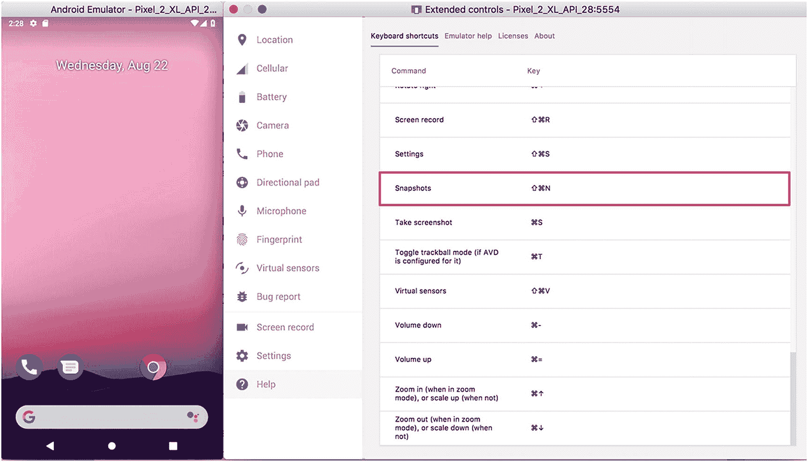

**图 9-1** 模拟器扩展控件

当快照视图出现时，你将设备置于所需状态，然后点击“拍摄快照”按钮。将拍摄一个新的快照，并为其自动生成一个名称，该快照会显示在快照列表中。请参见图 9-2。

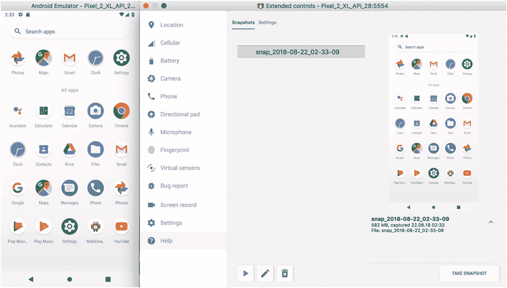

**图 9-2** 拍摄模拟器快照

**注意：** 在模拟器“扩展控件”窗口中重命名快照并不会全局重命名它，而只是创建别名。实际的快照名称将保持不变。

同样的事情也可以通过使用 `telnet` 控制台命令与 Android 模拟器通信来实现（有关模拟器 `telnet` 命令的更多信息，请访问 [`developer.android.com/studio/run/emulator-console`](https://developer.android.com/studio/run/emulator-console)）。在以下代码示例中，你将看到如何与正在运行的模拟器建立 telnet 会话、列出现有快照、拍摄快照以及在模拟器运行时加载它。


### 保存和加载模拟器快照的示例脚本

```
telnet localhost 5554
avd snapshot list
avd snapshot save snap_de
emulator -avd Pixel2_API_28 -snapshot snap_de
```

由于本书的主要主题是测试自动化，以下 Python 脚本会创建到本地主机端口 5554（这是创建 Android 模拟器时占用的第一个端口）的 telnet 连接，并加载之前保存的快照。

### 建立模拟器 Telnet 连接并加载模拟器快照的 Python 脚本

```
import telnetlib
HOST = "localhost"
PORT = "5554"
tn = telnetlib.Telnet(HOST, PORT)
tn.write(b"avd snapshot load name\n")
tn.write(b"exit\n")
```

或者，你也可以使用 `expect` 脚本工具来实现同样的功能（仅适用于 MacOS 和 UNIX 用户）。

### 建立模拟器 Telnet 连接并加载模拟器快照的 Expect 工具脚本

```
#!/usr/bin/expect
set timeout 15
spawn telnet localhost 5554
expect "OK"
send "avd snapshot load snap_de\r"
expect "OK"
send "exit\r"
```

要在你的电脑上安装 `expect` 工具，请使用以下命令：
* Mac：`brew install expect`
* UNIX/Linux：`yum install expect`

总的来说，当前这种快照方法不仅适用于设置模拟器语言，还使我们能够针对许多不同的用例创建不同的快照，你可以自己想出这些用例。

## 练习 21

**使用模拟器快照功能**

1.  启动一个模拟器，并借助模拟器的扩展控制窗口保存几个模拟器快照。手动加载这些快照。
2.  使用控制台命令启动一个模拟器。将 telnet 会话连接到该模拟器，并保存几个模拟器快照。从控制台加载这些快照。
3.  创建一个包含模拟器 telnet 命令的 Python 脚本并运行它。观察结果。
4.  在你的电脑上安装 `expect` 工具，然后创建并执行包含 `expect telnet` 命令的脚本。观察结果。

## 处理运行时权限

Android 测试自动化中另一个与系统弹窗相关的热门话题是运行时权限。当 Android 应用需要访问其沙箱之外的资源或信息时，应向系统请求相应的权限。应用在 `AndroidManifest.xml` 文件中声明权限，然后在运行时（Android 6.0 及以上版本）请求用户批准每个权限。

当用户触发需要额外权限的代码片段时，系统显示的提示描述的是你的应用需要访问的权限组，而不是具体的权限。

为了展示此功能，我们的示例应用在向待办事项添加图片时会请求权限。你可以尝试一下。

### 使用 GrantPermissionRule 启用权限

现在让我们看一下 `RuntimePermissionTest.kt` 类，它包含了 `GrantPermissionRule` 的示例。`GrantPermissionRule` 规则用于在 Android M（API 23）及以上版本授予运行时权限。当测试需要运行时权限才能执行其工作时，会使用此规则。当应用于测试类时，此规则会尝试授予所有请求的运行时权限。被请求的权限将在设备上被授予并立即生效。

在示例的待办应用（TO-DO）中点击相机图标，会触发向用户显示相机权限提示。该提示属于一个名为 `com.andriod.packageinstaller` 的不同应用包，Espresso 无法与之交互。因此，为了减少外部依赖并保持 Espresso 测试的封闭性，可以使用 `GrantPermissionRule` 在测试开始时即授予权限。

#### chapter9. RuntimePermissionsTest.kt

```
@RunWith(AndroidJUnit4::class)
class RuntimePermissionsTest {
/**
* Manifest.permission.CAMERA 权限将在测试运行前被授予。
*/
@get:Rule
var mRuntimePermissionRule = GrantPermissionRule
.grant(Manifest.permission.CAMERA)
/**
* 提供的 activity 将在每个测试前启动。
*/
@get:Rule
var activityTestRule = ActivityTestRule(TasksActivity::class.java)
@Test
fun takesCameraPicture() {
val toDoTitle = TestData.getToDoTitle()
val toDoDescription = TestData.getToDoDescription()
// 添加新的 TO-DO。
onView(withId(R.id.fab_add_task)).perform(click())
onView(withId(R.id.add_task_title))
.perform(typeText(toDoTitle), closeSoftKeyboard())
onView(withId(R.id.add_task_description))
.perform(typeText(toDoDescription), closeSoftKeyboard())
// 点击相机按钮以触发权限对话框。
onView(withId(R.id.makePhoto)).perform(click())
onView(withId(R.id.picture)).perform(click())
waitForElement(onView(withId(R.id.fab_edit_task_done))).perform(click())
// 验证带有标题的新 TO-DO 显示在 TO-DO 列表中。
onView(withText(toDoTitle)).check(matches(isDisplayed()))
}
}
```

当前这种方法效果不错，但有其优缺点。积极的方面是：
* UI 测试保持封闭，不需要与其他系统服务交互。
* 测试类中的每个测试用例都会被授予权限。

然而，也存在一些不足之处：
* 无法测试不同的运行时权限使用场景，例如在被拒绝后获取权限，或者尝试在未授予权限的情况下使用功能。
* 权限一旦授予，就无法撤销。尝试撤销将导致插桩进程崩溃。

总的来说，使用 `GrantPermissionRule` 是一种很好的方式，可以授予运行时权限，并避免权限对话框出现从而阻塞应用 UI。另一方面，正如所述，这限制了我们在覆盖多种运行时权限请求场景方面的能力，而这些场景也是有待测试的应用程序的一部分。

### 使用 UI Automator 处理运行时权限

另一种处理运行时权限的方法是将 UI Automator 测试框架的功能与 Espresso 结合使用。由于它允许我们与任何应用交互，因此我们也能够对权限对话框执行 UI 操作。

首先，让我们考虑可能的用例。总共有至少三种涉及运行时权限对话框的用例：
* 用户首次看到权限对话框时，授予了相机权限。
* 用户首次出现时拒绝了相机权限，但随后意识到需要此功能，并在权限对话框再次出现时启用了它。
* 权限被拒绝了两次。第二次拒绝时勾选了“不再询问”复选框。用户再次尝试使用相机功能，但现在只能从应用权限设置中手动启用。

需要说明的是，所有四种用例背后都有对应的应用代码逻辑，如果使用 `GrantPermissionRule`，这些逻辑将无法被自动化测试覆盖，而需要手动测试。

其次，仅使用 `AndroidJUnitRunner` 进行权限测试可能会遇到一个问题。关键在于，每个测试都需要一个没有授予权限的干净应用状态。因此，应该使用第 1 章中描述的 Android Test Orchestrator 选项，并配合使用 `testInstrumentationRunnerArguments clearPackageData: 'true'` 参数（更多详情请参见 `app/build.gradle` 文件）。这确保了每个测试都在自己独立的调用中运行，包括清理后的应用权限状态。

第三，我们必须使用 Monitor 工具检查将要导航到的所有区域，进行 UI dump 并收集在已定义用例中使用的元素标识符。


图 9-3 展示了创建附带图片的待办事项时弹出的“授予相机权限”对话框。

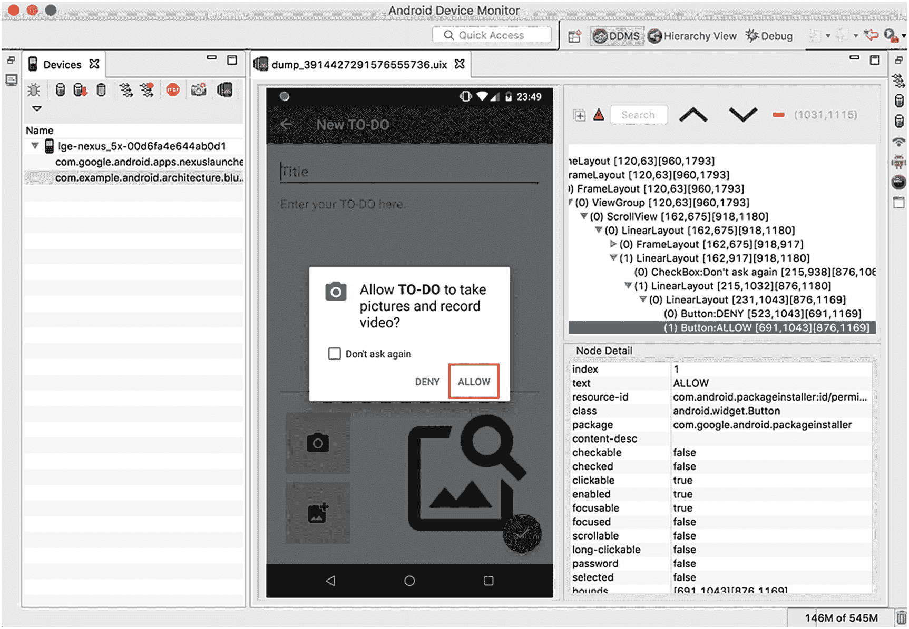
*图 9-3* 导出带有相机权限对话框的待办事项应用 UI

图 9-4 演示了在系统设置应用中检查待办事项应用设置页面的过程。

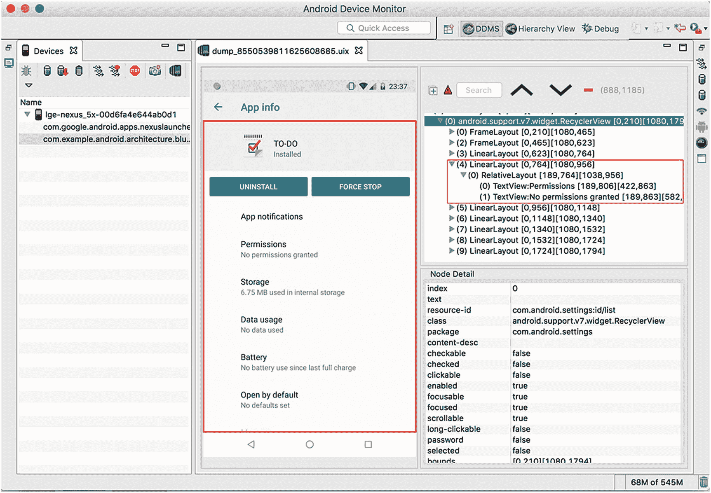
*图 9-4* 在设置页面上导出的待办事项应用 UI

图 9-5 展示了在系统设置应用内部检查待办事项应用权限设置页面的过程。

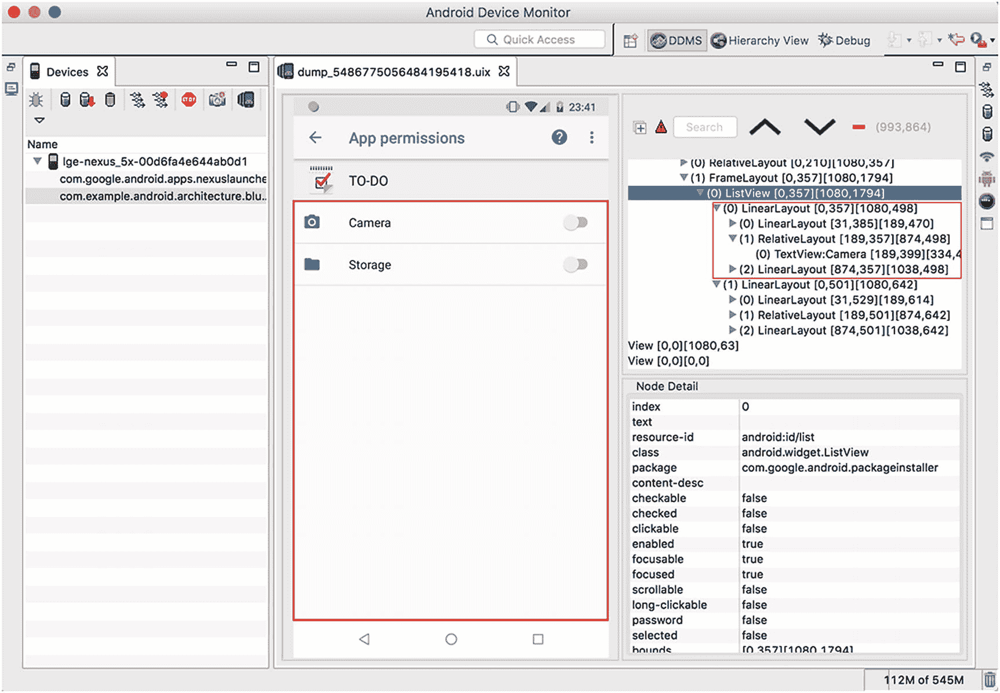
*图 9-5* 在设置应用权限页面中导出的待办事项应用 UI

以下是需要收集的 UI 元素列表，测试将基于这些元素进行操作（参考设备 Nexus 5X，操作系统 Android 8.1.0）：

* 允许按钮 — `com.android.packageinstaller:id/permission_allow_button`
* 拒绝按钮 — `com.android.packageinstaller:id/permission_deny_button`
* 不再询问复选框 — `com.android.packageinstaller:id/do_not_ask_checkbox`
* 权限列表项 — 循环视图 `com.android.settings:id/list` 中的第四项
* 相机权限列表项 — 列表视图 `android:id/list` 中的第零个元素

最后是我们的测试。请查看 `RuntimePermissionsUiAutomatorTest.kt`。为方便起见，我们声明了一些可复用的实例：

```
private val instrumentation = InstrumentationRegistry.getInstrumentation()
private val uiDevice: UiDevice = UiDevice.getInstance(instrumentation)
private val todoAppPackageName = InstrumentationRegistry.getTargetContext().packageName
private val testContext = InstrumentationRegistry.getContext()
```

第一个用例由 `takesCameraPicture()` 测试用例代表，用户仅点击一次权限对话框。

*测试方法* `chapter9.RuntimePermissionsUiAutomatorTest.takesCameraPicture()`。

```
@Test
fun takesCameraPicture() {
val toDoTitle = TestData.getToDoTitle()
// 添加新的待办事项。
onView(withId(R.id.fab_add_task)).perform(click())
onView(withId(R.id.add_task_title))
.perform(typeText(toDoTitle), closeSoftKeyboard())
// 点击相机按钮以触发权限对话框。
onView(withId(R.id.makePhoto)).perform(click())
// UI Automator - 点击权限对话框的“允许”按钮。
uiDevice.findObject(By.res("com.android.packageinstaller:id/permission_allow_button")).click()
onView(withId(R.id.picture)).perform(click())
waitForElement(onView(withId(R.id.fab_edit_task_done))).perform(click())
// 验证带有关键字的待办事项出现在待办事项列表中。
onView(withText(toDoTitle)).check(matches(isDisplayed()))
}
```

第二个用例由 `deniesAndGrantsPermission()` 测试覆盖。

*测试方法* `chapter9.RuntimePermissionsUiAutomatorTest.deniesAndGrantsPermission()`。

```
@Test
fun deniesAndGrantsPermission() {
val toDoTitle = TestData.getToDoTitle()
onView(withId(R.id.fab_add_task)).perform(click())
onView(withId(R.id.add_task_title))
.perform(typeText(toDoTitle), closeSoftKeyboard())
onView(withId(R.id.makePhoto)).perform(click())
// UI Automator - 点击权限对话框的“拒绝”按钮。
uiDevice.findObject(By.res("com.android.packageinstaller:id/permission_deny_button")).click()
onView(withId(R.id.makePhoto)).perform(click())
onView(withId(R.id.snackbar_action)).perform(click())
uiDevice.findObject(By.res("com.android.packageinstaller:id/permission_allow_button")).click()
onView(withId(R.id.picture)).perform(click())
waitForElement(onView(withId(R.id.fab_edit_task_done))).perform(click())
onView(withText(toDoTitle)).check(matches(isDisplayed()))
}
```

在第三个用例中，情况稍微复杂一些，因为我们需要与设置应用进行交互。以下是测试代码。

*测试方法* `chapter9.RuntimePermissionsUiAutomatorTest.deniesAndGrantsPermissionFromSettings()`。

```
@Test
fun deniesAndGrantsPermissionFromSettings() {
val toDoTitle = TestData.getToDoTitle()
onView(withId(R.id.fab_add_task)).perform(click())
onView(withId(R.id.makePhoto)).perform(click())
uiDevice
.findObject(By.res("com.android.packageinstaller:id/permission_deny_button"))
.click()
onView(withId(R.id.makePhoto)).perform(click())
onView(withId(R.id.snackbar_action)).perform(click())
// UI Automator - 点击权限对话框的复选框和“拒绝”按钮
uiDevice
.findObject(By.res("com.android.packageinstaller:id/do_not_ask_checkbox"))
.click()
uiDevice
.findObject(By.res("com.android.packageinstaller:id/permission_deny_button"))
.click()
// 点击相机按钮以触发权限对话框。
onView(withId(R.id.makePhoto)).perform(click())
onView(withId(R.id.snackbar_text))
.check(matches(allOf(isDisplayed(), withText("相机不可用"))))
sendApplicationSettingsIntent()
enableCameraPermission()
launchBackToDoApplication()
onView(withId(R.id.fab_add_task)).perform(click())
onView(withId(R.id.add_task_title))
.perform(typeText(toDoTitle), closeSoftKeyboard())
onView(withId(R.id.makePhoto)).perform(click())
onView(withId(R.id.picture)).perform(click())
waitForElement(onView(withId(R.id.fab_edit_task_done))).perform(click())
onView(withText(toDoTitle)).check(matches(isDisplayed()))
}
```

其中，`sendApplicationSettingsIntent()` 负责创建并发送一个 Intent 以显示待办事项应用的设置页面。

*发送 Intent 以打开待办事项应用设置* `chapter9.RuntimePermissionsUiAutomatorTest.sendApplicationSettingsIntent()`。

```
private fun sendApplicationSettingsIntent() {
// 创建 Intent 以打开待办事项应用的设置。
val intent = Intent()
intent.action = Settings.ACTION_APPLICATION_DETAILS_SETTINGS
val uri = Uri.fromParts("package", todoAppPackageName, null)
intent.data = uri
intent.addFlags(Intent.FLAG_ACTIVITY_CLEAR_TASK)
testContext.startActivity(intent)
}
```

然后，`enableCameraPermission()` 包含用于打开应用权限设置并点击相机权限项的代码（参见图 9-4 和 9-5）。

*在待办事项应用设置中启用相机权限* `chapter9.RuntimePermissionsUiAutomatorTest.enableCameraPermission()`。

```
private fun enableCameraPermission() {
// 等待应用设置界面出现
uiDevice.wait(Until.hasObject(By.pkg("com.android.settings")), 5000)
// 点击“权限”项。
uiDevice.findObject(By.res("com.android.settings:id/list"))
.children[3].clickAndWait(Until.newWindow(), 2000)
// 点击“相机”项并等待切换状态为选中。
uiDevice.findObject(By.res("android:id/list"))
.children[0].click()
uiDevice.findObject(By.res("android:id/list"))
.children[0].wait(Until.checked(true), 1000)
}
```

最后，`launchBackToDoApplication()` 发送一个 Intent 以启动示例应用。

*发送 Intent 以打开待办事项应用* `chapter9.RuntimePermissionsUiAutomatorTest.launchBackToDoApplication()`。

```
private fun launchBackToDoApplication() {
// 创建 Intent 以打开待办事项应用。
val intent = testContext.packageManager.getLaunchIntentForPackage(todoAppPackageName)
InstrumentationRegistry.getContext().startActivity(intent)
}
```

运行 `RuntimePermissionsUiAutomatorTest` 中的测试后，我们在图 9-6 中可以看到运行时间表现良好——三个与第三方应用交互的测试仅用时 36 秒。

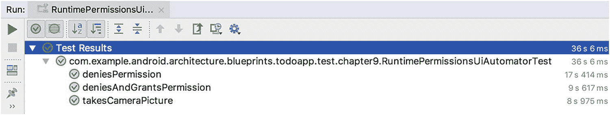
*图 9-6* `RuntimePermissionsUiAutomatorTest.kt` 测试运行时间

## 练习 22：使用运行时权限


#### 1. 删除 `GrantPermissionRule`

从 `RuntimePermissionsTest.kt` 中删除 `GrantPermissionRule` 并运行测试。观察结果。恢复 `GrantPermissionRule` 的删除并再次运行测试。观察结果。

#### 2. 运行 `RuntimePermissionsUiAutomatorTest.kt` 类中实现的所有测试

从应用程序 `build.gradle` 文件中移除所有 Android Test Orchestrator 依赖项，并再次运行测试。观察结果。恢复到原始文件。

#### 3. 编写一个测试

编写一个测试，打开 TO-DO 应用程序设置并启用相机权限。然后打开 TO-DO 应用程序并继续创建任务。

## 总结

本章展示了如何在运行时更改 Android 模拟器系统语言，并描述了在 UI 测试中处理运行时权限的不同方法。应该清楚的是，多语言支持是现代 Android 应用程序的必备功能。这需要彻底的测试，并且使测试环境能够轻松切换模拟器系统语言是此测试基础设施的重要组成部分。

拥有一种简单可靠的方式来设置运行时权限，对最终用户来说是一个至关重要且敏感的话题。它影响用户满意度，应该进行彻底测试。应用程序应正确处理不同的权限流程，且不能出错。当然，选择哪种测试方法最适合您的具体情况，完全取决于您——使用 `GrantPermissionRule` 或使用 UI Automator 框架完全自动化权限授予。凭借本章的知识，您可以轻松做到这一点。

# 10. Android 测试自动化工具

本章包含有关 Android 平台提供的用于测试自动化的工具的信息。我们将讨论为测试自动化设置虚拟或物理设备的相关主题，了解 Espresso Test Recorder 如何帮助我们编写自动化测试，并学习如何在 Firebase Test Lab 中运行自动化测试。

## 为测试自动化设置虚拟或物理设备

正确配置的虚拟或物理设备是获得可靠测试的必备条件。以下是可能影响测试执行并导致测试不稳定的设备属性列表：

*   系统动画
*   触摸和长按延迟
*   虚拟键盘显示

### 系统动画

不幸的是，Espresso 无法处理系统动画，这可能导致不稳定的测试。这是 Espresso 的主要限制之一。另一方面，动画应该手动测试，在自动化测试中禁用它们对我们没有坏处。Android 操作系统有三种系统动画类型：

*   **窗口动画缩放** — 设置窗口动画播放速度，以便您可以在不同速度下检查其性能。较低的缩放比例会导致更快的速度。
*   **过渡动画缩放** — 设置过渡动画播放速度，以便您可以在不同速度下检查其性能。较低的缩放比例会导致更快的速度。
*   **动画时长缩放** — 设置动画的持续时间。

这些动画属性可在“设置” ➤ “系统” ➤ “开发者选项”中的“绘图”部分找到，如图 10-1 所示。

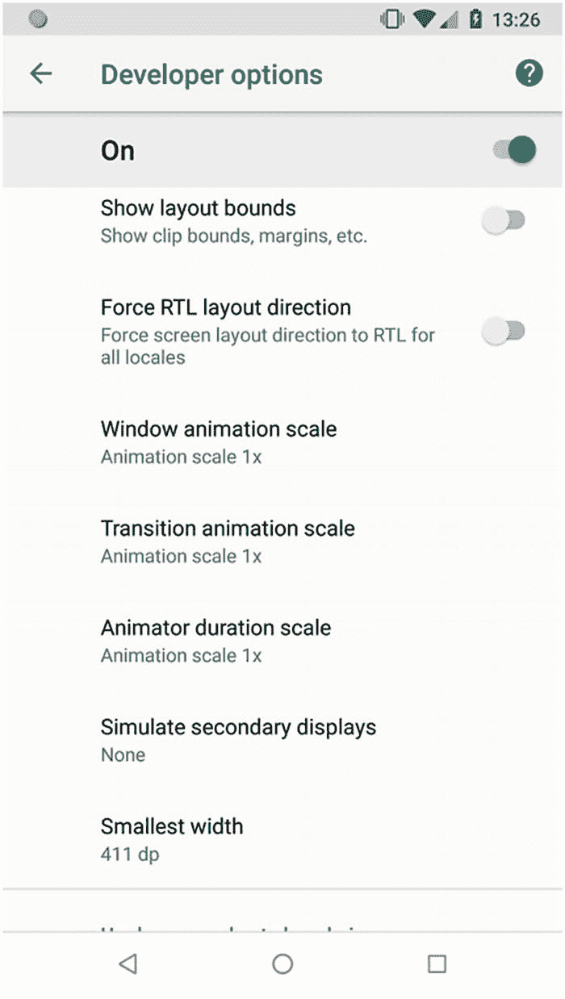

**图 10-1** 设备开发者选项中的系统动画属性

当然，我们希望所有动画都能自动禁用。这可以通过两种方式实现。我们可以在测试运行前或设备启动时执行以下 shell 命令。

*用于设置系统动画属性的 Shell 命令：*

```
adb shell settings put global animator_duration_scale 0.0
adb shell settings put global transition_animation_scale 0.0
adb shell settings put global window_animation_scale 0.0
```

第二种选择是执行相同的命令，但使用 `UiDevice` 实例在测试运行前执行。

*在 @BeforeClass 方法中设置系统动画属性：*

```
companion object {
@BeforeClass
@JvmStatic
fun setDevicePreferencies() {
val uiDevice = UiDevice.getInstance(InstrumentationRegistry.getInstrumentation())
uiDevice.executeShellCommand("settings put global animator_duration_scale 0.0")
uiDevice.executeShellCommand("settings put global transition_animation_scale 0.0")
uiDevice.executeShellCommand("settings put global window_animation_scale 0.0")
}
}
```

在此示例中，我们使用 `@BeforeClass` 注解为整个测试类执行一次。

### 触摸和长按延迟

第二个可能导致不稳定的设备属性是**触摸和长按延迟**。您可以在“系统” ➤ “无障碍”部分找到它，如图 10-2 所示。

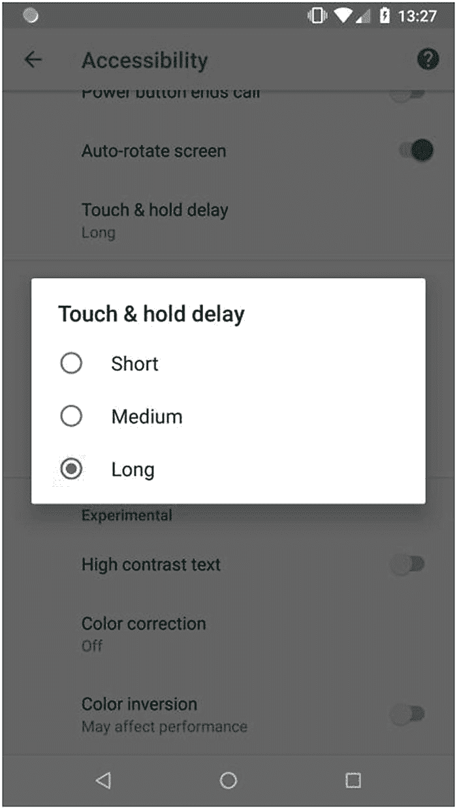

**图 10-2** 触摸和长按延迟无障碍属性

此属性负责设置系统用来区分单击和长按操作的时间。如果单击的触摸时间超过了“触摸和长按延迟”限制，则会被解释为长按。如果您长按工具栏图标以查看其内容描述，就可以看到这一点。在某些真实设备上，当此延迟值较短时，单击可能变为长按，从而导致自动化 UI 测试失败。为了避免这种情况，我们可以修改“触摸和长按延迟”值。
第一种方法是执行以下 shell 命令（延迟值以毫秒为单位）：

```
adb shell settings put secure long_press_timeout 1500
```

第二种方法是从 `@BeforeClass` 方法内部运行，如下所示。

*在 @BeforeClass 方法中设置触摸和长按延迟：*

```
companion object {
@BeforeClass
@JvmStatic
fun setDevicePreferencies() {
val uiDevice = UiDevice.getInstance(InstrumentationRegistry.getInstrumentation())
uiDevice.executeShellCommand("settings put secure long_press_timeout 1500")
}
}
```

顺便说一下，默认的 `Short` 值设置为 500 毫秒，`Medium` 设置为 1000 毫秒，`Long` 设置为 1500 毫秒。

### 虚拟键盘显示

现在让我们讨论最后一个可能导致测试不稳定的设备属性——**虚拟键盘显示**。乍一看，虚拟键盘似乎与测试不稳定性完全无关，但有一点我们必须记住——用于 Android 的 Espresso 仅在测试上下文中在我们的应用程序内运行，并且不允许与任何第三方应用程序交互。

猜猜怎么着？虚拟键盘不属于我们的应用程序。因此，可能会出现移动设备性能变慢，并且 `ViewActions.closeSoftKeyboard()` 方法执行不够快的情况。此时，如果测试需要点击隐藏在虚拟键盘后面的 UI 元素（该键盘本应关闭，但仍处于关闭过程中），它们可能会意外点击到键盘。会抛出以下异常：

```
java.lang.SecurityException: Injecting to another application requires INJECT_EVENTS permission
```

为了避免此问题，我们可以手动禁用虚拟设备上的虚拟键盘显示。不幸的是，除非连接物理键盘，否则在真实设备上没有很好的方法来实现这一点。要禁用虚拟键盘，请导航至“设置” ➤ “系统” ➤ “语言与输入法” ➤ “实体键盘”，并禁用“显示虚拟键盘”选项。或者，同样可以通过 shell 来完成：

```
adb shell settings put secure show_ime_with_hard_keyboard 0
```

您也可以像下面这样从测试内部执行相同的命令。

*在 @BeforeClass 方法中禁用虚拟键盘：*

```
companion object {
@BeforeClass
@JvmStatic
fun setDevicePreferencies() {
val uiDevice = UiDevice.getInstance(InstrumentationRegistry.getInstrumentation())
uiDevice.executeShellCommand("settings put secure show_ime_with_hard_keyboard 0")
}
}
```


结合上述所有命令后，我们得到以下结果。

*`chapter10.devicesetup.*`* *`DeviceSetupTest.kt`*

```
companion object {
    @BeforeClass
    @JvmStatic
    fun setDevicePreferences() {
        val uiDevice = UiDevice.getInstance(InstrumentationRegistry.getInstrumentation())
        uiDevice.executeShellCommand("settings put global animator_duration_scale 0.0")
        uiDevice.executeShellCommand("settings put global transition_animation_scale 0.0")
        uiDevice.executeShellCommand("settings put global window_animation_scale 0.0")
        uiDevice.executeShellCommand("settings put secure long_press_timeout 1500")
        uiDevice.executeShellCommand("settings put secure show_ime_with_hard_keyboard 0")
    }
}
```

无论采用哪种方法将测试设备设置为适合测试的状态，它们都一定会使你的自动化测试更可靠、更不易出现不稳定。

## 练习 23

**配置用于自动化测试的设备**

1.  创建一个 Android 模拟器，并观察辅助功能菜单中系统动画、虚拟键盘和长按延迟的默认值。运行 `chapter10.DeviceSetupTest.kt` 中实现的测试。待测试运行后，观察相同属性的值并比较结果。

2.  设置默认模拟器或设备的系统动画、虚拟键盘和长按延迟状态。从终端手动执行所有 Shell 命令。随后观察上述属性的状态。

3.  创建一个包含本节所有 Shell 命令的 Shell 脚本，该脚本用于在已连接的设备上执行这些命令。

## 使用 Espresso 测试录制器工具

Espresso 的作者很可能受到了 Selenium IDE 测试录制器的启发，并决定将相同的功能也添加到 Espresso 中。Espresso 测试录制器工具允许经验不足的用户以更少的精力创建 Espresso UI 测试。该工具在 Android Studio 2.3 版本中开始可用且稳定。

测试录制器工具已集成到 Android Studio IDE 中，可通过 **Run ➤ Record Espresso Test** 菜单访问，如图 10-3 所示。

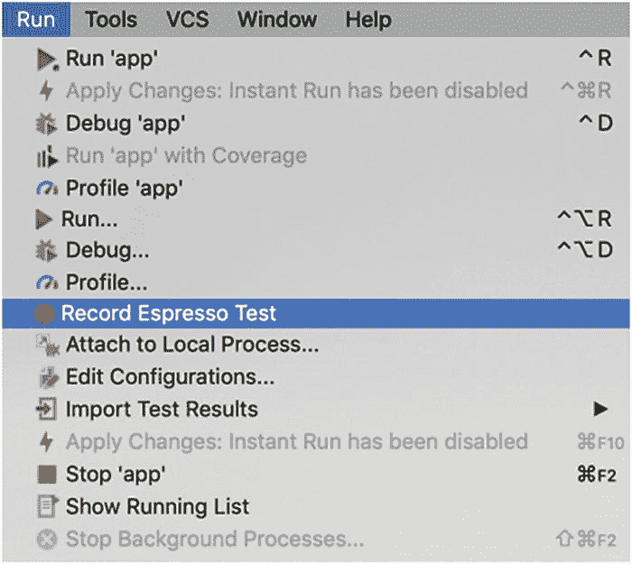

**图 10-3** Android Studio “运行”菜单中的 “Record Espresso Test” 选项

在开始之前，你应该已连接了测试设备或预先创建了虚拟设备。触发录制后，系统会要求你选择目标设备。应用程序构建完成后，将被部署到目标设备并以调试模式运行。见图 10-4。

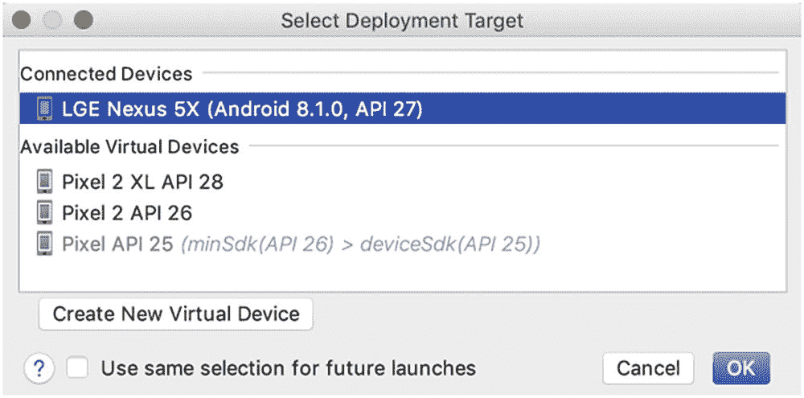

**图 10-4** 目标设备选择对话框

录制过程中，应用程序的交互操作将被跟踪并显示在录制器视图中。图 10-5 演示了在示例应用程序中添加新待办事项流程的过程。

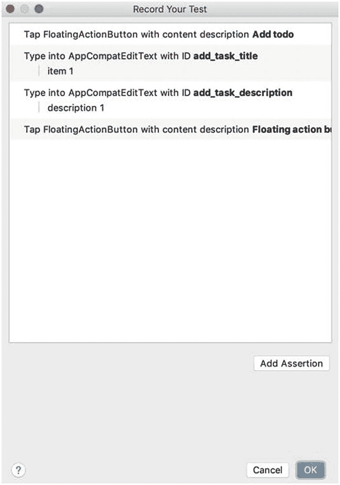

**图 10-5** Espresso 测试录制器窗口

**Add Assertion** 按钮允许你添加以下类型的断言（见图 10-6）：

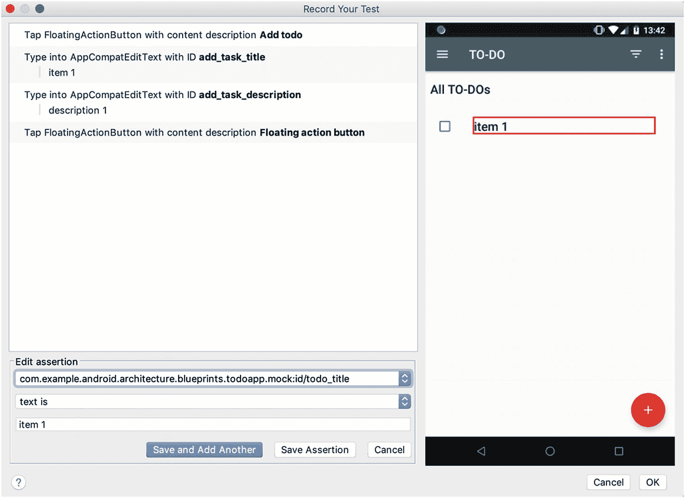

**图 10-6** 向 Espresso 测试录制器添加断言

- **Text is** — 等同于 `check(matches(withText()))`
- **Exists** — 等同于 `check(matches(isDisplayed()))`
- **Does not exist** — 等同于 `check(doesNotExist())`

完成录制并点击 **OK** 按钮后，系统会要求你提供测试类的名称，并选择测试类语言（Java 或 Kotlin）。见图 10-7。

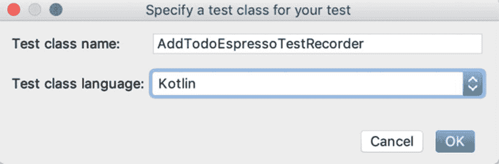

**图 10-7** 将录制的测试保存到测试类文件中

你不能将录制的测试保存到已存在的测试类中。如果尝试这样做，将显示如图 10-8 所示的错误。

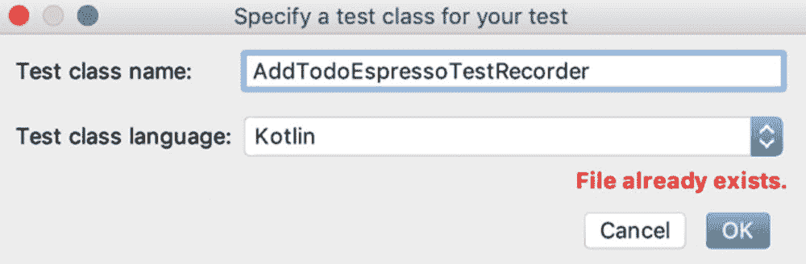

**图 10-8** 尝试将录制的测试保存到现有文件时出错

默认情况下，录制的测试存储在 `tasks` 包内，该包会在应用程序包内自动创建。见图 10-9。

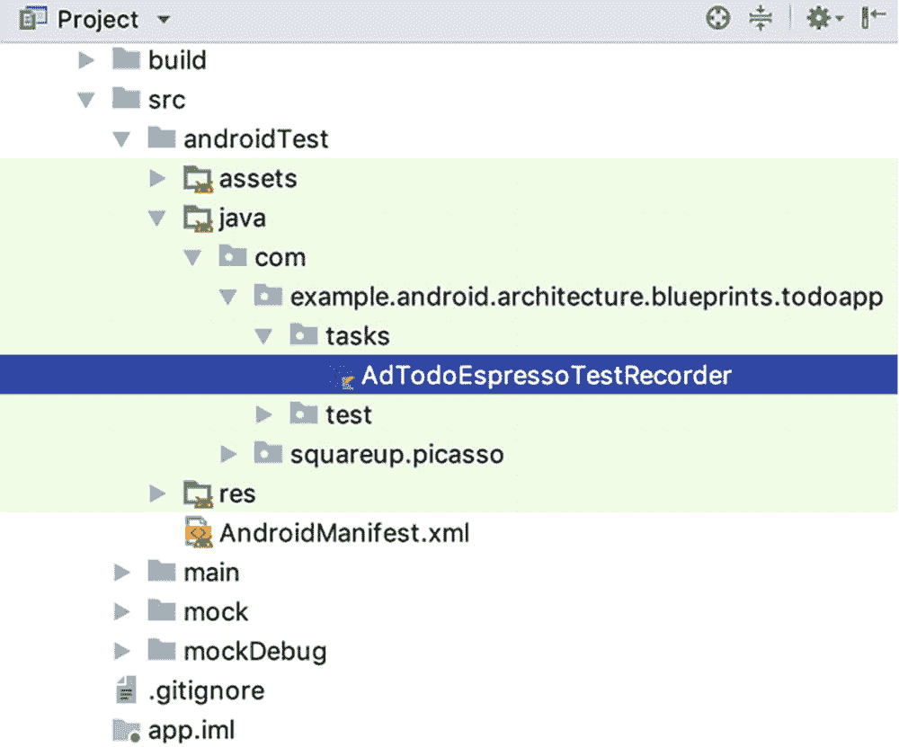

**图 10-9** 录制的测试的保存路径

Espresso 测试录制器可以在 Android Studio 的首选项中进行调整。你可以观察到，使用默认深度值（最大 UI 深度 = 3，ScrollView 检测 = 5，断言深度 = 3）时，测试录制器和应用程序相当慢。如果你将它们降低到 1 或 2，它们的响应会快得多。见图 10-10。

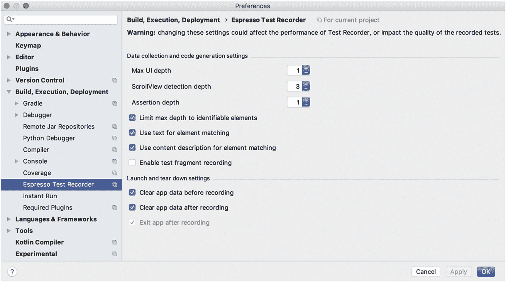

**图 10-10** Espresso 测试录制器首选项

接下来，你可以看到默认深度值下点击 **Add TO-DO** 浮动操作按钮是如何被录制的。

*点击“添加待办事项”按钮，录制器在默认深度值下生成的代码。*

```
val floatingActionButton = onView(
allOf(withId(R.id.fab_add_task), withContentDescription("Add todo"),
childAtPosition(
allOf(withId(R.id.coordinatorLayout),
childAtPosition(
withClassName(`is`("android.widget.LinearLayout")),
1)),
1),
isDisplayed()))
floatingActionButton.perform(click())
```

以下是同一操作在最大 UI 深度设置为 1 时的示例。

*点击“添加待办事项”按钮，录制器在深度值设置为 1 时生成的代码。*

```
val floatingActionButton = onView(
allOf(withId(R.id.fab_add_task), isDisplayed()))
floatingActionButton.perform(click())
```

你可以观察并比较在 `chapter10.testrecorder.AddTodoEspressoTestRecorder.kt` 类中使用默认深度值录制，以及在 `chapter10.testrecorder.AddTodoEspressoTestRecorderLowerDepth.kt` 类中深度值设置为 1 时录制，添加新待办事项测试代码的差异。

熟悉 Espresso 测试录制器后，你会注意到：

- 对于所有 `EditText` 字段，它会添加 `closeSoftKeyboard()` 这个 `ViewAction`。
- 当目标视图是 `ScrollView` 布局的一部分时，会在对其执行其他操作之前添加 `scrollTo()` 这个 `ViewAction`。
- 如果应用程序需要权限，`GrantPermissionRule` 会被添加到测试类中。

总的来说，Espresso 测试录制器可能是开始使用 Espresso 本身的一个好方法，但它也有一些缺点：

- 录制时应用程序速度较慢（深度值越高速度越慢，但降低深度值可能导致测试失败）。
- 生成的代码可能庞大且难以阅读。
- 断言支持有限。
- 自动生成的测试通常需要额外的定制。
- 不支持由网络请求引起的应用程序延迟，因此你需要手动创建并注册一个 `IdlingResource`。
- 不支持 `WebView` 布局。

## 练习 24

**使用 Espresso 测试录制器**

1.  录制一个包含断言的新建和编辑待办事项的测试。将测试类保存为 Kotlin 语言。观察生成的代码。运行录制的测试。

2.  打开 **Android Studio Preferences ➤ Espresso Test Recorder**，将 **Max UI depth** 和 **Assertion Depth** 降低到 1。录制步骤 1 中描述的测试。观察生成的代码并将其与步骤 1 的代码进行比较。运行录制的测试。


3.  录制一个会触发“相机权限”对话框的测试。观察生成的代码，并运行录制好的测试。

## 从 Android Studio 在 Firebase Test Lab 中运行 Espresso 测试

众所周知，Android 平台本质上存在严重的设备碎片化问题。为了应对这一问题，你可能会根据使用统计数据准备多种移动设备，但这考虑到设备维护成本，代价相当高昂。尽管在手动测试中这是必需品，但在测试自动化中，我们更倾向于使用 Android 模拟器、自定义设备实验室或第三方服务。

第三方服务确实曾为移动开发者提供了这种可能性，但它们缺乏标准化且成本高昂。于是，谷歌决定将其自身的设备测试解决方案引入 Android 生态系统，即 Firebase Test Lab。它允许开发者在真实设备或模拟器上运行自动化测试，而无需自行维护这些设备。

让我们来看看如何开始使用 Firebase 及其带来的好处。首先，从 [`https://firebase.google.com/`](https://firebase.google.com/) 进入 Firebase 控制台，并使用你的 Google 账户登录（见图 10-11）。


图 10-11
Firebase 工具栏

你会注意到，这里已经有一些可供试用的示例项目，并且你可以通过点击 `Add Project` 来添加自己的项目。参见图 10-12。

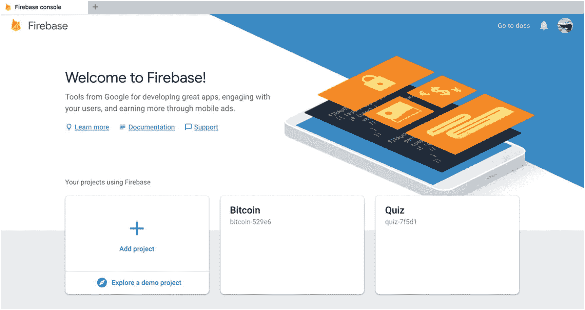

图 10-12
Firebase 欢迎界面

点击 `Add Project` 后，系统会要求你提供项目名称，并选择与服务地点相关的其他参数。一旦提供项目名称，项目将自动获得其项目 ID，这是你 Firebase 项目的唯一标识符。参见图 10-13。

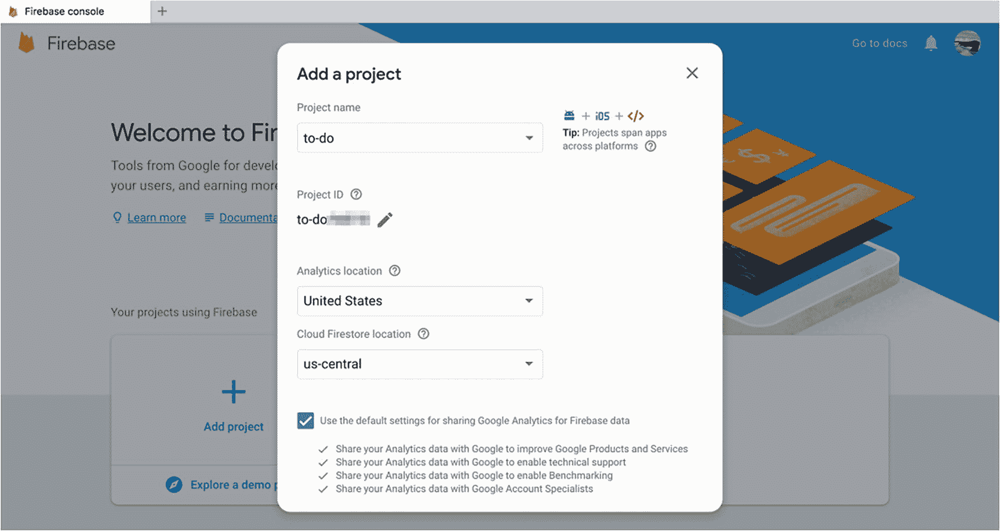

图 10-13
Firebase：添加项目

完成这些操作后，你将进入“项目概览”页面。在此页面中，你可以导航至 Test Lab，如图 10-14 所示。

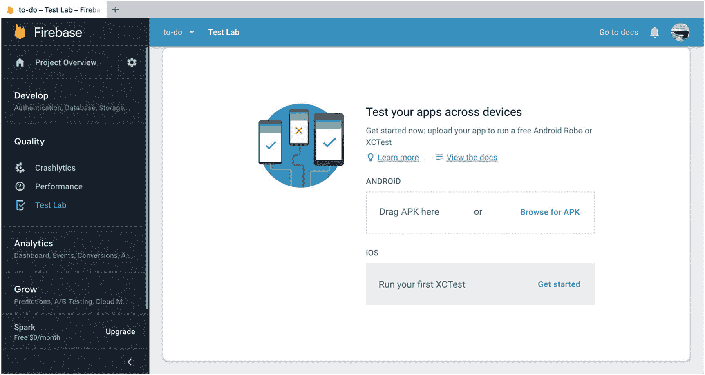

图 10-14
Firebase Test Lab 初始状态

现在一切就绪，可以供我们的自动化测试使用了。由于我们想要通过 Android Studio 运行测试，因此需要在此处设置正确的测试配置。为此，我们打开 `Run` ➤ `Edit Configurations…` 菜单，选择 `Android Instrumentation Tests`，然后点击 `+` 按钮添加一个新的配置，如图 10-15 所示。

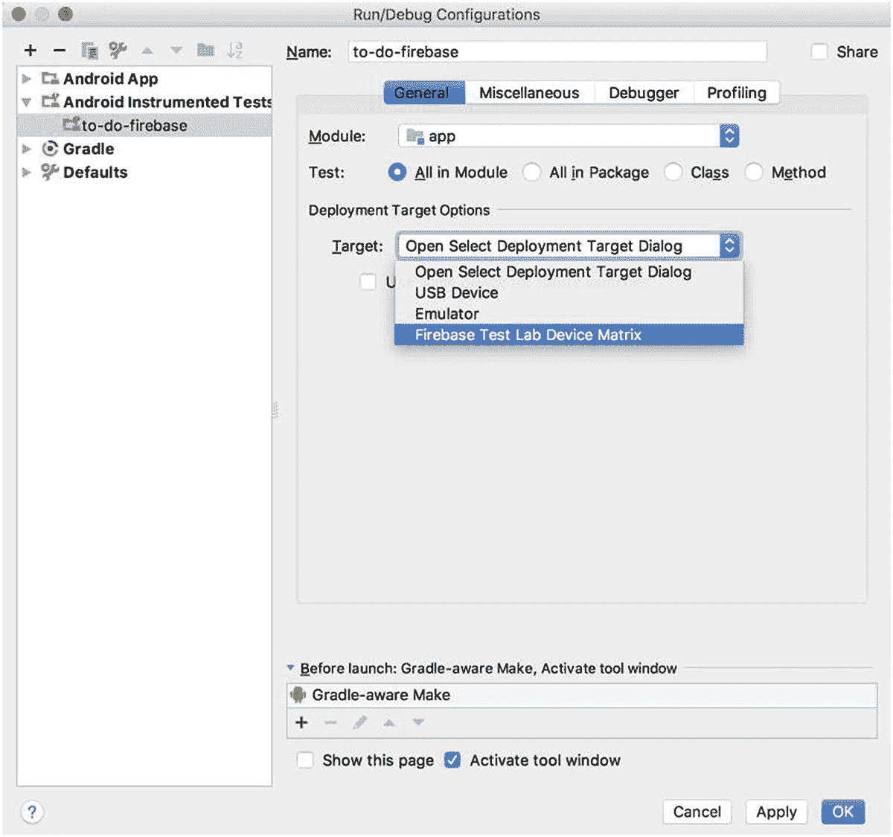

图 10-15
添加 Firebase Test Lab 插桩测试配置

在“部署目标选项”中，我们应该将目标设置为 `Firebase Test Lab Device Matrix` 选项，然后使用相同的 Google 账户登录 Firebase，如图 10-16 所示。

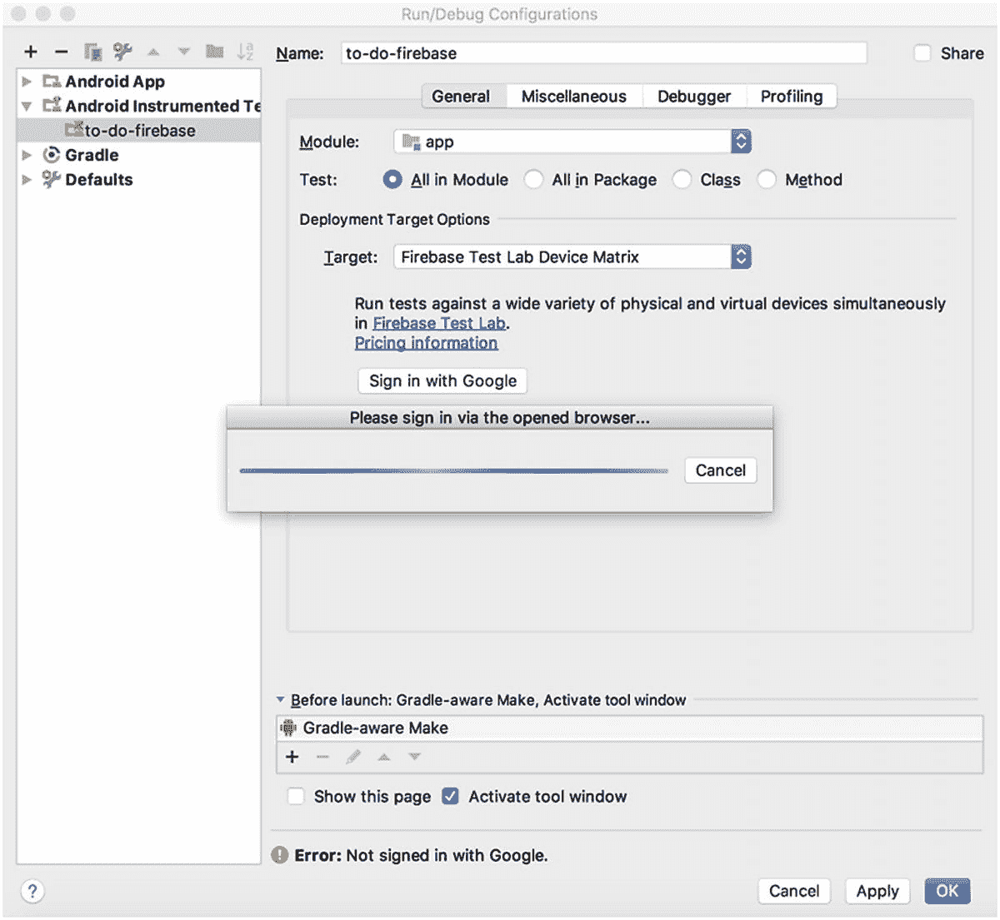

图 10-16
登录 Firebase Test Lab

之后，你可以选择你的项目并配置设备矩阵，如图 10-17 所示。

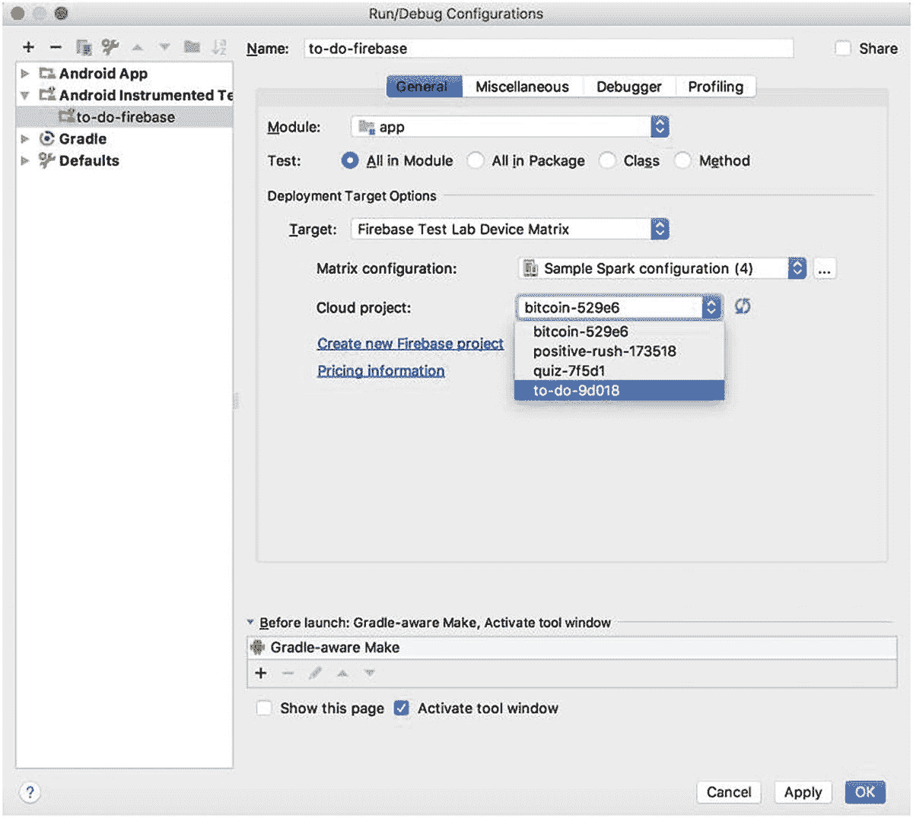

图 10-17
选择 Firebase Test Lab 项目


图 10-18 展示了设备矩阵对话框的样式。

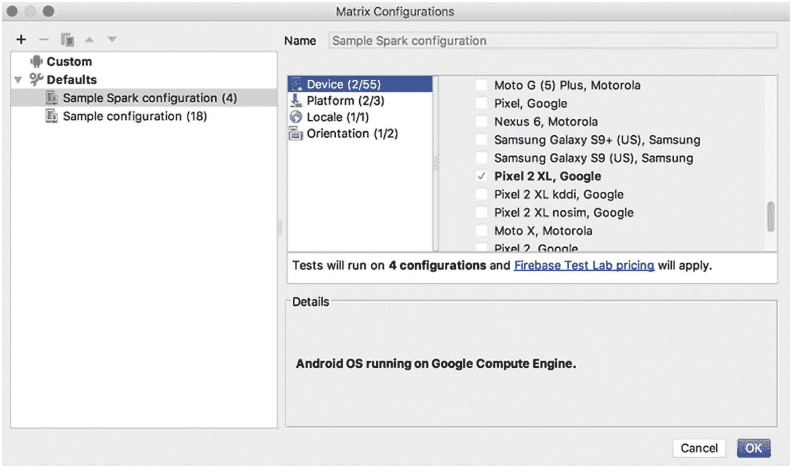

**图 10-18** 选择 Firebase Test Lab 设备矩阵

值得一提的是，对于我们的示例项目，我们使用了 Spark 定价方案，该方案免费但有一定的限制。该方案允许每天在虚拟设备上运行 10 次测试，在真实设备上运行 5 次测试。

一切准备就绪后，我们可以选择并使用 Firebase 测试配置来运行测试，如图 10-19 所示。

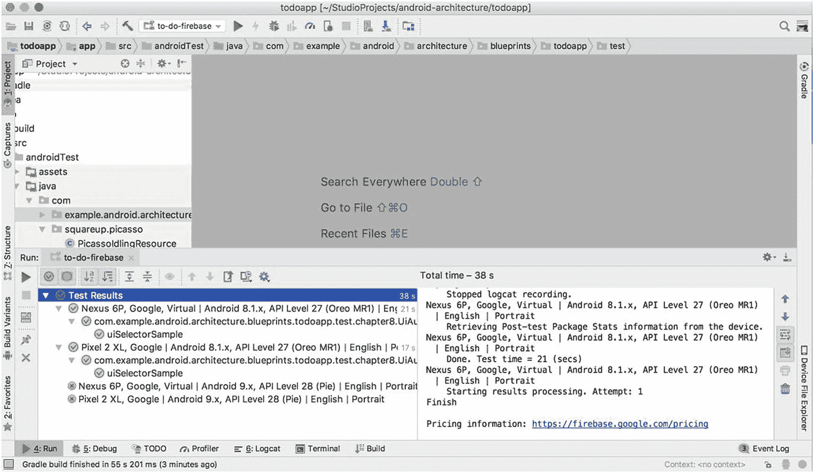

**图 10-19** 在 Android Studio 内的 Firebase Test Lab 中运行测试

当测试执行完毕后，我们可以返回到 Firebase Test Lab 控制台，观察最近一次运行的测试结果，如图 10-20 所示。

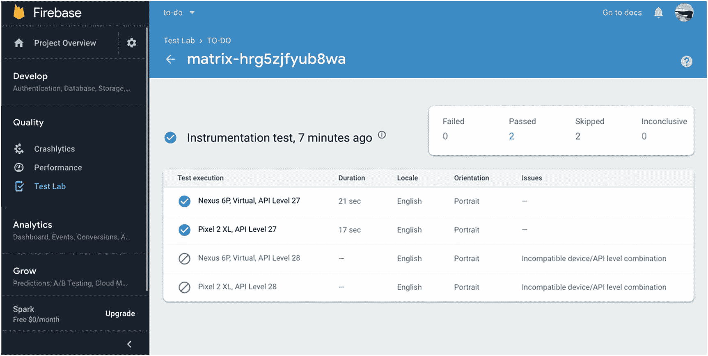

**图 10-20** Firebase Test Lab 控制台中的测试结果概览

点击具体的测试执行记录后，您将进入详细的测试运行描述页面，并可以预览测试运行期间的设备日志、录制视频以及设备性能（参见图 10-21）。

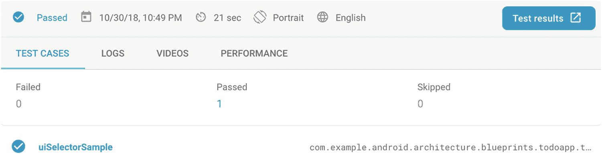

**图 10-21** Firebase Test Lab 控制台中的详细测试用例概览

## 练习 25

**在 Firebase Test Lab 中运行 Espresso 和 UI Automator 测试**

1. 配置您的 Firebase 账户，打开 Firebase 控制台，并设置好项目。
2. 在 Android Studio IDE 中，添加一个新的 Android Instrumentation 测试配置，并将其连接到步骤 1 中创建的项目。
3. 运行测试，并在本地以及 Firebase Test Lab 控制台内观察结果。

# Android UI 测试中的屏幕对象设计模式

移动端 UI 测试中的屏幕对象设计模式等同于 Web 测试中广为人知的面板对象设计模式，它是一种表示界面的抽象层，允许其用户操作页面元素或验证页面状态。由于面板对象（Page Object）的名称来源于网页，因此将移动应用程序中呈现给用户的视图或屏幕（Screen）称为面板（Page）并不合适。本章演示如何使用 Kotlin 将屏幕对象设计模式应用于 Android UI 测试。您将学习创建一个代表单个 Android 应用程序 Activity 或 Fragment（即一个屏幕）的屏幕对象，然后在代表真实用户流程的测试中使用这些对象或其方法。

## 屏幕对象设计模式在 Android 测试项目中的优缺点

当定义一个屏幕对象时，它包含一组用于测试的方法，这些方法代表了屏幕功能或特定屏幕状态的验证。从测试执行的角度来看，这消除了编写逐步测试指令的需求，转而直接调用这些方法。

### 优点

让我们看看这种方法的好处：

-   逻辑测试步骤分离
-   更易读的测试
-   易于构建的用户流程
-   易于维护的测试
-   代码复用

#### 逻辑测试步骤分离

一个测试步骤指的是功能性的用户操作，有时可能包含与被测应用的多次测试交互。例如，向示例待办事项应用添加新待办事项包含三个操作：输入标题、输入描述以及点击“完成”按钮。

#### 更易读的测试

基于这些逻辑步骤，在定义了所有屏幕之后，我们将得到一组具有易于理解名称的步骤。因此，即使是经验不足的测试工程师也能轻松理解测试流程的逻辑。

#### 易于构建的用户流程

这里的用户流程是指一组链式测试方法，它们可以代表一个屏幕，或从一个屏幕导航到另一个屏幕，从而模拟最终用户的行为。这对于了解最终用户流程的测试覆盖率非常有用。

#### 易于维护的测试

由于所有屏幕元素的声明都位于同一个类中，当应用进行重构时，这可以减少维护工作量。设想一个场景：登录按钮通过其 ID 进行标识。该按钮在多个测试中被使用，并通过 Espresso 的 `onView(withId(R.id.loginButton)).perform(click())` 代码进行点击。如果该按钮的 ID 发生变化，就需要更新所有使用它的代码行。但如果有一个 `LoginScreen` 类，它包含登录按钮的声明并实现了登录方法，那么更改只需在一个地方进行——`LoginScreen` 类。

#### 代码复用

这一点与上一点非常相似，因为视图元素被封装在屏幕或其方法中，并且通常不能被其他屏幕访问。这意味着通过调用包含屏幕元素的屏幕方法，这些元素可以在多个测试流程中被复用。

### 缺点

以下是使用屏幕对象设计模式的一些缺点：

-   没有明确的方法来处理跨不同屏幕使用的视图
-   相同的操作可能根据导航堆栈打开不同的屏幕
-   过于细致的屏幕方法会导致测试变得冗长

#### 处理跨屏幕的视图

如前所述，没有明确的方法来处理跨不同屏幕使用的视图或视图组。Android 移动应用在多个屏幕间拥有共享和可复用的组件，这影响并挑战了这种测试设计模式。这里我们指的是诸如菜单抽屉或标签栏之类的视图。图 11-1 显示了待办事项应用的两个截图。

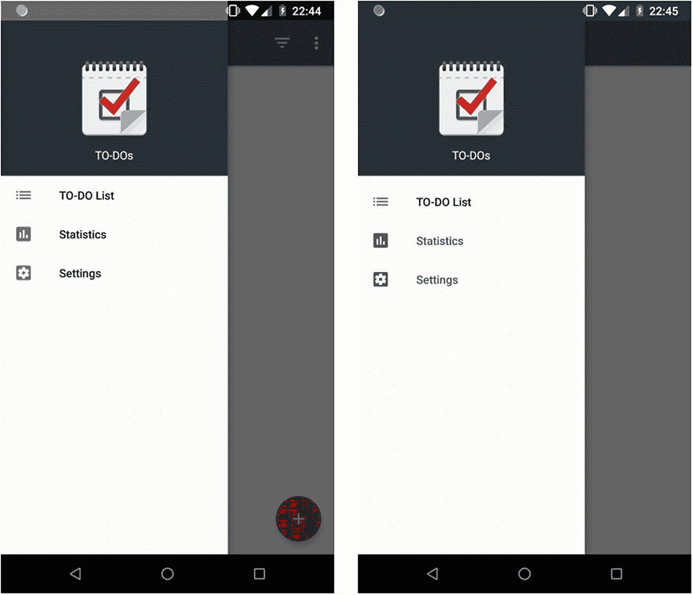

**图 11-1** 从待办事项列表屏幕（左侧）和统计屏幕（右侧）打开的菜单抽屉

两者都拥有相同的菜单抽屉组件。那么这个菜单抽屉组件应该在哪里声明呢？它是否应该属于每个屏幕，从而导致测试源码重复？我们稍后会看到如何处理这种情况。

#### 相同操作打开不同屏幕

请记住，相同的操作可能会根据导航堆栈打开不同的屏幕。在 Android 应用中，根据 Activity 导航堆栈或应用逻辑，屏幕上的相同操作可能会因为当前应用状态之前的导航流程而产生不同的最终结果。此类情况的一个很好例子是待办事项应用中，从“设置”部分点击“返回”或“向上”按钮的导航。让我们尝试两个流程：

1.  从待办事项列表屏幕打开“设置”部分。在“设置”屏幕中，点击“向上”按钮。
2.  从统计屏幕打开“设置”部分。在“设置”屏幕中，点击“向上”按钮。

如图 11-2 和 11-3 所示，两种情况下都使用了“向上”按钮，但最终结果不同。在第一种情况下，我们导航回待办事项列表屏幕。在第二种情况下，我们导航回统计屏幕。

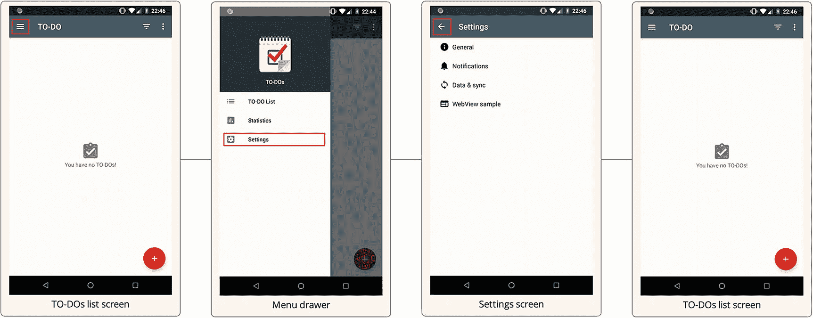

**图 11-2** 从待办事项列表屏幕打开“设置”并点击“向上”

我们如何处理这种情况？本章稍后将介绍一个可能的解决方案。

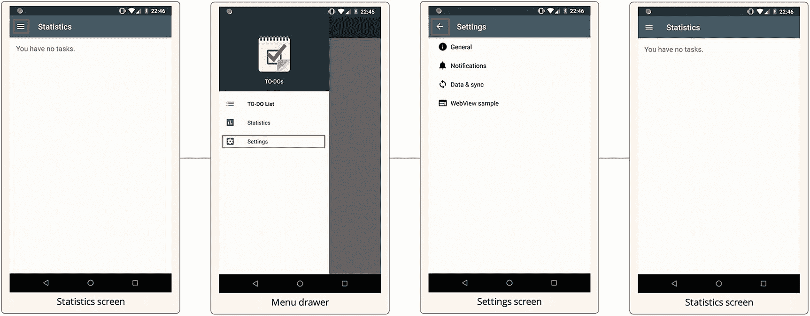

**图 11-3** 从统计屏幕打开“设置”并点击“向上”


#### 过于细化的屏幕方法会导致冗长的测试

有时测试工程师在创建屏幕类及其方法时容易过于细致。他们试图将几乎每个单一操作或验证都封装成一个方法，这大大增加了每个测试内部的步骤数量。我们应该始终寻找一个黄金平衡点——既要合理拆分逻辑，又不能把屏幕方法拆解得过于琐碎详细；同时也不能将大量屏幕操作或验证塞进少数几个方法中。

## 应用屏幕对象设计模式

现在该看个实例了。首先，我们将展示单个待办事项应用屏幕的实现方式，包括其视觉呈现。图 11-4 将"新建待办事项"屏幕分解为功能模块。

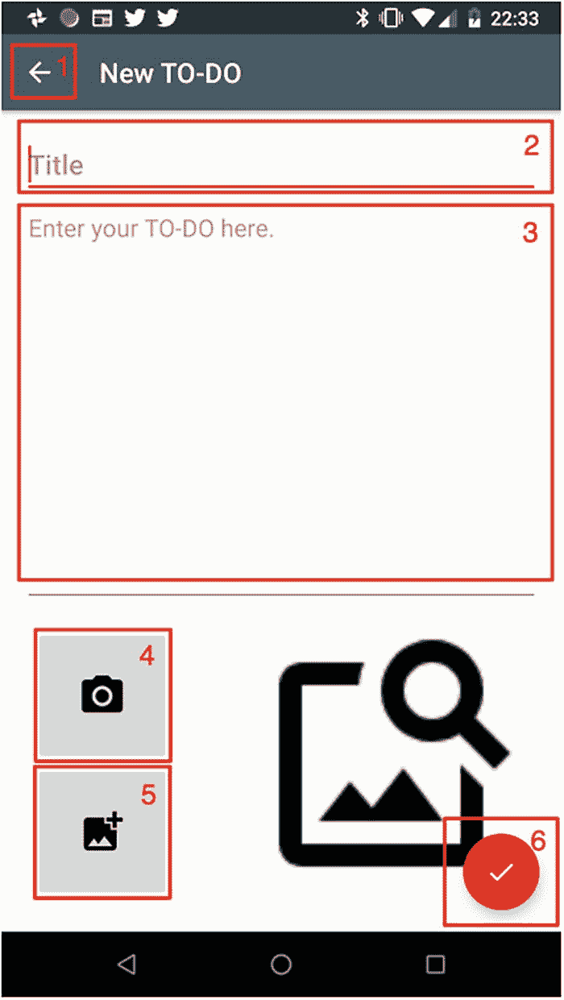

**图 11-4** 分解为功能屏幕对象元素的"新建待办事项"屏幕

如图 11-4 所示，"新建待办事项"屏幕包含六个功能或可操作元素。每个元素对应`AddEditToDoScreen`中的一个方法。例如，`typeToDoTitle`方法将如下所示：

```kotlin
class AddEditToDoScreen {
    private val addToDoTitleEditText = onView(withId(R.id.add_task_title))
    fun typeToDoTitle(title: String): AddEditToDoScreen {
        addToDoTitleEditText.perform(typeText(title), closeSoftKeyboard())
        return this
    }
}
```

对第二、三个元素执行操作时，用户将停留在同一屏幕上；因此这些方法会返回相同的`AddEditToDoScreen`实例。

其他元素的方法也以类似方式创建。剩余的元素会将用户重定向到不同的应用屏幕。这是一个点击"完成"浮动操作按钮并返回`ToDoListScreen`实例的方法示例：

```kotlin
class AddEditToDoScreen {
    private val doneFabButton = onView(withId(R.id.fab_edit_task_done))
    fun clickDoneFabButton(): ToDoListScreen {
        doneFabButton.perform(click())
        return ToDoListScreen()
    }
}
```

这里，`clickDoneFabButton()`方法根据应用流程返回`ToDoListScreen`实例。我们还应该包含验证方法，用于验证屏幕的特定状态以及系统返回操作。

还有一点——单个屏幕操作对于测试步骤而言可能过于细致，从逻辑上应当归为一组屏幕操作。一个很好的例子是添加新待办事项的流程，它包含三个操作：输入标题、输入描述、点击浮动操作按钮。让我们看看最终的`ToDoListScreen`实现状态。

`chapter11.screens.AddEditToDoScreen.kt`

```kotlin
class AddEditToDoScreen : BaseScreen() {
    private val addToDoDescriptionEditText = onView(withId(R.id.add_task_description))
    private val addToDoTitleEditText = onView(withId(R.id.add_task_title))
    private val doneFabButton = onView(withId(R.id.fab_edit_task_done))
    private val emptyToDoSnackbar = onView(withText(R.string.empty_task_message))
    private val upButton = onView(allOf(
        instanceOf(ImageButton::class.java),
        withParent(withId(R.id.toolbar))))

    fun typeToDoTitle(title: String): AddEditToDoScreen {
        addToDoTitleEditText.perform(typeText(title), closeSoftKeyboard())
        return this
    }

    fun typeToDoDescription(description: String): AddEditToDoScreen {
        addToDoDescriptionEditText.perform(typeText(description), closeSoftKeyboard())
        return this
    }

    /**
     * 表示添加新待办事项的流程
     */
    fun addNewToDo(taskItem: TodoItem): ToDoListScreen {
        typeToDoTitle(taskItem.title)
        typeToDoDescription(taskItem.description)
        clickDoneFabButton()
        return ToDoListScreen()
    }

    fun addEmptyToDo(): AddEditToDoScreen {
        clickDoneFabButton()
        return this
    }

    fun clickDoneFabButton(): ToDoListScreen {
        doneFabButton.perform(click())
        return ToDoListScreen()
    }

    fun clickUpButton(): ToDoListScreen {
        hamburgerUpButton.perform(click())
        return ToDoListScreen()
    }

    fun clickBackButton(): ToDoListScreen {
        Espresso.pressBack()
        return ToDoListScreen()
    }

    fun verifySnackbarForEmptyToDo(): AddEditToDoScreen {
        emptyToDoSnackbar.check(matches(withEffectiveVisibility(Visibility.VISIBLE)))
        return this
    }
}
```

在这段代码片段中，你可以看到`AddEditToDoScreen`类继承自`BaseScreen`类，后者可以包含通用屏幕元素，比如我们这里的"返回"按钮`ViewInteraction`。

其他应用屏幕也可以按同样的方式创建。完成后，我们就可以开始编写 UI 测试了。说实话，现在这变得非常容易——测试步骤基于逻辑功能流程进行链式调用。

`chapter11.tests.AddToDoTest.kt`

```kotlin
/**
 * 使用屏幕对象模式验证待办事项创建流程。
 */
class AddToDoTest : BaseTest() {

    @Test
    fun addsNewTodo() {
        ToDoListScreen()
            .clickAddFabButton()
            .addNewToDo(todoItem)
            .verifyToDoIsDisplayed(todoItem)
    }

    @Test
    fun addsNewTodoWithoutDescription() {
        ToDoListScreen()
            .clickAddFabButton()
            .typeToDoTitle(todoItem.title)
            .clickDoneFabButton()
            .verifyToDoIsDisplayed(todoItem)
    }

    @Test
    fun triesToAddEmptyToDo() {
        ToDoListScreen()
            .clickAddFabButton()
            .addEmptyToDo()
            .verifySnackbarForEmptyToDo()
    }

    companion object {
        private var todoItem = TodoItem()

        @Before
        fun setUp() {
            todoItem = TodoItem.new
        }
    }
}
```

回到屏幕对象设计模式的优点，我们可以看到所有优点都已涵盖：

- **逻辑测试步骤分离**——通过按屏幕拆分操作并创建像`addNewToDo(...)`这样的功能流程来实现。
- **更易读的测试**——通过当前的实现，测试从哪里开始以及执行了哪些具体操作一目了然。
- **易于构建用户流程**——拥有返回各自公共结果的一系列屏幕，使得编写测试用例变得简单。
- **易于维护的测试**——通过将元素声明隔离在屏幕类内部实现。因此，在应用重构后无需在多个位置更新它们。
- **代码复用**——如你所见，屏幕方法可以被任何测试复用，无需重复编写相同或类似的代码。

我们还涉及了一个缺点：

- **过于细化的屏幕方法会导致冗长的测试**——这个问题应该通过创建功能流程来解决，正如`addNewToDo(...)`方法所示。我们不编写属于同一屏幕的许多步骤，而是将它们组合成一个方法。请记住，功能流程理想情况下应隔离到每个屏幕；否则将难以理解测试步骤或分析测试失败原因。


现在我们将分析图 11-1 中所示的情况，其中菜单抽屉视图在不同的待办事项应用屏幕（`ToDoListScreen`、`StatisticsScreen`等）中使用。在这种情况下，我们有两个选择——在每个屏幕中复制代码（我们不想这样做），或者创建一个类似于屏幕但代表公共视图的新类。由于它不代表屏幕本身，我们将其称为`MenuDrawerView`。在示例应用程序中，它是在`BaseScreen`类内部实现的。

*chapter11*.* 
*screens.BaseScreen.MenuDrawerView*内部类* 
*.*

```
/**
* Base screen that shares common functionality for main application settings
* like TO-DO list screen and Statistics screen.
*/
open class BaseScreen {
private val hamburgerButton = onView(allOf(
instanceOf(ImageButton::class.java),
withParent(withId(R.id.toolbar))))
fun openMenu(): MenuDrawerView {
hamburgerButton.perform(click())
return MenuDrawerView()
}
inner class MenuDrawerView {
private val todoListMenuItem = onView(allOf(
withId(R.id.design_menu_item_text),
withText(R.string.list_title)))
private val statisticsMenuItem = onView(allOf(
withId(R.id.design_menu_item_text),
withText(R.string.statistics_title)))
private val settingsMenuItem = onView(allOf(
withId(R.id.design_menu_item_text),
withText(R.string.settings_title)))
private val todoMenuLogo = onView(withId(R.id.headerTodoLogo))
private val todoMenuText = onView(withId(R.id.headerTodoText))
fun clickTodoListMenuItem(): ToDoListScreen {
todoListMenuItem.perform(click())
return ToDoListScreen()
}
fun clickStatisticsMenuItem(): StatisticsScreen {
statisticsMenuItem.perform(click())
return StatisticsScreen()
}
fun clickSettingsMenuItem(): SettingsScreen {
settingsMenuItem.perform(click())
return SettingsScreen()
}
fun verifyMenuLayout(): MenuDrawerView {
todoMenuText.check(matches(allOf(
isDisplayed(),
withText(R.string.navigation_view_header_title))))
statisticsMenuItem.check(matches(isDisplayed()))
todoListMenuItem.check(matches(isDisplayed()))
return this
}
}
}
```

现在我们来解决之前提到的最后一个问题——根据图 11-2 和图 11-3 所示的导航栈，同一操作可能会打开不同的屏幕。这里我们将使用最简单的解决方案，添加多个功能相同的方法。唯一的区别在于返回屏幕的类型。

*chapter11*.* 
*screens.SettingsScreen.kt**.*

```
class SettingsScreen {
private val upButton = onView(allOf(
instanceOf(AppCompatImageButton::class.java),
withParent(withId(R.id.action_bar))))
fun navigateUpToToDoListScreen(): ToDoListScreen {
upButton.perform(click())
return ToDoListScreen()
}
fun navigateUpToStatisticsScreen(): StatisticsScreen {
upButton.perform(click())
return StatisticsScreen()
}
}
```

以下是测试用例的实现。

*chapter11*.* 
*tests.SettingsTest.verifiesUpNavigation()**.*

```
/**
* Validates TO-DOs application Settings functionality.
*/
class SettingsTest : BaseTest() {
/**
* Validates application UP button navigation from Settings screen.
*/
@Test
fun verifiesUpNavigation() {
ToDoListScreen()
.openMenu()
.clickSettingsMenuItem()
.navigateUpToToDoListScreen()
.verifyToDoListScreenInitialState()
.openMenu()
.clickStatisticsMenuItem()
.dismissAlertDialog()
.openMenu()
.clickSettingsMenuItem()
.navigateUpToStatisticsScreen()
.verifyStatisticsScreenInitialState()
}
}
```

## 练习 26

**使用屏幕对象设计模式编写测试**

1.  为所有应用活动和片段创建屏幕类。
2.  为每个创建的屏幕编写至少一个测试。

# 12. 使用 Espresso 和 Kotlin 测试机器人模式

我们接下来要讨论的测试自动化模式是测试机器人模式，实际上它与屏幕对象模式没有太大区别。其主要思想是相似的——将测试实现与业务逻辑分离。该模式由 Jake Wharton 创建，并于 2016 年 5 月首次提出。

## 分离“做什么”与“怎么做”

测试机器人模式的概念是将我们测试的内容（真实用户应用交互或流程的高级表示）与测试执行的方式（自动化测试执行的交互的低级实现）分离开来。图 12-1 展示了“做什么”和“怎么做”的示例。

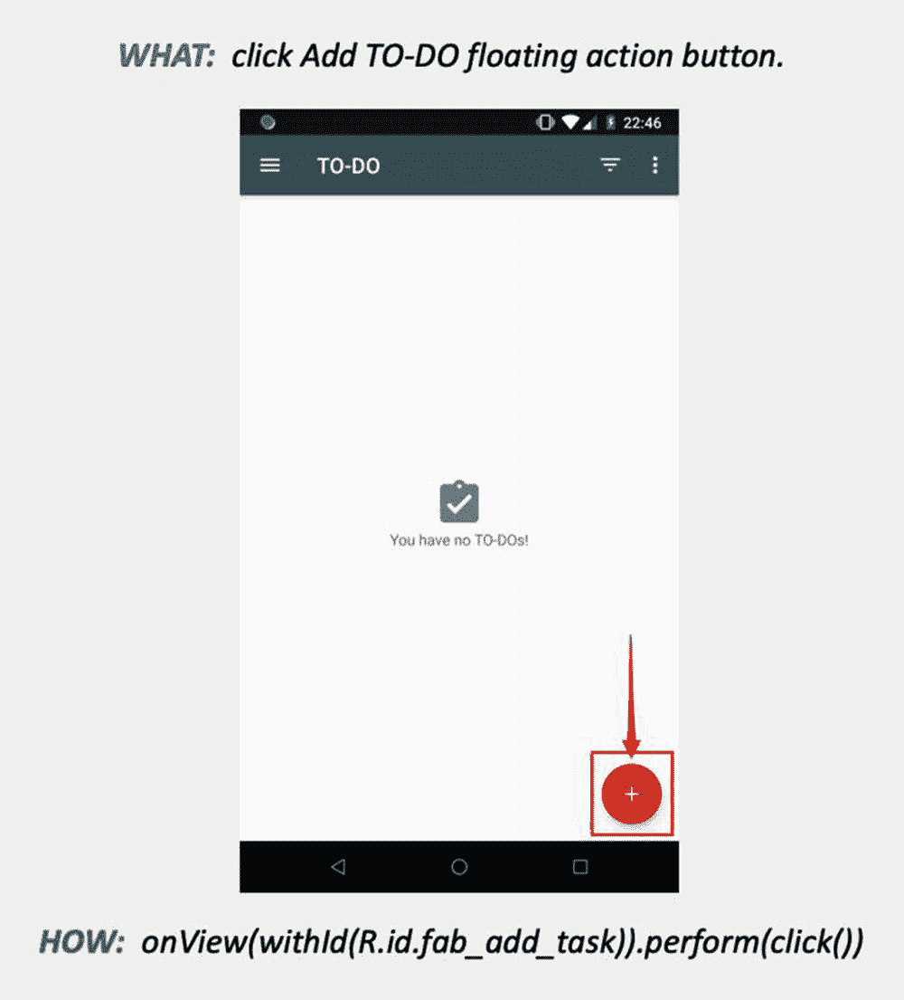

图 12-1
测试时分离“做什么”与“怎么做”

其理念是创建一个机器人，其中包含与机器人所代表的屏幕功能一样多的“做什么”方法。让我们从基础示例开始，逐步过渡到最终的 Espresso 测试机器人实现。首先，我们来看构建器模式（其中每个类方法返回同一个类实例），这与我们在第 11 章中讨论的屏幕对象模式非常相似。这是迈向测试机器人模式的第一步。以下是`BuilderToDoListRobot.kt`类，它代表了应用于待办事项列表屏幕的构建器模式。

*chapter12* *.robots.BuilderToDoListRobot.kt* 代表构建器模式。

```
/**
* Builder Pattern applied to TO-DO list screen.
*/
class BuilderToDoListRobot {
fun addToDo() {
onView(withId(R.id.fab_add_task)).perform(click())
}
fun showCompleted(): BuilderToDoListRobot {
onView(withId(R.id.menu_filter)).perform(click())
onView(allOf(withId(R.id.title), withText("Completed"))).perform(click())
return this
}
fun showActive(): BuilderToDoListRobot {
onView(withId(R.id.menu_filter)).perform(click())
onView(allOf(withId(R.id.title), withText("Active"))).perform(click())
return this
}
fun verifyToDoShown(withTitle: String): BuilderToDoListRobot {
onView(withText(withTitle)).check(matches(isDisplayed()))
return this
}
fun verifyToDoNotShown(withTitle: String): BuilderToDoListRobot {
onView(withText(withTitle)).check(matches(not(isDisplayed())))
return this
}
fun markCompleted(toDoTitle: String): BuilderToDoListRobot {
onView(allOf(withId(R.id.todo_complete), hasSibling(withText(toDoTitle)))).perform(click())
return this
}
fun checkDefaultLayout(): BuilderToDoListRobot {
onView(withId(R.id.noTasksMain)).check(matches(isDisplayed()))
onView(withId(R.id.noTasksIcon)).check(matches(isDisplayed()))
return this
}
}
```

类似地，`BuilderAddEditToDoRobot.kt`类也已实现。使用构建器模式的测试用例如下所示。

*chapter12*.* 
*RobotsTest.robotChecksToDoStateChangeBuilder()* 
*展示了构建器模式。*

```
@Test
fun robotChecksToDoStateChangeBuilder() {
BuilderToDoListRobot()
.checkDefaultLayout()
.addToDo()
BuilderAddEditToDoRobot()
.title(toDoTitle)
.description(toDoDescription)
.done()
BuilderToDoListRobot()
.verifyToDoShown(toDoTitle)
.markCompleted(toDoTitle)
.showActive()
.verifyToDoNotShown(toDoTitle)
.showCompleted()
.verifyToDoShown(toDoTitle)
}
```

你可以看到，`BuilderToDoListRobot.kt`测试类的方法代表了“怎么做”，而测试用例的步骤则向我们展示了“做什么”。注意清晰的屏幕分离——每次我们开始测试或导航到不同屏幕（例如，一个活动或片段）时，我们都会创建一个新的类实例。这种方法可行，但远非最终的机器人模式实现。

下一步是利用 Kotlin 语言的优势来简化构建器模式的实现。要理解这一点，我们需要参考`chapter12.ToDoListRobot.kt`文件，其中声明了`ToDoListRobot`类以及`toDoList()`函数。

*在 chapter12* *.robots.ToDoListRobot.kt 中声明。*


1.  `toDoList(func: ToDoListRobot.() -> Unit)` 是一个扩展函数，它接受`ToDoListRobot`的函数`func`作为参数。根据`Unit`类型，可以推断出`func`函数不返回任何值。

2.  `ToDoListRobot().apply { func() }`表达式中的`apply { func() }`函数会在`apply()`函数块内执行所提供的函数，就好像它们是从`ToDoListRobot`类内部调用的一样。这是得益于`apply()`函数的特性，根据 Kotlin 文档：

```
/**
* Calls the specified function [block] with `this` value as its receiver and returns `this` value.
*/
```

在当前情况下，`this`指的是`ToDoListRobot`类。

```
/**
* Extension function that takes ToDoListRobot class function(s)
* as a parameter, executes this function(s), and returns a
* ToDoListRobot instance.
*/
fun toDoList(func: ToDoListRobot.() -> Unit) = ToDoListRobot().apply { func() }
```

以相同的方式，我们为`AddEditToDoRobot`类实现了类似的功能：

```
fun addEditToDo(func: AddEditToDoRobot.() -> Unit) = AddEditToDoRobot().apply { func() }
```

现在，让我们看看这两个静态函数如何转换之前讨论的测试用例。

*测试用例：使用扩展函数替代机器人构造函数。* *`chapter12.RobotsTest.robotChecksToDoStateChangeRobotsSeparation()`*。

```
@Test
fun robotChecksToDoStateChangeRobotsSeparation() {
toDoList {
checkDefaultLayout()
addToDo()
}
addEditToDo {
title(toDoTitle)
description(toDoDescription)
done()
}
toDoList {
verifyToDoShown(toDoTitle)
markCompleted(toDoTitle)
showActive()
verifyToDoNotShown(toDoTitle)
showCompleted()
verifyToDoShown(toDoTitle)
}
}
```

如你所见，我们不再需要构造函数。相反，我们调用静态函数`toDoList{ }`和`addEditTodo{ }`，它们代表`ToDoListRobot`和`AddEditToDoRobot`类执行操作。

下一步，修改返回新机器人的函数。在我们处理的测试用例中，它是`addToDo()`和`done()`函数。因此，它变得几乎等同于`toDoList{ }`和`addEditTodo{ }`静态函数：

```
infix fun addToDo(func: AddEditToDoRobot.() -> Unit): AddEditToDoRobot {
onView(withId(R.id.fab_add_task)).perform(click())
return AddEditToDoRobot().apply(func)
}
```

测试用例更改如下。

*测试用例：机器人转换函数的作用类似于 `toDoList{ }`和`addEditTodo{ }`。* *`chapter12.RobotsTest.robotChecksToDoStateChange()`*。

```
@Test
fun robotChecksToDoStateChange() {
toDoList {
checkDefaultLayout()
}.addToDo {
title(toDoTitle)
description(toDoDescription)
}.done {
verifyToDoShown(toDoTitle)
markCompleted(toDoTitle)
showActive()
verifyToDoNotShown(toDoTitle)
showCompleted()
verifyToDoShown(toDoTitle)
}
}
```

为使测试机器人模式更完善，最后要做的是对返回新机器人的函数使用 Kotlin 的`infix`函数表示法。`infix`表示法允许我们调用函数时无需使用点和括号：

```
infix fun addTask(func: AddEditToDoRobot.() -> Unit): AddEditToDoRobot {
onView(withId(R.id.fab_add_task)).perform(click())
return AddEditToDoRobot().apply(func)
}
```

最终的测试用例看起来是这样的。

*测试用例：机器人转换函数的作用类似于 `toDoList{ }`和`addEditTodo{ }`。* *`chapter12.RobotsTest.robotChecksToDoStateChange()`*。

```
@Test
fun robotChecksToDoStateChangeInfix() {
toDoList {
checkDefaultLayout()
} addToDo {
title(toDoTitle)
description(toDoDescription)
} done {
verifyToDoShown(toDoTitle)
markCompleted(toDoTitle)
showActive()
verifyToDoNotShown(toDoTitle)
showCompleted()
verifyToDoShown(toDoTitle)
}
}
```

至此，我们对测试内容与测试方式有了清晰的划分。本章中的测试用例代表了应该测试的业务逻辑。这保持了测试结构的简短、逻辑清晰，并且不包含技术实现细节。
为了进一步改进，我们可以使用 Kotlin 的内部类来表示较小的视图组，例如属于同一机器人的筛选或菜单。看一下图 12-2 所示的示例。

如图 12-2 所示，待办事项列表屏幕被分成了三个部分：

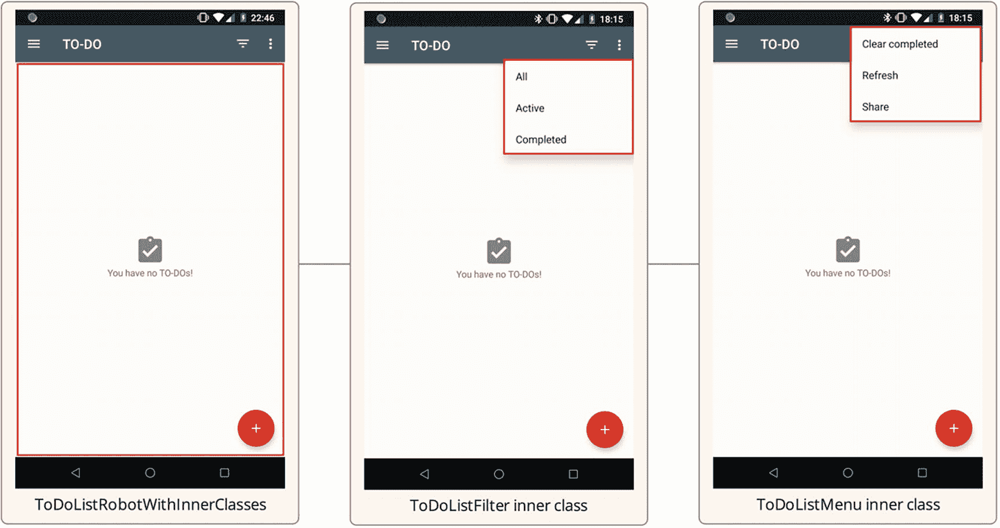

**图 12-2** 在机器人类中添加内部类

1.  主要功能区域由`ToDoListRobotWithInnerClasses`类表示。
2.  一个名为`ToDoListFilter`的筛选视图组，被声明为内部类。
3.  一个名为`ToDoListMenu`的菜单视图组，被声明为内部类。

为了方便，我们在内部类的构造函数中添加了用于触发视图组显示的 Espresso 操作。

*`TasksListRobotWithInnerClasses` 类中的内部类。*

```
fun toDoListFilter(func: ToDoListFilter.() -> Unit) = ToDoListFilter().apply { func() }
inner class ToDoListFilter {
init {
onView(withId(R.id.menu_filter)).perform(click())
}
fun showAll() {
onView(allOf(withId(R.id.title), withText("All"))).perform(click())
}
fun showCompleted() {
onView(allOf(withId(R.id.title), withText("Completed"))).perform(click())
}
fun showActive() {
onView(allOf(withId(R.id.title), withText("Active"))).perform(click())
}
}
```

使用这种内部类方法，我们实际上获得了更多好处：

*   代码可读性
*   代码重复消除

**代码可读性**
由于清晰地划分为功能区域或视图组，机器人类的实现和测试代码都变得更加可读且易于维护。

**代码重复消除**
内部类构造函数可以执行触发功能所需的步骤，例如点击筛选工具栏图标以显示所有可用的筛选选项，然后在选项中导航。

**练习 27**

**使用屏幕测试机器人模式编写测试**

1.  为设置和统计屏幕创建机器人。
2.  思考菜单抽屉，并实现一个最适合其功能的解决方案。编写一个涉及菜单抽屉导航的测试。

## 13. 使用 Espresso 和 UI Automator 进行监督式猴子测试

应用稳定性是首要的应用质量指标。稳定性差会导致 Android PlayStore 中的用户评分低，进而降低应用的总体评分并减少下载量。为了保持应用稳定，Android 平台提供了一个名为`monkeyrunner`的工具（[`https://developer.android.com/studio/test/monkeyrunner`](https://developer.android.com/studio/test/monkeyrunner)）用于从稳定性方面测试应用。不幸的是，`monkeyrunner`并未集成到 Espresso 或 UI Automator 框架中，这使得它对于需要用户登录的应用或猴子测试应从特定应用状态开始的情况几乎毫无用处。此外，如果不实现自定义测试，则无法收集有价值的测试结果，这会导致需要进行结果解析。
考虑到这些信息，很明显，猴子测试必须更加智能且易于控制。本章将解释如何实现你自己的监督式猴子测试。

**Monkeyrunner 的问题与解决方案**

让我们仔细看看是什么让`monkeyrunner`如此不可用：

*   使用`monkeyrunner`，测试不是项目代码库的一部分，也不受 Espresso 或 UI Automator 测试框架控制。
*   它不是`androidx`或`android.support`库的一部分。
*   它是一个独立的工具，有其自身的问题，并且需要维护。


- 获取和处理测试结果很困难。
- 它使用 Python 编程语言编写，这使得与现有 UI 测试的集成更加困难。

`monkeyrunner` 的这些缺点迫使我们实现自己的解决方案。幸运的是，我们不需要做太多工作就能将其部署到位。我们的想法是在原生测试框架（如 `Espresso` 或 `UI Automator`，或两者结合）中编写 monkey 测试。这带来了以下优势：

- Monkey 测试成为 UI 测试代码库的一部分，这意味着它们完全由您拥有和控制。
- 您可以将 UI 测试与 monkey 测试结合使用（例如，您可以使用 UI 测试来登录，然后启动 monkey 测试）。
- 使用现有的报告基础设施，可以轻松获取和处理测试结果。
- Monkey 测试可以被监控，这意味着如果 monkey 测试离开了应用程序，您可以识别并重新启动该应用程序。
- 可以根据需要实现不同的 UI 事件或手势。

## 检测和第三方应用的 Monkey 测试

如前所述，`monkeyrunner` 工具不满足我们对 monkey 测试的要求；因此，在本节中，我们将实现自己的受监控 monkey 测试。

### 识别 Monkey 测试的操作区域

我们有用于编写 monkey 测试的工具。现在，我们必须思考这些 monkey 测试应如何以及在哪里操作的概念。图 13-1 定义了 monkey 测试应执行其操作的区域。

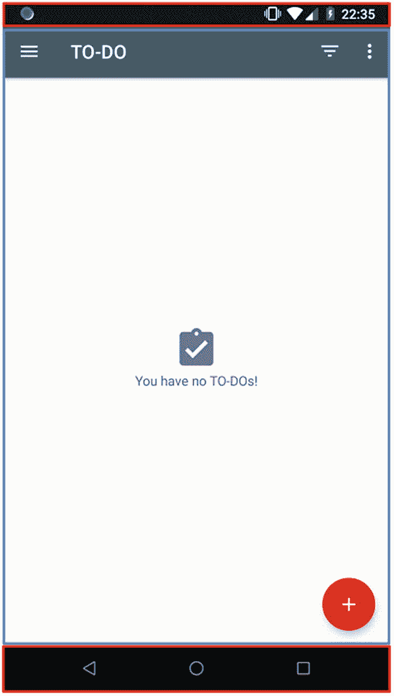

**图 13-1** 设备屏幕区域。红色表示应忽略的区域，蓝色表示感兴趣的区域。

根据官方 Android 文档，顶部和底部的栏分别称为导航栏（见图 13-2）和状态栏（见图 13-3）。


**图 13-3** 状态栏


**图 13-2** 导航栏

我们的第一个任务是识别导航栏和状态栏的尺寸，并计算我们希望 monkey 测试操作的区域坐标。`ScreenDimensions` 类包含了执行此计算的所有方法。除此之外，它还为我们感兴趣的区域中 monkey 动作生成随机坐标。为了完全理解这些计算是如何执行的，图 13-4 显示了设备屏幕坐标系。

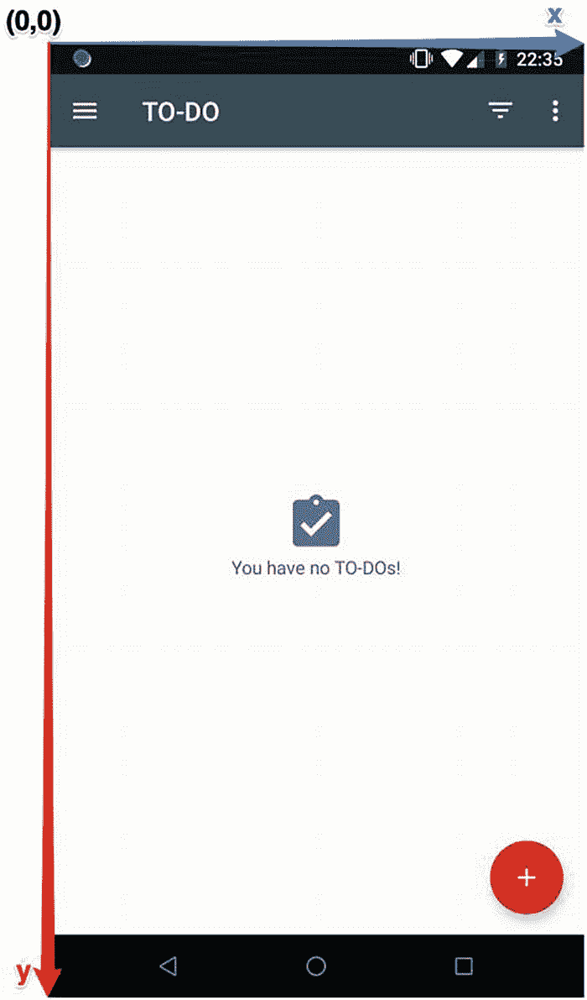

**图 13-4** Android 屏幕坐标系

简而言之，元素高度的计算是从顶部向下开始的，从 (0, 0) 坐标开始。现在应该清楚了，要计算所需区域的零坐标，我们需要知道状态栏的高度。右下角也是如此，但在这种情况下，我们还需要知道导航栏的高度。所有这些计算都在 `ScreenDimensions.kt` 类中完成。

`chapter13.ScreenDimensions.kt` 类保存了所有计算屏幕尺寸和生成随机坐标的函数。

```kotlin
/**
* 计算屏幕尺寸、导航栏、状态栏和操作栏的尺寸。
* 为 monkey 点击生成随机坐标。
*/
object ScreenDimensions {
    private val heightWithoutNavigationBar: Int
    private var width = 0
    private val uiDevice = UiDevice.getInstance(InstrumentationRegistry.getInstrumentation())
    private val appContext = InstrumentationRegistry.getInstrumentation().targetContext
    private val navBarResourceId =
        appContext.resources.getIdentifier("navigation_bar_height", "dimen", "android")
    private val statusBarResourceId =
        appContext.resources.getIdentifier("status_bar_height", "dimen", "android")
    init {
        width = uiDevice.displayWidth
        heightWithoutNavigationBar = uiDevice.displayHeight - ScreenDimensions.navigationBarHeight
    }
    /**
    * 计算导航栏高度。
    */
    val navigationBarHeight : Int get() {
        return if (navBarResourceId > 0) {
            appContext.resources.getDimensionPixelSize(navBarResourceId)
        } else {
            0
        }
    }
    /**
    * 计算状态栏高度。
    */
    val statusBarHeight: Int get() {
        return if (statusBarResourceId > 0) {
            appContext.resources.getDimensionPixelSize(statusBarResourceId)
        } else {
            0
        }
    }
    val randomY: Int
        get()  = (statusBarHeight..heightWithoutNavigationBar).random()
    val randomX: Int
        get() = (0..width).random()
    private fun IntRange.random() =
        Random().nextInt((endInclusive + 1) - start) +  start
}
```

如您所见，我们使用 `UiDevice` 实例来获取设备屏幕的宽度和高度，并使用应用上下文根据其资源标识符获取导航栏和状态栏的高度。

### 定义 Monkey 测试动作

下一步是定义我们的 monkey 测试将执行的动作：

- **点击动作** — 此动作应在图 13-1 中标出的感兴趣区域内的随机坐标 (`randomX`, `randomY`) 上执行点击。将使用 `UiDevice.click(int x, int y)` 动作。
- **拖拽（或滑动）** — 拖拽和滑动动作应基于随机定义的起始坐标 (`startX`, `startY`) 和结束坐标 (`endX`, `endY`) 来执行。我们在此使用 `UiDevice.drag(int startX, int startY, int endX, int endY, int steps)` 动作。`steps` 参数是滑动动作的步数。每一步的执行被限制为每步 5 毫秒，因此对于 100 步，滑动将需要大约 0.5 秒才能完成。
- **点击系统返回按钮** — 将使用 `UiDevice.pressBack()` 动作来模拟短按系统返回按钮。
- **启动应用程序** — 这里我们将根据被测试的应用程序采用不同的方法来启动应用程序。对于 debug 应用程序，我们需要访问源代码，因此我们将使用来自 `android.support` 库项目的 `ActivityTestRule` 和来自 `androidx.test` 库的 `ActivityScenario.launch(Activity.class)` 函数。对于第三方应用程序，我们有另一种使用包名启动应用程序的方法，稍后将讨论。
- **在 monkey 测试离开后重新启动应用程序** — 基本上我们重复使用上一点的实现。这允许 monkey 测试离开应用程序，并使测试更接近地模拟真实用例场景，即移动用户在一段时间后离开应用程序，然后再次启动应用程序。

现在，我们进入所有提及的动作的实现，这些可以在 `chapter13.Monkey.kt` 文件中看到。

`chapter13.Monkey.kt`


```kotlin
/**
* 包含 Monkey 测试逻辑和主要操作的类。
*/
object Monkey {
    private val uiDevice = UiDevice.getInstance(InstrumentationRegistry.getInstrumentation())
    private val appContext = InstrumentationRegistry.getInstrumentation().targetContext
    private val toDoAppPackageName = appContext.packageName
    private const val numberOfSteps = 10
    // 用于取模运算（%）以决定执行哪个操作的随机整数值。
    private const val dragNow = 7
    private const val pressNowBack = 13
    // 用于记录操作描述，以供日志记录或异常构造的变量。
    private var monkeyAction = ""
    /**
    * 从起始坐标拖动到结束坐标。
    *
    * @param startX - 起始 x 坐标
    * @param startY - 起始 y 坐标
    * @param endX - 结束 x 坐标
    * @param endY - 结束 y 坐标
    */
    private fun drag(startX: Int, startY: Int, endX: Int, endY: Int) {
        uiDevice.drag(
            startX,
            startY,
            endX,
            endY,
            numberOfSteps)
    }
    /**
    * 对指定的包运行 Monkey 测试。
    *
    * @param actionsCount - 在 Monkey 测试期间要执行的事件数量。
    * @param packageName - 需要测试的包名。如果未提供，则测试 TO-DO 应用。
    */
    fun run(actionsCount: Int, packageName: String = toDoAppPackageName) {
        loop@ for (i in 0..actionsCount) {
            if (PackageInfo.shouldRelaunchTheApp(monkeyAction, packageName)) {
                relaunchApp(packageName)
            }
            val randomX = ScreenDimensions.randomX
            val randomY = ScreenDimensions.randomY
            when {
                i % dragNow == 0 -> {
                    val randomX2 = ScreenDimensions.randomX
                    val randomY2 = ScreenDimensions.randomY
                    monkeyAction = String.format(
                        "从: %d - %d 拖动到: %d - %d", randomX,
                        randomY, randomX2, randomY2
                    )
                    drag(randomX, randomY, randomX2, randomY2)
                    continue@loop
                }
                i % pressNowBack == 0 -> {
                    monkeyAction = "按下系统返回按钮"
                    uiDevice.pressBack()
                    continue@loop
                }
                else -> {
                    monkeyAction = "点击坐标 x:$randomX y:$randomY"
                    uiDevice.click(randomX, randomY)
                    continue@loop
                }
            }
        }
    }
    /**
    * 通过包名启动应用程序。
    * 如果包名与 TO-DO 应用程序包名相同，则使用 ActivityScenario.launch()。
    *
    * @param packageName - 要重新启动的包名
    */
    private fun relaunchApp(packageName: String) {
        if (packageName == toDoAppPackageName) {
            ActivityScenario.launch(TasksActivity::class.java)
        } else {
            PackageInfo.launchPackage(packageName)
        }
    }
}
```

这种 Monkey 操作的实现看起来清晰且易于扩展。即使只有这些数量的操作也足以执行良好的 Monkey 测试。但它也很容易扩展，我们只需在 `when {}` 块内再引入一个操作即可。 `dragNow` 和 `pressNowBack` 常量的定义方式是为了最小化 `actionCount % dragNow` 或 `actionCount % pressNowBack` 两个表达式同时返回 0（零）的情况。当然，你也可以将它们改为适合你需要的值。

逻辑在 Monkey 测试中扮演的重要角色之一，是由以下条件语句处理的：

```kotlin
if (PackageInfo.shouldRelaunchTheApp(monkeyAction, packageName)) {
    relaunchApp(packageName)
}
```

简而言之，此条件检查测试是否离开了被测试的应用程序，或者是否发生了崩溃。如果 Monkey 测试离开了某个应用程序，则会触发重新启动机制。如果发生了错误，则会创建并抛出一个异常。

### 实现依赖于包的功能

这里有三个依赖应用程序包名的 Monkey 测试功能，我们希望实现它们：

-   在测试第三方应用程序时，启动或重新启动测试应用程序。
-   检查测试应用程序进程是否处于错误状态。
-   创建一个用于识别是否需要重新启动测试应用的函数。

所有这些情况都在 `chapter13.PackageInfo.kt` 文件中实现，如下所示。

*chapter13.PackageInfo.kt*

```kotlin
/**
* 提供包辅助方法。
*/
object PackageInfo {
    private val uiDevice = UiDevice.getInstance(InstrumentationRegistry.getInstrumentation())
    private val testContext = InstrumentationRegistry.getInstrumentation().context
    /**
    * 检查是否需要重新启动应用程序。
    *
    * @return 如果被测应用程序未显示给用户，则返回 true。
    */
    fun shouldRelaunchTheApp(monkeyAction: String, packageName: String): Boolean {
        if (!isAppInErrorState(monkeyAction, packageName)
            && uiDevice.currentPackageName != packageName) {
            return true
        }
        return false
    }
    /**
    * 根据包名启动应用程序。
    * @param packageName - 要启动的包名。
    */
    fun launchPackage(packageName: String) {
        val intent = testContext
            .packageManager
            .getLaunchIntentForPackage(packageName)!!
        testContext.startActivity(intent)
        uiDevice.wait(Until.hasObject(By
            .pkg(packageName)),
            5000)
    }
    /**
    * 检查目标应用程序进程是否处于错误状态，如果出错则抛出异常，否则返回 true。
    *
    * @return 如果应用处于错误状态则返回 false，否则抛出异常并导致测试失败。
    */
    private fun isAppInErrorState(monkeyAction: String, packageName: String): Boolean {
        val manager = testContext.getSystemService(Context.ACTIVITY_SERVICE) as ActivityManager
        var errorDescription = ""
        // 获取处于错误状态的进程，如果列表为空则返回 false。
        manager.processesInErrorState?.forEach {
            val isTargetPackage = it.processName.contains(packageName)
            when {
                isTargetPackage && it.condition == CRASHED ->
                    errorDescription = "在 $monkeyAction 操作后，应用程序 $packageName 崩溃了"
                isTargetPackage && it.condition == NOT_RESPONDING ->
                    errorDescription = "在 $monkeyAction 操作后，应用程序 $packageName 无响应"
            }
            /** 构建并抛出带有适当描述和堆栈跟踪的 Espresso PerformException
            *   测试在此处失败。
            */
            throw PerformException.Builder()
                .withActionDescription(errorDescription)
                .withCause(Throwable(it.stackTrace))
                .build()
        }
        return false
    }
}
```

这里，`shouldRelaunchTheApp()` 函数验证了两个条件。首先，它判断测试应用程序是否处于错误状态（`CRASH` 或 `ANR`）。如果不是，则检查被测应用程序是否已显示给用户，如果没有则重新启动它。`launchPackage(packageName)` 函数使用测试上下文向系统发送启动 Activity 的 intent，并借助 `UiDevice` 的等待机制，等待应用程序启动。最后一个名为 `isAppInErrorState(monkeyAction, packageName)` 的函数，确保被测应用程序进程当前不处于错误状态。当识别到错误状态时，会创建一个 Espresso 的 `PerformException` 函数，其中包含关于刚执行的 Monkey 操作的额外信息以及异常堆栈跟踪。这样，我们就使用了 Espresso 的错误报告机制并使得 Monkey 测试失败。

接下来是针对被测应用和第三方应用的实际 Monkey 测试。`com.google.android.dialer` 包（安卓电话应用）被用作第三方示例。

*chapter13.MonkeyTest.kt*

```kotlin
/**
* 演示受监督 Monkey 测试的测试类。
*/
@RunWith(AndroidJUnit4::class)
class MonkeyTest {
    @get:Rule
    var grantPermissionRule: GrantPermissionRule = GrantPermissionRule.grant(
        Manifest.permission.CAMERA,
        Manifest.permission.WRITE_EXTERNAL_STORAGE)
    @get:Rule
    var screenshotWatcher = ScreenshotWatcher()
    /**
    * Monkey 测试将针对 TO-DO 应用程序执行。
    */
    @Test
    fun testsInstrumentedApp() {
        ActivityScenario.launch(TasksActivity::class.java)
        Monkey.run(200)
    }
    /**
    * Monkey 测试将针对提供的应用程序包名执行。
    * 这是一个如何测试第三方应用程序的示例。
    */
    @Test
    fun testsThirdPartyApp() {
        val packageName = "com.google.android.dialer"
        PackageInfo.launchPackage(packageName)
        Monkey.run(200, packageName)
    }
}
```


### 运行 Monkey 测试

运行这些测试时，我们可以看到 monkey 操作比 `monkeyrunner` 测试稍慢，这是因为需要在每个测试步骤中检查应用程序状态。不过，考虑到使用 Android 原生测试框架实现这些测试所带来的诸多优势，我们可以忽略这个问题。

## 练习 28

### 运行 Monkey 测试

1.  检出 TODO 应用程序项目的 master 分支，并将其迁移至 AndroidX。迁移后，执行 Build ➤ Clean Project。运行一些测试。如果出现失败，通过更新 `proguard` 规则或更新 `build.gradle` 文件中的依赖项，来分析并修复问题。

2.  实现一个测试类，其中包含一个测试：在 `@Before` 方法中使用 `ActivityScenario.launch(Activity.class)` 启动应用 Activity，然后运行测试。

## 小结

遗憾的是，在 Android 平台上，monkey 测试并未受到足够重视。为了满足这一需求，提供的仍是过时的 `monkeyrunner` Python 工具，而非通过 UI Automator 或 Espresso 等原生 Android 平台测试框架提供更好的支持。即便如此，无需过多投入，我们仍然可以运行有意义的 monkey 测试，包括：在测试状态下轻松启动和准备合适应用的方法、运行受监督的 monkey 测试，以及使用原生测试框架功能报告测试结果。

# 14. AndroidX 测试库

2018 年 5 月的 Google I/O 大会宣布了 AndroidX 开源项目，该项目用于在 Android Jetpack 中开发、测试、打包、版本管理和发布库。AndroidX 取代了 Android 支持库。其主要改进之一是：AndroidX 包是独立维护和更新的，因此你可以在项目中独立更新 AndroidX 库。

由于 Android 测试库是 Android 支持库的一部分，AndroidX 也包含了 AndroidX 测试库。其 beta 版本于 2018 年 5 月的 Google I/O 大会上发布。在 2018 年的 Android DevSummit 大会上，谷歌宣布了其稳定版 1.0。AndroidX 测试库消除了维护许多不同测试工具的需要，这些工具在不同测试级别上使用的样式和 API 各不相同。

为了方便起见，第二个分支名为 `androidx-espresso-revealed`，其中包含一个已迁移至 AndroidX 的 TODO 示例应用程序项目。要使用它，只需使用 `git checkout androidx-espresso-revealed` 命令切换分支即可。你可能需要使用 Android Studio 的 Build ➤ Clean 选项清理项目，甚至使用 File ➤ Invalidate Cashes / Restart… 来避免构建问题。

## AndroidX 测试与测试支持库的对比

图 14-1 中的测试金字塔展示了不同测试级别，这些级别曾通过测试技术及所用工具相互隔离。

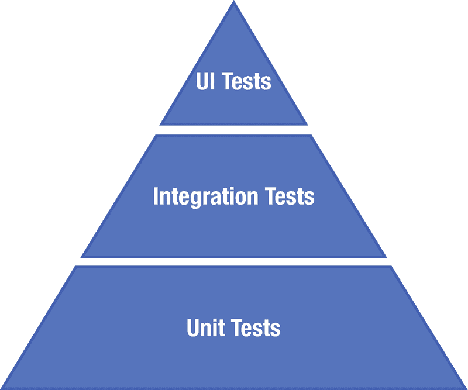

**图 14-1** 测试金字塔

过去的问题是，不同级别的测试不可移植；它们与编写所用的测试工具和环境紧密绑定。使用 AndroidX 测试库，这个问题得到了解决。现在，你可以使用一组单一的测试库来编写与不同测试级别相关的测试——单元测试、集成测试和用户界面（或端到端）测试。

由于本书讨论的是 UI 端到端测试，我们将从 UI 测试的角度，重点介绍 AndroidX 测试库相较于 Android 测试支持库的新特性：

*   `ApplicationProvider` — 提供在测试中检索当前应用程序上下文的能力。
*   `ActivityScenario` 和 `FragmentScenario` — `ActivityScenario` 提供用于启动和驱动 Activity 生命周期状态以进行测试的 API。它适用于任意 Activity，并在不同版本的 Android 框架中表现一致。`FragmentScenario` 提供用于启动和驱动 Fragment 生命周期状态以进行测试的 API。它适用于任意 Fragment，并在不同版本的 Android 框架中表现一致。
*   新的 `Truth` 断言库 — `Truth` 是一个流畅的断言库，可在为测试构建验证步骤时，作为基于 `JUnit` 或 Hamcrest 断言的替代方案。
*   将所有其他库和依赖项迁移至 `androidx.test` — 所有来自 `android.test.support` 库的依赖项都已迁移至 `androidx.test`。

## 为 AndroidX 测试配置项目

为了在新创建的项目中开始使用 AndroidX 测试，你必须遵循与使用 `android.support` 库几乎相同的步骤：

1.  为确保拥有最新的 AndroidX 测试库，在 `build.gradle` 文件中添加 Google 的 Maven 仓库，如下所示：

```
allprojects {
    repositories {
        jcenter()
        google()
    }
}
```

2.  在 UI 测试中添加所需的 AndroidX 测试依赖项：

```
// Espresso UI Testing
androidTestImplementation "androidx.test.espresso:espresso-core:$rootProject.espressoVersion"
androidTestImplementation "androidx.test.espresso:espresso-contrib:$rootProject.espressoVersion"
androidTestImplementation "androidx.test.espresso:espresso-intents:$rootProject.espressoVersion"
androidTestImplementation "androidx.test.espresso.idling:idling-concurrent:$rootProject.espressoVersion"
androidTestImplementation "androidx.test.espresso:espresso-idling-resource:$rootProject.espressoVersion"
androidTestImplementation "androidx.test.espresso:espresso-web:$rootProject.espressoVersionAndroidX"
androidTestImplementation "androidx.test.espresso:espresso-accessibility:$rootProject.espressoVersion"
```

3.  添加 AndroidX 测试的 Instrumentation Runner：

```
testInstrumentationRunner 'androidx.test.runner.AndroidJUnitRunner'
```

4.  要使用 Android Test Orchestrator，请添加以下行：

```
testOptions {
    execution 'ANDROIDX_TEST_ORCHESTRATOR'
}
```

以上步骤就足以开始编写 UI 测试，正如我们在 TODO 示例应用中所做的那样。

## 迁移至 AndroidX

AndroidX 迁移已集成到 Android Studio IDE 中，因此迁移主应用程序和测试应用程序都非常容易。要开始迁移过程，请从 Android Studio 菜单中选择 Refactor ➤ Migrate to AndroidX…。你也可以在项目视图中右键单击项目，然后选择这些菜单选项。参见图 14-2。

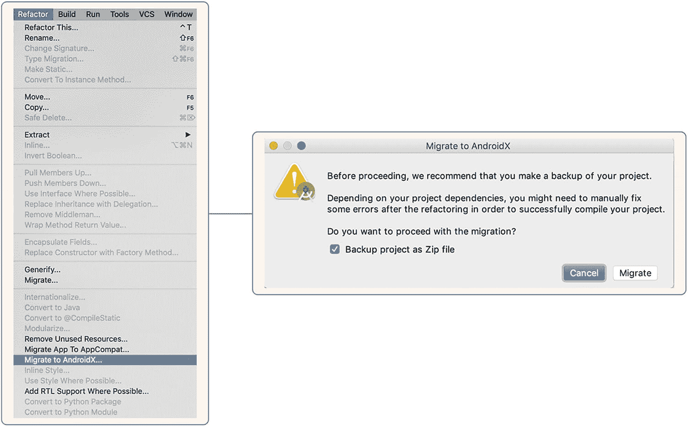

**图 14-2** Android Studio 中的“迁移至 AndroidX”选项

在开始迁移之前，系统会提示你备份项目，以防迁移后出现编译问题。你还会收到警告：需要根据项目依赖项手动修复迁移错误。

几分钟后（取决于项目的复杂性），整个项目将迁移至 AndroidX 库。这非常简单易行。在自动触发后，`gradle sync` 任务看起来一切正常，显示 `BUILD SUCCESSFUL`。但是（总会有个“但是”），在第一次测试运行时，测试启动后出现了以下问题。

*迁移至 AndroidX 时的 Proguard 混淆问题*


```
Started running tests
java.lang.NoClassDefFoundError: Failed resolution of: Landroidx/test/espresso/IdlingRegistry;
...
Caused by: java.lang.ClassNotFoundException: Didn't find class "androidx.test.espresso.IdlingRegistry" on path: DexPathList[[zip file "/system/framework/android.test.runner.jar", zip file "/system/framework/android.test.mock.jar", zip file "/data/app/com.example.android.architecture.blueprints.todoapp.mock.test-U-I7D8dt-qcnzY2buNTPzw==/base.apk", zip file "/data/app/com.example.android.architecture.blueprints.todoapp.mock-JWNE8BTGptjn2ZWTifC78Q==/base.apk"],nativeLibraryDirectories=[/data/app/com.example.android.architecture.blueprints.todoapp.mock.test-U-I7D8dt-qcnzY2buNTPzw==/lib/arm64, /data/app/com.example.android.architecture.blueprints.todoapp.mock-JWNE8BTGptjn2ZWTifC78Q==/lib/arm64, /system/lib64, /vendor/lib64]]
...
Tests ran to completion .
```

事实证明，无论好坏，AndroidX 迁移都不会处理项目中的 `proguard` 文件。这意味着如果先前为 `android.support` 库定义了一些 `proguard` 规则，这些规则将不会被触及。以下示例代码包含了一个 TO-DO 应用中 `proguard-rules.pro` 文件里提到的、未迁移的 `android.support` 库类示例。

*迁移至 AndroidX……但不会迁移 Proguard 文件。*

```
-keep class android.support.v4.widget.DrawerLayout { *; }
-keep class android.support.test.espresso.IdlingResource { *; }
-keep class android.support.test.espresso.IdlingRegistry { *; }
```

如前所述，手动修复迁移错误是必要的。

## UI 测试中的 ActivityScenario

`ActivityScenario` 提供了启动并驱动 Activity 生命周期阶段（例如 `Stage.CREATED`、`Stage.RESUMED`、`Stage.DESTROYED` 等）以进行测试的 API。这些 API 更适合集成测试，可以快速轻松地测试每个 Activity 状态。对于 UI 测试而言，重要的是它们可以替代 `ActivityTestRule`，在每次测试运行前在测试 Activity 下启动应用。

*chapter14* *.* *ActivityScenarioTest.kt.*

```
/**
* Sample of ActivityScenario.launch(Activity.class) method usage.
*/
@RunWith(AndroidJUnit4::class)
class ActivityScenarioTest {
@Before
fun launchTasksActivity() {
ActivityScenario.launch(TasksActivity::class.java)
}
@Test
fun activityScenarioLaunchSample() {
openContextualActionModeOverflowMenu()
onView(allOf(withId(R.id.title), withText(R.string.refresh))).perform(click())
}
}
```

如您所见，在使用角度上差异不大。但您将不会拥有 `ActivityTestRule` 的实例，因此也就无法访问已启动的 Activity。

## 在 UI 测试中使用 Truth 断言库

虽然 `Truth` 断言库主要是为单元测试和集成测试开发的，但它同样能为 UI 测试带来好处。我们在第 8 章中使用了 `JUnit` 断言来断言 UI Automator 测试中屏幕上的元素是否存在。让我们看看基本 `JUnit` 断言和 `Truth` 断言之间的区别。

### 表 14-1 基本 JUnit 和 Truth 断言对比

| JUnit | Truth |
| --- | --- |
| `assertEquals(b, a)` `assertTrue(c)` `assertTrue(d.contains(a))` | `assertThat(a).isEqualTo(b)` `assertThat(c).isTrue()` `assertThat(d).contains(a)` |
| `assertTrue(d.contains(a) && d.contains(b))` `assertTrue(d.contains(a) \|\| d.contains(b) \|\| d.contains(c))` | `assertThat(d).containsAllOf(a, b)` `assertThat(d).containsAnyOf(a, b, c)` |

说实话，`Truth` 的语法更具可读性，更易于编写，并且与我们编写 Espresso 测试时使用的 Hamcrest 库方法类似。现在转到测试失败报告部分。拥有有意义且描述清晰的测试失败堆栈跟踪非常重要，这样故障分析就不需要太多时间和精力。`TruthTest.kt` 类中包含两个测试，它们会失败以展示 `JUnit` 和 `Truth` 的失败报告并进行比较。

*chapter14* *.TruthTest.kt. 两个测试均会失败以展示 JUnit 与 Truth 断言在堆栈跟踪上的差异。*

```
@RunWith(AndroidJUnit4::class)
class TruthTest {
private val uiDevice: UiDevice = UiDevice.getInstance(InstrumentationRegistry.getInstrumentation())
@Before
fun launchTasksActivity() {
ActivityScenario.launch(TasksActivity::class.java)
}
/**
* 特意使用 JUnit 断言使测试失败。
*/
@Test
fun generatesJunitAssertionError() {
val selector = uiDevice.findObject(UiSelector().resourceId(
"com.example.android.architecture.blueprints.todoapp.mock:id/fab_add_task"))
// JUnit assertion.
assertFalse(
"Element with selector $selector is present on the screen when it should not",
selector.exists())
}
/**
* 特意使用 Truth 断言使测试失败。
*/
@Test
fun generatesTruthAssertionError() {
val selector = uiDevice.findObject(UiSelector().resourceId(
"com.example.android.architecture.blueprints.todoapp.mock:id/fab_add_task"))
// Truth assertion.
assertThat(selector.exists()).isFalse()
}
}
```

以下是一个来自旧版 `JUnit assertTrue(MESSAGE, CONDITION)` 方法的错误堆栈跟踪示例，以及由本章 TO-DO 示例中实现的 `TruthTest.generatesJunitAssertionError()` 方法生成的错误堆栈跟踪。

*generatesJunitAssertionError() 测试失败时生成的 JUnit 错误堆栈跟踪。*
```


```
java.lang.AssertionError: Element with selector androidx.test.uiautomator.UiObject@ce91768 is present on the screen when it should not
at org.junit.Assert.fail(Assert.java:88)
at org.junit.Assert.assertTrue(Assert.java:41)
at org.junit.Assert.assertFalse(Assert.java:64)
at com.example.android.architecture.blueprints.todoapp.test.chapter14.TruthTest.generatesJunitAssertionError(TruthTest.kt:33)
at java.lang.reflect.Method.invoke(Native Method)
at org.junit.runners.model.FrameworkMethod$1.runReflectiveCall(FrameworkMethod.java:50)
at org.junit.internal.runners.model.ReflectiveCallable.run(ReflectiveCallable.java:12)
at org.junit.runners.model.FrameworkMethod.invokeExplosively(FrameworkMethod.java:47)
at org.junit.internal.runners.statements.InvokeMethod.evaluate(InvokeMethod.java:17)
at androidx.test.internal.runner.junit4.statement.RunBefores.evaluate(RunBefores.java:80)
at org.junit.runners.ParentRunner.runLeaf(ParentRunner.java:325)
at org.junit.runners.BlockJUnit4ClassRunner.runChild(BlockJUnit4ClassRunner.java:78)
at org.junit.runners.BlockJUnit4ClassRunner.runChild(BlockJUnit4ClassRunner.java:57)
at org.junit.runners.ParentRunner$3.run(ParentRunner.java:290)
at org.junit.runners.ParentRunner$1.schedule(ParentRunner.java:71)
at org.junit.runners.ParentRunner.runChildren(ParentRunner.java:288)
at org.junit.runners.ParentRunner.access$000(ParentRunner.java:58)
at org.junit.runners.ParentRunner$2.evaluate(ParentRunner.java:268)
at org.junit.runners.ParentRunner.run(ParentRunner.java:363)
at androidx.test.ext.junit.runners.AndroidJUnit4.run(AndroidJUnit4.java:104)
at org.junit.runners.Suite.runChild(Suite.java:128)
at org.junit.runners.Suite.runChild(Suite.java:27)
at org.junit.runners.ParentRunner$3.run(ParentRunner.java:290)
at org.junit.runners.ParentRunner$1.schedule(ParentRunner.java:71)
at org.junit.runners.ParentRunner.runChildren(ParentRunner.java:288)
at org.junit.runners.ParentRunner.access$000(ParentRunner.java:58)
at org.junit.runners.ParentRunner$2.evaluate(ParentRunner.java:268)
at org.junit.runners.ParentRunner.run(ParentRunner.java:363)
at org.junit.runner.JUnitCore.run(JUnitCore.java:137)
at org.junit.runner.JUnitCore.run(JUnitCore.java:115)
at androidx.test.internal.runner.TestExecutor.execute(TestExecutor.java:56)
at androidx.test.runner.AndroidJUnitRunner.onStart(AndroidJUnitRunner.java:388)
at android.app.Instrumentation$InstrumentationThread.run(Instrumentation.java:2145)
```

值得一提的是，`JUnit assertTrue()` 方法会接受堆栈跟踪第一行中的错误描述信息。相比之下，下面是使用 `Truth assertThat(CONDITION).isFalse()` 生成的示例错误堆栈跟踪。

*由 `generatesTruthAssertionError()` 测试失败生成的 **Truth** 错误堆栈跟踪。*

```
expected to be false
at com.example.android.architecture.blueprints.todoapp.test.chapter14.TruthTest.generatesTruthAssertionError(TruthTest.kt:41)
```

## 练习 29

**迁移到 AndroidX**

1.  检出 TO-DO 应用程序项目的 master 分支，并将其迁移到 AndroidX。迁移完成后，选择 Build ➤ Clean Project。运行一些测试。如果有失败情况，请通过更新 `proguard` 规则或更新 `build.gradle` 文件中的依赖项进行分析和修复。

2.  实现一个测试类，其中包含一个测试，该测试在 `@Before` 方法中使用 `ActivityScenario.launch(Activity.class)` 启动应用程序活动，然后运行测试。

3.  实现一个使用 UI Automator 测试框架的测试，该测试将使用 `JUnit` 断言库来验证测试结果。使测试失败并观察堆栈跟踪。

4.  实现一个使用 UI Automator 测试框架的测试，该测试将使用 `Truth` 断言库来验证测试结果。使测试失败并观察堆栈跟踪。

## 总结

总的来说，AndroidX Test 是一个不错的进步。它在测试工具和所使用的依赖项方面，使不同类型的测试之间保持一致。目前主要的缺点是，它主要针对单元测试和集成测试，而对 UI 测试的改进微乎其微。但随着时间的推移，UI 测试方面肯定会有更多改进，并且希望其改进频率能高于测试支持库。

