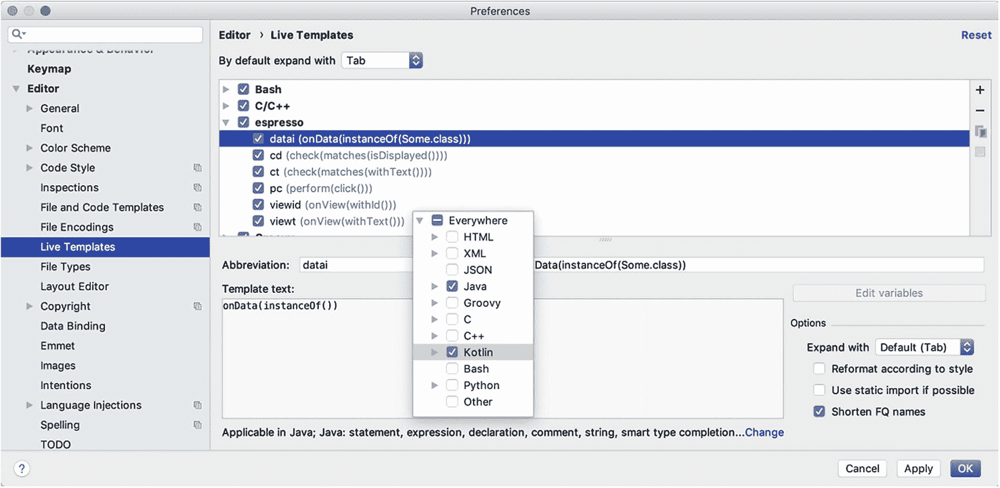
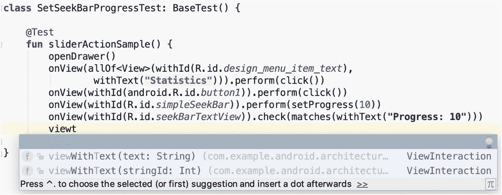
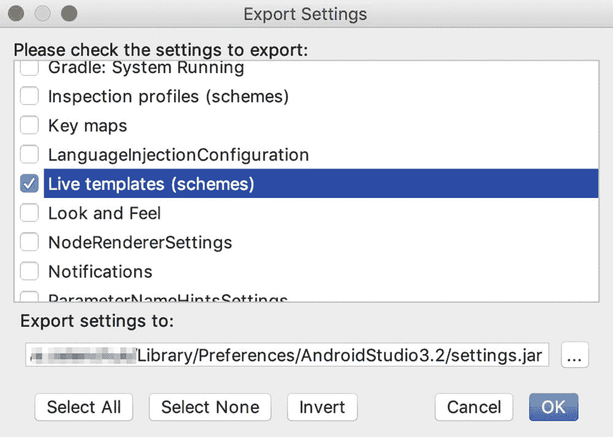

# 15. 提升生产力与测试非常规组件

本章包含其他章节未涉及的代码示例，以及一些可能提高日常测试编写效率的 Espresso 测试技巧。

## 创建参数化测试

有时我们可能需要编写一个适用于许多类似情况的单一测试。例如，我们可能需要一个测试来验证同一个 `EditText` 字段在提供不同 `String` 值作为输入时的表现。在这种情况下，可以使用 `JUnit Parameterized` 自定义运行器。它允许我们在一个参数化类中编写一个测试（[`github.com/junit-team/junit4/wiki/parameterized-tests`](https://github.com/junit-team/junit4/wiki/parameterized-tests)）。下面的示例演示了一个带有单个参数的参数化测试类。

*chapter15.parameterizedtest.ParameterizedTestSingleParameter.kt*

```
/**
* 带单个参数的参数化测试。
*/
@RunWith(value = Parameterized::class)
class ParameterizedTestSingleParameter(private val title: String) : BaseTest() {
@Test
fun usesSingleParameters() {
// 添加新的待办事项。
onView(withId(R.id.fab_add_task)).perform(click())
onView(withId(R.id.add_task_title))
.perform(typeText(title), closeSoftKeyboard())
onView(withId(R.id.fab_edit_task_done)).perform(click())
// 验证包含该标题的新待办事项已显示在待办事项列表中。
onView(withText(title)).check(matches(isDisplayed()))
}
companion object {
@JvmStatic
@Parameterized.Parameters
fun data() = listOf(
TodoItem().title,
TodoItem().title,
TodoItem().title)
}
}
```

在测试运行期间，`ParameterizedTestSingleParameter` 类的每个实例都将使用提供的 `title` 参数进行构造。因此，最终我们会有多少个参数，就会运行多少次测试。在这个例子中是三次。

具有多个测试参数的参数化测试类可以类似地创建，如下所示。

*chapter15.parameterizedtest.ParameterizedTestMultipleParameters.kt*

```
/**
* 带多个参数的参数化测试。
*/
@RunWith(value = Parameterized::class)
class ParameterizedTestMultipleParameters(
private val title: String,
private val description: String) : BaseTest() {
@Test
fun usesMultipleParameters() {
// 添加新的待办事项。
onView(withId(R.id.fab_add_task)).perform(click())
onView(withId(R.id.add_task_title))
.perform(typeText(title), closeSoftKeyboard())
onView(withId(R.id.add_task_description))
.perform(typeText(description), closeSoftKeyboard())
onView(withId(R.id.fab_edit_task_done)).perform(click())
// 验证包含该标题的新待办事项已显示在待办事项列表中。
onView(withText(title)).check(matches(isDisplayed()))
}
companion object {
@JvmStatic
@Parameterized.Parameters
fun data() = arrayOf(
arrayOf("item 1", "description 1"),
arrayOf("item 2", "description 2"),
arrayOf("item 3", "description 3"))
}
}
```

## 将测试聚合到测试套件中

为了运行可能属于或可能测试特定应用程序功能的一组测试，最好将它们组织成测试套件。`JUnit Suite Runner` 可能是一个合适的选择。它允许您手动构建一个包含来自许多测试类的测试的套件。实现方式如下。

*chapter15.testsuite.TestSuiteSample.kt*

```
/**
* 将测试类组织成测试套件。
*/
@RunWith(Suite::class)
@Suite.SuiteClasses(
AddToDoTest::class,
EditToDoTest::class,
FilterToDoTest::class)
class TestSuiteSample
```

这样，您可以根据被测试的功能或测试类型（例如冒烟测试、回归测试等）将测试组织成逻辑结构。


## 在 UI 测试中使用 AndroidStudio 的实时模板

许多现代集成开发环境（IDE）中的代码补全功能极大地提高了我们的编码效率。但得益于 AndroidStudio，我们拥有一个更强大的工具，可以助力我们更快速地编码——即实时模板。

`实时模板`是预定义的代码片段，通过输入其缩写即可插入到代码中。可以通过`Preferences` ➤ `Editor` ➤ `Live Templates`路径将它们添加到 AndroidStudio。这里有一组预定义的`Live Templates`分组，您也可以添加自己的分组或自定义实时模板。为此，请点击`+`按钮，然后选择相应选项。之后，您需要提供缩写名称、模板文本（即稍后将替换缩写而插入的代码片段）、可选的描述信息，以及模板生效的适用上下文。在本例中，我们选择了`Kotlin`和`Java`上下文，如图 15-1 所示。



**图 15-1** 添加实时模板

在特定上下文中使用时，只需输入模板缩写并按下`Tab`键即可。如图 15-2 所示。



**图 15-2** 通过输入缩写并点击`Tab`键使用实时模板

当您更换电脑或想要分享时，导出预定义的实时模板也非常简单。只需打开`File` ➤ `Export Settings …`菜单，然后选择`Live Templates`即可，如图 15-3 所示。



**图 15-3** 导出实时模板

为了方便您使用，一份简短的 Espresso 实时模板列表已创建，并导出为一个`.jar`文件，存放在 TO-DO 应用项目的以下路径中：`todoapp/book_assets/livetemplates.jar`。

## Espresso 的 Drawable 匹配器

另一种我们必须了解的自定义匹配器类型是`Drawable`匹配器。此匹配器类型可用于比较图标和图像。UI 测试中的这类验证并未得到广泛讨论，而且一般来说，Android 快照测试并不流行，只能通过使用第三方库来实现。为了覆盖这一领域，我们将额外的 drawable 验证作为 UI 测试的一部分引入。

那么我们将应用程序的 drawable 与什么进行比较呢？我们必须记住，测试是作为一个独立的应用程序构建的，它拥有自己的资源、上下文等。因此，解决方案很简单——我们将测试中会用到的应用程序 drawable 复制到测试应用程序资源中，并在 UI 测试中使用它们。以下是涵盖`TextView`和`ImageView` drawable 的`Drawable`匹配器实现。

`chapter15*.drawablematchers.DrawableMatchers.kt.*`

```
/**
 * Contains TextView and ImageView Drawable matchers.
 */
class DrawableMatchers {
    fun withTextViewDrawable(drawableToMatch: Drawable): Matcher {
        return object : BoundedMatcher(TextView::class.java) {
            override fun describeTo(description: Description) {
                description.appendText("Drawable in TextView $drawableToMatch")
            }
            override fun matchesSafely(editTextField: TextView): Boolean {
                val drawables = editTextField.compoundDrawables
                val drawable = drawables[2]
                return isSameBitmap(drawableToMatch, drawable)
            }
        }
    }
    fun withImageViewDrawable(expectedDrawable: Drawable?): Matcher {
        return object : BoundedMatcher(ImageView::class.java) {
            override fun describeTo(description: Description) {
                description.appendText("Drawable in ImageView $expectedDrawable")
            }
            public override fun matchesSafely(imageView: ImageView) =
                isSameBitmap(imageView.drawable, expectedDrawable)
        }
    }
    fun isSameBitmap(drawable: Drawable?, expectedDrawable: Drawable?): Boolean {
        var localDrawable = drawable
        var localExpectedDrawable = expectedDrawable
        // Return if null.
        if (localDrawable == null || localExpectedDrawable == null) {
            return false
        }
        // StateListDrawable lets you assign a number of graphic images to a single
        // Drawable and swap out the visible item by a string ID value.
        if (localDrawable is StateListDrawable
            && localExpectedDrawable is StateListDrawable) {
            localDrawable = localDrawable.current
            localExpectedDrawable = localExpectedDrawable.current
        }
        // BitmapDrawable - a Drawable that wraps a bitmap and can be tiled, stretched, or
        // aligned.
        if (localDrawable is BitmapDrawable) {
            val bitmap = localDrawable.bitmap
            val otherBitmap = (localExpectedDrawable as BitmapDrawable).bitmap
            return bitmap.sameAs(otherBitmap)
        }
        return false
    }
}
```

以下是它的用法。

`chapter15.drawablematchers.DrawableMatchersTest.kt`

```
/**
 * Demonstrates Drawable matchers usage.
 */
class DrawableMatchersTest : BaseTest() {
    @Test
    fun checkDrawableInMenuDrawer() {
        openDrawer()
        onView(withId(R.id.headerTodoLogo))
            .check(matches(DrawableMatchers()
                .withImageViewDrawable(getMenuIconDrawable())))
    }
    private fun getMenuIconDrawable(): Drawable? {
        val drawableId = com.example.android.architecture.blueprints.todoapp.mock.test
            .R.drawable.test_logo
        return InstrumentationRegistry.getInstrumentation().context.getDrawable(drawableId)
    }
}
```

在这个测试中，我们比较了 TO-DO 应用抽屉中显示的图标（主应用 drawable 中名为`logo.png`的图标）与测试应用 drawable 资源中存储的`test_logo`图标。

> **注意**  
> 无法同时从主应用和测试应用导入`R.class`文件，因此我们必须显式提供测试应用`R.class`的路径。

## 在 Espresso UI 测试中设置 SeekBar 进度

本节演示了如何使用自定义的 Espresso`ViewAction`来设置`SeekBar`的进度。从第 2 章我们知道如何创建自定义`ViewAction`，而`SeekBar`的情况是最简单的之一。

`chapter15*.setseekbarprogress.SeekBarViewActions.kt`

```
/**
 * ViewActions that operate on SeekBar
 */
object SeekBarViewActions {
    /**
     * Sets progress of a SeekBar.
     *
     * @param value - the progress value between min and max SeekBar value
     */
    fun setProgress(value: Int): ViewAction {
        return object : ViewAction {
            override fun getConstraints(): Matcher {
                return isAssignableFrom(SeekBar::class.java)
            }
            override fun getDescription(): String {
                return ("Set slider progress to $value.")
            }
            override fun perform(uiController: UiController, view: View) {
                val seekBar = view as SeekBar
                seekBar.progress = value
            }
        }
    }
}
```

在测试中的用法也很简单，如下所示。

`chapter15*.setseekbarprogress.SetSeekBarProgressTest.kt`


## 排版后的内容

```
/**
* 测试 SeekBar 变化。
*/
class SetSeekBarProgressTest: BaseTest() {
@Test
fun sliderActionSample() {
openDrawer()
onView(allOf(withId(R.id.design_menu_item_text),
withText(R.string.statistics_title))).perform(click())
onView(withId(android.R.id.button1)).perform(click())
onView(withId(R.id.simpleSeekBar)).perform(setProgress(10))
onView(withId(R.id.seekBarTextView)).check(matches(withText("Progress: 10")))
}
}
```

