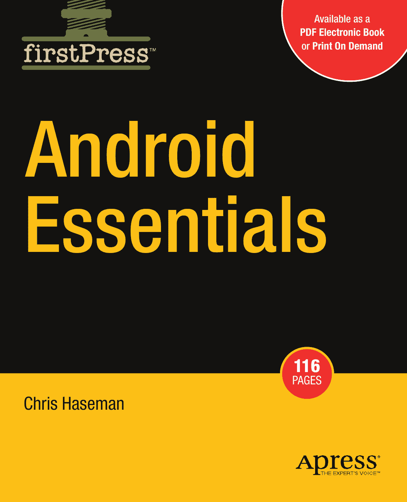
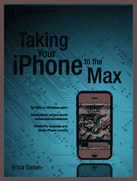
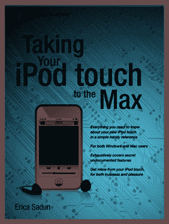

# Android 要点

专业人士为专业人士撰写的书籍®

提供 **PDF 电子书**版本

Apress 的 **firstPress** 系列是您了解前沿技术的源泉。Apress 的 firstPress 书籍篇幅短小、高度专注，并由专家撰写，能为您节省时间和精力。它们包含了您通过深入调研或每隔一周参加一次会议（如果时间允许的话）才能获得的信息。这些书籍涵盖了让您始终走在技术潮流前列的概念和技巧。Apress 的 firstPress 书籍是真正的书籍，**可选择电子版或按需印刷版**，即使技术本身尚不成熟，这些书籍也已臻完善。您不能错过它们。

