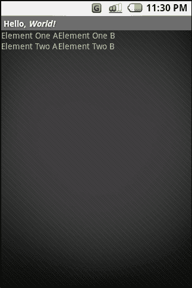
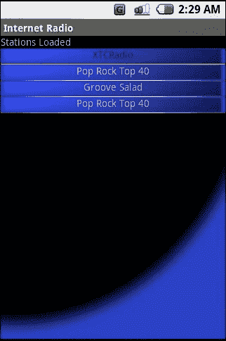

# 布局类型

所有元素按从上到下或从左到右的降序排列。每个元素可以具有 `gravity` 和 `weight` 属性，这些属性表示它们如何动态增长和收缩以填充空间。元素根据 `android:orientation` 参数按行或列排列。例如（见图 3-1）：

```
<LinearLayout xmlns:android=
["http://schemas.android.com/apk/res/android"](http://schemas.android.com/apk/res/android)
android:orientation="vertical"
android:layout_width="fill_parent"
android:layout_height="fill_parent"
>
<TextView
android:layout_width="wrap_content"
android:layout_height="wrap_content"
android:text="元素一"
/>
<TextView
android:layout_width="wrap_content"
android:layout_height="wrap_content"
android:text="元素二"
/>
<TextView
android:layout_width="wrap_content"
android:layout_height="wrap_content"
android:text="元素三"
/>
</LinearLayout>
```

**图 3-1. 线性布局示例**

`RelativeLayout`

每个子元素都相对于其他子元素进行布局。可以建立关联关系，使子元素从一个前一个子元素结束的位置开始。子元素只能关联到在其之前列出的元素。因此，请从 XML 文件的起始位置到末尾构建依赖关系。注意，需要指定 ID，以便控件可以相互引用。例如（见图 3-2）：

```
<RelativeLayout xmlns:android=
["http://schemas.android.com/apk/res/android"](http://schemas.android.com/apk/res/android)
android:layout_width="fill_parent"
android:layout_height="fill_parent"
>
<TextView
android:id="@+id/EL01"
android:layout_width="wrap_content"
android:layout_height="wrap_content"
android:text="元素一"
/>
<TextView
android:id="@+id/EL02"
android:layout_width="wrap_content"
android:layout_height="wrap_content"
android:text="元素二"
android:layout_below="@id/EL01"
/>
<TextView
android:layout_width="wrap_content"
android:layout_height="wrap_content"
android:text="元素三"
android:layout_toRight="@id/EL02"
/>
</RelativeLayout>
```

**图 3-2. 相对布局示例**

`AbsoluteLayout`

每个子元素必须在父布局对象的边界内指定一个特定位置。`AbsoluteLayout` 对象可能最容易构建和可视化，但最难迁移到新的设备或屏幕尺寸。例如（见图 3-3）：

```
<AbsoluteLayout xmlns:android=
["http://schemas.android.com/apk/res/android"](http://schemas.android.com/apk/res/android)
android:layout_width="fill_parent"
android:layout_height="fill_parent"
>
<TextView
android:layout_width="wrap_content"
android:layout_height="wrap_content"
android:text="元素一"
/>
<TextView
android:layout_width="wrap_content"
android:layout_height="wrap_content"
android:text="元素二"
android:layout_x="30px"
android:layout_y="30px"
/>
<TextView
android:layout_width="wrap_content"
android:layout_height="wrap_content"
android:text="元素三"
android:layout_x="50px"
android:layout_y="50px"
/>
</AbsoluteLayout>
```

**图 3-3. 绝对布局示例**

`TableLayout`

`TableLayout` 是一种布局对象，允许你指定表格行。Android 会尝试将每个子元素安排到正确的行和列中。例如（见图 3-4）：

```
<TableLayout xmlns:android=
["http://schemas.android.com/apk/res/android"](http://schemas.android.com/apk/res/android)
android:layout_width="fill_parent"
android:layout_height="fill_parent">
<TableRow>
<TextView
android:layout_width="wrap_content"
android:layout_height="wrap_content"
android:text="元素一 A"
/>
<TextView
android:layout_width="wrap_content"
android:layout_height="wrap_content"
android:text="元素一 B"
/>
</TableRow>
<TableRow>
<TextView
android:layout_width="wrap_content"
android:layout_height="wrap_content"
android:text="元素二 A"
/>
</TableRow>
</TableLayout>
```


```xml
<TableLayout>
  <TableRow>
    <TextView
      android:layout_height="wrap_content"
      android:text="元素二 A"
      />
    <TextView
      android:layout_height="wrap_content"
      android:text="元素二 B"
      />
  </TableRow>
</TableLayout>

**Android 基础**

**49**




***图 3-4：表格布局示例***

**50**

**Android 基础**


这些是你往后会用到的主要布局对象。每个示例都包含几个简单的 `TextView` 元素，用以展示每种布局类型下布局的呈现效果，并附有一张屏幕截图，显示每个 XML 文件将如何渲染。你可以在 Android 文档 [`code.google.com/android/`](http://code.google.com/android) 的 samples/ApiDemos/src/com/google/android/samples/view/ 中找到更详尽的示例。

**注意**

如果你是移动开发新手，在决定如何布局你的应用时，必须在脑海中重复一句格言：“移植，移植，再移植。”理想情况下，可以设置一种适用于所有可能设备的布局。但现实中，这永远行不通。如果你计划在不止一部手机上运行你的应用（正如大多数运营商要求的那样），请将重点放在动态和相对布局结构上。我保证，你使用的屏幕尺寸之后会发生显著变化。尽量减少绝对 X/Y 值的数量，并将你确实使用的值放在容易找到的位置。

接下来的任务是找到一份可以放置在布局内部的所有相关子元素的列表。该资源以令人困惑的文档形式存在于 [`code.google.com/android/`](http://code.google.com/android) refrence/android/R.styleable.html#Menu。

从那里，你可以着手处理第一个 UI 任务：为“社交尴尬”应用制作一个登录屏幕。这个登录屏幕将成为 `getSplashy` 示例应用的一部分。

**滚动、文本输入、按钮以及生活中所有简单的事情**

现在是时候使用其中一个布局类了。XML 布局非常适合用户输入、信息传递以及几乎所有屏幕内容相对静态的场景。你将向上文提到的“社交尴尬”应用添加一个简单的登录屏幕（见代码清单 3-1）。第一个任务是描述这个新视图中的屏幕外观。你将使用线性布局，这样只需垂直添加控件即可。（注意，这个 XML 需要在 `res` 文件夹中定义 `general_bg` 图片和 `disclaimer` 字符串。请从 Apress 网站下载本章的项目以获取更多信息。）

**代码清单 3-1 `/res/layout/login.xml`**

```xml
<ScrollView xmlns:android="http://schemas.android.com/apk/res/android"
  android:layout_width="fill_parent"
  android:layout_height="wrap_content"
  android:scrollbars="vertical">
  <LinearLayout
    android:orientation="vertical"
    android:layout_width="fill_parent"
    android:layout_height="fill_parent"
    android:background="@drawable/general_bg"
  >
    <TextView
      android:text="登录屏幕"
      android:layout_width="fill_parent"
      android:layout_height="wrap_content"
      android:textAlign="center"
      />
    <TextView
      android:text="用户名："
      android:layout_width="wrap_content"
      android:layout_height="wrap_content"
      />
    <EditText
      android:id="@+id/username"
      android:layout_width="fill_parent"
      android:layout_height="wrap_content"
      />
    <TextView
      android:text="密码："
      android:layout_width="wrap_content"
      android:layout_height="wrap_content"
      />
    <EditText
      android:id="@+id/password"
      android:layout_width="fill_parent"
      android:layout_height="wrap_content"
      />
    <Button
      android:id="@+id/loginbutton"
      android:layout_width="wrap_content"
      android:layout_height="wrap_content"
      android:text="登录"
      />
    <TextView
      android:id="@+id/status"
      android:layout_width="fill_parent"
      android:layout_height="wrap_content"
      android:textAlign="center"
      android:text="输入用户名和密码"
      />
    <TextView
      android:layout_width="fill_parent"
      android:layout_height="wrap_content"
      />
  </LinearLayout>
</ScrollView>
```


android:text="@string/disclaimer"

/>
</LinearLayout>
</ScrollView>

我将从前面的代码清单中摘取几行具体代码，并在接下来的章节中解释其作用。请记住，你尚未为组成这个屏幕的元素定义任何位置。但由于使用了`LinearLayout`对象，每个后续元素都会依次附加在前一个元素的底部。

# Android 基础

**53**


### 滚动

当视图尺寸超出设备屏幕大小时，只需将布局对象包裹在`ScrollView`中即可实现滚动。要启用垂直滚动条，你的`ScrollView`必须设置参数`android:scrollbars="vertical"`，这样只有在向下翻页时才会显示滚动条。为了让视图足够长以演示此对象，我在线性布局末尾添加了一个带有虚假免责声明的`TextView`。你会注意到，如果将之前的 XML 设置为活动视图，焦点会沿着对象下移，直到到达按钮，此时滚动条将处理向下键，并将用户移至文本底部。

### 深入解析 TextView

在前面的 XML 中，有两个主要的“小部件”在起作用。

**注意** Android 中的*小部件*指的是`View`对象的任何自包含子类。

对于标题和文本输入标签，你使用了`TextView`对象。对于用户控制的文本输入，你使用了`EditText`对象。最值得详细讲解的是最后的“状态”文本：

```
<TextView
android:id="@+id/status"
android:layout_width="fill_parent"
android:layout_height="wrap_content"
android:textAlign="center"
android:text="输入用户名和密码"
/>
```

首先，由于这个文本元素稍后会在运行时被源代码修改，因此你需要为其分配一个 ID。这样你就可以在之后使用`findViewById`方法来获取它的句柄。

**54**

**Android 基础**


如果`R.java`文件中尚不存在 ID `status`，`@+id/status`将会添加此 ID。当你首次在代码中引用它时，IDE 可能会报错。不过不用担心，因为第一次编译时一切都会解决。

接下来，你告诉`TextView`将其宽度设置为父容器的宽度，在本例中即`LinearLayout`对象。你通过为`layout_height`参数使用`wrap_content`来让高度由文本大小决定。你希望文本位于屏幕中央，因此使用了`textAlign`，因为你已将宽度设置为整个屏幕。最后，你为它提供了一些简单的文本，使其在 Activity 启动时显示。稍后，你将更改此文本以反映当前状态。

要查看这一成果，只需创建一个 Activity，并将此 XML 布局设置为主内容视图。你应该能够看到屏幕、在文本输入字段中键入内容并选中该框。然而，这些操作不会产生任何结果。要将它们与程序关联并使其可交互，你需要继续阅读。

### XML 布局

这里要传达的关键信息是，XML 布局方案既简单又强大。它为移动屏幕布局和设计提供了非编程接口。它还为开发者提供了在运行时动态打开并修改这些值的工具，接下来你将通过探索如何与 Android 的内置小部件交互来实践这一点。

## 唤醒小部件

我已经演示了如何使用 Android 的`TextView`、`Button`和`EditText`小部件。但如果无法获取用户输入的内容，文本输入字段又有何用呢？这是个反问句；无需回答——我也听不到（但愿如此）。答案显而易见：没有目的或结果的文本输入毫无用处。要访问你之前定义的`EditText`小部件的内容，你需要做两件事：

1.  获取你在 XML 中定义的小部件的对象句柄。

**55**

**Android 基础**


2.  监听登录按钮 widget 上的点击或选择事件。

### 获取句柄（Getting a Handle on Things）

首要任务是获取 XML 布局文件中定义的元素指针。为此，你需要确保每个想要访问的 XML widget 都包含 `android:id` 参数。如之前简要提到的，使用 `@+id/-id_name_here-` 这种表示法可以确保你的 `R.java` 文件包含所需的 ID。以下是一个示例，演示如何在应用程序启动时获取 `View` 对象的指针。这是添加到 `GetSplashy` 示例应用中的新登录 Activity 的 `onCreate` 方法：

```java
Button btn = null;

public void onCreate(Bundle args)
{
    super.onCreate(args);
    setContentView(R.layout.login);
    btn = (Button) findViewById(R.id.loginbutton);
}
```

这里你通过调用 `findViewById` 获取了登录按钮的指针。这允许你添加一个点击监听器，以便在按钮被选中（在触摸屏上使用触控笔）或通过中心软键选中时收到通知。你将以内联方式扩展 `ClickListener` 类，如下所示：

```java
public class loginScreen extends Activity
{
    private OnClickListener buttonListener =
        new OnClickListener()
        {
            public void onClick(View v)
            {
                grabEnteredText();
            }
        };
    ...
}
```

上述内联定义在接收到选中通知时，会调用 `grabEnteredText` 方法。现在你已经定义了点击监听器，可以在 `onCreate` 方法中使用 `btn` 引用了：

```java
public void onCreate(Bundle args)
{
    //...
    btn = (Button) findViewById(R.id.loginbutton);
    btn.setOnClickListener(buttonListener);
}
```

如果你在按钮监听器的 `onClick` 方法中设置断点，那么当你将焦点移动到登录按钮并选中它，或在模拟器中用鼠标点击它时，该断点都应该会触发。

### 获取文本（Reeling in the Text）

剩下的工作就是定义 `grabEnteredText` 方法，使其名副其实。在登录界面的最终生产版本中，你需要提取输入的文本，发起网络登录调用，并启动一个加载对话框。现在，我们只展示一个包含登录和密码字段输入内容的对话框。以下是更新后的登录 Activity 中 `grabEnteredText` 的实现：

```java
public void grabEnteredText()
{
    // 获取状态文本的指针
    TextView status = (TextView) findViewById(R.id.status);

    // 获取两个文本输入字段的句柄
    EditText username = (EditText) findViewById(R.id.username);
    EditText pwd = (EditText) findViewById(R.id.password);

    // 从 EditText 对象中提取字符串并格式化为字符串
    String usrTxt = username.getText().toString();
    String pwdTxt = pwd.getText().toString();

    // HTTP 事务会在这里启动一个新线程
    status.setText("Login" + usrTxt + " : " + pwdTxt);

    // 显示最终会转变为
    this.showAlert("Login Data", 0, "Login"
        + usrTxt + " : " + pwdTxt, "ok!", false);
}
```

首先，使用 `findViewById` 获取 `status`、`username` 和 `password` widget 的 `TextView` 和 `EditText` 指针。接着，通过获取 `TextEntry` 对象并将其转换为 `String` 类来提取文本输入 widget 的内容。最后，将两个字段的内容合并，添加到状态文本对象中，并弹出一个同样包含这两个字符串的对话框。

就是这样——你现在已经允许用户输入文本，并且完成了获取、操作甚至显示包含这些信息的对话框。

干得漂亮！花点时间拍拍自己的背，或者拍拍任何一个在你手臂可及范围内的人。

到目前为止，你已经了解了如何仅使用 XML 进行屏幕布局（“社交尴尬”的闪屏），以及刚刚在登录界面中如何使用两者的混合方式。Android widget 快车的最后一站将要求仅使用代码来构建屏幕布局。

### Java 中的 Widget


# 深入剖析

现在，你将深入剖析 Android 控件，亲自动手实践。我们将初步了解一些核心组件，其中许多你已在 XML 形式中探索过。与之前的示例一样，为了便于解释，我会保持基础性。你应该能够轻松地将这里讨论的内容应用于更复杂的 UI 布局场景。在后续更高级的示例中，你将更深入地接触其他 Android 控件。

当你看到我仅为了生成一个简单可选菜单所编写的代码量时，你可能会像我一样感到有些震惊。在掌握了 XML 屏幕布局之后，再尝试用 Java 手动完成所有工作，感觉就像用一双磨损的保龄球在钢琴上演奏古典音乐。请注意——这涉及大量代码输入，可能还会带来不少挫败感。

另一方面，UI 布局中可能有一些特定元素你需要**在运行时**动态调整。正如我之前提到的，由于应用运行时无法编辑 XML 布局文件，因此掌握在代码中随时修改用户界面任何部分所需的工具至关重要。Android 赋予了你这种能力，前提是你得习惯以闪电般的速度输入代码。

在接下来的示例中，我费尽心思确保你几乎不会用到之前依赖的 XML 元素。这应该能让你很好地掌握非 XML 布局，但请记住，实际上，你要疯狂到用这种方式实现所有用户界面屏幕，那才会出问题。

## 主菜单

几乎所有移动应用程序（至少在本节撰写时）都是从图形主菜单开始的。这个图形界面将用户引导至移动应用的各项功能。由于"主菜单"的概念在移动应用体验中如此普遍，因此它成为了一个绝佳且实用的案例研究。在本示例中，你的目标是构建一个简单且功能齐全的主菜单。为了便于对比，我们将使用另一个线性布局来整合所有内容。该示例将分三个主要阶段构建：

1.  **布局**：你将正确地在屏幕上排列主菜单的所有条目。当然，这只会用到 Android 巨大屏幕空间的一小部分。但大多数应用程序菜单会使用大图片，并占用显著更多的空间。
2.  **焦点**：你需要设置一个焦点结构，以便用户能够在元素之间移动。当焦点变化时，你必须调整每个菜单元素的颜色。
3.  **选择事件**：最后，你需要设置一个监听器，以便在元素被选中或点击时，能够获知信息并根据所选项目执行相应操作。

当你完成这三项任务后，应该就拥有了构建约 80% 移动应用主入口屏幕的框架。虽然这不完全实用（因为我完全没用 XML），但它极好地演示了如何以自定义的、运行时驱动的方式完成工作。随着你为"社交窘迫"应用添加更多功能，你将逐步完善这个主菜单。

### 布局，Java 风格

简单主菜单的第一步是将所有菜单元素放到屏幕上。正如我之前提到的，你将使用线性布局来实现。这一切都必须在应用首次绘制之前完成，因此必须放在新 `MainMenu` 活动的 `onCreate` 方法中。（如果你忘记了如何创建并接入一个新活动，请参考第 1 章。）代码清单 3-2 展示了其实例化和配置的样子。

**代码清单 3-2. 在 `onCreate` 方法中创建布局对象**

```
LinearLayout layout = new LinearLayout(this);
layout.setBackground(R.drawable.general_bg);
layout.setOrientation(LinearLayout.VERTICAL);
layout.setLayoutParams(
    new LayoutParams(LayoutParams.FILL_PARENT,
                     LayoutParams.FILL_PARENT));
setContentView(layout);
```

根据你目前所学的知识，这概念上应该很熟悉。你将使用 `/res/drawable/` 文件夹中的图片设置背景，将线性布局方向设置为垂直，并将 `LayoutParams` 设置为填充父容器。（这里的父容器是控制全屏的活动。）布局参数从根本上必须定义给定控件的高度和宽度。你之后可能会发现，在未设置布局参数的情况下尝试将控件放入 `ViewGroup` 会抛出异常。不过，既然现在有了一个要填充的布局对象，你就可以开始构建屏幕了。

### 添加标题

接下来，添加一个简单的标题，它将居中显示在主菜单屏幕的顶部。代码清单 3-3 展示了所需代码块。

**代码清单 3-3. 添加标题**

```
TextView title = new TextView(this);
title.setText(R.string.man_menu_title);
title.setLayoutParams(
    new LinearLayout.LayoutParams(
        LinearLayout.LayoutParams.FILL_PARENT,
        LayoutParams.WRAP_CONTENT));
title.setAlignment(Alignment.ALIGN_CENTER);
layout.addView(title);
```

创建文本对象，并从 `/res/values/strings.xml` 中设置文本。我知道我说过不会使用任何 XML，但恐怕在这点上我撒了点小谎。在实际产品中，你会希望将所有字符串移到这个位置，而不是在代码中定义。如果你的客户和我的类似，你总不希望每次他们想更改某个屏幕上的措辞时，你都要拿出源码编辑器重新编译吧。

现在有了标题，是时候添加更有趣、更活跃的菜单元素了。

### 布局菜单条目

接下来，你将添加各个菜单元素。因为第一个之后会变得相当重复，所以我将插入并解释第一个元素，剩下的就交给你自己处理了。欢迎前往 Apress 网站获取完整项目，查看其余菜单项。再次提醒，你在后续学习 Android 基础内容的过程中，将会逐步填充更多菜单项。代码清单 3-4 展示了添加单个菜单项的代码。

**代码清单 3-4. 添加菜单项**

```
TextView ItemOne = new TextView(this);
ItemOne.setFocusable(true);
ItemOne.setText("Login Screen");
ItemOne.setTextColor(Color.WHITE);
ItemOne.setLayoutParams(
    new LinearLayout.LayoutParams(
        LinearLayout.LayoutParams.FILL_PARENT,
        LayoutParams.WRAP_CONTENT));

//给菜单项一个 ID 以便跟踪。
//ID 是在类中本地定义的一个静态 int
ItemOne.setId(IdOne);

//将其添加到我们的线性布局中
layout.addView(ItemOne);
```

天哪，仔细阅读代码后，你可能会认为这看起来几乎和你已经添加的标题一模一样。你说得完全正确，真聪明。标记对象何时获得焦点、何时被选中这类繁重工作还没开始，所以先别太得意。上述菜单项与之前列出的标题文本有两个区别：

-   你需要通过调用 `setFocusable` 方法告知 `TextView` 它可以接受焦点。
-   菜单列表项需要一个 ID，以便你能够在选择处理程序中将其与其余菜单元素区分开来。

正如我简要提到的，每当向 `ViewGroup` 添加控件时，`LayoutParams` 对象必须明确是在该视图组内部定义的对象。例如，在上面的 `setLayoutParams` 方法调用中，你必须传入一个 `LinearLayout.LayoutParams` 对象。你必须传入正确的子类布局参数，否则 Android 会在运行时向你抛出异常。


### Android 基础：创建带焦点和选择功能的菜单

如前所述，为了制作菜单，我将再添加两个几乎与上一段代码完全相同的文本元素。为简洁起见，此处不再罗列。若想满足好奇心，请务必参考完整项目。现在所有菜单项已就绪，接下来需要在其获得或失去焦点时进行修改。

**聚焦吧，年轻学徒…**

要处理焦点变化事件，必须创建 `OnFocusChangeListener` 抽象类的一个实现。示例中在 `MainMenu` 活动类内部本地定义的版本，如代码清单 3-5 所示。

***代码清单 3-5：创建焦点监听器***

```
OnFocusChangeListener focusListener =
    new OnFocusChangeListener()
    {
        public void onFocusChanged(View v, boolean hasFocus)
        {
            adjustTextColor(v, hasFocus);
        }
    };

private void adjustTextColor(View v, boolean hasFocus)
{
    //危险的类型转换。请确保你只监听 TextView 的焦点变化，
    //否则可能导致严重错误。
    TextView t = (TextView)v;
    if(hasFocus)
        t.setTextColor(Color.RED);
    else
        t.setTextColor(Color.WHITE);
}
```

此外，你需要为菜单中每个可选元素添加以下代码行，以附加焦点变化监听器对象：`ItemOne.setOnFocusChangeListener(focusListener);`

监听器就位后，每当菜单元素获得或失去焦点时，你都会收到通知。在更高级的主菜单中，此方法可用来添加图像切换、动画、3D 爆炸效果或其他花哨的图形特效。在本例中，我们仅通过改变文字颜色来实现。现在用户可以通过颜色变化得知哪个菜单项被高亮，接下来需要响应他们按下中间键选择菜单项的操作。

**提示**

还可以使用 `setTextColor(ColorStateList colors)` 方法设置 `TextView` 的获得焦点、失去焦点和选中颜色，这是实现文本型主菜单的更简单方式。

在优秀的 IDE 中，达成目标的方法往往不止一种；我只是选择了更通用的方式（因为我希望你开发的应用程序能超越文本菜单）。关于 `setTextColor` 的更多信息，请参阅 Android 文档：[`code.google.com/android/reference/android/widget/TextView.html#setTextColor(int)`](http://code.google.com/android/reference/android/widget/TextView.html#setTextColor(int))。

**点击与选择事件**

你已经在前面的登录屏幕中学会了如何注册 `onClick` 事件，因此这部分内容应该能轻松掌握。代码清单 3-6 展示了捕获选择事件的示例代码。

***代码清单 3-6：添加选择监听器***

```
OnClickListener clickListener = new OnClickListener()
{
    public void onClick(View v)
    {
        String text = "你选择了菜单项：";
        switch(v.getId())
        {
            case IdOne:
                text += "1";
                startActivity(
                    new Intent(MainMenu.this, Login.class));
                break;
            case IdTwo:
                text += "2";
                startActivity(
                    new Intent(
                        "com.apress.example.CUSTOM_VIEW"));
                break;
            case IdThree:
                text += "3";
                break;
        }
        //稍后会介绍下面这一行
        status.setText(text);
    }
};
```

前面这个 `switch` 语句正是当初创建和布局 `TextView` 控件时调用 `setID` 的原因。当菜单项被指针选中或点击时，会调用 `onClick` 函数，并将对应视图作为参数传入。通过检查传入视图的 ID，可以判断哪个菜单项被选中，从而针对所选菜单执行相应操作。通过这种方式，你可以使用 `startActivity` 方法跳转到之前定义的登录屏幕，以及即将编写的自定义视图。

还剩最后一个小步骤，查看示例代码中 `onCreate` 函数的底部就能发现。你需要为视图添加点击监听器。在构建控件列表时，应执行以下这行代码：


### `ItemOne.setOnClickListener(clickListener);`

## ***回顾过往***

回顾一下由 Java 驱动的主菜单，你已经完成了几个重要的工作。

首先，你以编程方式实现了之前只能通过 XML 文件完成的布局。虽然完全手动操作并不实际，但这确实为你提供了在应用程序运行时修改和自定义 XML 视图的工具。

其次，你为所有菜单项注册了焦点变更事件。当焦点变更监听器被调用时，你更改了焦点所在项的颜色以突出显示它。在实际应用中，有更高效的方法可以实现同样的效果，但我假设你愿意用更——怎么说呢——更华丽的方式，来代替仅仅修改文本颜色。

第三，你学会了如何监听选择事件并做出响应，辨别出哪个项目被选中，并根据选择结果执行相应的操作。

同样，回顾所有这些手动在屏幕上绘制小部件所需的代码，其工作量相当大，但运用你刚刚学到的工具，你可以在应用运行时，根据数据和用户偏好来修改、增强和自定义菜单或列表的工作方式。然而，如果你需要更专业地控制屏幕绘制方式，就需要采用更不隐晦、更依赖代码的方法。

## 使用 Canvas 自定义 UI 渲染

这是所有初露头角的游戏开发者们期待已久的部分。Android 允许你通过简单地继承`View`类并实现`onDraw`方法来定义一个自定义的`View`对象。为了演示一个在动画循环中运行的自定义视图，我从旧金山探索馆的一个关于我们如何感知运动和声音的展品中汲取了灵感。你可以在[`www.exploratorium.edu/listen/index.php`](http://www.exploratorium.edu/listen/index.php)找到更多关于这个博物馆及该展品的信息。你可以在[`www.nature.com/neuro/journal/v7/n7/full/nn1268.html`](http://www.nature.com/neuro/journal/v7/n7/full/nn1268.html)购买相关的科学白皮书。

这个示例将动画演示两个球体相向运动，然后要么相互穿过，要么碰撞后弹开。这个示例旨在说明碰撞的声音可以决定人们看到的是物体穿过彼此，还是相互弹开。从代码角度来看，我将演示自定义视图的几个关键方面：

- 实现一个 Android 视图
- 使用`Canvas`对象绘制屏幕
- 创建一个动画循环
- 从 Activity 中修改自定义视图并与之交互

### 自定义视图

你可以通过两种方式自定义视图窗口。第一种是继承`View`类。这允许你通过创建一个`android.View`的有效子类来自行创建“小部件”。另一种方法（你需要自行探索）是继承现有的小部件，如`TextView`、`ProgressBar`或`ImageView`，并使用受保护的方法修改其行为。本示例展示的是第一种选项，因为它的范围更广，也更容易理解。

在最基本的层面上，自定义小部件会重写受保护的`onDraw`方法。代码清单 3-7 展示了这样一个方法的示例。

#### 代码清单 3-7. 在 CanvasExample Activity 中声明的简单自定义视图

```
protected class CustomView extends View
{
    public void onDraw(Canvas canvas)
    {
        Paint p = new Paint();
        p.setColor(Color.WHITE);
        canvas.drawText("Yo!", 0, 25, p);
    }
}
```

恭喜！通过键入这几行代码，你现在已经拥有了自己的自定义小部件。当然，它所做的只是像我那 17 岁的朋克表弟一样打招呼，但我猜你总得从某个地方开始。对于那些在 Java ME 中使用过`GameCanvas`对象的人来说，这应该看起来很熟悉。要接收`onDraw`调用，你需要将其设置为示例 Activity 的主内容视图。你还必须编写代码来实例化它并使其成为当前视图。代码清单 3-8


`显示了`CanvasExample`活动的外观。

***代码清单 3-8. 激活自定义视图***

```
CustomView vw = null;

public void onCreate(Bundle args)
{
    super.onCreate(args);
    vw = new CustomView(this);
    setTitle("弹跳还是放过，声音改变一切");
    setContentView(vw);
}
```

**68**

**Android 要点**

![][index-75_1.png]

你为示例活动设置了标题，因为你还没有给它指定应用程序名称。然后只需创建一个新的 `CustomView` 对象，并将其设置为当前内容视图。这将调用自定义小部件中的 `onDraw` 方法，并显示你有点另类的问候。现在，你已经掌握了以非常基本的方式在屏幕上绘制图形的技巧。你应该能够进入更复杂的渲染阶段，并启动你的动画循环。

**创建游戏循环**

正如所有游戏程序员都会告诉你的那样，大多数游戏的核心都是一个持续的循环。这个循环检查用户输入，并根据这些输入以及其他游戏动作，将新的帧绘制到屏幕上。

你示例应用程序中的循环在复杂性和独创性方面可能不会赢得任何奖项，但它能让你在自己的游戏渲染循环开发上迈出第一步。

**注意**

如果你想在 `View`/`ViewGroup` 层次结构之外实现自己的动画循环，请考虑使用 `SurfaceView` 对象构建一个循环。你可以在此处找到该对象的文档：[`code.google.com/android/reference/android/view/SurfaceView.html`](http://code.google.com/android/reference/android/view/SurfaceView.html)。

**加载音频和图像**

在开始绘制 `CustomView` 之前，你需要初始化时加载一些稍后会用到的资源。代码清单 3-9 展示了 `CustomView` 的新构造函数，其中包含了局部类变量的声明。

**Android 要点**

**69**

![][index-76_1.png]

***代码清单 3-9. 初始化自定义视图***

```
protected class CustomView extends View
{
    Context ctx;
    Paint lPaint = new Paint();
    int x_1=0,y_1=0;
    MediaPlayer player = null;
    Bitmap ball = null;
    boolean running = true;

    CustomView(Context c)
    {
        super(c);
        player = MediaPlayer.create(c, R.raw.bounce);
        BitmapDrawable d = (BitmapDrawable) getResources().getDrawable(R.drawable.theball);
        ball = d.getBitmap();
        ctx = c;
    }
    ...
}
```

在构造函数中，你通过 `R.java` 常量文件从 `/res/raw` 位置加载了弹跳媒体资源。由于之前你已经处理过其他几种资源类型，所以你应该对此驾轻就熟。你还需要加载一个将被绘制为“球”的图像。你通过资源管理器对象来完成此操作，该对象是从 `Context` 对象中获取的。虽然你之前没有在代码中明确地从资源位置加载过图像，但它看起来几乎与其他任何资源加载一样。

**实现循环…实现循环…实现……**

闲话少叙，代码清单 3-10 展示了 `CustomView` 对象的 `onDraw` 方法的内容。

**70**

**Android 要点**

![][index-77_1.png]

***代码清单 3-10. 动画循环的核心***

```
public void onDraw(Canvas canvas)
{
    //绘制白色背景
    Rect rct = new Rect();
    rct.set(0, 0, canvas.getBitmapWidth(), canvas.getBitmapHeight());
    Paint pnt = new Paint();
    pnt.setStyle(Paint.Style.FILL);
    pnt.setColor(Color.WHITE);
    canvas.drawRect(rct, pnt);

    //为精灵增加 X 和 Y 值
    x_1+=2;
    y_1+=2;

    //当球移出屏幕时重置循环
    if(x_1 >= canvas.getBitmapWidth())
    {
        x_1 = 0;
        y_1 = 0;
    }

    //绘制球 1
    drawSprint(x_1, y_1, canvas);

    //绘制球 2
    drawSprint(canvas.getBitmapWidth() - x_1, y_1, canvas);

    if(running)
        invalidate();
}
```

从顶部开始，你首先使用一个绘画样式对象和 `canvas.drawRect` 调用将背景涂白。这个绘画对象与 `Rectangle` 对象结合，会告诉画布绘制一个


一个覆盖整个屏幕的白色方块。接下来，你需要增加球精灵的 `x` 和 `y` 值。然后，如果它们漂移出了屏幕边界，你需要将它们复位，最后通过你自己的 `drawSprite` 调用来绘制它们。代码清单 3-11 展示了该函数的内容。

**Android 精要**

**71**


**代码清单 3-11. 绘制位图**

```java
protected void drawSprint(int x, int y, Canvas canvas)
{
    canvas.drawBitmap(ball, x, y, lPaint);
}
```

目前这个函数只是对 `drawBitmap` 方法的直接调用。我将这个方法单独提取出来，仅仅是因为在其他上下文中绘制精灵可能需要比这个简单示例更多的功能。最后，回到 `onDraw` 函数，只有当你的 `running` 标志为 `true` 时，才调用 `invalidate`。在 View 上调用 `invalidate` 是 Android 强制重绘的首选方式。在这里，你将使自身失效，这会调用 `onDraw`，然后整个过程重新开始。如果你在暂停或退出时简单地将 `running` 标志设为 `false`，并在恢复时再次使其失效，那么动画应该会与其父 Activity 的焦点保持同步。

**添加和控制声音**

由于听觉错觉需要能够打开和关闭两个物体相互碰撞的声音，你需要设置好撞击时播放的音频，然后构建一个让用户开启或关闭该音频的机制。

为了播放音频，将代码清单 3-12 中的代码添加到之前的 `onDraw` 函数中，因为它实际上也是游戏控制循环。当我提到“游戏循环”时，我指的是 `onDraw` 末尾的 `invalidate` 调用，它会在 Android 的 UI 事件循环中放置一个重绘请求。请记住，`playSound` 是一个在自定义 View 内部声明的布尔变量。

**72**

**Android 精要**


**代码清单 3-12. 播放和重载音频**

```java
if(playSound && canvas.getBitmapWidth() - x_1 -16 == x_1 + 16)
    player.start();
if(x_1 >= canvas.getBitmapWidth())
{
    x_1 = 0;
    y_1 = 0;
    player.stop();
    player.release();
    player = MediaPlayer.create(ctx, R.raw.bounce);
}
```

你可能已经注意到，当两个精灵相距 16 像素时，你开始播放音频。这是为了让音频开始播放而预留的一点缓冲时间。我应该说明，这更多反映了我编辑音频文件能力的不足，而非 Android 音频加载和播放时效率低下。你还必须确保仅在 `playSound` 布尔值为 `true` 时才播放音频。这个变量是定义自定义 View 的那个 `Activity` 类的成员。通过使用这个布尔变量，你可以在屏幕 Activity 中控制自定义 View 类。要开启或关闭音频，你只需在 Activity 中实现代码清单 3-13 中的方法。

**代码清单 3-13. 响应按键事件**

```java
public boolean onKeyDown(int key, KeyEvent kc)
{
    if(key == KeyEvent.KEYCODE_DPAD_CENTER)
    {
        playSound = !playSound;
        return true;
    }
    return super.onKeyDown(key, kc);
}
```

**Android 精要**

**73**


这段代码看起来应该与你如何关闭第 2 章中的恶作剧应用程序类似。

**整合所有内容**

如果你一直紧跟步骤（或者耍了点小聪明，直接下载了完成的项目），你应该能够运行该应用程序并观看这个错觉效果。按下中间的导航键可以开启或关闭音频。关闭音频时，看起来它们会穿过彼此；开启音频时，看起来它们会相互弹开，然后各奔东西。

在这个例子中，我演示了如何创建你自己的 View 子类，如何使用它在屏幕上绘制，如何设置游戏渲染循环，以及如何使用按键事件来控制这个简单的循环。

**使用用户界面**

在本章中，你详细学习了如何使用 Android 的 XML 模式来布局屏幕，以及如何通过一些 Java 代码在运行时与该模式进行交互和修改。


# Android UI 与游戏循环的进阶探索

接下来，你学习了如何仅通过源代码来布局 UI 控件和视图组。这种方法虽然在实际运用 Android 用户界面工具时不太实用，但为了深入理解其原理，仍然值得尝试。最后，你探索了构建游戏渲染循环的核心工具。你还将一些简单的多媒体和用户控制功能融入其中，创建了一个简单的听觉幻觉效果，足以让你的极客朋友们印象深刻。

**提示**

运用本章学到的所有知识，请使用 XML 为这个幻觉效果构建一个框架，其中包含一些解释性文本和一个边框。当活动启动时，渲染 XML 内容，并将自定义视图插入到正确的位置。对于这个任务，我建议使用一个 `RelativeLayout` 来布局，一个 `TextView` 来显示解释文本，以及一个 `Rectangle` 来绘制边框。

---

# 第 4 章：位置，位置，还是位置

在本章中，我们将探讨基于位置服务这一非常热门的话题。Android 的主要卖点之一是其对 Google Maps 基础设施的原生访问。虽然这是一个可选功能，但哪个运营商会不包含这个强大的软件包呢？我想，在接下来的一年左右时间里，我们就会知道答案了。本章将分两个主要部分深入探讨这个主题。首先，你将学习如何使用 Android 的 `LocationManager` 对象，它能够利用底层多种系统来测定你的纬度和经度。其次，你将学会如何驱使 Google Maps API 为你所用。值得注意的是，Android 对 GPS 和基站定位系统的支持尚未完全实现。在本书撰写时，你可以通过使用默认的模拟 GPS 数据（在加州湾区行驶的路线）或构建自己的伪造 GPS 数据来模拟 GPS 数据。我的示例将采用第一种方法，但我也会包含最终能够在正式手机上运行的代码。你可以在 Android 文档中找到更多关于构建自定义 GPS 路线以及基于位置服务（LBS）的详细信息，网址为 [`code.google.com/android/toolbox/apis/lbs.html`](http://code.google.com/android/toolbox/apis/lbs.html)。

通过示例，你将实现一个应用程序，该程序从示例 GPS 模块获取手机位置，启动一个 `MapActivity` 对象，将屏幕中心对准该位置，然后使用覆盖图在其上绘制一个图钉。

### 我在哪里？

总的来说，Android 的基于位置服务的工作方式与你的预期基本一致，只有一个小小的例外。Android 允许开发者指定使用哪种位置查询方法。这使你能够根据应用程序的具体用途，自定义功耗、成本和精度。

### 构建 LocationManager 对象

第一个任务是获取 `LocationManager` 对象的处理器，这是用于查找手机位置的高级对象。`LocationManager` 可以使用任意数量的 `LocationProvider` 对象来执行 GPS（或基站）定位。以下是相关的类变量声明以及后续的 `buildGPS` 方法，该方法将为稍后的位置检索做好准备：

```java
Point m_curLocation;
LocationProvider m_locationProvider;
LocationManager m_locationMgr;

private void buildGPS()
{
    List<LocationProvider> providorList = null;
    Criteria c = new Criteria();
    c.setAccuracy(50);
    c.setAltitudeRequired(false);
    c.setCostAllowed(false);
    c.setSpeedRequired(false);
    // 以下代码行已被注释掉，因为它会导致
    // android 陷入无限循环。
    //c.setPowerRequirement(c.POWER_LOW);
    m_locationMgr =
        (LocationManager)
        getSystemService(LOCATION_SERVICE);
    m_locationProvider = m_locationMgr.getBestProvider(c);
    if(m_locationProvider != null)
        return;
    providorList = m_locationMgr.getProviders();
    if(providorList.size() > 0)
        m_locationProvider = providorList.get(0);
}
```

你会注意到，你不能简单地实例化一个新的 `LocationManager`。


`object`。必须通过`Activity`类的公共成员`getSystemService`方法来获取它。

### 一项必备标准

声明相关变量后，您将构建一个（至少在 Android 设备问世前）毫无用处的`Criteria`对象。`Criteria`允许您指定所需查找方法的功能特性。

在本示例中，由于需要在城市环境中持续追踪用户位置，您需要低成本、低功耗且精准的定位方案。由于仅需将信息推送至 Google Maps 屏幕，因此无需速度或海拔数据。您将通过调用`Criteria`对象来指定所有这些变量，该对象最终会被传入`LocationManager`对象。

设定这些条件后，您可以请求最符合需求的最佳位置提供方。再次提醒，由于 Android 模拟器仅支持一个示例 GPS 存根，`getBestProvider`调用将返回`null`对象。

在真实硬件环境下，这些条件将更加有效甚至不可或缺。由于 LBS 条件被拒绝，我们直接获取位置提供方列表的第一个元素——至少在当前的 Android 软件版本中，该元素名为`gps`。

另请注意，低功耗要求已被注释掉。在发布时，启用此设置会导致 Android 陷入某种无限循环。Android 工程师们，请注意！

### 仰望星空，卫星在注视着你…

既然已经为定位服务奠定了基础，我们可以继续进行位置查询。应用程序将每五秒请求一次坐标，并将包含的`MapActivity`移动到正确位置（本章稍后将详细说明）。代码清单 4-1 展示了启动操作的代码。在您包含下一代码块中的代码之前，此代码无法编译，因为您需要定义`LocationUpdater`对象。

#### 代码清单 4-1 注册位置更新

```java
boolean running = true;

private void startLocationThread()
{
    try
    {
        LocationUpdater l = new LocationUpdater();
        registerReceiver(l,
            new IntentFilter("GPS_UPDATE"));
        m_locationMgr.requestUpdates(
            m_locationProvider, 5000,
            50, new Intent("GPS_UPDATE"));
    } catch (Exception e){}
}
```

要每隔五秒下载一次位置信息，您需要向位置管理器请求更新。首先，必须为`GPS_UPDATE`意图注册一个新的`LocationUpdater`。每次`LocationManager`有更新时，都会触发此意图。

**提示：** 建议在`onResume`活动方法中请求更新，并在调用`onPause`时停止更新。这样可以避免应用程序在非前台可见时消耗资源。

您可以指定使用哪个位置提供方（模拟器上为`gps`，但在实际设备上则为最接近您规格的提供方），并将时间间隔设为`5000`毫秒，最大距离变化设为`50`米。请记住，触发`GPS_UPDATE`意图需要同时满足这两个条件。

当然，要让这段代码生效，您需要定义`LocationUpdater`。我们将在示例 Activity 内部定义它，以便访问 Activity 的私有成员；参见代码清单 4-2。

#### 代码清单 4-2 定义意图接收器

```java
class LocationUpdater extends IntentReceiver
{
    public void onReceiveIntent(
        Context context, Intent intent)
    {
        Location here;
        if (m_locationProvider == null)
            here =
                m_locationMgr.
                getCurrentLocation("gps");
        else
            here =
                m_locationMgr.
                getCurrentLocation(
                    m_locationProvider.getName());
        setMapLocationCenter(
            here.getLatitude(),
            here.getLongitude());
    }
};
```

在上述代码中，当`LocationManager`发送`GPS_UPDATE`意图时，会调用`onReceiveIntent`函数。当收到五秒间隔（或 500 米位置变化）通知时，您将获取新位置并调用`setMapLocationCenter`来更新 Google Maps 对象上的手机位置。

至此，您已能每隔五秒获取手机的经纬度。既然有了位置信息，让我们编写代码在地图上显示这些信息。

**注意：** 在请求 LBS 数据时，别忘了在清单文件中添加正确权限。您需要添加`ACCESS_LOCATION`、`ACCESS_GPS`、`ACCESS_CELL_ID`和`ACCESS_ASSISTED_GPS`。顶级权限可让您访问常规定位服务。其他每个权限则允许您访问特定的位置追踪方法。请确保清单文件中包含`ACCESS_LOCATION`以及至少一种其他类型权限，否则您的`LocationProvider`将始终返回`null`。

### Google Maps

写一本关于 Android 的书，不可能避开这个话题。开发者们无不垂涎于配备 GPS 功能的手机与原生 Google Maps 实现所带来的无限可能。您可能已经翻到本章并优先阅读，这本身就说明了我们都在兴奋什么。

#### 海量的地图对象

在显示 Google Maps 屏幕时，您需要处理多个角色。快速了解所有主要角色是很有必要的。您需要像编排精妙的芭蕾舞一样协调它们，才能使地图屏幕正常运行。

- `MapActivity`是 Google Maps 家族的**老大**。`MapActivity`负责处理所有底层线程管理、网络连接以及基本的手势/按键处理。
- `MapView`是支持并显示地图的视图。它必须包含在`MapActivity`中。
- `MapController`是用于在屏幕上移动地图的对象。
- `OverlayController`是管理所有单个覆盖图形的**超级对象**。
- `Overlay`是绘制在`MapView`之上的单个可绘制对象。
- `Point`是单个经纬度位置。您将使用此对象来追踪手机的位置。

上面列出的每个对象（是的，有很多，而且之后不会有测验）在绘制地图和指示用户位置方面都扮演着重要角色。显然，您需要从`MapActivity`开始，因为它是包含所有其他内容的基础。以下是声明和类范围的变量列表：

```java
public class MapExampleActivity extends MapActivity
{
    MapView m_mapView;
    MapController m_mapController;
    Point m_curLocation;
    LocationProvider m_locationProvider;
    LocationManager m_locationMgr;
    OverlayController m_overlayController;
    boolean m_locationLoopActive = false;
}
```

其中一些变量看起来应该很眼熟，它们来自之前的位置示例代码。我在此列出它们，只是为了给您提供一些上下文。以下是初始化海量地图对象的`onCreate`方法：

```java
public void onCreate(Bundle ice)
{
    super.onCreate(ice);
    m_mapView = new MapView(this);
    m_mapController = m_mapView.getController();
    m_overlayController =
        m_mapView.createOverlayController();
    m_overlayController.add(new TackOverlay(this), true);
    m_mapController.zoomTo(9);
    buildGPS();
    setContentView(m_mapView);
}
```

如您所见，创建`MapView`只需要一个上下文指针。但是，如果您尝试在非`MapActivity`的活动中将其设置为内容视图，您将会陷入异常地狱。`MapController`（用于将地图移动到您的 GPS 位置）是从`MapView`对象中获取的。您将使用`MapView`创建`OverlayController`，并向其中添加`TackOverlay`对象的新实例。


好的，这是根据您的要求和注意事项，对给定文本进行翻译和格式整理后的 Markdown 文档。

---

在您的大脑中保留 `TackOverlay` 这一行代码，稍后您会回到它。最后，您将缩放级别设置为一个可以让您看到高速公路和城市的值。您还需要设置上一节中介绍和列出的 `GPS` 变量。完成所有这些之后，您最终可以将 `MapView` 设置为 `activeContent` 视图。

> **注意**：一个 `MapActivity` 可以包含不止一个 `MapView` 对象。您可以通过手动或通过 XML 来定义它和其他小部件，如第 3 章所述。在大多数情况下，`MapActivity` 类与 `Activity` 类非常相似……只是它为 `MapView` 对象提供了额外的资源和线程处理。

如果您按现状运行 `MapActivity`，您会看到 Google 地图启动并将您定位在俄克拉荷马州塔尔萨的某个中心位置。您需要咨询 Android 工程师为什么会出现这种情况；坦白说，我不知道为什么要把地图起点设在那里，但也许我只是在塔尔萨待得不够久。

## 移动地图

让我们看一下将地图移动到适当位置的代码。如果您还记得位置查找循环（试着快速说五遍！），您会记得这个方法调用：

```java
"setMapLocationCenter(here.getLatitude(), here.getLongitude());"
```

由于这是应用程序的下一步，让我们看一下这个简单方法的内容：

```java
public void setMapLocationCenter(double lat, double lon)
{
    m_curLocation = new Point((int)(lat * 1E6),
                              (int) (lon * 1E6));
    m_mapController.animateTo(m_curLocation);
}
```

现在您看到了著名的 `com.google.android.maps.Point` 对象的用法，不要把它与 `android.graphics.Point` 对象混淆，显然，这两个名字区别很大，所以很难混淆。`Map` 的 `Point` 对象允许您使用 `1E6` 表示法的构造函数设置其位置（如果您不是地图/GPS 爱好者，这意味着将 GPS 模块返回的值乘以 `1E6`，以免看起来您像是在非洲海岸附近的某个地方）。

现在您已将 GPS 输出转换为 Map 的 `Point`，您可以将屏幕上的地图移动到以该点为中心。您可以通过地图控制器调用 `animateTo` 来实现这一点。

本节的最后一步是当用户按下中心键时启动位置循环。到现在，您应该已经是这方面的专家了；事实上，我敢打赌您已经很擅长了，我甚至不需要解释下面的代码：

```java
public boolean onKeyDown(int KeyCode, KeyEvent evt)
{
    super.onKeyDown(KeyCode, evt);
    switch(KeyCode)
    {
        case KeyEvent.KEYCODE_DPAD_CENTER:
            if(!m_locationLoopActive)
            {
                m_locationLoopActive = true;
                startLocationThread();
            }
            return true;
            break;
    }
    return false;
}
```

## 阶段性总结

如果您一直按此操作，当您按下中心键时，应该会看到地图移动到旧金山湾区的某个位置。此外，随着时间的推移，地图将随着模拟手机的运动而平行移动。恭喜您——如果您的应用程序运行在真实的手机上，您将低头看到自己的头顶……打个比方。

如果您作弊并下载了示例代码，那么您的聪明才智得 5 分，但因为缺乏创造力要扣 20 分。作弊者会注意到，在手机当前所在位置（如果您没有通过点击鼠标移动地图，则为屏幕中心）会绘制一个蓝色的图钉。这个蓝色的、黏糊糊的东西，除了证明我糟糕的 Photoshop 技能之外，还是 Google 地图示例的最后一部分。显示地图的一半乐趣在于在地图上标记东西。因为这个例子，以及本书的书名是《Android 基础》而不是《我来为你写手机应用，好吗？》，所以它会直截了当且简单。您将在当前用户的位置上绘制一个图钉叠加层。

## 是鸟，是飞机……不，是糟糕的 Photoshop

正确地渲染一个叠加层比你最初想象的要复杂一些。它需要两个主要组件：`OverlayController` 对象和扩展的 `Overlay` 对象。叠加控制器管理每个叠加层，并确保在 `MapView` 重绘自身后调用其 `draw` 函数。如果您还记得，我在这里插入一下，因为您可能不想回头翻，您必须在 `onCreate` 方法中创建一个叠加控制器。代码如下：

```java
m_overlayController = m_mapView.createOverlayController();
```

每个可绘制的 `Overlay` 都必须添加到 `OverlayController` 中。同样，这是您在之前的示例中使用的代码行：

```java
m_overlayController.add(new TackOverlay(this), true);
```

`TackOverlay` 是 `Overlay` 对象的一个扩展。任何时候您想绘制自己的“图钉”，都必须扩展 `Overlay` 对象。当然，只要有一点高效的创造性编程，一个自定义的 `Overlay` 对象就能绘制所有叠加层。出于本示例的目的，您将扩展 `Overlay` 对象并添加必需的 `draw` 方法。`draw` 方法将在地图重绘自身后被调用。以下是 `TackOverlay` 的声明、类变量和构造函数；您将在 `MapActivity` 内部内联声明它，以便它可以访问您 `MapActivity` 的变量和函数：

```java
class TackOverlay extends Overlay
{
    MapExampleActivity ctx;
    Bitmap tack;

    TackOverlay(MapExampleActivity c)
    {
        super();
        BitmapDrawable b = (BitmapDrawable)
            c.getResources().
            getDrawable(R.drawable.tack);
        tack = b.getBitmap();
    }
```

正如您所见，`TackOverlay` 看起来就像任何其他 Android 对象扩展一样。使用上下文指针，您将保存图钉位图资源，这样在绘制时就不必每次都加载它。当您深入研究 `draw` 方法时，代码会变得更有趣一些。

```java
public void draw(Canvas canvas, PixelCalculator calculator,
                 boolean shadow)
{
    super.draw(canvas, calculator, shadow);
    int xy[] = new int[2];
    try{
        // 将中心点转换为 XY 坐标。
        // 我们可以硬编码这个，
        // 但那样有什么乐趣呢？
        if(m_curLocation == null)
            return;
        calculator.getPointXY(m_curLocation, xy);
        int tackX = xy[0] - (tack.getWidth()/2);
        int tackY = xy[1] - (tack.getHeight());
        canvas.drawBitmap(tack, tackX, tackY, new Paint());
    }
    catch (Exception e)
    {
        Log.e("Crap!");
    }
}
```

前面的代码中没有什么令人费解的地方。唯一需要记住的技巧是，您需要将存储在 `m_curLocation` Point 对象中的经纬度坐标转换成屏幕上的 XY 坐标。为此，`Overlay` 对象会随着 `draw` 方法传入一个 `PixelCalculator` 对象。这个对象负责提供与经纬度位置相对应的 XY 坐标。因为 `TackOverlay` 对象是在 `MapExampleActivity` 内部内联定义的，所以它可以访问 `m_curLocation` 点变量。您将把这个点转换为 XY 位置。因为图钉状物体的点位于图像的底部和中间，所以您必须将它向上移动图钉资源的高度，并向左移动一半宽度。这应该会使图钉的尖端与计算出的 XY 位置对齐。

同样值得注意的是 `shadow` 布尔值的存在，尽管我尚未实现它。它会告诉您的叠加层是否应该绘制阴影。忽略它或不忽略它，由您决定。

至此，您已经完成了这个示例。您现在可以在手机 GPS 位置的地图上绘制一个有些变形的图钉。当然，您绘制的是一个伪造的模拟 GPS 位置，但您新的前沿 LBS 应用总得有个起点。

## 结束语


# 排版后内容

本章的目标并非详尽无遗漏地介绍 Android 版 Google Maps 的所有功能。我希望为你提供一个框架，让你能够自行探索这些内容。我介绍了如何通过`LocationManager`获取手机位置，以及如何将这些数值转换为 Google Maps 中的位置坐标。

接着，我讲解了如何启动`MapActivity`并在屏幕上绘制地图。最后，你学习了如何让地图在国家范围内平移动画，以及如何绘制覆盖层或标记对象。

这些内容应该能为你后续的开发奠定坚实的基础。我建议你进一步探索搜索功能、绘制多个覆盖层，以及在框架内嵌入 Google 地图视图（可配合说明文字、图形或控制指示器）。

**Android 精要**

**87**


# 第 5 章：带 Android 出门溜达

在本章中，你将超越基础知识，松开缰绳，让 Android 稍微舒展一下筋骨。随着移动软件领域的发展，制作一个不严重依赖网络的应用程序变得越来越不可能。在许多方面，功能完善的互联网接入已成为移动世界的基本要素之一。Android 网络层的深度和广度使得它无法被塞进一本小书的一个小章节中。因此，我将像之前一样，尝试为你提供制作生产级应用程序所需的基础知识。同时，如同之前的示例，你还会探索一些 Android 技术的周边知识点。

从基础开始，你将学习如何使用简单的 HTTP 连接下载、解析并列出远程 XML 文件的元素。在你的示例应用程序中，这些元素将是一个基础 XML 文件中包含的网络电台。事实上，你的整个示例应用程序将专注于构建一个简单的网络电台播放器。遗憾的是，Android 对音频流式传输的支持并未达到其文档所述的水平。因此，本章将更像是一次练习，而非一个功能完善的应用程序。

### 从网络加载列表

要制作这个漂亮的示例应用程序，你需要获取、解析并显示一个简单的电台列表。要做到这一点，我需要讲解从 HTTP 事务到`ListView`等一系列主题。作为一名参与过许多移动项目的工程师，我发现从网络下载列表并在屏幕上显示几乎是家常便饭。无论是从社交网络拉取“好友列表”，还是从在线游戏元素获取“高分榜”，下载、解析和显示列表都具有某种通用性。

**Android 精要**

**89**


虽然我意识到你可能不会很快制作一个流媒体音乐应用程序，但这个示例足够通用，可以作为基本网络操作和处理选择菜单的指南。另外值得注意的是，你正在执行的任务与第 3 章中自定义控件的工作几乎相同。坦白说，我不确定这种方法是否简单很多，但也许是因为我使用的方式过于基础，没有涉及到它本可以帮助处理的更复杂的部分。无论如何，闲话少说——让我们开始了解网络连接的基础知识。

### 首要任务...先做什么？

你的第一个任务是从服务器拉取 XML 文件。我制作了一个简单的 XML 示例文件（在你的最终应用程序中，这将由 PHP 脚本或 Java servlet 提供），并将其托管在我的网站上。在进一步深入之前，我将列出一些稍后需要的变量声明。无论是对于网络连接还是我们最终的可选择列表，代码清单 5-1 显示了类声明和变量转储。

***代码清单 5-1. 必备类变量***

```
public class StationPicker extends Activity {
    //在我们定义了 StationData 类之后
    //取消下一行的注释
```


//`Vector<StationData> stationListVector =`
//`new Vector<StationData>();`
`SAXParser parser = null;`
`XMLReader reader = null;`
//下一行代码请自行查阅。
//`XMLHandler handler = new XMLHandler();`
`ArrayAdapter<StationData> adapter = null;`

**90**

**Android 精要**


在上一个代码清单中，你看到的是完成这个小型示例应用所需的各种对象清单。你需要一个`Vector`来保存电台列表，一个`SAX`解析器、一个读取器和一个用于 XML 解析的处理程序。最后你还需要`ArrayAdapter`，之后你将用它来填充元素，以便在屏幕菜单中渲染。

此外，代码清单 5-2 展示了如何在`onCreate`函数中进行初始化。

***代码清单 5-2\. 设置 XML 解析***

```
{
    super.onCreate(icicle);
    try
    {
        //目前这可以是任何内容
        setContentView(R.layout.main);
        SAXParserFactory f =
            SAXParserFactory.newInstance();
        parser = f.newSAXParser();
        reader = parser.getXMLReader();
        reader.setContentHandler(handler);
        //下面这个函数的内容我们之后再处理。
        // 如果你在跟着做，
        // 先写个桩函数返回 null 即可
        initList();
    }
    catch (Exception e)
    {
        Log.e("StationPicker", "解析失败!");
    }
}
```

再次声明，我假设你对 Java 很熟悉，所以不会逐步讲解所有必需的步骤。如果你想要完整的上下文和相关代码，欢迎从网上获取该项目。至于`initList`方法，我会在后面章节中定义。目前，如果你在跟着做，可以遵循注释的建议，写一个返回 null 的桩函数。

**Android 精要**

**91**


**启动网络连接**

我选择在`ListActivity`的`onStart`方法中启动网络连接。通常，你可能会在启动时执行此操作一次，然后通过 intent 转到新的 Activity 来显示列表。但为了尽可能简化这个示例，我将在单个 Activity 中完成尽可能多的操作。这可以让你免于处理 intent 管理，并且让我有机会向你展示如何使用 UI 线程。更多内容将在后续章节介绍；现在，先关注网络！请参见代码清单 5-3。

***代码清单 5-3\. 创建并使用简单的 HTTP 连接***

```
public void onStart()
{
    super.onStart();
    Thread t = new Thread()
    {
        public void run()
        {
            HttpUriRequest request = null;
            HttpResponse resp = null;
            InputStream is = null;
            DefaultHttpClient client =
                new DefaultHttpClient();
            try{
                //构建请求
                request =
                    new HttpGet(
                        ["http://www.wanderingoak.net/stations.xml");](http://www.wanderingoak.net/stations.xml)
                //使用默认 HTTP 客户端设置执行请求；
                resp = client.execute(request);
                //取出响应实体
                HttpEntity entity= resp.getEntity();
```

**92**

**Android 精要**


```
                //从实体中获取响应流
                is = entity.getContent();
                //解析传入的数据
                reader.parse(new InputSource(is));
            } catch (Exception e)
            {
                Log.e("LoadStations","加载失败!");
            }
        }
    };
    t.start();
}
```

首先，你需要一个`DefaultHttpClient`实例。你可以直接通过`new`来创建它。接下来，创建一个新的`HttpGet`对象，并传入你的 XML 数据源的位置。然后，你可以使用新的请求对象在默认客户端上执行 HTTP 请求。这是一个阻塞操作（因此需要新线程），一旦`execute`方法返回，你就可以获取`HttpEntity`。从这个对象中，你可以获得一个包含响应体的`InputStream`。

如果最后的那个`reader`调用让你完全摸不着头脑，那很正常，因为我还没告诉你它是做什么的。是的，我知道没有它你的示例代码无法编译。稍等片刻，我马上就讲到。

**注意** `DefaultHttpConnection`对象的启动和运行速度，至少在当前版本的模拟器中，似乎慢得可怕。你可能需要通过调整`HttpClient`类的各种子类来获得更好的性能。具体效果可能有所不同，但如果你


# Android 基础知识

### 将数据放到合适的位置

需要快速简便的概念验证演示？默认方式可能就是最佳选择。

如前面代码所示，从服务器拉取少量 XML 数据（或任何数据）其实相当简单。你一直追问的`reader.parse`这行代码，就是对 SAX 解析器的简单调用。Android 提供了多种 XML 解析器供选择，鉴于我假设你已熟悉 Java 且为节省时间，这里就不再赘述了。

若你非要了解具体原理，欢迎下载示例代码自行查看。不过目前，只需知道解析器会将`StationData`对象填充到一个`Vector`中即可。**代码清单 5-4**展示了其定义。

***代码清单 5-4.** 定义数据容器类*

```
class StationData
{
    public String title = "";
    public String url = "";
    public String toString()
    {
        return title;
    }
}
```

为简便起见，我规避了常见的封装做法——不在私有`String`元素上定义 getter/setter 方法，而是直接访问类内部元素。如果你是 C/C++程序员，这看起来更像"结构体"而非"类"。请特别注意那个`toString`方法。此刻它看似无用（实际上也确实如此），但几段文字后你会明白它的重要性。XML 文件中的每个电台都将拥有独立的`StationData`对象。同样为了示例，**代码清单 5-5**展示了 XML 中单个电台元素的结构。

***代码清单 5-5.** 示例网络数据*

```
<xml>
    <stationList>
        <station>
            <title>流行摇滚 TOP40</title>
            <audioUrl>http://scfire-nyk-aa02.stream.aol.com:80/stream/1074</audioUrl>
        </station>
    </stationList>
</xml>
```

既然现在你可以通过`reader.parse`这行代码让 XML 解析器处理这些工作，那么就可以继续创建可选元素列表了。解析器会向`StationData`向量填充若干元素。接下来你的任务是将它们从向量中取出，并以用户可交互的方式呈现在屏幕上。

### 创建列表并验证功能

要让列表菜单正确运行需要几个步骤：首先需要将 Activity 转换为`ListActivity`并完成相关切换工作；接着将之前构建的向量中的元素插入列表；最后响应选择事件并开始播放理论上的音频流。同样，在生产版本中你可能需要多个 Activity，但为简单起见，此处将所有功能集中在一个 Activity 中实现。

#### 准备工作：拥抱列表

要显示可选择的电台列表，首要任务是将普通 Activity 升级为全新的`ListActivity`。以下是全新的类声明形式：

```
public class StationPicker extends ListActivity
```

这种转换带来了一些重要职责。若不履行这些义务，Android 会抛出大量异常。首先需要在默认布局文件中添加`ListView`，因为每个`ListActivity`都必须关联一个`ListView`。以下是示例`main.xml`的内容：

```
<?xml version="1.0" encoding="utf-8"?>
<LinearLayout xmlns:android="http://schemas.android.com/apk/res/android"
    android:orientation="vertical"
    android:layout_width="fill_parent"
    android:layout_height="fill_parent"
>
    <TextView
        android:layout_width="fill_parent"
        android:layout_height="wrap_content"
        android:text="正在加载电台..."
        android:id="@+id/loadingStatus"
    />
    <ListView android:id="@+id/android:list"
        android:layout_width="wrap_content"
        android:layout_height="wrap_content"
    />
</LinearLayout>
```

#### 添加适配器


其次，你需要在列表部件中添加一个适配器。你需要定义每个元素的外观。我们将创建一个包含单个文本元素的简单 XML 文件，并将其命名为 `list_element.xml`，其内容如代码清单 5-6 所示。

***代码清单 5-6. `res/layout/list_element.xml`***

```xml
<?xml version="1.0" encoding="utf-8"?>
<TextView id="@+id/textElement"
          android:layout_width="fill_parent"
          android:layout_height="wrap_content"/>
```

这个 `TextView` 向 Android 系统描述了列表中每个元素应呈现的外观。这里也是设置字体、彩色文本和背景资源的地方。虽然可以实现更复杂的列表元素，但稍后我才会深入探讨这些变体。

还记得我之前让你先存根的 `initList` 方法吗？代码清单 5-7 展示了它应有的实现，而不是仅仅返回 `null`。

***代码清单 5-7. 必做事项：为 `ListView` 添加适配器***

```java
private void initList()
{
    adapter = new ArrayAdapter<StationData>(
        StationPicker.this, R.layout.list_element);
    setListAdapter(adapter);
}
```

每个 `ListView` 都必须有一个对应的适配器。适配器有多种类型和风格。表 5-1 简要介绍了其中最重要的几种。

***表 5-1. 列表适配器***

| **列表适配器** | **描述** |
|---|---|
| 游标适配器 | 一种简单的适配器，非常适合列出 SQL 数据库的内容、搜索结果或其他通常以游标格式存储的数据。事实上，Google 文档中有一个使用游标适配器的优秀示例：`http://code.google.com/android/intro/tutorial-ex1.html`。 |
| 资源游标适配器 | 用于从静态 XML 文件构建可选列表的理想适配器。如果你的菜单/列表是已知元素的列表（例如主菜单、帮助主题列表或其他熟悉的目录信息），那么这款适配器就是你的不二之选。 |
| 数组适配器 | 我们在此示例中使用的适配器。如果你在编译时不确定列表中会包含什么内容（因为你事先不知道站点列表会是什么），那么这是将 XML 元素列表转换为可选列表的最简单方法。 |

目前，你已拥有一个功能完备但外观极其简陋的菜单列表，随时可以使用。现在你只需要添加一些数据！

### 向适配器中填充数据

将数据放入适配器很简单，但有一个前提：必须在 UI 线程中完成。你可能会问，我在说什么？UI 线程是一个特定的执行线程，它控制着重绘循环。

你会注意到，如果你启动一个新的普通 Java 线程，然后尝试更改当前视图、向列表适配器添加数据元素，或执行任何其他 UI 任务，Android 都会对你“大发雷霆”。所谓“大发雷霆”，是指它要么无法工作，要么会向你抛出一堆异常。

#### 重新获取 UI 线程

由于你启动了一个新的内联 Java 线程来处理阻塞的网络连接，现在你需要定义另一个“可运行”对象，以重新获得 UI 线程的“青睐”。幸运的是，Activity 包含一个用于为 UI 线程调度代码的方法。你将其添加到网络代码的末尾（参见代码清单 5-8）。为了上下文，我会重复最后几行。

***代码清单 5-8. 恢复 UI 线程***

```java
Thread t = new Thread()
{
    //---------
    //此处省略大量代码

    reader.parse(new InputSource(is));
    //在 UI 线程上运行我们的代码。
    UIThreadUtilities.runOnUIThread(
        StationPicker.this, r);
}
```

**注意**  
现在不要试图将上述代码粘贴到你的项目中并编译。你需要先定义那个可运行的 `r` 对象。请耐心等待几分钟，或者根据你的阅读速度，读完几段文字。

`UIThreadUtilities` 对象主要是一个静态类，它是一个


`Activity`类的`member`。你必须向`runOnUIThread`传入一个上下文对象，由于该指针指向当前运行的`Thread`而非`ListActivity`，你需要通过`StationPicker.this`获取`ListActivity`（`Context`的子类）。

那个`r`引用是一个“可运行对象（runnable）”，你稍后将定义它。

### 最后，添加数据

现在终于可以开始将`StationData`元素塞入`ArrayListAdapter`了。你将在之前提到的那个可运行对象`r`内部完成此操作（代码清单 5-9）。

**Android 要点**

**99**


**代码清单 5-9. 向适配器添加元素**

```
Runnable r = new Runnable()
{
    public void run()
    {
        TextView t =
            (TextView) findViewById(
            R.id.loadingStatus);
        t.setText("Stations Loaded");
        try{
            for(int i=0;
            i < stationListVector.size();
            i++)
            adapter.addObject(
                stationListVector.elementAt(i));
        }catch (Exception e) {}
        getListView().invalidate();
    }
};
```

由于你现在处于 UI 线程，可以修改加载状态文本的内容。更改状态信息后，即可开始向`ArrayAdapter`添加元素。只需循环遍历整个向量，并将每个条目添加到适配器中。你可能会问：列表元素如何知道该向构成列表中每个视觉元素的`TextView`插入什么文本？很简单，回顾一下你在`StationData`类中重写的`toString`方法。在构建列表时，`ArrayAdapter`会对数组中的每个元素调用`toString`方法，并将该文本显示在屏幕上。

### 选择...

现在你已经拥有了一个功能完备、可选择的电台列表！当然，当选中某个条目时，你还没有执行任何操作，所以需要处理这个问题。幸运的是，`ListView`与`ListActivity`的紧密集成让这件事变得轻而易举。只需重写受保护的方法：

**100**

**Android 要点**


```
protected void onListItemClick(
    ListView l, View v, int position, long id)
{
    StationData selectedStation =
        stationListVector.elementAt(position);
    MediaPlayer player = new MediaPlayer();
    try
    {
        player.setDataSource(selectedStation.url);
        player.start();
    }
    catch (Exception e)
    {
        Log.e("PlayerException", "SetData");
    }
}
```

我加入了这段音频代码，据我判断，它应该符合文档规范。但文档说它能工作，并不意味着它真的能工作。实际上，上面这段连接到 Shoutcast MP3 链接的代码不会抛出异常，但也无法播放。我只能希望 Android 工程师在应用发布前能解决这个问题。

网上一直有热烈的讨论和大量的示例代码。稍微用谷歌搜索一下，就能找到各种投机取巧的解决方案。

**注意** 这个示例应用中没有进行任何有用的错误处理。大多数情况下我只是捕获异常并打印到日志中。你最终的移动应用在错误处理方面必须做得比我现在更好，因为，相信我，移动设备上的网络连接有时确实不太稳定。

**Android 要点**

**101**


### 下一步

本章的最后一步是为`ListView`增添一点魅力。你需要为整个屏幕添加背景。这个过程看起来应该有点眼熟，因为你在之前的例子中已经做过类似的操作（见代码清单 5-10）。

**代码清单 5-10. Main.xml 中的线性布局 XML 代码块**

```
<LinearLayout xmlns:android=
    "http://schemas.android.com/apk/res/android"
    android:orientation="vertical"
    android:layout_width="fill_parent"
    android:layout_height="fill_parent"
    android:background="@drawable/bg"
>
```

`@drawable/bg`显然指向`/res/drawable/`目录中的一张图片。你还需要调整列表组件的宽度：

```
<ListView android:id="@+id/android:list"
    android:layout_width="fill_parent"
    android:layout_height="fill_parent"
/>
```


这样能防止菜单项逐个改变大小——我想你也会同意，那种效果看起来相当糟糕。将列表视图的布局宽度或高度设置为`wrap_content`会导致每个菜单项被单独包裹。想想看吧。

### 装饰菜单

你还可以对菜单进行一项更重要的修改，从而对它的渲染拥有更多控制权。

在定义适配器的 UI 元素时，Android 允许你指定一个大的菜单项对象，然后指向其中你想要编辑的`TextView`。之前，你只能指向单个预定义的`TextView`。代码清单 5-11 展示了新的列表元素布局文件的样子。

***代码清单 5-11\. 改进版 `list_element.xml`***

```xml
<?xml version="1.0" encoding="utf-8"?>

<LinearLayout xmlns:android=
["http://schemas.android.com/apk/res/android"](http://schemas.android.com/apk/res/android)
android:orientation="vertical"
android:layout_width="fill_parent"
android:layout_height="22dip”
android:background="@drawable/listbg"
>

<TextView android:id="@+id/textElement"
xmlns:android=
["http://schemas.android.com/apk/res/android"](http://schemas.android.com/apk/res/android)
android:layout_width="fill_parent"
android:layout_height="fill_parent"
android:textAlign="center"
/>

</LinearLayout>
```

在这段代码中，你添加了一个具有特定尺寸的线性布局。你还给它设置了背景`listbg.png`。有趣的是，Android 会缩放你的背景图片，以适配计算出的背景大小空间。你可能想知道——如果你已经做好了功课——为什么你要使用线性布局，而不是直接给之前的文本视图添加背景和尺寸。这纯粹是为了演示目的。我希望当你在制作一个比我好得多的应用时，能看到复杂的列表是如何组合起来的。在结束之前，你还需要更新代码中的一行来实现这个改动。这行代码位于`initList`方法中：

```java
private void initList()
{
adapter = new ArrayAdapter<StationData>(
StationPicker.this, R.layout.list_element,
R.id.textElement);
...............
setListAdapter(adapter);
}
```

在之前的`Adapter`初始化器中，你只指定了布局元素。现在你需要指向`/res/folder/`中一个包含更复杂列表元素的文件，同时还要提供一个指针，告诉 Android 将`StationData`对象的`toString`函数中获取的文本放置在哪里。

现在，如果你正确地完成了所有步骤（或者你偷懒下载了示例文件），你应该会看到布局显示为图 5-1。

坦白说，由于我那糟糕的平面设计技能，这个版本的 UI 实在算不上漂亮。可能也算不上好看。重点不是嘲笑我糟糕的图形设计感（尽管非常欢迎你这么做）。重点在于，这个示例应该向你展示如何让你的应用看起来比我的例子更好。现在你几乎可以用任何东西来构建这个菜单。

**104**

**Android 精华**




***图 5-1\. 装饰后的电台列表***

**Android 精华**

**105**


### 回顾

在本章中，你有机会让 Android 小试牛刀。我涵盖了基本的网络通信、一些更深入的 UI 布局，以及一些 XML 解析入门知识。

HTTP 层直截了当，使用起来也很方便，尽管有些繁琐和缓慢（至少在 OS X 模拟器上如此）。Android 显然具备深入研究代理、cookies、套接字级别连接以及更高级网络技术的能力。你已经学会了下载数据、使用 XML 数据，并通过 SAX 解析器将其填充到向量中。从这个`向量`中，你构建了一个列表，当点击列表项时，


# Android 开发核心知识

# 第 6 章：收尾工作

现在差不多该放下书本，开始动手编写你的 Android 应用了。在放你离开之前，我将快速回顾一下你走过的路以及你是如何走到这一步的。

## 应用的构建

我的首要任务是介绍 Android 应用的基本构建块。我还必须讲解如何创建新项目，以及构建和运行它的具体流程。正如我所讨论的，一个应用由一系列活动、意图接收器、服务以及内容解析器组成。我使用闪屏实现来演示活动，使用一个由短信触发的恶作剧应用来探索意图接收器和服务，最后通过一些简单的书签代码来深入内容解析器。

值得庆幸的是，Android 提供了一系列清晰简单的构建块，供您创建应用。活动构成了任何 Android 应用的骨干，而意图和意图接收器则充当着通信官的角色。服务和内容解析器则服务于非常特定的需求，例如后台进程和格式化数据传输。将所有这些部分组合在一起，你就拥有了一个强大的系统，能够快速开发出移动应用。

## 外表并非一切，但有时外表就是一切

一旦你开发了一个可运行的应用平台，你就可以让它看起来像是用户可能愿意付费的东西——当然，这取决于你的选择。在 Android 中，你可以通过两种主要方式来构建用户界面。你可以使用内置的小部件或视图，结合视图组，来创建一个分层的 UI 元素层级结构。或者，你也可以抛开这些现成的工具，仅使用画布以及一些简单的线条、圆形和位图渲染工具来自行绘制。Android 提供了 XML 布局，你可以用它来构建 UI 小部件的层次结构。此外，你还可以在代码中构建、操作和微调这些相同的视图和视图组。

通过结合使用这两种方法，你可以预先设计所有静态部分（预格式化的菜单、背景、帮助屏幕），同时在代码中添加和操作这些元素，以响应网络和动态数据。最后，你可以在代码和 XML 中指定画布区域，数据可以在这些区域中手动绘制。尽管 Android 的视图和视图组一开始可能过于复杂且难以使用，但在某些少数情况下，它们赋予开发者比我所知的任何其他平台更多的能力和灵活性。

为了探索这种原始的机会和灵活性，你编写了一个简单的登录/密码屏幕，仅使用原始 Java 代码和 `TextView` 对象创建了一个主菜单，最后还使用原始画布捣鼓了一些听觉错觉效果。

## 位置信息没那么重要，除非你凌晨 4 点想吃披萨

一旦你掌握了应用逻辑和用户界面的坚实基础，就可以转向更有趣、更激动人心的主题了。你可以探索诸如 Android 的 GPS 和 Google Maps 服务之类的主题。Android 为你提供了多种访问手机位置信息的方式。虽然模拟器上的实现相当粗糙，但文档表明，在最终的运行版本中可以实现更多功能。为了体验这两项强大的移动功能，你制作了一个功能稍弱的定位跟踪示例。一个蓝色的图钉——假设你做对了所有事情——会跟随模拟器假想的硅谷之旅。当在实际手机上运行时，该示例应该会选择一种更高效的定位方法，并使用那个同样烦人的图钉来跟踪用户。

## 解开 Android 的束缚，让它畅游互联网

最后，你抓住机会让 Android 自由地漫游互联网。你下载了一个简单的 XML 文件，解析它，将其内容推入一个列表，然后——由于 Android 不完整的网络层——在尝试让 Android 通过网络流式传输音频时失败了。在此过程中，你发现了适配器和列表视图在其原始和稍复杂形式下的乐趣。

## 总结

在所有这些章节中，我一直试图为你装备一个通用的基础，让你能够创建自己的移动应用。在我们短暂的相处时间里，要传达和解释所有可供你（Android 开发者）使用的选项，是不可能的。相反，我试图让你掌握基础知识、核心构建块，以及创造下一个 killer 应用所需的理解。

## 其他信息来源

随着 Android 越来越受欢迎，我相信你会看到越来越多的信息来源涌现出来。目前已经有不少博客、网站、维基、论坛和其他信息资源。进行几次有效的谷歌搜索就能让你入门。现在，请务必收藏好 Android 在线文档，地址如下：
[`code.google.com/android/documentation.html`](http://code.google.com/android/documentation.html)

还有一个团队正在将 Android 文档构建成 Javadoc 格式：
[`www.androidjavadoc.com/`](http://www.androidjavadoc.com/)

你可以在谷歌的“入门指南”中找到更多信息：
[`code.google.com/android/intro/index.html`](http://code.google.com/android/intro/index.html)

最后，教程中的一些更高级的主题（既然你已经基本掌握了基础）可以进一步帮助你。请务必在这里查看它们：
[`code.google.com/android/intro/tutorial.html`](http://code.google.com/android/intro/tutorial.html)

## 获取帮助

当你遇到困难时，谷歌也提供了一些有用的资源。这里是 Android 初学者论坛的链接：
[`groups.google.com/group/android-beginners`](http://groups.google.com/group/android-beginners)

此外，作为开发者，你的主要活动区域将是在更通用的论坛区：
[`groups.google.com/group/android-developers`](http://groups.google.com/group/android-developers)

也请务必查看其他的谷歌讨论组。它们可能是非常宝贵的资源。

## 是时候停止阅读，开始做出贡献了

说真的，我们作为移动开发者社区，需要帮助。目前，我们的成就包括发送彩信、下载 MP3 铃声，以及浏览一个封闭的小型网络花园。我们需要你，需要你的能力、你的干劲和你的创造力，来让这辆传说中的公交车掉头。裂缝已经开始显现。Verizon 和 AT&T 正在争夺“最开放网络”的头衔。人们在破解 iPhone SDK，而事实上，苹果也推出了自己的官方 SDK，尽管它充满了限制和约束。

极客们开始对移动世界做他们当年对桌面计算世界做过的事情。他们开始在重重阻碍下进行创新。在我看来，Android 代表了手机访问的最高级别，仅次于高通公司的 BREW SDK。这是我同意写这本书的主要原因之一（嗯，这个原因，以及我不想学习 Objective-C）。

如果设备制造商和运营商允许 Android 蓬勃发展，它代表着我们移动开发者所期待的突破性潜力。请站出来，利用开放手机联盟和谷歌给予我们的工具，用它创造出令人惊叹的东西。我们指望着你。祝你好运。

---

**版权**

Android 开发核心知识

© 2008 克里斯·哈斯曼


版权所有。未经版权所有者及出版人事先书面许可，本书的任何部分不得以任何形式或通过任何方式（电子或机械，包括影印、录音，或任何信息存储或检索系统）进行复制或传播。

ISBN-13（电子版）：978-1-4302-1063-4

ISBN-13（平装版）：978-1-4302-1064-1

本书中可能出现商标名称。为避免在每个商标名称旁都添加商标符号，我们仅在编辑层面使用这些名称，以维护商标所有者的利益，无意侵犯其商标权。

本书在美国的图书经销由 Springer-Verlag New York, Inc. 负责，地址：233 Spring Street, 6th Floor, New York, NY 10013；在美国以外的地区由 Springer-Verlag GmbH & Co. KG 负责，地址：Tiergartenstr. 17, 69112 Heidelberg, Germany。

在美国境内：电话 1-800-SPRINGER，传真 201-348-4505，电子邮件 orders@springer-ny.com，或访问 http://www.springer-ny.com。 在美国境外：传真 +49 6221 345229，电子邮件 orders@springer.de，或访问 http://www.springer.de。

如需了解翻译相关信息，请直接联系 Apress，地址：2855 Telegraph Ave, Suite 600, Berkeley, CA 94705。电话：510-549-5930，传真：510-549-5939，电子邮件：info@apress.com，或访问 http://www.apress.com。

本书中的信息按“原样”提供，不做任何担保。尽管在编写本书时已采取一切预防措施，但作者和 Apress 均不对任何人或实体因使用本书所含信息而直接或间接导致的任何损失或损害承担责任。

# 文档概要
- Android 精要
- 版权信息
- 目录
- 第 1 章：简介
    - 开始前需知
    - 如何最好地使用本书
    - 入门指南
        - 安装 Eclipse
        - 获取 Android SDK
        - 安装 Eclipse 插件
    - Android 项目
    - 运行、调试及制造各种混乱
- 第 2 章：应用程序
    - 活动状态
        - Android 与 Java ME 及 BREW 的对比
        - 功能性
        - 制作启动画面
            - 添加图像资源
            - 创建 XML 布局文件
            - 绘制启动画面
            - 时机至关重要
            - 暂停、恢复、循环往复
            - 基本按键处理
            - 清晰的意图
            - 运行它
            - Activity 的生命周期
            - 迄今为止
    - 创建 Intent 接收器
        - 设置准备
            - 这有什么实际用途？
            - 使用 Intent 接收器
            - 构建 Intent 接收器
            - 权限
            - 也给我发送短信！
        - 查看 Intent 接收器的实际运行
            - 短信里有什么？
        - 触发 Activity
            - 设置 Activity
    - 今天你想让谁难堪？
        - 对服务的紧张
            - 创建服务
            - 启动服务
            - 启动音乐
            - 仁慈之举
            - 清单文件
        - 报复的艺术与禅意
            - 完成它
    - 在 Android 中移动数据
        - 无耻的自我推广
            - 获取用户的浏览器书签
            - 搜索结果
        - 使用 Content Resolver 添加邪恶的企业网址
    - 均衡早餐的一部分
- 第 3 章：用户界面
    - 快速简便的 XML 布局
        - 布局方式
            - LinearLayout
            - RelativeLayout
            - AbsoluteLayout
            - TableLayout
        - 滚动、文本输入、按钮及生活中的所有简单事物
            - 滚动
            - 解析 TextView
            - XML 布局
    - 唤醒 Widget 组件
        - 获取控制权
        - 收拢文本
        - Java 中的 Widget 组件
        - 深入内部
            - 主菜单
            - Java 风格布局
            - 添加标题
            - 布局菜单项
            - 聚焦吧，年轻的学徒...
            - 点击与选择事件
            - 回顾
    - 使用 Canvas 进行自定义 UI 渲染
        - 自定义 View
        - 创建游戏循环
            - 加载音频和图像
            - 实现循环，实现循环，实现...
            - 添加和控制声音
        - 整合所有内容
    - 使用用户界面
- 第 4 章：定位，定位，定位
    - 我在哪？
        - 构建 LocationManager 对象
            - 必备标准
        - 抬头，挥手，卫星正在注视着你...
    - Google 地图
        - 海量的地图对象
        - 移动地图
        - 盘点现状
        - 是鸟，是飞机……不，是糟糕的 Photoshop 合成
        - 收尾
- 第 5 章：带 Android 出去散步
    - 从网络加载列表
        - 首要之事……是最重要的吗？
        - 让网络运转起来
        - 把数据放到合适的位置
    - 制作列表并检查它……
        - 设置：拥抱列表
        - 添加 Adapter
        - 将数据塞入 Adapter
            - 重新夺回 UIThread
        - 最后，添加数据
        - 选择……
    - 下一步
        - 装扮菜单
    - 回顾
- 第 6 章：收尾工作
    - 应用程序的诞生
        - 外观并非一切，当然，除非它是
        - 定位不太重要，除非你在凌晨 4 点需要披萨
        - 解开 Android 的枷锁，让它在互联网上自由驰骋
        - 总体概览
    - 其他信息来源
        - 获取帮助
    - 是时候停止阅读并开始行动了
