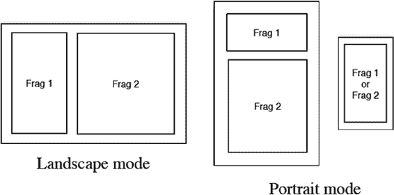

# 第 1 章：Fragments 基础

在 Android 的前两个主要版本中，小屏幕是主流。随后出现了 Android 平板电脑：屏幕尺寸为 10 英寸的设备。这使得事情变得复杂了。为什么？因为现在有如此多的屏幕空间，一个简单的 `Activity` 很难在保持单一功能的同时填满整个屏幕。在一个 `Activity` 中只显示邮件标题（填满大屏幕），而在另一个单独的 `Activity` 中显示单个邮件内容（也填满大屏幕）——这种电子邮件应用模式不再合理。有了那么多可用的空间，一个应用可以在屏幕左侧显示邮件标题列表，在屏幕右侧显示选中的邮件内容。能否在一个带有单一布局的 `Activity` 中实现这一点？嗯，可以，但你无法在任何小屏幕设备上重用该 `Activity` 或布局。

Android 3.0 引入的核心类之一是 `Fragment` 类，它专门设计用于帮助开发者管理应用程序功能，从而提供出色的可用性以及大量的可重用性。本章将向你介绍 `Fragment`：它是什么，如何融入应用程序的架构，以及如何使用它。`Fragment` 使得许多以前困难的有趣事情成为可能。大约在同一时间，Google 发布了一个适用于旧版 Android 的 `Fragment` SDK。因此，即使你对编写平板电脑应用不感兴趣，你也会发现 `Fragment` 在非平板设备上让你的生活更轻松。现在，为智能手机、平板电脑甚至电视和其他设备编写出色的应用比以往任何时候都更容易。

让我们开始学习 Android `Fragment` 吧。

**1**

[www.it-ebooks.info](http://www.it-ebooks.info/)

**2**

**第 1 章：Fragments 基础**

## 什么是 Fragment？

本节将解释什么是 `Fragment` 以及它的作用。但首先，让我们设个背景，看看为什么需要 `Fragment`。正如之前所学，在小屏幕设备上，Android 应用使用 `Activity` 向用户展示数据和功能，每个 `Activity` 都有相当简单且定义明确的目的。例如，一个 `Activity` 可能向用户显示通讯录中的联系人列表。另一个 `Activity` 可能允许用户输入电子邮件。

Android 应用就是将一系列这些 `Activity` 组合在一起，以实现更大的目标，例如通过阅读和发送消息来管理电子邮件账户。这对于小屏幕设备来说没问题，但当用户的屏幕非常大（10 英寸或更大）时，屏幕上有空间可以做更多事情，而不仅仅是单一功能。一个应用可能希望让用户同时查看收件箱中的邮件列表，并在列表旁边显示当前选中的邮件内容。或者，一个应用可能希望同时显示联系人列表以及当前选中的联系人的详细信息视图。

作为 Android 开发者，你知道可以通过为超大屏幕定义另一个包含 `ListView`、`Layout` 和所有其他视图的布局来实现此功能。而“另一个布局”指的是除了你可能已经为小屏幕定义的布局之外的布局。当然，你还需要为竖屏和横屏情况分别设置不同的布局。由于超大屏幕的尺寸，这可能意味着需要布局并为其提供代码的标签、字段、图像等视图会非常多。要是能有办法将这些视图对象分组，并整合它们的逻辑，以便应用的各个部分可以在不同屏幕尺寸和设备之间重用，从而最大限度地减少开发者维护应用所需的工作量，那该多好。而这正是我们拥有 `Fragment` 的原因。

## Fragment 基础知识

将 Fragment 视作一个子 Activity 是一种理解方式。事实上，Fragment 的语义与 Activity 非常相似。一个 Fragment 可以拥有一个与之关联的视图层次结构，并且其生命周期与 Activity 的生命周期非常类似。Fragment 甚至可以像 Activity 一样响应返回键。如果你曾想过：“要是能在平板的屏幕上同时放置多个 Activity 就好了”，那你的想法就对了。但是，因为在平板屏幕上同时使应用中的多个 Activity 保持活跃状态会过于混乱，所以 Fragment 被创建出来，以基本实现这一构想。这意味着 Fragment 被包含在 Activity 之内。Fragment 只能在 Activity 的上下文中存在；没有 Activity，你无法使用 Fragment。Fragment 可以与 Activity 的其他元素共存，这也就意味着你*不必*将 Activity 的整个用户界面都转换为使用 Fragment。你可以像以前一样创建 Activity 的布局，并且仅为用户界面的一部分使用一个 Fragment。

[www.it-ebooks.info](http://www.it-ebooks.info/)

然而，在保存状态以及后续恢复状态方面，Fragment 与 Activity 并不相同。Fragment 框架提供了若干特性，使得保存和恢复 Fragment 比你在 Activity 上需要做的工作要简单得多。

何时决定使用 Fragment 取决于一些考量因素，接下来将讨论这些因素。

## 何时使用 Fragment

使用 Fragment 的一个主要原因是为了能够跨设备和屏幕尺寸重用一部分用户界面和功能。这一点在平板上尤为明显。想象一下，当屏幕和平板一样大时，可以发生多少事情？它更像是一台台式电脑而非手机，并且你的许多桌面应用都具有多窗格用户界面。如前所述，你可以在屏幕上同时显示一个列表和所选项目的详情视图。在横屏模式下，列表在左、详情在右的场景很容易想象。但是如果用户将设备旋转到竖屏模式，此时屏幕的高度大于宽度怎么办？或许你现在希望列表显示在屏幕顶部，详情显示在底部。但如果此应用运行在小屏幕设备上，根本没有空间同时容纳这两个部分怎么办？难道你不想让列表和详情各自的 Activity 能够共享你为这些大屏幕部分构建的逻辑吗？我们希望你的答案是肯定的。Fragment 可以帮上忙。

图 1-1 使这一点更加清晰。

**图 1-1.** 用于平板电脑 UI 和智能手机 UI 的 Fragment

[www.it-ebooks.info](http://www.it-ebooks.info/)

在横屏模式下，两个 Fragment 可以很好地并排显示。在竖屏模式下，我们或许可以将一个 Fragment 放在另一个的上方。但是，如果我们试图在屏幕较小的设备上运行同一个应用，我们可能需要仅显示 Fragment 1 或 Fragment 2，而不同时显示两者。如果我们试图通过布局来管理所有这些场景，我们将需要创建相当多的布局，这意味着要努力在众多独立的布局中保持一切正确将十分困难。而使用 Fragment 时，我们的布局保持简单；每个 Activity 布局将 Fragment 视为容器，并且 Activity 布局无需指定每个 Fragment 的内部结构。

每个 Fragment 都拥有自己的布局来定义其内部结构，并且可以在多种配置中重用。

让我们回到旋转方向的例子。如果你曾经需要为 Activity 的方向变化编写代码，你会知道保存 Activity 的当前状态并在 Activity 重建后恢复状态是一件非常痛苦的事情。如果你的 Activity 有一些“块”，它们能够在方向变化时轻松保留下来，从而避免每次方向变化时都要进行销毁和重建，那岂不是很好吗？当然是。Fragment 可以帮上忙。

现在设想一下，用户正在你的 Activity 中工作，并且已经做了一些操作。再想象一下，用户界面在同一個 Activity 内发生了变化，用户想要后退一步、两步或三步。在旧式的 Activity 中，按下返回键将使用户完全离开当前 Activity。而使用 Fragment 时，返回键可以在当前 Activity 内部沿着 Fragment 堆栈向后移动。

接下来，考虑当一大块内容发生变化时的 Activity 用户界面；你希望使过渡看起来流畅，就像精心打磨过的应用一样。Fragment 也能做到这一点。

现在你对 Fragment 是什么以及为什么使用它有了些概念，让我们更深入地探讨一下 Fragment 的结构。

## Fragment 的结构

如前所述，Fragment 类似于一个子 Activity：它有一个相当明确的目的，并且几乎总是显示一个用户界面。但是，Activity 是 `Context` 的子类，而 Fragment 则是从 `android.app` 包中的 `Object` 类扩展而来的。Fragment *并非* `Activity` 的扩展。然而，与 Activity 类似，你总是需要扩展 `Fragment`（或其子类之一），以便覆盖其行为。

一个 Fragment 可以拥有一个与用户交互的视图层次结构。这个视图层次结构与其他任何视图层次结构一样，可以通过 XML 布局文件创建（inflate），也可以在代码中创建。如果希望用户看到该视图层次结构，它需要被附加到宿主 Activity 的视图层次结构上，这一点你很快就会了解到。组成 Fragment 视图层次结构的视图对象，与 Android 中其他地方使用的视图类型相同。因此，你所了解的关于视图的一切知识也都适用于 Fragment。

除了视图层次结构，Fragment 还有一个用作其初始化参数的 Bundle。与 Activity 类似，Fragment 可以被系统保存并随后自动恢复。当系统恢复一个 Fragment 时，它会调用默认构造函数（无参数），然后将这个参数 Bundle 恢复到新创建的 Fragment 中。

后续对 Fragment 的回调方法可以访问这些参数，并使用它们将 Fragment 恢复到以前的状态。因此，至关重要的是：

- 确保你的 Fragment 类有一个默认构造函数。
- 一旦你创建了一个新的 Fragment，就立即添加一个参数 Bundle，以便后续方法能够正确地设置你的 Fragment，并且系统能够在必要时正确地恢复你的 Fragment。

一个 Activity 可以在同一时间包含多个 Fragment；并且如果一个 Fragment 被另一个 Fragment 替换了，这个 Fragment 替换的事务可以被保存在一个返回栈上。返回栈由与 Activity 绑定的 FragmentManager 管理。返回键的行为正是通过这个返回栈来管理的。FragmentManager 将在本章后面讨论。这里你需要知道的是，一个 Fragment 可以知道它绑定到哪个 Activity，并可以通过该 Activity 获取到它的 FragmentManager。Fragment 还可以通过其宿主 Activity 访问 Activity 的资源。

与 Activity 类似，当 Fragment 被重建时，它可以将状态保存到一个 Bundle 对象中，并且这个 Bundle 对象会被传回给 Fragment 的 `onCreate()` 回调。这个保存的 Bundle 也会传递给 `onInflate()`、`onCreateView()` 和 `onActivityCreated()` 方法。

