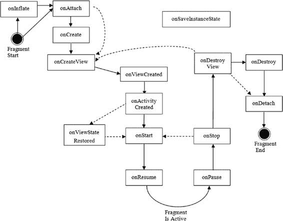

# Fragments 的生命周期

请注意，这个 bundle 与作为初始化参数附加的 bundle 不同。这个 bundle 是你可能用来存储 fragment 当前状态的，而不是应该用来初始化它的值。

## Fragment 的生命周期

在示例应用程序中使用 fragment 之前，你需要了解 fragment 的生命周期。为什么？因为 fragment 的生命周期比 activity 的生命周期更复杂，并且理解*何时*可以对 fragment 进行操作非常重要。图 1-2 展示了 fragment 的生命周期。

[www.it-ebooks.info](http://www.it-ebooks.info/)



**图 1-2：Fragment 的生命周期**

如果你将此图与 activity 的生命周期进行比较，你会注意到几个差异，这主要归因于 activity 和 fragment 之间所需的交互。fragment 高度依赖于它所在的 activity，并且当其 activity 经历一个步骤时，fragment 可能会经历多个步骤。

在最开始，fragment 被实例化。它现在作为内存中的一个对象存在。很可能发生的第一件事是初始化参数将被添加到 fragment 对象中。在系统从保存的状态重新创建 fragment 的情况下，这绝对是正确的。

当系统从保存的状态恢复 fragment 时，会调用默认构造函数，然后附加初始化参数 bundle。如果你是在代码中创建 fragment，一个很好的模式是使用 清单 1-1 中所示的模式，该模式在 `MyFragment` 类定义中展示了一种工厂类型的实例化器。

**清单 1-1：使用静态工厂方法实例化 Fragment**

```java
public static MyFragment newInstance(int index) {
    MyFragment f = new MyFragment();
    Bundle args = new Bundle();
    args.putInt("index", index);
    f.setArguments(args);
    return f;
}
```

从客户端的角度来看，他们通过调用静态的 `newInstance()` 方法并传递一个参数来获得一个新实例。他们返回实例化的对象，并且初始化参数已在此 fragment 的参数 bundle 中设置。如果这个 fragment 稍后被保存并重建，系统将经历一个非常相似的过程：调用默认构造函数，然后重新附加初始化参数。对于你的特定情况，你可以定义你的 `newInstance()` 方法（或方法们）的签名，以接收适当数量和类型的参数，然后适当地构建参数 bundle。这就是你希望 `newInstance()` 方法做的所有事情。后续的回调将负责 setup fragment 的其余部分。

### `onInflate()` 回调

接下来发生的是布局视图的填充。如果你的 fragment 是通过布局中的 `<fragment>` 标签定义的，那么 fragment 的 `onInflate()` 回调将被调用。这会将周围 activity 的引用、一个包含来自 `<fragment>` 标签属性的 `AttributeSet` 以及一个已保存的 bundle 传递进来。

已保存的 bundle 是包含已保存状态值的那个，如果这个 fragment 之前存在并且正在被重新创建，这些值由 `onSaveInstanceState()` 放置到其中。

`onInflate()` 的预期行为是，你读取属性值并将其保存以供后续使用。在 fragment 生命周期的这个阶段，对用户界面进行任何实际操作都为时过早。fragment 甚至还没有关联到它的 activity。但这是 fragment 要发生的下一个事件。

### `onAttach()` 回调

`onAttach()` 回调在你的 fragment 与它的 activity 关联后被调用。如果你需要使用，activity 的引用会被传递给你。你至少可以使用 activity 来确定关于其宿主 activity 的信息。你也可以将 activity 作为上下文来执行其他操作。


