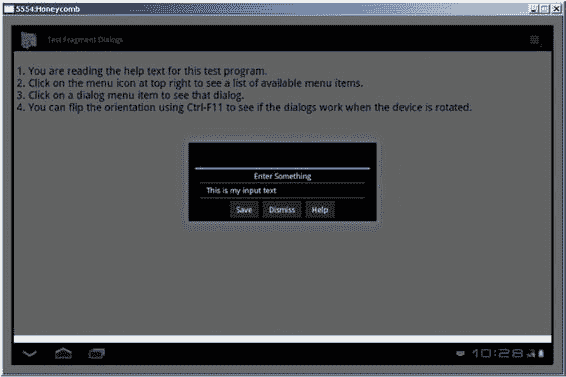

# 章节：使用对话框

Android SDK 为对话框提供了广泛支持。对话框是一个较小的窗口，会弹出于当前窗口前方，用于显示紧急消息、提示用户输入信息，或显示某种状态（如下载进度）。通常期望用户与对话框进行交互，然后返回到底层窗口继续使用应用。从技术上讲，Android 允许将对话框 Fragment 嵌入到 Activity 的布局中，我们也会涵盖这一点。

Android 明确支持的对话框包括：提示对话框、输入对话框、选择列表、单选、多选、进度条、时间选择器和日期选择器。（此列表可能因 Android 版本而异。）Android 也支持满足其他需求的自定义对话框。本章的主要目的并非逐一介绍这些对话框，而是通过一个示例应用来讲解 Android 对话框的底层架构。

基于此，你应该能够使用任意 Android 对话框。

需要注意的是，Android 3.0 新增了基于 Fragment 的对话框。Google 期望开发者仅使用 Fragment 对话框，即使在 Android 3.0 之前的版本中也如此。这可以通过 Fragment 兼容库实现。因此，本章重点介绍 `DialogFragment`。

## 在 Android 中使用对话框

Android 中的对话框是异步的，这提供了灵活性。然而，如果你习惯于对话框主要是同步的编程框架（例如 Microsoft Windows 或网页中的 JavaScript 对话框），你可能会觉得异步对话框不太直观。

对于同步对话框，对话框显示后的下一行代码会等到对话框被关闭后才执行。这意味着下一行代码可以查询用户按下了哪个按钮，或在对话框中输入了哪些文本。但在 Android 中，对话框是异步的。对话框一旦显示，下一行代码就会立即执行，即使此时用户尚未触碰对话框。你的应用必须通过实现对话框的回调来处理这一情况，以便应用能获知用户与对话框的交互。

这也意味着你的应用能够通过代码关闭对话框，这一功能非常强大。如果对话框正在显示忙碌消息（因为你的应用正在执行某项任务），一旦应用完成任务，它就可以通过代码关闭该对话框。

## 理解对话框 Fragment

在本节中，你将学习如何使用对话框 Fragment 来呈现一个简单的警告对话框，以及一个用于收集提示文本的自定义对话框。

### DialogFragment 基础

在我们展示提示对话框和警告对话框的工作示例之前，我们想先介绍对话框 Fragment 的高级概念。

对话框相关功能使用名为 `DialogFragment` 的类。`DialogFragment` 派生自 `Fragment` 类，其行为与 Fragment 非常相似。然后你将使用 `DialogFragment` 作为对话框的基类。一旦你从该类派生出自己的对话框（例如 `public class MyDialogFragment extends DialogFragment { ... }`），就可以通过 Fragment 事务将此 `MyDialogFragment` 作为对话框显示出来。代码清单 3-1 展示了实现此功能的代码片段。

*代码清单 3-1\. 显示一个对话框 Fragment*


```java
public class SomeActivity extends Activity
{
    //....其他活动函数
    public void showDialog()
    {
        //构造 MyDialogFragment
        MyDialogFragment mdf = MyDialogFragment.newInstance(arg1, arg2);
        FragmentManager fm = getFragmentManager();
        FragmentTransaction ft = fm.beginTransaction();
        mdf.show(ft, "my-dialog-tag");
    }
    //....其他活动函数
}
```

**注意** 我们在本章末尾的“参考资料”部分提供了一个可下载项目的链接。你可以利用这个下载来实验本章介绍的代码和概念。

从`清单 3-1`可以看出，显示对话框片段的步骤如下：
1. 创建一个对话框片段。
2. 获取一个片段事务。
3. 使用步骤 2 中的片段事务显示对话框。

接下来我们将逐一讨论这些步骤。

### 构造对话框片段

构造对话框片段时，其规则与构建任何其他类型的片段相同。推荐的模式是使用工厂方法，例如之前用到的 `newInstance()`。在该 `newInstance()` 方法内部，你使用对话框片段的默认构造函数，然后添加一个包含传入参数的参数包。你不需要在此方法中执行其他工作，因为必须确保此处的操作与 Android 从其保存状态恢复对话框片段时的操作一致。而 Android 所做的全部工作就是调用默认构造函数并为其重新创建参数包。

### 重写 `onCreateView`

当你继承对话框片段时，需要重写两个方法之一来为对话框提供视图层次结构。第一种选择是重写 `onCreateView()` 并返回一个视图。第二种选择是重写 `onCreateDialog()` 并返回一个对话框（例如由 `AlertDialog.Builder` 构建的对话框，稍后我们会介绍）。

`清单 3-2` 展示了重写 `onCreateView()` 的示例。

*清单 3-2. 重写* `DialogFragment` *中的* `onCreateView()`

```java
public class MyDialogFragment extends DialogFragment
    implements View.OnClickListener
{
    .....其他函数
    public View onCreateView(LayoutInflater inflater,
                             ViewGroup container, Bundle savedInstanceState)
    {
        //通过填充所需布局创建视图
        View v = inflater.inflate(R.layout.prompt_dialog, container, false);
        //你可以定位视图并设置值
        TextView tv = (TextView)v.findViewById(R.id.promptmessage);
        tv.setText(this.getPrompt());
        //你可以在按钮上设置回调
        Button dismissBtn = (Button)v.findViewById(R.id.btn_dismiss);
        dismissBtn.setOnClickListener(this);
        Button saveBtn = (Button)v.findViewById(R.id.btn_save);
        saveBtn.setOnClickListener(this);
        return v;
    }
    .....其他函数
}
```

在`清单 3-2`中，你加载了一个由布局标识的视图。然后你查找两个按钮并为其设置回调。这与你在第 1 章中创建详情片段的方式非常相似。但是，与早期的片段不同，对话框片段有另一种创建视图层次结构的方式。

### 重写 `onCreateDialog`

作为在 `onCreateView()` 中提供视图的替代方案，你可以重写 `onCreateDialog()` 并提供对话框实例。`清单 3-3` 为此方法提供了示例代码。

*清单 3-3. 重写* `DialogFragment` *中的* `onCreateDialog()`

```java
public class MyDialogFragment extends DialogFragment
    implements DialogInterface.OnClickListener
{
    .....其他函数
    @Override
    public Dialog onCreateDialog(Bundle icicle)
    {
        AlertDialog.Builder b = new AlertDialog.Builder(getActivity())
            .setTitle("我的对话框标题")
            .setPositiveButton("确定", this)
            .setNegativeButton("取消", this)
            .setMessage(this.getMessage());
        return b.create();
    }
    .....其他函数
}
```

在这个示例中，你使用警告对话框构建器来创建并返回一个对话框对象。这对于简单对话框效果很好。第一种重写 `onCreateView()` 的方式同样简单，并且提供了更大的灵活性。`AlertDialog.Builder` 实际上是 Android 3.0 之前版本的遗留产物。这是创建对话框的旧方法之一，你仍然可以在 `DialogFragments` 中使用它来创建对话框。如你所见，通过调用各种可用方法来构建对话框相当容易，就像我们在此处所做的那样。

### 显示对话框片段

一旦构造好对话框片段，你需要一个片段事务来显示它。与所有其他片段一样，对对话框片段的操作通过片段事务进行。

对话框片段的 `show()` 方法接受一个片段事务作为输入。你可以在`清单 3-1`中看到这一点。`show()` 方法使用片段事务将对话框添加到活动，然后提交该片段事务。但是，`show()` 方法不会将事务添加到返回栈。如果你想这样做，需要先将此事务添加到返回栈，然后将其传递给 `show()` 方法。对话框片段的 `show()` 方法具有以下签名：

```java
public int show(FragmentTransaction transaction, String tag)
public int show(FragmentManager manager, String tag)
```

第一个 `show()` 方法通过将片段以指定标签添加到传入的事务中来显示对话框。此方法随后返回已提交事务的标识符。

第二个 `show()` 方法自动从事务管理器获取一个事务。这是一个快捷方法。但是，当你使用第二种方法时，你无法选择将事务添加到返回栈。如果你想要这种控制，需要使用第一种方法。如果你只是想简单地显示对话框，并且当时没有其他理由需要处理片段事务，那么可以使用第二种方法。

对话框作为片段的一个好处是，底层的片段管理器会负责基本的状态管理。例如，即使在显示对话框时设备旋转，对话框也会重新生成，而无需你执行任何状态管理。对话框片段还提供了控制对话框视图显示框架的方法，例如标题和框架的外观。请参阅 `DialogFragment` 类的文档以了解这些选项的更多信息；本章末尾提供了此 URL。

### 关闭对话框片段

有两种方法可以关闭对话框片段。第一种是响应按钮或对话框视图上的某些操作，在对话框片段上显式调用 `dismiss()` 方法，如`清单 3-4`所示。

*清单 3-4. 调用* `dismiss()`

```java
if (someview.getId() == R.id.btn_dismiss)
{
    //使用某些回调通知此对话框的客户端
    //对话框正在被关闭
    //并调用 dismiss
    dismiss();
    return;
}
```

对话框片段的 `dismiss()` 方法会从片段管理器中移除该片段，然后提交该事务。如果此对话框片段存在返回栈，则 `dismiss()` 会将当前对话框弹出事务栈，并呈现上一个片段事务状态。无论是否存在返回栈，调用 `dismiss()` 都会导致调用标准的对话框片段销毁回调，包括 `onDismiss()`。

需要注意的一点是，你不能依赖 `onDismiss()` 来断定 `dismiss()` 是由你的代码调用的。这是因为当设备配置发生变化时也会调用 `onDismiss()`，因此它并不能很好地指示用户对对话框本身做了什么。如果对话框正在被...


当用户旋转设备时，即使没有点击对话框中的按钮，`DialogFragment`也会看到`onDismiss()`被调用。相反，你应该始终依赖对话框视图上明确的按钮点击。

如果用户按下了返回键，这会导致`onCancel()`回调在`DialogFragment`上触发。默认情况下，Android 会让`DialogFragment`消失，所以你不需要自己调用`dismiss()`。但如果你希望调用方`Activity`被通知对话框已被取消，你需要在`onCancel()`内部调用逻辑来实现这一点。这是`onCancel()`和`onDismiss()`在`DialogFragment`中的区别。使用`onDismiss()`，你无法确切知道是什么导致了`onDismiss()`回调被触发。你可能也注意到了，`DialogFragment`没有`cancel()`方法，只有`dismiss()`；但正如我们所说，当`DialogFragment`被按下返回键取消时，Android 会为你处理取消/关闭操作。

关闭`DialogFragment`的另一种方式是呈现另一个`DialogFragment`。关闭当前对话框并呈现新对话框的方式与仅仅关闭当前对话框略有不同。清单 3-5 展示了一个示例。

*清单 3-5. 为返回栈设置一个对话框*

```
if (someview.getId() == R.id.btn_invoke_another_dialog)
{
    Activity act = getActivity();
    FragmentManager fm = act.getFragmentManager();
    FragmentTransaction ft = fm.beginTransaction();
    ft.remove(this);
    ft.addToBackStack(null);
    //null represents no name for the back stack transaction
    HelpDialogFragment hdf =
        HelpDialogFragment.newInstance(R.string.helptext);
    hdf.show(ft, "HELP");
    return;
}
```

在单个事务中，你删除了当前的`DialogFragment`并添加了新的`DialogFragment`。这导致当前对话框从视觉上消失，新对话框出现。如果用户按下返回键，因为你已将此事务保存在返回栈中，新对话框将被关闭，之前的对话框将重新显示。例如，这是显示帮助对话框的一种便捷方式。

[www.it-ebooks.info](http://www.it-ebooks.info/)

**52**

**第 3 章：使用对话框**

### 对话框关闭的影响
当你向`FragmentManager`添加任何`Fragment`时，`FragmentManager`会为该`Fragment`管理状态。这意味着当设备配置发生变化（例如设备旋转）时，`Activity`会重启，`Fragment`也会重启。你在第 1 章运行 Shakespeare 示例应用并旋转设备时已经看到了这一点。

设备配置变化不会影响对话框，因为它们也由`FragmentManager`管理。但`show()`和`dismiss()`的隐式行为意味着，如果你不小心，很容易失去对`DialogFragment`的跟踪。`show()`方法自动将`Fragment`添加到`FragmentManager`；`dismiss()`方法自动从`FragmentManager`中移除`Fragment`。在开始显示`Fragment`之前，你可能有一个指向`DialogFragment`的直接指针。但你不能先把这个`Fragment`添加到`FragmentManager`，之后再调用`show()`，因为一个`Fragment`只能被添加到`FragmentManager`一次。你可能打算通过`Activity`的恢复来获取这个指针。然而，如果你显示然后关闭这个对话框，这个`Fragment`会被隐式地从`FragmentManager`中移除，从而剥夺了该`Fragment`被恢复和重新指向的能力（因为`FragmentManager`在它被移除后不知道这个`Fragment`的存在）。

如果你希望在对话框关闭后保留其状态，你需要在对话框之外——要么在父`Activity`中，要么在持久存在的非对话框`Fragment`中——维护状态。

### DialogFragment 示例应用
在本节中，你将回顾一个演示`DialogFragment`概念的示例应用。你还将研究`Fragment`与其包含它的`Activity`之间的通信。为了实现这一切，你需要五个 Java 文件：

- `MainActivity.java`：应用的主`Activity`。它显示一个包含帮助文本的简单视图以及一个可以启动对话框的菜单。
- `PromptDialogFragment.java`：一个`DialogFragment`示例，它定义了其自己的 XML 布局并允许用户输入。它有三个按钮：保存、关闭（取消）和帮助。
- `AlertDialogFragment.java`：一个`DialogFragment`示例，它使用`AlertBuilder`类在此`Fragment`内创建对话框。这是创建对话框的传统方式。

[www.it-ebooks.info](http://www.it-ebooks.info/)



**第 3 章：使用对话框**

**53**

- `HelpDialogFragment.java`：一个非常简单的`Fragment`，显示来自应用资源的帮助消息。创建帮助对话框对象时指定具体的帮助消息。这个帮助`Fragment`可以从主`Activity`和提示对话框`Fragment`中显示。
- `OnDialogDoneListener.java`：一个接口，你要求你的`Activity`实现它，以便从`Fragment`接收消息。使用接口意味着你的`Fragment`不需要太多了解调用它的`Activity`，只需知道它必须实现了这个接口即可。这有助于将功能封装在合适的位置。从`Activity`的角度来看，它有一种通用的方式从`Fragment`接收信息，而无需了解过多细节。

这个应用有三个布局：主`Activity`的布局、提示对话框`Fragment`的布局和帮助对话框`Fragment`的布局。注意，你不需要为警告对话框`Fragment`提供布局，因为`AlertBuilder`会在内部为你处理这个布局。完成后，应用看起来就像图 3-1。

***图 3-1.** DialogFragment 示例应用的用户界面*

[www.it-ebooks.info](http://www.it-ebooks.info/)

**54**

**第 3 章：使用对话框**

### Dialog 示例：MainActivity
让我们来看看源代码，你可以从本书的网站下载（参见“参考资料”部分）。我们将使用`DialogFragmentDemo`项目。在我们继续之前，打开`MainActivity.java`的源代码。

主`Activity`的代码非常直接。你显示一个简单的文本页面并设置一个菜单。每个菜单项调用一个`Activity`方法，每个方法基本做同样的事情：获取一个`FragmentTransaction`，创建一个新的`Fragment`，并显示该`Fragment`。注意，每个`Fragment`都有一个唯一的标签，该标签与`FragmentTransaction`一起使用。

这个标签会与`FragmentManager`中的`Fragment`关联起来，因此你之后可以通过标签名称定位这些`Fragment`。`Fragment`也可以通过`Fragment`的`getTag()`方法确定自己的标签值。

主`Activity`中的最后一个方法定义是`onDialogDone()`，这是一个回调，属于你正在实现的`OnDialogDoneListener`接口的一部分。如你所见，回调提供了调用你的`Fragment`的标签、一个指示对话框是否被取消的布尔值以及一条消息。就本示例而言，你只是希望将信息记录到`LogCat`；你也使用`Toast`将其显示给用户。`Toast`将在本章后面介绍。

### Dialog 示例：OnDialogDoneListener
为了能够知道对话框何时消失，创建一个你的对话框调用者实现的监听器接口。接口的代码位于`OnDialogDoneListener.java`中。


这是一个非常简单的接口，如你所见。你只为该接口选择一个回调，且该回调必须由 Activity 实现。你的 Fragment 无需了解调用者 Activity 的具体细节，只需知道调用者 Activity 必须实现 `OnDialogDoneListener` 接口；因此，Fragment 可以调用此回调来与调用者 Activity 进行通信。根据 Fragment 的功能，该接口中可能包含多个回调。在本示例应用中，你将接口与 Fragment 类定义分开展示。

为了更便捷地管理代码，你可以将 Fragment 监听器接口嵌入 Fragment 类定义本身，这样更容易保持监听器与 Fragment 之间的同步。

### 对话框示例：`PromptDialogFragment`

现在来看你的第一个 Fragment，`PromptDialogFragment`，其布局位于 `/res/layout/prompt_dialog.xml`，Java 代码在 `/src` 目录下的 `PromptDialogFragment.java` 中。

这个提示对话框的布局与你之前见过的许多布局类似。它包含一个作为提示信息的 `TextView`；一个用于接收用户输入的 `EditText`；以及三个按钮，分别用于保存输入、关闭（取消）对话框 Fragment，以及弹出帮助对话框。

`PromptDialogFragment` 的 Java 代码开头与你之前的 Fragment 类似。你有一个 `newInstance()` 静态方法来创建新对象，在此方法中，你调用默认构造函数，构建一个参数 Bundle，并将其附加到新对象上。接下来，你在 `onAttach()` 回调中有了新内容。你需要确保刚附加到的 Activity 已实现 `OnDialogDoneListener` 接口。为了测试这一点，你将传入的 Activity 强制转换为 `OnDialogDoneListener` 接口。代码如下：

```
try {
    OnDialogDoneListener test = (OnDialogDoneListener)act;
}
catch(ClassCastException cce) {
    // 在这里优雅地处理失败情况。
    Log.e(MainActivity.LOGTAG, "Activity is not listening");
}
```

如果 Activity 没有实现此接口，则会抛出 `ClassCastException`。你可以捕获此异常并更优雅地处理它，但本示例保持代码尽可能简单。

接下来是 `onCreate()` 回调。与 Fragment 的常见情况一样，你在这里不构建用户界面，但可以设置对话框样式。这是对话框 Fragment 特有的。你可以自行设置样式和主题，或者仅设置样式，同时使用主题值零（`0`），让系统为你选择合适的主题。代码如下：

```
int style = DialogFragment.STYLE_NORMAL, theme = 0;
setStyle(style,theme);
```

在 `onCreateView()` 中，你为对话框 Fragment 创建视图层级。

与其他 Fragment 类似，你不要将视图层级附加到传入的视图容器上（即，将 `attachToRoot` 参数设置为 `false`）。然后，你继续设置按钮回调，并将对话框提示文本设置为最初传递给 `newInstance()` 的提示信息。最后，你检查是否有任何值通过保存状态 Bundle（`icicle`）传入。这表示你的 Fragment 正在被重新创建，很可能是由于配置变更，并且用户可能已经输入了一些文本。如果是这样，你需要用用户已输入的内容填充 `EditText`。请记住，由于配置已更改，内存中实际的视图对象与之前不同，因此你必须找到它并相应地设置文本。

紧接着的下一个回调是 `onSaveInstanceState()`；这是你将用户当前输入的任何文本保存到保存状态 Bundle 中的地方。

`onCancel()` 和 `onDismiss()` 回调未展示，因为它们仅执行日志记录；你可以在 Fragment 的生命周期中看到这些回调何时触发。

提示对话框 Fragment 中的最后一个回调是用于按钮的。再次，你获取对封闭 Activity 的引用，并将其强制转换为你期望 Activity 已实现的接口。如果用户按下“保存”按钮，你获取输入的文本并调用接口的回调 `onDialogDone()`。此回调接受此 Fragment 的标签名称、一个表示此对话框 Fragment 是否已被取消的布尔值，以及一条消息，在此例中为用户输入的文本。以下是来自 `MainActivity` 的代码：

```
public void onDialogDone(String tag, boolean cancelled,
CharSequence message) {
    String s = tag + " responds with: " + message;
    if(cancelled)
        s = tag + " was cancelled by the user";
    Toast.makeText(this, s, Toast.LENGTH_LONG).show();
    Log.v(LOGTAG, s);
}
```

为了完成对“保存”按钮点击的处理，你随后调用 `dismiss()` 来关闭对话框 Fragment。请记住，`dismiss()` 不仅会在视觉上使 Fragment 消失，还会将 Fragment 从 Fragment 管理器中弹出，使其不再可用。

如果按下的按钮是“关闭”，你再次调用接口回调，这次不带消息，然后调用 `dismiss()`。最后，如果用户按下了“帮助”按钮，你不想丢失提示对话框 Fragment，因此你需要采取一些不同的操作。我们之前描述过这一点。为了记住提示对话框 Fragment，以便稍后能返回，你需要创建一个 Fragment 事务来移除提示对话框 Fragment，并使用 `show()` 方法添加帮助对话框 Fragment；这需要被添加到返回栈中。同时请注意，帮助对话框 Fragment 是如何通过引用资源 ID 来创建的。这意味着你的帮助对话框 Fragment 可以用于应用程序中可用的任何帮助文本。

### 对话框示例：`HelpDialogFragment`

你创建了一个 Fragment 事务，从提示对话框 Fragment 转到帮助对话框 Fragment，并将该 Fragment 事务放入了返回栈。这会使得提示对话框 Fragment 从视图中消失，但它仍然可以通过 Fragment 管理器和返回栈访问。新的帮助对话框 Fragment 会出现在其位置，允许用户阅读帮助文本。当用户关闭帮助对话框 Fragment 时，Fragment 返回栈的条目会被弹出，导致帮助对话框 Fragment 被关闭（从视觉上和 Fragment 管理器中移除），同时提示对话框 Fragment 恢复显示。

这是实现这一切非常简单的方法。它非常简单却又非常强大；即使在显示这些对话框时用户旋转设备，它也能正常工作。

查看 `HelpDialogFragment.java` 文件及其布局（`help_dialog.xml`）的源代码。此对话框 Fragment 的目的是显示帮助文本。

布局包含一个 `TextView` 和一个“关闭”按钮。Java 代码应该开始让你感到熟悉了。有一个 `newInstance()` 方法用于创建新的帮助对话框 Fragment，一个 `onCreate()` 方法用于设置样式和主题，以及一个 `onCreateView()` 方法用于构建视图层级。在这个特定情况下，你需要定位一个字符串资源来填充 `TextView`，因此你通过 Activity 访问资源，并选择传递给 `newInstance()` 的资源 ID。最后，`onCreateView()` 设置一个按钮点击处理器来捕获“关闭”按钮的点击。在此例中，你不需要在关闭时执行任何特殊操作。


### Dialog Fragment 调用方式

此片段通过两种方式被调用：从 Activity 以及从提示对话框片段调用。当此帮助对话框片段从主 Activity 显示时，关闭它只会将片段从栈顶弹出，并显示底下的主 Activity。当此帮助对话框片段从提示对话框片段显示时，由于帮助对话框片段是返回栈上片段事务的一部分，关闭它会导致片段事务被回滚，这会使帮助对话框片段弹出，但恢复提示对话框片段。用户会看到提示对话框片段重新出现。

### Dialog 示例：`AlertDialogFragment`

在本示例应用中，我们还有最后一个对话框片段要展示：警报对话框片段。虽然你可以用类似于帮助对话框片段的方式创建警报对话框片段，但也可以使用已在多个 Android 版本中运行良好的旧版 `AlertBuilder` 框架来创建对话框片段。请查看 `AlertDialogFragment.java` 中的源代码。

你不需要为这个片段提供布局，因为 `AlertBuilder` 会帮你处理。请注意，此对话框片段开始时与其他片段无异，但你没有 `onCreateView()` 回调，而是有 `onCreateDialog()` 回调。你需要实现 `onCreateView()` 或 `onCreateDialog()` 之一，但不能同时实现两者。`onCreateDialog()` 的返回值不是视图，而是一个对话框。

值得注意的是，要获取对话框的参数，你应该访问参数包（arguments bundle）。在本示例应用中，你只对警报消息这样做，但也可以通过参数包访问其他参数。

另请注意，对于这种类型的对话框片段，你的片段类需要实现 `DialogInterface.OnClickListener`，这意味着你的对话框片段必须实现 `onClick()` 回调。当用户对嵌入的对话框进行操作时，会触发此回调。再次强调，你会获得触发对话框的引用以及被按下的按钮指示。与之前一样，你应该小心不要依赖 `onDismiss()`，因为当设备配置发生变化时，它可能会被触发。

### Dialog 示例：嵌入式对话框

你可能已经注意到 `DialogFragment` 还有一个特性。在应用的主布局中，文本下方有一个 `FrameLayout`，可用于容纳对话框。在应用的菜单中，最后一项会导致一个片段事务将 `PromptDialogFragment` 的新实例添加到主屏幕。无需任何修改，对话框片段就可以嵌入在主布局中显示，并且其功能符合预期。

此技术的一个不同之处在于，显示嵌入对话框的代码与显示弹出对话框的代码不同。嵌入对话框的代码如下所示：

```
ft.add(R.id.embeddedDialog, pdf, EMBED_DIALOG_TAG);
ft.commit();
```

这与第 1 章中我们在 `FrameLayout` 中显示片段时的代码完全相同。然而，这次你需要确保传入一个标签名称，当对话框片段通知你的 Activity 用户输入时，会使用这个标签名称。

### Dialog 示例：观察结果

当你运行此示例应用时，请确保在设备的不同方向下尝试所有菜单选项。在对话框片段显示时旋转设备。你应该会满意地看到对话框会随着旋转而移动；你无需担心因配置变化而编写大量代码来保存和恢复片段。

我们希望你欣赏的另一件事是，片段与 Activity 之间可以轻松通信。当然，Activity 拥有或可以获取对所有可用片段的引用，因此它可以访问片段本身暴露的方法。这并不是片段与 Activity 之间通信的唯一方式。你可以


