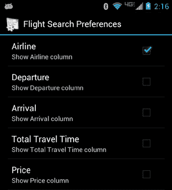

# 第四章：使用首选项与保存状态

Android 提供了一个健壮且灵活的框架来处理设置，也称为首选项。这里所说的设置，指的是用户为了按自己的喜好定制应用程序而做出并保存的功能选择。（在本章中，术语“设置”和“首选项”将互换使用。）例如，如果用户希望通过铃声或振动来接收通知，或者根本不接收通知，这就是用户保存的首选项；应用程序会记住该选择，直到用户更改它。Android 提供了简单的 API，隐藏了首选项的管理和持久化。它还提供了预构建的用户界面，你可以用它们让用户进行首选项选择。由于 Android 首选项框架内置的强大功能，我们还可以将首选项用于更通用的应用程序状态存储，以便在应用程序退出后又返回时，能够从上次离开的地方继续。

再举一个例子，游戏的高分可以存储为首选项，尽管你可能希望使用自己的 UI 来显示它们。

本章将介绍如何为你的应用程序实现自己的设置屏幕，如何与 Android 系统设置交互，以及如何使用设置来秘密保存应用程序状态，同时还提供最佳实践指导。你将发现如何让你的设置在小屏幕以及平板电脑等较大屏幕上看起来美观。

**61**

**第四章：使用首选项与保存状态**

## 探索首选项框架

Android 的首选项框架从单个的设置选择开始，构建到包含设置选择的屏幕层次结构。设置可以是二进制设置，例如开/关，也可以是文本输入、数值输入，或者是从选项列表中进行选择。Android 使用一个 `PreferenceManager` 来向应用程序提供设置值。该框架负责进行和持久化更改，并在设置即将更改或已经更改时通知应用程序。虽然设置被持久化在文件中，但应用程序不直接处理这些文件。这些文件被隐藏起来，你稍后会看到它们在哪里。

首选项可以通过 XML 或编写代码来指定。在本章中，你将使用一个示例应用程序来演示不同类型的选项。XML 是指定首选项的首选方式，因此该应用程序就是使用 XML 编写的。XML 指定了最底层的设置，以及如何将设置分组到类别和屏幕中。作为参考，本章的示例应用程序展示了如图 4-1 所示的以下设置。

**图 4-1.** 示例应用程序首选项 UI 中的主要设置。由于屏幕高度，此处将上半部分显示在左侧，下半部分显示在右侧。注意两幅图像之间的重叠部分。

**第四章：使用首选项与保存状态**

**63**


Android 提供了一个端到端的偏好设置框架。这意味着该框架允许你定义偏好设置，将其展示给用户，并将用户的选择持久化到数据存储中。你可以在`/res/xml/`目录下的 XML 文件中定义偏好设置。要向用户展示偏好设置，你需要编写一个 Activity 类，该类继承自一个预定义的 Android 类`android.preference.PreferenceActivity`，并使用 Fragment 来处理偏好设置的各个屏幕。框架会处理其余的工作（显示和持久化）。在你的应用程序中，代码会获取特定偏好设置的引用。通过偏好设置引用，你可以获取该偏好设置的当前值。

为了使偏好设置能够在用户会话之间保存，当前值必须存储在某处。Android 框架负责将偏好设置持久化到设备上应用程序`/data/data`目录下的一个 XML 文件中（见图 4-2）。

**图 4-2.** 应用程序已保存偏好设置的路径  
**注意** 你只能在模拟器中检查共享偏好设置文件。在真实设备上，由于 Android 的安全机制，共享偏好设置文件是无法读取的（当然，除非你拥有 root 权限）。

应用程序的默认偏好设置文件路径是`/data/data/[PACKAGE_NAME]/shared_prefs/[PACKAGE_NAME]_preferences.xml`，其中`[PACKAGE_NAME]`是应用程序的包名。清单 4-1 展示了本例中`com.androidbook.preferences.main_preferences.xml`数据文件的内容。

[www.it-ebooks.info](http://www.it-ebooks.info/)

**64**

**第 4 章：使用偏好设置与保存状态**

*清单 4-1. 我们的示例中已保存的偏好设置*

```xml
<?xml version='1.0' encoding='utf-8' standalone='yes' ?>
<map>
<boolean name="notification_switch" value="true" />
<string name="package_name_preference">com.androidbook.win</string>
<boolean name="potato_selection_pref" value="true" />
<boolean name="show_airline_column_pref" value="true" />
<string name="flight_sort_option">2</string>
<boolean name="alert_email" value="false" />
<set name="pizza_toppings">
<string>pepperoni</string>
<string>cheese</string>
<string>olive</string>
</set>
<string name="alert_email_address">davemac327@gmail.com</string>
</map>
```

如你所见，这些值存储在一个映射（map）中，偏好设置的键作为数据的名称。有些值看起来晦涩难懂，与展示给用户的内容并不匹配。例如，`flight_sort_option`的值是`2`。Android 并不存储展示给用户的文本作为偏好设置的值；相反，它存储一个用户看不到的值，你可以独立于用户所见内容来使用它。你希望能够根据用户的语言自由更改显示的文本，同时也希望能够在保持偏好设置文件中存储值不变的情况下调整显示的文本。如果该值是一个整数而不是某个显示字符串，你甚至可以对偏好设置进行更简单的处理。你无需担心解析此数据文件。Android 偏好设置框架提供了一个优秀的 API 来处理偏好设置，本章后面将对此进行更详细的描述。

如果你将清单 4-1 中的偏好设置映射与图 4-1 中的截图进行比较，你会注意到并非所有偏好设置都在偏好设置 XML 数据文件中列出了值。这是因为偏好设置数据文件不会自动为你存储默认值。稍后你将了解如何处理默认值。

现在你已经了解了这些值保存在哪里，接下来需要了解如何定义要展示给用户的屏幕，以便他们进行选择。

在了解如何将偏好设置收集到屏幕中之前，你将学习可以使用的不同类型的偏好设置，然后你将了解如何将它们组合到屏幕中。`/data/data` XML 文件中的每个持久化值都来自一个特定的偏好设置。所以，让我们理解每一项的含义。


[www.it-ebooks.info](http://www.it-ebooks.info/)



