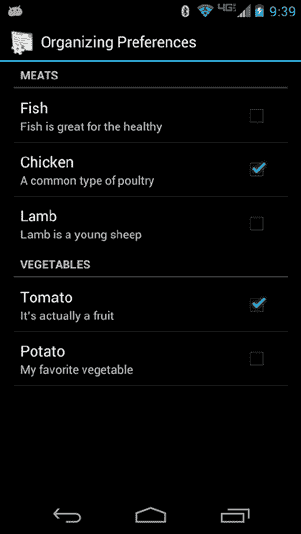
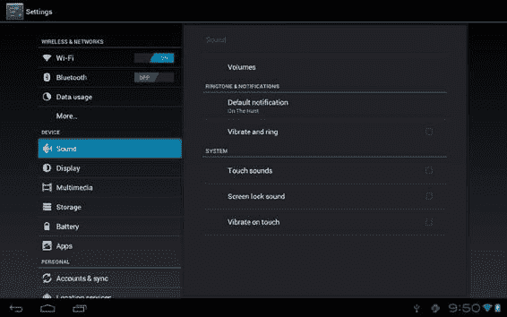
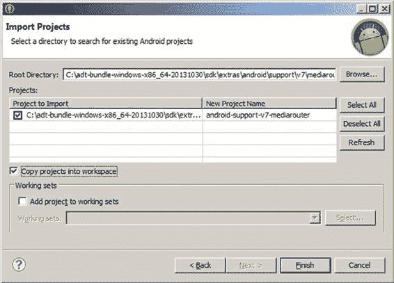
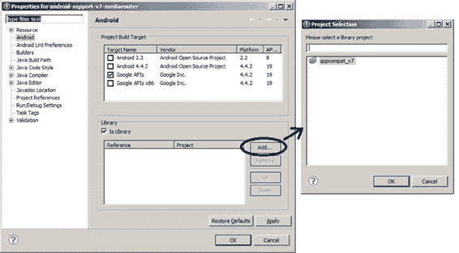
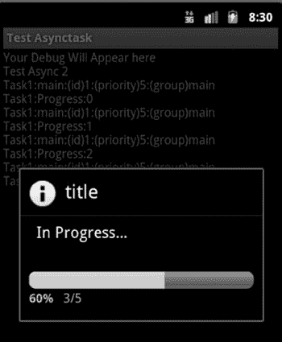

# 第 4 章：管理偏好设置与保存状态

## 理解 `CheckBoxPreference` 和 `SwitchPreference`

最简单的偏好设置是 `CheckBoxPreference` 和 `SwitchPreference`。它们共享同一个父类（`TwoStatePreference`），状态要么是开启（值为 `true`），要么是关闭（值为 `false`）。在示例应用中，我们创建了一个包含五个 `CheckBoxPreference` 的屏幕，如图 4-3 所示。

清单 4-2 展示了 `CheckBoxPreference` 的 XML 代码。

**图 4-3.** 复选框偏好设置的用户界面

**清单 4-2.** 使用 `CheckBoxPreference`

```xml
<CheckBoxPreference
android:key="show_airline_column_pref"
android:title="Airline"
android:summary="Show Airline column" />
```

**注意** 我们将在本章末尾提供一个 URL，您可以通过它下载本章的项目文件。这样您就可以直接将项目导入 IDE 中。主要的示例应用名为 `PrefDemo`。在阅读“保存状态”部分之前，请参考该项目。

[www.it-ebooks.info](http://www.it-ebooks.info/)

此示例展示了定义偏好设置所需的最少内容。`key` 是偏好设置的引用名称，`title` 是偏好设置显示的标题，`summary` 是对偏好设置用途或当前状态的描述。回顾清单 4-1 中保存的值，您会看到 `"show_airline_column_pref"`（即 `key`）对应的 `<boolean>` 标签，其属性值为 `true`，表示该偏好设置已被勾选。

对于 `CheckBoxPreference`，当用户设定状态后，偏好设置的状态会立即保存。换句话说，当用户勾选或取消勾选偏好控制项时，其状态会立刻保存。

`SwitchPreference` 与之非常相似，只是视觉显示不同。用户界面中不再是复选框，而是显示一个开关（如图 4-1 中“通知”旁边的开关）。

`CheckBoxPreference` 和 `SwitchPreference` 另一个有用的功能是：您可以根据偏好是否被勾选，设置不同的摘要文本。对应的 XML 属性是 `summaryOn` 和 `summaryOff`。如果您查看 `main.xml` 文件中名为 `"potato_selection_pref"` 的 `CheckBoxPreference`，会看到一个示例。

在学习其他偏好类型之前，现在正是理解如何访问该偏好设置以读取其值并执行其他操作的好时机。

## 在代码中访问偏好设置的值

既然您已经定义了偏好设置，就需要知道如何在代码中访问它以便读取其值。清单 4-3 展示了访问 Android 中存储偏好设置的 `SharedPreferences` 对象的代码。这段代码来自 `MainActivity.java` 文件的 `setOptionText()` 方法。

**清单 4-3.** 访问 `CheckBoxPreference`

```java
SharedPreferences prefs =
PreferenceManager.getDefaultSharedPreferences(this);
// 这是获取共享偏好设置的另一种方式：
// SharedPreferences prefs = getSharedPreferences(
// "com.androidbook.preferences.main_preferences", 0);
boolean showAirline = prefs.getBoolean("show_airline_column_pref", false);
```

通过偏好设置的引用，可以轻松读取 `show_airline_column_pref` 偏好设置的当前值。如清单 4-3 所示，有两种方式可以获取偏好设置。第一种方式显示的是获取当前上下文的默认偏好设置，这里的上下文是应用中 `MainActivity` 的上下文。第二种方式（注释部分）通过包名来检索偏好设置。


```markdown

您可以使用任何您想要的包名，以便在不同文件中存储不同的偏好设置。

获取偏好设置引用后，使用偏好键和默认值调用相应的 getter 方法。由于`show_airline_column_pref`是一个`TwoStatePreference`，返回的值为布尔类型。`show_airline_column_pref`的默认值在此处硬编码为`false`。如果此偏好从未被设置过，则硬编码值（`false`）将被赋值给`showAirline`。然而，这本身并不会将偏好持久化为`false`以供将来使用，也不会遵循可能已在偏好设置的 XML 规范中设置的任何默认值。

如果 XML 规范使用资源值来指定默认值，则可以在代码中引用同一资源来设置默认值，如下所示，用于另一个不同的偏好设置：

```java
String flight_option = prefs.getString(
    resources.getString(R.string.flight_sort_option),
    resources.getString(R.string.flight_sort_option_default_value));
```

请注意，此处的偏好键也使用了字符串资源值（`R.string.flight_sort_option`）。这是一个明智的选择，因为它降低了拼写错误的可能性。如果资源名称输入错误，您很可能会遇到构建错误。而如果您只使用简单的字符串，则拼写错误可能会被忽略，最终导致偏好设置无法正常工作。

我们展示了一种在代码中读取偏好默认值的方法。

Android 还提供了另一种更优雅的方式。在`onCreate()`中，您可以改为执行以下操作：

```java
PreferenceManager.setDefaultValues(this, R.xml.main, false);
```

然后，在`setOptionText()`中，您可以像这样读取选项值：

```java
String option = prefs.getString(
    resources.getString(R.string.flight_sort_option), null);
```

第一次调用将使用`main.xml`查找默认值，并使用这些默认值为我们生成偏好设置 XML 数据文件。如果内存中已存在`SharedPreferences`对象的实例，它也会更新该实例。第二次调用将为`flight_sort_option`找到一个值，因为我们已提前加载了默认值。

首次运行此代码后，如果您查看`shared_prefs`文件夹，即使偏好设置屏幕尚未被调用，您也会看到偏好设置 XML 文件。您还会看到另一个名为`_has_set_default_values.xml`的文件。此文件告诉您的应用程序，偏好设置 XML 文件已使用默认值创建。`setDefaultValues()`的第三个参数（即`false`）表示只有当偏好设置 XML 文件先前未设置过默认值时，您才希望在其中设置默认值。Android 通过这个新 XML 文件的存在来记住这一信息。

然而，即使您升级应用程序并添加具有新默认值的新设置，Android 也会记住之前的状态，这意味着此技巧不会设置这些新默认值。您的最佳选择是始终为默认值使用资源，并在获取偏好的当前值时始终将该资源作为默认值提供。

### 理解 ListPreference

`ListPreference`为每个选项包含一个单选按钮，并且默认（或当前）选项会被预选。用户只能选择其中一个选项。当用户选择一个选项时，对话框会立即关闭，并且选择结果会保存到偏好设置 XML 文件中。

图 4-4 展示了其外观。

***图 4-4.** ListPreference 的用户界面*

*列表 4-4. 在 XML 中指定 ListPreference*

```xml
<ListPreference
    android:key="@string/flight_sort_option"
    android:title="@string/listTitle"
    android:summary="@string/listSummary" />
```

```


`android:entries="@array/flight_sort_options"`

`android:entryValues="@array/flight_sort_options_values"`

`android:dialogTitle="@string/dialogTitle"`

`android:defaultValue="@string/flight_sort_option_default_value" />` 清单 4-4 包含了一个代表航班选项偏好设置的 XML 片段。这次，文件中引用了字符串和数组，这样做比硬编码字符串更常见。如前所述，存储在 `/data/data/{package}` 目录下的 XML 数据文件中的列表偏好值，与用户在用户界面中看到的内容并不相同。键的名称与用户看不到的隐藏值一同存储在数据文件中。因此，要让 `ListPreference` 生效，需要两个数组：一个用于向用户显示的值，另一个用作键值的字符串。

这里很容易出错。`entries` 数组保存着向用户显示的字符串，而 `entryValues` 数组保存着将存储在偏好设置 XML 数据文件中的字符串。

这两个数组的元素按位置一一对应。

也就是说，`entryValues` 数组中的第三个元素对应 `entries` 数组中的第三个元素。人们很容易想用 0、1、2 等作为 `entryValues`，但这并非必需，并且当之后需要修改数组时可能会引发问题。如果我们的选项本质上是数字（例如倒计时器的起始值），那么我们可以使用诸如 60、120、300 等值。这些值完全不需要是数字，只要对开发者有意义即可；用户不会看到这些值，除非你选择将其暴露出来。用户只能看到第一个字符串数组 `flight_sort_options` 中的文本。本章的示例应用展示了这两种方式。

这里有一个提醒：由于偏好设置 XML 数据文件只存储值而不存储文本，当你升级应用并更改选项文本或向字符串数组添加项目时，偏好设置 XML 数据文件中存储的任何值在升级后仍应与相应的文本对齐。偏好设置 XML 数据文件在应用升级期间会被保留。如果偏好设置 XML 数据文件中存储的是“1”，并且在升级前它代表“经停次数”，那么在升级后它仍应代表“经停次数”。

[www.it-ebooks.info](http://www.it-ebooks.info/)

**70**

**第 4 章：使用偏好设置与保存状态**

由于最终用户看不到 `entryValues` 数组，最佳实践是在你的应用中只存储一次。因此，请创建且仅创建一个 `/res/values/prefvaluearrays.xml` 文件来包含这些数组。

而 `entries` 数组很可能会在每个应用程序中为不同语言或不同设备配置创建多次。因此，请为你需要的每种变体创建单独的 `prefdisplayarrays.xml` 文件。

例如，如果你的应用将提供英文和法文版本，那么就需要分别为英文和法文创建单独的 `prefdisplayarrays.xml` 文件。你不希望将 `entryValues` 数组包含在这些其他文件中。

但至关重要的是，`entryValues` 和 `entries` 数组中的数组元素数量必须相同。元素之间必须对应整齐。在做出更改时，请务必保持一切对齐。清单 4-5 包含了示例中 `ListPreference` 文件的源代码。

*清单 4-5. 示例中的其他 ListPreference 文件*

```xml
<?xml version="1.0" encoding="utf-8"?>
<resources>
    <string-array name="flight_sort_options_values">
        <item>0</item>
        <item>1</item>
        <item>2</item>
    </string-array>
    <string-array name="pizza_toppings_values">
        <item>cheese</item>
        <item>pepperoni</item>
        <item>onion</item>
        <item>mushroom</item>
        <item>olive</item>
        <item>ham</item>
        <item>pineapple</item>
    </string-array>
    <string-array name="default_pizza_toppings">
        <item>cheese</item>
        <item>pepperoni</item>
    </string-array>
</resources>
```

```xml
<?xml version="1.0" encoding="utf-8"?>
<resources>
    <string-array name="flight_sort_options">
        <item>总成本</item>
        <item>经停次数</item>
        <item>航空公司</item>
    </string-array>
    <string-array name="pizza_toppings">
        <item>芝士</item>
        <item>意式腊肠</item>
        <item>洋葱</item>
        <item>波托贝洛蘑菇</item>
        <item>黑橄榄</item>
        <item>烟熏火腿</item>
        <item>菠萝</item>
    </string-array>
</resources>
```

另外，别忘了你在 XML 源文件中指定的默认值必须与 `prefvaluearrays.xml` 数组中的一个 `entryValue` 相匹配。

对于 `ListPreference`，偏好设置的值是一个 `String`。如果你使用数字字符串（例如 0、1、1138）作为 `entryValues`，你可以在代码中将其转换为整数或你需要的任何类型，就像在 `flight_sort_options_values` 数组中所做的那样。

你的代码很可能想要显示偏好设置 `entries` 数组中用户友好的文本。本例采取了一种捷径，因为数组索引被用作 `flight_sort_options_values` 中的元素。只需将值转换为 int，你就知道该从 `flight_sort_options` 中读取哪个字符串。如果你在 `flight_sort_options_values` 中使用了其他一些值集合，那么你需要确定作为偏好设置的元素的索引，然后反过来使用该索引从 `flight_sort_options` 中获取偏好设置的文本。`ListPreference` 的辅助方法 `findIndexOfValue()` 可以帮助解决这个问题，它提供值数组中的索引，这样你就可以轻松地从 `entries` 数组中获取对应的显示文本。

现在回到清单 4-4，有几个用于标题、摘要等的字符串。名为 `flight_sort_option_default_value` 的字符串将默认值设置为 1，在示例中代表“经停次数”。通常最好为每个选项选择一个默认值。如果你没有选择默认值，并且尚未选择任何值，那么返回选项值的方法将返回 `null`。在这种情况下，你的代码必须处理 `null` 值。

### 理解 EditTextPreference

偏好设置框架还提供了一种自由格式的文本偏好设置，称为 `EditTextPreference`。此偏好设置允许你捕获原始文本，而不是让用户进行选择。为了演示这一点，假设你有一个为用户生成 Java 代码的应用程序。该应用程序的一个偏好设置可能是为生成的类使用的默认包名。在这里，你想向用户显示一个文本字段来设置生成类的包名。图 4-5 显示了用户界面，清单 4-6 显示了 XML。

**图 4-5. 使用 EditTextPreference**

*清单 4-6. EditTextPreference 示例*

```xml
<EditTextPreference
    android:key="package_name_preference"
    android:title="设置包名"
    android:summary="为生成的代码设置包名"
    android:dialogTitle="包名" />
```

当选择“设置包名”时，用户会看到一个用于输入包名的对话框。当点击“确定”按钮时，该偏好设置将被保存到偏好存储中。

与其他偏好设置类似，你可以通过调用相应的 getter 方法来获取偏好设置的值，在本例中是 `getString()`。

### 理解 MultiSelectListPreference


最后，Android 3.0 引入了一个名为 `MultiSelectListPreference` 的首选项。其概念与 `ListPreference` 有些相似，但用户不仅可以选中列表中的一项，还可以选择多项或一项都不选。在代码清单 4-1 中，`MultiSelectListPreference` 在首选项 XML 数据文件中存储了一个 `<set name="pizza_toppings">` 标签，而不是单一的值。与 `MultiSelectListPreference` 的另一个显著区别是，其默认值是一个数组，就像 `entryValues` 数组一样。也就是说，该默认值数组必须包含来自该首选项 `entryValues` 数组中的零个或多个元素。在本章的示例应用程序中也可以看到这一点；只需查看 `/res/xml` 目录下 `main.xml` 文件的末尾部分即可。

要获取 `MultiSelectListPreference` 的当前值，可以使用 `SharedPreferences` 的 `getStringSet()` 方法。要从 `entries` 数组中检索显示字符串，你需要遍历作为此首选项值的字符串集合，确定字符串的索引，然后使用该索引从 `entries` 数组中访问正确的显示字符串。

## 更新 AndroidManifest.xml

由于示例应用程序中有两个 Activity，我们需要在 `AndroidManifest.xml` 中添加两个 `<activity>` 标签。第一个是类别为 `LAUNCHER` 的标准 Activity。第二个用于 `PreferenceActivity`，因此根据 Intent 的惯例设置 action 名称，并将类别设置为 `PREFERENCE`，如代码清单 4-7 所示。你可能不希望 `PreferenceActivity` 与我们的其他应用程序一起出现在 Android 页面上，这就是为什么你不为其使用 `LAUNCHER`。如果你要添加其他首选项 Activity，则需要 `AndroidManifest.xml` 做类似的修改。

*代码清单 4-7.* `PreferenceActivity` *在* `AndroidManifest.xml` *中的条目*

```
<activity android:name=".MainPreferenceActivity"
          android:label="@string/prefTitle">
    <intent-filter>
        <action android:name=
            "com.androidbook.preferences.main.intent.action.MainPreferences" />
        <category
            android:name="android.intent.category.PREFERENCE" />
    </intent-filter>
</activity>
```

## 使用 PreferenceCategory

首选项框架支持你将首选项组织成类别。例如，如果你有很多首选项，可以使用 `PreferenceCategory`，它将首选项分组在一个分隔标签之下。图 4-6 展示了可能的效果。请注意名为“肉”和“蔬菜”的分隔符。你可以在 `/res/xml/main.xml` 中找到这些规格说明。



**图 4-6.** 使用 `PreferenceCategory` 组织首选项

## 创建具有依赖关系的子首选项

组织首选项的另一种方法是使用首选项依赖关系。这会在首选项之间建立父子关系。例如，你可能有一个开启警报的首选项；如果警报开启，可能会有几个其他与警报相关的首选项可供选择。如果主警报首选项关闭，则其他首选项不相关，应被禁用。代码清单 4-8 展示了 XML，图 4-7 展示了其效果。

*代码清单 4-8.* XML 中的首选项依赖关系

```
<PreferenceScreen>
    <PreferenceCategory
        android:title="警报">
        <CheckBoxPreference
            android:key="alert_email"
            android:title="发送邮件？" />
        <EditTextPreference
            android:key="alert_email_address"
            android:layout="?android:attr/preferenceLayoutChild"
            android:title="电子邮箱地址"
            android:dependency="alert_email" />
    </PreferenceCategory>
</PreferenceScreen>
```


**图 4-7.** 首选项依赖关系

## 带标题的首选项

Android 3.0 引入了一种组织首选项的新方式。你可以在平板电脑的主设置应用程序中看到这一点。由于平板电脑的屏幕空间比智能手机大得多，因此同时显示更多首选项信息是有意义的。为此，你需要使用首选项标题。请看图 4-8。



**图 4-8.** 带首选项标题的主设置页面

注意标题显示在左侧，像一个垂直的选项卡栏。当你点击左侧的每个项目时，右侧屏幕会显示该项目对应的首选项。在图 4-8 中，选择了“声音”，右侧显示声音首选项。右侧是一个 `PreferenceScreen` 对象，这种设置使用了 Fragment。显然，我们需要做一些与本章迄今讨论的不同的操作。

从 Android 3.0 开始的一个重大变化是向 `PreferenceActivity` 添加了标题。这也意味着要在 `PreferenceActivity` 中使用新的回调方法来设置标题。现在，当你扩展 `PreferenceActivity` 时，需要实现这个方法：

```
public void onBuildHeaders(List<Header> target) {
    loadHeadersFromResource(R.xml.preferences, target);
}
```

完整的源代码请参考 `PrefDemo` 示例应用程序。`preferences.xml` 文件包含一些如下所示的新标签：

```
<preference-headers>
    <header android:fragment="com.example.PrefActivity$Prefs1Fragment"
            android:icon="@drawable/ic_settings_sound"
            android:title="声音"
            android:summary="你的声音首选项" />
    ...
```

每个 header 标签指向一个扩展了 `PreferenceFragment` 的类。在上面给出的例子中，XML 指定了图标、标题和摘要文本（充当副标题）。`Prefs1Fragment` 是 `PreferenceActivity` 的一个内部类，可能看起来像这样：

```
public static class Prefs1Fragment extends PreferenceFragment {
    @Override
    public void onCreate(Bundle savedInstanceState) {
        super.onCreate(savedInstanceState);
        addPreferencesFromResource(R.xml.sound_preferences);
    }
}
```

这个内部类只需要像所示那样引入相应的首选项 XML 文件。该首选项 XML 文件包含了我们之前介绍过的首选项规范类型，例如 `ListPreference`、`CheckBoxPreference`、`PreferenceCategory` 等。非常好的一点是，当屏幕配置发生变化，或者首选项显示在小屏幕上时，Android 会自动处理正确的情况。当屏幕太小，无法同时显示标题和右侧的首选项屏幕时，标题的行为就像旧式的首选项一样。也就是说，你只能看到标题；点击某个标题后，你才会看到对应的首选项屏幕。

## PreferenceScreen

首选项的顶级容器是 `PreferenceScreen`。在平板电脑和 `PreferenceFragment` 出现之前，你可以嵌套 `PreferenceScreen`，当用户点击一个嵌套的 `PreferenceScreen` 项目时，新的 `PreferenceScreen` 会替换当前显示的 `PreferenceScreen`。这在小屏幕上效果很好，但在平板电脑上看起来就不太理想了，特别是当你开始时使用了标题和 Fragment。你可能希望新的 `PreferenceScreen` 出现在当前 Fragment 所在的位置。

要使 `PreferenceScreen` 在 Fragment 内部工作，你只需为该 `PreferenceScreen` 指定一个 Fragment 类名即可。代码清单 4-9 展示了示例应用程序中的 XML。

*代码清单 4-9.* 通过 `PreferenceFragment` 调用的 `PreferenceScreen`

```
<PreferenceScreen
    android:title="启动一个新的屏幕到 fragment 中"


```markdown

`android:fragment="com.androidbook.preferences.main.BasicFrag" />`当用户点击此项时，当前片段将被替换为`BasicFrag`，然后`BasicFrag`会加载一个新的 XML 布局，用于定义`PreferenceScreen`（如`nested_screen_basicfrag.xml`中所指定）。在本例中，我们选择不将`BasicFrag`类作为`MainPreferenceActivity`类的内部类，主要原因是不需要从外部类共享内容，同时也向您展示，如果您愿意，可以这样实现。

## 动态偏好设置摘要文本

您可能见过这样的偏好设置：其摘要中包含了当前值。实际上，这比您想象的要稍微难实现一些。要实现这一功能，您需要创建一个监听器回调，用于检测偏好值即将发生变化，然后相应地更新偏好设置摘要。第一步是让您的`PreferenceFragment`实现`OnPreferenceChangeListener`接口。接着，您需要实现`onPreferenceChange()`回调。

清单 4-10 展示了一个示例。回调中的`pkgPref`对象之前在`onCreate()`方法中已被设置为对应的偏好设置。

[www.it-ebooks.info](http://www.it-ebooks.info/)

**78**

**第 4 章：使用偏好设置与保存状态**

*清单 4-10. 设置偏好监听器*

```
public boolean onPreferenceChange(Preference preference,
Object newValue) {
final String key = preference.getKey();
if ("package_name_preference".equals(key)) {
pkgPref.setSummary(newValue.toString());
}
...
return true;
}
```

您必须在`onResume()`中通过为每个需要监听的偏好设置调用`setOnPreferenceChangeListener(this)`来将片段注册为监听器，并在`onPause()`中再次调用它并传入`null`来取消注册。现在，每当您已注册的偏好设置发生待处理的变化时，此回调将被触发，并传入该偏好设置和潜在的新的值。回调返回一个布尔值，指示是否继续将偏好设置更新为新值（`true`）或不更新（`false`）。假设您将返回`true`以允许新的设置，此时您也可以更新摘要值。您还可以验证新值并拒绝更改。例如，您可能希望`MultiSelectListPreference`具有最大勾选项数量。您可以在回调中统计已选中的项目，若数量过多则拒绝更改。

## 使用偏好设置保存状态

偏好设置非常适合让用户按自己的喜好定制应用程序，但我们也可以利用 Android 偏好设置框架来做更多事情。当您的应用程序需要在多次调用之间跟踪某些数据时，即使这些数据在偏好设置屏幕中不可见，偏好设置也是一种完成任务的方法。请查找名为`SavingStateDemo`的示例应用程序，以跟随完整的源代码进行学习。

`Activity`类有一个`getPreferences(int mode)`方法。实际上，该方法会以活动类名作为标签，并传入模式，来调用`getSharedPreferences()`。结果会得到一个特定于活动的共享偏好设置文件，您可以使用它在多次调用之间存储关于该活动的数据。清单 4-11 展示了如何使用它的一个简单示例。

[www.it-ebooks.info](http://www.it-ebooks.info/)

**第 4 章：使用偏好设置与保存状态** **79**

*清单 4-11. 使用偏好设置为活动保存状态*

```
final String INITIALIZED = "initialized";
private String someString;
[ ... ]
SharedPreferences myPrefs = getPreferences(MODE_PRIVATE);
boolean hasPreferences = myPrefs.getBoolean(INITIALIZED, false);
if(hasPreferences) {
Log.v("Preferences", "We've been called before");
// Read other values as desired from preferences file...
someString = myPrefs.getString("someString", "");
}
else {
Log.v("Preferences", "First time ever being called");
// Set up initial values for what will end up
// in the preferences file
someString = "some default value";
}
[ ... ]
// Later when ready to write out values
```

```


`Editor editor = myPrefs.edit();`

`editor.putBoolean(INITIALIZED, true);`

`editor.putString("someString", someString);`

`// 根据需要写入其他值`

`editor.commit();`

这段代码的作用是获取我们 Activity 类的偏好引用，并检查一个名为 `initialized` 的布尔型“偏好”是否存在。我们用双引号括起“偏好”，因为这个值用户不会看到或设置；它只是我们希望存储在共享偏好文件中以备下次使用的值。如果获取到了这个值，说明共享偏好文件已存在，那么该应用之前一定被调用过。你可以接着从共享偏好文件中读取其他值。例如，`someString` 可能是一个 Activity 变量，其值应当从上一次 Activity 运行时设置，或者如果是首次运行，则设置为默认值。

要向共享偏好文件写入值，首先必须获取一个偏好 `Editor`。然后，你可以将值放入偏好中，并在完成后提交这些更改。请注意，在后台，Android 管理着一个真正共享的 `SharedPreferences` 对象。理想情况下，同一时间不应有多个活动的 `Editor`。但调用 `commit()` 方法非常重要，这样才能更新 `SharedPreferences` 对象和共享偏好 XML 文件。在示例中，`someString` 的值被写入，以供下次此 Activity 运行时使用。

你可以随时访问、写入和提交偏好文件中的值。可能的用途包括记录游戏的高分，或记录应用上次运行的时间。你还可以使用不同名称调用 `getSharedPreferences()` 来管理多组独立的偏好，所有这些操作都可以在同一个应用甚至同一个 Activity 中完成。

到目前为止，我们的示例中都使用了 `MODE_PRIVATE` 作为模式。由于共享偏好文件始终存储在你的应用的 `/data/data/{package}` 目录下，其他应用无法访问，因此你只需要使用 `MODE_PRIVATE`。

## 使用 DialogPreference

到目前为止，你已经了解了如何使用偏好框架的现成功能，但如果你想要创建一个自定义偏好呢？如果你想要类似“屏幕设置”下“亮度”偏好的滑块功能呢？这时就需要用上 `DialogPreference`了。`DialogPreference` 是 `EditTextPreference` 和 `ListPreference` 的父类。其行为是弹出一个对话框，向用户显示选项，并通过按钮或返回键关闭。但你可以扩展 `DialogPreference` 来设置自己的自定义偏好。在你扩展的类中，你可以提供自己的布局、自己的点击处理器，并在 `onDialogClosed()` 中编写自定义代码，将偏好数据写入共享偏好文件。

## 参考资料

以下是一些你可能希望进一步探索的主题的有用参考资料：

- [`developer.android.com/design/patterns/settings.html`](http://developer.android.com/design/patterns/settings.html)：Android 的“设置”设计指南。包含关于设置屏幕和选项布局的一些建议。
- [`developer.android.com/guide/topics/ui/settings.html`](http://developer.android.com/guide/topics/ui/settings.html)：Android 的“设置”API 指南。本页描述了“设置”框架。
- [`developer.android.com/reference/android/provider/Settings.html`](http://developer.android.com/reference/android/provider/Settings.html)：参考页面，列出了调用系统设置活动所需的设置常量。
- [www.androidbook.com/androidfragments/projects](http://www.androidbook.com/androidfragments/projects)：与本书相关的可下载项目列表。对于本章，请查找文件 `AndroidFragments_Ch04_Preferences.zip`。此 ZIP 文件包含本章的所有项目，分别列在独立的根目录中。还有一个 `README.TXT` 文件，描述了如何从这些 ZIP 文件之一将项目导入你的 IDE。

## 总结

本章讨论了在 Android 中管理偏好：

- 可用的偏好类型
- 将偏好的当前值读取到你的应用中
- 通过嵌入式代码设置默认值，以及通过将 XML 文件中的默认值写入已保存的偏好文件
- 将偏好组织成组，并定义偏好之间的依赖关系
- 用于验证更改和设置动态摘要文本的偏好的回调
- 使用偏好框架在多次调用之间保存和恢复 Activity 的信息
- 创建自定义偏好

## 章节

为旧设备使用兼容库

自从几年前首次推出以来，Android 平台经历了一场令人瞩目的演变。虽然其初衷始终是让 Android 为各种不同类型的设备提供动力，但它并非从一开始就为实现这一目标而架构设计的。相反，谷歌工程师添加、移除和更改了 API，以提供新功能。其中最大的变化之一是为了处理平板电脑和电视等更大的屏幕尺寸而引入了 Fragment。但还有其他的变化，例如 `ActionBar` 和菜单。

新的 API 给开发者带来了一个难题，他们希望自己的应用既能在拥有新 API 的新设备上运行，也能在没有这些 API 的旧设备上运行。许多旧设备无法获得 Android 系统升级。即使谷歌将新的 API 添加到旧版 Android 系统的修订版本中，旧设备也无法获得那个新修订版本，因为这需要设备制造商和蜂窝网络运营商进行测试和支持。谷歌提出的解决方案是创建可以链接到应用中的兼容库，这样应用就可以利用新的 API 功能，同时仍然能在较旧版本的 Android 上运行。该库会找出如何使用旧版 API 来实现新功能。如果同一个应用在已经拥有这些新功能的较新版本 Android 上运行，兼容库则会调用该新版本 Android 中存在的底层 API。

本章将深入探讨兼容库，并解释如何使用它们以及需要注意什么。如果你不是在为旧版本的 Android 开发应用，可以安全地跳过本章，因为你不需要这些库。只有当你想在将运行于不具备新 API 的旧版本 Android 上的应用中包含新 API 功能时，这些库才有用。

## 一切始于平板电脑

Android 操作系统在支持平板电脑之前一直运行良好。应用的基本构建模块是 Activity，旨在为用户执行单一任务并填满设备的屏幕。


# 为旧设备使用兼容库

但平板电脑提供了更大的屏幕空间，让用户可以在一个屏幕上同时查看并操作多项内容。因此，谷歌在 Honeycomb（`Android 3.0`）中引入了片段（fragments）。这是一个全新的概念，它改变了开发者创建用户界面及其背后逻辑的方式。这本是件好事，但当时市面上仍有大量不支持片段的安卓设备（例如智能手机）。谷歌的解决方案是编写一个兼容库，利用旧版安卓中已有的 API，为 `Fragment` 等提供功能相似的实现。只要应用链接了该兼容库，即使旧版安卓系统本身不支持片段，应用也能使用片段功能。

随后，谷歌工程师们研究了新版安卓中的其他特性与 API，并为兼容库提供了相应的特性和 API，使得这些功能无需发布旧版安卓的更新也能在旧版本上使用。除了对 `Fragments` 的支持，兼容库还提供了对 `Loaders`、`RenderScript`、`ActionBar` 等的支持。

兼容库并不总能保证新旧版本之间的体验完全一致。例如，新的 `Activity` 类本身就感知片段的存在。要使用兼容库，你必须继承 `FragmentActivity` 类而非 `Activity`；正是 `FragmentActivity` 类负责在旧版安卓中处理片段。

当你使用兼容库时，无论应用将运行在哪个安卓版本上，你都应该使用兼容库提供的类。换句话说，你的应用中只会使用 `FragmentActivity`，而它会在所有安卓版本（包括 `Android 3.0` 及更高版本）上正确工作。你不应该尝试在同一个应用中同时包含用于 `Android 3.0+` 的 `Activity` 和用于低于 `3.0` 版本的 `FragmentActivity`。当 `FragmentActivity` 在 `Android 3.0` 及以上版本运行时，它几乎可以直接调用底层的 `Activity` 类。因此，在新版安卓上使用兼容库并不会带来实质性的性能损失。

[www.it-ebooks.info](http://www.it-ebooks.info/)

**第 5 章：为旧设备使用兼容库** **85**

## 将库添加到项目

在撰写本文时，共有四个兼容库；它们统称为 Android Support Library（修订版 21）：

- **v4** — 包含 `FragmentActivity`、`Fragment`、`Loader` 以及许多在 `Android 3.0` 之后引入的其他类。数字 4 代表 Android API 版本 4（即 `Donut 1.6`）。这意味着该库可用于运行在 Android API 版本 4 及更高版本上的应用。
- **v7** — 提供了 `ActionBar`、`CardView`、`GridLayout`、`MediaRouter`、`Palette` 和 `RecyclerView` 类。该库可用于 Android API 版本 7（即 `Eclair 2.1`）及更高版本。实际上这里有六个库：`appcompat`、`cardview`、`gridlayout`、`mediarouter`、`palette` 和 `recyclerview`。
- **v8** — 为 Android API 版本 8（即 `Froyo 2.2`）及更高版本增加了 `RenderScript` 能力。`RenderScript` 允许在设备处理器（CPU 内核、GPU、DSP）之间并行处理任务，它于 Android API 版本 11（即 `Honeycomb 3.0`）中被引入。
- **v13** — 为标签页和分页界面等功能添加了特殊的 `Fragment` 功能。该库也包含了许多来自 v4 库的类，因此可以将其包含在你的应用中，而无需同时引入其他库。

有关按版本号分类的所有兼容性功能的完整列表，请参阅本章末尾的参考资料。

要将 Android Support Library 下载到你的计算机，请使用 Android SDK Manager，并在列表底部的 `Extras` 下找到它。如果你使用的是 Android Studio，请下载 Android Support Repository 和 Google Repository。否则，请下载 Android Support Library。这些文件将被放置在你的 Android SDK 目录下。Android Support Library 位于 `extras/android/support/`，Android Support Repository 位于 `extras/android/m2repository`，Google Repository 位于 `extras/google/m2repository`。在撰写本文时，`RenderScript` 兼容库在 Android Studio 中不受支持。

从上述列表中可以看出，并非所有 Android Support Library 的功能都适用于所有旧版安卓。因此，你必须在 `AndroidManifest.xml` 文件中正确设置 `android:minSdkVersion`。

如果你在使用 v7 中的兼容库功能，那么 `android:minSdkVersion` 不应低于 7。

[www.it-ebooks.info](http://www.it-ebooks.info/)



**86** **第 5 章：为旧设备使用兼容库**

### 包含 v7 Support Library

你几乎不太可能只想包含 v4 库而不包含 v7 库。由于 v7 库需要同时包含 v4 库才能提供 v7 正常运行所需的类，因此你需要将两者都包含进来。如果你使用 Eclipse，ADT 插件会让这一切变得相当简单。当你在 Eclipse 中创建一个新的 Android 项目时，需要指定它将运行的最低安卓版本。如果 ADT 认为你可能需要包含兼容库，它会自动将其包含进来。

例如，如果你将目标 SDK 指定为 16（`JellyBean 4.1`），但最低 SDK 指定为 8（`Froyo 2.2`），ADT 会自动设置一个 `appcompat v7` 库项目，将该库项目包含到你的新应用中，并且也会将 v4 库包含到你的应用中。因此，你无需额外工作，v7 库的资源就可用于你的应用。

然而，如果你想使用另外两个 v7 库（`gridlayout` 和/或 `mediarouter`），则需要做一些额外的工作，具体如下所述。

通过创建一个库项目并将其包含到你的应用中，你的应用就能获得所需的兼容库资源。

你可以手动执行类似于 ADT 自动执行的操作，以便将 v7 `appcompat` 库包含到你的项目中。首先，选择 **File ➤ Import**，然后选择 **Existing Android Code Into Workspace**，接着导航到你工作站上 Android SDK 所在的 `extras` 文件夹。找到 v7 `gridlayout` 或 `mediarouter` 文件夹并选中。见图 5-1。

***图 5-1.** 导入 v7 mediarouter 兼容库*

[www.it-ebooks.info](http://www.it-ebooks.info/)



**第 5 章：为旧设备使用兼容库** **87**

点击 **Finish**，你将获得一个新的库项目。如果你选择为 v7 `mediarouter` 创建库项目，你会发现它缺少一些功能，因此会有错误。你需要添加 v7 `appcompat` 库来解决这个问题。在 Eclipse 中右键点击 `mediarouter` 库项目，选择 **Properties**。在左侧列表中选择 **Android**。现在，点击 **Library** 部分的 **Add…** 按钮。见图 5-2。

***图 5-2.** 将 appcompat_v7 添加到 v7 mediarouter 兼容库*

选择 `appcompat_v7` 库并点击 **OK**。这应该能解决 `mediarouter` 中的错误。现在，当你想将 `mediarouter` 包含到你的应用项目中时，只需按照相同步骤操作，但右键点击你的应用项目，然后在 **Library** 部分点击 **Add…** 按钮时，选择 `mediarouter` 库即可。

### 包含 v8 Support Library


如果你希望使用 v8 RenderScript 兼容库，只需在应用项目的`project.properties`文件中添加以下两行，无论你的应用目标版本是多少：

`renderscript.target=19`

`renderscript.support.mode=true`

如果在 Eclipse 控制台中看到关于版本号的错误，请按照错误提示尝试使用更新的版本。不过，Android 的最新版本可能也无法正常工作。你可能还需要做另一件事：将`renderscript-v8.jar`文件作为外部 jar 文件添加到项目的构建路径中。你可以在 SDK 的`build-tools`目录下找到这个 jar 文件，请使用可用的最新版本。

在你的代码中，请确保导入的是`android.support.v8.renderscript`包，而不是`android.renderscript`包。如果你正在为 v8 库修改现有的 RenderScript 应用，请务必清理你的项目；由`.rs`文件生成的 Java 文件需要重新生成，以同样使用 v8 库。之后，你就可以像往常一样使用 RenderScript，并将你的应用部署到旧版本的 Android 上了。

### 包含 v13 支持库

最后，要包含 v13 兼容库到你的应用中，请进入 SDK 的`extras`目录，找到 v13 jar 文件。将此文件复制到应用项目的`/libs`目录下。将 v13 jar 文件放置到位后，右键点击它，弹出菜单，然后选择“构建路径”（Build Path）➤ “添加到构建路径”（Add to Build Path）。有很大可能你的应用中已经包含了 v4 和 v7 appcompat 库（这得益于 ADT）。如果你不需要其中任何一个库的功能，你可以选择将它们移除。例如，如果你的应用最低 SDK 是 v11，你可以使用原生的`ActionBar`类，而不需要 v7 appcompat 支持库。

v13 jar 文件包含了许多与 v4 相同的类，因此你不希望因同时添加相同的类而导致任何问题。如果你打算在应用中同时使用这三个库（即 v4、v7 和 v13），那么至少要确保 v13 的排序在 v4 之前。这可以在“配置构建路径”（Configure Build Path）对话框中完成。

### 仅包含 v4 支持库

如果你确实只需要 v4 支持库而不要其他库，你可以遵循与 v13 库相同的步骤。

## 使用 Android 支持库改造应用

为了让你更清楚地了解这一切是如何工作的，我们将重新使用你在第 1 章中编写的一个 fragment 应用，并使其能在不支持 fragment 的原生旧版本 Android 上运行。

选择“文件”（File）➤ “导入”（Import），选择“常规”（General），然后选择“将现有项目导入工作空间”（Existing Projects into Workspace）。

导航到第 1 章中的 `ShakespeareInstrumented` 项目并选择它。在点击“完成”（Finish）之前，勾选“将项目复制到工作空间”（Copy projects into workspace）。

现在，你将改造这个应用，使其能在低于 API 版本 11 的 Android 上运行。以下方法适用于你不需要兼容库中的资源的情况，因为它只关心复制 JAR 文件。

1. 右键点击你的项目，选择“Android 工具”（Android Tools）➤ “添加支持库...”（Add Support Library...）。接受许可协议并点击“确定”（OK）。
2. 现在进入`MainActivity.java`，将基类从`Activity`改为`FragmentActivity`。你需要修复导入行，从`android.app.Activity`改为`android.support.v4.app.FragmentActivity`。同时，修复`Fragment`、`FragmentManager`和`FragmentTransaction`的导入，改为使用支持库中的对应类。
3. 找到`getFragmentManager()`的方法调用，并将其改为`getSupportFragmentManager()`。对`DetailsActivity.java`也执行此操作。
4. 对于`DetailsFragment.java`，将`Fragment`的导入改为指向支持库的`Fragment`（即`android.support.v4.app.Fragment`）。
5. 在`TitlesFragment.java`中，修改导入。


`ListFragment` 指向支持库对应的版本

`ListFragment`（即 `android.support.v4.app.ListFragment`）。

较新版本的 Android 使用了与旧版不同的动画器。你可能需要在`MainActivity.java`的`showDetails()`方法中修复动画效果。从注释掉的`setCustomAnimations()`调用中任选一个，然后调整入场和出场动画。任何依赖于`ObjectAnimator`类的代码都无法在旧设备上运行，因为该类从 API 版本 11（即 Honeycomb 3.0）才被引入。代码虽然可以编译通过，但由于该类尚未在旧版 Android 中实现，也未包含在兼容性库中，运行时将会抛出异常。

换句话说，请勿使用`R.animator`。请改用`R.anim`。你可以将所需的动画资源文件复制到项目中，或者引用`android.R.anim`中的文件。

[www.it-ebooks.info](http://www.it-ebooks.info/)

**90**

## 第 5 章：为旧设备使用兼容性库

现在你可以进入`AndroidManifest.xml`，将`minSdkVersion`从 11 改为 8。这应该就是你需要做的全部工作。尝试在 Froyo 设备或模拟器上运行此应用程序。如果一切顺利，你现在应该能看到一个基于片段（Fragment）的应用在 Android 3.0 之前的操作系统上运行。

## 参考资料

以下是一些可能有用的参考资料，供你进一步探索：

- [`developer.android.com/tools/support-library/index.html`](http://developer.android.com/tools/support-library/index.html)：Android 开发者指南中关于支持库包的说明。
- [`developer.android.com/tools/support-library/features.html`](http://developer.android.com/tools/support-library/features.html)：Android 官方文档中关于每个兼容性库主要特性的说明。
- [`developer.android.com/tools/support-library/setup.html`](http://developer.android.com/tools/support-library/setup.html)：Android 官方文档中关于为项目设置兼容性库的说明，适用于 Eclipse 和 Android Studio。在编写本书时，这些页面的内容可能不如本章及时。但情况会发生变化。如果遇到问题，请查阅在线文档或联系本书作者。

## 总结

让我们通过快速列举你所学到的关于 Android 兼容性库的知识来结束本章：

- 为了让你的应用程序在尽可能广泛的设备上运行，请使用兼容性库并针对其 API 编程，而非追求最新、最强大的 API。
- v7 支持库附带资源文件，必须将这些资源包含在你的应用程序中，API 才能正常工作。

[www.it-ebooks.info](http://www.it-ebooks.info/)

# 章节：高级 AsyncTask 与进度对话框

在许多 Android 应用程序中，你需要在 UI 后台的单独线程中执行任务。当任务进行时，你可能希望向用户显示某种进度指示器。虽然你可以自行创建线程、管理线程并协调 UI 更新，但 Android 提供了一些类来自动为你处理其中的大部分工作。这样你就可以专注于实际要完成的任务，而不是编写线程管理和 UI 消息传递的代码。这些类就是`AsyncTask`和`ProgressDialog`。

本章将从`AsyncTask`的基础知识讲起，然后进入展示进度对话框和进度条的代码部分，这些代码能够正确显示`AsyncTask`的状态，即使设备配置发生变化也是如此。

## 介绍 AsyncTask

让我们通过清单 6-1 中的伪代码来介绍`AsyncTask`。

*清单 6-1. Activity 使用 AsyncTask 的模式*

```
public class MyActivity {

void respondToMenuItem( ) { // 菜单处理程序

performALongTask( );

}

**91**
```

[www.it-ebooks.info](http://www.it-ebooks.info/)

**92**


# 第 6 章：进阶 AsyncTask 与进度对话框

`void performALongTask( ) { //使用 AsyncTask`

`//继承 AsyncTask，并实例化该 AsyncTask`

`MyLongTask myLongTask = new MyLongTask(...回调对象...); myLongTask.execute(...一些参数...); //在工作线程上启动任务`

`//让主线程返回处理 UI 事务`

`}`

`//接收 AsyncTask 的回调`

`void someCallBackFromAsyncTask(SomeParameterizedType x) {`

`//虽然由 AsyncTask 调用，但此代码运行在主线程上`

`//向用户报告进度`

`}`

使用`AsyncTask`首先要像清单 6-1 中的`MyLongTask`那样继承`AsyncTask`。一旦实例化了`AsyncTask`对象，就可以在该对象上调用`execute()`方法。`execute()`方法内部会启动一个独立线程来执行实际工作。`AsyncTask`实现会依次调用多个回调方法，用于报告任务开始、任务进度和任务结束。

清单 6-2 展示了扩展`AsyncTask`的伪代码以及需要重写的方法。（请注意，这是伪代码，并非用于编译。添加`@Override`注解是为了明确表明这些方法来自基类重写）。

*清单 6-2. 扩展 AsyncTask：示例*

```
public class MyLongTask extends AsyncTask<String,Integer,Integer> {

    //... 构造函数相关

    //调用 execute()会触发以下所有方法

    @Override
    void onPreExecute( ){} //在主线程上运行

    //在此执行所有工作，运行在工作线程上

    @Override
    Integer doInBackground(String... params){}

    //任务完成后再次在主线程上运行

    @Override
    void onPostExecute(Integer result){}

    //在主线程上运行

    @Override
    void onProgressUpdate(Integer... progressValuesArray){}

    //....其他方法
}
```

[www.it-ebooks.info](http://www.it-ebooks.info/)

**第 6 章：进阶 AsyncTask 与进度对话框** **93**

清单 6-1 中的`execute()`方法在主线程上调用。此调用会触发清单 6-2 中的一系列方法，从`onPreExecute()`开始。`onPreExecute()`同样在主线程上调用。你可以用此方法设置执行任务的环境，也可以设置对话框或启动进度条，告知用户工作已开始。`onPreExecute()`执行完毕后，`execute()`方法会返回，Activity 的主线程继续处理其 UI 职责。此时，`execute()`会生成一个新的工作线程，使`doInBackground()`方法安排在该工作线程上执行。你将在`doInBackground()`方法中完成所有繁重工作。由于该方法运行在工作线程上，主线程不受影响，因此不会出现"应用无响应"提示。从`doInBackground()`方法中，你可以通过某种机制（稍后会看到）调用`onProgressUpdate()`来报告进度。`onProgressUpdate()`方法运行在主线程上，因此你可以更新主线程上的 UI。

## 实现一个简单的 AsyncTask

接下来我们深入了解如何扩展`AsyncTask`。`AsyncTask`类使用泛型为其方法（包括重写的方法）提供类型安全。查看`AsyncTask`类的部分定义（清单 6-3）时，你可以看到这些泛型。（请注意，清单 6-3 是经过大幅精简的`AsyncTask`类版本，只包含客户端代码最常用的接口元素。）

*清单 6-3. AsyncTask 类定义速览*

```
public class AsyncTask<Params, Progress, Result> {

    //客户端将调用此方法

    AsyncTask<Params, Progress, Result> execute(Params... params);

    //在此执行你的工作。经常触发 onProgressUpdate()

    Result doInBackground(Params... params);

    //回调：工作完成后

    void onPostExecute(Result result);

    //回调：工作进度更新时

    void onProgressUpdate(Progress... values);
}
```


```java
void onProgressUpdate(Progress... progressValuesArray);
```

[www.it-ebooks.info](http://www.it-ebooks.info/)

**94**

# 第 6 章：高级 AsyncTask 与进度对话框

研究清单 6-3，你可以看到，在扩展 `AsyncTask` 时（通过泛型），它需要以下三个参数化类型（`Params`、`Progress` 和 `Result`）。我们简要说明这些类型：

- **Params**（`execute()` 方法的参数类型）：扩展 `AsyncTask` 时，你需要指明传递给 `execute()` 方法的参数类型。如果你将 `Params` 类型声明为 `String`，那么 `execute()` 方法将期望在调用时传入任意数量的由逗号分隔的字符串，例如 `execute(s1,s2,s3)` 或 `execute(s1,s2,s3,s4,s5)`。

- **Progress**（进度回调方法的参数类型）：此类型表示通过回调 `onProgressUpdate(Progress... progressValuesArray)` 向调用者报告进度时传回的数值数组。能够传递进度值数组，使得可以监控并报告任务的多个方面。例如，如果 `AsyncTask` 在处理多个子任务，就可以利用此特性。

- **Result**（通过 `onPostExecute()` 方法报告结果时使用的类型）：此类型表示 `doInBackground()` 返回的数据类型，该数据最终会以线程安全的方式传递给 `onPostExecute()` 进行处理。

现在了解了 `AsyncTask` 所需的泛型类型后，假设我们为特定的 `AsyncTask` 确定了以下参数：`Params`：`String`，`Result`：`Integer`，`Progress`：`Integer`。那么，我们可以声明一个扩展的 `AsyncTask` 类，如清单 6-4 所示。

*清单 6-4. 通过具体类型扩展泛型 AsyncTask*
```java
public class MyLongTask
extends AsyncTask<String,Integer,Integer>
{
    //...其他构造函数内容
    //...其他方法

    //基于参数化类型的具体方法
    protected Integer doInBackground(String... params){}
    protected void onPostExecute(Integer result){}
    protected void onProgressUpdate(Integer... progressValuesArray){}
    //....其他方法
}
```

[www.it-ebooks.info](http://www.it-ebooks.info/)

**第 6 章：高级 AsyncTask 与进度对话框** **95**

请注意，清单 6-4 中的具体类 `MyLongTask` 如何消除类型名称的歧义，并得出类型安全的函数签名。

### 实现你的第一个 AsyncTask

现在，让我们来看一个简单但完整的 `MyLongTask` 实现。我们在清单 6-5 的代码中加入了大量内联注释，以指明哪些方法在哪个线程上运行。同时请注意 `MyLongTask` 的构造函数，它接收调用上下文（通常是一个活动）的对象引用，以及一个用于记录进度消息的特定简单接口（如 `IReportBack`）。`IReportBack` 接口对你的理解并非关键，因为它仅仅是日志的一个封装。`Utils` 类也是如此。你可以在本章的两个可下载项目中看到这些附加类。可下载项目的网址在本章末尾的参考资料部分。清单 6-5 展示了 `MyLongTask` 的完整代码。

*清单 6-5. 实现 AsyncTask 的完整源码*
```java
//以下代码位于 MyLongTask.java 中（AndroidFragments_Ch06_TestAsyncTask.zip）
//使用菜单项：Test Async1 来调用此代码
public class MyLongTask extends AsyncTask<String,Integer,Integer>
{
    IReportBack r; // 用于回传日志消息的接口
    Context ctx; // 用于启动对话框的活动
    public String tag = null; // 调试标签
    ProgressDialog pd = null; // 用于启动、报告和停止进度对话框

    //构造函数
    MyLongTask(IReportBack inr, Context inCtx, String inTag) {
        r = inr; ctx = inCtx; tag = inTag;
    }

    //在主 UI 线程上运行
    protected void onPreExecute( ) {
        Utils.logThreadSignature(this.tag);
        pd = ProgressDialog.show(ctx, "标题", "处理中...",true);
    }
```

[www.it-ebooks.info](http://www.it-ebooks.info/)

**96**

**第 6 章：高级 AsyncTask 与进度对话框**


```java
//在主 UI 线程上运行。由多次调用的 publishProgress 触发

protected void onProgressUpdate(Integer... progress) {

    Utils.logThreadSignature(this.tag);

    Integer i = progress[0];

    r.reportBack(tag, "Progress:" + i.toString( ));

}

protected void onPostExecute(Integer result) {

    //在主 UI 线程上运行

    Utils.logThreadSignature(this.tag);

    r.reportBack(tag, "onPostExecute result:" + result); pd.cancel( );

}

//在工作线程上运行。如果有更多任务，甚至可能是一个线程池。

protected Integer doInBackground(String...strings) {

    Utils.logThreadSignature(this.tag);

    for(String s :strings) {

        Log.d(tag, "Processing:" + s);

    }

    for (int i=0;i<3;i++) {

        Utils.sleepForInSecs(2);

        publishProgress(i); //这会调用 onProgressUpdate

    }

    return 1; //该值随后作为输入传递给 onPostExecute

}

}
```

在简要介绍客户端如何使用（或调用）`MyLongTask`之后，我们将深入讲解清单 6-5 中高亮显示的每个方法。

## 调用 AsyncTask

一旦我们实现了 `MyLongTask` 类，客户端将按照清单 6-6 所示的方式使用该类。

*清单 6-6. 调用 AsyncTask*

```java
//你将在 AsyncTester.java 类中找到此功能(AndroidFragments_Ch06_TestAsyncTask.zip)
//使用菜单项：Test Async1 来调用此代码
void respondToMenuItem( ) {
    //用于向活动发送消息的接口
    //如果需要详细信息，请参阅可下载的项目。
    IReportBack reportBackObject = this;
    Context ctx = this; //活动
    String tag = "Task1"; //调试标签

    //实例化并执行耗时任务
    MyLongTask mlt = new MyLongTask(reportBackObject,ctx,tag);
    mlt.execute("String1","String2","String3");
}
```

请注意清单 6-6 中调用 `execute()` 方法的方式。由于我们将其中一个泛型类型指定为 `String`，并且 `execute()` 方法接受该类型的可变数量参数，因此我们可以向 `execute()` 方法传递任意数量的字符串。在清单 6-6 的示例中，我们传递了三个字符串参数。你可以根据需要传递更多或更少的参数。

一旦我们在 `AsyncTask` 上调用 `execute()` 方法，就会先调用 `onPreExecute()` 方法，随后调用 `doInBackground()` 方法。系统还会在 `doInBackground()` 方法完成后调用 `onPostExecute()` 回调。请参考清单 6-5 了解这些方法的实现方式。

## 理解 onPreExecute() 回调和进度对话框

回到清单 6-5 中的 `MyLongTask` 实现，在 `onPreExecute()` 方法中，我们启动了一个进度对话框来指示任务正在执行中。图 6-1 显示了该对话框的图像。

（使用菜单项 Test Async1 从项目下载 `AndroidFragments_Ch06_TestAsyncTask.zip` 中调用此视图。）

***图 6-1.** 一个与 AsyncTask 交互的简单进度对话框*

显示进度对话框的代码段（取自清单 6-5）在清单 6-7 中重现。

*清单 6-7. 显示一个不确定的进度对话框*

```java
pd = ProgressDialog.show(ctx, "title", "In Progress...",true);
```

变量 `pd` 已在构造函数中声明（参见清单 6-5）。

清单 6-7 中的调用将创建一个进度对话框并显示它，如图 6-1 所示。清单 6-7 中 `show()` 方法的最后一个参数指示该对话框是否不确定（即对话框能否事先预估工作量）。我们将在后续章节介绍确定性的情况。

**注意** 可靠地显示 `AsyncTask` 的进度相当复杂。这是因为活动可能会因为配置更改或其他 UI 抢占而反复出现和消失。我们将在本章后面介绍这个关键需求及其解决方案。

## 理解 doInBackground() 方法


# 排版后的文本

`AsyncTask` 的所有后台工作都在 `doInBackground()` 方法中完成。该方法由 `AsyncTask` 编排，在工作线程上运行。因此，与在主线程上执行的工作不同，此方法允许执行超过五秒的操作。

在清单 6-5 的示例中，我们在 `doInBackground()` 方法中简单地像处理数组一样检索任务的每个输入字符串。在此方法定义中，我们没有定义显式的字符串数组。然而，该函数的唯一参数被定义为可变长度参数，如清单 6-8 所示。

*清单 6-8. `doInBackground()` 方法签名*

```
protected Integer doInBackground(String...strings)
```

随后，Java 会将此参数视为函数内部的数组。因此，在 `doInBackground()` 方法的代码中，我们读取每个字符串并记录它们，以表明我们知晓其内容。然后，我们等待足够长的时间来模拟一个长时间运行的操作。由于此方法在工作线程中运行，我们不应在此工作线程中访问 Android 的 UI 功能。例如，即使您在此线程中可以访问某些 `Views`，也不应直接更新它们。甚至无法从此处发送 `Toast`。接下来的两个方法帮助我们解决了这个问题。

[www.it-ebooks.info](http://www.it-ebooks.info/)

# 第 6 章：高级 AsyncTask 与进度对话框

### 通过 `publishProgress()` 触发 `onProgressUpdate()`

在 `doInBackground()` 方法中，您可以通过调用 `publishProgress()` 方法来触发 `onProgressUpdate()`。被触发的 `onProgressUpdate()` 方法随后会在主线程上运行。这使得 `onProgressUpdate()` 方法能够适当地更新 `Views` 等 UI 元素。您也可以在此处发送 `Toast`。在清单 6-5 中，我们仅记录了一条消息。当所有工作完成后，我们从 `doInBackground()` 方法返回一个结果代码。

### 理解 `onPostExecute()` 方法

`doInBackground()` 方法的结果代码随后被传递给 `onPostExecute()` 回调方法。此回调也在主线程上执行。在此方法中，我们指示进度对话框关闭。由于在主线程上，您可以无限制地在此方法中访问任何 UI 元素。

### 升级为确定性进度对话框

在之前清单 6-5 的示例中，我们使用了一个进度对话框（图 6-1），它无法告知我们已完成工作的比例。这种进度对话框被称为**不确定进度对话框**。如果您在此进度对话框上将 `indeterminate` 属性设置为 `false`，您将看到一个逐步跟踪进度的进度对话框。如图 6-2 所示。

（使用菜单项 "Test Async 2" 从项目下载 `AndroidFragments_Ch06_TestAsyncTask.zip` 中调用此视图。）

[www.it-ebooks.info](http://www.it-ebooks.info/)



**图 6-2.** *显示明确进度并与 `AsyncTask` 交互的进度对话框*

清单 6-9 展示了将清单 6-5 中的任务重写为将进度对话框的行为更改为确定性进度对话框。我们还添加了一个 `onCancelListener`，以查看在取消对话框时是否需要取消任务。用户可以点击图 6-2 中的返回按钮来取消对话框。代码的关键部分如清单 6-9 所示（完整代码请参见下载文件 `AndroidFragments_Ch06_TestAsyncTask.zip`）。

*清单 6-9. 使用确定性进度对话框的长时间任务*

```
//以下代码位于 MyLongTask1.java (AndroidFragments_Ch06_TestAsyncTask.zip) 中
//使用菜单项: Test Async2 来调用此代码

public class MyLongTask1 extends AsyncTask<String,Integer,Integer> implements OnCancelListener
{
    //..取自清单 6-5 的其他代码
    //完整的代码清单也请参考可下载项目中的 java 类 MyLongTask1.java

    protected void onPreExecute( ) {
        //....其他代码
        pd = new ProgressDialog(ctx);
        pd.setTitle("标题");
        pd.setMessage("进行中...");
        pd.setCancelable(true);
        pd.setOnCancelListener(this);
        pd.setIndeterminate(false);
        pd.setProgressStyle(ProgressDialog.STYLE_HORIZONTAL);
        pd.setMax(5);
        pd.show( );
    }

    public void onCancel(DialogInterface d) {
        r.reportBack(tag,"对话框上调用了取消");
        this.cancel(true);
    }
    //..取自清单 6-5 的其他代码
}
```

请注意我们在清单 6-9 中是如何准备进度对话框的。在此例中，我们没有像在清单 6-5 中那样对进度对话框使用静态方法 `show()`。相反，我们显式地实例化了进度对话框。变量 `ctx` 代表此 UI 进度对话框操作的上下文（或活动）。然后我们单独设置了对话框的属性，包括其确定性或不确定性行为。方法 `setMax()` 指示进度对话框有多少步。当触发对话框取消时，我们还将自身引用（`AsyncTask` 本身）作为监听器传递。在取消回调中，我们显式地对 `AsyncTask` 发出取消命令。带有布尔参数 `false` 的 `cancel()` 方法将在 `AsyncTask` 上设置一个标志，可通过 `isCancelled()` 进行查询。

`doInBackground()` 方法应定期检查 `isCancelled()`，以便在被取消时优雅地提前结束。布尔参数 `true` 将强制停止工作线程。

## AsyncTask 与线程池

考虑清单 6-10 中的代码，其中菜单项依次调用了两个 `AsyncTasks`。

*清单 6-10. 调用两个长时间运行的任务*

```
void respondToMenuItem( ) {
    MyLongTask mlt = new MyLongTask(this.mReportTo,this.mContext,"任务 1");
    mlt.execute("String1","String2","String3");
    MyLongTask mlt1 = new MyLongTask(this.mReportTo,this.mContext,"任务 2");
    mlt1.execute("String1","String2","String3");
}
```

这里我们在主线程上执行两个任务。您可能期望这两个任务几乎同时启动。然而，默认行为是这些任务使用从线程池中取出单个线程来顺序执行。如果您想要并行执行，可以在 `AsyncTask` 上使用 `executeOnExecutor()` 方法。有关此方法的详细信息，请参阅 `AsyncTask` 的参考文档。此外，根据 SDK 文档，在单个 `AsyncTask` 上多次调用 `execute()` 方法是无效的。如果您需要这种行为，则必须实例化一个新任务并再次调用 `execute()` 方法。

## 正确显示 AsyncTask 进度的问题与解决方案

如果您本章的主要目标只是学习 `AsyncTask` 的基本知识，那么到目前为止我们所涵盖的内容已经足够。然而，当 `AsyncTask` 与进度对话框配对使用时，会存在一些问题，如前文清单所示。其中一个问题是，当设备旋转时，`AsyncTask` 会丢失正确的活动引用，从而也丢失对进度对话框的引用。另一个问题是，我们之前在代码中使用的进度对话框不是托管对话框。

现在让我们来理解这些问题。

### 处理活动指针与设备旋转


`AsyncTask` 持有的活动指针在因配置变更而重新创建活动时会变得过时。这是因为 Android 已创建了一个新活动，而旧活动不再显示在屏幕上。因此，持有旧活动及其对应的对话框会带来几个问题。首先，用户看不到 `AsyncTask` 试图更新的那个活动或对话框。其次，旧活动需要被垃圾回收，但由于 `AsyncTask` 持有对它的引用，你将阻止它被回收。即使你聪明地使用 Java 弱引用来引用旧活动，虽然不会发生内存泄漏，但你会得到一个空指针异常。过时指针的问题不仅适用于活动指针，也适用于任何间接指向该活动的指针。

解决过时活动引用问题的推荐方法是使用无头保留片段（第 1 章中介绍了片段。保留片段是指当活动因配置变更而重新创建时仍然存在的片段。这些片段也被称为无头片段，因为它们不一定需要持有任何用户界面）。

[www.it-ebooks.info](http://www.it-ebooks.info/)

**第 6 章：高级 AsyncTask 和进度对话框** **103**

处理托管对话框

即使我们能够解决过时活动引用问题并重新建立与当前活动的连接，本章到目前为止使用进度对话框的方式也存在缺陷。我们直接实例化了一个 `ProgressDialog`。以这种方式创建的 `ProgressDialog` 并不是一个“托管”对话框。如果它不是一个托管对话框，当设备发生旋转或任何其他配置变更时，活动将不会重新创建该对话框。因此，当设备旋转时，`AsyncTask` 仍在继续运行，但对话框将不会显示。有几种方法可以解决这个问题。推荐的方法是不使用进度对话框，而是在活动本身中使用一个嵌入式 UI 控件，例如进度条。因为进度条是活动视图层次结构的一部分，希望它能够被重新创建。尽管进度条听起来不错，但有时模态进度对话框更有意义。例如，当你不希望用户在 `AsyncTask` 运行时与活动的任何其他部分进行交互时，就会出现这种情况。在这些情况下，我们认为使用片段对话框而不是进度条几乎没有矛盾。

你接下来将看到的解决方案使用一个保留的非 UI 片段加上一个进度对话框，当活动因配置变更而重新创建时，该对话框会根据需要重新创建。你可能选择实现进度指示器的其他方式，它们也可以使用类似的技术。

行为良好的进度对话框的测试场景

无论你使用哪种解决方案来为 `AsyncTask` 正确显示进度对话框，该解决方案都应在以下所有测试场景中正常工作：
1.  在没有方向变更的情况下，进度对话框必须启动、显示进度、结束，并清理对 `AsyncTask` 的引用。这必须能够重复工作，以证明没有残留上次运行的痕迹。
2.  该解决方案应能处理任务执行中途的方向变更。旋转应重新创建对话框并从上次中断的地方显示进度。对话框应正确结束并清理 `AsyncTask` 引用。这必须能够重复工作，以证明没有残留任何痕迹。

[www.it-ebooks.info](http://www.it-ebooks.info/)

**104** **第 6 章：高级 AsyncTask 和进度对话框**

3.  即使任务正在执行中途，也应当允许按 Home 键返回桌面。
4.  按 Home 键返回桌面后重新访问活动，应显示对话框并正确反映当前进度，并且进度不应低于之前的进度。
5.  按 Home 键返回桌面后，当任务在返回前完成时，这也应能正常工作。对话框应被正确关闭，并且移除 `AsyncTask` 引用。

所有处理 `AsyncTask` 的活动都应始终执行这组测试用例。既然我们已经阐述了解决方案应如何满足要求，接下来展示一个使用保留片段和进度对话框的解决方案。

使用保留片段和进度对话框

在这个解决方案中，我们将向你展示如何使用一个保留片段和一个进度对话框来为 `AsyncTask` 正确显示进度。该解决方案涉及以下步骤：

1.  活动必须跟踪非 UI 片段。这个外部片段必须持续存在，并且在活动关闭和重新返回时验证其引用。这个保留片段持有对 `AsyncTask` 的引用。
2.  然后，一个保留片段将拥有指向 `AsyncTask` 的指针，并且可以在活动创建和销毁时，在 `AsyncTask` 上设置和重置活动指针。因此，这个保留片段充当了活动与 `AsyncTask` 之间的中介。
3.  然后，`AsyncTask` 将实例化一个进度对话框。`AsyncTask` 将使用由保留片段设置的活动指针来完成此操作，因为你需要一个活动来创建进度对话框。
4.  `AsyncTask` 将在设备旋转时重新创建对话框并正确保持其状态。

[www.it-ebooks.info](http://www.it-ebooks.info/)

**第 6 章：高级 AsyncTask 和进度对话框** **105**

5.  用户可以通过点击 Home 键返回桌面并使用其他应用。这将把我们的活动及其对话框推到后台。这必须得到处理。当用户返回活动或应用时，对话框可以继续显示进度。如果任务在活动隐藏时完成，`AsyncTask` 必须知道如何关闭对话框。

探索关键代码片段

现在，我们将展示用于实现所述方法的关键代码片段。其余的实现可以在本章的可下载项目 `AndroidFragments_Ch06_TestAsyncTask2.zip` 中找到。清单 6-11 首先展示了保留片段的源代码。该片段代表活动管理 `AsyncTask`。

*清单 6-11. 使用保留的非 UI 片段管理 AsyncTask*

```java
public class AsyncTaskFragment extends Fragment {

    private static final String tag = "AsyncTaskFragment";
    private TestAsyncTaskDriverActivity ctx = null;
    private MyLongTask mlt = null;

    public static AsyncTaskFragment newInstance(String... params) {
        AsyncTaskFragment myMF = new AsyncTaskFragment();
        Bundle bundle = new Bundle();
        bundle.putStringArray("params", params);
        myMF.setArguments(bundle);
        return myMF;
    }

    @Override
    public void onAttach(Activity activity) {
        super.onAttach(activity);
        ctx = (TestAsyncTaskDriverActivity) activity;
        if (mlt != null && mlt.getStatus() != AsyncTask.Status.FINISHED) {
            // 我们有一个未完成的任务，确保它有正确的活动
            mlt.setActivity(activity);
        } else {
            mlt = new MyLongTask(ctx, ctx, "Task1");
            String[] params = this.getArguments().getStringArray("params");
            mlt.execute(params);
        }
    }

    @Override
    public void onCreate(Bundle savedInstanceState) {
        super.onCreate(savedInstanceState);
        setRetainInstance(true);
    }

    // 当活动将要销毁时，确保关闭对话框（如果它存在的话）。
    @Override
    public void onDetach() {
        super.onDetach();
        Log.d(tag, "calling for dismissal of the dialog");
        if (mlt != null) {
            mlt.dismissDialog();
        }
    }
}
```


代码清单 6-11 展示了如何将一个非 UI 片段设置为活动与 `AsyncTask` 之间的中介。通过将该片段设置为保留状态，它能够应对配置变更。它还会从活动中获取字符串列表，并轻松地将这些字符串传递给 `AsyncTask`。然而，`AsyncTask` 将会在活动上（而非此片段上）调用 UI 变更。由于当活动即将结束时片段会收到通知（即通过 `onDetach()` 回调），因此它可以让 `AsyncTask` 知道要关闭对话框。当活动重新附加到该片段时，该片段也能知晓，并可判断是否存在正在运行的 `AsyncTask`。这意味着活动是由于配置变更而被重新创建的。因此，该片段可以将新的活动通知给 `AsyncTask`，以便它能够重新生成进度对话框。如果没有正在运行的 `AsyncTask`，该片段则会创建一个新的并执行它。

现在，我们来看看 `AsyncTask` 如何创建并控制这个进度对话框。**代码清单 6-12** 展示了 `AsyncTask` 的代码，以帮助理解这一点。

**第 6 章：高级 AsyncTask 与进度对话框**

`代码清单 6-12. 使用进度对话框的 AsyncTask`

```java
public class MyLongTask

extends AsyncTask<String,Integer,Integer>

implements OnCancelListener

{

private IReportBack r;

private Context ctx;

private String tag = null;

private ProgressDialog pd = null;

final private int PDMAX = 5;

private int pd_progress = 0;

MyLongTask(IReportBack inr, Context inCtx, String inTag)

{

r = inr;

ctx = inCtx;

tag = inTag;

}

protected void onPreExecute( )

{

//在主 UI 线程上运行

Utils.logThreadSignature(this.tag);

pd = newPDinstance(0);

pd.show( );

}

protected void onProgressUpdate(Integer... progress)

{

//在主 UI 线程上运行

Utils.logThreadSignature(this.tag);

this.reportThreadSignature( );

//将被多次调用

//由 onPostExecute 触发

Integer i = progress[0];

r.reportBack(tag, "进度：" + i.toString( ));

pd.setProgress(i);

}

protected void onPostExecute(Integer result)

{

//在主 UI 线程上运行

Utils.logThreadSignature(this.tag);

r.reportBack(tag, "onPostExecute 结果：" + result); pd.cancel( );

r.allDone(0);

}

protected Integer doInBackground(String...strings)

{

//在工作线程上运行

//如果有更多任务，甚至可以是一个线程池。

Utils.logThreadSignature(this.tag);

for(String s :strings)

{

Log.d(tag, "正在处理：" + s);

}

for (int i=0;i<PDMAX;i++)

{

Utils.sleepForInSecs(2);

publishProgress(i+1);

if(isCancelled( )) {

Log.e(tag, "*** 此任务已被取消");

break;

}

}

return 1;

}

public void onCancelled(Integer result) {

Log.d(tag, "AsyncTask 已被取消");

r.allDone(1);

}

protected void reportThreadSignature( )

{

String s = Utils.getThreadSignature( );

r.reportBack(tag,s);

}

public void onCancel(DialogInterface d)

{

r.reportBack(tag,"在对话框上调用了取消");

// 因此，取消 AsyncTask

this.cancel(false);

}

// 必须在活动结束前将进度对话框与活动分离，
// 否则我们会得到一个窗口泄漏异常。

public void dismissDialog( ) {

if(pd != null) {

pd_progress = pd.getProgress( );

pd.dismiss( );

}

}

// 当新活动出现时，需要关闭旧对话框并创建一个新对话框，
// 但要保留最新的进度。

public void setActivity(Context newCtx) {

r = (IReportBack)newCtx;

ctx = newCtx;

pd = newPDinstance(pd_progress);

pd.show( );

}

private ProgressDialog newPDinstance(int progress) {

ProgressDialog newPD = new ProgressDialog(ctx);

newPD.setTitle("标题");

newPD.setMessage("正在处理...");

newPD.setCancelable(true);

newPD.setOnCancelListener(this);

newPD.setIndeterminate(false);

newPD.setProgressStyle(ProgressDialog.STYLE_HORIZONTAL);

newPD.setMax(PDMAX);

newPD.setProgress(progress);

return newPD;

}

}
```


# 高级 AsyncTask 与进度对话框

清单 6-12 中的 `AsyncTask` 与本章开头介绍的那个非常相似。它负责管理自己的进度对话框，从而形成一个内聚的单元，避免将 `AsyncTask` 的细节污染到主活动中。不过，它确实在 `IReportBack` 接口中使用了一个新方法，以便让这个 `AsyncTask` 在完成时通知活动。你将在清单 6-13 中看到，活动使用 `allDone()` 方法来移除管理此 `AsyncTask` 的保留片段。这就是清理工作的实现方式。你应当注意到，进度对话框会在两个不同的地方实例化：一是在 `onPreExecute()` 回调中（当 `AsyncTask` 首次启动时），二是在 `setActivity()` 中（当出现新的活动，因此需要创建新的对话框时）。

在 `setActivity()` 中创建进度对话框时，会使用最后已知的进度值，让对话框从上次中断的位置继续显示。为确保不发生内存泄露，`dismissDialog()` 方法被提供给保留片段，以便在活动销毁前移除对话框。

保留片段通过其 `onDetach()` 回调得知活动即将结束。

清单 6-13 展示了调用保留片段来设置 `AsyncTask` 的活动。你应当注意到，活动代码中没有对 `AsyncTask` 的引用，活动只知道片段的存在。

## 清单 6-13. 调用保留片段的活动

```java
public class TestAsyncTaskDriverActivity extends Activity
        implements IReportBack
{
    public static final String tag = "TestAsyncTaskDriverActivity";
    private static final String ASYNCTASKFRAG = "ASYNCTASKFRAG";
    private AsyncTaskFragment atf = null;

    @Override
    public void onCreate(Bundle savedInstanceState) {
        super.onCreate(savedInstanceState);
        setContentView(R.layout.main);
        if ((atf = (AsyncTaskFragment) getFragmentManager()
                .findFragmentByTag(ASYNCTASKFRAG)) != null) {
            // 我们在后台发现了一个未完成的 AsyncTask
            Log.d(tag, "Found an incomplete AsyncTask");
        }
    }

    @Override
    public boolean onCreateOptionsMenu(Menu menu) {
        super.onCreateOptionsMenu(menu);
        MenuInflater inflater = getMenuInflater();
        inflater.inflate(R.menu.main_menu, menu);
        return true;
    }

    @Override
    public boolean onOptionsItemSelected(MenuItem item) {
        appendMenuItemText(item);
        if (item.getItemId() == R.id.menu_clear) {
            this.emptyText();
            return true;
        }
        if (item.getItemId() == R.id.menu_test_async1) {
            if (atf == null) {
                atf = AsyncTaskFragment
                        .newInstance("String1", "String2", "String3");
                getFragmentManager().beginTransaction()
                        .add(atf, ASYNCTASKFRAG).commit();
            }
            return true;
        }
        return true;
    }

    private TextView getTextView() {
        return (TextView) this.findViewById(R.id.text1);
    }

    private void appendMenuItemText(MenuItem menuItem) {
        String title = menuItem.getTitle().toString();
        TextView tv = getTextView();
        tv.setText(tv.getText() + "\n" + title);
    }

    private void emptyText() {
        TextView tv = getTextView();
        tv.setText("");
    }

    private void appendText(String s) {
        TextView tv = getTextView();
        tv.setText(tv.getText() + "\n" + s);
        Log.d(tag, s);
    }

    public void reportBack(String tag, String message) {
        this.appendText(tag + ":" + message);
        Log.d(tag, message);
    }

    public void reportTransient(String tag, String message) {
        String s = tag + ":" + message;
        Toast.makeText(this, s, Toast.LENGTH_SHORT).show();
        reportBack(tag, message);
        Log.d(tag, message);
    }

    public void allDone(int status) {
        // 可以根据返回的状态执行各种操作，
        // 但需要丢弃该片段，以便在需要时能再次执行此操作。
        Log.d(tag, "AsyncTask returned: " + status);
        getFragmentManager().beginTransaction()
                .remove(atf).commitAllowingStateLoss();
        atf = null;
    }
}
```

实际上，活动与该片段进行交互的地方只有三处。


在`onCreate()`回调中，Activity 会检查是否存在已有的保留片段。如果存在，Android 会自动将其重新附加到 Activity。

菜单点击代码会创建一个新的保留片段（以及关联的 `AsyncTask`），但若已存在则不会重复创建。我们不希望同时存在多个保留片段。最后，在 `allDone()` 回调中，当保留片段完成任务后将被销毁。请注意 `allDone()` 中的 `commitAllowingStateLoss()` 方法。之所以使用此方法，是因为 Activity 可能不可见，但我们仍希望尝试移除保留片段。如果使用常规的 `commit()` 方法，则会抛出异常。

如果 `AsyncTask` 正在执行更新并改变状态，则还有进一步的考虑。在这种情况下，你可能需要使用后台服务，以便在进程被回收且稍后重新启动时能够重新开始。你也可以考虑使用通知来跟踪与应用程序相关的某些后台任务的进度，类似于 Google Play 商店显示正在下载和安装/升级的应用程序的进度。如果你期望用户等待，则此处介绍的方法适用于快速到中等程度的读取操作。但对于较长时间的读取或写入操作，你可能需要采用基于服务的解决方案。

**参考资源**

以下参考资料将帮助你进一步了解本章讨论的主题：

- [`developer.android.com/reference/android/os/AsyncTask.html`](http://developer.android.com/reference/android/os/AsyncTask.html)：一份关键资源，明确记录了 `AsyncTask` 的行为。
- [www.shanekirk.com/2012/04/asynctask-missteps/](http://www.shanekirk.com/2012/04/asynctask-missteps/)：对行为良好的 `AsyncTask` 的另一份分析。
- [www.androidbook.com/item/3536](http://www.androidbook.com/item/3536)：我们在准备本章时收集的关于 `AsyncTask` 的研究笔记。
- [www.androidbook.com/item/3537](http://www.androidbook.com/item/3537)：Android 在其 API 中经常使用 Java 泛型。此链接记录了一些 Java 泛型的基础知识，帮助你入门。
- [www.androidbook.com/fragments](http://www.androidbook.com/fragments)：正如本章所示，要权威地使用 `AsyncTask`，你需要了解很多关于 Activity 生命周期、片段及其生命周期、无头片段、配置更改、片段对话框、`AsyncTask` 等方面的知识。此链接包含大量关于所有这些领域的文章。
- [www.androidbook.com/item/4660](http://www.androidbook.com/item/4660)：ADO 是我们的一位作者推崇的一种抽象工具，用于方便地处理配置更改。此链接记录了 ADO 是什么、如何使用，并提供了初步实现。
- [www.androidbook.com/item/4674](http://www.androidbook.com/item/4674)：此链接记录了与 `ProgressBar` 配合使用的背景信息、有用的链接、代码片段和提示。
- [www.androidbook.com/item/4680](http://www.androidbook.com/item/4680)：此链接包含了大量关于配置更改事件中 Activity 生命周期的研究。
- [www.androidbook.com/item/4665](http://www.androidbook.com/item/4665)：当设备旋转时，很难编写出运行良好的程序。此链接概述了验证 `AsyncTask` 必须成功运行的一些基本测试用例。
- [www.androidbook.com/item/4673](http://www.androidbook.com/item/4673)：此链接提出了一个用于构建继承片段的增强模式。
- [www.androidbook.com/item/4629](http://www.androidbook.com/item/4629)：理解片段（包括保留片段）的最佳方式。


优化后的 Markdown 文档如下：

# 摘要

理解回调函数的最佳方法是仔细研究它们。本 URL 提供了关于片段（Fragment）所有重要回调函数的文档化示例代码。

-   [www.androidbook.com/item/4668](http://www.androidbook.com/item/4668)：理解 Activity 生命周期的最佳方法是仔细研究其回调函数。本 URL 提供了关于所有重要 Activity 回调函数的文档化示例代码。
-   [www.androidbook.com/item/3634](http://www.androidbook.com/item/3634)：本 URL 概述了我们关于片段对话框（Fragment Dialogs）的研究。
-   [www.androidbook.com/AndroidFragments/projects](http://www.androidbook.com/AndroidFragments/projects)：本书中可下载项目的列表位于此 URL。对于本章，请查找名为`AndroidFragments_Ch06_AsyncTask.zip`的压缩文件。

## 总结

在本章中，除了介绍`AsyncTask`，我们还向您介绍了进度对话框和无头保留片段（headless retained fragments）。通过阅读本章，您不仅理解了`AsyncTask`，而且能够应用您对 Activity 生命周期的理解，并深入理解片段。

我们还记录了一组关键测试用例，这些用例必须满足，才能构建一个行为良好的 Android 应用程序。

[www.it-ebooks.info](http://www.it-ebooks.info/)

# 索引

## A

## B

-   `Configuration changes`
-   `AndroidManifest.xml`文件, 42
-   **应用程序编程**
    -   数据库/内容, 37
    -   接口 (API), 83–84
-   `AsyncTask`
    -   `destroy/create` 周期
    -   `FragmentManager`, 40
    -   `execute()` 方法, 92
    -   片段, 39
    -   **实现**
    -   `onCreate()` 回调, 39
    -   类定义, 93
    -   `onRestoreInstanceState()` 回调, 38
    -   **编码**, 95–96
    -   `doInBackground()` 方法, 98
    -   `onSaveInstanceState()` 回调, 37–38
    -   `IReportBack` 接口, 95
    -   `MyLongTask` 类, 96
    -   `saveFragmentInstanceState()`, 40
    -   `onPostExecute()` 方法, 99
    -   `setInitialSavedState()`, 40
    -   `onPreExecute()` 方法, 97
    -   `setRetainInstance()`, 41
    -   `onProgressUpdate()` 方法, 99
    -   因素, 36
    -   `params`, 94
    -   特性, 36
    -   `progress`, 94
    -   `getLastNonConfigurationInstance()`, 41
    -   `result`, 94
    -   `onPreExecute()` 方法, 93
    -   `onConfigurationChanged()` 回调, 42
    -   进度对话框, 99
    -   伪代码, 91–92
    -   和线程池, 101
    -   UI 元素, 35

## C

## D

-   `cancel()` 方法, 101
-   `commit()` 方法, 80
-   `DetailsFragment.java`, 89
-   `DialogFragment`
    -   `AlertDialogFragment`, 52, 57
    -   通信, 58
    -   `dismiss()` 方法, 50
    -   嵌入式对话框, 58
    -   `HelpDialogFragment`, 53, 56
-   **兼容性库**
    -   APIs, 83–84
    -   改造, 88
    -   平板电脑, 84
    -   v4 支持库, 85, 88
    -   v7 支持库, 85–86
-   `onRetainNonConfigurationInstance()`, 41
-   `UI` 元素, 35


```markdown
