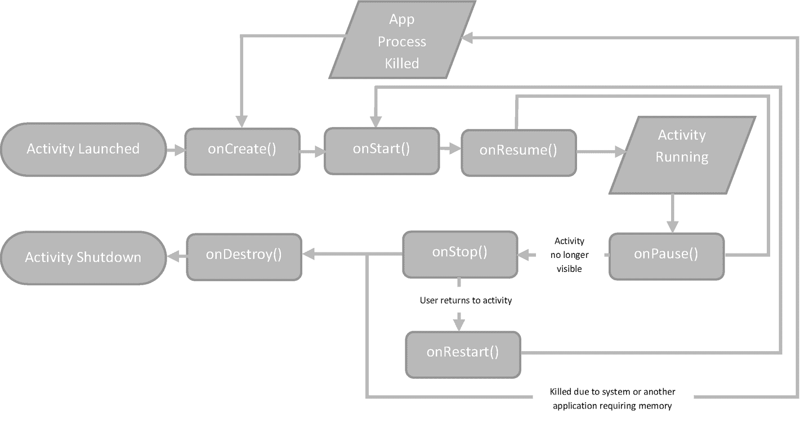
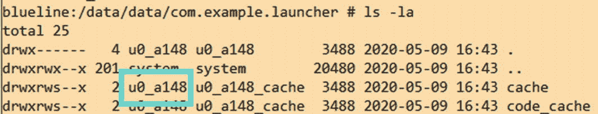
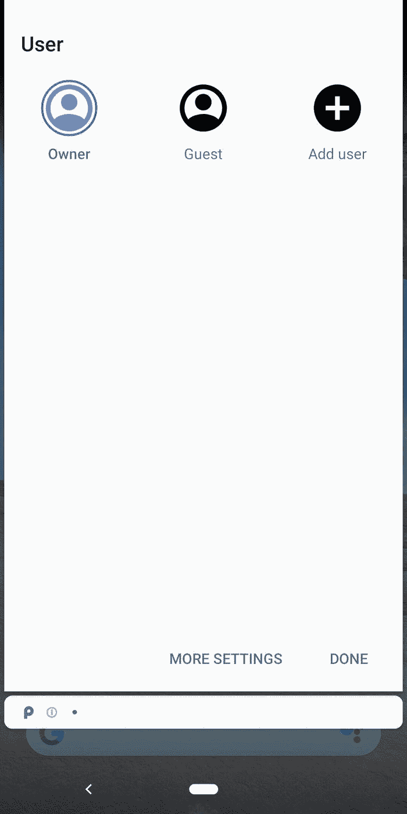
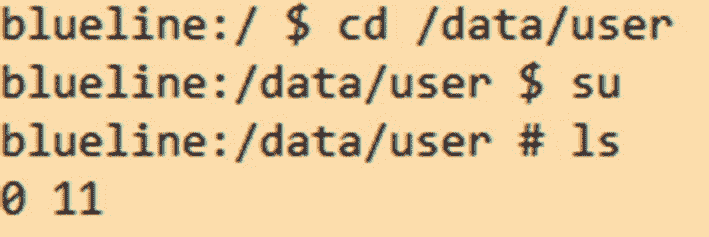

# Activity 生命周期

作为使用设备的一部分，应用程序的各个 Activity 可以进入许多不同的状态。Activity 类提供了有用的回调函数，当进入这些状态时会触发这些回调，以便应用程序能够做出适当的响应。完整的 Activity 生命周期如图 3-2 所示。



**图 3-2** Android 应用程序 Activity 生命周期

### `onCreate()`

当 Activity 首次创建时调用此回调。此方法接受一个参数 `savedInstanceState`，它是一个 Bundle，包含 Activity 先前保存的状态，如果之前不存在则为 `null`。

### `onStart()`

此回调准备 Activity 进入前台并使其对用户可见。每次 Activity 启动时都会调用此回调，除非是从暂停状态恢复。

### `onResume()`

当进入此状态时，Activity 已准备好与用户交互并进入前台。可能会发生中断事件，例如电话呼叫或用户切换到另一个 Activity——如果发生这种情况，Activity 将进入 `onPause()` 回调。

### `onPause()`

此回调指示 Activity 不再处于前台；然而，它不一定意味着它即将被销毁。

### `onStop()`

当 Activity 对用户不再可见时，在 Activity 被销毁之前调用此回调。这是应用程序应释放资源的地方。`onStop()` 回调是 Activity 将接收的最后一个回调。

### `onRestart()`

当 Activity 正在重新显示给用户时，在 `onStop()` 回调之后调用此回调。随后会调用 `onStart()` 和 `onResume()`。

## Android 用户

在 Android 中，有两个不同的概念都可以被标识为“用户”。

## Linux 用户

Android 是一个多用户 Linux 系统，其中每个应用程序都被沙盒化，这意味着每个应用程序由一个不同的用户代表。Android 系统为每个唯一的应用程序证书（签署 `apk` 文件的证书）分配一个唯一的 Linux 用户 ID，进而设置所有应用程序文件的权限，以便只有指定的 Linux 用户 ID 才能访问它们。^(⁹) 这意味着如果两个应用程序由同一个证书签署，则它们被放置在同一个沙盒中。当涉及到 `Signature` 权限类型（前面讨论过）时，这也是必需的，如果权限具有此类型，则只能由与创建该权限的应用程序具有相同证书的应用程序使用（通常用于禁止非系统应用程序访问系统权限）。

要查看应用程序的 Linux 用户 ID，您可以使用 `adb` 以 root 身份遍历到应用程序的文件系统（例如 `/data/data/com.android.chrome`），并使用 `ls -la` 命令，如图 3-3 所示。



**图 3-3** 在 adb shell 中看到的 Linux 用户 ID 示例

*以编程方式查看应用程序进程 ID：*

```
Log.v("应用程序进程 ID", String.valueOf(android.os.Process.myUid()));
```

*Shell 命令 `id -u` 也可以通过 `adb` 或通过运行时环境使用，如下所示：*

```
id -u
```

## Android 用户

Android 中用户的第二个概念是为设备的多个最终用户^(¹⁰) 设计的，旨在允许多个用户使用同一台 Android 设备。这是通过每个帐户拥有独特的应用程序数据和某些独特的设置来实现的。这反过来支持多个用户在一个用户活跃时在后台运行。

当前设备上活动的用户可以在 `/data/user` 目录下找到（如图 3-4 所示），或者通过 UI 用户屏幕（如图 3-5 所示）。由于不同的用户将拥有自己的内部存储和范围存储，因此使用相应的方法调用（例如，使用 `Context` 方法 `getFilesDir()`）来检索正确的文件路径非常重要，因为这些路径可能会随时间变化。一个用户无法访问另一个用户的内部存储，即使对于相同的应用程序也是如此。



**图 3-5** 最终用户在设备上看到的不同用户视图



**图 3-4** 在 adb shell 中看到的 Android 用户 ID 示例

## 脚注

---

