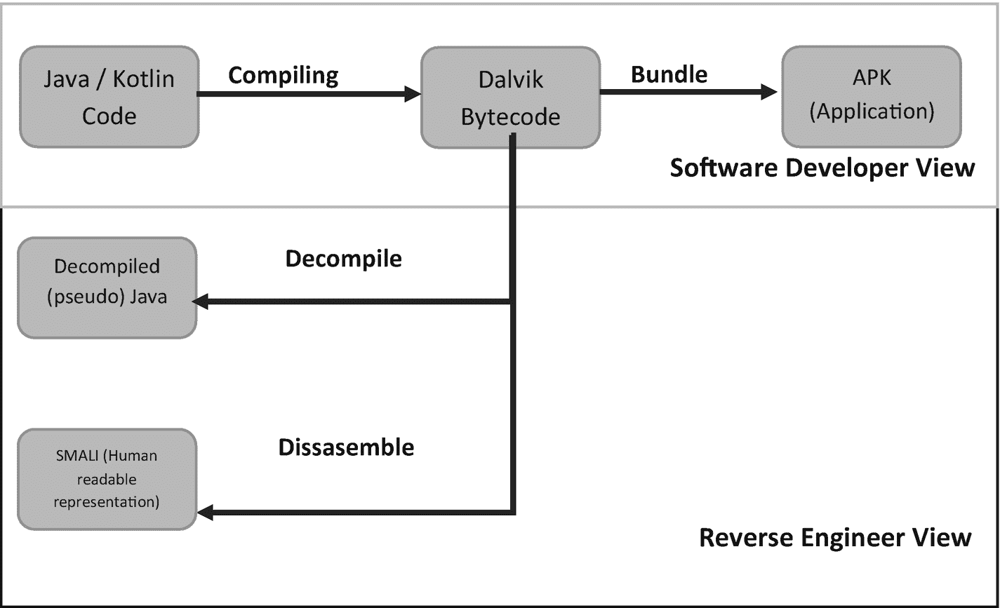

# 12. 反编译和反汇编 Android 应用程序

Android 应用程序使用 Java 或 Kotlin 编写。在构建应用程序时，这些代码会被编译为 Dalvik 字节码——以`dex`（Dalvik 可执行文件）文件形式呈现。这种 Dalvik 字节码是二进制的，因此不可读。在这种情况下，如果逆向工程师想要分析已编译的 Android 应用程序，他们只能选择反编译或反汇编 Dalvik 可执行文件。创建和逆向工程 Android 应用程序的过程如图 12-1 所示。



**图 12-1** 软件开发者和逆向工程师的处理视图

## 反编译的 Java

第一种选择是使用工具将 Dalvik 字节码反编译为可读的 Java。这种 Java 更像是伪代码而非实际 Java，因为它是反编译器对 Dalvik 汇编表示的“最佳猜测”。虽然这种视图对 Java 开发人员来说更熟悉，但通常不是最佳选择，因为它不仅不能代表实际应用程序代码，而且也无法运行或重新编译。诸如`dex2jar`和`jadx`之类的工具可用于反编译 Dalvik 可执行文件。`Jadx`可用于将`Jadx`项目导出为 Gradle 项目，从而允许将项目加载到 Android Studio 中。

*`APKTool`可用于从 APK 中提取`.dex`文件：*

```
apktool  -s d 
```

*使用`JADX`反编译并查看 APK 或 Dex 文件的反编译 Java 代码：*

```
jadx -e 
```

## 反汇编的 Dalvik 字节码（Smali）

与其反编译为伪 Java，不如使用反汇编器将 Dalvik 字节码恢复为其自身的可读表示形式。Dalvik 字节码更常用的形式称为 Smali。反汇编为 Smali 的好处在于，一个`dex`文件可以被反汇编、读取、修改、重新汇编和重新签名，并且仍然保持完全可用的状态。

*诸如`APKTool`之类的工具可用于反汇编 Dalvik 字节码：*

```
apktool d 
```

由于 Smali 的特性，其代码体积通常比 Java 或 Kotlin 大得多。例如，以下 Java 中的 Toast 代码（一个简单的 Android 弹出消息）的大小仅为相同 Smali 代码的一半。

*Java：*

```
Context context = getApplicationContext();
CharSequence text = "I'm a Toast";
int duration = Toast.LENGTH_SHORT;
Toast toast = Toast.makeText(context, text, duration);
toast.show();
```

*Smali：*


```smali
.line 13
const-string v0, "I'm a Toast!"
.line 14
.local v0, "text":Ljava/lang/String;
const/4 v1, 0x1
.line 16
.local v1, "duration":I
invoke-virtual {p0}, Lcom/example/simpletoastapp/MainActivity;->getApplicationContext()Landroid/content/Context;
move-result-object v2
move-object v3, v0
check-cast v3, Ljava/lang/CharSequence;
invoke-static {v2, v3, v1}, Landroid/widget/Toast;->makeText(Landroid/content/Context;Ljava/lang/CharSequence;I)Landroid/widget/Toast;
move-result-object v2
.line 17
.local v2, "toast":Landroid/widget/Toast;
invoke-virtual {v2}, Landroid/widget/Toast;->show()V
```

## 从运行中的设备提取 APK

为了分析（并进而反汇编或反编译）一个 Android 应用程序，你可能需要首先将其从设备中提取出来。可以使用 `adb` shell 来做到这一点。

以下使用包管理器列出设备上的所有包 ID：

```
pm list packages
pm list packages | grep chrome
```

接下来，可以再次使用包管理器来列出所需包的基础 APK 路径（例如包路径为 `/data/app/com.android.chrome-6piH3g1ET8uQozATuKwptQ==/base.apk`）：

```
pm path <package>
```

查看此命令返回的目录不需要特殊权限。但是，其父目录（`/data/app`）对于非 root 用户没有读取权限，这意味着无法通过这种方式枚举设备上的应用程序。

最后，提取 APK 的最简单方法是使用带以下参数的 `adb`：

```
adb pull <remote> <local>
```

同样值得记住的是，诸如 APK Hoarder 之类的工具，^((55)) 该工具是免费且开源的，可用于从设备中批量提取 APK。

## 脚注

## 13. 结语

本书的目的在于为你提供一份参考指南，其中包含对密切从事 Android 操作系统及其他 Android 安全元素工作的 Android 软件开发人员有用的信息。本书涵盖了从应用沙盒和 Dalvik 虚拟机到 Android 应用程序的存储类型，以及如何逆向工程一个已编译的 Android 应用程序等各个领域。

重要的是要记住，虽然本书中的核心原则在未来许多年内应继续具有参考价值，但随着新版本 Android 的发布，某些方面可能会发生变化。鉴于此，在继续使用本书作为参考指南的同时，也请查阅书中散布的脚注，以加深对所涵盖领域的理解。

还有大量其他优秀的资源可以支持你在 Android 编程、内部机制和逆向工程方面的知识；这里精选了一部分：

*   **Maddie Stone** - Android 应用逆向工程 101^((56))
*   **Jonathan Levin** - Android 内部机制^((57))
*   **Kristina Balaam** - Android 恶意软件分析 | YouTube^((58))
*   **Kristina Balaam** - Android 恶意软件分析 | LinkedIn Learning^((59))
*   **Ira R. Forman 与 Nate Forman** - Java 反射实战 | Manning 出版社^((60))
*   **Android 文档** | Android 开发者^((61))

除了这些资源，我还要特别感谢 JD，他是该领域的一位研究员和软件工程师，没有他的鼓励，我不会动笔写这本书。有关更多信息以及来自本书作者 James Stevenson 的更多资源，请访问我的网站 [`https://JamesStevenson.me/`](https://jamesstevenson.me/)。

## 脚注

## 索引

**A**
*   Activity 类
*   Activity 上下文
*   Activity 生命周期
    *   `onCreate()`
    *   `onPause()`
    *   `onRestart()`
    *   `onResume()`
    *   `onStart()`
    *   `onStop()`
*   `adb logcat` 命令
*   ADB shell
*   AES 加密
*   `AlarmManager`
*   Android 应用程序 Activity 生命周期
*   Android 调试桥 (`adb`)
*   Android ID
*   Android 启动器
    *   应用创建
    *   功能
    *   设置
*   `AndroidManifest.xml` 包属性
*   Android 权限
*   Android 运行时 (ART)
*   Android 沙盒
*   Android Shell
*   Android 用户
*   Android 版本
*   应用组件
    *   广播接收器
    *   内容提供者
    *   清单文件
*   应用上下文
*   应用 ID
    *   `build.gradle` 文件
    *   Gradle 构建文件
*   应用 ID
    *   Google Play 商店列表
    *   内部存储文件路径
    *   规则
    *   后缀与风味
*   应用的清单文件
*   Assets 文件夹
*   `AsyncTask`

**B**
*   电池与安全影响
    *   应用待机分区
    *   深度休眠
    *   类型
*   BootComplete 意图
*   启动分区
*   广播接收器
*   `BuildConfig.DEBUG`
*   `buildTypes` 标签

**C**
*   类
*   类加载
*   码分多址 (CDMA) 系统
*   以编程方式运行命令
*   组件的状态
    *   动态修改
    *   静态修改
*   组件类型
*   构造函数
*   内容提供者
*   上下文
    *   Activity 上下文
    *   应用上下文
    *   应用级别操作
    *   用例
*   `context.startService()` 方法
*   核心属性

**D**
*   Dalvik 字节码
*   Dalvik 虚拟机
*   数据库
*   反编译的 Java
*   `DexClassLoader`
*   dex 类加载
*   反汇编的 Dalvik 字节码 (Smali)

**E**
*   显式意图
*   外部存储

**F**
*   文件提供者
*   文件系统
    *   `/boot`
    *   `/cache`
    *   `/data`
    *   `/metadata`
    *   `/misc`
    *   `/odm`
    *   `/oem`
    *   `/radio`
    *   `/recovery`
    *   `/sdcard`
    *   `/system`
    *   `/tos`
    *   `/vendor`
*   前台服务

**G**
*   `getAction` 方法
*   `getCategories` 方法
*   `getClassLoader()`
*   `getDeclaredMethods`
*   `getExtras` 方法
*   `getMethods`
*   全球移动通信系统 (GSM)
*   Google Play 广告 ID
*   `gradle.build` 文件

**H**
*   严格限制的权限

**I**
*   隐式意图
*   意图
    *   动作
    *   属性
    *   类别
    *   核心属性
    *   显式
    *   附加数据
    *   过滤器
    *   标志
    *   隐式
    *   发送方法
    *   启动组件
*   `IntentService`
*   接口
*   内部存储
    *   `/cache`
    *   `/code_cache`
    *   `/databases`
    *   `/files`
    *   `/lib`
    *   `/no_backup`
    *   `/shared_prefs`
*   进程间通信 (IPC) 机制
*   `.isLoggable` 方法

**J, K**
*   Java 类加载器
*   Java 包名
*   Java 反射示意图
*   Java 运行时环境 (JRE)
*   `JobSchedulers`

**L**
*   Linux 用户
*   Log 类
*   Logcat
*   日志记录
    *   自定义 `DEBUG` 常量
    *   在 Java 中
    *   `.isLoggable` 方法
    *   标准日志记录
*   长时间运行的服务
    *   `AlarmManager`
    *   `AlarmReceiver`
    *   `AsyncTasks`
    *   `BootComplete` 意图
    *   `BootReceiver.java` 类
    *   `BroadcastReceiver`
    *   `IntentService`
    *   `JobSchedulers`
    *   线程化
    *   触发器
    *   类型
    *   `WorkManagers`

**M, N**
*   方法
*   `myText` 文件

**O**
*   混淆工具
*   `onCreate()`
*   `onPause()`
*   `onRestart()`
*   `onResume()`
*   `onStart()`
*   `onStop()`

**P, Q**
*   包 ID
*   分区
    *   外部存储
    *   文件夹
    *   内部存储
*   `PathClassLoader`
*   权限
    *   API 与权限级别
    *   最小权限模型
    *   清单
    *   特权与开发
    *   运行时
    *   类型
*   预验证器
*   私有构造函数
*   ProGuard
    *   白名单
    *   启用
    *   入口点
    *   保留类型
    *   映射文件
    *   规则
    *   技术
*   公钥/证书绑定
*   `putExtra` 方法

**R**
*   `READ_EXTERNAL_STORAGE` 权限
*   `READ_PRIVILEGED_PHONE_STATE` 特权权限
*   反射
    *   类初始化
    *   组件
    *   `getMethods` 与 `getDeclaredMethods`
    *   辅助类
    *   实例类
    *   私有构造函数
    *   静态方法
*   运行时权限对话框

**S**
*   `screencap`
*   `setComponentEnabledSetting` 方法
*   `setFlag` 方法
*   `setOverrideDeadline`
*   `setType` 方法
*   共享首选项
*   签名权限类型
*   SIM 卡序列号
*   软限制的权限
*   软件开发者与逆向工程师流程视图
*   标准日志记录
*   `startForegroundService()` 方法
*   静态方法
*   `stopSelf()` 方法
*   存储
    *   assets 文件夹
    *   数据库
    *   文件提供者
    *   分区
    *   资源
    *   文本文件

**T**
*   任务栈
*   文本文件
*   线程化
*   触发器

**U**
*   唯一标识符
    *   Google Play 广告 ID
    *   IMEI
    *   IMEI 与 MEID
    *   MEID
    *   电话号码
    *   SIM 卡序列号
*   `URLClassLoader`

**V**
*   虚拟机 (VM)

**W, X, Y**
*   `WorkManagers`

**Z**
*   Zygote
