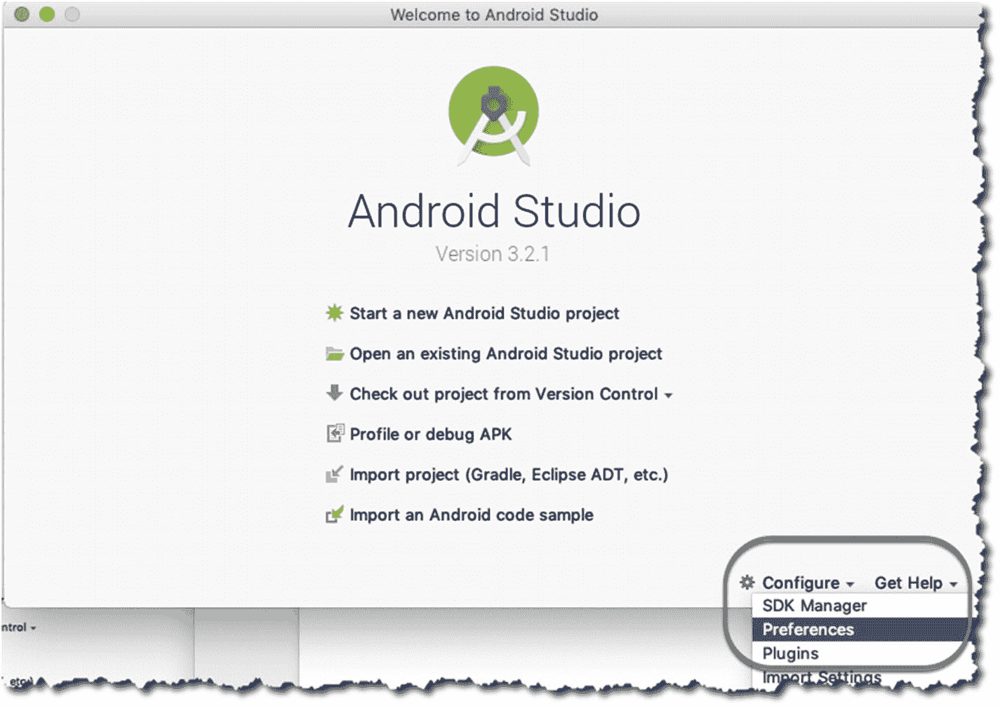
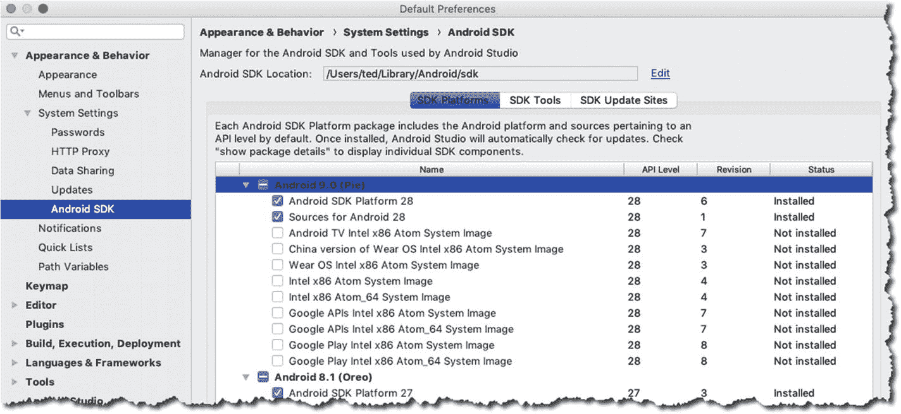
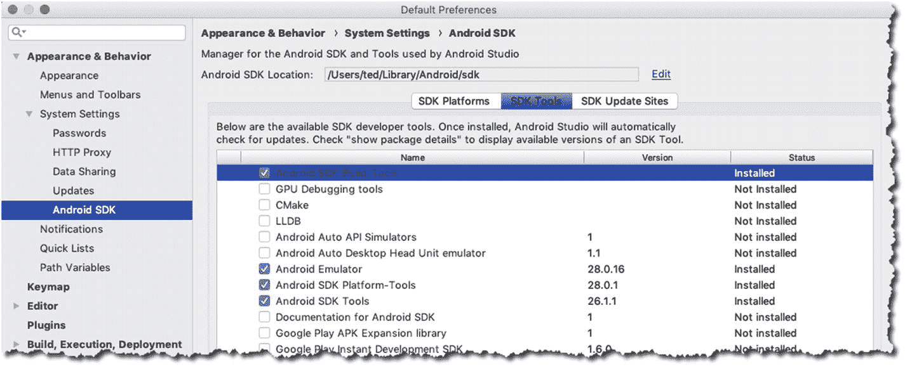
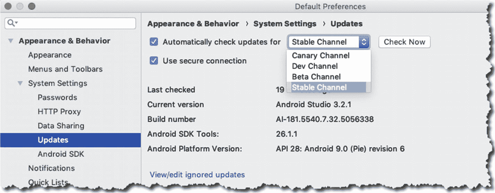

# 1. 安装与设置

*本章涵盖内容：*

- 安装 Android Studio
- 设置 IDE
- 基本配置

为 Android 开发应用程序并非一直如今天这般便捷。当 2008 年 Android 1.0 发布时，开发者获得的开发工具包不过是一组命令行工具和 Ant 构建脚本。如果你习惯使用 Vim、Ant 和其他命令行工具来构建应用程序，这倒不算太糟，但许多开发者并不习惯。缺少代码提示、项目设置和集成调试等 IDE 功能，在一定程度上构成了入门门槛。

幸运的是，2008 年也发布了适用于 Eclipse IDE 的 Android 开发工具（ADT）。Eclipse 曾经是、现在也仍然是许多 Java 开发者的最爱和首选 IDE。因此它成为 Android 开发者的首选 IDE 也是顺理成章的事。

从 2009 年到 2012 年，Eclipse 一直是 Android 开发的首选 IDE。Android SDK 在结构和范围上经历了重大和渐进式的变化。2009 年，SDK 管理器发布，用于下载工具、各个 SDK 版本以及用于模拟器的 Android 映像。2010 年，针对 ARM 处理器和 x86 CPU 发布了额外的映像。

2012 年是重要的一年，因为 Eclipse 和 ADT 终于捆绑在一起。在此之前，开发者必须分别安装 Eclipse 和 ADT，安装过程并不总是顺利。因此两者捆绑在一起大大简化了开始 Android 开发的过程。2012 年也是 Eclipse 作为 Android 主导 IDE 的最后一年。

2013 年，Android Studio（AS）发布。诚然，它仍处于测试阶段，但趋势已非常明确：它将成为 Android 开发的官方 IDE。Android Studio 基于 JetBrains 的 IntelliJ。IntelliJ 是一款商业化的 Java IDE，同时也有社区（免费）版本，该版本构成了 Android Studio 的基础。

## 设置 Android Studio

撰写本文时，Android Studio 的版本是 3.2.1；希望当你阅读本书时版本不会有太大变化。你可以从[`https://developer.android.com/studio`](https://developer.android.com/studio)下载。它适用于 Windows（32 位和 64 位）、macOS 和 Linux。我分别在 macOS (Mojave)、Windows 10 64 位和 Ubuntu 18 上执行了安装说明。我主要在 macOS 环境下工作，这解释了本书中大多数截图为何看起来像 macOS。Android Studio 在这三个平台上的外观、运行和操作体验（大部分）相同，仅在键盘快捷键和 macOS 的主菜单栏等细节上有微小差异。

在进一步操作之前，我们先看看 Android Studio 的系统要求。你至少需要以下配置：

- Microsoft Windows 7/8/10（32 位或 64 位）或
- macOS 10.10 (Yosemite 或更高版本) 或
- Linux (Gnome 或 KDE 桌面)，Ubuntu 14.04 或更高版本（64 位，但需要能够运行 32 位应用程序）
- 如果使用 Linux，需要 GNU C 库 (glibc 2.19 或更高版本)

硬件方面，你的工作站至少需要：

- 3GB 内存（推荐 8GB 或更多）
- 2GB 可用硬盘空间
- 最低 1280 x 800 屏幕分辨率

此列表来自 Android 官方网站（[`developer.android.com/studio`](https://developer.android.com/studio)），当然，配置越高越好。如果你能配备 16GB 内存、512GB 固态硬盘（或更大）以及全高清（或超高清）显示器，那将非常不错——绝对不错。

现在我们来看 JDK（Java 开发工具包）的要求。从 Android Studio 2.2 开始，安装程序自带内嵌的 OpenJDK。这样，初学者就不必额外安装 JDK 了，但你仍然可以按照自己的偏好单独安装 JDK。在本书中，我将假设你使用 Android Studio 自带的 OpenJDK。

从[`https://developer.android.com/studio/`](https://developer.android.com/studio/)下载安装程序，并获取适用于你平台的正确二进制文件。

如果你使用的是 macOS，请执行以下操作：

1. 解压安装程序的压缩文件。
2. 将应用程序文件拖入“应用程序”文件夹。
3. 启动 Android Studio。
4. 如果你之前安装过，Android Studio 会提示你导入一些设置。你可以导入这些设置——这是默认选项。


### 注意

如果你已安装过 Android Studio，可以继续使用旧版本，同时安装 Android Studio 3。新老版本可以共存，因为新版本的设置会存放在不同的目录中。

如果你使用的是 Windows 系统，请按以下步骤操作：

1. 解压安装文件。
2. 将解压后的目录移动到你选择的位置，例如 `C:\Users\myname\AndroidStudio`。
3. 进入 `AndroidStudio` 文件夹。文件夹内包含 `studio64.exe` 文件，这是需要启动的文件。建议为该文件创建快捷方式。右键点击 `studio64.exe` 并选择“固定到开始菜单”，即可将 Android Studio 添加到 Windows 开始菜单。你也可以将其固定到任务栏。

在 Linux 系统上安装比简单的双击并跟随安装向导要复杂一些。在未来的 Ubuntu（及其衍生版）版本中，安装过程可能会变得像 Windows 和 macOS 一样简单流畅，但目前仍需进行一些调整。在 Linux 上执行这些额外操作，主要是因为 Android Studio 需要一些 32 位库和硬件加速支持。

### 注意

本节中的安装说明适用于 Ubuntu 64 位及其他 Ubuntu 衍生版（例如 Linux Mint、Lubuntu、Xubuntu、Ubuntu MATE 等）。之所以选择该发行版，是因为它是非常常见的 Linux 版本，本书读者大多会使用它。如果你运行的是 64 位版本的 Ubuntu，则需要安装一些 32 位库才能使 Android Studio 正常运行。

要获取 Linux 所需的 32 位库，请在终端窗口中运行以下命令：

```
sudo apt-get update && sudo apt-get upgrade -y
sudo dpkg --add-architecture i386
sudo apt-get install libncurses5:i386 libstdc++6:i386 zlib1g:i386
```

所有准备工作完成后，请按以下步骤操作：

1. 解压下载的安装文件。你可以使用命令行工具或图形界面工具解压文件。例如，如果你的文件管理器支持，可以右键点击文件并选择“解压到此处”选项。
2. 解压后，将文件夹重命名为 `AndroidStudio`。
3. 将该文件夹移动到你拥有读取、写入和执行权限的位置。或者，你也可以将其移动到 `/usr/local/AndroidStudio`。
4. 打开终端窗口，进入 `AndroidStudio/bin` 文件夹，并运行 `./studio.sh` 命令。
5. 首次启动时，Android Studio 会询问是否要导入某些设置。如果你之前安装过其他版本的 Android Studio，可以导入这些设置。

## 配置 Android Studio

如果这是你第一次安装 Android Studio，你可能希望在开始编码工作之前配置一些内容。在本节中，我将引导你完成以下操作：

* 获取创建针对特定 Android 版本的程序所需的软件
* 确保拥有所需的所有 SDK 工具
* 以及选择性地更改更新方式

如果你尚未启动 IDE，请启动它，并点击“配置”选项，如图 1-1 所示。从下拉列表中选择“偏好设置”。



图 1-1. 从 Android Studio 的启动对话框进入“偏好设置”

点击“偏好设置”选项会打开偏好设置对话框，如图 1-2 所示。在对话框左侧，选择“Android SDK”选项。



图 1-2. SDK 平台

进入 SDK 窗口后，启用“显示包详情”选项，这样你可以看到每个 API 级别的更详细视图。你不需要下载 SDK 窗口中的所有内容，只需获取所需的项目即可。

SDK 级别或平台编号是 Android 的具体版本。Android 9（Pie）对应 API 级别 28，Android 8（Oreo）对应 API 级别 26 和 27，Nougat 对应 API 级别 24 和 25。你无需记住平台编号（至少现在不用），因为 IDE 会显示平台编号及其对应的 Android 昵称。

下载你的应用想要目标定位的 API 级别，但就本书而言，请下载 API 级别 27（Oreo）。这是你将在示例项目中使用的版本。请确保随平台一起下载 Google APIs Intel x86 Atom_64 System Image。你在后续测试运行应用程序时会用到它。

选择 API 级别目前可能不是什么大事，因为你正在处理的是练习应用。但是，当你计划公开发布应用时，就不能轻易做出这个选择了。为应用选择最低 SDK 或 API 级别将决定有多少人能够使用你的应用。在撰写本文时，25% 的 Android 设备使用 Marshmallow，22% 使用 Nougat，4% 使用 Oreo。这些统计数据来自 [`developer.android.com`](http://developer.android.com) 的仪表盘页面。建议定期访问 [`http://bit.ly/droiddashboard`](http://bit.ly/droiddashboard) 查看这些数据。

图 1-3 展示了 SDK 工具部分。



图 1-3. SDK 工具部分

你通常不需要更改此窗口中的任何内容，但检查一下是否已安装下方列表中标注为“已安装”的工具也无妨：

* `Android SDK Build Tools`
* `Android SDK Platform Tools`
* `Android SDK Tools`
* `Android Emulator`
* `Support Repository`
* `HAXM Installer`

检查这些工具可以确保你获得诸如 `adb`、`sqlite`、`aapt` 和 `zipalign` 等工具。这些工具有助于调试、构建、操作数据库、运行模拟等。

### 注意

如果你使用的是 Linux 平台，即使拥有 Intel 处理器，也无法使用 `HAXM`。在 Linux 上，将使用 `KVM` 代替 `HAXM`。

确认选择无误后，点击“确定”按钮开始下载软件包。

你需要进行的最后一个配置检查是设置更新通道。它位于相同的偏好设置窗口中。点击右侧的“更新”项目以显示更新设置，如图 1-4 所示。



图 1-4. 更新

Android Studio 默认配置为从你最初下载安装程序的通道获取更新。由于你是从稳定版通道下载的安装程序，因此默认情况下它将从该通道获取更新。你可以将通道更改为以下四个之一：

* **金丝雀版通道**：此通道用于最新测试版发布。由于可能每周更新一次，不适合用于生产代码。
* **开发版通道**：此通道与金丝雀版类似，但更稳定一些。仍不建议用于生产环境。
* **测试版通道**：此通道包含候选发布版。开发者基本上是在等待反馈，然后才会将其推送到稳定版通道。
* **稳定版通道**：这是官方稳定版发布，适合用于生产环境。


## 硬件加速

在编写应用时，为了获得即时反馈并确认应用是否按预期运行（或能否正常运行），你需要时不时地测试并运行它。为此，你将使用物理设备或虚拟设备。两种方案各有利弊，你无需二选一——实际上，你最终需要同时使用两者。

Android 虚拟设备（`AVD`）是一种可供你运行应用的模拟器。在模拟器上运行时，有时可能会很慢；因此谷歌和英特尔推出了`HAXM`，这是一种能减轻测试痛点的模拟加速工具。这对开发者来说无疑是福音——前提是你使用的机器拥有支持虚拟化的英特尔处理器，并且你使用的不是 Linux 系统。不过，如果你没这么幸运也不必担心，正如你稍后会看到的，在 Linux 中也有办法实现模拟加速。

macOS 用户或许最为轻松，因为`AS3`会自动安装`HAXM`。你无需任何额外操作，`AS3`安装程序会替你处理好一切。

Windows 用户可以通过以下方式获取`HAXM`：

* 从[`https://software.intel.com/en-us/android`](https://software.intel.com/en-us/android)下载。像安装其他 Windows 软件一样安装它：双击并按照提示操作。
* 或者，你也可以通过`AS3`的`SDK`管理器获取`HAXM`。这是推荐的方法。

对于 Linux 用户，推荐使用`KVM`。`KVM`（基于内核的虚拟机）是 Linux 的虚拟化解决方案，包含虚拟化扩展（如英特尔 VT 或 AMD-V）。

要获取`KVM`，你需要从软件仓库中拉取一些软件。但在此之前，你首先需要完成以下步骤：

1. 确保在 BIOS 或 UEFI 设置中启用了虚拟化功能。关于如何进入这些设置，请查阅你的硬件手册。通常的操作是：关闭电脑，重新启动，并在听到系统扬声器提示音后立即按下中断键（如`F2`或`DEL`），但正如我所说，请查阅你的硬件手册。
2. 完成设置并重启进入 Linux 后，检查系统是否能运行虚拟化。这可以通过在终端中执行以下命令来完成：`egrep –c '(vmx|svm)' /proc/cpuinfo`。如果返回的数字大于零，则可以继续安装。

要安装`KVM`，请在终端窗口中输入示例 1-1 中所示的命令。

```
sudo apt-get install qemu-kvm libvirt-bin ubuntu-vm-builder bridge-utils
sudo adduser your_user_name kvm
sudo adduser your_user_name libvirtd
示例 1-1.
安装 KVM 的命令
```

你可能需要重启系统才能完成安装。

希望一切顺利，你现在已经拥有了合适的开发环境。在下一章中，你将熟悉`Android Studio IDE`的各个部分。

## 本章小结

* 你可以为 macOS、Windows 和 Linux 系统获取 Android 和 Android Studio。每个平台都有预编译好的二进制文件，可在 Android 官网获取。
* `HAXM`提供了在 Android 虚拟设备上加速模拟的能力。如果你使用 macOS 或 Windows（搭载英特尔处理器），你将自动获得`HAX`。如果你使用 Linux，则可以用`KVM`替代`HAXM`。

