# 2. 快速操作指南

*本章涵盖内容*：

* 创建项目
* 创建 Activity
* 创建类和接口
* 生成方法重写代码
* 运行项目

在本章中，你将了解 Android 项目开发中的一些基本操作，例如创建项目、Activity、类、接口、方法，以及如何运行应用。这些元素大多可以手动完成，并无太大难度，但 Android Studio 提供了一些巧妙的功能来帮你更好地完成这些任务。Android Studio 能让这些操作更快捷、更准确。例如，手动输入重写签名容易出错，特别是当方法签名很长时。

## 创建项目

要创建 Android 应用，你需要先创建一个项目。项目本质上就是一个文件夹，用于存放构建应用所需的所有内容：Java 程序文件、图像、XML 资源等等。你既可以从 Android Studio 的启动屏幕（当没有打开任何项目时）创建项目，如图 2-1 所示；也可以从主菜单栏（当有其他项目处于打开状态时）创建项目，如图 2-2 所示。

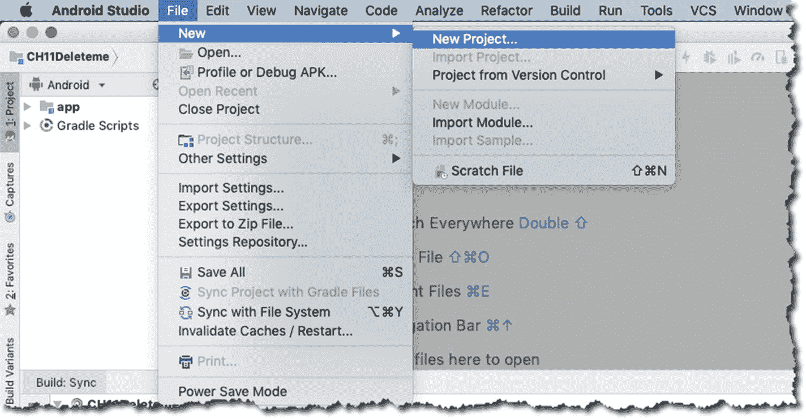

图 2-2. 从主菜单栏创建项目

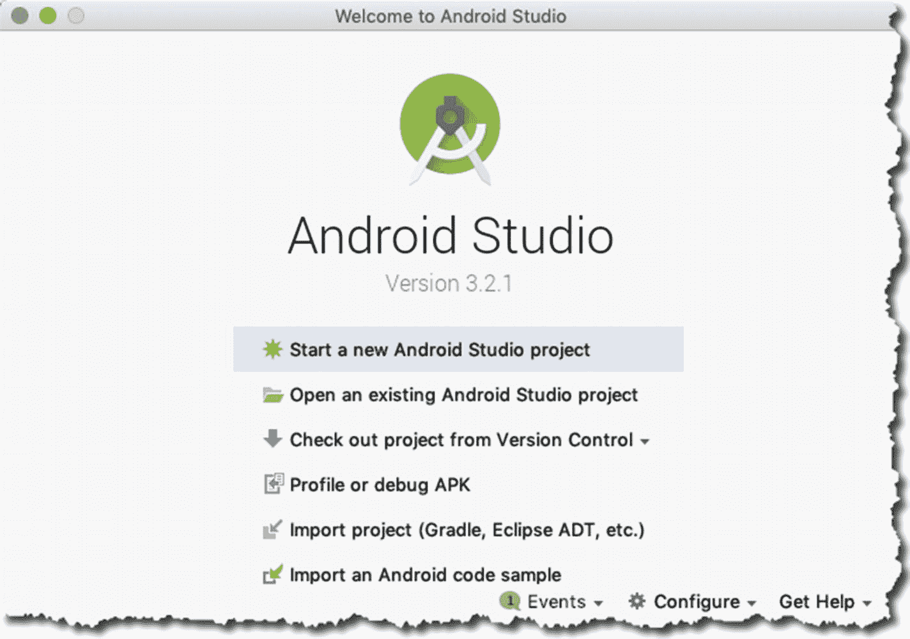

图 2-1. 从启动屏幕创建项目

如果你是第一次使用 Android Studio，并且是首次创建项目，那么很可能会从启动屏幕开始操作，如图 2-1 所示。

如果你在 IDE 中已经打开了一个现有项目，并想再创建一个新项目，可以通过主菜单栏的 `File` ➤ `New` ➤ `Project` 路径来完成，如图 2-2 所示。

无论你以何种方式启动项目，接下来都会看到如图 2-3 所示的界面，你可以在其中填写项目的一些详细信息。

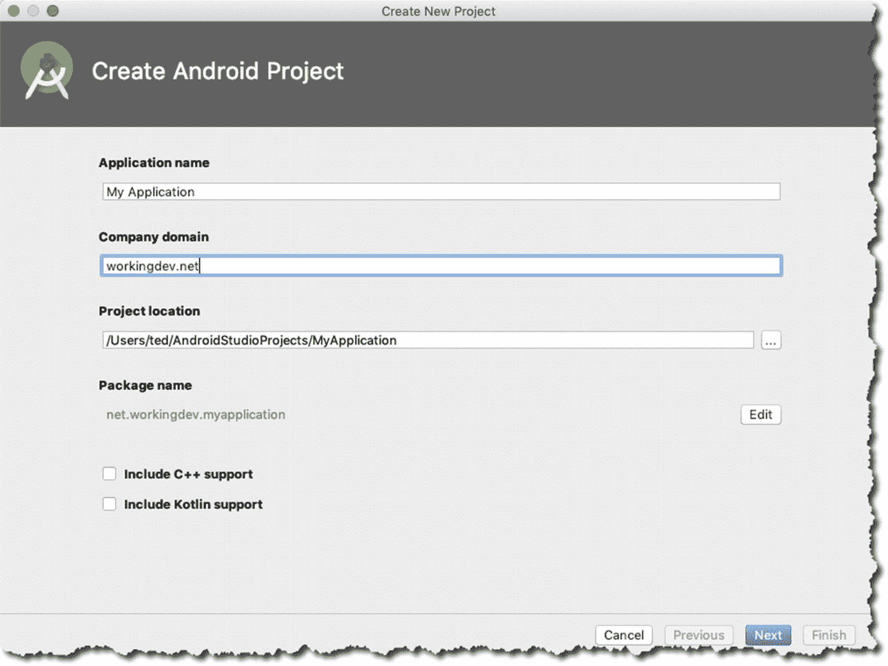

图 2-3. 新项目的详细信息

在此界面上，需要填写应用名称、公司域名以及项目的实际存放位置等信息。我取消勾选了 C++ 和 Kotlin 支持复选框，因为在本项目中你不需要用到它们。如果你打算将 Java 代码与 C 或 C++（NDK，即原生开发工具包）混合使用，则需要勾选 C++ 复选框；否则，请保持取消勾选状态，就像我做的那样。如果你想使用 Kotlin 而不是 Java 进行开发，则需要勾选 Kotlin 复选框；否则，也请像我这样保持取消勾选状态。

接下来的界面如图 2-4 所示，你可以在其中进一步配置项目。

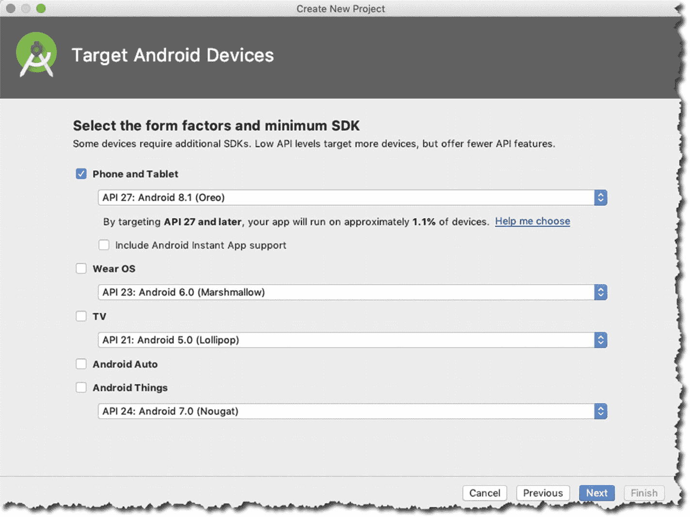

图 2-4. SDK 和外形因素

在此界面上，你可以为 Android 手表（Wear OS）、电视或 IoT（物联网）配置项目。我假设大多数 Android 初学者开发者，正如本书的潜在读者那样，会希望从一款能在手机或平板电脑上运行的应用开始，因此只勾选了 `"Phone and Tablet"` 复选框。

在接下来的界面中，如图 2-5 所示，你可以决定是否让向导生成一个 Activity。Activity 有几种选择，例如基础 Activity、底部导航 Activity 等。大多数 Android 应用至少会包含一个 Activity。你可以选择空 Activity。

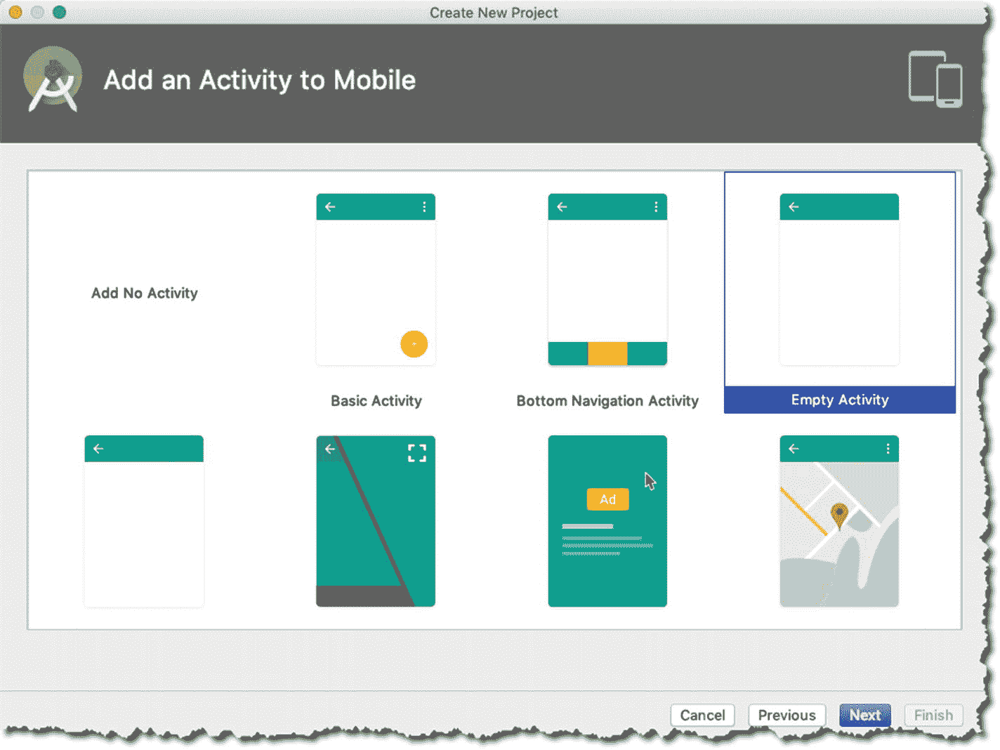

图 2-5. Activity 选项

现在你来到了向导的最后一个界面，如图 2-6 所示，你可以在其中决定 Activity 的名称以及该 Activity 对应的 XML 布局文件名。请勾选 `AppCompat` 复选框，这样即使应用运行在旧版 Android 系统上，也能使用现代的 Android 特性。

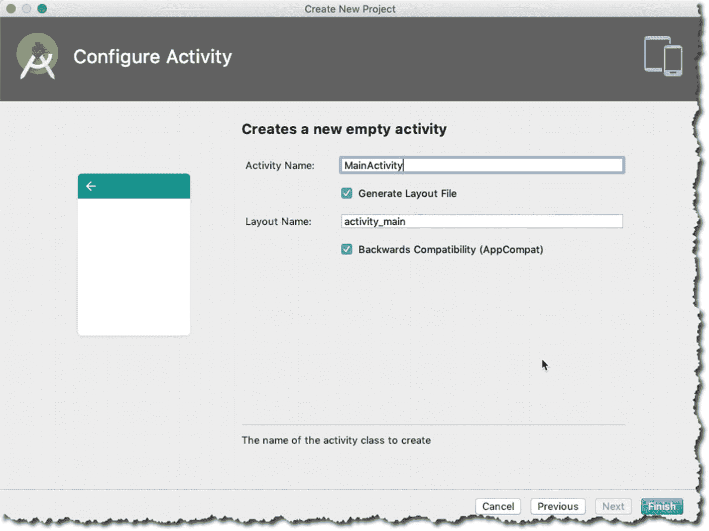

图 2-6. Activity 名称

点击 `Finish` 按钮，IDE 将开始生成并搭建一个包含一个空 Activity 的 Android 项目。图 2-7 展示了在 IDE 中打开的 `MyApplication` 项目。

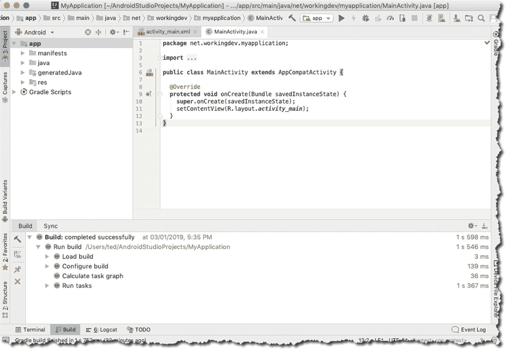

图 2-7. 在 IDE 中打开的 `MyApplication` 项目

一个向用户展示界面的简单应用至少需要以下三个要素：

*   一个 **Activity** 类，作为主程序文件
*   一个**布局文件**，包含所有 UI 定义（使用 XML）
*   一个**清单文件**，用于整合项目的所有内容（同样使用 XML）

项目创建向导已经为你处理好了所有这些要素。

### 创建 Activity

Activity 主要负责用户能在屏幕上看到的内容。`Activity` 类与 XML 布局文件共同构成了用户界面。有些应用只有一个 Activity，而有些应用则有多个。如果你需要向项目添加另一个 Activity，可以通过主菜单栏的 `File` ➤ `New` ➤ `Activity` ➤ `Empty Activity` 路径来操作。或者，你也可以使用图 2-8 所示的上下文菜单来创建 Activity。

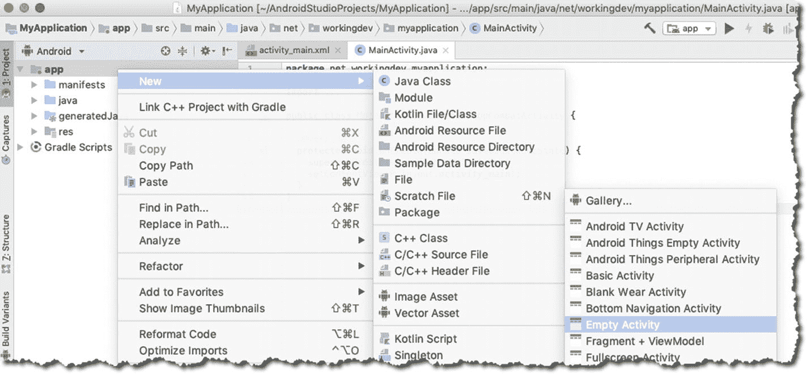

图 2-8. 创建新 Activity

要使用上下文菜单，请右键单击 `app` 文件夹（在项目工具窗口中），如图 2-8 所示，然后依次进入 `New` ➤ `Activity` ➤ `Empty Activity`。无论你用哪种方法添加另一个 Activity，都会进入一个对话框（如图 2-9 所示），你可以在其中填写新 Activity 的一些详细信息。

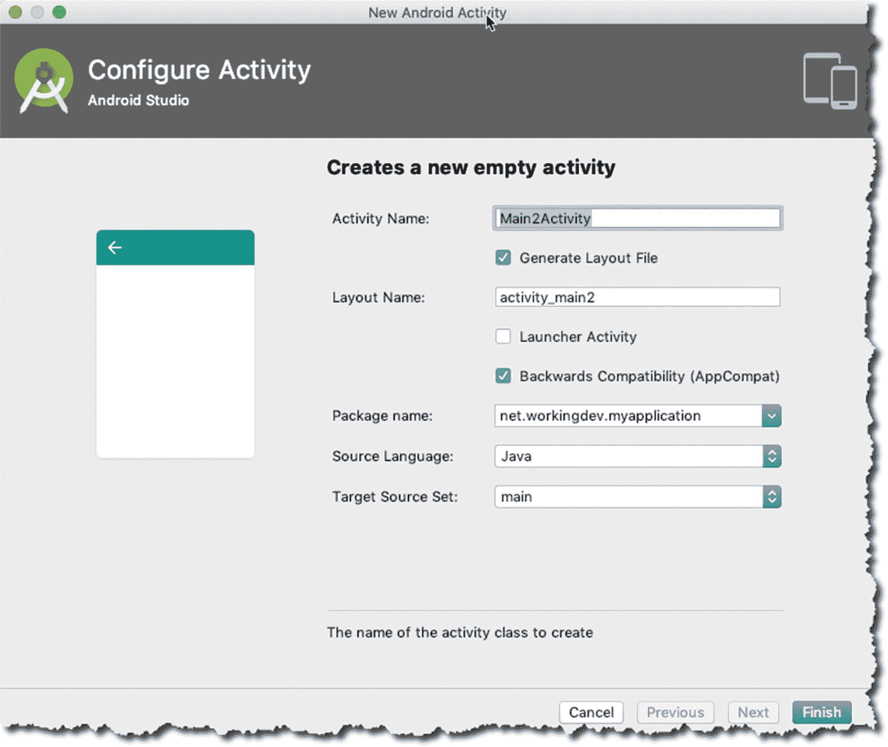

图 2-9. 新建 Android Activity

这些字段中的大部分你应该都很熟悉，因为在项目创建过程中你已经填写过一遍了。唯一可能有点让人困惑的复选框是 `Launcher Activity`。从图 2-9 中可以看到，它处于未勾选状态，你应该保持这种状态。如果你勾选了 `Launcher Activity` 复选框，就等于告诉 Android Studio 用这个新 Activity 替换启动 Activity（你在项目创建时创建的第一个 Activity）；这并非你所期望的操作，因此请保持该复选框未勾选状态。

### 注意

启动 Activity 是指应用启动后最先展示给用户的 Activity。启动 Activity 的配置位于 `ActivityMain.XML` 文件中。

### 创建类

要创建一个新类，最好先从项目工具窗口中选择项目的包，如图 2-10 所示。然后，你可以使用上下文菜单（右键单击）➤ `New` ➤ `Java class`。或者，你也可以通过主菜单栏的 `File` ➤ `New` ➤ `Java class` 来操作。

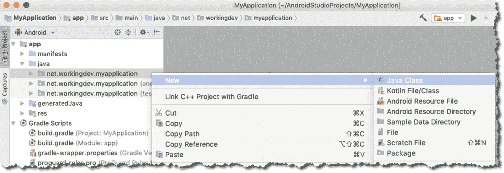

图 2-10. 使用上下文菜单创建新类

在接下来的界面中，如图 2-11 所示，你可以为新类填写一些详细信息。

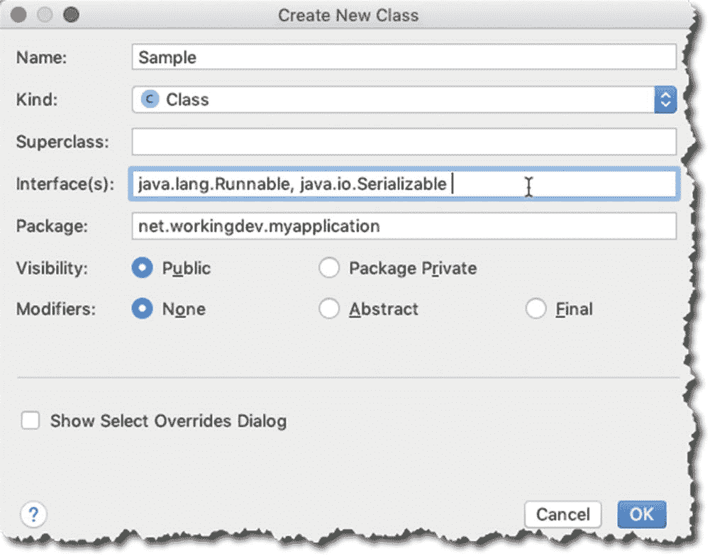

图 2-11. `Create New Class` 对话框

对话框窗口中的 `Package` 部分已经预先填入了正确的包名，因为你在创建类之前已经选择了项目的包（在项目工具窗口中）。如果你没有选择项目的包，`Package` 字段将会是空的。自己手动输入包名并不是什么大问题，但如果输入错误，则可能成为错误的潜在来源。

好的，作为一名高级文档工程师和翻译员，我将遵循您的所有注意事项，将给定的英文文本翻译成中文。

## 创建接口

要创建接口，请遵循与创建类时相同的步骤。

1.  使用上下文菜单，右键单击项目的包以将其选中。
2.  选择 **新建 > Java 类**。

图 2-12 显示了“创建新类”对话框。如图所示，单击 **种类** 下拉菜单，然后选择 **接口** 选项。

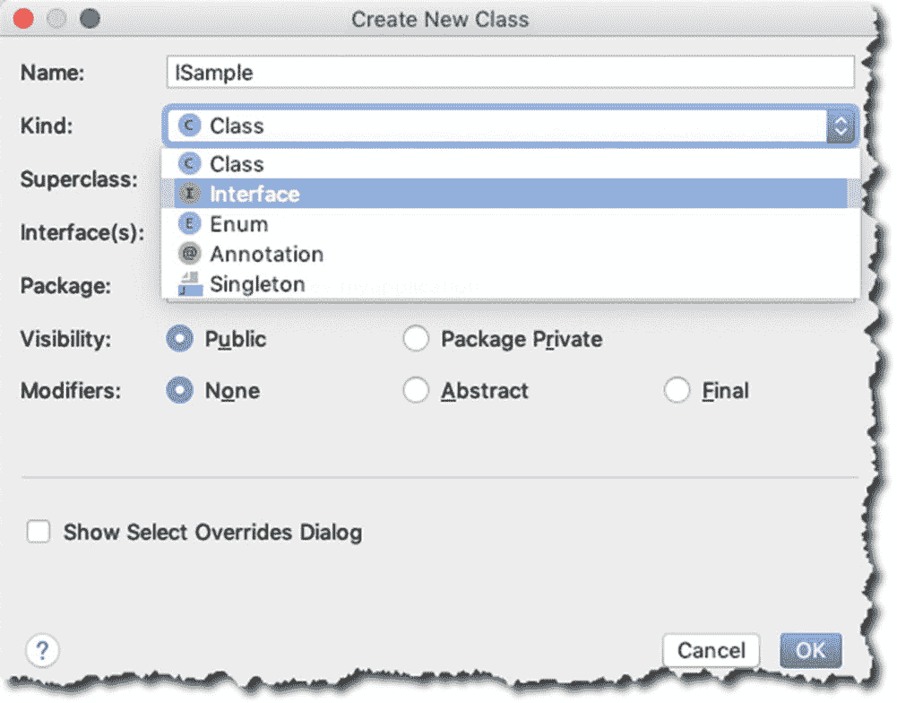

图 2-12. 创建新接口

## 重写方法

手动输入所有重写方法的签名可能不是什么大问题，但 Android Studio 实际上有一些巧妙的功能可以帮助您处理这些重写签名。

图 2-13 显示了您之前创建的 `Sample.java` 类。红色波浪线表示该类存在错误。将鼠标悬停在红色波浪线上会显示一个气泡提示，其中包含一些有关错误的信息。

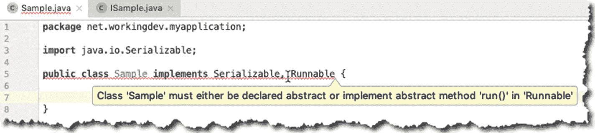

图 2-13. 包含错误的 `Sample.java`

要解决此错误，您必须重写 `Runnable` 接口的 `run()` 方法。您可以使用 Android Studio 的快速修复功能来解决此问题。当键盘光标位于红色波浪线的某处时，按 `Alt-Enter`（Linux 或 Windows）或 `Option + Enter`（macOS），如图 2-14 所示。

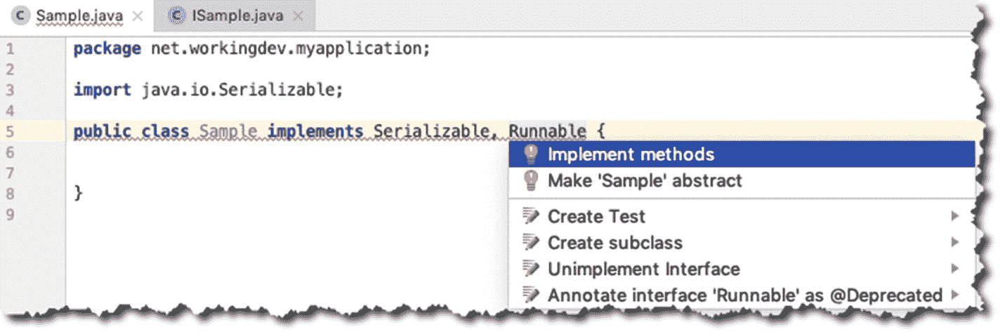

图 2-14. 快速修复

选择 **实现方法** 选项。接下来会显示 **选择要实现的方法** 对话框，如图 2-15 所示。

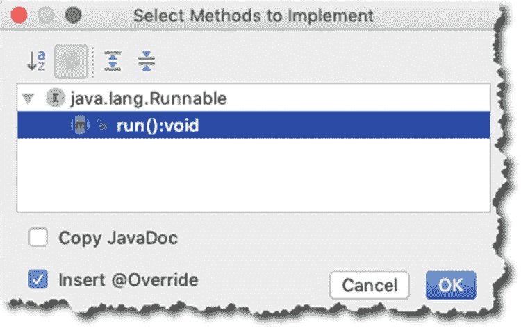

图 2-15. 选择要实现的方法

选择 `run():void`，然后单击 **确定**。Android Studio 将为您生成方法签名。

Android Studio 的快速修复功能不仅仅用于重写方法。只要在 IDE 中看到红色波浪线或任何其他显示错误的指示，您都可以使用它。该 IDE 足够健壮，能够在大多数情况下找出如何帮助您。

生成重写方法代码的另一种方法是使用 Android Studio 的 **生成** 功能。图 2-16 展示了如何操作。

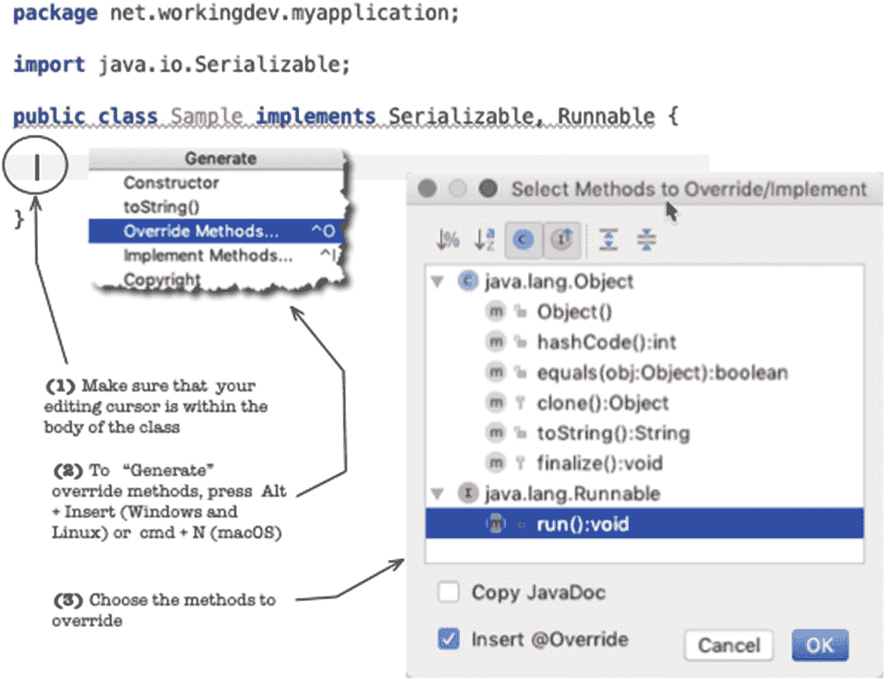

图 2-16. 使用生成功能重写方法

**生成** 功能非常通用。您可以使用它生成不少东西，例如 getter/setter、构造函数、新文件和新类，但就您当前的目的而言，您将使用它来生成要重写的方法。图 2-16 展示了代码生成过程的一般流程，但我们还是来回顾一下步骤。

1.  确保您的编辑光标在类内部。**生成** 功能是上下文相关的，因此如果编辑光标在类主体之外，您将不会获得图 2-16 中显示的选项。
2.  按 `Alt + Insert`（如果您使用的是 Windows 或 Linux）或 `Cmd + N`（如果您使用的是 macOS）。
3.  选择 **重写方法** 选项。
4.  选择要重写的方法。

## 运行项目

Android Studio 有几个用于构建和运行项目的选项；请参见表 2-1。

表 2-1. 构建和运行项目的键盘快捷键

|  | Windows 和 Linux | macOS | 描述 |
| --- | --- | --- | --- |
| 构建 | `Ctrl + F9` | `Cmd + F9` | 运行 Android Studio 的构建过程并生成 APK（Android 包） |
| 构建并运行 | `Shift + F10` | `Ctrl + R` | 与“构建”相同，但它还会将 APK 推送到已连接的设备或正在运行的模拟器 (AVD) |
| 应用更改（使用即时运行） | `Ctrl + F10` | `Ctrl + Cmd + R` | 允许您将代码更改推送到已连接的设备或模拟器，而无需构建新的 APK。它比“构建并运行”更快，因此请尽可能使用它。 |

## 章节总结

*   Android Studio 不止一种方法可以完成任务。您可以使用主菜单栏和上下文菜单来创建许多东西，例如新的 Activity、类或接口。
*   键盘快捷键比使用主菜单栏或上下文菜单快得多，因此花时间记住其中一些快捷键是值得的。
*   Android Studio 的 **生成** 功能不仅仅可以生成重写方法。您将在后续章节中探索它的其他功能。
*   Android Studio 中的快速修复是一个通用工具。只需单击红色波浪线，然后按 `Alt + Enter`（Windows 或 Linux）或 `Option + Enter`（macOS）。

