# 3. IDE

*本章内容涵盖：*

*   IDE 的各个部分
*   主编辑器
*   项目工具窗口
*   SDK 管理器
*   代码样式

在上一章中，您学习了如何创建项目并在 IDE 中打开它。在本章中，您将更详细地了解它的各个部分。

如果您尚未启动 Android Studio，现在是启动它的好时机。打开 Android Studio 后，您将看到欢迎屏幕，如图 3-1 所示。

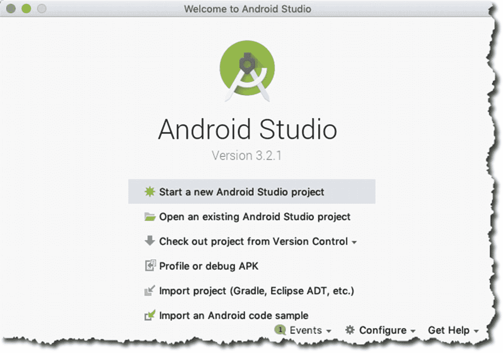

图 3-1. 欢迎使用 Android Studio


## 集成开发环境 (IDE)

从启动画面开始，假设您创建了一个新项目或打开了现有项目，图 3-2 展示了在 Android Studio 中打开项目时的各个组成部分。

| ➊ | **主菜单栏**：您可以通过多种方式在 Android Studio 中进行导航。通常，完成一项任务有不止一种方法，但主要的导航操作是在主菜单栏中完成的。如果您使用的是 Linux 或 Windows，主菜单栏直接位于 IDE 顶部；如果您使用的是 macOS，主菜单栏则与 IDE 分离（这是所有 macOS 软件的工作方式）。 |
| ➋ | **导航栏**：此栏允许您浏览项目文件。它是一组水平排列的箭头符号，类似于某些网站上常见的面包屑导航。您可以通过导航栏或“项目”工具窗口打开项目文件。 |
| ➌ | **工具栏**：它允许您执行多种操作（例如，保存文件、运行应用、打开 AVD 管理器、打开 SDK 管理器，以及执行撤消和重做操作）。 |
| ➍ | **主编辑器窗口**：这是最突出的窗口，拥有最大屏幕空间。编辑器窗口是您创建和修改项目文件的地方。它会根据您编辑的内容改变外观。如果您在处理程序源文件，此窗口将仅显示源文件。当您编辑布局文件时，您可能会看到原始的 XML 文件，或者布局的可视化渲染效果。 |
| ➎ | **项目工具窗口**：此窗口显示项目文件夹的内容。您可以从这里查看并启动所有项目资源（源代码、XML 文件、图形等）。 |
| ➏ | **工具窗口栏**：工具窗口栏沿着 IDE 窗口的周边布置。它包含激活特定工具窗口所需的各个按钮（例如，TODO、Logcat、项目窗口、已连接的设备等）。 |
| ➐ | **显示/隐藏工具窗口**：它用于显示（或隐藏）工具窗口栏。这是一个切换开关。 |
| ➑ | **工具窗口**：您可以在 Android Studio 工作区的侧面和底部找到工具窗口。它们是辅助窗口，允许您从不同角度查看项目。它们还允许您访问开发任务所需的典型工具（例如，调试、与版本控制集成、查看构建日志、检查 Logcat 转储、查看 TODO 项等）。以下是您可以使用工具窗口执行的一些操作：• 您可以单击工具窗口栏中的工具名称来展开或折叠它们。您还可以拖拽、固定、取消固定、附加和分离工具窗口。• 您可以重新排列工具窗口，但如果您觉得需要将工具窗口恢复为默认布局，可以通过主菜单栏来执行此操作；单击 `Window` ➤ `Restore Default Layout`。此外，如果您想自定义默认布局，可以根据自己的喜好通过主菜单栏重新排列窗口，方法是单击 `Window` ➤ `Store Current Layout as Default**.**` |

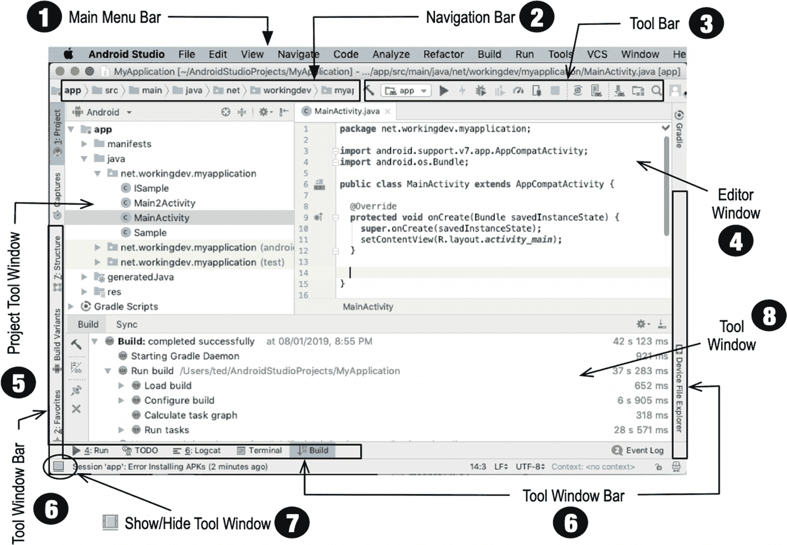

图 3-2.

Android Studio 的主要组成部分

### 主编辑器

与大多数 IDE 一样，主编辑器窗口允许您修改和处理源文件。其突出之处在于它非常了解 Android 开发资源。Android Studio 允许您处理多种文件类型，但您可能会花费大部分时间编辑以下类型的文件：

*   Java 源文件
*   XML 文件
*   UI 布局文件

当您处理 Java 源文件时，您会获得现代编辑器所应具备的所有代码提示和自动补全功能。此外，当代码出现问题时，它会提前给出大量警告。图 3-3 展示了在主编辑器中打开的一个 Java 类文件。该类文件是一个 Activity，并且其中一个语句缺少分号。Android Studio 会在 IDE 中布满（红色的）波浪线，表明该类无法编译。

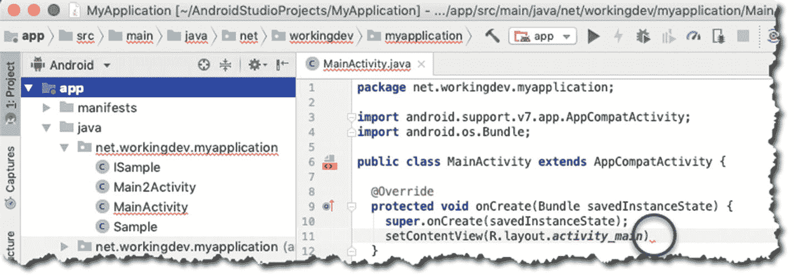

图 3-3.

显示错误指示器的主编辑器

Android Studio 会将波浪线放在非常接近问题代码的位置。如图 3-3 所示，波浪线正好放在预期需要分号的位置。

#### 编辑布局文件

用户看到的屏幕由 Activity 源文件和布局文件组成。布局文件是用 XML 编写的。Android Studio 无疑可以编辑 XML 文件，但其与众不同之处在于它能够以 WYSIWYG（所见即所得）模式直观地渲染 XML 文件。图 3-4 展示了两种处理布局文件的方式。

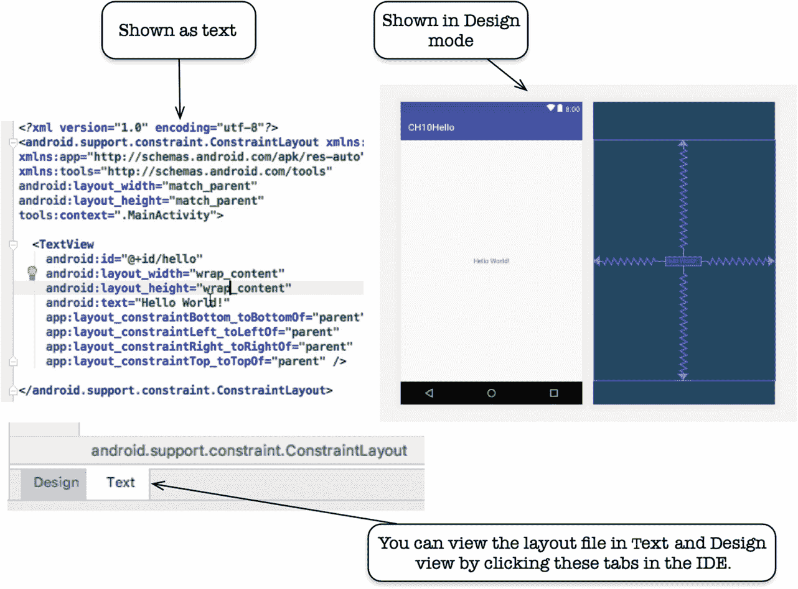

图 3-4.

布局文件的设计模式和文本模式编辑

图 3-5 展示了在“设计”模式下处理布局文件时，Android Studio 中相关的各个部分。

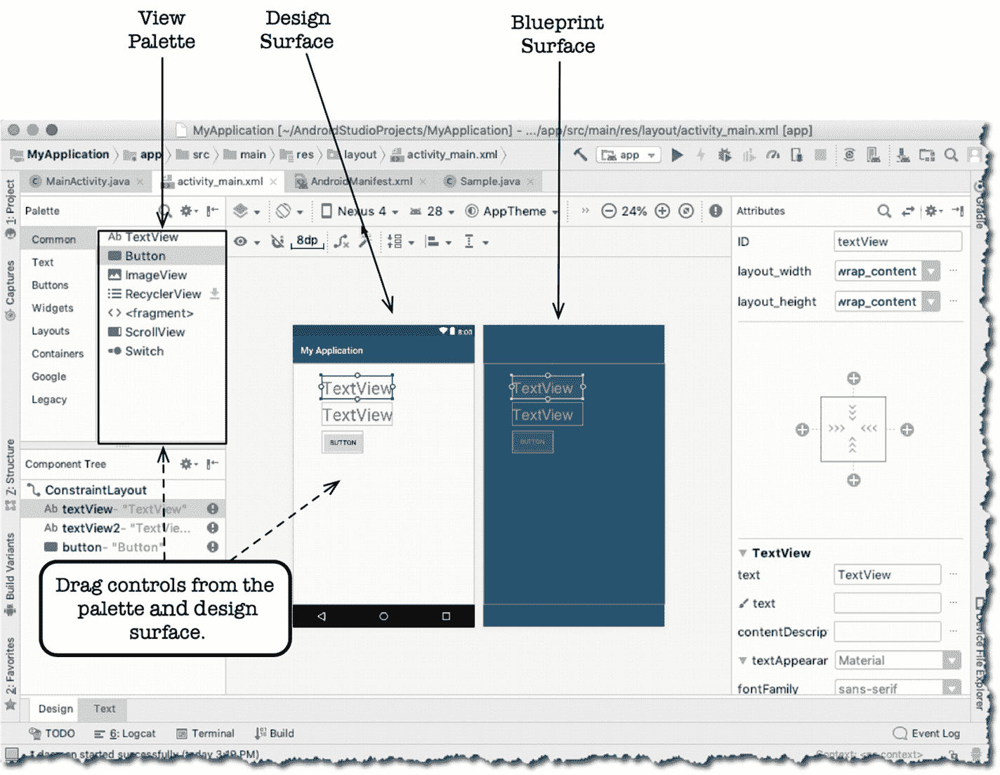

图 3-5.

Android Studio 的布局设计工具

*   **视图面板**：视图面板包含您可以拖放到设计界面或蓝图界面上的视图（小部件）。
*   **设计界面**：它充当屏幕的真实世界预览。
*   **蓝图界面**：类似于设计界面，但仅包含 UI 元素的轮廓。
*   **属性窗口**：您可以在此处更改 UI 元素（视图）的属性。当您使用属性窗口更改某个视图的属性时，该更改将自动反映在布局的 XML 文件中。同样，当您在 XML 文件中进行更改时，也会自动反映在属性窗口中。

#### 插入 TODO 项

您无需为应用的 TODO 列表创建单独的文件。当您创建包含 TODO 文本的注释时，例如

```
// TODO 这是一个示例待办事项
```

Android Studio 会跟踪所有源文件中的所有 TODO 注释。见图 3-6。

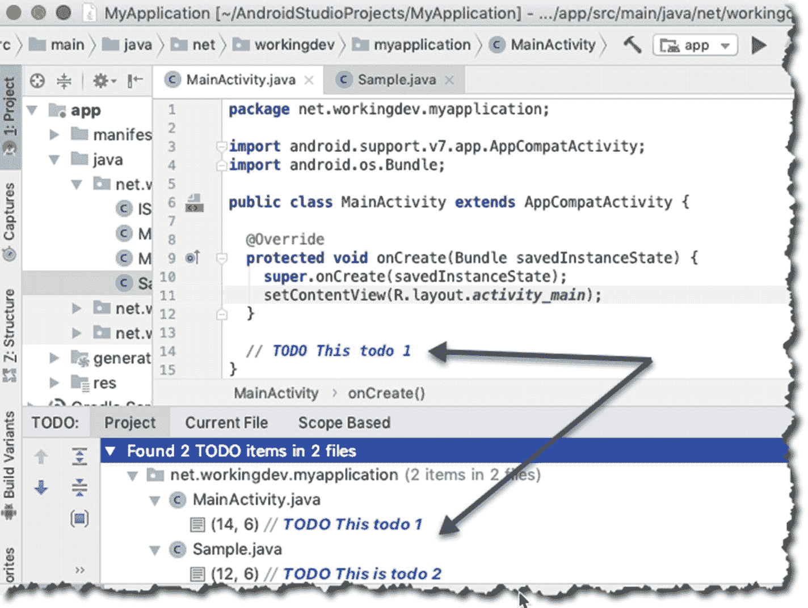

图 3-6.

TODO 项

要查看所有 TODO 项，请单击工具窗口栏中的 `TODO` 选项卡。


#### 如何为代码获取更多屏幕空间

你可以通过关闭所有工具窗口来获得更多屏幕空间。图 3-7 显示了一个在主编辑器窗口中打开的 Java 源文件，此时所有工具窗口均已关闭。只需点击工具窗口的名称即可将其折叠，因此要折叠`项目`工具窗口，请点击`项目`。

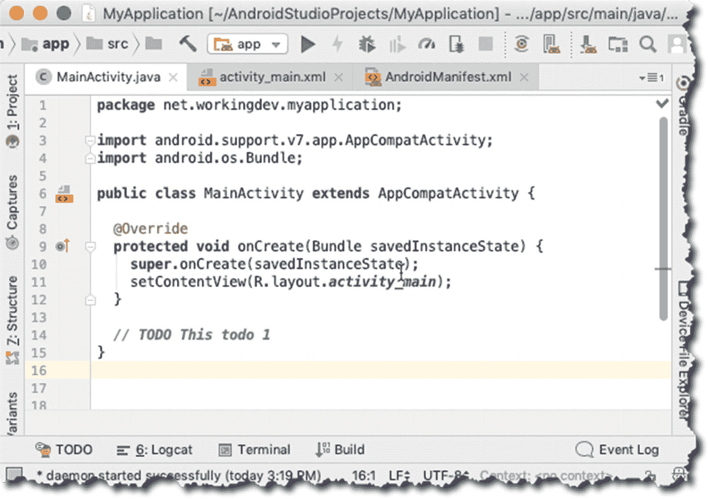

图 3-7. 所有工具窗口关闭后的主编辑器

你可以通过隐藏所有工具窗口栏来获得更多屏幕空间，如图 3-8 所示。

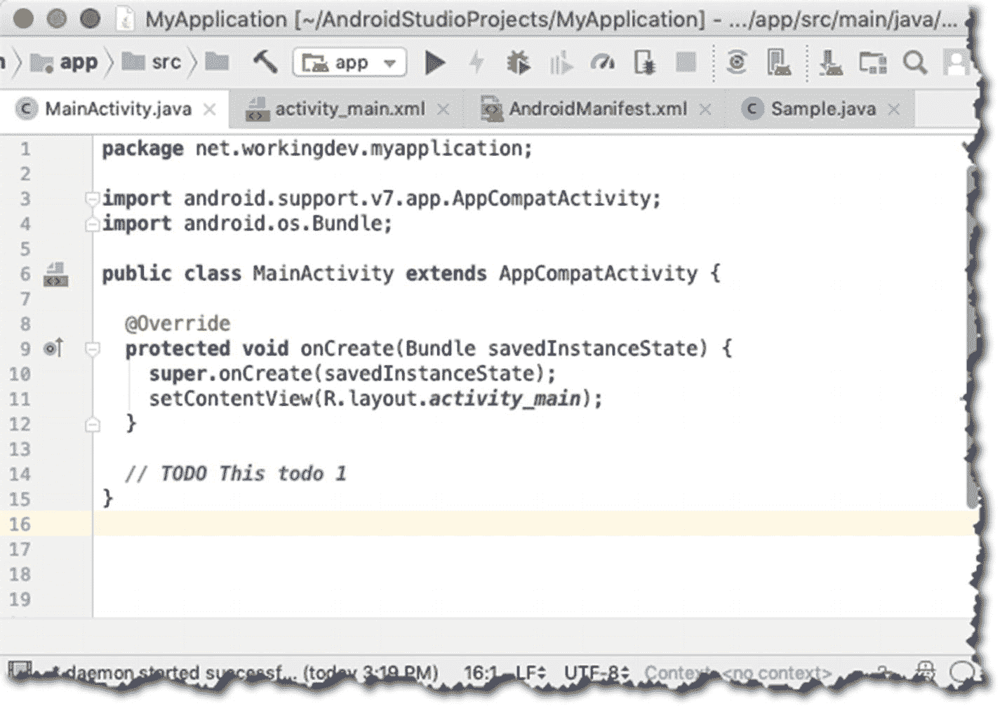

图 3-8. 所有工具窗口关闭且工具栏隐藏后的主编辑器

你可以通过进入免打扰模式来获得更多屏幕空间，如图 3-9 所示。你可以通过主菜单栏中的`视图` ➤ `进入免打扰模式`进入该模式。要退出该模式，请点击`视图` ➤ `退出免打扰模式`。

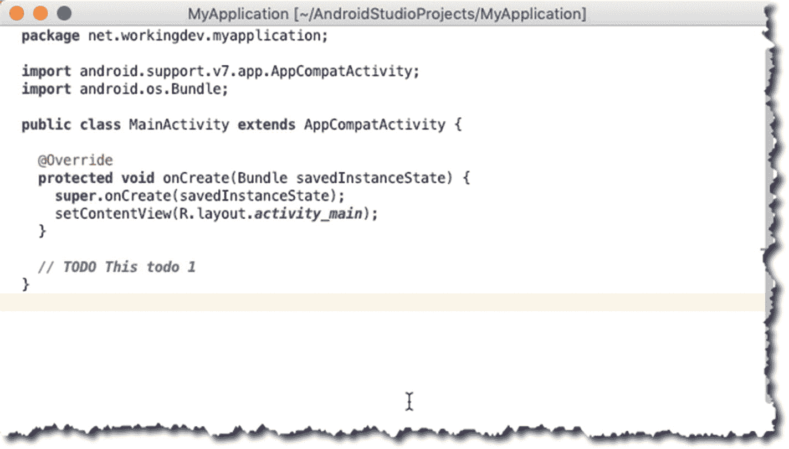

图 3-9. 免打扰模式

你也可以尝试另外两种可以增加屏幕空间的模式。它们同样位于主菜单栏的`视图`菜单中。

*   演示模式
*   全屏模式

### 项目工具窗口

你可以通过`项目`工具窗口访问项目中的文件和资源，如图 3-10 所示。该窗口采用树状结构，各个部分可折叠。你可以从该窗口启动任何文件。如果你想打开一个文件，只需在该窗口中双击该文件即可。

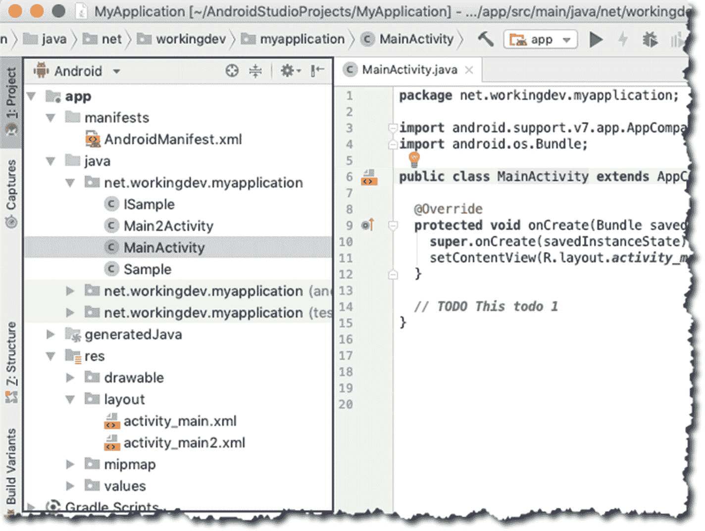

图 3-10. 项目工具窗口

默认情况下，Android Studio 以`Android`视图显示项目文件，如图 3-10 所示。`Android`视图按模块组织，以便快速访问项目中最重要的文件。你可以通过点击`项目`窗口顶部的下拉箭头来更改项目文件的显示方式，如图 3-11 所示。

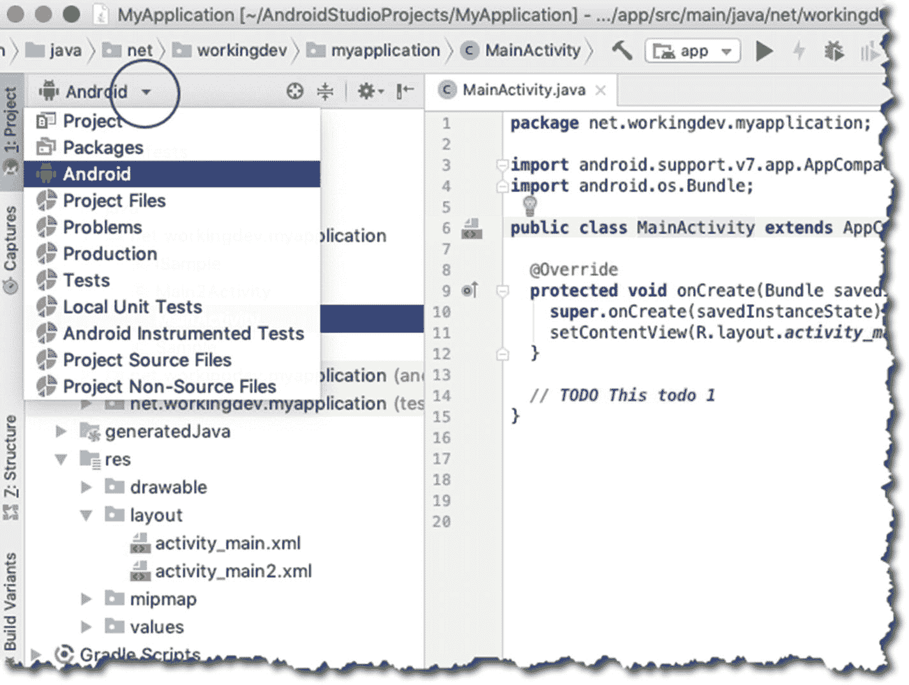

图 3-11. 如何在`项目`工具窗口中切换视图

### SDK 管理器

`SDK 管理器`用于管理需要下载到本地系统的 API 级别（Android 版本）以及其他 Android 工具。你可以通过`设置`或`偏好设置`窗口进入`SDK 管理器`，然后点击左侧的`Android SDK`项，如图 3-13 所示。

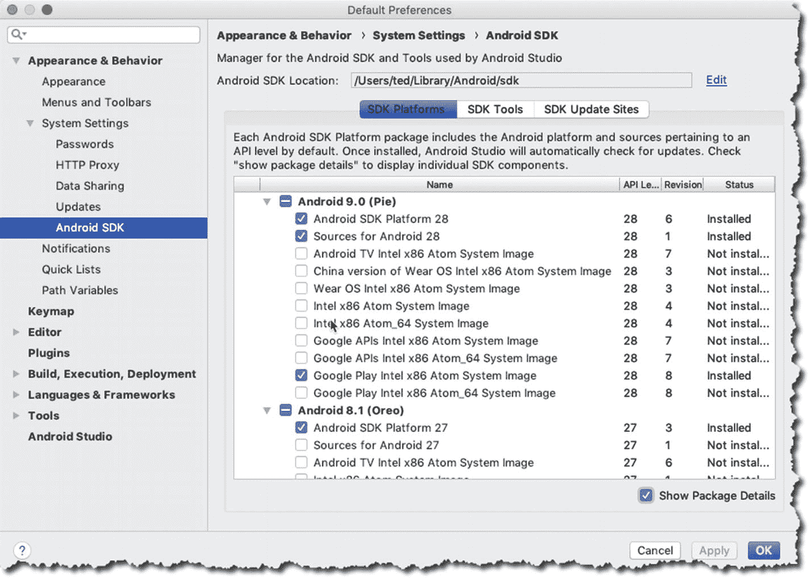

图 3-13. `SDK 管理器`

`SDK 平台`（你可以在此选择要下载的 Android 版本）、`SDK 工具`和`SDK 更新站点`可以通过点击窗口中间上方的相应选项卡进行访问。

你也可以从工具栏启动`SDK 管理器`，如图 3-14 所示。

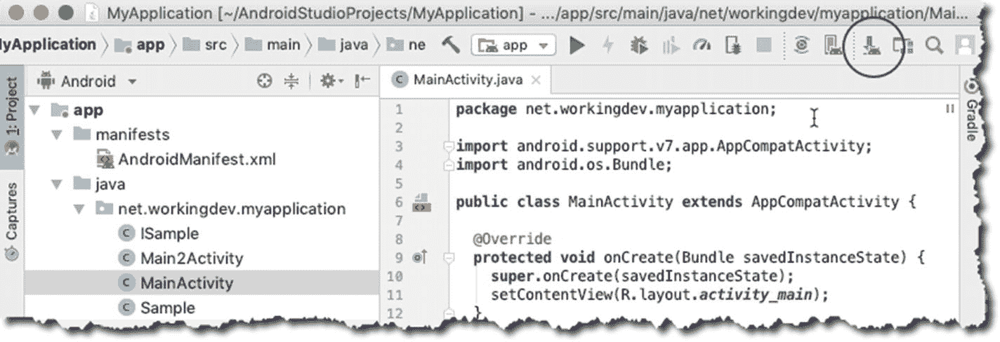

图 3-14. 从工具栏启动`SDK 管理器`

### 代码样式

你可以在`设置/偏好设置` ➤ `编辑器` ➤ `代码样式`中更改代码样式方案，如图 3-15 所示。

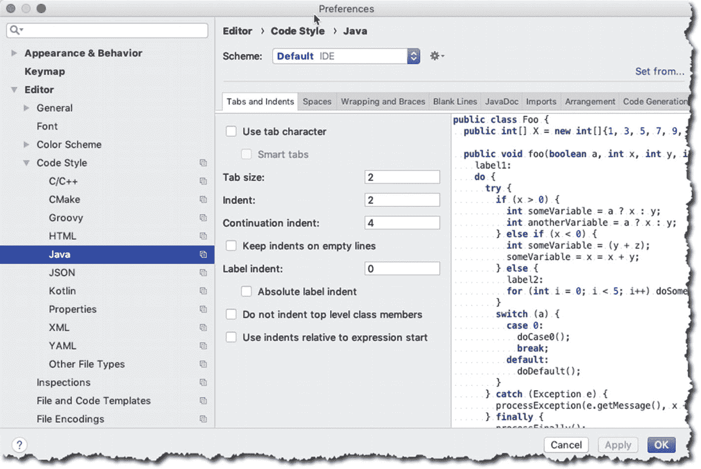

图 3-15. 代码样式

在此窗口中，你可以自定义制表符大小、缩进、代码中默认的空白量、getter 和 setter 的生成方式、代码生成、导入的处理方式，等等。

## 章节总结

*   你可以通过增加主编辑器的屏幕空间来查看更多代码。具体做法包括：
    *   折叠所有工具窗口
    *   隐藏工具窗口栏
    *   进入免打扰模式
    *   进入全屏模式
*   你可以在`设置/偏好设置` ➤ `编辑器` ➤ `代码样式`中更改 Java（或任何你喜欢的语言）的编码方案。
*   你可以通过切换`项目`工具窗口中的视图来更改项目文件的显示方式。
*   在 Android Studio 中添加`TODO`项很简单。只需添加一行注释，后跟一些`TODO`文本，如下所示：

    `// TODO 这是我的待办列表`

