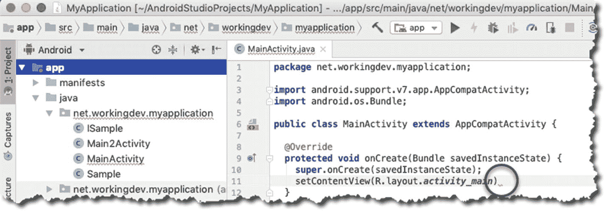
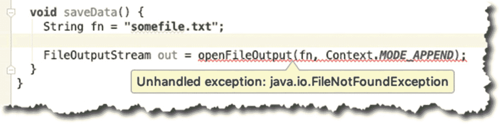
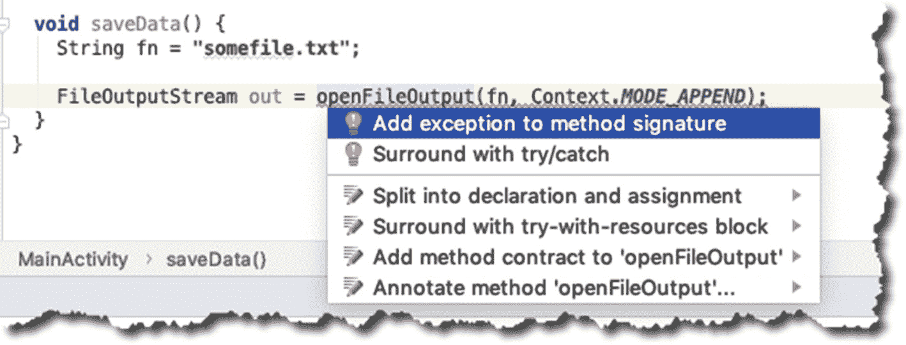
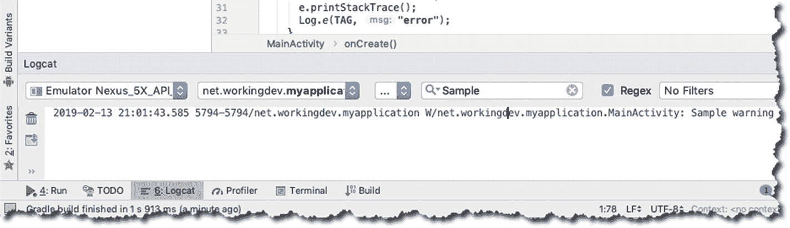
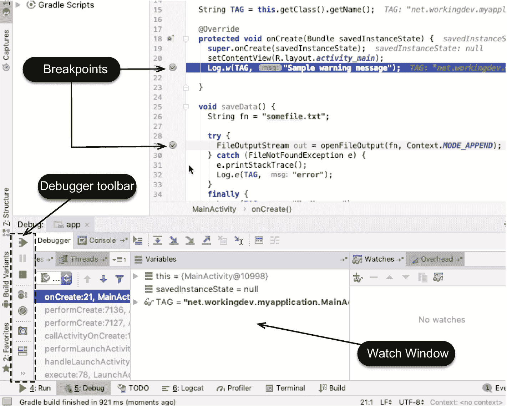
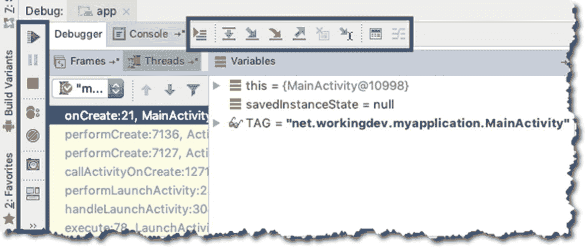

# 4. 调试

*本章内容涵盖：*

*   常见的错误类型
*   记录调试语句
*   使用调试器

处理错误是开发者日常工作的重要组成部分。本章将讨论你过去遇到且在未来仍可能遇到的各种错误类型。你将了解如何利用 Android Studio 来降低处理这些错误的难度。

## 错误类型

编程中最常遇到的三种错误是：

*   语法错误
*   运行时错误
*   逻辑错误

### 语法错误

语法错误正如其名：语法上的错误。它们发生的原因是你编写了不符合 Java 编译器规则集的代码。换句话说，编译器无法理解这些代码。错误可能是简单的忘记闭合括号或缺少一对花括号；也可能是复杂的传递了错误类型的参数给函数，或者在使用泛型时用错了参数化类。

你可以在 Android Studio 中轻松捕获语法错误。线索是主编辑器中的红色波浪线，如图 4-1 所示。



图 4-1. 显示错误指示器的主编辑器

它们表示代码中存在语法错误。IDE 将红色波浪线放置在非常接近问题代码的位置。如果将鼠标悬停在红色波浪线上，大多数情况下 Android Studio 能够以很高的准确度告诉你代码哪里出了问题。更重要的是，你可以使用一种恰如其名的“快速修复”技术来快速修复这类错误。

要执行快速修复，请将光标移动到红色波浪线范围内的任意位置，然后按`Alt + Enter`（Windows 或 Linux）或`Option + Enter`（macOS）。IDE 会处理其余操作。如果存在多种修复方法，IDE 会显示一些选项供你选择。


### 运行时错误

当代码遇到意料之外的情况时，就会发生运行时错误。顾名思义，这种错误只会在程序运行时发生，在编译期间不会出现。

Java 有两种类型的异常：*受检异常* 和 *非受检异常*。Android Studio 为受检异常提供了大量帮助。图 4-2 显示了当您尝试调用一个抛出受检异常的方法时，主编辑器中的情况；而对于非受检异常，您仍需自行处理。



图 4-2. IDE 提醒您需要处理异常

解决图 4-2 中所示错误有两种方法：您可以将 `openFileOutput()` 方法调用包含在 *try-catch* 结构中，或者像图 4-3 所示的那样，在方法签名中添加一个异常。



图 4-3. 快速修复

代码清单 4-1 展示了如何通过向方法签名添加 `throws` 子句来处理 `FileNotFoundException`。

```
import java.io.FileNotFoundException;
...
void saveData() throws FileNotFoundException {
String fn = "somefile.txt";
FileOutputStream out = openFileOutput(fn, Context.MODE_APPEND);
}
```

代码清单 4-1. 在 `saveData()` 中抛出 `FileNotFoundException`

代码清单 4-2 展示了使用 *try-catch* 块处理相同异常的代码。

```
void saveData() {
String fn = "somefile.txt";
try {
FileOutputStream out = openFileOutput(fn, Context.MODE_APPEND);
} catch (FileNotFoundException e) {
e.printStackTrace();
}
finally {
...
}
}
```

代码清单 4-2. 使用 `try-catch` 处理异常

当我想在本地处理异常时（即在与可能抛出异常相同的代码块中），我会使用 *try-catch*。大多数情况下，唯一要做的事情是 (1) 记录错误，以及 (2) 如果可能的话，尝试从错误中恢复，并让用户重试。

另一方面，使用 `throws` 子句意味着您不想在本地代码块中处理错误，而是希望调用方法来处理该错误。如果调用方法在其签名中也使用了 `throws` 子句，那么错误处理将沿着调用堆栈向上传递。

### 逻辑错误

逻辑错误是最难发现的。顾名思义，这是逻辑上的错误。当您的代码没有按照您预想的方式运行时，就是逻辑错误。处理逻辑错误的方法有很多，但在本节中，您将了解两种方法：在代码的特定位置打印调试语句，以及使用调试器逐步执行代码。

在检查代码时，您会识别出一些您非常确定其行为逻辑的区域，以及一些您不太确定的区域。您可以在后一类区域中放置调试语句。这就像留下可以追踪的面包屑。打印调试语句有几种方法。您可以使用 `println`、`Log` 或 `Logger` 类。

当您将 Logcat 的模式设置为详细、信息或调试时，您将看到 Android 运行时生成的所有消息。如果您希望能够过滤出警告或错误等消息，则需要使用 `Log` 或 `Logger` 类。

`Log` 类有五个静态方法：

```
Log.v(tag, message) // 详细
Log.d(tag, message) // 调试
Log.i(tag, message) // 信息
Log.w(tag, message) // 警告
Log.e(tag, message) // 错误
```

在每种情况下，*tag* 是一个 `String` 字面量或变量，通常是用 `Log` 的类名。*message* 也是一个 `String` 字面量或变量，包含您实际希望在日志中看到的内容。见代码清单 4-3。

```
package net.workingdev.myapplication;
import android.content.Context;
import android.support.v7.app.AppCompatActivity;
import android.os.Bundle;
import android.util.Log;
import java.io.FileNotFoundException;
import java.io.FileOutputStream;
public class MainActivity extends AppCompatActivity {
String TAG = this.getClass().getName();
@Override
protected void onCreate(Bundle savedInstanceState) {
...
}
void saveData() {
String fn = "somefile.txt";
try {
FileOutputStream out = openFileOutput(fn, Context.MODE_APPEND);
} catch (FileNotFoundException e) {
e.printStackTrace();
Log.e(TAG, "error");
}
finally {
Log.v(TAG, "My Message");
}
}
}
```

代码清单 4-3. `Log` 类的典型用法

当应用程序运行时，您可以在 **Logcat** 工具窗口中看到日志消息，如图 4-4 所示。您可以通过单击 IDE 底部菜单栏中的其选项卡，或从主菜单栏中选择 “视图” ➤ “工具窗口” ➤ “Logcat” 来启动 Logcat 窗口。



图 4-4. Logcat 工具窗口

## 调试器

Android Studio 包含一个交互式调试器，允许您在代码运行时逐步执行代码。使用交互式调试器，您可以在代码中的特定位置和特定时间点检查应用程序的快照——变量的值、正在运行的线程等。这些代码中的特定位置称为*断点*；您可以选择这些断点。

要设置断点，请选择包含可执行语句的行，然后单击其装订区域中的行号。设置断点时，装订区域会出现一个粉红色的圆圈图标，并且整行会高亮为粉红色，如图 4-5 所示。



图 4-5. 调试器窗口

设置好断点后，您需要在调试模式下运行应用程序。如果应用程序当前正在运行，请停止它，然后从主菜单栏中单击 “运行” ➤ “调试应用”。

### 注意

在调试模式下运行应用程序并不是调试应用的唯一方法。您也可以将调试器进程附加到当前正在运行的应用程序。在某些情况下，第二种技术很有用。例如，当您试图解决的错误在非常特定的条件下发生时，您可能希望先让应用程序运行一段时间，当您认为接近错误点时，再附加调试器。

像往常一样使用应用程序。当执行到您设置了断点的行时，该行会从粉红色变为蓝色。这表示代码执行已到达您的断点。此时，调试器窗口打开，执行停止，Android Studio 进入交互式调试模式。在此状态下，应用程序的状态会显示在 “调试” 工具窗口中。在此期间，您可以检查变量的值，甚至可以看到应用中正在运行的线程。

您还可以通过单击带眼镜标志的加号图标，在 “监视” 窗口中添加变量或表达式。您会得到一个文本字段，可以在其中输入任何有效的表达式。按回车键后，Android Studio 会计算该表达式并显示结果。要删除监视表达式，请选中该表达式，然后单击 “监视” 窗口中的减号图标。


### 单步执行

与大多数调试器一样，Android Studio 允许你逐行执行程序。当调试器在断点处停止时，你可以使用一些工具。通常，你需要了解如何执行以下操作。

-   **恢复程序**：恢复执行，直到遇到下一个断点。如果不再有断点，则程序会像正常执行时一样运行。
-   **步入**：如果下一行包含方法调用，此操作将跳转到该方法，并在其第一行暂停。
-   **单步跳过**：执行下一行的所有操作，然后跳转到再下一行。
-   **单步跳出**：执行完当前方法的剩余部分，然后在调用该方法之后的下一行语句处暂停。它本质上是从当前方法中退出。

你可以从主菜单栏的 `Run` 菜单中访问这些操作。你也可以从调试器工具栏（如图 4-6 所示）中访问它们。



图 4-6. 调试器工具栏

最后，你可以通过表 4-1 中介绍的键盘快捷键来执行单步操作。

表 4-1. 调试器键盘快捷键

| | Windows/Linux | macOS |
| --- | --- | --- |
| 调试 | `Shift + F9` | `Ctrl + D` |
| 恢复程序 | `F9` | `Command + Option + R` |
| 步入 | `F7` | `F7` |
| 单步跳过 | `F8` | `F8` |
| 单步跳出 | `Shift + F8` | `Shift + F8` |

## 章节总结

-   你可能遇到的三种错误类型是：编译时错误或语法错误、运行时错误和逻辑错误。
-   语法错误最容易修复。Android Studio 会为你提供大力支持，以便你快速发现语法错误。使用 AS3 有多种修复语法错误的方法，但大多数情况下，快速修复功能即可解决问题。
-   你可以通过设置断点并使用单步操作来逐行遍历你的代码。

