# 5. 单元测试

**本章内容涵盖：**

-   测试基础
-   如何运行高效的单元测试
-   添加并实现单元测试

软件测试的实践自软件开发诞生之初就已存在。当你编写程序时，需要一种方法来验证它们是否按预期方式工作。在软件开发的早期，测试是以一种相当临时的方式进行的：编写一些代码，再编写一些手工测试来检查其是否正确，然后回到代码中进行调整，如此循环往复。但现在情况已非如此。现代软件变得非常复杂，不能仅仅依赖少量手工测试来确保其正常运行。

在本章中，你将快速了解如何在 Android 中进行单元测试。单元测试是由开发人员（而非质量保证人员）执行的功能性测试。单元测试通常很简单，它针对一个方法可能执行或产生的某个特定行为。一个应用程序通常包含许多单元测试，因为每个测试都是一组定义得非常狭窄的行为。因此，你需要大量的测试用例来覆盖全部功能。你将使用 `JUnit` 来编写测试。

`JUnit` 是由 Kent Beck 和 Erich Gamma 编写的一个回归测试框架。在他们其他的成就中，你或许记得其中一位是极限编程的创始人，另一位则来自“四人组”（GoF，设计模式）。

Java 开发人员长期以来一直使用 `JUnit` 进行单元测试。Android Studio 内置了 `JUnit`，并且与之集成得非常好。你无需进行太多的设置工作，只需编写你的测试即可。

## JVM 测试 vs. 插桩测试

如果你检查任何一个 Android 应用程序，你会发现它由两部分组成：基于 Java 的行为和基于 Android 的行为。

Java 部分是你编写业务逻辑、计算和数据转换的地方。Android 部分则是你真正与 Android 平台交互的地方。在这里，你接收来自用户的输入或向用户展示结果。如果你能将基于 Java 的行为与 Android 部分分开测试，那会非常有意义，因为前者执行起来要快得多。幸运的是，Android Studio 已经采用了这种方式。当你创建一个项目时，Android Studio 会创建两个独立的文件夹：一个用于 JVM 测试，另一个用于插桩测试。图 5-1 显示了 Android 视图下的这两个测试文件夹，图 5-2 则显示了项目视图下的这两个文件夹。

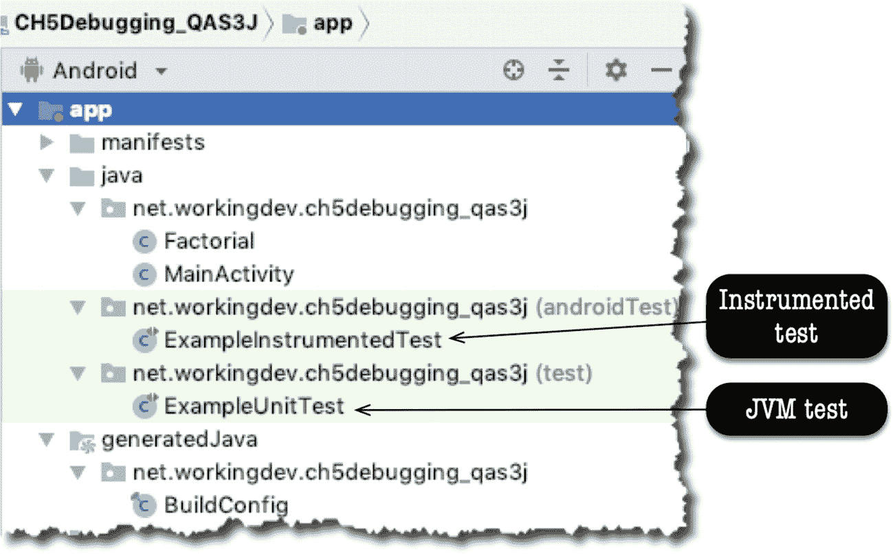

图 5-1. Android 视图下的 JVM 测试和插桩测试

JVM 测试文件夹简称为 `test`，而插桩测试文件夹称为 `androidTest`。

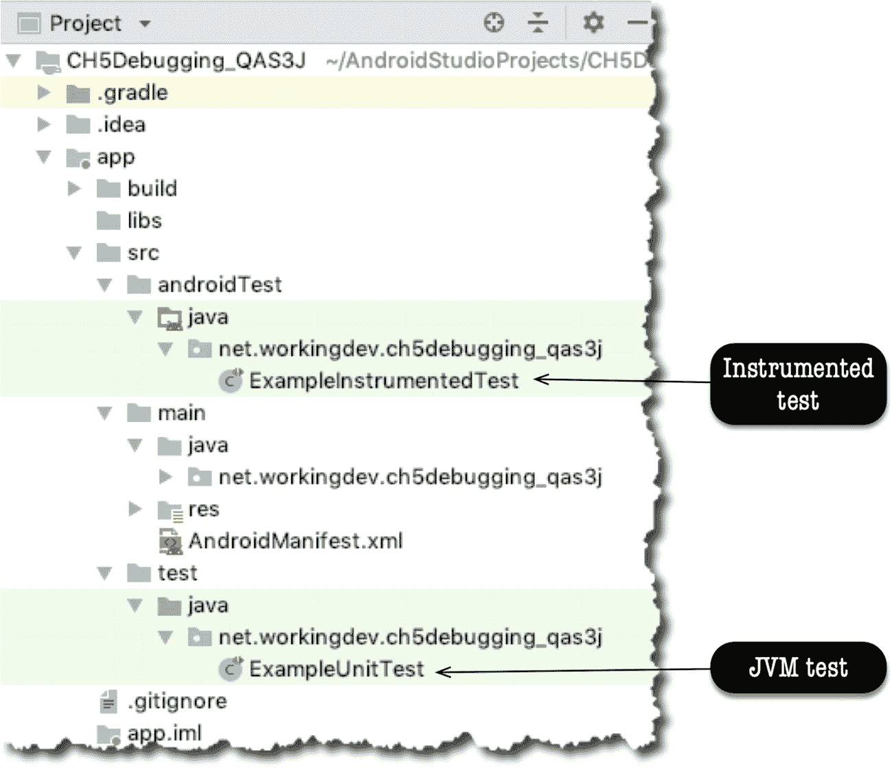

图 5-2. 项目视图下的 JVM 测试和插桩测试

从图 5-1 或 5-2 中可以看出，Android Studio 还额外生成了 JVM 测试和插桩测试的示例测试文件。这些示例文件可作为快速参考；它们展示了单元测试可能的样子。


## 简单示例

首先，在 Android Studio 中创建一个带有空白活动（Activity）的项目。创建一个类并命名为 `Factorial.java`。然后填入代码清单 5-1 所示的代码。

```
public class Factorial {
public static double factorial(int arg) {
if (arg == 0) {
return 1.0;
}
else {
return arg + factorial(arg - 1);
}
}
}
代码清单 5-1.
Factorial.java
```

确保 `Factorial.java` 在主编辑器中打开，如图 5-3 所示。然后，在主菜单栏中，依次选择 Navigate ➤ Test。同样，你也可以使用键盘快捷键（macOS 为 `Shift + Command + T`，Linux 和 Windows 为 `Ctrl + Shift + T`）来创建一个测试。

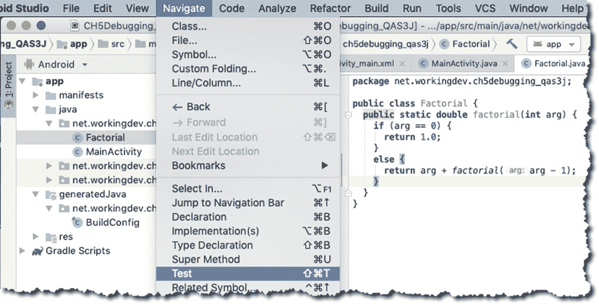

图 5-3.

为 Factorial.java 创建测试

点击 Test 选项后，会立即弹出一个对话框（图 5-4），提示你点击另一个链接。如图 5-4 所示，点击 Create New Test 选项。

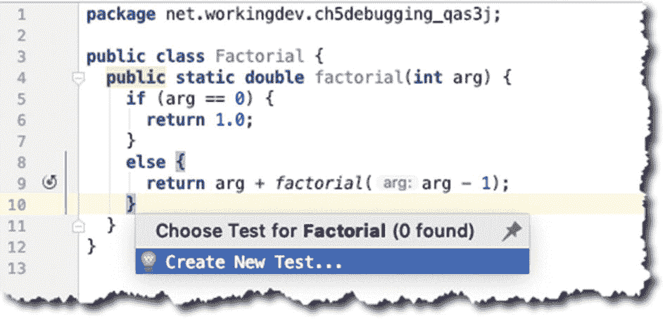

图 5-4.

“创建新测试”弹出窗口

创建新测试后，你会立即看到另一个弹出对话框，如图 5-5 所示，我已对其进行了注释。请遵循图 5-5 中的注释和说明。

| ➊ | 你可以选择要使用的测试库。你可以选择 JUnit 3、4 或 5。你甚至可以选择 Groovy JUnit、Spock 或 TestNG。我使用 JUnit4，因为它随 Android Studio 一起安装。 |
|➋ | 测试类的命名约定是“待测试类的名称”+“Test”。Android Studio 会按照此约定自动填充此字段。 |
|➌ | 将此字段留空，因为你不需要继承任何类。 |
|➍ | 暂时不需要 `setUp()` 和 `tearDown()` 例程，因此保持它们未选中状态。 |
|➎ | 选中 `factorial()` 方法，因为你希望为其生成一个测试。 |

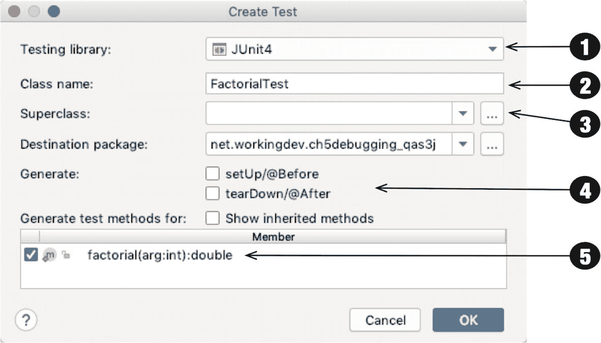

图 5-5.

创建 FactorialTest

点击 OK 按钮后，Android Studio 会询问你希望将测试文件保存在哪里。由于这是一个 JVM 测试，因此应将其保存在 `test` 文件夹中（而不是 `androidTest` 文件夹），如图 5-6 所示。点击 OK。

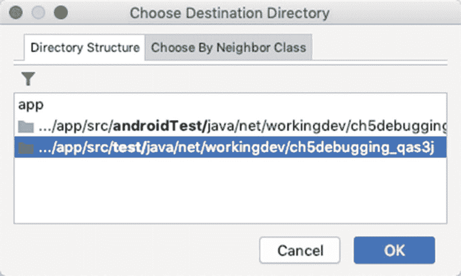

图 5-6.

选择目标目录

Android Studio 现在将为你创建测试文件。如果打开 `FactorialTest.java`，你将看到如图 5-7 所示的生成的骨架代码。

| ➊ | `FactorialTest.java` 文件已在 `test` 文件夹下创建。 |
|➋ | 创建了一个 `factorial()` 方法，并使用了 `@Test` 注解。JUnit 通过此注解知道此方法是一个单元测试。你可以为方法名添加“test”前缀，例如 `testFactorial()`，但这并非必要。`@Test` 注解已经足够。 |
|➌ | 这是放置断言的地方。 |

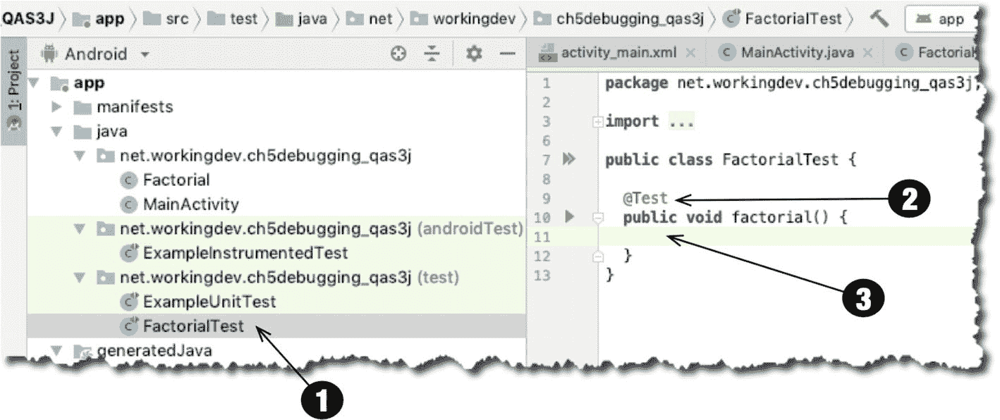

图 5-7.

项目视图和主编辑器中的 FactorialTest.java

看到了吗？这有多简单？在 Android Studio 中创建测试用例，在设置和配置方面实际上并不需要你投入太多精力。你现在需要做的就是编写测试。

## 实现测试

JUnit 提供了几个静态方法，你可以在测试中使用这些方法对代码的行为进行断言。你可以使用断言来展示预期结果，这就是你的控制数据。它通常是独立计算出来的，并且已知为真或正确——这就是你将其用作控制数据的原因。当从断言返回预期数据时，测试通过；否则，测试失败。表 5-1 显示了你的代码可能需要的常见 `assert` 方法。

表 5-1.

常用断言方法

| 方法 | 描述 |
| --- | --- |
| `assertEquals()` | 如果两个对象或基本类型具有相同的值，则返回 true |
| `assertNotEquals()` | `assertEquals()` 的反向操作 |
| `assertSame()` | 如果两个引用指向同一个对象，则返回 true |
| `assertNotSame()` | `assertSame()` 的反向操作 |
| `assertTrue()` | 测试一个布尔表达式 |
| `assertFalse()` | `assertTrue()` 的反向操作 |
| `assertNull()` | 测试对象是否为空 |
| `assertNotNull()` | `assertNull()` 的反向操作 |

既然你已经了解了几种 `assert` 方法，那么就可以开始编写测试了。代码清单 5-2 展示了 `FactorialTest.java` 的代码。

```
import org.junit.Test;
import static org.junit.Assert.*;
public class FactorialTest {
@Test
public void factorial() {
assertEquals(1.0, Factorial.factorial(1),0.0);
assertEquals(120.0, Factorial.factorial(5), 0.0);
}
}
代码清单 5-2.
FactorialTest.java
```

你的 `FactorialTest` 类只有一个方法，这仅用于演示目的。可以肯定的是，实际代码中的方法会比这多得多。

请注意，每个测试（方法）都通过 `@Test` 注解来标识。JUnit 通过此注解知道 `factorial()` 是一个测试用例。另外请注意，`assertEquals()` 是 `Assert` 类的一个方法，但这里你没有写完整的限定名，因为你已经对 `Assert` 进行了静态导入。这确实使编码更轻松。

`assertEquals()` 方法接受三个参数。图 5-8 阐明了这三个参数的含义。

| ➊ | 预期值是你的控制数据；这通常在测试中硬编码。 |
|➋ | 实际值是你的方法返回的值。如果预期值与实际值相同，则 `assertEquals()` 通过；表明你的代码行为符合预期。 |
|➌ | Delta（差值）旨在反映实际值和预期值之间可以有多接近，并且仍然被认为是相等的。一些开发人员将此参数称为“模糊因子”。当预期值与实际值之间的差异大于模糊因子时，`assertEquals()` 将失败。我这里使用了 0.0，因为我不想容忍任何偏差。你可以使用其他值，例如 0.001、0.002 等；这取决于你的用例以及你的应用愿意容忍的模糊程度。 |

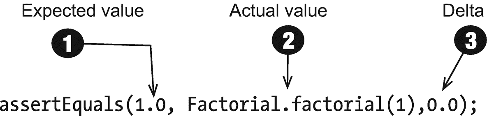

图 5-8.

assertEquals 方法

现在你的代码已经完成。如果你愿意，可以在代码中再插入几个断言，以更好地掌握其用法。

这个示例代码中没有包含几件事。我没有重写 `setUp()` 和 `tearDown()` 方法，因为我不需要。如果你需要设置数据库连接、网络连接等，通常会使用 `setUp()` 方法。使用 `tearDown()` 方法来关闭你在 `setUp()` 中打开的任何资源。

现在让我们运行测试。


## 运行单元测试

你可以单独运行一个测试，或运行类中的所有测试。主编辑器左侧的绿色小箭头是可点击的。点击类名旁边的小箭头将运行该类中的所有测试。当点击测试方法名旁边的小箭头时，只会运行该测试用例。见图 5-9。

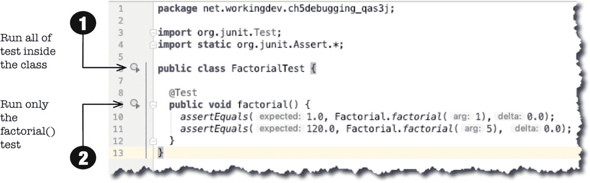

图 5-9. 主编辑器中的 `FactorialTest.java`

同样，您也可以通过主菜单栏的 **运行** ➤ **运行** 来运行测试。

图 5-10 显示了文本执行的结果。

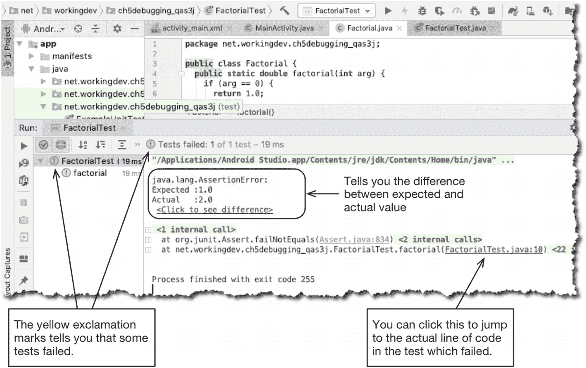

图 5-10. 运行 `FactorialTest.java` 的结果

Android Studio 会提供大量提示，以便您判断测试是通过还是失败。第一次运行会告诉你 `Factorial.java` 存在问题；`assertEquals()` 执行失败了。

### 提示

当测试失败时，最好使用调试器来检查代码。`FactorialTest.java` 与项目中的任何其他类并无不同；它只是另一个 Java 文件，因此你完全可以对其进行调试。在你的测试代码的战略位置设置一些断点，然后不要“运行”它，而是运行调试器，以便你可以单步执行。

测试失败是因为 1 的阶乘不是 2，而是 1。如果仔细观察 `Factorial.java`，你会注意到阶乘值计算不正确。

编辑 `Factorial.java` 文件，将

```
return arg + factorial(arg - 1);
```

更改为

```
return arg * factorial(arg - 1);
```

如果再次运行测试，您将看到成功的结果，如图 5-11 所示。

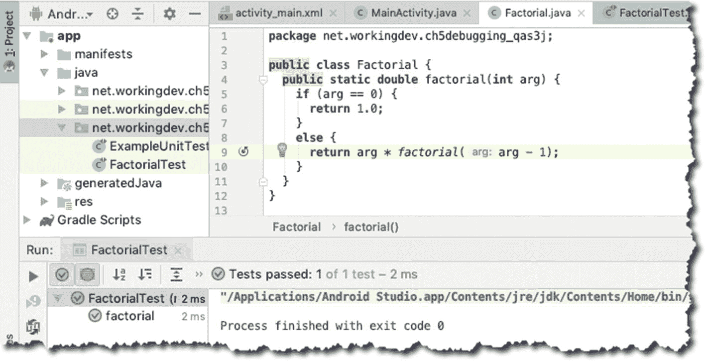

图 5-11. 测试成功

现在，你看到的不是黄色的感叹号，而是绿色的对勾。你看到的不是“测试失败”，而是“测试通过”。现在你知道你的代码按预期工作了。

## 测试先行

拥有一种自动化且高频率测试代码的方法非常重要。这种方法如此重要，以至于许多开发者提倡**先**编写你的测试套件，甚至在实际代码之前。这被称为测试驱动开发，或简称为 TDD。其基本思想是，测试代表了应用程序的需求，而代码必须满足这些需求。

要了解如何在 Android Studio 中执行 TDD，请删除项目中的 `Factorial.java` 文件并再次运行测试。当然，它会失败；这正是其理念所在。你总是从失败的测试开始。现在，创建 `Factorial` 类，并开始添加能使测试通过的方法和代码。

一旦你有了几个测试用例、更多代码且没有错误后，尝试再次运行测试。其理念是，每次对代码进行重大（足够）更改时都运行测试。这样，当你的所有测试都通过时，你就知道你没有向代码中引入任何破坏性的更改。

将这种做法与许多开发人员的做法进行比较，他们通常会先编写一堆代码，然后编写一个小测试程序来验证代码，可能带有静态 `main()` 方法和几个 `printlns`。然后他们丢弃测试代码——好像他们的代码再也不会出问题一样！希望通过本章，你现在已经明白不应该丢弃测试代码。你应该培养它，并经常运行它，以确保你的代码符合规范。

## 本章小结

*   单元测试是一项核心开发任务。它应该是一项核心开发任务，因为现代且复杂的软件不应该依赖于微不足道、临时的、一次性的测试。

*   JVM 测试与插桩测试不同。JVM 测试用于你代码的 Java 部分——即不需要与 Android 平台交互的部分。

*   Android Studio 允许你将 JVM 测试与插桩测试分开。

*   JVM 测试就像普通的类文件：你可以调试并单步执行它们。

*   每个 JUnit 测试都通过 `@Test` 进行注解。JUnit 就是通过这种方式知道哪些方法应该是测试用例。

