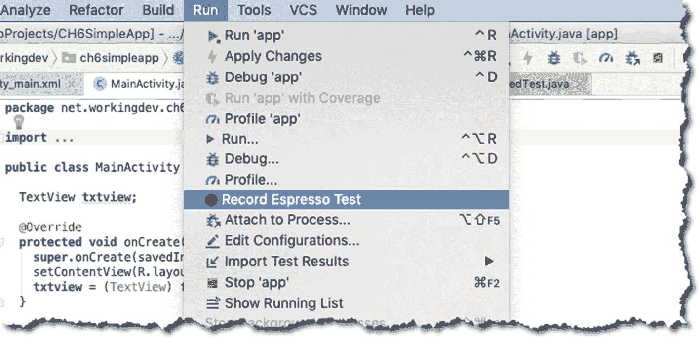
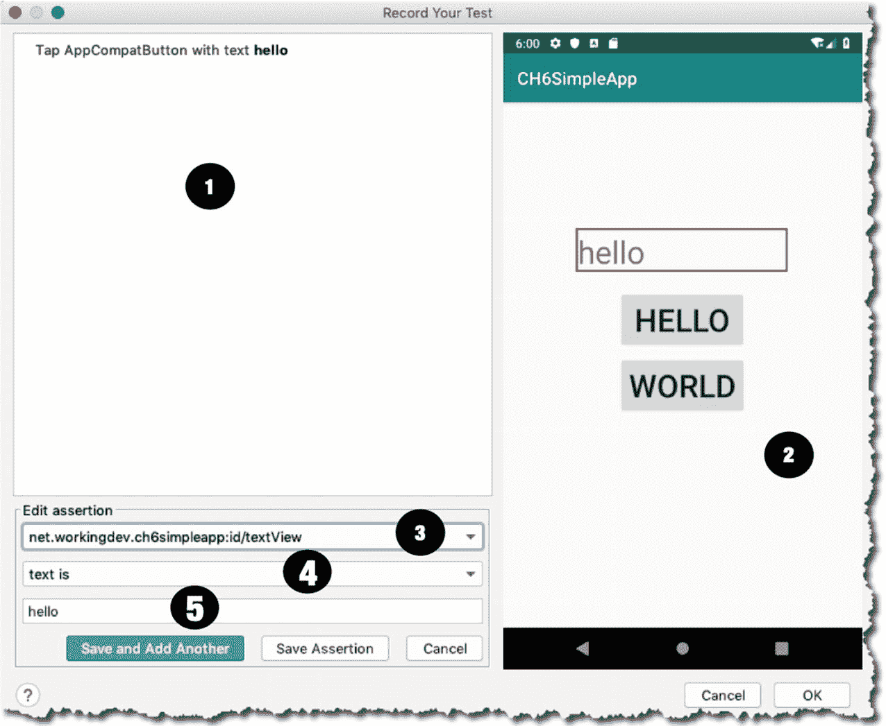
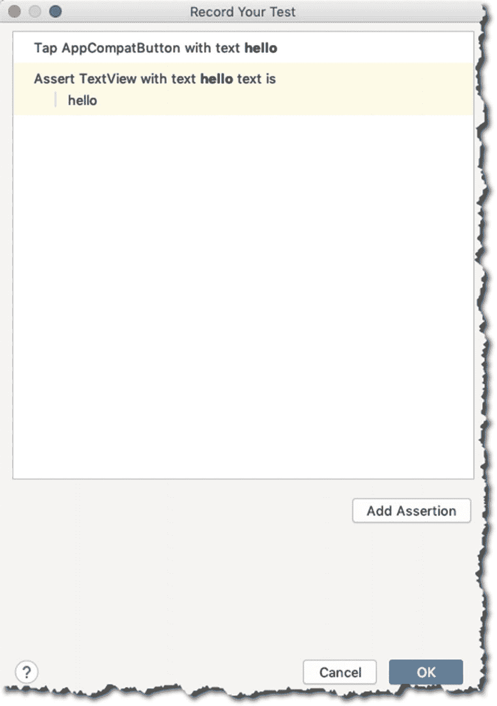
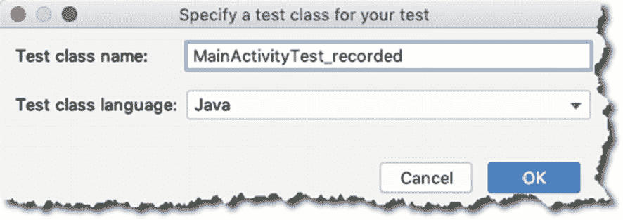

# 6. 插桩测试

*本章内容涵盖：*

*   插桩测试的细节

*   如何创建 UI 测试交互

*   基本的测试交互

*   实现测试验证

*   测试录制

您在上一章中学习了如何执行 JVM 测试。在本章中，您将进行一些涉及应用程序 Android 部分的测试。与 Android 平台交互的单元测试被称为插桩测试，您将使用 Espresso 框架来进行此测试。

## 关于 Espresso

谷歌于 2013 年发布了 Espresso，随着其 2.0 版本的发布，Espresso 成为 Android 支持库的一部分。使用 Espresso 进行测试的一般步骤如下：

1.  **匹配**：使用匹配器定位特定组件，如按钮或 `TextView`。`ViewMatcher` 允许你在视图层级中找到一个 `View` 对象。

2.  **操作**：使用 `ViewAction` 对象对目标 `View` 对象执行点击等操作。

3.  **断言**：对 `View` 的状态进行断言。

假设你有一个包含一个按钮和一个 `TextView` 的简单屏幕。当你点击按钮时，你会在 `TextView` 上看到文本“Hello World”。你可以像这样编写测试：

| ➊ | 使用 `ViewMatcher` 查找 `View` 对象。你正在寻找一个 id 为 `button` 的 `View`。请记住，当你使用 `onView()` 时，Espresso 会等到所有同步条件都满足后，再执行相应的 UI 操作。 |
| ➋ | 找到它后，使用 `ViewAction` 对其执行某些操作；在这种情况下，你想要点击它。 |
| ➌ | 再次，你使用 `ViewMatcher` 查找 `View` 对象。这次，你试图找到一个 id 为 `textview` 的 `TextView`。 |
| ➍ | 找到后，你想检查它的文本属性是否与“Hello World”匹配。 |

```
onView(withId(R.id.button))   ➊
.perform(Click())       ➋
onView(withId(R.id.textview)) ➌
.check(matches(withText("Hello World"))); ➍
```


## 搭建一个简单的测试

让我们搭建一个简单的项目，一个包含空活动的项目。清单 6-1 展示了 XML 布局代码，清单 6-2 展示了 `MainActivity` 代码。

```
清单 6-1.
activity_main.xml
```

如您所见，布局代码相当简单：它包含一个 `TextView` 和两个按钮。当用户点击它们时，这两个按钮都会调用 `MainActivity` 中的 `onClick()` 方法。

```
public class MainActivity extends AppCompatActivity {
    TextView txtview;
    @Override
    protected void onCreate(Bundle savedInstanceState) {
        super.onCreate(savedInstanceState);
        setContentView(R.layout.activity_main);
        txtview = (TextView) findViewById(R.id.textView);
    }
    public void onClick(View view) {
        switch(view.getId()) {
            case R.id.btnhello:
                txtview.setText("hello");
                break;
            case R.id.btnworld:
                txtview.setText("world");
                break;
        }
    }
}
清单 6-2.
MainActivity
```

`MainActivity` 中的 `onClick()` 方法主要试图获取被点击按钮的 ID，并根据它来路由程序逻辑。如果点击了 `btnhello`，你便将 `TextView` 的文本内容设置为“hello”；如果点击了 `btnworld`，你则将内容设置为“world”——这相当简单。要验证此行为，你可以设置一个仪器化测试。

在上一章中，你在 `src/test` 中编写了测试类，因为它是一个 JVM 测试。现在，你将在 `src/androidTest` 内编写测试类，因为这将是一个仪器化测试。清单 6-3 展示了仪器化测试类的代码。

| ➊ | 你希望静态导入 Espresso 的匹配器、操作和断言，这样就不必在后续代码中使用完全限定名称。 |
| ➋ | 这会拦截你的测试方法调用，并确保在执行任何测试之前启动了该活动。 |
| ➌ | 你需要使用 `@Test` 注解每个测试方法。 |
| ➍ | 使用 `withId()` 方法找到 `btnhello` 对象。 |
| ➎ | 然后使用 `ViewAction.click()` 模拟一次点击。 |
| ➏ | 然后再次使用 `withId()` 方法找到 `TextView`。 |
| ➐ | 最后，断言 `TextView` 是否包含文本“hello”。 |

```
import android.support.test.rule.ActivityTestRule;
import android.support.test.runner.AndroidJUnit4;
import org.junit.Rule;
import org.junit.Test;
import static android.support.test.espresso.Espresso.onView;  ➊
import static android.support.test.espresso.action.ViewActions.click;
import static android.support.test.espresso.assertion.ViewAssertions.matches;
import static android.support.test.espresso.matcher.ViewMatchers.withId;
import static android.support.test.espresso.matcher.ViewMatchers.withText;
public class MainActivityTest {
    @Rule ➋
    public ActivityTestRule mActivityTestRule = new ActivityTestRule(MainActivity.class);
    @Test ➌
    public void buttonHelloTest() {
        onView(withId(R.id.btnhello)) ➍
            .perform(click());        ➎
        onView(withId(R.id.textView)) ➏
            .check(matches(withText("hello"))); ➐
    }
    @Test
    public void buttonWorldTest() {
        onView(withId(R.id.btnworld))
            .perform(click());
        onView(withId(R.id.textView))
            .check(matches(withText("world")));
    }
}
清单 6-3.
MainActivityTest
```

你可以用运行 JVM 测试的相同方式运行仪器化测试。你可以

* 点击 IDE 侧边栏的箭头，
* 右键点击测试并使用上下文菜单，然后选择运行 `MainActivityTest` 选项，或者
* 前往主菜单栏，选择 运行 ➤ 运行，然后选择 `MainActivityTest`。

### 录制 Espresso 测试

Android Studio 包含一项功能，你可以运行你的应用，记录交互，并使用录制功能创建 Espresso 测试。要开始，请前往主菜单栏，然后选择 运行 ➤ 录制 Espresso 测试，如图 6-1 所示。



图 6-1. 录制 Espresso 测试

选择录制 Espresso 测试选项后，你现在可以像往常一样与应用交互，但这次，交互会被记录下来。如果你点击其中一个按钮，比如 HELLO 按钮，测试录制器屏幕将弹出，如图 6-2 所示。

| ➊ | 此部分显示与应用进行的每次交互。此时，我只点击了一次应用；我点击了 HELLO 按钮。 |
| ➋ | 此部分是 `ViewMatcher`，但是以可视方式呈现。如果你像我一样点击了 `TextView`，它就会作为一个项目转到编辑断言部分。 |
| ➌ | 此处选择了 `TextView`，因为我在 `ViewMatcher` 部分（条目 2）点击了它。 |
| ➍ | 这是你选择断言的地方。在本例中，它是 hamcrest 的“文本是”。 |
| ➎ | 你想要断言的 `TextView` 的实际值。 |



图 6-2. Espresso 录制器

如果你想添加另一个测试，可以点击“保存并添加另一个”选项；或者点击“保存断言”选项并完成录制。图 6-3 显示了下一个屏幕。



图 6-3. 保存断言后的 Espresso 录制器

当你点击确定时，录制器将提示输入类的名称，录制结果将以测试类的形式保存，如图 6-4 所示。



图 6-4. 测试已保存的 Espresso 测试

当你进入 `src/androidTest` 文件夹时，你将找到从录制中生成的新测试类。现在你可以像之前运行 `MainActivityTest` 一样运行生成的测试。

### 注意

关于 Espresso 的两个趣闻：1) 根据 Android Studio 分析，Espresso 录制器是使用 Espresso 时最常用的工具之一；2) Espresso 录制器最初被命名为“cassette”。

## 关于 Espresso 匹配器的更多信息

Espresso 有多种匹配器，但最常用的是 `ViewMatcher`；你就是在之前的例子中使用的它。以下是 Espresso 中的其他匹配器：

* **CursorMatcher**：用于由 Cursor 支持的 Android Adapter 视图，以匹配特定的数据行。
* **LayoutMatcher**：用于匹配和检测典型的布局问题，例如包含省略号或多行文本的 `TextView`。
* **RootMatcher**：用于匹配 Root 对象，例如对话框或可以接收触摸事件的 Root。
* **PreferenceMatcher**：用于匹配 Android 偏好设置，并允许你根据其键、摘要文本等查找视图组件。
* **BoundedMatcher**：用于为给定类型创建你自己的自定义匹配器。

在前面的例子中，你使用了 `ViewMatcher` 通过视图的 ID 来查找它们。你还可以使用其他条件来查找视图，例如

* **其值**：你可以使用 `withText()` 方法查找匹配某个特定字符串表达式的视图。
* **其子视图的数量**：使用 `hasChildCount()` 方法，你可以匹配具有非常具体的子视图数量的视图。
* **其类名**：使用 `withClassName()` 方法。

`ViewMatcher` 还可以告诉你一个 View 对象是否是

* 启用状态，通过使用 `isEnabled()` 方法
* 可获得焦点，通过使用 `isFocusable()` 方法
* 可见，通过 `isDisplayed()` 方法
* 已选中，通过 `isChecked()` 方法
* 已选定，通过 `isSelected()` 方法

`ViewMatchers` 类中还有很多方法可供使用，请务必访问 [`https://bit.ly/viewmatchers`](https://bit.ly/viewmatchers) 查看它们。


## Espresso 操作

Espresso 操作让您可以在测试期间通过编程方式与 `View` 对象交互。您之前已经使用了 `click()` 方法，但 `ViewActions` 还提供了更多功能。这些方法的名称本身就非常具有描述性，因此无需额外解释；您可以清楚地知道它们的作用。以下是一些示例：

*   `clearText()`
*   `closeSoftKeyboard()`
*   `doubleClick()`
*   `longClick()`
*   `openLink()`
*   `pressBack()` – 按下返回按钮
*   `replaceText(String arg)`
*   `swipeDown()`
*   `swipeRight()`
*   `swipeUp()`
*   `typeText(String arg)`

还有更多可用操作，请务必查阅`ViewAction`对象的 API 文档。

同时，请务必访问 Android 开发者官网上的 Espresso 官方文档：[`https://bit.ly/androidstudioespresso`](https://bit.ly/androidstudioespresso)。您在这里只是浅尝辄止地了解了 Espresso 的皮毛！

## 章节总结

*   将 JVM 测试放在 `src/test` 目录中，将插桩测试放在 `src/androidTest` 目录中。
*   您可以使用 Espresso 创建插桩测试；在 Espresso 中，您需要两个东西：`ViewMatchers` 和 `ViewActions`。
*   编写 Espresso 测试的一般步骤是：1) 使用 `ViewMatchers` 找到 `View` 对象，2) 使用 `ViewActions` 在该 View 上执行操作，3) 进行断言。
*   创建 Espresso 测试的一个简单方法是使用 Espresso 录制器。

---

