# 7. Android Studio Profiler

*本章涵盖内容：*

*   Android Studio Profiler
*   CPU 视图
*   内存视图

Android Studio 3.0 用新的 Android Profiler 取代了旧的 Android Monitor。它是一个集成的视图，用于分析应用的**内存消耗**、**网络使用情况**、**CPU 使用情况**和**电量使用情况**。在本章中，您将快速了解 Profiler。

## Profiler

Profiler 是 Android Studio 3 中的新功能。它取代了 Android Monitor，并提供了一个新的、统一的共享时间轴视图，用于显示 CPU、内存、网络和电量（能耗）图表。

您可以通过主菜单栏进入 Profiler：`View` ➤ `Tool Windows` ➤ `Profiler`。图 7-1 显示了 Profiler。

| ➊ | 显示正在分析的进程和设备。 |
| ➋ | 显示要查看的会话。您也可以在此处通过单击 + 按钮添加新会话。 |
| ➌ | 使用缩放按钮控制时间轴的显示范围。 |
| ➍ | 新的共享时间轴视图允许您查看 CPU、内存、网络和电量使用情况的所有图表。在顶部，您还会看到重要的应用事件，例如用户输入或活动状态转换。 |

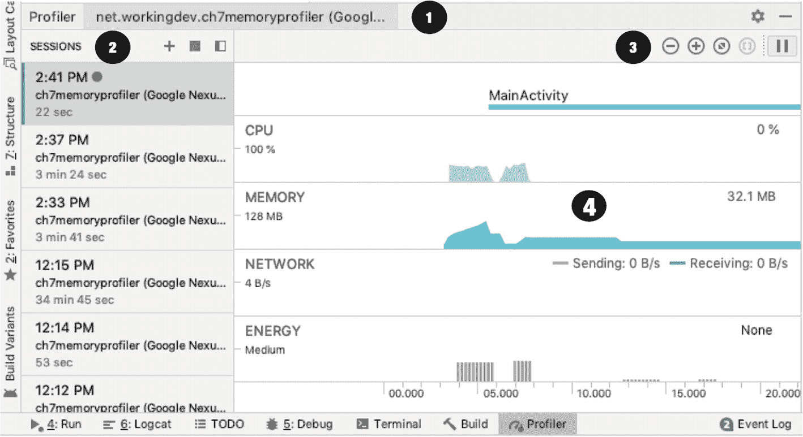

**图 7-1. Profiler**

一旦您在已连接的设备或模拟器上启动应用程序，您就会在 Profiler 中看到它的图表。

### 注意

如果您尝试分析 API 级别低于 26 的 APK，您会看到一些警告，因为 Android Studio 需要完全插桩您的代码。您需要启用高级分析，但如果您的 APK 是 Oreo 或更高版本，则不会看到任何警告。

如果您单击任意图表，Profiler 窗口将带您进入详细的视图之一。例如，如果您单击 CPU 图表，您将看到 CPU 利用率的详细视图。

## CPU

图 7-2 显示了我正在运行的示例应用程序的 CPU 利用率的详细视图。

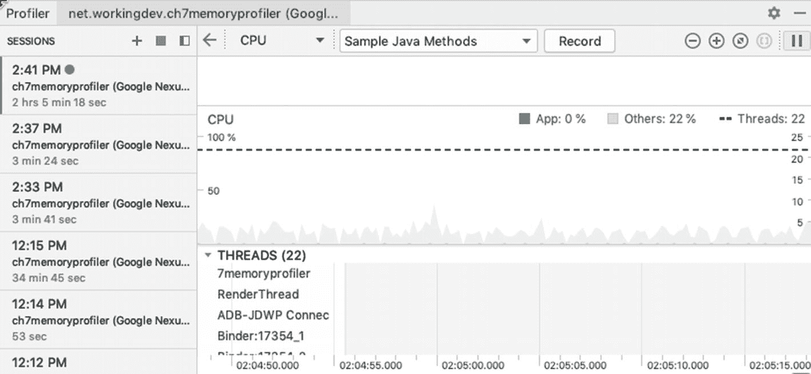

**图 7-2. CPU 视图**

除了实时的利用率图表，CPU 详细视图还显示了应用中所有线程的列表及其状态。您可以查看线程是处于等待 I/O 状态还是活动状态。

您可能已经注意到了图 7-2 中的 `Record` 按钮。如果您单击该按钮，您可以获得一个关于在给定时间段内执行的所有方法的报告。同时请注意下拉菜单中选定的跟踪类型（`Sample Java Methods`）；这种*采样跟踪类型*开销较小，但不如*插桩跟踪类型*（`Trace Java Methods`）详细或精确，这意味着采样类型可能会错过执行时间非常短的方法。您可能会想，“那就一直用插桩类型吧。”但是，您必须记住，虽然插桩类型可以记录每个方法调用，但在 Android 8 版本之前的设备上，可以捕获的数据量是有限的，因此如果使用插桩跟踪，很快就会达到该限制。您可以通过编辑插桩捕获的配置来更改该限制。在跟踪类型下拉菜单中，选择 `Edit Configurations` 选项，如图 7-3 所示。

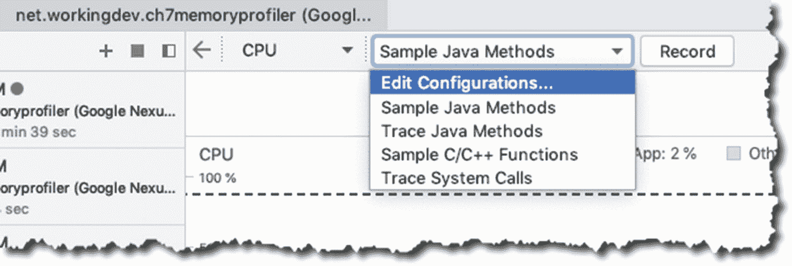

**图 7-3. 编辑配置**

图 7-4 显示了采样间隔和文件大小限制设置，您可以使用它们来调整采样的频率以及为录制分配的文件大小。重申一下，文件大小限制仅存在于运行 Android 8.0 或更低版本（< API 级别 26）的 Android 设备上。如果您的设备具有更高的 Android 版本，则不受这些限制的约束。

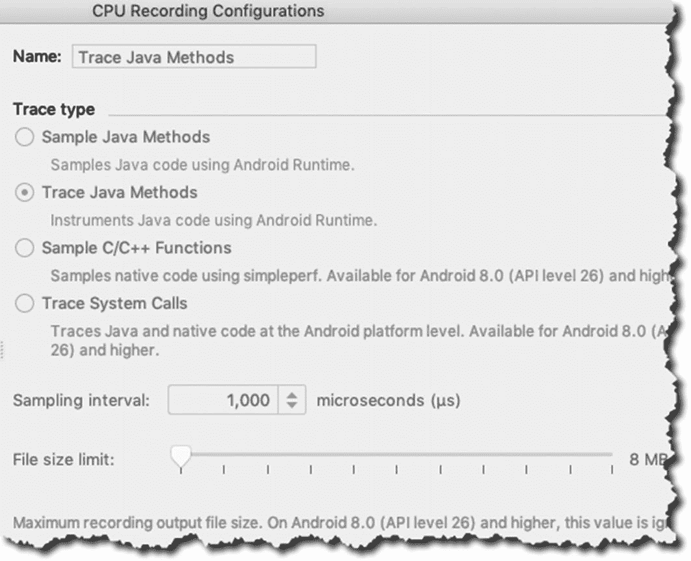

**图 7-4. CPU 录制配置**

如果您单击 `Record`，Android Studio 将开始捕获数据。当您想要停止录制时，单击 `Stop` 按钮，如图 7-5 所示。

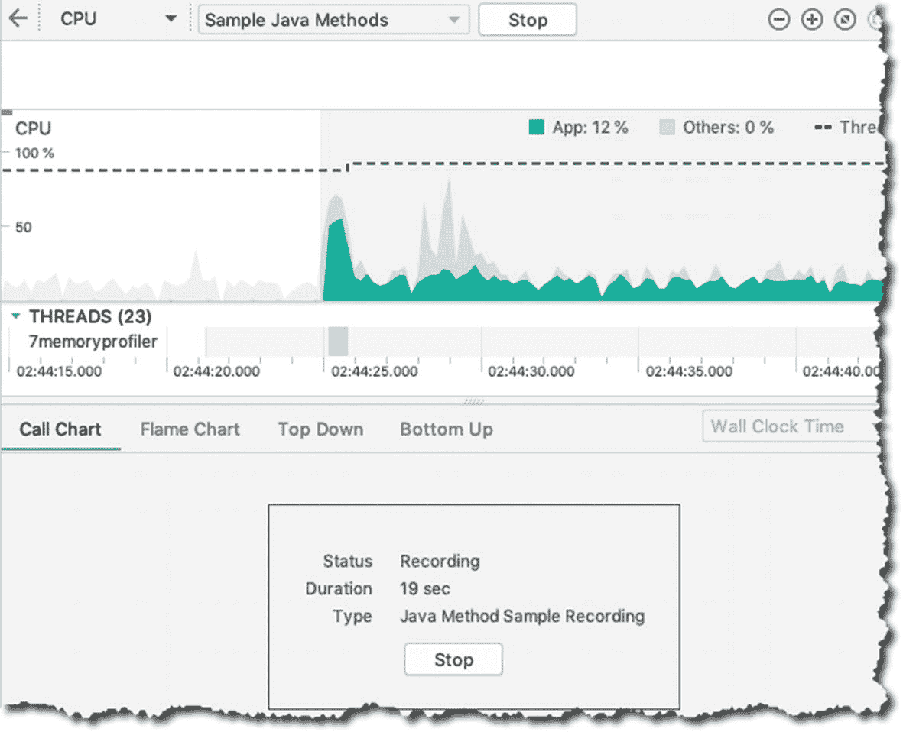

**图 7-5. 录制会话**

当您按下 `Stop` 后，您可以查看各个线程，如图 7-6 所示。

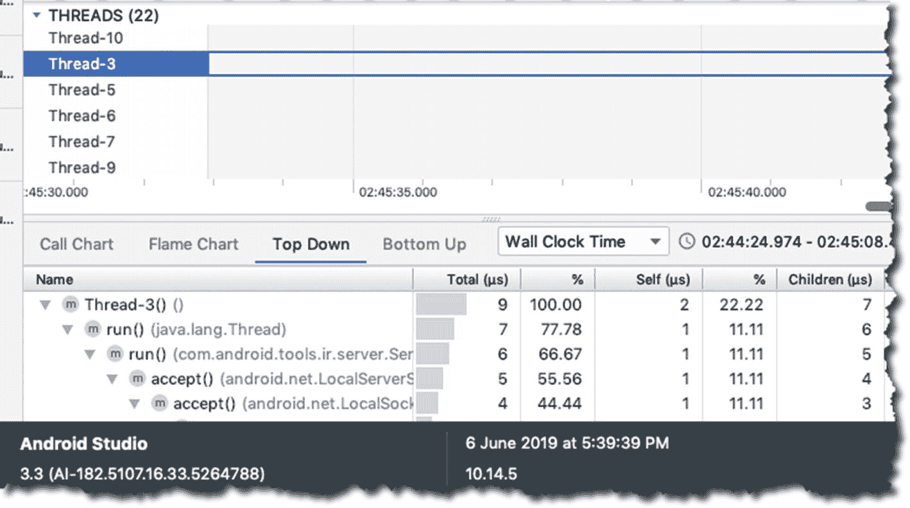

**图 7-6. 检查线程**

## 内存

Memory（内存）性能分析器会实时显示应用消耗的内存量。图 7-7 展示了我在捕获一个测试应用的内存占用情况时所截取的内存视图快照。如图所示，该图表不仅显示应用正在消耗多少内存，还显示了内存的细分情况，例如代码、堆栈、图形、Java 等分别使用了多少内存。

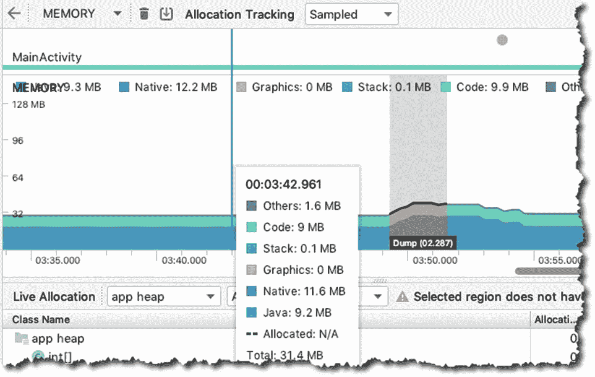

图 7-7. 内存视图

你可以在内存视图中强制进行垃圾回收。看到顶部那个垃圾桶图标了吗？没错，如果你点击它，就会强制执行一次 GC（垃圾回收）。它右侧的按钮也很有用：那个带向下箭头的方框图标代表的是内存转储。点击它，Java 堆就会被转储，然后你就可以检查它，如图 7-8 所示。

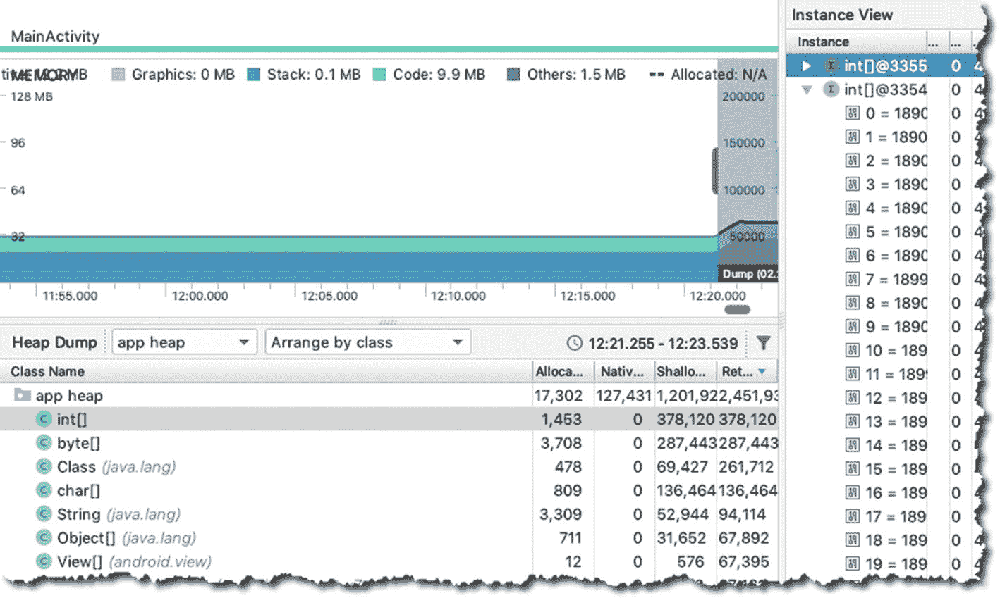

图 7-8. Java 堆

堆是 Android 运行时为应用分配的一块保留的存储内存。当你转储堆时，你就有了检查对象实例属性的机会，如图 7-9 所示。

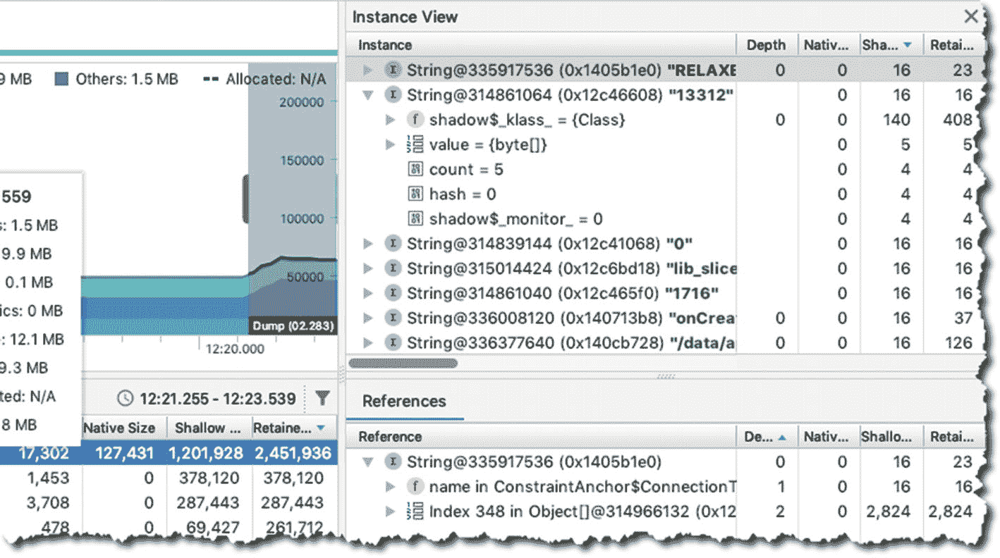

图 7-9. 实例视图，Reference 标签页

Reference（引用）标签页在查找内存泄漏时非常有用，因为它显示了指向你正在检查的对象的所有引用。

内存视图中另一个有用的工具是分配跟踪器，如图 7-10 所示。

| ➊ | 点击内存图时间线上的任意位置即可查看分配跟踪器。这将显示在该时间点被分配和取消分配的所有对象的列表。|
| ➋ | 这显示了在某个时间点应用正在使用的所有类的列表。 |
| ➌ | 这显示了在特定时间点被分配和取消分配的所有对象的列表。 |
| ➍ | 跟踪器甚至包含分配时的调用堆栈。 |

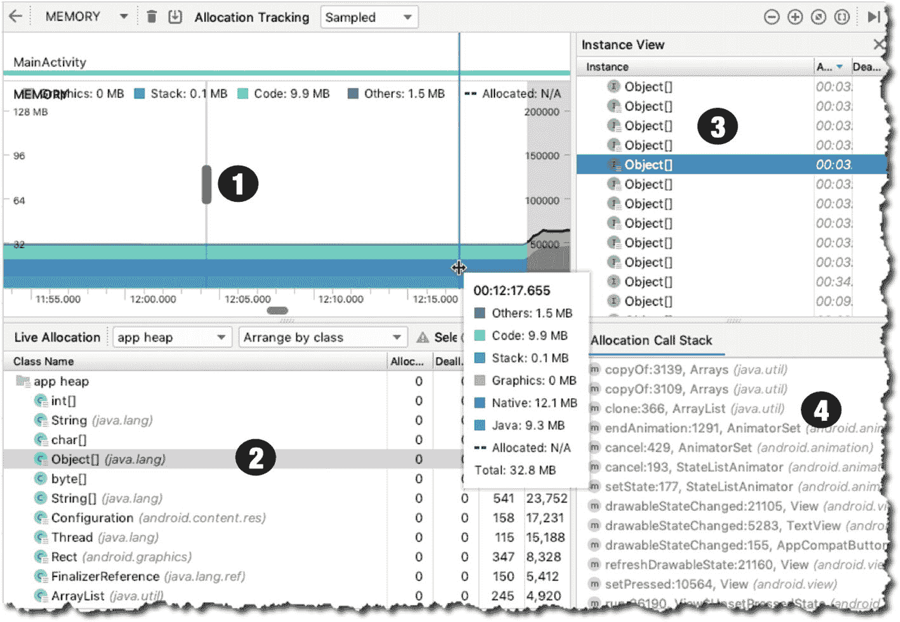

图 7-10. 分配跟踪器

## 网络

与性能分析器中的其他视图一样，Network（网络）视图也显示实时数据。它可以让你查看和检查应用发送和接收的数据。它还显示总连接数。图 7-11 显示了网络性能分析器的快照。

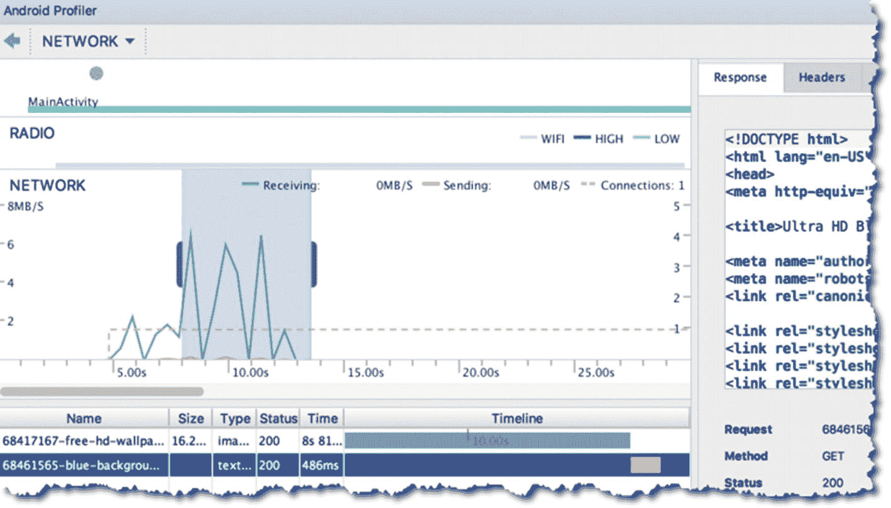

图 7-11. 网络性能分析器

每当你的应用向网络发出请求时，它都会使用 WiFi 无线电来发送和接收数据。无线电的能效并非最高；它非常耗电，如果你不注意应用如何进行网络请求，这肯定会比平时更快地耗尽设备电池。

当你使用网络性能分析器时，一个好的开始方法是寻找网络活动的短时峰值。当你在时间线上看到突然升高又突然下降的尖锐峰值时，这通常意味着你可以通过批量处理网络请求来进行一些优化，以减少 WiFi 无线电需要唤醒并发送或接收数据的次数。

## 能耗

现在你可能已经了解了性能分析器的工作模式。它会实时显示数据。就 Energy（能耗）性能分析器而言，它显示的是应用消耗了多少能量的数据。虽然它实际上并不直接测量能耗，但能耗性能分析器会显示 CPU、无线电和 GPS 传感器的能耗估算值。图 7-12 显示了能耗性能分析器的快照。

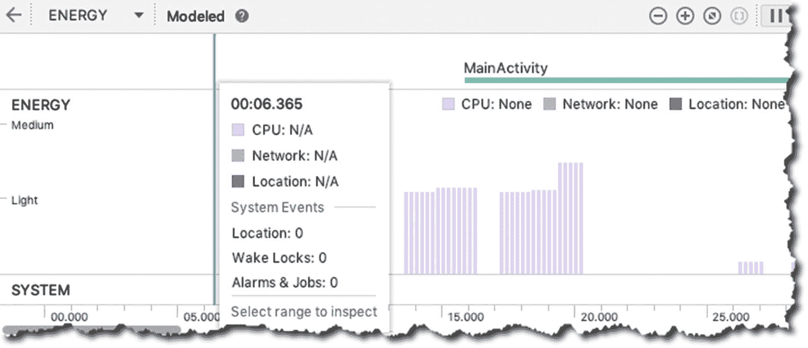

图 7-12. 能耗性能分析器

你也可以使用能耗性能分析器来查找影响能耗的系统事件，例如唤醒锁、任务和闹钟。

- 唤醒锁是一种机制，用于在设备本应进入休眠状态时保持屏幕开启。例如，当应用播放视频时，即使没有用户交互，它也可能使用唤醒锁来保持屏幕开启。使用唤醒锁本身不是问题，但忘记释放它才是问题；它会让 CPU 保持运行的时间超过必要时间，这肯定会导致电池更快耗尽。

- 闹钟可用于在特定时间间隔运行应用上下文之外的**后台任务**。当闹钟触发时，应用可以运行一些任务。如果它运行耗能的代码段，你肯定会在能耗性能分析器中看到它。

- 任务可以在满足某些条件时执行操作，例如当网络可用时。你通常使用 `JobBuilder` 创建任务，并使用 `JobScheduler` 来安排执行。当任务启动时，你将能够在能耗性能分析器中看到它。

以上是对 Android Studio 性能分析器的快速介绍。请务必查看 [`https://bit.ly/androidstudioprofiler`](https://bit.ly/androidstudioprofiler) 上的官方文档。

## 本章小结

- 旧的 Android Monitor 已不复存在。我们现在使用 Profiler（性能分析器）。

- 性能分析器提供了一个统一视图，显示应用如何消耗内存、CPU、网络和电池资源。

