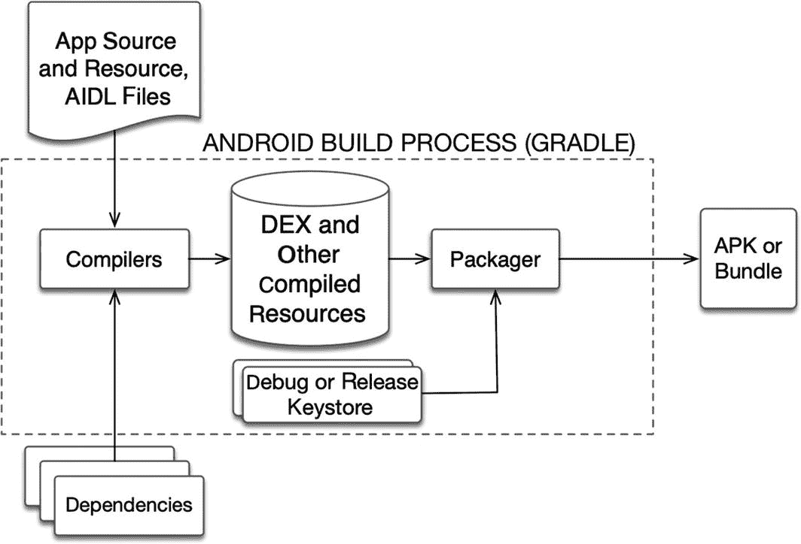
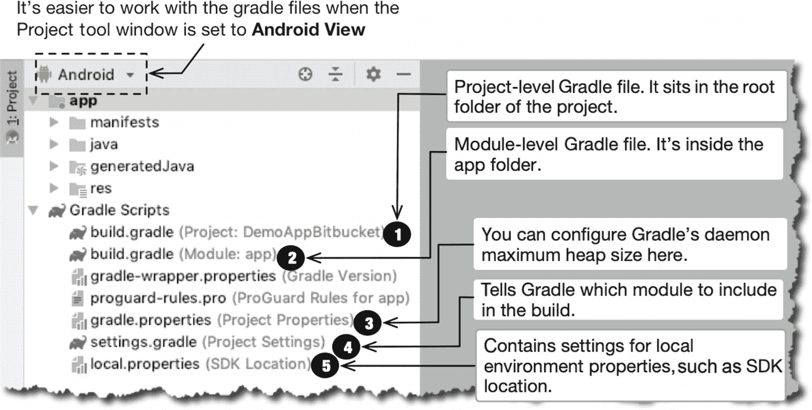
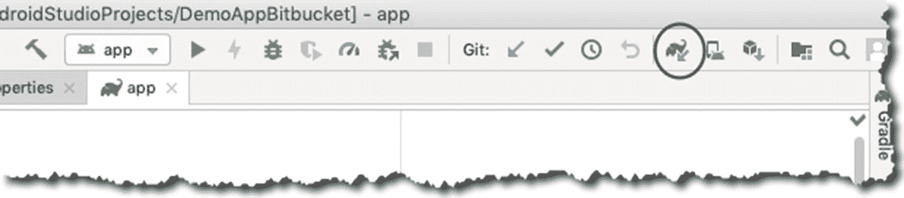
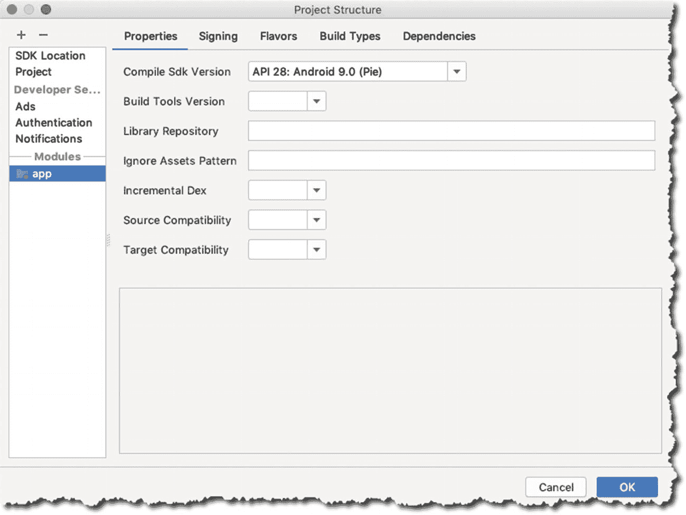

# 8. Gradle

**本章内容涵盖：**

- Android 构建过程

- Gradle 文件

- 依赖项

- Android 支持库

## 构建过程

构建一个 APK 或 bundle 需要许多涉及的步骤。图 8-1 大致说明了这个过程。

### 注意

Bundle 是交付 Android 可执行文件的一种较新格式。我将在第 12 章中进一步讨论 bundle。

一个应用是松散关联的 Java 源文件、XML 配置文件、XML 格式的 UI 定义等的组合。然后它进入编译阶段；有资源编译器和 Java 编译器。还有需要被考虑的库和其他依赖项。

编译过程会产生一些中间文件，例如 DEX 可执行文件和其他编译后的资源。打包器会组合 DEX 可执行文件、编译后的资源和证书，最终生成一个 APK 或 bundle。

### 注意

DEX 文件类似于 Java 类文件；它们是可执行文件，但旨在 Android 运行时中运行——它们与你桌面上的 Java 运行时不同。这是一种专为 Android 设计的字节码运行时。



图 8-1. Android 构建过程

Gradle 和 Android Studio 负责处理所有繁重的工作。如果你之前在 Java 开发中使用过 ANT 或 Maven，Gradle 与它们非常相似，区别在于它不是使用 XML 语法，而是使用自己的 DSL（领域特定语言），该语言基于 Groovy 语言。


## 构建文件

Gradle 依赖几个文件。图 8-2 标示出了它们。

| ➊ | `build.gradle` **（项目级）**：这是项目的根文件夹。有些项目可能包含多个模块，在此文件中定义一些能被所有模块共享的属性会很有用。 |
| ➋ | `build.gradle` **（模块: app）**：模块级别的`build.gradle`文件位于其所属的模块内。在此例中，模块级 Gradle 文件位于`app`文件夹内；`app`模块是 Android Studio 在创建项目时生成的默认模块。与项目级 Gradle 文件相比，这个文件是你最可能花费更多时间处理的文件。 |
| ➌ | `gradle.properties`：你可以在此文件中配置项目级的 Gradle 设置，例如为 Gradle 守护进程分配的内存量。我通常不会修改它。 |
| ➍ | `settings.gradle`：该文件告诉 Gradle 需要在构建中包含哪些模块。如果你只处理单个模块（即“app”），那么你也可以不修改此文件。 |
| ➎ | `local.properties`：此文件包含本地环境的设置，例如 SDK 的位置、Firebase 的用户凭据等。 |



图 8-2. Gradle 文件

### 模块级 Gradle 文件

既然你最可能与模块级 Gradle 文件打交道，那就让我们更好地了解它。清单 8-1 展示了一个带有注释的模块级`build.gradle`文件示例。

| ➊ | `compileSdkVersion`：指示你用于构建应用的 API 级别或 Android 版本。 |
| ➋ | `defaultConfig`：此代码块包含模块的默认配置。可以有多个配置吗？是的，应用可以有多个配置。当你针对不同平台等有不同的行为时，就会用到它。你可能会有几种构建变体。但现在，我们先只处理默认配置。 |
| ➌ | `applicationId`：这是你的应用在 Google Play 上使用的名称；也是应用的标识。 |
| ➍ | `minSdkVersion`：此属性将告知 Google Play 你的应用所支持的最低 Android 版本。 |
| ➎ | `targetSdkVersion`：如果 Android 的 API 发生变化，此设置会告知运行时环境，你的应用期望 API 的行为与 API 级别 24 时的行为一致。这样，你的应用就能拥有一个一致的环境。 |
| ➏ | `versionCode`：标识应用的版本。这是一个递增的整数。 |
| ➐ | `versionName`：这是`versionCode`的字符串表示形式，会显示在 Google Play 和设备的设置中。 |

```
apply plugin: 'com.android.application'
android {
compileSdkVersion 28 ➊
defaultConfig {  ➋
applicationId "net.workingdev.demoappbitbucket" ➌
minSdkVersion 27 ➍
targetSdkVersion 28 ➎
versionCode 1  ➏
versionName "1.0" ➐
testInstrumentationRunner "android.support.test.runner.AndroidJUnitRunner"
}
...
清单 8-1.
build.gradle (模块)
```

当你对 Gradle 文件进行了任何更改，Android Studio 会提示你同步该文件。IDE 顶部会显示一个提示栏，告诉你“立即同步”。你也可以通过点击工具栏上的同步按钮来同步 Gradle 文件，如图 8-3 所示。另一种同步方式是从主菜单栏操作：选择“文件” ➤ “将项目与 Gradle 文件同步”。



图 8-3. 将项目与 Gradle 文件同步

如果你不想手动编辑 Gradle 文件，也可以通过图形用户界面来实现更改。转到主菜单栏，选择“文件” ➤ “项目结构”，然后点击“应用”部分，如图 8-4 所示。



图 8-4. 项目结构

如果你浏览“项目结构”窗口中的选项卡，你会发现也可以在那里编辑 Gradle 文件的条目。

### 依赖项

大多数应用很少能独立运行；它们通常依赖其他代码。你的应用可能依赖于外部的二进制文件，或者你在同一项目中构建的其他库。无论哪种情况，这些依赖项都必须在 Gradle 文件的依赖项代码块中声明。

在依赖项代码块中，你必须列出应用的所有直接依赖项；如果这些依赖项本身又有自己的依赖项，Gradle 也会为你一并获取。需要注意三种依赖类型：

*   **模块依赖项**：如果你在应用中创建了一个模块（除了默认的 app 模块之外），并希望它作为项目的库使用，你可以将其声明为模块依赖项。

*   **Jar 依赖项**：当你想在应用中使用外部库时，例如 `jdom.jar`，只需将 jar 文件放入项目的 `libs` 文件夹，并将其声明为 jar 依赖项。请记住，这里不能随便使用任何 jar 文件；只能使用那些旨在作为库使用的 jar 文件。在使用一个库之前，最好先阅读其文档。

*   **库依赖项**：这种依赖项会从诸如 Maven 仓库或 `jcenter` 这样的仓库中拉取资源。仓库就是可供你使用的二进制文件的集合。当你安装 Android Studio 并在安装过程中拉取一些附加软件时，已在本地机器上拥有一个仓库。Android Support 仓库已在本地可用——因此，这个仓库无需在 Gradle 文件（项目级 Gradle 文件）中声明，但除此之外的任何其他仓库都需要声明。你会注意到，当你在 Android Studio 中创建新项目时，生成的 Gradle 文件已经包含了 `jcenter` 和 `google` 的引用，它们是非常庞大的 Java 和 Android 仓库。清单 8-2 展示了项目级 Gradle 文件的一个片段；请注意 `buildscript` 和 `allprojects` 代码块中的仓库部分——它们已经包含了 `jcenter` 和 `google` 的引用。当然，如果你需要引用 `jcenter` 和 `google` 之外的任何仓库，只需将其添加到 Gradle 文件中即可。

```
buildscript {
repositories {
google()
jcenter()
}
dependencies {
classpath 'com.android.tools.build:gradle:3.3.1'
// 注意：不要在此处放置你的应用依赖项；它们应属于
// 各个模块的 build.gradle 文件中
}
}
allprojects {
repositories {
google()
jcenter()
}
}
...
清单 8-2.
build.gradle (项目级)
```

请注意，项目级 Gradle 文件中有一条注释，提示 **不要** 将你的应用依赖项放置在此文件中，而应放在应用模块的 Gradle 文件中。你在项目级 Gradle 文件中定义的任何内容都会影响所有模块级的 Gradle 文件。

除了理解依赖类型，你还需要了解如何关联依赖项。至少要考虑以下三种指令：

*   `implementation`：这意味着此依赖项将应用于你的所有构建变体或你执行的所有不同类型的构建。

*   `testImplementation`：这是一个特定于测试的变体。在此处，你可以声明 JVM 测试所需的内容。这是一种只需要 JVM 而无需完整 Android 运行时的单元测试。

*   `androidTestImplementation`：在此处，你可以声明进行仪器化测试所需的库——这种测试需要完整的 Android 运行时。

清单 8-3 展示了带有注释的模块级 `build.gradle` 文件片段。


### 注意

构建变体是构建类型与构建配置的组合。构建类型的例子包括 `release` 和 `debug`。构建配置已在本章前文讨论过。你可以通过主菜单栏选择 **View ➤ Tool Windows ➤ Build Variant** 来查看当前的构建变体。

| ➊ | 这个带有 `fileTree` 命令、`dir` 参数以及 ANT 风格通配模式 `*.jar` 的 `implementation` 指令，意味着你想要项目 `lib` 文件夹下的所有 jar 文件都成为依赖项。因此，为项目添加 jar 依赖只需将 jar 文件放入项目的 `lib` 文件夹即可。 |
| ➋ | 该指令表示你正在从仓库（确切地说是本地仓库）拉取一个依赖项。这会从 Android Support Library 拉取兼容性库。使用 AppCompat 是为了让较新版本的 Android 功能能够在较旧版本上运行。不必过于担心版本问题；大多数情况下，Android Studio 都能很好地拉取正确且最新版本的兼容性库。 |
| ➌ | 与第 2 点类似，这也是来自 Android Support Library 的库依赖项。这次，你引用的是约束布局库，在创建使用 Constraint layout 的活动时需要用到它。 |
| ➍ | 这个 `testImplementation` 指令会拉取你在 JVM 单元测试中使用的 JUnit 4 库。 |
| ➎ | 这个 `androidTestImplementation` 会拉取你在插桩测试中使用的库。 |

```
apply plugin: 'com.android.application'
android {
...
}
dependencies {
implementation fileTree(dir: 'libs', include: ['*.jar'])  ➊
implementation 'com.android.support:appcompat-v7:28.0.0'  ➋
implementation 'com.android.support.constraint:constraint-layout:1.1.3' ➌
testImplementation 'junit:junit:4.12'  ➍
androidTestImplementation 'com.android.support.test:runner:1.0.2' ➎
androidTestImplementation 'com.android.support.test.espresso:espresso-core:3.0.2'
}
清单 8-3.
/app/build.gradle
```

## Android Support Library

Android Support Library 是一个庞大的主题。我不会在此详述所有内容，但你至少需要对其有初步了解，尤其是在我们当前讨论的上下文中。

Android Support Library 是 Android 非常重要的一部分。它基本上是对 Android SDK 的补充。其最重要的功能之一就是提供向后兼容性；至少它最初是为此而设计的。

向后兼容性之所以重要，是因为新版本的 Android 正在快速发布，而仍有相当多的设备运行着旧版本的 Android。较新版本的 Android 意味着更新的能力和特性；这是否意味着运行旧版本 Android 的设备无法使用这些新特性？并非如此。向后兼容性意味着较新的平台特性可以提供给较旧的平台版本使用。

随着时间的推移，Android Support Library 变得越来越庞大。它开始提供不属于平台本身的功能，例如用户界面领域的功能，如 Recycler Views 或 Card Views。Support Library 还包含了调试和测试领域的功能，因此需要对其进行重组。

在 Android Support Library 的早期，它只是一个单一的库；但随着它的发展，其组织形式也发生了变化。因此，Support Library 不再只是一个单一的库，而是变成了一组更小、更易于管理的库。这些库的分组主要依据平台支持来组织，这意味着 Support Library 的名称表明了它支持哪个平台或 API 级别。

你可能仍然会看到名为 `v4`、`v7` 和 `v13` 的库，历史上它们的意思是 `v4` 支持 API 级别 4 及以上，`v7` 支持级别 7 及以上，`v13` 支持 API 级别 13 及以上。我说“*历史上*”是因为这已不再正确。每当新版本的 Android 发布时，都会发生很多变化；弃用情况层出不穷。因此，你必须时常关注 Support Library 的文档。

在撰写本文时，`v4` 已不再支持 API 级别 4 及以上。它现在只支持 API 级别 14 及以上；`v7` 也不再支持级别 7 及以上，而是只支持级别 14 及以上。这实际上意味着所有支持库包的最低 SDK 版本现为级别 14（Ice Cream Sandwich）。

更重要的是，随着 Android 9（API 级别 28）的发布，出现了名为 AndroidX 的新版 Android Support Library，它是 Jetpack 的一部分。你可以继续使用支持库（`android.support.*` 版本 27 及更早版本）。它们将保留在 Google Maven 上，但请注意，所有开发都将在 AndroidX 中进行。

### 注意

Android Jetpack 是一组组件集合，旨在让开发应用更轻松。这些库位于 `androidx.*` 包中，并且它们与平台 API 解耦。向后兼容性库现在也位于此处。Jetpack 非常庞大。它不仅仅是兼容性库；它还包含许多其他软件组件，涉及架构、基础、UI 和行为。你可以在 [`https://developer.android.com/jetpack`](https://developer.android.com/jetpack) 了解更多信息。

在清单 8-3 中，你看到了这一行

```
implementation 'com.android.support:appcompat-v7:28.0.0'
```

这意味着，即使运行你应用的设备是 API 级别 14，你仍然可以使用

*   ActionBar
*   Material design
*   `AppCompatActivity` 类
*   `AppCompatDialog`
*   `ShareActionProvider`

所有这些功能都相当现代，但由于 AppCompat 库，你仍然可以在较旧的平台上使用它们。

### 注意

当你以较低 API 级别为目标时，你的应用可以依赖的现代 Android 特性较少，但能够运行你应用的 Android 设备比例更高。当以较高 API 级别为目标时，情况则相反。你始终可以在创建新 Android 项目时点击“Help me choose”链接，查看 Android 版本的数据或累积分布。

## 本章小结

*   构建过程可能非常复杂。幸运的是，Gradle 处理了所有繁重的工作。
*   存在两个 `build.gradle` 文件：一个在项目根目录，另一个在每个模块中。项目级别的 Gradle 文件是定义你想要共享给所有模块级别 Gradle 文件的指令的好地方。
*   模块级别的 Gradle 文件是你定义大部分配置的地方。模块依赖项和目标 SDK 都在此定义。

